# OpenH264: Deep-Dive Architecture, Data Structures, and Algorithms

This document provides a comprehensive technical breakdown of the OpenH264 codebase (Cisco OpenH264), detailing the internal architectures, primary data structures, algorithmic implementations, and processing pipelines for both the **H.264 / AVC Video Decoder** and **Video Encoder**.

---

## Table of Contents
1. [High-Level System Architecture](#1-high-level-system-architecture)
2. [H.264 Video Decoder](#2-h264-video-decoder)
   - [2.1 Decoder Core Data Structures](#21-decoder-core-data-structures)
   - [2.2 Bitstream Parsing & NAL Unit Extraction](#22-bitstream-parsing--nal-unit-extraction)
   - [2.3 Entropy Decoding (CAVLC and CABAC)](#23-entropy-decoding-cavlc-and-cabac)
   - [2.4 Intra-Frame Prediction](#24-intra-frame-prediction)
   - [2.5 Inter-Frame Prediction & Motion Compensation](#25-inter-frame-prediction--motion-compensation)
   - [2.6 Inverse Quantization & Inverse Transform (IDCT)](#26-inverse-quantization--inverse-transform-idct)
   - [2.7 Macroblock Reconstruction Loop](#27-macroblock-reconstruction-loop)
   - [2.8 In-Loop Deblocking Filter](#28-in-loop-deblocking-filter)
   - [2.9 Decoded Picture Buffer (DPB) & Reference Management](#29-decoded-picture-buffer-dpb--reference-management)
   - [2.10 Error Concealment & Resiliency](#210-error-concealment--resiliency)
3. [H.264 Video Encoder](#3-h264-video-encoder)
   - [3.1 Encoder Core Data Structures](#31-encoder-core-data-structures)
   - [3.2 Video Pre-Processing & Assessment (VAA)](#32-video-pre-processing--assessment-vaa)
   - [3.3 Rate Control Engine](#33-rate-control-engine)
   - [3.4 Motion Estimation (ME)](#34-motion-estimation-me)
   - [3.5 Mode Decision (MD)](#35-mode-decision-md)
   - [3.6 Forward Transform & Quantization](#36-forward-transform--quantization)
   - [3.7 Macroblock & Slice Encoding Loop](#37-macroblock--slice-encoding-loop)
   - [3.8 Entropy Encoding & NAL Encapsulation](#38-entropy-encoding--nal-encapsulation)
   - [3.9 Slice Multithreading & Scalability Management (SVC / LTR)](#39-slice-multithreading--scalability-management-svc--ltr)
4. [Shared Subsystems & SIMD Optimization](#4-shared-subsystems--simd-optimization)
5. [Complete Source File Reference & Code Map](#5-complete-source-file-reference--code-map)

---

## 1. High-Level System Architecture

OpenH264 is structured into a clean separation between public C++ interface wrappers (in `codec/api/wels/` and `codec/*/plus/`) and high-performance core C/C++ engines (in `codec/decoder/core/` and `codec/encoder/core/`).

```mermaid
flowchart TB
    subgraph Decoder Architecture
        DecAPI[ISVCDecoder / CWelsDecoder] --> DecCtx[SWelsDecoderContext]
        DecCtx --> NALParse[NAL Demux & Annex B Un-escaping]
        NALParse --> EntropyDec[Entropy Decoder: CAVLC / CABAC]
        EntropyDec --> RecLoopDec[MB Reconstruction: Intra / Inter / IDCT]
        RecLoopDec --> DeblockDec[Deblocking Filter]
        DeblockDec --> DPB[Decoded Picture Buffer & Output Frame]
    end

    subgraph Encoder Architecture
        EncAPI[ISVCEncoder / CWelsH264SVCEncoder] --> EncCtx[sWelsEncCtx]
        EncCtx --> VAA[Pre-processing & VAA Analysis]
        VAA --> RC[Hierarchical Rate Control]
        RC --> ME[Motion Estimation: Diamond / Cross / Sub-pel]
        ME --> MD[Mode Decision: Inter vs Intra RDO]
        MD --> DCTQ[Forward DCT & Quantization]
        DCTQ --> EntropyEnc[Entropy Encoder: CAVLC / CABAC]
        DCTQ --> RecLoopEnc[Local Reconstruction & Deblocking]
        RecLoopEnc --> RefList[Reference Picture Management / LTR]
        EntropyEnc --> NALPack[NAL Encapsulation & Annex-B RBSP]
    end
```



### Key Architectural Tenets
1. **SVC-Centric Core Engine**: Even when operating in single-layer AVC mode (Constrained Baseline Profile), the underlying data structures treat the stream as a Scalable Video Coding hierarchy with 1 spatial Dependency Layer (`iDid = 0`) and multiple Temporal Layers (`uiTemporalId`).
2. **Hardware Acceleration Abstraction**: Low-level compute-intensive kernels (motion compensation, SAD/SATD calculation, transforms, intra predictors, deblocking) are abstracted via function pointer tables (`SWelsFuncPtrList` / `SDeblockingFunc`) dynamically populated at runtime with SSE/AVX (x86/x64) or NEON (ARM) assembly routines, falling back to C/C++ implementations.
3. **Cache-Aligned Memory Management**: To ensure SIMD efficiency and prevent false sharing across threads, pixel buffers and coefficient matrices are allocated with 16-byte or 32-byte alignment via `CMemoryAlign`.

---

## 2. H.264 Video Decoder

### 2.1 Decoder Core Data Structures

The decoder's runtime state is centralized in [SWelsDecoderContext](openh264/codec/decoder/core/inc/decoder_context.h#L306-L455):

* **[SWelsDecoderContext](openh264/codec/decoder/core/inc/decoder_context.h#L306-L455)** (`pCtx`):
  * `sRawData`, `sSavedData`: Input bitstream data buffers.
  * `sBs`: Auxiliary bitstream reader ([SBitStringAux](openh264/codec/decoder/core/inc/bit_stream.h)).
  * `sSpsPpsCtx`: Global storage for active and buffered Sequence Parameter Sets (`SSps`) and Picture Parameter Sets (`SPps`).
  * `pPicBuff`: Reconstructed picture buffer pool ([PPicBuff](openh264/codec/decoder/core/inc/pic_queue.h)).
  * `sRefPic`: Active reference picture lists (`pRefList`, `pShortRefList`, `pLongRefList`).
  * `sMb`: Multi-layer macroblock level parameters (types, motion vectors, reference indices, transform coefficients, intra prediction modes).
  * `pCurDqLayer`: Pointer to the active spatial dependency layer representation ([SDqLayer](openh264/codec/decoder/core/inc/decoder_core.h)).
  * `pDec`: Pointer to the current target picture being reconstructed ([PPicture](openh264/codec/decoder/core/inc/picture.h)).

* **[SSps](openh264/codec/decoder/core/inc/parameter_sets.h)** & **[SPps](openh264/codec/decoder/core/inc/parameter_sets.h)**:
  * Sequence/Picture parameter sets defining profile IDC, level IDC, PicOrderCnt type, log2 max frame num, picture dimensions in macroblocks (`iMbWidth`, `iMbHeight`), frame cropping offsets (`SPosOffset`), entropy coding mode flag (`bEntropyCodingModeFlag` for CAVLC vs CABAC), and deblocking filter override flags.

* **[SSliceHeader](openh264/codec/decoder/core/inc/slice.h)**:
  * Slice parameters including `eSliceType` (`I_SLICE`, `P_SLICE`, `B_SLICE`), `iFirstMbInSlice`, `iSliceQpDelta`, reference picture list reordering syntax elements, and Memory Management Control Operations (`sMmcoRefBase`).

---

### 2.2 Bitstream Parsing & NAL Unit Extraction

Bitstream processing in [au_parser.cpp](openh264/codec/decoder/core/src/au_parser.cpp) follows the Annex B byte stream standard:

1. **Start Code Prefix Detection**: Scans the input stream for `0x000001` (3-byte) or `0x00000001` (4-byte) start codes.
2. **Emulation Prevention Stripping**: H.264 inserts `0x03` bytes after two consecutive `0x00` bytes to prevent false start code generation (`0x000003`). The decoder strips these emulation prevention bytes into a contiguous Raw Byte Sequence Payload (RBSP) buffer.
3. **NAL Unit Header Parsing**:
   * Evaluates `forbidden_zero_bit`, `nal_ref_idc` (reference priority), and `nal_unit_type` (e.g. SPS: 7, PPS: 8, IDR Slice: 5, Non-IDR Slice: 1, Prefix NAL: 14, Subset SPS: 15).
   * For SVC NAL units, parses `SNalUnitHeaderExt` to extract `dependency_id` ($D$), `temporal_id` ($T$), and `quality_id` ($Q$).

---

### 2.3 Entropy Decoding (CAVLC and CABAC)

OpenH264 supports both standard H.264 entropy decoding schemes:

#### A. CAVLC (Context-Adaptive Variable-Length Coding)
* Implemented in [parse_mb_syn_cavlc.cpp](openh264/codec/decoder/core/src/parse_mb_syn_cavlc.cpp) and [dec_golomb.h](openh264/codec/decoder/core/inc/dec_golomb.h).
* **Exp-Golomb Codes**: Parses unsigned (`ue(v)`), signed (`se(v)`), and truncated (`te(v)`) syntax elements.
* **Residual Coefficient Parsing**:
  1. `coeff_token`: Decodes total non-zero coefficients (`TotalCoeff`) and trailing $\pm 1$ coefficients (`TrailingOnes`) using context determined by neighboring blocks' non-zero coefficient counts $nC = (nA + nB + 1) >> 1$.
  2. Sign of trailing ones.
  3. Levels (magnitudes & signs) of remaining non-zero coefficients.
  4. `total_zeros`: Total zero coefficients before the last non-zero coefficient.
  5. `run_before`: Consecutive zero runs preceding each non-zero coefficient.

#### B. CABAC (Context-Based Adaptive Binary Arithmetic Coding)
* Implemented in [parse_mb_syn_cabac.cpp](openh264/codec/decoder/core/src/parse_mb_syn_cabac.cpp) and [cabac_decoder.h](openh264/codec/decoder/core/inc/cabac_decoder.h).
* **Arithmetic Engine** ([SWelsCabacDecEngine](openh264/codec/decoder/core/inc/decoder_context.h#L74-L81)):
  * Maintains state registers: `uiRange` ($R$) and `uiOffset` ($V$), refilling bit buffers when range drops below 8 bits.
* **Context State Modeling**:
  * Context models maintain a 6-bit probability state index (`uiState`) and Most Probable Symbol (`uiMPS`).
  * Decodes syntax elements (macroblock types, sub-MB partitions, MVDs, reference indices, transform coefficient flags, and significant coefficient maps) with adaptive context transitions.

---

### 2.4 Intra-Frame Prediction

Intra reconstruction operates in spatial pixel domain before deblocking:

* **Intra 4x4 Luma** (9 prediction modes implemented in [get_intra_predictor.cpp](openh264/codec/decoder/core/src/get_intra_predictor.cpp)):
  * Mode 0: Vertical, Mode 1: Horizontal, Mode 2: DC (averaging available neighbors), Mode 3: Diagonal Down-Left, Mode 4: Diagonal Down-Right, Mode 5: Vertical-Right, Mode 6: Horizontal-Down, Mode 7: Vertical-Left, Mode 8: Horizontal-Up.
  * Neighbor availability masks (`Top`, `Left`, `Top-Left`, `Top-Right`) prevent reading across slice boundaries.
* **Intra 16x16 Luma** (4 prediction modes):
  * Mode 0: Vertical, Mode 1: Horizontal, Mode 2: DC, Mode 3: Plane (linear spatial gradient interpolation).
* **Intra 8x8 Chroma** (4 prediction modes):
  * DC, Horizontal, Vertical, and Plane prediction applied independently to Cb and Cr planes.

---

### 2.5 Inter-Frame Prediction & Motion Compensation

Inter prediction derives pixel blocks from previously decoded reference frames stored in the DPB:

1. **Motion Vector Prediction (MVP)**:
   * Calculated in [mv_pred.cpp](openh264/codec/decoder/core/src/mv_pred.cpp).
   * Generates predicted motion vectors ($\text{MVP}_x, \text{MVP}_y$) via component-wise median of Left ($A$), Top ($B$), and Top-Right ($C$) neighbor blocks:
     $$\text{MVP} = \text{median}(MV_A, MV_B, MV_C)$$
   * Final motion vector: $MV = \text{MVP} + MVD$.
2. **Sub-Pixel Luma Motion Compensation**:
   * **Half-Pixel Interpolation**: 6-tap symmetric FIR Wiener filter with weights $\frac{1}{32}(1, -5, 20, 20, -5, 1)$ applied horizontally and vertically via SIMD assembly / [mc.cpp](openh264/codec/common/src/mc.cpp).
   * **Quarter-Pixel Interpolation**: Bilinear averaging between integer-pel and half-pel samples.
3. **Chroma Motion Compensation**:
   * Scaled to $\frac{1}{8}$-pixel accuracy using bilinear interpolation with fractional offsets $(dx_c, dy_c)$.

---

### 2.6 Inverse Quantization & Inverse Transform (IDCT)

Implemented in [decode_mb_aux.cpp](openh264/codec/decoder/core/src/decode_mb_aux.cpp):

1. **Inverse Quantization**:
   $$W'_{ij} = (W_{ij} \cdot V_{ij}(QP \pmod 6)) \ll (QP / 6)$$
   where $V_{ij}$ is the dequantization scaling matrix entry.
2. **4x4 Core Inverse Integer DCT**:
   * Computes 2D transform via separable 1D horizontal and vertical butterflies:
     $$X = C_i^T \cdot W' \cdot C_i$$
3. **Hadamard Transforms**:
   * Applied for DC coefficients in Intra 16x16 luma blocks (4x4 Hadamard) and chroma blocks (2x2 Hadamard).

---

### 2.7 Macroblock Reconstruction Loop

Implemented in [rec_mb.cpp](openh264/codec/decoder/core/src/rec_mb.cpp) and [decode_slice.cpp](openh264/codec/decoder/core/src/decode_slice.cpp):
* Combines spatial intra predictors or motion-compensated inter predictors with the IDCT residual coefficients.
* Clamps pixel results to $[0, 255]$ and writes the reconstructed luma and chroma samples directly into the frame destination buffer.

---

### 2.8 In-Loop Deblocking Filter

Implemented in [deblocking.cpp](openh264/codec/decoder/core/src/deblocking.cpp) and [deblocking_common.h](openh264/codec/common/inc/deblocking_common.h):

* **Boundary Strength ($bS$) Calculation**:
  * $bS = 4$: Macroblock boundary where either block is Intra-coded.
  * $bS = 3$: Non-macroblock boundary where either block is Intra-coded.
  * $bS = 2$: Inter-coded block containing non-zero transform coefficients.
  * $bS = 1$: Inter-coded block with different reference frames or $|MV_{x1}-MV_{x2}| \ge 4$ or $|MV_{y1}-MV_{y2}| \ge 4$.
  * $bS = 0$: No filtering required.
* **Edge Filtering**:
  * Modifies boundary pixel samples ($p_1, p_0 | q_0, q_1$) only if:
    $$|p_0 - q_0| < \alpha(\text{IndexA}) \quad \text{and} \quad |p_1 - p_0| < \beta(\text{IndexB}) \quad \text{and} \quad |q_1 - q_0| < \beta(\text{IndexB})$$
  * Thresholds $\alpha$ and $\beta$ are derived from the average slice/block quantization parameters plus user offsets (`slice_alpha_c0_offset_div2`, `slice_beta_offset_div2`).

---

### 2.9 Decoded Picture Buffer (DPB) & Reference Management

Reference frame management in [manage_dec_ref.cpp](openh264/codec/decoder/core/src/manage_dec_ref.cpp) and [pic_queue.cpp](openh264/codec/decoder/core/src/pic_queue.cpp):

* **Short-Term Reference List**: Organized by descending Picture Order Count (POC) or Frame Number (`pShortRefList`).
* **Long-Term Reference List**: Indexed by `LongTermFrameIdx` (`pLongRefList`) for error recovery resilience.
* **Marking Schemes**:
  * **Sliding Window**: Default FIFO replacement when DPB capacity (`max_num_ref_frames`) is reached.
  * **MMCO (Memory Management Control Operations)**: Explicit commands in slice headers to mark short-term frames as long-term, unmark references, or reset DPB state (`MMCO = 5`).

---

### 2.10 Error Concealment & Resiliency

Implemented in [error_concealment.cpp](openh264/codec/decoder/core/src/error_concealment.cpp):
* Detects missing NAL units, frame number gaps, or corrupted slice payloads.
* **Spatial Concealment**: Boundary pixel extrapolation for Intra frames.
* **Temporal Concealment**: Copies collocated macroblocks and motion vectors from the most recent valid reference frame in the DPB to prevent visual tearing during packet loss.

---

## 3. H.264 Video Encoder

### 3.1 Encoder Core Data Structures

The encoder state is encapsulated in [sWelsEncCtx](openh264/codec/encoder/core/inc/encoder_context.h#L116-L238):

* **[sWelsEncCtx](openh264/codec/encoder/core/inc/encoder_context.h#L116-L238)** (`pEncCtx`):
  * `pSvcParam`: User encoding configuration parameters ([SWelsSvcCodingParam](openh264/codec/encoder/core/inc/param_svc.h)).
  * `pEncPic`, `pDecPic`, `pRefPic`: Source input frame, current local reconstruction frame, and reference frame buffer pointers.
  * `ppDqLayerList`: Array of spatial dependency layer contexts (`SDqLayer`).
  * `pWelsSvcRc`: Rate control state machine ([SWelsSvcRc](openh264/codec/encoder/core/inc/rc.h)).
  * `pVpp`, `pVaa`: Video pre-processing and frame analysis objects.
  * `pSliceThreading`, `pTaskManage`: Multi-threading slice task manager and thread pool.
  * `pLtr`: Long-Term Reference state machine ([SLTRState](openh264/codec/encoder/core/inc/encoder_context.h#L80-L102)).

* **[SWelsME](openh264/codec/encoder/core/inc/svc_motion_estimate.h#L72-L97)** (Motion Estimation Structure):
  * Contains search window parameters, predicted motion vector `sMvp`, base reference MV `sMvBase`, best calculated integer/sub-pixel motion vector `sMv`, cost accumulator `uiSadCost`, and MVD bit-cost tables `pMvdCost`.

---

### 3.2 Video Pre-Processing & Assessment (VAA)

Handled by [wels_preprocess.cpp](openh264/codec/encoder/core/src/wels_preprocess.cpp) and [codec/processing/](openh264/codec/processing):

* **Color Space Conversion**: Converts RGB24, BGR24, RGBA, BGRA, NV12, or YUY2 input formats to standard planar YUV 4:2:0.
* **Spatial Downsampling**: High-quality polyphase or bilinear downsampling filters to generate lower-resolution spatial layers for simulcast/SVC.
* **Frame Complexity Analysis (VAA)**:
  * Computes frame-level Sum of Absolute Differences (SAD) and frame variances.
  * Detects scene changes and static backgrounds to assist Rate Control and Mode Decision.

---

### 3.3 Rate Control Engine

Implemented in [ratectl.cpp](openh264/codec/encoder/core/src/ratectl.cpp) and [rc.h](openh264/codec/encoder/core/inc/rc.h):


1. **Virtual GOP (VGOP) Allocation**:
   * Distributes bit budgets across hierarchical temporal layers ($T_0, T_1, T_2, T_3$). Lower temporal layers (base references) are assigned higher bit budgets and lower QPs.
2. **Frame-Level Bit Rate Estimation**:
   * Uses a quadratic / linear rate-distortion model relating bit consumption ($R$) to quantization step ($Q_{\text{step}}$) and frame complexity ($SAD$):
     $$R = \frac{X_1 \cdot SAD}{Q_{\text{step}}} + \frac{X_2 \cdot SAD}{Q_{\text{step}}^2}$$
3. **Group of Macroblocks (GOM) Rate Control**:
   * Adjusts macroblock QP dynamically within a frame across GOM rows to avoid buffer overflow/underflow while maintaining uniform perceptual quality.
4. **Frame Skipping Logic**:
   * Drops frames dynamically when virtual buffer fullness exceeds maximum threshold limits.

---

### 3.4 Motion Estimation (ME)

Implemented in [svc_motion_estimate.cpp](openh264/codec/encoder/core/src/svc_motion_estimate.cpp):

* **Cost Function**:
  $$\text{Cost}_{\text{ME}} = \text{SAD/SATD}(MV) + \lambda_{\text{MOTION}} \cdot R(MV - \text{MVP})$$
  where $\lambda_{\text{MOTION}}$ is derived from the slice QP.
* **Search Hierarchy**:
  1. **Predictor Candidate Checking**: Evaluates $(0,0)$, spatial MVP, and collocated temporal reference MV.
  2. **Fast Integer Search**:
     * **Little Diamond Search** (`ME_DIA`): 4-point cross pattern for small motion.
     * **Cross / Large Diamond Search** (`ME_CROSS`): Iterative expansion for larger motion ranges.
  3. **Sub-Pixel Fractional Refinement (`ME_FME`)**:
     * Half-pel evaluation around the best integer position using 6-tap filtered samples.
     * Quarter-pel refinement around the best half-pel position.

---

### 3.5 Mode Decision (MD)

Implemented in [svc_mode_decision.cpp](openh264/codec/encoder/core/src/svc_mode_decision.cpp) and [md.cpp](openh264/codec/encoder/core/src/md.cpp):

* **Partition & Mode Evaluation**:
  * **Inter Modes**: Evaluates `SKIP` (0-cost residual flag), `Inter_16x16`, `Inter_16x8`, `Inter_8x16`, and `Inter_8x8` sub-partitions.
  * **Intra Modes**: Evaluates `Intra_4x4` (9 spatial modes) and `Intra_16x16` (4 spatial modes).
* **Fast Early Termination**:
  * If `SKIP` mode or `Inter_16x16` yields a cost lower than an adaptive SAD threshold, intra-mode evaluation is bypassed, reducing CPU cycles significantly.

---

### 3.6 Forward Transform & Quantization

Implemented in [encode_mb_aux.cpp](openh264/codec/encoder/core/src/encode_mb_aux.cpp):

1. **4x4 Forward Core Transform**:
   $$W = C_f \cdot (X_{\text{orig}} - X_{\text{pred}}) \cdot C_f^T$$
   where $C_f$ is the H.264 integer approximation matrix:
   $$C_f = \begin{pmatrix} 1 & 1 & 1 & 1 \\ 2 & 1 & -1 & -2 \\ 1 & -1 & -1 & 1 \\ 1 & -2 & 2 & -1 \end{pmatrix}$$
2. **Quantization with Dead-Zone Rounding**:
   $$Z_{ij} = \text{sign}(W_{ij}) \cdot \left( (|W_{ij}| \cdot M_{ij}(QP \pmod 6) + f) \gg (15 + QP/6) \right)$$
   where $f$ is the rounding offset parameter ($\approx \frac{1}{3}$ for Intra, $\frac{1}{6}$ for Inter).

---

### 3.7 Macroblock & Slice Encoding Loop

Implemented in [svc_encode_slice.cpp](openh264/codec/encoder/core/src/svc_encode_slice.cpp) and [svc_encode_mb.cpp](openh264/codec/encoder/core/src/svc_encode_mb.cpp):
* Coordinates the top-level macroblock raster traversal across slices.
* Integrates mode decision, forward DCT, quantization, bitstream entropy encoding, and local macroblock reconstruction.

---

### 3.8 Entropy Encoding & NAL Encapsulation

* **CAVLC Encoding** ([vlc_encoder.cpp](openh264/codec/encoder/core/src/vlc_encoder.cpp), [svc_set_mb_syn_cavlc.cpp](openh264/codec/encoder/core/src/svc_set_mb_syn_cavlc.cpp)):
  * Encodes macroblock header syntax, prediction modes, MVDs, `coeff_token`, signs, level codes, `total_zeros`, and `run_before` into bit buffers.
* **CABAC Encoding** ([set_mb_syn_cabac.cpp](openh264/codec/encoder/core/src/set_mb_syn_cabac.cpp), [svc_set_mb_syn_cabac.cpp](openh264/codec/encoder/core/src/svc_set_mb_syn_cabac.cpp)):
  * Binary arithmetic coding engine for macroblock symbols and transform coefficient maps.
* **NAL Encapsulation** ([nal_encap.cpp](openh264/codec/encoder/core/src/nal_encap.cpp)):
  * Converts Raw Byte Sequence Payload (RBSP) to SODB/EBSP by injecting emulation prevention bytes (`0x03`) and prepending Annex-B start codes (`0x00000001`).

---

### 3.9 Slice Multithreading & Scalability Management (SVC / LTR)

* **Slicing Modes**:
  * `SM_SINGLE_SLICE`: 1 slice per frame.
  * `SM_FIXEDSLCNUM_SLICE`: Fixed $N$ slices per frame (assigned across worker threads in parallel via [slice_multi_threading.cpp](openh264/codec/encoder/core/src/slice_multi_threading.cpp) and [wels_task_management.cpp](openh264/codec/encoder/core/src/wels_task_management.cpp)).
  * `SM_RASTER_SLICE`: Fixed macroblock count per slice.
  * `SM_SIZELIMITED_SLICE`: Dynamic slice boundary splitting based on maximum MTU byte size constraints (ideal for real-time UDP transmission).
* **Long-Term Reference (LTR) & Temporal Scalability**:
  * Reference list management handled by [ref_list_mgr_svc.cpp](openh264/codec/encoder/core/src/ref_list_mgr_svc.cpp).
  * Encodes hierarchical temporal layers ($T_0 \to T_1 \to T_2$).
  * Supports LTR marking feedback: When packet loss occurs at the receiver, the encoder can reference a verified LTR frame ($T_0$) to recover stream decodability without requiring a full IDR keyframe intra-refresh.

---

## 4. Shared Subsystems & SIMD Optimization

OpenH264 achieves real-time performance through comprehensive assembly optimization across multiple ISAs:

```
codec/common/
├── inc/
│   ├── mc.h              # Motion compensation declarations
│   ├── deblocking_common.h # Deblocking filter shared helpers
│   ├── intra_pred_common.h # Intra prediction prototypes
│   ├── sad_common.h      # SAD & SATD cost primitives
│   └── memory_align.h    # Aligned allocation helpers
└── src/
    ├── x86/ / x86_64/    # MMX, SSE2, SSSE3, SSE4.1, AVX2 NASM files
    ├── arm/ / arm64/     # ARMv7 NEON and AArch64 assembly files
    └── mc.cpp            # C/C++ reference fallback implementations
```

### SIMD Acceleration Targets
1. **Motion Compensation**: 16x16, 16x8, 8x16, 8x8 block half-pel filtering and bilinear quarter-pel blending using SSE2/NEON vector instructions.
2. **SAD / SATD Kernels**: Parallel vector difference, accumulation, and 4x4 Hadamard transform butterfly SIMD operations.
3. **DCT & IDCT Transforms**: 16-bit integer matrix multiplications processing four 4x4 blocks concurrently in 128-bit vector registers.
4. **Deblocking Filter**: Parallel edge sample boundary comparisons and conditional pixel clamping.

---

## 5. Complete Source File Reference & Code Map

The following table comprehensively maps every essential C/C++ source and header file across the decoding and encoding engines of OpenH264:

| Subsystem | Module / Area | Primary Header Files | Key Implementation Files |
| :--- | :--- | :--- | :--- |
| **Decoder** | Public C++ Facade | [codec_api.h](openh264/codec/api/wels/codec_api.h), [welsDecoderExt.h](openh264/codec/decoder/plus/inc/welsDecoderExt.h) | [welsDecoderExt.cpp](openh264/codec/decoder/plus/src/welsDecoderExt.cpp) |
| **Decoder** | Context & Control | [decoder_context.h](openh264/codec/decoder/core/inc/decoder_context.h), [decoder_core.h](openh264/codec/decoder/core/inc/decoder_core.h) | [decoder.cpp](openh264/codec/decoder/core/src/decoder.cpp), [decoder_core.cpp](openh264/codec/decoder/core/src/decoder_core.cpp) |
| **Decoder** | NAL Demux & Bitstream | [nalu.h](openh264/codec/decoder/core/inc/nalu.h), [parameter_sets.h](openh264/codec/decoder/core/inc/parameter_sets.h), [bit_stream.h](openh264/codec/decoder/core/inc/bit_stream.h) | [au_parser.cpp](openh264/codec/decoder/core/src/au_parser.cpp), [bit_stream.cpp](openh264/codec/decoder/core/src/bit_stream.cpp) |
| **Decoder** | Entropy Parsing (CAVLC / CABAC) | [dec_golomb.h](openh264/codec/decoder/core/inc/dec_golomb.h), [cabac_decoder.h](openh264/codec/decoder/core/inc/cabac_decoder.h) | [parse_mb_syn_cavlc.cpp](openh264/codec/decoder/core/src/parse_mb_syn_cavlc.cpp), [parse_mb_syn_cabac.cpp](openh264/codec/decoder/core/src/parse_mb_syn_cabac.cpp), [cabac_decoder.cpp](openh264/codec/decoder/core/src/cabac_decoder.cpp) |
| **Decoder** | Slice & MB Decoding | [decode_slice.h](openh264/codec/decoder/core/inc/decode_slice.h), [slice.h](openh264/codec/decoder/core/inc/slice.h) | [decode_slice.cpp](openh264/codec/decoder/core/src/decode_slice.cpp), [rec_mb.cpp](openh264/codec/decoder/core/src/rec_mb.cpp) |
| **Decoder** | Spatial Intra Predictors | [get_intra_predictor.h](openh264/codec/decoder/core/inc/get_intra_predictor.h) | [get_intra_predictor.cpp](openh264/codec/decoder/core/src/get_intra_predictor.cpp) |
| **Decoder** | Motion Vector Prediction | [mv_pred.h](openh264/codec/decoder/core/inc/mv_pred.h) | [mv_pred.cpp](openh264/codec/decoder/core/src/mv_pred.cpp) |
| **Decoder** | IDCT & Residual Transforms | [decode_mb_aux.h](openh264/codec/decoder/core/inc/decode_mb_aux.h) | [decode_mb_aux.cpp](openh264/codec/decoder/core/src/decode_mb_aux.cpp) |
| **Decoder** | Deblocking Filter | [deblocking.h](openh264/codec/decoder/core/inc/deblocking.h) | [deblocking.cpp](openh264/codec/decoder/core/src/deblocking.cpp) |
| **Decoder** | DPB & Reference Frame Lists | [manage_dec_ref.h](openh264/codec/decoder/core/inc/manage_dec_ref.h), [pic_queue.h](openh264/codec/decoder/core/inc/pic_queue.h) | [manage_dec_ref.cpp](openh264/codec/decoder/core/src/manage_dec_ref.cpp), [pic_queue.cpp](openh264/codec/decoder/core/src/pic_queue.cpp) |
| **Decoder** | Error Concealment & FMO | [error_concealment.h](openh264/codec/decoder/core/inc/error_concealment.h), [fmo.h](openh264/codec/decoder/core/inc/fmo.h) | [error_concealment.cpp](openh264/codec/decoder/core/src/error_concealment.cpp), [fmo.cpp](openh264/codec/decoder/core/src/fmo.cpp) |
| **Encoder** | Public C++ Facade | [codec_api.h](openh264/codec/api/wels/codec_api.h), [welsEncoderExt.h](openh264/codec/encoder/plus/inc/welsEncoderExt.h) | [welsEncoderExt.cpp](openh264/codec/encoder/plus/src/welsEncoderExt.cpp) |
| **Encoder** | Context & Control | [encoder_context.h](openh264/codec/encoder/core/inc/encoder_context.h), [param_svc.h](openh264/codec/encoder/core/inc/param_svc.h) | [encoder.cpp](openh264/codec/encoder/core/src/encoder.cpp), [encoder_ext.cpp](openh264/codec/encoder/core/src/encoder_ext.cpp) |
| **Encoder** | Video Preprocessing (VAA) | [wels_preprocess.h](openh264/codec/encoder/core/inc/wels_preprocess.h) | [wels_preprocess.cpp](openh264/codec/encoder/core/src/wels_preprocess.cpp) |
| **Encoder** | Rate Control Engine | [rc.h](openh264/codec/encoder/core/inc/rc.h) | [ratectl.cpp](openh264/codec/encoder/core/src/ratectl.cpp) |
| **Encoder** | Motion Estimation (ME) | [svc_motion_estimate.h](openh264/codec/encoder/core/inc/svc_motion_estimate.h) | [svc_motion_estimate.cpp](openh264/codec/encoder/core/src/svc_motion_estimate.cpp) |
| **Encoder** | Mode Decision (MD) & RDO | [svc_mode_decision.h](openh264/codec/encoder/core/inc/svc_mode_decision.h), [md.h](openh264/codec/encoder/core/inc/md.h) | [svc_mode_decision.cpp](openh264/codec/encoder/core/src/svc_mode_decision.cpp), [md.cpp](openh264/codec/encoder/core/src/md.cpp) |
| **Encoder** | Slice & MB Encoding Loops | [svc_encode_slice.h](openh264/codec/encoder/core/inc/svc_encode_slice.h), [svc_encode_mb.h](openh264/codec/encoder/core/inc/svc_encode_mb.h) | [svc_encode_slice.cpp](openh264/codec/encoder/core/src/svc_encode_slice.cpp), [svc_encode_mb.cpp](openh264/codec/encoder/core/src/svc_encode_mb.cpp) |
| **Encoder** | Forward DCT & Quantization | [encode_mb_aux.h](openh264/codec/encoder/core/inc/encode_mb_aux.h) | [encode_mb_aux.cpp](openh264/codec/encoder/core/src/encode_mb_aux.cpp) |
| **Encoder** | Deblocking Filter | [deblocking.h](openh264/codec/encoder/core/inc/deblocking.h) | [deblocking.cpp](openh264/codec/encoder/core/src/deblocking.cpp) |
| **Encoder** | Entropy Encoding | [vlc_encoder.h](openh264/codec/encoder/core/inc/vlc_encoder.h), [set_mb_syn_cabac.h](openh264/codec/encoder/core/inc/set_mb_syn_cabac.h) | [vlc_encoder.cpp](openh264/codec/encoder/core/src/vlc_encoder.cpp), [svc_set_mb_syn_cavlc.cpp](openh264/codec/encoder/core/src/svc_set_mb_syn_cavlc.cpp), [set_mb_syn_cabac.cpp](openh264/codec/encoder/core/src/set_mb_syn_cabac.cpp), [svc_set_mb_syn_cabac.cpp](openh264/codec/encoder/core/src/svc_set_mb_syn_cabac.cpp) |
| **Encoder** | NAL Encapsulation | [nal_encap.h](openh264/codec/encoder/core/inc/nal_encap.h) | [nal_encap.cpp](openh264/codec/encoder/core/src/nal_encap.cpp) |
| **Encoder** | Reference Management & LTR | [ref_list_mgr_svc.h](openh264/codec/encoder/core/inc/ref_list_mgr_svc.h) | [ref_list_mgr_svc.cpp](openh264/codec/encoder/core/src/ref_list_mgr_svc.cpp) |
| **Encoder** | Multi-Threading & Task Mgmt | [slice_multi_threading.h](openh264/codec/encoder/core/inc/slice_multi_threading.h), [wels_task_management.h](openh264/codec/encoder/core/inc/wels_task_management.h) | [slice_multi_threading.cpp](openh264/codec/encoder/core/src/slice_multi_threading.cpp), [wels_task_management.cpp](openh264/codec/encoder/core/src/wels_task_management.cpp) |
| **Common** | Motion Compensation & Math | [mc.h](openh264/codec/common/inc/mc.h), [sad_common.h](openh264/codec/common/inc/sad_common.h) | [mc.cpp](openh264/codec/common/src/mc.cpp), [sad_common.cpp](openh264/codec/common/src/sad_common.cpp) |
| **Common** | Threading & Memory Align | [WelsThreadPool.h](openh264/codec/common/inc/WelsThreadPool.h), [memory_align.h](openh264/codec/common/inc/memory_align.h) | [WelsThreadPool.cpp](openh264/codec/common/src/WelsThreadPool.cpp), [memory_align.cpp](openh264/codec/common/src/memory_align.cpp) |
