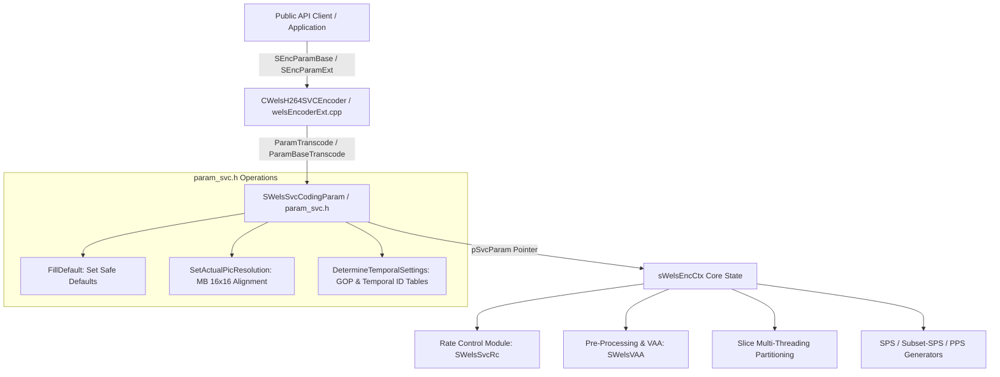
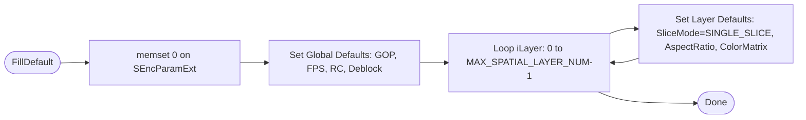
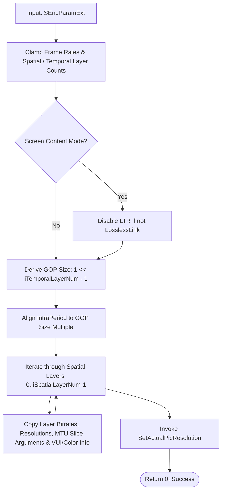
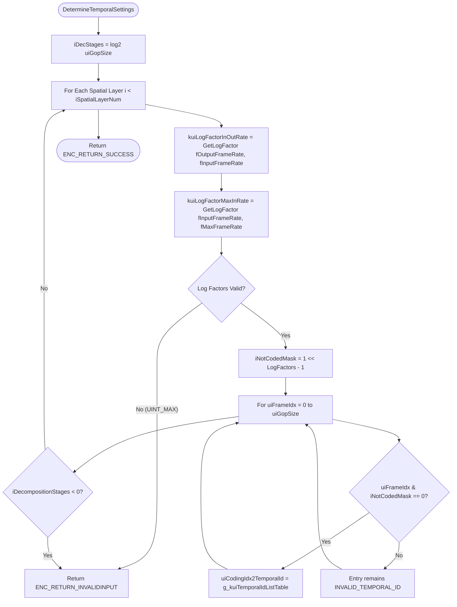

# Literate Programming Documentation: `param_svc.h`

**File:** [`codec/encoder/core/inc/param_svc.h`](openh264/codec/encoder/core/inc/param_svc.h)  
**Namespace:** `WelsEnc`  
**Subsystem:** OpenH264 Video Encoder Core  
**Role:** Encoder Parameter Representation, Configuration Validation, Temporal Scalability Mapping, and Parameter Set Cache Management.

---

## Table of Contents
1. [Architectural Overview & Purpose](#1-architectural-overview--purpose)
2. [Constants & Global Tables](#2-constants--global-tables)
   - [2.1 `INVALID_TEMPORAL_ID`](#21-invalid_temporal_id)
   - [2.2 `g_kuiTemporalIdListTable`](#22-g_kuitemporalidlisttable)
3. [Mathematical Utility Functions](#3-mathematical-utility-functions)
   - [3.1 `GetLogFactor`](#31-getlogfactor)
4. [Data Structures & Classes](#4-data-structures--classes)
   - [4.1 `SSpatialLayerInternal` (`TagDLayerParam`)](#41-sspatiallayerinternal-tagdlayerparam)
   - [4.2 `SWelsSvcCodingParam` (`TagWelsSvcCodingParam`)](#42-swelssvccodingparam-tagwelssvccodingparam)
   - [4.3 `SExistingParasetList` (`TagExistingParasetList`)](#43-sexistingparasetlist-tagexistingparasetlist)
5. [In-Depth Method Analysis](#5-in-depth-method-analysis)
   - [5.1 Parameter Default Initialization: `FillDefault`](#51-parameter-default-initialization-filldefault)
   - [5.2 Base Parameter Transcoding: `ParamBaseTranscode`](#52-base-parameter-transcoding-parambasetranscode)
   - [5.3 Base Parameter Extraction: `GetBaseParams`](#53-base-parameter-extraction-getbaseparams)
   - [5.4 Extended Parameter Transcoding & Validation: `ParamTranscode`](#54-extended-parameter-transcoding--validation-paramtranscode)
   - [5.5 Resolution Alignment: `SetActualPicResolution`](#55-resolution-alignment-setactualpicresolution)
   - [5.6 Temporal Scalability Computation: `DetermineTemporalSettings`](#56-temporal-scalability-computation-determinetemporalsettings)
6. [Dynamic Memory Management](#6-dynamic-memory-management)
   - [6.1 `AllocCodingParam`](#61-alloccodingparam)
   - [6.2 `FreeCodingParam`](#62-freecodingparam)
7. [Subsystem Interactions & Call Graph](#7-subsystem-interactions--call-graph)

---

## 1. Architectural Overview & Purpose

In the Cisco OpenH264 encoder pipeline, [`param_svc.h`](openh264/codec/encoder/core/inc/param_svc.h) defines the canonical configuration and runtime parameter structures. It acts as the bridge between the public C++ API interface ([`ISVCEncoder`](openh264/codec/api/wels/codec_api.h), [`SEncParamBase`](openh264/codec/api/wels/codec_app_def.h#L525-L535), and [`SEncParamExt`](openh264/codec/api/wels/codec_app_def.h#L540-L598)) and the encoder core internal context ([`sWelsEncCtx`](openh264/codec/encoder/core/inc/encoder_context.h#L116-L238)).



### Core Responsibilities
1. **Parameter Validation & Normalization:** Sanitizes application inputs, bounding frame rates, bitrates, quantization parameters ($QP \in [0, 51]$), slice mode constraints, and multi-threading options to conform to the H.264 / AVC and SVC specifications (ITU-T H.264 Annex G).
2. **Spatial Layer Decomposition:** Configures parameters for up to `MAX_DEPENDENCY_LAYER` ($D \in [0, 3]$) spatial layers, computing layer-specific dimensions, bitrates, profiles, and crop boundaries.
3. **Hierarchical Temporal Scalability Resolution:** Derives GOP sizes ($2^{\text{iTemporalLayerNum}-1}$), hierarchical temporal decomposition stages, and frame-index-to-temporal-ID mappings ($T_0, T_1, T_2, T_3$) based on input/output frame rate ratios.
4. **Macroblock Dimension Alignment:** Calculates padded frame dimensions aligned to $16 \times 16$ luma macroblock boundaries while tracking the active unpadded region of interest (ROI) via `SUsedPicRect`.
5. **Parameter Set Tracking:** Manages the cache of active and buffered Sequence Parameter Sets (`SWelsSPS`), Subset SPS (`SSubsetSps`), and Picture Parameter Sets (`SWelsPPS`) via [`SExistingParasetList`](openh264/codec/encoder/core/inc/param_svc.h#L541-L549).

---

## 2. Constants & Global Tables

### 2.1 `INVALID_TEMPORAL_ID`
```cpp
#define INVALID_TEMPORAL_ID ((uint8_t)0xff)
```
- **Type:** `uint8_t` (`0xFF` / `255`)
- **Purpose:** Acts as a sentinel indicator in the temporal ID mapping array `uiCodingIdx2TemporalId`. If a frame index within a virtual GOP does not correspond to a coded picture for a particular layer (due to temporal decimation/downsampling), its entry is set to `INVALID_TEMPORAL_ID`.

---

### 2.2 `g_kuiTemporalIdListTable`
```cpp
extern const uint8_t g_kuiTemporalIdListTable[MAX_TEMPORAL_LEVEL][MAX_GOP_SIZE + 1];
```
- **Definition File:** [`codec/encoder/core/src/encoder_data_tables.cpp`](openh264/codec/encoder/core/src/encoder_data_tables.cpp#L322-L339)
- **Dimensions:** `[MAX_TEMPORAL_LEVEL][MAX_GOP_SIZE + 1]` where `MAX_TEMPORAL_LEVEL = 4` and `MAX_GOP_SIZE = 16`.
- **Purpose:** Lookup table mapping the temporal decomposition stage $i_{\text{stage}} = \log_2(\text{uiGopSize})$ and the frame index within the GOP to its assigned H.264 Temporal Identifier ($T_{\text{id}}$).

| Decomposition Stage | GOP Size (`uiGopSize`) | Frame Index Sequence ($0 \dots \text{GOP}$) | Assigned Temporal IDs ($T_{\text{id}}$) |
| :---: | :---: | :---: | :--- |
| **0** | $1$ | $[0, 1]$ | `{0, 0}` |
| **1** | $2$ | $[0, 1, 2]$ | `{0, 1, 0}` |
| **2** | $4$ | $[0, 1, 2, 3, 4]$ | `{0, 2, 1, 2, 0}` |
| **3** | $8$ | $[0, 1, 2, 3, 4, 5, 6, 7, 8]$ | `{0, 3, 2, 3, 1, 3, 2, 3, 0}` |

---

## 3. Mathematical Utility Functions

### 3.1 `GetLogFactor`
```cpp
static inline uint32_t GetLogFactor (float base, float upper)
```
Calculates the base-2 logarithm of the scaling ratio between `upper` and `base`:

$$\text{LogFactor} = \log_2\left(\frac{\text{upper}}{\text{base}}\right) = \frac{\log_{10}\left(\frac{\text{upper}}{\text{base}}\right)}{\log_{10}(2.0)}$$

```cpp
static inline uint32_t GetLogFactor (float base, float upper) {
#if defined(_M_X64) && _MSC_VER == 1800
  _set_FMA3_enable(0);
#endif
  const double dLog2factor      = log10 (1.0 * upper / base) / log10 (2.0);
  const double dEpsilon         = 0.0001;
  const double dRound           = floor (dLog2factor + 0.5);

  if (dLog2factor < dRound + dEpsilon && dRound < dLog2factor + dEpsilon) {
    return (uint32_t) (dRound);
  }
  return UINT_MAX;
}
```

#### Detailed Characteristics & Corner Cases
1. **FMA3 Workaround:** On Visual Studio 2013 x64 (`_MSC_VER == 1800` and `_M_X64`), an MSVC code generation bug in Fused Multiply-Add (FMA3) could cause inaccurate floating-point evaluation in CRT transcendental functions. `_set_FMA3_enable(0)` explicitly disables FMA3 code paths for this calculation.
2. **Power-of-Two Verification:** The function verifies whether `upper / base` is an exact integer power of 2 within floating-point tolerance $\epsilon = 10^{-4}$:
   $$| \text{dLog2factor} - \text{dRound} | < \epsilon$$
3. **Return Values:**
   - Returns $\text{round}\left(\log_2\left(\frac{\text{upper}}{\text{base}}\right)\right)$ as `uint32_t` if the ratio is an exact power of 2.
   - Returns `UINT_MAX` (`0xFFFFFFFF`) if the ratio is **not** an integer power of 2, indicating invalid input/output frame rate configurations to the caller.

---

## 4. Data Structures & Classes

### 4.1 `SSpatialLayerInternal` (`TagDLayerParam`)
[SSpatialLayerInternal](openh264/codec/encoder/core/inc/param_svc.h#L82-L101) encapsulates the runtime internal state, frame tracking counters, and temporal decomposition mappings for an individual spatial dependency layer ($D$).

```cpp
typedef struct TagDLayerParam {
  int32_t       iActualWidth;                   // input source picture actual width
  int32_t       iActualHeight;                  // input source picture actual height
  int32_t       iTemporalResolution;
  int32_t       iDecompositionStages;
  uint8_t       uiCodingIdx2TemporalId[ (1 << MAX_TEMPORAL_LEVEL) + 1];

  int8_t        iHighestTemporalId;
  float         fInputFrameRate;                // input frame rate
  float         fOutputFrameRate;               // output frame rate
  uint16_t      uiIdrPicId;                     // IDR picture id: [0, 65535], used for LTR
  int32_t       iCodingIndex;
  int32_t       iFrameIndex;                    // count how many frames elapsed during coding context currently
  bool          bEncCurFrmAsIdrFlag;
  int32_t       iFrameNum;                      // current frame number coding
  int32_t       iPOC;                           // frame iPOC
#ifdef ENABLE_FRAME_DUMP
  char          sRecFileName[MAX_FNAME_LEN];    // file to be constructed
#endif
} SSpatialLayerInternal;
```

#### Field Breakdown & Semantics
| Field | Type | Description | Bit-Depth / Valid Range |
| :--- | :--- | :--- | :--- |
| `iActualWidth` | `int32_t` | Original unpadded source frame width in pixels before macroblock alignment. | $\ge 0$ |
| `iActualHeight` | `int32_t` | Original unpadded source frame height in pixels before macroblock alignment. | $\ge 0$ |
| `iTemporalResolution` | `int32_t` | Temporal downsampling log-scale factor relative to the maximum frame rate: $\log_2\left(\frac{f_{\text{max}}}{f_{\text{in}}}\right) + \log_2\left(\frac{f_{\text{in}}}{f_{\text{out}}}\right)$. | $\ge 0$ |
| `iDecompositionStages`| `int32_t` | Active temporal decomposition stages for this layer: $i_{\text{DecStages}} - i_{\text{TemporalResolution}}$. | $\ge 0$ |
| `uiCodingIdx2TemporalId` | `uint8_t[17]` | Lookup array mapping frame index in the virtual GOP ($0 \dots 16$) to its assigned `uiTemporalId`. | $[0, 3]$ or `INVALID_TEMPORAL_ID` |
| `iHighestTemporalId` | `int8_t` | Highest temporal layer identifier present in this spatial layer's GOP structure. | $[0, 3]$ |
| `fInputFrameRate` | `float` | Source input frame rate in frames per second (fps). | $[0.001, 50.0]$ |
| `fOutputFrameRate` | `float` | Encoded output frame rate in frames per second (fps). | $[0.001, f_{\text{InputFrameRate}}]$ |
| `uiIdrPicId` | `uint16_t` | IDR picture identifier signaled in slice headers for Long-Term Reference (LTR) synchronization. | $[0, 65535]$ |
| `iCodingIndex` | `int32_t` | Running sequence index of the coded picture in bitstream output order. | $\ge 0$ |
| `iFrameIndex` | `int32_t` | Total elapsed input frame counter within the current encoder context. | $\ge 0$ |
| `bEncCurFrmAsIdrFlag` | `bool` | Flag indicating whether the current frame for this layer must be encoded as an IDR keyframe. | `true` / `false` |
| `iFrameNum` | `int32_t` | H.264 `frame_num` syntax element signaled in the slice header. | $[0, 2^{\text{log2\_max\_frame\_num}} - 1]$ |
| `iPOC` | `int32_t` | Picture Order Count (POC) defining frame display / presentation ordering. | $\ge 0$ |
| `sRecFileName` | `char[256]` | Path for reconstructed YUV frame dumping (enabled when `ENABLE_FRAME_DUMP` is defined). | Null-terminated string |

---

### 4.2 `SWelsSvcCodingParam` (`TagWelsSvcCodingParam`)
[SWelsSvcCodingParam](openh264/codec/encoder/core/inc/param_svc.h#L106-L538) is the primary configuration structure in OpenH264. It inherits directly from the public [`SEncParamExt`](openh264/codec/api/wels/codec_app_def.h#L540-L598) structure and adds internal spatial layer states, cropping rectangles, and threading flags.

```cpp
typedef struct TagWelsSvcCodingParam: SEncParamExt {
  SSpatialLayerInternal sDependencyLayers[MAX_DEPENDENCY_LAYER];

  /* General */
  uint32_t uiGopSize;                      // GOP size (at maximal frame rate: 16)
  struct {
    int32_t iLeft;
    int32_t iTop;
    int32_t iWidth;
    int32_t iHeight;
  } SUsedPicRect;       // the rect in input picture that encoder actually used

  char*       pCurPath; // record current lib path such as:/pData/pData/com.wels.enc/lib/

  bool      bDeblockingParallelFlag;        // deblocking filter parallelization control flag
  int32_t   iBitsVaryPercentage;

  int8_t   iDecompStages;          // GOP size dependency
  int32_t  iMaxNumRefFrame;
  ...
} SWelsSvcCodingParam;
```

#### Internal Fields
| Field | Type | Description |
| :--- | :--- | :--- |
| `sDependencyLayers` | `SSpatialLayerInternal[4]` | Per-dependency-layer internal runtime tracking structures. |
| `uiGopSize` | `uint32_t` | Total virtual GOP size at maximal frame rate ($2^{iTemporalLayerNum - 1}$). |
| `SUsedPicRect` | `struct` | Active unpadded cropping rectangle (`iLeft`, `iTop`, `iWidth`, `iHeight`) in luminance samples. |
| `pCurPath` | `char*` | Optional filesystem path to library resource directory. |
| `bDeblockingParallelFlag`| `bool` | Enables multi-threaded slice-parallel deblocking filter operations. |
| `iBitsVaryPercentage` | `int32_t` | Permissible bit consumption variance percentage for Rate Control (default `10%`). |
| `iDecompStages` | `int8_t` | Global temporal decomposition stages: $\log_2(\text{uiGopSize}) = \text{iTemporalLayerNum} - 1$. |
| `iMaxNumRefFrame` | `int32_t` | Maximum number of reference frames maintained in the Decoded Picture Buffer (DPB). |

---

### 4.3 `SExistingParasetList` (`TagExistingParasetList`)
[SExistingParasetList](openh264/codec/encoder/core/inc/param_svc.h#L541-L549) tracks active and cached H.264 Parameter Sets across encoder re-configurations.

```cpp
typedef struct TagExistingParasetList {
  SWelsSPS            sSps[MAX_SPS_COUNT];
  SSubsetSps          sSubsetSps[MAX_SPS_COUNT];
  SWelsPPS            sPps[MAX_PPS_COUNT];

  uint32_t            uiInUseSpsNum;
  uint32_t            uiInUseSubsetSpsNum;
  uint32_t            uiInUsePpsNum;
} SExistingParasetList;
```

#### Parameter Set Capacities
- `MAX_SPS_COUNT` ($32$): Maximum Sequence Parameter Sets.
- `MAX_PPS_COUNT` ($256$): Maximum Picture Parameter Sets as defined by ITU-T H.264.
- `uiInUseSpsNum`, `uiInUseSubsetSpsNum`, `uiInUsePpsNum`: Counters tracking active parameter sets currently referenced by active slices.

---

## 5. In-Depth Method Analysis

### 5.1 Parameter Default Initialization: `FillDefault`

Populates an [`SEncParamExt`](openh264/codec/api/wels/codec_app_def.h#L540-L598) instance with robust default parameters suitable for real-time video communications.



#### Method Implementations
```cpp
static void FillDefault (SEncParamExt& param)
```
- **Line Reference:** [`param_svc.h:L132-L217`](openh264/codec/encoder/core/inc/param_svc.h#L132-L217)
- **Key Initial Values:**
  - `param.fMaxFrameRate = 30.0f` (`MAX_FRAME_RATE`)
  - `param.iComplexityMode = LOW_COMPLEXITY`
  - `param.iRCMode = RC_QUALITY_MODE`
  - `param.iMultipleThreadIdc = 1` (Single thread default)
  - `param.bUseLoadBalancing = true`
  - `param.bEnableFrameCroppingFlag = true`
  - `param.eSpsPpsIdStrategy = INCREASING_ID`
  - `param.iMaxQp = 51`, `param.iMinQp = 0`
  - `param.iUsageType = CAMERA_VIDEO_REAL_TIME`
  - `param.iIdrBitrateRatio = 400` ($4.0 \times \text{average frame bits}$)
  - Each spatial layer: `uiSliceMode = SM_SINGLE_SLICE`, `uiSliceSizeConstraint = 1500` bytes (standard Ethernet MTU payload limit).

```cpp
void FillDefault()
```
- **Line Reference:** [`param_svc.h:L219-L234`](openh264/codec/encoder/core/inc/param_svc.h#L219-L234)
- Invokes `FillDefault(*this)` and initializes internal extensions:
  - `uiGopSize = 1`
  - `iMaxNumRefFrame = AUTO_REF_PIC_COUNT` ($-1$)
  - `SUsedPicRect = {0, 0, 0, 0}`
  - `pCurPath = NULL`
  - `bDeblockingParallelFlag = false`
  - `iDecompStages = 0`
  - `iBitsVaryPercentage = 10`

---

### 5.2 Base Parameter Transcoding: `ParamBaseTranscode`

```cpp
int32_t ParamBaseTranscode (const SEncParamBase& pCodingParam)
```
- **Line Reference:** [`param_svc.h:L236-L285`](openh264/codec/encoder/core/inc/param_svc.h#L236-L285)
- **Purpose:** Converts a basic encoding parameter struct ([`SEncParamBase`](openh264/codec/api/wels/codec_app_def.h#L525-L535)) into the full [`SWelsSvcCodingParam`](openh264/codec/encoder/core/inc/param_svc.h#L106-L538) representation.

#### Algorithmic Steps
1. **Frame Rate & Resolution Clamping:**
   $$f_{\text{MaxFrameRate}} = \text{clip3}(f_{\text{in}}, 1.0, 30.0)$$
2. **Cropping ROI Initialization:**
   $$\text{SUsedPicRect.iWidth} = (i_{\text{PicWidth}} \gg 1) \ll 1, \quad \text{SUsedPicRect.iHeight} = (i_{\text{PicHeight}} \gg 1) \ll 1$$
3. **Profile Selection:**
   - If `iEntropyCodingModeFlag != 0` (CABAC), sets `uiProfileIdc = PRO_MAIN`.
   - Otherwise defaults to `PRO_BASELINE`.
   - For multi-layer SVC (`!bSimulcastAVC` and layer index $D > 0$), assigns `PRO_SCALABLE_BASELINE`.
4. **Resolution Macroblock Alignment:** Invokes `SetActualPicResolution()`.

---

### 5.3 Base Parameter Extraction: `GetBaseParams`

```cpp
void GetBaseParams (SEncParamBase* pCodingParam)
```
- **Line Reference:** [`param_svc.h:L286-L293`](openh264/codec/encoder/core/inc/param_svc.h#L286-L293)
- **Purpose:** Exports internal core parameters back to the minimal public [`SEncParamBase`](openh264/codec/api/wels/codec_app_def.h#L525-L535) structure.

```cpp
pCodingParam->iUsageType     = iUsageType;
pCodingParam->iPicWidth      = iPicWidth;
pCodingParam->iPicHeight     = iPicHeight;
pCodingParam->iTargetBitrate = iTargetBitrate;
pCodingParam->iRCMode        = iRCMode;
pCodingParam->fMaxFrameRate  = fMaxFrameRate;
```

---

### 5.4 Extended Parameter Transcoding & Validation: `ParamTranscode`

```cpp
int32_t ParamTranscode (const SEncParamExt& pCodingParam)
```
- **Line Reference:** [`param_svc.h:L294-L476`](openh264/codec/encoder/core/inc/param_svc.h#L294-L476)
- **Purpose:** Primary parameter parser and validator for full SVC encoding configurations passed via [`CWelsH264SVCEncoder::InitializeExt`](openh264/codec/encoder/plus/src/welsEncoderExt.cpp#L226) or `SetOption()`.

#### Step-by-Step Validation & Transcoding Logic



1. **Screen Content vs. LTR Incompatibility:**
   If `iUsageType == SCREEN_CONTENT_REAL_TIME` and `!bIsLosslessLink`, Long-Term Reference (LTR) is disabled (`bEnableLongTermReference = false`) because screen content coding optimizations rely on lossless/exact reference matching.
2. **Layer Count Clamping:**
   - Spatial Layers: $i_{\text{SpatialLayerNum}} = \text{clip3}(i_{\text{in}}, 1, 4)$
   - Temporal Layers: $i_{\text{TemporalLayerNum}} = \text{clip3}(i_{\text{in}}, 1, 4)$
3. **GOP Size & Decomposition Stage Derivation:**
   $$\text{uiGopSize} = 1 \ll (i_{\text{TemporalLayerNum}} - 1)$$
   $$i_{\text{DecompStages}} = i_{\text{TemporalLayerNum}} - 1$$
4. **Intra Period Alignment:**
   If `uiIntraPeriod` is not a multiple of `uiGopSize`, it is rounded up to the nearest multiple:
   $$\text{uiIntraPeriod} = \left\lceil \frac{\text{uiIntraPeriod} + \text{uiGopSize} - 1}{\text{uiGopSize}} \right\rceil \times \text{uiGopSize}$$
5. **Spatial Layer Inheritance Fallbacks:**
   For single-layer encoding ($i_{\text{SpatialLayerNum}} = 1, i_{\text{IdxSpatial}} = 0$), if layer dimensions or bitrates are unspecified ($0$), they automatically inherit top-level picture dimensions and bitrates:
   $$\text{iVideoWidth} \leftarrow i_{\text{PicWidth}}, \quad \text{iVideoHeight} \leftarrow i_{\text{PicHeight}}, \quad \text{iSpatialBitrate} \leftarrow i_{\text{TargetBitrate}}$$

---

### 5.5 Resolution Alignment: `SetActualPicResolution`

```cpp
void SetActualPicResolution()
```
- **Line Reference:** [`param_svc.h:L480-L491`](openh264/codec/encoder/core/inc/param_svc.h#L480-L491)
- **Purpose:** Ensures the internal video width and height of each spatial layer are aligned to standard $16 \times 16$ macroblock boundaries (`MB_WIDTH_LUMA = 16`, `MB_HEIGHT_LUMA = 16`).

$$\text{iVideoWidth}_{\text{aligned}} = \text{WELS\_ALIGN}(\text{iActualWidth}, 16) = (\text{iActualWidth} + 15) \ \& \ (\sim 15)$$
$$\text{iVideoHeight}_{\text{aligned}} = \text{WELS\_ALIGN}(\text{iActualHeight}, 16) = (\text{iActualHeight} + 15) \ \& \ (\sim 15)$$

```cpp
void SetActualPicResolution() {
  int32_t iSpatialIdx = iSpatialLayerNum - 1;
  for (; iSpatialIdx >= 0; iSpatialIdx --) {
    SSpatialLayerInternal* pDlayerInternal = &sDependencyLayers[iSpatialIdx];
    SSpatialLayerConfig* pDlayer =  &sSpatialLayers[iSpatialIdx];

    pDlayerInternal->iActualWidth = pDlayer->iVideoWidth;
    pDlayerInternal->iActualHeight = pDlayer->iVideoHeight;
    pDlayer->iVideoWidth = WELS_ALIGN (pDlayerInternal->iActualWidth, MB_WIDTH_LUMA);
    pDlayer->iVideoHeight = WELS_ALIGN (pDlayerInternal->iActualHeight, MB_HEIGHT_LUMA);
  }
}
```

---

### 5.6 Temporal Scalability Computation: `DetermineTemporalSettings`

```cpp
int32_t DetermineTemporalSettings()
```
- **Line Reference:** [`param_svc.h:L498-L536`](openh264/codec/encoder/core/inc/param_svc.h#L498-L536)
- **Purpose:** Constructs the temporal ID lookup tables (`uiCodingIdx2TemporalId`) for each spatial layer based on frame rate decimation factors.



#### Mathematical Formulation
1. **Temporal Log Factors:**
   $$L_{\text{InOut}} = \log_2\left(\frac{f_{\text{Input}}}{f_{\text{Output}}}\right), \quad L_{\text{MaxIn}} = \log_2\left(\frac{f_{\text{Max}}}{f_{\text{Input}}}\right)$$
   If either ratio is not an exact power of 2, the function immediately aborts and returns `ENC_RETURN_INVALIDINPUT`.
2. **Subsampling Mask:**
   $$\text{iNotCodedMask} = 2^{L_{\text{InOut}} + L_{\text{MaxIn}}} - 1$$
   A frame index `uiFrameIdx` within the GOP is coded if and only if:
   $$(\text{uiFrameIdx} \ \& \ \text{iNotCodedMask}) == 0$$
3. **Decomposition Stage Calculation:**
   $$\text{iDecompositionStages} = i_{\text{DecStages}} - L_{\text{MaxIn}} - L_{\text{InOut}}$$
   If $\text{iDecompositionStages} < 0$, it returns `ENC_RETURN_INVALIDINPUT`.

---

## 6. Dynamic Memory Management

Parameter structures in OpenH264 are allocated and deallocated through the aligned memory manager [`CMemoryAlign`](openh264/codec/common/inc/memory_align.h) to ensure cache-line alignment and prevent memory fragmentation.

### 6.1 `AllocCodingParam`
```cpp
static inline int32_t AllocCodingParam (SWelsSvcCodingParam** pParam, CMemoryAlign* pMa)
```
- **Line Reference:** [`param_svc.h:L560-L572`](openh264/codec/encoder/core/inc/param_svc.h#L560-L572)
- **Behavior:**
  1. Validates `pParam` and memory allocator `pMa`.
  2. If `*pParam` already points to an allocated object, it frees the existing memory first via `FreeCodingParam`.
  3. Invokes `pMa->WelsMallocz(sizeof(SWelsSvcCodingParam), "SWelsSvcCodingParam")` to allocate zero-initialized memory.
  4. Returns `0` on success, or `1` on allocation failure.

---

### 6.2 `FreeCodingParam`
```cpp
static inline int32_t FreeCodingParam (SWelsSvcCodingParam** pParam, CMemoryAlign* pMa)
```
- **Line Reference:** [`param_svc.h:L552-L558`](openh264/codec/encoder/core/inc/param_svc.h#L552-L558)
- **Behavior:**
  1. Checks for null pointers (`pParam == NULL || *pParam == NULL || pMa == NULL`).
  2. Releases memory via `pMa->WelsFree(*pParam, "SWelsSvcCodingParam")`.
  3. Sets `*pParam = NULL` to prevent dangling pointers.
  4. Returns `0` on success.

---

## 7. Subsystem Interactions & Call Graph

[`SWelsSvcCodingParam`](openh264/codec/encoder/core/inc/param_svc.h#L106-L538) is referenced across virtually all OpenH264 encoder subsystems:

| Subsystem | Source File | Usage & Interaction |
| :--- | :--- | :--- |
| **Encoder Facade** | [`welsEncoderExt.cpp`](openh264/codec/encoder/plus/src/welsEncoderExt.cpp) | Parses `SEncParamExt` inputs via `ParamTranscode()` during `InitializeExt()` and `SetOption()`. |
| **Encoder Core** | [`encoder.cpp`](openh264/codec/encoder/core/src/encoder.cpp) | Stores active `SWelsSvcCodingParam` in `pEncCtx->pSvcParam` and initializes spatial layer buffers. |
| **Rate Control** | [`ratectl.cpp`](openh264/codec/encoder/core/src/ratectl.cpp) | Reads `iTargetBitrate`, `fMaxFrameRate`, `uiGopSize`, and `iBitsVaryPercentage` to budget bits across VGOP frames. |
| **Slice Partitioning** | [`slice_multi_threading.cpp`](openh264/codec/encoder/core/src/slice_multi_threading.cpp) | Inspects `sSliceArgument` to split macroblocks across thread workers (`SM_FIXEDSLCNUM_SLICE`, `SM_SIZELIMITED_SLICE`). |
| **Reference Frame Manager**| [`ref_list_mgr_svc.cpp`](openh264/codec/encoder/core/src/ref_list_mgr_svc.cpp) | Reads `bEnableLongTermReference`, `iLTRRefNum`, and `uiCodingIdx2TemporalId` for reference list construction. |
| **Parameter Set Generator**| [`paraset_strategy.cpp`](openh264/codec/encoder/core/src/paraset_strategy.cpp) | Generates `SWelsSPS`, `SSubsetSps`, and `SWelsPPS` headers based on `eSpsPpsIdStrategy` and profile/level constraints. |
