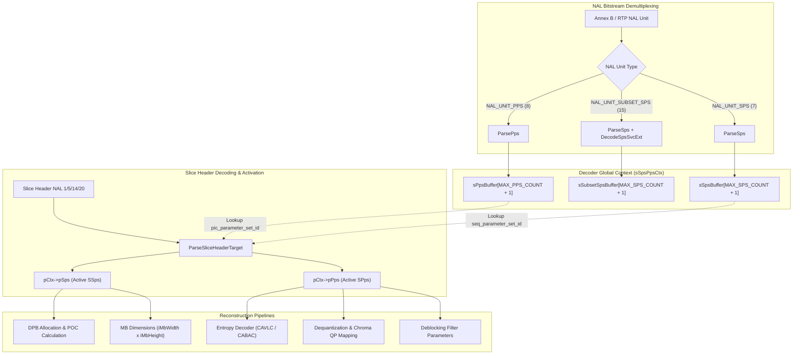
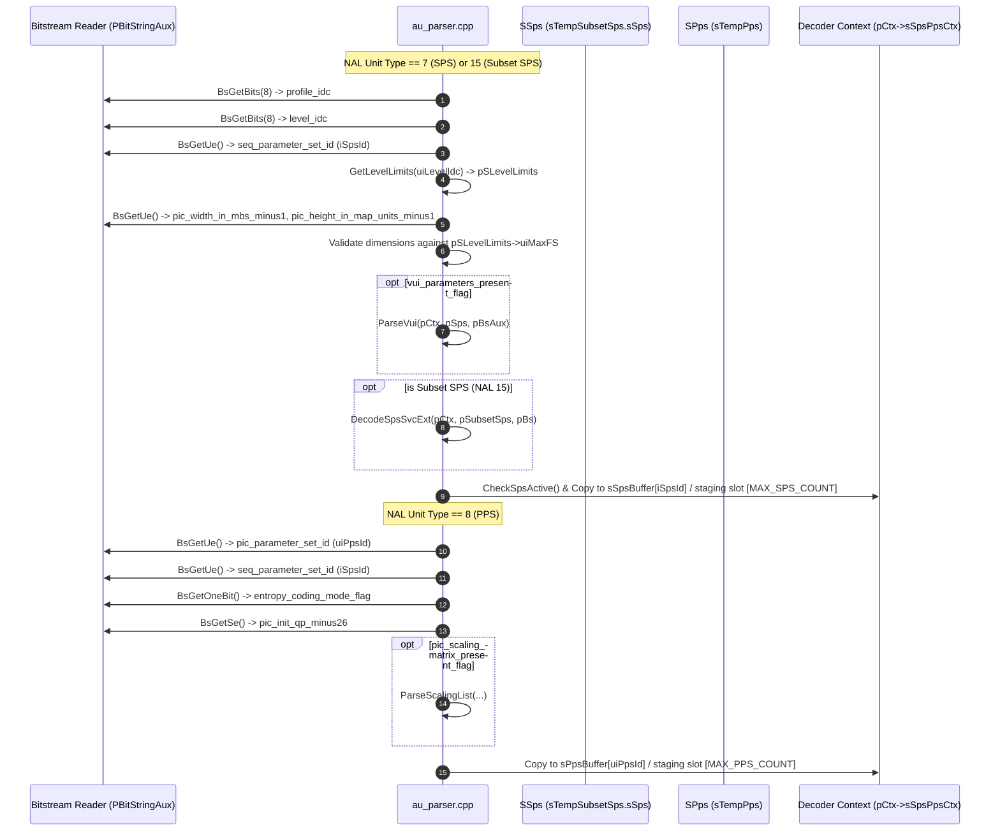
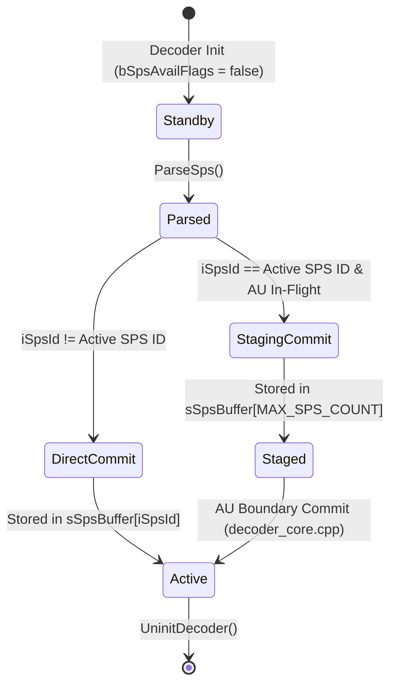

# Literate Programming Documentation: `parameter_sets.h`

**File Path:** [`codec/decoder/core/inc/parameter_sets.h`](openh264/codec/decoder/core/inc/parameter_sets.h)  
**Subsystem:** H.264 / AVC & SVC Video Decoder Core  
**Namespace:** `WelsDec`

---

## Table of Contents
1. [Module Overview & Architectural Purpose](#1-module-overview--architectural-purpose)
2. [Data Structure Reference](#2-data-structure-reference)
   - [2.1 `SVui` / `TagVui` (Video Usability Information)](#21-svui--tagvui-video-usability-information)
   - [2.2 `SSps` / `TagSps` (Sequence Parameter Set)](#22-ssps--tagsps-sequence-parameter-set)
   - [2.3 `SSpsSvcExt` / `TagSpsSvcExt` (SVC SPS Extension)](#23-sspssvcext--tagspssvcext-svc-sps-extension)
   - [2.4 `SSubsetSps` / `TagSubsetSps` (Subset Sequence Parameter Set)](#24-ssubsetsps--tagsubsetsps-subset-sequence-parameter-set)
   - [2.5 `SPps` / `TagPps` (Picture Parameter Set)](#25-spps--tagpps-picture-parameter-set)
3. [Bitstream Parsing Algorithms & Decoding Pipelines](#3-bitstream-parsing-algorithms--decoding-pipelines)
   - [3.1 `ParseSps()`](#31-parsesps)
   - [3.2 `DecodeSpsSvcExt()`](#32-decodespssvcext)
   - [3.3 `ParsePps()`](#33-parsepps)
   - [3.4 `ParseVui()`](#34-parsevui)
   - [3.5 `ParseScalingList()` & `SetScalingListValue()`](#35-parsescalinglist--setscalinglistvalue)
   - [3.6 `ResetFmoList()`](#36-resetfmolist)
4. [Memory Architecture & Lifecycle Management](#4-memory-architecture--lifecycle-management)
5. [Mathematical Formulations & Syntax Semantics](#5-mathematical-formulations--syntax-semantics)
6. [Cross-File Linkages & Reference Map](#6-cross-file-linkages--reference-map)

---

## 1. Module Overview & Architectural Purpose

In the H.264/AVC (ISO/IEC 14496-10 / ITU-T Rec. H.264) and SVC (Scalable Video Coding Annex G) video coding standards, sequence-level and picture-level configuration parameters are decoupled from slice payload data. Rather than repeating heavy spatial, timing, quantization, and entropy coding headers in every video slice, these parameters are transmitted out-of-band or in dedicated Network Abstraction Layer (NAL) units:

* **SPS (Sequence Parameter Set, NAL Unit Type 7):** Contains stream-wide metadata including profile, level, picture dimensions in macroblocks, frame cropping rectangles, Picture Order Count (POC) decoding modes, reference frame buffer capacities, scaling matrices, and Video Usability Information (VUI).
* **Subset SPS (Subset Sequence Parameter Set, NAL Unit Type 15):** Extends the base SPS structure for Scalable Video Coding (SVC) layers, defining Extended Spatial Scalability (ESS), inter-layer deblocking controls, and chroma phase alignment.
* **PPS (Picture Parameter Set, NAL Unit Type 8):** Contains picture-wide parameters referenced by slices via `pic_parameter_set_id`, including entropy coding mode (CAVLC vs CABAC), initial quantization parameters ($QP_Y$, $QS_Y$, $\Delta QP_{Cb}$, $\Delta QP_{Cr}$), Flexible Macroblock Ordering (FMO) slice group definitions, deblocking filter controls, and 8x8 transform flags.

The header file [`parameter_sets.h`](openh264/codec/decoder/core/inc/parameter_sets.h) declares the core C++ data structures that store, organize, and manage these active and buffered parameter sets within the OpenH264 decoder engine.



---

## 2. Data Structure Reference

All structures reside inside the `WelsDec` C++ namespace and are defined with C linkage-compatible `typedef struct` syntax.

```
codec/decoder/core/inc/parameter_sets.h
├── SVui / TagVui                 # Video Usability Information (Annex E)
├── SSps / TagSps                 # Sequence Parameter Set (Section 7.3.2.1.1)
├── SSpsSvcExt / TagSpsSvcExt     # SVC SPS Extension (Annex G / Section G.7.3.2.1.4)
├── SSubsetSps / TagSubsetSps     # Subset Sequence Parameter Set
└── SPps / TagPps                 # Picture Parameter Set (Section 7.3.2.2)
```

---

### 2.1 `SVui` / `TagVui` (Video Usability Information)

The [`SVui`](openh264/codec/decoder/core/inc/parameter_sets.h#L42-L74) structure stores decoded syntax elements from the optional Annex E Video Usability Information (VUI) bitstream block.

```cpp
typedef struct TagVui {
  bool bAspectRatioInfoPresentFlag;
  uint32_t uiAspectRatioIdc;
  uint32_t uiSarWidth;
  uint32_t uiSarHeight;
  bool bOverscanInfoPresentFlag;
  bool bOverscanAppropriateFlag;
  bool bVideoSignalTypePresentFlag;
  uint8_t uiVideoFormat;
  bool bVideoFullRangeFlag;
  bool bColourDescripPresentFlag;
  uint8_t uiColourPrimaries;
  uint8_t uiTransferCharacteristics;
  uint8_t uiMatrixCoeffs;
  bool bChromaLocInfoPresentFlag;
  uint32_t uiChromaSampleLocTypeTopField;
  uint32_t uiChromaSampleLocTypeBottomField;
  bool bTimingInfoPresentFlag;
  uint32_t uiNumUnitsInTick;
  uint32_t uiTimeScale;
  bool bFixedFrameRateFlag;
  bool bNalHrdParamPresentFlag;
  bool bVclHrdParamPresentFlag;
  bool bPicStructPresentFlag;
  bool bBitstreamRestrictionFlag;
  bool bMotionVectorsOverPicBoundariesFlag;
  uint32_t uiMaxBytesPerPicDenom;
  uint32_t uiMaxBitsPerMbDenom;
  uint32_t uiLog2MaxMvLengthHorizontal;
  uint32_t uiLog2MaxMvLengthVertical;
  uint32_t uiMaxNumReorderFrames;
  uint32_t uiMaxDecFrameBuffering;
} SVui, *PVui;
```

#### Detailed Field Breakdown

| Field Name | Type | Bit-Depth / Range | Syntax Element / Semantics |
| :--- | :--- | :--- | :--- |
| `bAspectRatioInfoPresentFlag` | `bool` | 1 bit (`0/1`) | `aspect_ratio_info_present_flag`. Indicates whether `aspect_ratio_idc` is present in the bitstream. |
| `uiAspectRatioIdc` | `uint32_t` | 8 bits (`0..255`) | `aspect_ratio_idc`. Aspect ratio index code. Values `1..16` map to standard Sample Aspect Ratios ($SAR$). Value `255` indicates `EXTENDED_SAR`. |
| `uiSarWidth` | `uint32_t` | 16 bits (`1..65535`) | `sar_width`. Horizontal size of the sample aspect ratio in arbitrary units. |
| `uiSarHeight` | `uint32_t` | 16 bits (`1..65535`) | `sar_height`. Vertical size of the sample aspect ratio in the same units as `uiSarWidth`. |
| `bOverscanInfoPresentFlag` | `bool` | 1 bit (`0/1`) | `overscan_info_present_flag`. Indicates whether overscan appropriateness flag is present. |
| `bOverscanAppropriateFlag` | `bool` | 1 bit (`0/1`) | `overscan_appropriate_flag`. If true, the output cropped picture is suitable for display using overscan. |
| `bVideoSignalTypePresentFlag` | `bool` | 1 bit (`0/1`) | `video_signal_type_present_flag`. Controls presence of video format, full-range flag, and color descriptions. |
| `uiVideoFormat` | `uint8_t` | 3 bits (`0..5`) | `video_format`. `0`=Component, `1`=PAL, `2`=NTSC, `3`=SECAM, `4`=MAC, `5`=Unspecified. |
| `bVideoFullRangeFlag` | `bool` | 1 bit (`0/1`) | `video_full_range_flag`. `0` = Studio swing ($Y \in [16, 235], Cb/Cr \in [16, 240]$); `1` = Full range ($[0, 255]$). |
| `bColourDescripPresentFlag` | `bool` | 1 bit (`0/1`) | `colour_description_present_flag`. Controls presence of color primaries, transfer characteristics, and matrix coefficients. |
| `uiColourPrimaries` | `uint8_t` | 8 bits (`0..255`) | `colour_primaries`. Chromaticity coordinates of source primaries (e.g., BT.709, BT.470, SMPTE 170M, BT.2020). |
| `uiTransferCharacteristics` | `uint8_t` | 8 bits (`0..255`) | `transfer_characteristics`. Opto-electronic transfer characteristic function (e.g., BT.709, linear, SMPTE 240M, IEC 61966-2-1). |
| `uiMatrixCoeffs` | `uint8_t` | 8 bits (`0..255`) | `matrix_coefficients`. Luma/chroma transformation matrix coefficients (e.g., BT.709, FCC, BT.470BG, SMPTE 170M, YCgCo, BT.2020). |
| `bChromaLocInfoPresentFlag` | `bool` | 1 bit (`0/1`) | `chroma_loc_info_present_flag`. Indicates presence of chroma sample location types for top and bottom fields. |
| `uiChromaSampleLocTypeTopField` | `uint32_t` | `ue(v)` (`0..5`) | `chroma_sample_loc_type_top_field`. Location of chroma samples relative to luma samples in top field. |
| `uiChromaSampleLocTypeBottomField` | `uint32_t` | `ue(v)` (`0..5`) | `chroma_sample_loc_type_bottom_field`. Location of chroma samples in bottom field. |
| `bTimingInfoPresentFlag` | `bool` | 1 bit (`0/1`) | `timing_info_present_flag`. Indicates presence of clock tick and timescale timing information. |
| `uiNumUnitsInTick` | `uint32_t` | 32 bits ($\ge 1$) | `num_units_in_tick`. Number of time units corresponding to one increment of a clock tick counter. |
| `uiTimeScale` | `uint32_t` | 32 bits ($\ge 1$) | `time_scale`. Number of time units that pass in one second (e.g., 60000 for 29.97/59.94 fps streams). |
| `bFixedFrameRateFlag` | `bool` | 1 bit (`0/1`) | `fixed_frame_rate_flag`. Indicates whether the picture output temporal distance is constant. |
| `bNalHrdParamPresentFlag` | `bool` | 1 bit (`0/1`) | `nal_hrd_parameters_present_flag`. Indicates presence of NAL Hypothetical Reference Decoder (HRD) parameters. |
| `bVclHrdParamPresentFlag` | `bool` | 1 bit (`0/1`) | `vcl_hrd_parameters_present_flag`. Indicates presence of VCL HRD parameters. |
| `bPicStructPresentFlag` | `bool` | 1 bit (`0/1`) | `pic_struct_present_flag`. If true, indicates picture timing SEI messages contain picture structure syntax. |
| `bBitstreamRestrictionFlag` | `bool` | 1 bit (`0/1`) | `bitstream_restriction_flag`. Controls presence of decoder buffering, motion vector, and reorder constraints. |
| `bMotionVectorsOverPicBoundariesFlag` | `bool` | 1 bit (`0/1`) | `motion_vectors_over_pic_boundaries_flag`. Indicates whether motion vectors can point outside picture boundaries. |
| `uiMaxBytesPerPicDenom` | `uint32_t` | `ue(v)` (`0..16`) | `max_bytes_per_pic_denom`. Upper bound on maximum byte size per picture. |
| `uiMaxBitsPerMbDenom` | `uint32_t` | `ue(v)` (`0..16`) | `max_bits_per_mb_denom`. Upper bound on maximum coded bit count per macroblock. |
| `uiLog2MaxMvLengthHorizontal` | `uint32_t` | `ue(v)` (`0..16`) | `log2_max_mv_length_horizontal`. Maximum horizontal motion vector component magnitude in quarter-pel units ($< 2^{\text{val}}$). |
| `uiLog2MaxMvLengthVertical` | `uint32_t` | `ue(v)` (`0..16`) | `log2_max_mv_length_vertical`. Maximum vertical motion vector component magnitude in quarter-pel units ($< 2^{\text{val}}$). |
| `uiMaxNumReorderFrames` | `uint32_t` | `ue(v)` (`0..16`) | `max_num_reorder_frames`. Maximum number of frames that precede any frame in display order but succeed it in decode order. |
| `uiMaxDecFrameBuffering` | `uint32_t` | `ue(v)` (`0..16`) | `max_dec_frame_buffering`. Maximum required capacity of the Decoded Picture Buffer (DPB) in frame storage buffers. |

---

### 2.2 `SSps` / `TagSps` (Sequence Parameter Set)

The [`SSps`](openh264/codec/decoder/core/inc/parameter_sets.h#L77-L129) structure encapsulates the active parameters of an H.264 Sequence Parameter Set.

```cpp
typedef struct TagSps {
  int32_t       iSpsId;
  uint32_t      iMbWidth;
  uint32_t      iMbHeight;
  uint32_t      uiTotalMbCount;

  uint32_t      uiLog2MaxFrameNum;
  uint32_t      uiPocType;
  /* POC type 0 */
  int32_t       iLog2MaxPocLsb;
  /* POC type 1 */
  int32_t       iOffsetForNonRefPic;

  int32_t       iOffsetForTopToBottomField;
  int32_t       iNumRefFramesInPocCycle;
  int8_t        iOffsetForRefFrame[256];
  int32_t       iNumRefFrames;

  SPosOffset    sFrameCrop;

  ProfileIdc    uiProfileIdc;
  uint8_t       uiLevelIdc;
  uint8_t       uiChromaFormatIdc;
  uint8_t       uiChromaArrayType;

  uint8_t       uiBitDepthLuma;
  uint8_t       uiBitDepthChroma;
  /* TO BE CONTINUE: POC type 1 */
  bool          bDeltaPicOrderAlwaysZeroFlag;
  bool          bGapsInFrameNumValueAllowedFlag;

  bool          bFrameMbsOnlyFlag;
  bool          bMbaffFlag;
  bool          bDirect8x8InferenceFlag;
  bool          bFrameCroppingFlag;

  bool          bVuiParamPresentFlag;
  bool          bConstraintSet0Flag;
  bool          bConstraintSet1Flag;
  bool          bConstraintSet2Flag;
  bool          bConstraintSet3Flag;
  bool          bSeparateColorPlaneFlag;
  bool          bQpPrimeYZeroTransfBypassFlag;
  bool          bSeqScalingMatrixPresentFlag;
  bool          bSeqScalingListPresentFlag[12];
  uint8_t       iScalingList4x4[6][16];
  uint8_t       iScalingList8x8[6][64];
  SVui          sVui;
  const SLevelLimits* pSLevelLimits;
} SSps, *PSps;
```

#### Detailed Field Breakdown

| Field Name | Type | Bitstream Range / Source | Description & Architectural Impact |
| :--- | :--- | :--- | :--- |
| `iSpsId` | `int32_t` | `0..31` (`MAX_SPS_COUNT - 1`) | `seq_parameter_set_id`. Uniquely identifies this SPS for reference by PPS. Checked against `MAX_SPS_COUNT`. |
| `iMbWidth` | `uint32_t` | `1..1024` (`MAX_MB_SIZE`) | Picture width in macroblocks ($16$ pixels per MB): $\text{iMbWidth} = \text{pic\_width\_in\_mbs\_minus1} + 1$. |
| `iMbHeight` | `uint32_t` | `1..1024` (`MAX_MB_SIZE`) | Picture height in macroblock map units: $\text{iMbHeight} = \text{pic\_height\_in\_map\_units\_minus1} + 1$. |
| `uiTotalMbCount` | `uint32_t` | `iMbWidth * iMbHeight` | Total macroblock count in a frame. Verified against level limits $uiMaxFS$. Used in slice decoding bounds. |
| `uiLog2MaxFrameNum` | `uint32_t` | `4..16` | Derived as $4 + \text{log2\_max\_frame\_num\_minus4}$. Modulo arithmetic limit for `frame_num`: $\text{MaxFrameNum} = 2^{\text{uiLog2MaxFrameNum}}$. |
| `uiPocType` | `uint32_t` | `0, 1, 2` | `pic_order_cnt_type`. Defines the algorithm for calculating Picture Order Count (POC). OpenH264 supports types 0, 1, and 2. |
| `iLog2MaxPocLsb` | `int32_t` | `4..16` | POC Type 0: Derived as $4 + \text{log2\_max\_pic\_order\_cnt\_lsb\_minus4}$. $\text{MaxPicOrderCntLsb} = 2^{\text{iLog2MaxPocLsb}}$. |
| `iOffsetForNonRefPic` | `int32_t` | `se(v)` | POC Type 1: Expected POC delta for non-reference pictures. |
| `iOffsetForTopToBottomField`| `int32_t` | `se(v)` | POC Type 1: Expected POC delta between top and bottom fields. |
| `iNumRefFramesInPocCycle` | `int32_t` | `0..255` | POC Type 1: Number of reference frames in a cyclic POC calculation period. |
| `iOffsetForRefFrame[256]` | `int8_t` | `se(v)` array | POC Type 1: Array of POC offsets for each frame in the POC cycle. |
| `iNumRefFrames` | `int32_t` | `0..16` (`SPS_MAX_NUM_REF_FRAMES_MAX`) | `max_num_ref_frames`. Maximum number of short-term and long-term reference frames allowed in the DPB. |
| `sFrameCrop` | [`SPosOffset`](openh264/codec/decoder/core/inc/wels_common_basis.h#L59-L64) | 4 integers | Frame cropping offsets (`iLeftOffset`, `iRightOffset`, `iTopOffset`, `iBottomOffset`) in pixels. |
| `uiProfileIdc` | `ProfileIdc` (`uint8_t`) | `66, 77, 83, 86, 100` | Profile indicator (`PRO_BASELINE`, `PRO_MAIN`, `PRO_SCALABLE_BASELINE`, `PRO_SCALABLE_HIGH`, `PRO_HIGH`). |
| `uiLevelIdc` | `uint8_t` | `10..52` | Level indicator (e.g. 10=Level 1.0, 31=Level 3.1, 51=Level 5.1, 52=Level 5.2). |
| `uiChromaFormatIdc` | `uint8_t` | `0, 1` | `chroma_format_idc`. `0` = Monochrome (4:0:0), `1` = 4:2:0 YUV planar. OpenH264 enforces $\le 1$. |
| `uiChromaArrayType` | `uint8_t` | `0, 1` | Derived as `uiChromaFormatIdc` when `separate_colour_plane_flag` is 0. |
| `uiBitDepthLuma` | `uint8_t` | `8` | Luma bit depth. OpenH264 supports 8-bit luma samples ($8 + \text{bit\_depth\_luma\_minus8}$). |
| `uiBitDepthChroma` | `uint8_t` | `8` | Chroma bit depth. OpenH264 supports 8-bit chroma samples ($8 + \text{bit\_depth\_chroma\_minus8}$). |
| `bDeltaPicOrderAlwaysZeroFlag` | `bool` | 1 bit (`0/1`) | POC Type 1: If true, `delta_pic_order_cnt[0]` and `delta_pic_order_cnt[1]` are inferred as 0. |
| `bGapsInFrameNumValueAllowedFlag` | `bool` | 1 bit (`0/1`) | Specifies if missing `frame_num` values are treated as non-existing frames to be concealed. |
| `bFrameMbsOnlyFlag` | `bool` | 1 bit (`1`) | Specifies progressive frame coding. OpenH264 decoder mandates `bFrameMbsOnlyFlag == true`. |
| `bMbaffFlag` | `bool` | 1 bit (`0`) | Macroblock-Adaptive Frame-Field coding flag. (Unsupported in OpenH264, always `false`). |
| `bDirect8x8InferenceFlag`| `bool` | 1 bit (`0/1`) | Specifies the method of motion vector derivation for B-slice direct 8x8 sub-partitions. |
| `bFrameCroppingFlag` | `bool` | 1 bit (`0/1`) | Indicates presence of frame cropping offsets in `sFrameCrop`. |
| `bVuiParamPresentFlag` | `bool` | 1 bit (`0/1`) | Indicates whether the nested `sVui` structure contains valid parsed VUI parameters. |
| `bConstraintSet0..3Flag` | `bool` | 1 bit each | Profile compatibility flags (`constraint_set0_flag` through `constraint_set3_flag`). |
| `bSeparateColorPlaneFlag`| `bool` | 1 bit (`0`) | 4:4:4 separate color plane decoding flag (always `false` in OpenH264). |
| `bQpPrimeYZeroTransfBypassFlag` | `bool` | 1 bit (`0/1`) | Lossless transform bypass flag when $QP'_Y = 0$. |
| `bSeqScalingMatrixPresentFlag` | `bool` | 1 bit (`0/1`) | Specifies whether custom sequence-level dequantization scaling lists are defined. |
| `bSeqScalingListPresentFlag[12]` | `bool[12]` | 1 bit each | Presence flags for 6 4x4 scaling lists (indices 0..5) and 6 8x8 scaling lists (indices 6..11). |
| `iScalingList4x4[6][16]` | `uint8_t[6][16]` | 16 bytes each | Decoded 4x4 inverse quantization scaling matrices reordered from 1D zigzag scan order. |
| `iScalingList8x8[6][64]` | `uint8_t[6][64]` | 64 bytes each | Decoded 8x8 inverse quantization scaling matrices reordered from 8x8 zigzag scan order. |
| `sVui` | [`SVui`](#21-svui--tagvui-video-usability-information) | Struct | Embedded Video Usability Information structure. |
| `pSLevelLimits` | `const SLevelLimits*` | Pointer | Pointer to static constant entry in `g_ksLevelLimits` corresponding to `uiLevelIdc`. |

---

### 2.3 `SSpsSvcExt` / `TagSpsSvcExt` (SVC SPS Extension)

The [`SSpsSvcExt`](openh264/codec/decoder/core/inc/parameter_sets.h#L145-L158) structure contains the syntax elements defined in Annex G (Scalable Video Coding) for spatial, quality, and temporal layer scaling.

```cpp
typedef struct TagSpsSvcExt {
  SPosOffset    sSeqScaledRefLayer;

  uint8_t       uiExtendedSpatialScalability;   // ESS
  uint8_t       uiChromaPhaseXPlus1Flag;
  uint8_t       uiChromaPhaseYPlus1;
  uint8_t       uiSeqRefLayerChromaPhaseXPlus1Flag;
  uint8_t       uiSeqRefLayerChromaPhaseYPlus1;
  bool          bInterLayerDeblockingFilterCtrlPresentFlag;
  bool          bSeqTCoeffLevelPredFlag;
  bool          bAdaptiveTCoeffLevelPredFlag;
  bool          bSliceHeaderRestrictionFlag;
} SSpsSvcExt, *PSpsSvcExt;
```

#### Detailed Field Breakdown

| Field Name | Type | Range / Spec | Semantics & Usage |
| :--- | :--- | :--- | :--- |
| `sSeqScaledRefLayer` | [`SPosOffset`](openh264/codec/decoder/core/inc/wels_common_basis.h#L59-L64) | 4 signed integers | Scaled reference layer cropping offsets ($[-32768, 32767]$) applied during inter-layer spatial resampling. |
| `uiExtendedSpatialScalability` | `uint8_t` | `0..2` | Extended Spatial Scalability (ESS) mode: `0` = None (dyadic spatial scalability $1\times, 2\times$), `1` = Picture-level arbitrary cropping/scaling, `2` = Non-dyadic arbitrary ratio. OpenH264 validates $\le 2$. |
| `uiChromaPhaseXPlus1Flag` | `uint8_t` | `0..1` | Horizontal chroma sampling grid position phase shift plus 1 for current layer. |
| `uiChromaPhaseYPlus1` | `uint8_t` | `0..2` | Vertical chroma sampling grid position phase shift plus 1 for current layer. |
| `uiSeqRefLayerChromaPhaseXPlus1Flag` | `uint8_t` | `0..1` | Horizontal chroma phase shift plus 1 for the scalable base reference layer. |
| `uiSeqRefLayerChromaPhaseYPlus1` | `uint8_t` | `0..2` | Vertical chroma phase shift plus 1 for the scalable base reference layer. |
| `bInterLayerDeblockingFilterCtrlPresentFlag` | `bool` | 1 bit (`0/1`) | Specifies if inter-layer deblocking filter control syntax elements are present in slice headers. |
| `bSeqTCoeffLevelPredFlag` | `bool` | 1 bit (`0/1`) | Flag specifying sequence-level inter-layer transform coefficient prediction. |
| `bAdaptiveTCoeffLevelPredFlag` | `bool` | 1 bit (`0/1`) | Flag specifying adaptive inter-layer transform coefficient prediction. |
| `bSliceHeaderRestrictionFlag` | `bool` | 1 bit (`0/1`) | If true, indicates slice header syntax elements across scalable layers are identical. |

---

### 2.4 `SSubsetSps` / `TagSubsetSps` (Subset Sequence Parameter Set)

The [`SSubsetSps`](openh264/codec/decoder/core/inc/parameter_sets.h#L160-L166) structure aggregates a standard AVC [`SSps`](#22-ssps--tagsps-sequence-parameter-set) base with the scalable [`SSpsSvcExt`](#23-sspssvcext--tagspssvcext-svc-sps-extension) extension.

```cpp
typedef struct TagSubsetSps {
  SSps          sSps;
  SSpsSvcExt    sSpsSvcExt;
  bool          bSvcVuiParamPresentFlag;
  bool          bAdditionalExtension2Flag;
  bool          bAdditionalExtension2DataFlag;
} SSubsetSps, *PSubsetSps;
```

#### Detailed Field Breakdown

| Field Name | Type | Description |
| :--- | :--- | :--- |
| `sSps` | [`SSps`](#22-ssps--tagsps-sequence-parameter-set) | Base Sequence Parameter Set structure parsed from NAL unit type 15 payload. |
| `sSpsSvcExt` | [`SSpsSvcExt`](#23-sspssvcext--tagspssvcext-svc-sps-extension) | Scalable Video Coding extension parameters parsed via `DecodeSpsSvcExt()`. |
| `bSvcVuiParamPresentFlag` | `bool` | `svc_vui_parameters_present_flag`. Indicates presence of SVC-specific VUI parameters. |
| `bAdditionalExtension2Flag` | `bool` | Reserved future extension flag. |
| `bAdditionalExtension2DataFlag` | `bool` | Reserved future extension payload flag. |

---

### 2.5 `SPps` / `TagPps` (Picture Parameter Set)

The [`SPps`](openh264/codec/decoder/core/inc/parameter_sets.h#L169-L213) structure stores decoded syntax elements of the Picture Parameter Set (NAL unit type 8).

```cpp
typedef struct TagPps {
  int32_t       iSpsId;
  int32_t       iPpsId;

  uint32_t      uiNumSliceGroups;
  uint32_t      uiSliceGroupMapType;
  /* slice_group_map_type = 0 */
  uint32_t      uiRunLength[MAX_SLICEGROUP_IDS];
  /* slice_group_map_type = 2 */
  uint32_t      uiTopLeft[MAX_SLICEGROUP_IDS];
  uint32_t      uiBottomRight[MAX_SLICEGROUP_IDS];
  /* slice_group_map_type = 3, 4 or 5 */
  uint32_t      uiSliceGroupChangeRate;
  /* slice_group_map_type = 6 */
  uint32_t      uiPicSizeInMapUnits;
  uint32_t      uiSliceGroupId[MAX_SLICEGROUP_IDS];

  uint32_t      uiNumRefIdxL0Active;
  uint32_t      uiNumRefIdxL1Active;

  int32_t       iPicInitQp;
  int32_t       iPicInitQs;
  int32_t       iChromaQpIndexOffset[2];//cb,cr

  bool          bEntropyCodingModeFlag;
  bool          bPicOrderPresentFlag;
  bool          bSliceGroupChangeDirectionFlag;
  bool          bDeblockingFilterControlPresentFlag;

  bool          bConstainedIntraPredFlag;
  bool          bRedundantPicCntPresentFlag;
  bool          bWeightedPredFlag;
  uint8_t       uiWeightedBipredIdc;

  bool          bTransform8x8ModeFlag;
  bool          bPicScalingMatrixPresentFlag;
  bool          bPicScalingListPresentFlag[12];
  uint8_t       iScalingList4x4[6][16];
  uint8_t       iScalingList8x8[6][64];

  int32_t       iSecondChromaQPIndexOffset;
} SPps, *PPps;
```

#### Detailed Field Breakdown

| Field Name | Type | Range / Spec | Semantics & Decoding Behavior |
| :--- | :--- | :--- | :--- |
| `iSpsId` | `int32_t` | `0..31` | `seq_parameter_set_id`. Identifies the active SPS referenced by this PPS. |
| `iPpsId` | `int32_t` | `0..255` (`MAX_PPS_COUNT - 1`) | `pic_parameter_set_id`. Uniquely identifies this PPS for reference by slice headers. |
| `uiNumSliceGroups` | `uint32_t` | `1..8` (`MAX_SLICEGROUP_IDS`) | `num_slice_groups_minus1 + 1`. Total slice groups configured for Flexible Macroblock Ordering (FMO). |
| `uiSliceGroupMapType` | `uint32_t` | `0..6` | FMO Map Type: `0`=Interleaved, `1`=Dispersed, `2`=Foreground/Leftover, `3..5`=Box-out/Wipe/Raster, `6`=Explicit. OpenH264 supports `0` and `1`. |
| `uiRunLength[8]` | `uint32_t[8]` | `ue(v)` array | FMO Map Type 0: Consecutive run lengths of macroblocks per slice group. |
| `uiTopLeft[8]` | `uint32_t[8]` | `ue(v)` array | FMO Map Type 2: Top-left macroblock coordinate for foreground rectangles. |
| `uiBottomRight[8]`| `uint32_t[8]` | `ue(v)` array | FMO Map Type 2: Bottom-right macroblock coordinate for foreground rectangles. |
| `uiSliceGroupChangeRate` | `uint32_t` | `ue(v)` | FMO Map Types 3, 4, 5: Dynamic slice group change rate. |
| `uiPicSizeInMapUnits` | `uint32_t` | `ue(v)` | FMO Map Type 6: Picture size in map units for explicit mapping. |
| `uiSliceGroupId[8]` | `uint32_t[8]` | `ue(v)` array | FMO Map Type 6: Explicit slice group assignment array. |
| `uiNumRefIdxL0Active` | `uint32_t` | `1..16` (`MAX_REF_PIC_COUNT`) | Default reference list L0 active picture count: $1 + \text{num\_ref\_idx\_l0\_default\_active\_minus1}$. |
| `uiNumRefIdxL1Active` | `uint32_t` | `1..16` (`MAX_REF_PIC_COUNT`) | Default reference list L1 active picture count: $1 + \text{num\_ref\_idx\_l1\_default\_active\_minus1}$. |
| `iPicInitQp` | `int32_t` | `0..51` | Initial slice luma quantization parameter offset: $26 + \text{pic\_init\_qp\_minus26}$. |
| `iPicInitQs` | `int32_t` | `0..51` | Initial SP/SI slice quantization parameter offset: $26 + \text{pic\_init\_qs\_minus26}$. |
| `iChromaQpIndexOffset[2]` | `int32_t[2]`| `[-12, 12]` | Chroma QP offsets for Cb (index 0) and Cr (index 1) planes: $\Delta QP_{Cb}, \Delta QP_{Cr}$. |
| `bEntropyCodingModeFlag` | `bool` | 1 bit (`0/1`) | Entropy coding engine selection: `false` (`0`) = CAVLC, `true` (`1`) = CABAC. |
| `bPicOrderPresentFlag` | `bool` | 1 bit (`0/1`) | `bottom_field_pic_order_in_frame_present_flag`. Indicates presence of bottom field POC delta in slice headers. |
| `bSliceGroupChangeDirectionFlag`| `bool` | 1 bit (`0/1`) | FMO Map Types 3, 4, 5: Direction of macroblock allocation sweep. |
| `bDeblockingFilterControlPresentFlag`| `bool`| 1 bit (`0/1`) | Specifies if slice headers contain deblocking filter override parameters (`disable_deblocking_filter_idc`, $\alpha, \beta$ offsets). |
| `bConstainedIntraPredFlag`| `bool` | 1 bit (`0/1`) | Constrained Intra Prediction: If true, intra prediction cannot use spatial neighbor pixels from inter-coded macroblocks. |
| `bRedundantPicCntPresentFlag`| `bool`| 1 bit (`0/1`) | Specifies if `redundant_pic_cnt` syntax element is present in slice headers. |
| `bWeightedPredFlag` | `bool` | 1 bit (`0/1`) | Specifies if explicit weighted prediction is enabled for P and SP slices. |
| `uiWeightedBipredIdc` | `uint8_t` | `0..2` | B-slice weighted biprediction mode: `0`=Default, `1`=Explicit, `2`=Implicit. |
| `bTransform8x8ModeFlag` | `bool` | 1 bit (`0/1`) | High Profile 8x8 integer transform flag (`transform_8x8_mode_flag`). |
| `bPicScalingMatrixPresentFlag`| `bool`| 1 bit (`0/1`) | Specifies whether custom PPS-level dequantization scaling matrices are present. |
| `bPicScalingListPresentFlag[12]`| `bool[12]`| 1 bit each | Presence flags for 4x4 (0..5) and 8x8 (6..11) PPS scaling lists. |
| `iScalingList4x4[6][16]` | `uint8_t[6][16]`| 16 bytes each | PPS 4x4 dequantization scaling matrix tables. |
| `iScalingList8x8[6][64]` | `uint8_t[6][64]`| 64 bytes each | PPS 8x8 dequantization scaling matrix tables. |
| `iSecondChromaQPIndexOffset`| `int32_t`| `[-12, 12]` | High profile separate chroma QP offset for Cr plane (`second_chroma_qp_index_offset`). |

---

## 3. Bitstream Parsing Algorithms & Decoding Pipelines

The parsing implementation for all parameter set structures resides in [`codec/decoder/core/src/au_parser.cpp`](openh264/codec/decoder/core/src/au_parser.cpp).



---

### 3.1 `ParseSps()`

**File Location:** [`codec/decoder/core/src/au_parser.cpp#L925-L1324`](openh264/codec/decoder/core/src/au_parser.cpp#L925-L1324)

```cpp
int32_t ParseSps (PWelsDecoderContext pCtx, PBitStringAux pBsAux, 
                  int32_t* pPicWidth, int32_t* pPicHeight,
                  uint8_t* pSrcNal, const int32_t kSrcNalLen);
```

#### Algorithmic Workflow & Validation Sequence:
1. **Profile Validation:** Reads `profile_idc` (8 bits). Verifies profile belongs to supported set:
   $$\text{profile\_idc} \in \{66 (\text{PRO\_BASELINE}), 77 (\text{PRO\_MAIN}), 83 (\text{PRO\_SCALABLE\_BASELINE}), 86 (\text{PRO\_SCALABLE\_HIGH}), 100 (\text{PRO\_HIGH})\}$$
2. **Constraint Flags & Level Index:** Reads 6 constraint flags (`constraint_set0..5_flag`) and 2 reserved zero bits. Reads `level_idc` (8 bits).
3. **SPS Identifier Bounds Check:** Reads `seq_parameter_set_id` via unsigned Exp-Golomb `BsGetUe()`. Enforces:
   $$\text{iSpsId} < \text{MAX\_SPS\_COUNT} \quad (32)$$
   Returns `ERR_INFO_SPS_ID_OVERFLOW` on violation.
4. **Level Limits Retrieval:** Calls [`GetLevelLimits(uiLevelIdc, bConstraintSetFlags[3])`](openh264/codec/decoder/core/src/au_parser.cpp#L807) to populate `pSps->pSLevelLimits`.
5. **High Profile Syntax Extensions:** If High / Scalable profile:
   - Reads `chroma_format_idc` (validates $\le 1$, rejecting unsupported 4:2:2 / 4:4:4).
   - Reads `bit_depth_luma_minus8` and `bit_depth_chroma_minus8` (validates $== 0$, enforcing 8-bit pipeline).
   - Reads `qpprime_y_zero_transform_bypass_flag` and `seq_scaling_matrix_present_flag`.
   - If scaling matrix present, invokes `ParseScalingList()`.
6. **Frame Number & POC Parsing:**
   - $\text{uiLog2MaxFrameNum} = 4 + \text{BsGetUe}()$.
   - Reads `pic_order_cnt_type` (`0, 1, 2`).
   - If Type 0: Reads $\text{iLog2MaxPocLsb} = 4 + \text{BsGetUe}()$.
   - If Type 1: Reads `delta_pic_order_always_zero_flag`, `offset_for_non_ref_pic`, `offset_for_top_to_bottom_field`, `num_ref_frames_in_pic_order_cnt_cycle`, and loop-parses `offset_for_ref_frame[i]`.
7. **Picture Resolution Bounds Checking:**
   - Computes $\text{iMbWidth} = 1 + \text{BsGetUe}()$ and $\text{iMbHeight} = 1 + \text{BsGetUe}()$.
   - Clamps $\text{iMbWidth}, \text{iMbHeight} \le 1024$ (`MAX_MB_SIZE`).
   - Enforces total macroblock limit:
     $$\text{uiTotalMbCount} = \text{iMbWidth} \times \text{iMbHeight} \le \text{pSLevelLimits->uiMaxFS}$$
8. **Frame Cropping Calculation:**
   If `frame_cropping_flag` is true, parses 4 Exp-Golomb offsets and enforces:
   $$(\text{iLeftOffset} + \text{iRightOffset}) \le \frac{\text{iMbWidth} \times 16}{2}$$
   $$(\text{iTopOffset} + \text{iBottomOffset}) \le \frac{\text{iMbHeight} \times 16}{2}$$
9. **Active SPS Overwrite Protection:** Compares incoming `SSps` bitwise (`memcmp`) against currently active `pCtx->pSps`. If active SPS is being modified within an incomplete Access Unit, writes to staging slot `sSpsBuffer[MAX_SPS_COUNT]` and sets `OVERWRITE_SPS` in `pCtx->sSpsPpsCtx.iOverwriteFlags`. Otherwise, writes directly to `sSpsBuffer[iSpsId]`.

---

### 3.2 `DecodeSpsSvcExt()`

**File Location:** [`codec/decoder/core/src/au_parser.cpp#L736-L790`](openh264/codec/decoder/core/src/au_parser.cpp#L736-L790)

```cpp
int32_t DecodeSpsSvcExt (PWelsDecoderContext pCtx, PSubsetSps pSpsExt, PBitStringAux pBs);
```

Parses SVC-specific extension fields into [`SSpsSvcExt`](#23-sspssvcext--tagspssvcext-svc-sps-extension):
* Reads `inter_layer_deblocking_filter_control_present_flag`.
* Reads `extended_spatial_scalability_idc` (verifies $\le 2$).
* Reads chroma grid phase shift flags (`chroma_phase_x_plus1_flag`, `chroma_phase_y_plus1`).
* When ESS == 1, parses signed 16-bit reference layer cropping offsets (`seq_scaled_ref_layer_left_offset`, `top_offset`, `right_offset`, `bottom_offset`) bounded in $[-32768, 32767]$.

---

### 3.3 `ParsePps()`

**File Location:** [`codec/decoder/core/src/au_parser.cpp#L1340-L1495`](openh264/codec/decoder/core/src/au_parser.cpp#L1340-L1495)

```cpp
int32_t ParsePps (PWelsDecoderContext pCtx, PPps pPpsList, 
                  PBitStringAux pBsAux, uint8_t* pSrcNal, const int32_t kSrcNalLen);
```

#### Parsing Steps:
1. **Identifier Bounds Verification:** Reads `pic_parameter_set_id` and `seq_parameter_set_id`. Verifies $\text{uiPpsId} < \text{MAX\_PPS\_COUNT} (256)$ and $\text{iSpsId} < \text{MAX\_SPS\_COUNT} (32)$.
2. **Entropy Mode & FMO:**
   - Reads `entropy_coding_mode_flag` (0=CAVLC, 1=CABAC).
   - Reads `num_slice_groups_minus1`. If $> 0$, parses `slice_group_map_type` (rejects types $> 1$ with `ERR_INFO_UNSUPPORTED_FMOTYPE`).
3. **Reference List Defaults:** Reads `num_ref_idx_l0_default_active_minus1` and `l1`. Clamps $\le \text{MAX\_REF\_PIC\_COUNT} (16)$.
4. **Quantization Offsets:**
   - $\text{iPicInitQp} = 26 + \text{BsGetSe}()$ (validated in $[0, 51]$).
   - $\text{iPicInitQs} = 26 + \text{BsGetSe}()$ (validated in $[0, 51]$).
   - $\text{iChromaQpIndexOffset}[0] = \text{BsGetSe}()$ (validated in $[-12, 12]$).
5. **High Profile 8x8 Transform & Scaling Matrix:** If more RBSP data remains:
   - Reads `transform_8x8_mode_flag`.
   - Reads `pic_scaling_matrix_present_flag`. If true, invokes `ParseScalingList()` using the active SPS dequantization defaults.
   - Reads `second_chroma_qp_index_offset` into $\text{iChromaQpIndexOffset}[1]$.
6. **Active PPS Overwrite Protection:** Similar to SPS, copies to staging slot `sPpsBuffer[MAX_PPS_COUNT]` if active PPS is overwritten during in-flight AU decoding.

---

### 3.4 `ParseVui()`

**File Location:** [`codec/decoder/core/src/au_parser.cpp#L1505-L1658`](openh264/codec/decoder/core/src/au_parser.cpp#L1505-L1658)

Parses Annex E Video Usability Information:
* **Aspect Ratio:** Reads `aspect_ratio_idc`. If $< 17$, looks up width and height from the static aspect ratio lookup table [`g_ksVuiSampleAspectRatio`](openh264/codec/decoder/core/src/au_parser.cpp). If `EXTENDED_SAR` (255), reads explicit 16-bit `sar_width` and `sar_height`.
* **Video Signal & Colorimetry:** Parses `video_format` (3 bits), `video_full_range_flag` (1 bit), and 8-bit `colour_primaries`, `transfer_characteristics`, and `matrix_coefficients`.
* **Timing Info:** Parses 32-bit `num_units_in_tick` and `time_scale` via two consecutive 16-bit bitstream reads:
  $$\text{uiNumUnitsInTick} = (\text{code}_1 \ll 16) \mid \text{code}_2$$
  $$\text{uiTimeScale} = (\text{code}_3 \ll 16) \mid \text{code}_4$$
* **Bitstream Restrictions:** Parses decoder buffering caps, reorder limits, and maximum horizontal/vertical motion vector lengths.

---

### 3.5 `ParseScalingList()` & `SetScalingListValue()`

**File Location:** [`codec/decoder/core/src/au_parser.cpp#L1690-L1779`](openh264/codec/decoder/core/src/au_parser.cpp#L1690-L1779)

De-quantization scaling lists define custom weighting matrices for DCT transform coefficients:

```cpp
int32_t SetScalingListValue (uint8_t* pScalingList, int iScalingListNum, 
                             bool* bUseDefaultScalingMatrixFlag, PBitStringAux pBsAux);

int32_t ParseScalingList (PSps pSps, PBitStringAux pBs, bool bPPS, const bool kbTrans8x8ModeFlag,
                          bool* pScalingListPresentFlag, 
                          uint8_t (*iScalingList4x4)[16], uint8_t (*iScalingList8x8)[64]);
```

#### Delta-Scale Decoding Math:
Each scaling list entry is decoded sequentially from signed Exp-Golomb deltas:
$$\text{NextScale} = (\text{LastScale} + \text{DeltaScale} + 256) \pmod{256}$$
$$\text{ScalingList}[j] = \begin{cases} \text{LastScale} & \text{if } \text{NextScale} == 0 \\ \text{NextScale} & \text{otherwise} \end{cases}$$
The 1D decoded values are mapped to 2D matrix coordinates using the standard zigzag scan arrays:
* 4x4 Blocks: [`g_kuiZigzagScan[16]`](openh264/codec/common/src/common_tables.cpp)
* 8x8 Blocks: [`g_kuiZigzagScan8x8[64]`](openh264/codec/common/src/common_tables.cpp)

---

### 3.6 `ResetFmoList()`

**File Location:** [`codec/decoder/core/src/au_parser.cpp#L1790-L1799`](openh264/codec/decoder/core/src/au_parser.cpp#L1790-L1799)

```cpp
int32_t ResetFmoList (PWelsDecoderContext pCtx);
```

Invoked whenever a new active SPS is committed to invalidate and free existing Flexible Macroblock Ordering slice group allocation tables in `pCtx->sFmoList`, preventing stale FMO contexts across resolution or parameter set switches.

---

## 4. Memory Architecture & Lifecycle Management

Parameter set structures are held inside the decoder global context structure [`tagWelsWelsDecoderSpsPpsCTX`](openh264/codec/decoder/core/inc/decoder_context.h#L236-L265) (`sSpsPpsCtx`).

```cpp
typedef struct tagWelsWelsDecoderSpsPpsCTX {
  SPosOffset    sFrameCrop;
  SSps          sSpsBuffer[MAX_SPS_COUNT + 1];          // 32 active + 1 staging slot
  SPps          sPpsBuffer[MAX_PPS_COUNT + 1];          // 256 active + 1 staging slot
  SSubsetSps    sSubsetSpsBuffer[MAX_SPS_COUNT + 1];    // 32 active + 1 staging slot
  PSps          pActiveLayerSps[MAX_LAYER_NUM];
  bool          bAvcBasedFlag;
  bool          bSpsAvailFlags[MAX_SPS_COUNT];
  bool          bSubspsAvailFlags[MAX_SPS_COUNT];
  bool          bPpsAvailFlags[MAX_PPS_COUNT];
  int32_t       iOverwriteFlags;
} SWelsDecoderSpsPpsCTX;
```

### The Staging Slot Overwrite Idiom (`MAX_SPS_COUNT` / `MAX_PPS_COUNT`)

H.264 streams can transmit updated parameter sets at any time. However, if an updated SPS or PPS arrives while the decoder is in the middle of decoding an Access Unit (AU), immediately overwriting the active parameter set would corrupt the reconstruction of remaining slices in that AU.

To prevent this race condition:
1. **Direct Write:** If `iSpsId` is not currently referenced by active slices, it is copied directly into `sSpsBuffer[iSpsId]`.
2. **Staging Write:** If `iSpsId` matches the currently active SPS (`pCtx->pSps->iSpsId`) and AU decoding is incomplete (`pCtx->pAccessUnitList->uiAvailUnitsNum > 0`):
   - The new SPS is staged into index `MAX_SPS_COUNT` (`sSpsBuffer[32]`).
   - Bitflag `OVERWRITE_SPS` is set in `iOverwriteFlags`.
3. **Commit Phase:** At the next AU boundary in [`decoder_core.cpp`](openh264/codec/decoder/core/src/decoder_core.cpp#L2220), the decoder flushes the staged parameter set from slot `[MAX_SPS_COUNT]` to slot `[iSpsId]`, re-initializing the picture buffer pool (`pPicBuff`) and level limits safely.



---

## 5. Mathematical Formulations & Syntax Semantics

### 5.1 Picture Geometry & Macroblock Dimensions

Given `pic_width_in_mbs_minus1` and `pic_height_in_map_units_minus1`:

$$\text{iMbWidth} = \text{pic\_width\_in\_mbs\_minus1} + 1$$
$$\text{iMbHeight} = \text{pic\_height\_in\_map\_units\_minus1} + 1$$
$$\text{FrameWidthInPixels} = \text{iMbWidth} \times 16$$
$$\text{FrameHeightInPixels} = \text{iMbHeight} \times 16$$

When `bFrameCroppingFlag` is active, the display rectangle $[X_L, X_R) \times [Y_T, Y_B)$ is derived as:

$$X_L = \text{sFrameCrop.iLeftOffset} \times 2$$
$$X_R = \text{FrameWidthInPixels} - (\text{sFrameCrop.iRightOffset} \times 2)$$
$$Y_T = \text{sFrameCrop.iTopOffset} \times 2$$
$$Y_B = \text{FrameHeightInPixels} - (\text{sFrameCrop.iBottomOffset} \times 2)$$

### 5.2 Picture Order Count (POC) Derivations

* **POC Type 0:**
  $$\text{MaxPicOrderCntLsb} = 2^{\text{iLog2MaxPocLsb}}$$
  $$\text{PicOrderCnt} = \text{PicOrderCntMsb} + \text{pic\_order\_cnt\_lsb}$$
* **POC Type 1:** Uses expected linear progression defined by `iOffsetForRefFrame[i]` cycling over `iNumRefFramesInPocCycle`.
* **POC Type 2:** Directly derives POC from frame number:
  $$\text{PicOrderCnt} = 2 \times \text{FrameNum}$$

### 5.3 Chroma Quantization Parameter Calculation

Given slice luma quantization parameter $QP_Y$ and PPS chroma offsets $\Delta QP_{Cb} = \text{iChromaQpIndexOffset}[0]$ and $\Delta QP_{Cr} = \text{iChromaQpIndexOffset}[1]$:

$$qI_{Cb} = \text{Clip3}(0, 51, QP_Y + \Delta QP_{Cb})$$
$$qI_{Cr} = \text{Clip3}(0, 51, QP_Y + \Delta QP_{Cr})$$
$$QP_{Cb} = \text{g\_kuiChromaQpTable}[qI_{Cb}]$$
$$QP_{Cr} = \text{g\_kuiChromaQpTable}[qI_{Cr}]$$

where [`g_kuiChromaQpTable`](openh264/codec/common/src/common_tables.cpp) implements the non-linear high-QP compression mapping specified in ITU-T H.264 Table 8-15.

---

## 6. Cross-File Linkages & Reference Map

| Component / Symbol | Defined In | Primary Consumers / Callers | Key Architectural Interaction |
| :--- | :--- | :--- | :--- |
| [`SVui`](openh264/codec/decoder/core/inc/parameter_sets.h#L42-L74) | [`parameter_sets.h`](openh264/codec/decoder/core/inc/parameter_sets.h) | [`au_parser.cpp`](openh264/codec/decoder/core/src/au_parser.cpp) | Video usability, aspect ratio SAR tables, clock tick timing. |
| [`SSps`](openh264/codec/decoder/core/inc/parameter_sets.h#L77-L129) | [`parameter_sets.h`](openh264/codec/decoder/core/inc/parameter_sets.h) | [`au_parser.cpp`](openh264/codec/decoder/core/src/au_parser.cpp), [`decoder_core.cpp`](openh264/codec/decoder/core/src/decoder_core.cpp), [`decode_slice.cpp`](openh264/codec/decoder/core/src/decode_slice.cpp) | Sequence geometry, profile/level validation, DPB allocation, scaling lists. |
| [`SSpsSvcExt`](openh264/codec/decoder/core/inc/parameter_sets.h#L145-L158) | [`parameter_sets.h`](openh264/codec/decoder/core/inc/parameter_sets.h) | [`au_parser.cpp`](openh264/codec/decoder/core/src/au_parser.cpp) | SVC spatial scalability ESS modes, reference layer cropping offsets. |
| [`SSubsetSps`](openh264/codec/decoder/core/inc/parameter_sets.h#L160-L166) | [`parameter_sets.h`](openh264/codec/decoder/core/inc/parameter_sets.h) | [`au_parser.cpp`](openh264/codec/decoder/core/src/au_parser.cpp), [`decoder_context.h`](openh264/codec/decoder/core/inc/decoder_context.h) | Aggregation wrapper for SVC subset sequence parameter sets. |
| [`SPps`](openh264/codec/decoder/core/inc/parameter_sets.h#L169-L213) | [`parameter_sets.h`](openh264/codec/decoder/core/inc/parameter_sets.h) | [`au_parser.cpp`](openh264/codec/decoder/core/src/au_parser.cpp), [`decode_slice.cpp`](openh264/codec/decoder/core/src/decode_slice.cpp), [`fmo.cpp`](openh264/codec/decoder/core/src/fmo.cpp) | Picture quantization offsets, entropy engine selection, FMO group mapping. |
| [`ParseSps()`](openh264/codec/decoder/core/src/au_parser.cpp#L925) | [`au_parser.cpp`](openh264/codec/decoder/core/src/au_parser.cpp) | [`decoder.cpp`](openh264/codec/decoder/core/src/decoder.cpp) | Top-level entry point for NAL unit type 7 / 15 parsing. |
| [`ParsePps()`](openh264/codec/decoder/core/src/au_parser.cpp#L1340) | [`au_parser.cpp`](openh264/codec/decoder/core/src/au_parser.cpp) | [`decoder.cpp`](openh264/codec/decoder/core/src/decoder.cpp) | Top-level entry point for NAL unit type 8 parsing. |
| [`SLevelLimits`](openh264/codec/common/inc/wels_common_defs.h#L48-L60) | [`wels_common_defs.h`](openh264/codec/common/inc/wels_common_defs.h) | [`parameter_sets.h`](openh264/codec/decoder/core/inc/parameter_sets.h), [`au_parser.cpp`](openh264/codec/decoder/core/src/au_parser.cpp) | Hardware & level boundary specification constants ($uiMaxMBPS, uiMaxFS, uiMaxDPBMbs$). |
