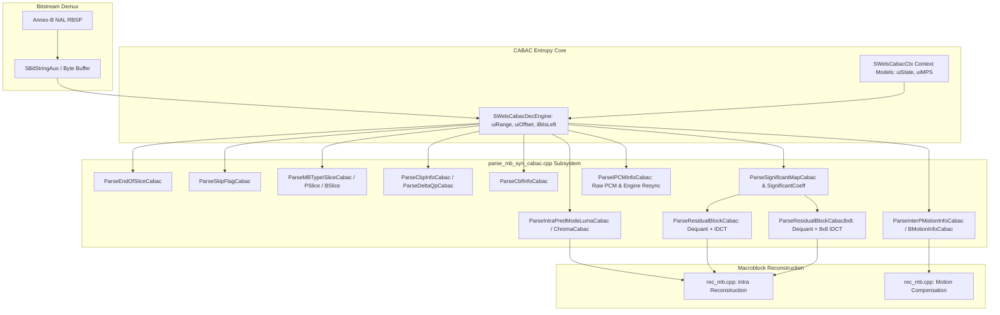
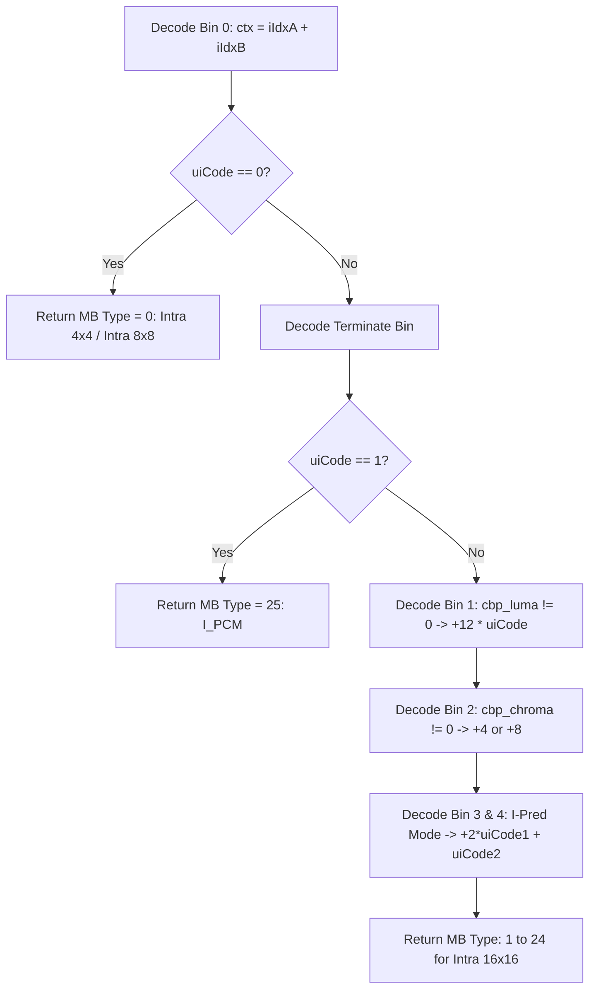
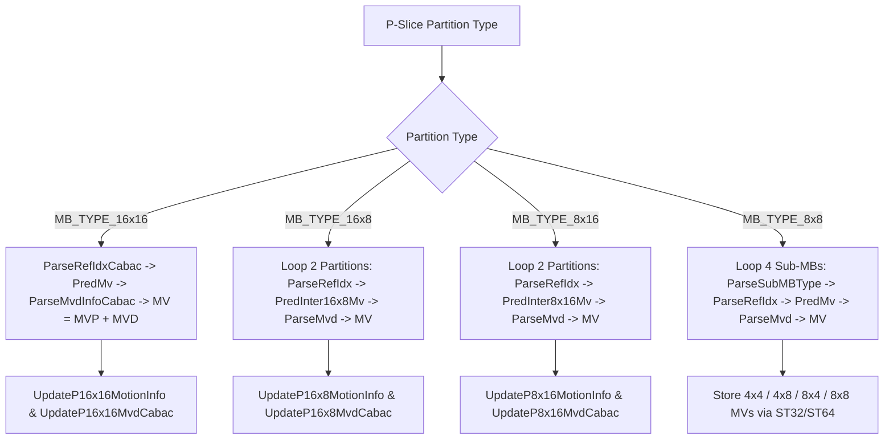
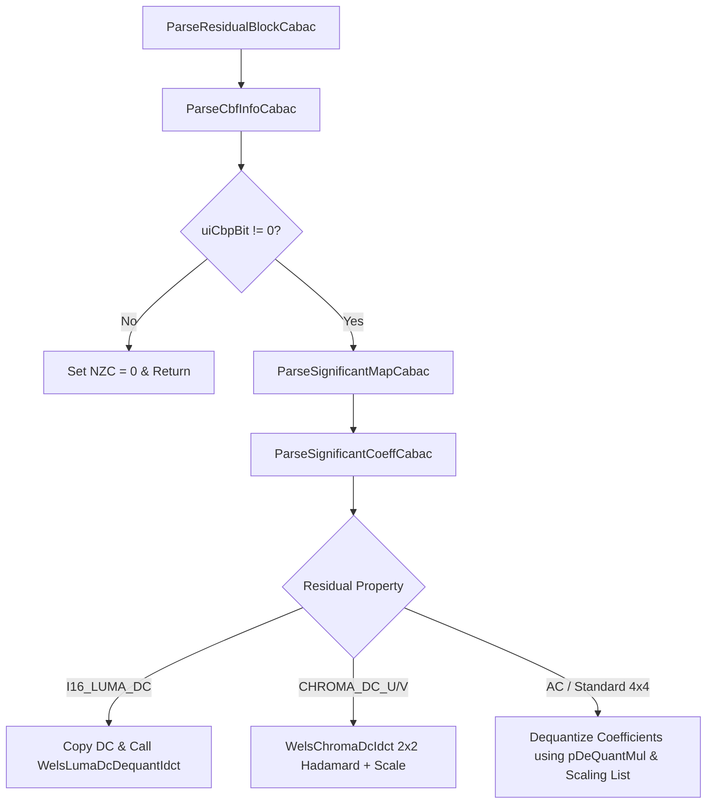
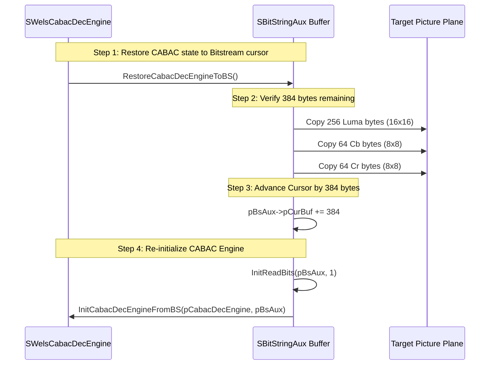

# OpenH264: CABAC Macroblock Syntax Parsing Engine (`parse_mb_syn_cabac.cpp`)

This document provides an exhaustive, literate-programming-style architectural and algorithmic breakdown of [parse_mb_syn_cabac.cpp](openh264/codec/decoder/core/src/parse_mb_syn_cabac.cpp#L1-L1566) and its header [parse_mb_syn_cabac.h](openh264/codec/decoder/core/inc/parse_mb_syn_cabac.h#L1-L90).

---

## Table of Contents
1. [Module Architecture & Subsystem Role](#1-module-architecture--subsystem-role)
2. [Data Structures, Look-up Tables & Context Offsets](#2-data-structures-look-up-tables--context-offsets)
   - [2.1 CABAC Engine & Context State Structures](#21-cabac-engine--context-state-structures)
   - [2.2 Global Context Offset Lookup Tables](#22-global-context-offset-lookup-tables)
   - [2.3 Sub-block Spatial Availability Tables](#23-sub-block-spatial-availability-tables)
3. [Macroblock Type & Header Parsing](#3-macroblock-type--header-parsing)
   - [3.1 End-of-Slice & Skip Flag Parsing](#31-end-of-slice--skip-flag-parsing)
   - [3.2 Intra Macroblock Type Parsing (I-Slice)](#32-intra-macroblock-type-parsing-i-slice)
   - [3.3 Inter Macroblock Type Parsing (P-Slice)](#33-inter-macroblock-type-parsing-p-slice)
   - [3.4 Inter Macroblock Type Parsing (B-Slice)](#34-inter-macroblock-type-parsing-b-slice)
   - [3.5 Transform Size 8x8 Flag & Sub-MB Partition Parsing](#35-transform-size-8x8-flag--sub-mb-partition-parsing)
4. [Intra Prediction Mode Parsing](#4-intra-prediction-mode-parsing)
   - [4.1 Luma Intra Prediction Mode Parsing](#41-luma-intra-prediction-mode-parsing)
   - [4.2 Chroma Intra Prediction Mode Parsing](#42-chroma-intra-prediction-mode-parsing)
5. [Inter Motion Information & Reference Vector Reconstruction](#5-inter-motion-information--reference-vector-reconstruction)
   - [5.1 Reference Index Parsing (`ParseRefIdxCabac`)](#51-reference-index-parsing-parserefidxcabac)
   - [5.2 Motion Vector Difference Parsing (`ParseMvdInfoCabac`)](#52-motion-vector-difference-parsing-parsemvdinfocabac)
   - [5.3 P-Slice Inter Motion Vector Reconstruction Loop (`ParseInterPMotionInfoCabac`)](#53-p-slice-inter-motion-vector-reconstruction-loop-parseinterpmotioninfocabac)
   - [5.4 B-Slice Inter Motion Vector Reconstruction Loop (`ParseInterBMotionInfoCabac`)](#54-b-slice-inter-motion-vector-reconstruction-loop-parseinterbmotioninfocabac)
6. [Coded Block Pattern, Delta QP & Residual Coefficient Parsing](#6-coded-block-pattern-delta-qp--residual-coefficient-parsing)
   - [6.1 Coded Block Pattern (`ParseCbpInfoCabac`)](#61-coded-block-pattern-parsecbpinfocabac)
   - [6.2 Quantization Parameter Delta (`ParseDeltaQpCabac`)](#62-quantization-parameter-delta-parsedeltaqpcabac)
   - [6.3 Coded Block Flag (`ParseCbfInfoCabac`)](#63-coded-block-flag-parsecbfinfocabac)
   - [6.4 Significant Coefficient Map (`ParseSignificantMapCabac`)](#64-significant-coefficient-map-parsesignificantmapcabac)
   - [6.5 Significant Coefficient Levels (`ParseSignificantCoeffCabac`)](#65-significant-coefficient-levels-parsesignificantcoeffcabac)
   - [6.6 4x4 Residual Block Pipeline (`ParseResidualBlockCabac`)](#66-4x4-residual-block-pipeline-parseresidualblockcabac)
   - [6.7 8x8 High-Profile Residual Block Pipeline (`ParseResidualBlockCabac8x8`)](#67-8x8-high-profile-residual-block-pipeline-parseresidualblockcabac8x8)
7. [I_PCM Uncompressed Macroblock Parsing & Engine Resynchronization](#7-i_pcm-uncompressed-macroblock-parsing--engine-resynchronization)
8. [Motion Vector & Reference Index Cache Update Helpers](#8-motion-vector--reference-index-cache-update-helpers)
9. [Detailed Function Reference & Call Graph](#9-detailed-function-reference--call-graph)

---

## 1. Module Architecture & Subsystem Role

The source file [parse_mb_syn_cabac.cpp](openh264/codec/decoder/core/src/parse_mb_syn_cabac.cpp#L1-L1566) implements the macroblock and sub-macroblock layer entropy parsing algorithms for H.264 / AVC Context-Based Adaptive Binary Arithmetic Coding (CABAC), adhering strictly to **ISO/IEC 14496-10 (ITU-T H.264) Section 7.3.5 and Section 9.3**.

When CABAC entropy coding is active (`bEntropyCodingModeFlag == 1` in Picture Parameter Set [SPps](openh264/codec/decoder/core/inc/parameter_sets.h#L85-L135)), the macroblock decode loop in [decode_slice.cpp](openh264/codec/decoder/core/src/decode_slice.cpp#L650-L1600) delegates the extraction and binarization decoding of all syntax elements to the functions implemented in [parse_mb_syn_cabac.cpp](openh264/codec/decoder/core/src/parse_mb_syn_cabac.cpp#L1-L1566).



---

## 2. Data Structures, Look-up Tables & Context Offsets

### 2.1 CABAC Engine & Context State Structures

The CABAC engine and its adaptive probability models are defined in [decoder_context.h](openh264/codec/decoder/core/inc/decoder_context.h#L69-L82):

#### 1. [SWelsCabacCtx](openh264/codec/decoder/core/inc/decoder_context.h#L69-L72) (`PWelsCabacCtx`)
Represents an individual adaptive binary probability model:
* `uiState` (`uint8_t`): 6-bit probability state index $\sigma \in [0, 62]$, mapping to the Least Probable Symbol (LPS) probability $p_{\text{LPS}}$.
* `uiMPS` (`uint8_t`): 1-bit value ($0$ or $1$) representing the Most Probable Symbol ($\varpi$).

#### 2. [SWelsCabacDecEngine](openh264/codec/decoder/core/inc/decoder_context.h#L74-L81) (`PWelsCabacDecEngine`)
Maintains the arithmetic decoding state registers and bitstream input buffer pointers:
* `uiRange` (`uint64_t`): Arithmetic interval range register $R$ (normalized to $[256, 510]$).
* `uiOffset` (`uint64_t`): Bitstream code register value $V$.
* `iBitsLeft` (`int32_t`): Remaining valid bits in the bitstream refill register.
* `pBuffStart`, `pBuffCurr`, `pBuffEnd` (`uint8_t*`): Bitstream buffer bounds and current reading cursor.

---

### 2.2 Global Context Offset Lookup Tables

CABAC organizes context models into distinct contiguous offset ranges within the global context array `pCtx->pCabacCtx`. The base offsets are defined via preprocessor constants and static arrays in [parse_mb_syn_cabac.cpp](openh264/codec/decoder/core/src/parse_mb_syn_cabac.cpp#L40-L49):

| Macro / Array Identifier | Value / Table Base | Architectural Function |
| :--- | :--- | :--- |
| `NEW_CTX_OFFSET_MB_TYPE_I` | `3` | Base context offset for I-slice macroblock type binarization |
| `NEW_CTX_OFFSET_SKIP` | `11` | Base context offset for P/B slice macroblock skip flag |
| `NEW_CTX_OFFSET_SUBMB_TYPE` | `21` | Base context offset for P-slice sub-macroblock type |
| `NEW_CTX_OFFSET_B_SUBMB_TYPE` | `36` | Base context offset for B-slice sub-macroblock type |
| `NEW_CTX_OFFSET_MVD` | `40` | Base context offset for motion vector difference magnitude bins |
| `NEW_CTX_OFFSET_REF_NO` | `54` | Base context offset for reference frame index (`ref_idx`) |
| `NEW_CTX_OFFSET_DELTA_QP` | `60` | Base context offset for macroblock quantization delta ($\Delta QP$) |
| `NEW_CTX_OFFSET_CIPR` | `64` | Base context offset for intra chroma prediction mode |
| `NEW_CTX_OFFSET_IPR` | `68` | Base context offset for intra 4x4/8x8 luma prediction mode |
| `NEW_CTX_OFFSET_CBP` | `73` | Base context offset for Coded Block Pattern (CBP) luma/chroma |
| `NEW_CTX_OFFSET_CBF` | `85` | Base context offset for Coded Block Flag (CBF) |
| `NEW_CTX_OFFSET_MAP` | `105` | Base context offset for Significant Coefficient Map (4x4 blocks) |
| `NEW_CTX_OFFSET_LAST` | `166` | Base context offset for Last Significant Coefficient Flag (4x4) |
| `NEW_CTX_OFFSET_ONE` | `227` | Base context offset for Absolute Level $> 1$ Flag (4x4) |
| `NEW_CTX_OFFSET_ABS` | `232` | Base context offset for Absolute Level $> 2$ Magnitude Bins (4x4) |
| `NEW_CTX_OFFSET_TS_8x8_FLAG` | `399` | Context offset for 8x8 transform size flag (`transform_size_8x8_flag`) |
| `NEW_CTX_OFFSET_MAP_8x8` | `402` | Context offset for Significant Coefficient Map (8x8 transform) |
| `NEW_CTX_OFFSET_LAST_8x8` | `417` | Context offset for Last Significant Coefficient Flag (8x8 transform) |
| `NEW_CTX_OFFSET_ONE_8x8` | `426` | Context offset for Absolute Level $> 1$ Flag (8x8 transform) |
| `NEW_CTX_OFFSET_ABS_8x8` | `431` | Context offset for Absolute Level $> 2$ Magnitude Bins (8x8 transform) |

The residual transform block categories ($iResProperty \in [0, 10]$) map to context offset tables defined at lines [42-48](openh264/codec/decoder/core/src/parse_mb_syn_cabac.cpp#L42-L48):
* `g_kMaxPos[] = {IDX_UNUSED, 15, 14, 15, 3, 14, 63, 3, 3, 14, 14}`: Maximum coefficient scan position per category.
* `g_kMaxC2[] = {IDX_UNUSED, 4, 4, 4, 3, 4, 4, 3, 3, 4, 4}`: Maximum context index increment $c_2$ for absolute levels.
* `g_kBlockCat2CtxOffsetCBF[] = {IDX_UNUSED, 0, 4, 8, 12, 16, 0, 12, 12, 16, 16}`: Category context offsets for CBF.
* `g_kBlockCat2CtxOffsetMap[] = {IDX_UNUSED, 0, 15, 29, 44, 47, 0, 44, 44, 47, 47}`: Category offsets for Significant Map.
* `g_kBlockCat2CtxOffsetLast[] = {IDX_UNUSED, 0, 15, 29, 44, 47, 0, 44, 44, 47, 47}`: Category offsets for Last Significant Map.
* `g_kBlockCat2CtxOffsetOne[] = {IDX_UNUSED, 0, 10, 20, 30, 39, 0, 30, 30, 39, 39}`: Category offsets for Level $> 1$.
* `g_kBlockCat2CtxOffsetAbs[] = {IDX_UNUSED, 0, 10, 20, 30, 39, 0, 30, 30, 39, 39}`: Category offsets for Level $> 2$.

---

### 2.3 Sub-block Spatial Availability Tables

To avoid conditional branching when determining whether a 4x4 sub-block's top or left neighbor resides inside the current macroblock or in a neighboring macroblock, [parse_mb_syn_cabac.cpp](openh264/codec/decoder/core/src/parse_mb_syn_cabac.cpp#L50-L70) defines 24-entry raster/z-order spatial lookup tables:

* `g_kTopBlkInsideMb[24]`: Entries $0 \dots 15$ represent 4x4 luma blocks; entries $16 \dots 19$ represent 4x4 Cb blocks; entries $20 \dots 23$ represent 4x4 Cr blocks.
* `g_kLeftBlkInsideMb[24]`: Same layout for left neighbor boundary checking.

$$\text{Top Neighbor Inside MB Flag} = \begin{cases} 1 & \text{if top neighbor is within current MB} \\ 0 & \text{if top neighbor is in the MB above} \end{cases}$$

---

## 3. Macroblock Type & Header Parsing

### 3.1 End-of-Slice & Skip Flag Parsing

#### [ParseEndOfSliceCabac](openh264/codec/decoder/core/src/parse_mb_syn_cabac.cpp#L224-L228)
```cpp
int32_t ParseEndOfSliceCabac (PWelsDecoderContext pCtx, uint32_t& uiBinVal);
```
* **Algorithm**: Decodes the slice termination bin via `DecodeTerminateCabac(pCtx->pCabacDecEngine, uiBinVal)`.
* **Bitstream Syntax**: `end_of_slice_flag`. If `uiBinVal == 1`, the current macroblock is the last macroblock in the slice NAL unit.

#### [ParseSkipFlagCabac](openh264/codec/decoder/core/src/parse_mb_syn_cabac.cpp#L230-L241)
```cpp
int32_t ParseSkipFlagCabac (PWelsDecoderContext pCtx, PWelsNeighAvail pNeighAvail, uint32_t& uiSkip);
```
* **Context Derivation**: Context index increment $\text{ctxIdxInc}$ is derived from neighboring macroblocks $A$ (Left) and $B$ (Top):
  $$\text{condTermFlagA} = (iLeftAvail \land \neg \text{IS\_SKIP}(iLeftType))$$
  $$\text{condTermFlagB} = (iTopAvail \land \neg \text{IS\_SKIP}(iTopType))$$
  $$\text{ctxIdxInc} = \text{condTermFlagA} + \text{condTermFlagB} + (13 \text{ if } eSliceType == B\_SLICE \text{ else } 0)$$
* **Decoding**: Evaluates `DecodeBinCabac` with context model at `pCtx->pCabacCtx + NEW_CTX_OFFSET_SKIP + iCtxInc`.

---

### 3.2 Intra Macroblock Type Parsing (I-Slice)

#### [ParseMBTypeISliceCabac](openh264/codec/decoder/core/src/parse_mb_syn_cabac.cpp#L243-L281)
```cpp
int32_t ParseMBTypeISliceCabac (PWelsDecoderContext pCtx, PWelsNeighAvail pNeighAvail, uint32_t& uiBinVal);
```

Parses `mb_type` in I-slices according to H.264 Table 9-25:



1. **Bin 0 Context**: Derived from neighbor availability and non-Intra4x4/8x8 types:
   $$\text{iIdxA} = iLeftAvail \land (iLeftType \ne \text{MB\_TYPE\_INTRA4x4} \land iLeftType \ne \text{MB\_TYPE\_INTRA8x8})$$
   $$\text{iIdxB} = iTopAvail \land (iTopType \ne \text{MB\_TYPE\_INTRA4x4} \land iTopType \ne \text{MB\_TYPE\_INTRA8x8})$$
   $$\text{iCtxInc} = \text{iIdxA} + \text{iIdxB}$$
2. **Decoding**:
   - Bin 0 = 0 $\implies$ `MB_TYPE_INTRA4x4` (`uiBinVal = 0`).
   - Bin 0 = 1 $\implies$ Checks termination bin for `I_PCM` (`uiBinVal = 25`).
   - Otherwise decodes Intra 16x16 parameters: Luma CBP ($\times 12$), Chroma CBP ($\times 4$), and Intra 16x16 prediction mode ($0 \dots 3$).

---

### 3.3 Inter Macroblock Type Parsing (P-Slice)

#### [ParseMBTypePSliceCabac](openh264/codec/decoder/core/src/parse_mb_syn_cabac.cpp#L283-L337)
```cpp
int32_t ParseMBTypePSliceCabac (PWelsDecoderContext pCtx, PWelsNeighAvail pNeighAvail, uint32_t& uiMbType);
```
Decodes `mb_type` in P-slices:
* **First Bin (`pBinCtx + 3`)**: Distinguishes Inter modes (`0`) from Intra modes (`1`).
* **Inter Path (`Bin == 0`)**:
  - Bin 4 = 1, Bin 6 = 1 $\implies$ `P_16x8` (`uiMbType = 1`).
  - Bin 4 = 1, Bin 6 = 0 $\implies$ `P_8x16` (`uiMbType = 2`).
  - Bin 4 = 0, Bin 5 = 1 $\implies$ `P_8x8` (`uiMbType = 3`).
  - Bin 4 = 0, Bin 5 = 0 $\implies$ `P_16x16` (`uiMbType = 0`).
* **Intra Path (`Bin == 1`)**:
  - Bin 6 = 0 $\implies$ `Intra 4x4` (`uiMbType = 5`).
  - Bin 6 = 1 $\implies$ Evaluates termination bin for `I_PCM` (`uiMbType = 30`), otherwise decodes `Intra 16x16` modes (`uiMbType = 6 + 12 \cdot \text{uiCode} + \dots`).

---

### 3.4 Inter Macroblock Type Parsing (B-Slice)

#### [ParseMBTypeBSliceCabac](openh264/codec/decoder/core/src/parse_mb_syn_cabac.cpp#L339-L389)
```cpp
int32_t ParseMBTypeBSliceCabac (PWelsDecoderContext pCtx, PWelsNeighAvail pNeighAvail, uint32_t& uiMbType);
```
Parses the rich set of B-slice macroblock modes (Direct, List0, List1, Bi-predictive, 16x8, 8x16, 8x8, and Intra fallback):
1. **Context Derivation**:
   $$\text{iIdxA} = iLeftAvail \land \neg \text{IS\_DIRECT}(iLeftType)$$
   $$\text{iIdxB} = iTopAvail \land \neg \text{IS\_DIRECT}(iTopType)$$
   $$\text{iCtxInc} = \text{iIdxA} + \text{iIdxB}$$
2. **Bin 0 = 0** $\implies$ `B_Direct_16x16` (`uiMbType = 0`).
3. **Bin 0 = 1** $\implies$ Decodes binarized decision tree distinguishing `B_L0_16x16`, `B_L1_16x16`, `B_Bi_16x16`, `B_8x8`, `B_16x8`, `B_8x16`, or intra fallback via [DecodeCabacIntraMbType](openh264/codec/decoder/core/src/parse_mb_syn_cabac.cpp#L72-L102).

---

### 3.5 Transform Size 8x8 Flag & Sub-MB Partition Parsing

#### [ParseTransformSize8x8FlagCabac](openh264/codec/decoder/core/src/parse_mb_syn_cabac.cpp#L391-L406)
```cpp
int32_t ParseTransformSize8x8FlagCabac (PWelsDecoderContext pCtx, PWelsNeighAvail pNeighAvail, bool& bTransformSize8x8Flag);
```
Decodes `transform_size_8x8_flag` for High Profile streams:
$$\text{iCtxInc} = (iLeftAvail \land pCurDqLayer\text{->}pTransformSize8x8Flag[iMbXy - 1]) + (iTopAvail \land pCurDqLayer\text{->}pTransformSize8x8Flag[iMbXy - iMbWidth])$$

#### [ParseSubMBTypeCabac](openh264/codec/decoder/core/src/parse_mb_syn_cabac.cpp#L408-L425) & [ParseBSubMBTypeCabac](openh264/codec/decoder/core/src/parse_mb_syn_cabac.cpp#L427-L459)
Decodes the 8x8 sub-macroblock partition types:
* **P-Slice Sub-MB Types**: `P_L0_8x8` (`0`), `P_L0_8x4` (`1`), `P_L0_4x8` (`2`), `P_L0_4x4` (`3`).
* **B-Slice Sub-MB Types**: `B_Direct_8x8` (`0`), `B_L0_8x8` (`1`), `B_L1_8x8` (`2`), `B_Bi_8x8` (`3`), plus 8x4, 4x8, and 4x4 partition variations up to `uiSubMbType = 12`.

---

## 4. Intra Prediction Mode Parsing

### 4.1 Luma Intra Prediction Mode Parsing

#### [ParseIntraPredModeLumaCabac](openh264/codec/decoder/core/src/parse_mb_syn_cabac.cpp#L461-L476)
```cpp
int32_t ParseIntraPredModeLumaCabac (PWelsDecoderContext pCtx, int32_t& iBinVal);
```
Decodes `prev_intra4x4_pred_mode_flag` and `rem_intra4x4_pred_mode`:
1. Reads Bin 0 using context `NEW_CTX_OFFSET_IPR`.
2. If `uiCode == 1` $\implies$ `iBinVal = -1` (indicating `prev_intra4x4_pred_mode_flag == 1`, predictor inferred from neighbors).
3. If `uiCode == 0` $\implies$ Reads 3 fixed CABAC bins with context `NEW_CTX_OFFSET_IPR + 1` to construct the 3-bit remaining mode index:
   $$\text{iBinVal} = b_0 | (b_1 \ll 1) | (b_2 \ll 2)$$

---

### 4.2 Chroma Intra Prediction Mode Parsing

#### [ParseIntraPredModeChromaCabac](openh264/codec/decoder/core/src/parse_mb_syn_cabac.cpp#L478-L518)
```cpp
int32_t ParseIntraPredModeChromaCabac (PWelsDecoderContext pCtx, uint8_t uiNeighAvail, int32_t& iBinVal);
```
Decodes `intra_chroma_pred_mode` ($0$: DC, $1$: Horizontal, $2$: Vertical, $3$: Plane):
1. **Context Derivation**:
   $$\text{iIdxA} = iLeftAvail \land (pChromaPredMode[Left] > 0) \land (pMbType[Left] \ne \text{MB\_TYPE\_INTRA\_PCM})$$
   $$\text{iIdxB} = iTopAvail \land (pChromaPredMode[Top] > 0) \land (pMbType[Top] \ne \text{MB\_TYPE\_INTRA\_PCM})$$
   $$\text{iCtxInc} = \text{iIdxA} + \text{iIdxB}$$
2. **Decoding**: Bin 0 decoded with context `NEW_CTX_OFFSET_CIPR + iCtxInc`. If non-zero, decodes truncated unary bins using context `NEW_CTX_OFFSET_CIPR + 3` to map to prediction modes $1, 2, 3$.

---

## 5. Inter Motion Information & Reference Vector Reconstruction

### 5.1 Reference Index Parsing (`ParseRefIdxCabac`)

#### [ParseRefIdxCabac](openh264/codec/decoder/core/src/parse_mb_syn_cabac.cpp#L1081-L1154)
```cpp
int32_t ParseRefIdxCabac (PWelsDecoderContext pCtx, PWelsNeighAvail pNeighAvail, uint8_t* nzc,
                          int8_t ref_idx[LIST_A][30], int8_t direct[30],
                          int32_t iListIdx, int32_t iZOrderIdx, int32_t iActiveRefNum, int32_t b8mode, int8_t& iRefIdxVal);
```
* If `iActiveRefNum == 1`, only 1 reference picture exists $\implies$ `iRefIdxVal = 0` immediately.
* **Context Selection**: Checks neighbor cache slots $(g\_kuiCache30ScanIdx[iZOrderIdx] - 1)$ for Left and $(g\_kuiCache30ScanIdx[iZOrderIdx] - 6)$ for Top:
  - In P-slices: $\text{iCtxInc} = \text{iIdxA} + (\text{iIdxB} \ll 1)$.
  - In B-slices: includes non-direct partition tests ($\text{direct} == 0$).
* **Decoding**: Decodes Bin 0 with context `NEW_CTX_OFFSET_REF_NO + iCtxInc`. If non-zero, parses unary continuation bins via `DecodeUnaryBinCabac` with context `NEW_CTX_OFFSET_REF_NO + 4`.

---

### 5.2 Motion Vector Difference Parsing (`ParseMvdInfoCabac`)

#### [ParseMvdInfoCabac](openh264/codec/decoder/core/src/parse_mb_syn_cabac.cpp#L1156-L1185)
```cpp
int32_t ParseMvdInfoCabac (PWelsDecoderContext pCtx, PWelsNeighAvail pNeighAvail, int8_t pRefIndex[LIST_A][30],
                           int16_t pMvdCache[LIST_A][30][2], int32_t index, int8_t iListIdx, int8_t iMvComp, int16_t& iMvdVal);
```
1. **Context Derivation ($e_k$)**: Computes sum of absolute MVD components of left and top neighbors:
   $$e_k = |MVD_A[iMvComp]| + |MVD_B[iMvComp]|$$
   $$\text{iCtxInc} = \begin{cases} 0 & \text{if } e_k < 3 \\ 1 & \text{if } 3 \le e_k \le 32 \\ 2 & \text{if } e_k > 32 \end{cases}$$
2. **Decoding**:
   - Bin 0 = 0 $\implies$ `iMvdVal = 0`.
   - Bin 0 = 1 $\implies$ Decodes magnitude using 3rd-order Exp-Golomb binarization `DecodeUEGMvCabac` with threshold 3, adds 1, then decodes sign bit using `DecodeBypassCabac`:
     $$\text{iMvdVal} = (\text{uiCode} + 1) \cdot (1 - 2 \cdot \text{sign\_bit})$$

---

### 5.3 P-Slice Inter Motion Vector Reconstruction Loop (`ParseInterPMotionInfoCabac`)

#### [ParseInterPMotionInfoCabac](openh264/codec/decoder/core/src/parse_mb_syn_cabac.cpp#L520-L723)
```cpp
int32_t ParseInterPMotionInfoCabac (PWelsDecoderContext pCtx, PWelsNeighAvail pNeighAvail, uint8_t* pNonZeroCount,
                                    int16_t pMotionVector[LIST_A][30][MV_A], int16_t pMvdCache[LIST_A][30][MV_A], int8_t pRefIndex[LIST_A][30]);
```
Performs reference index parsing, median motion vector prediction (MVP), MVD decoding, and final MV reconstruction for P-slice macroblock partitions:



* **Motion Vector Clamping**: Verifies vertical motion vector limits:
  $$\text{WELS\_CHECK\_SE\_BOTH\_WARNING}(pMv[1], iMinVmv, iMaxVmv, \text{"vertical mv"})$$

---

### 5.4 B-Slice Inter Motion Vector Reconstruction Loop (`ParseInterBMotionInfoCabac`)

#### [ParseInterBMotionInfoCabac](openh264/codec/decoder/core/src/parse_mb_syn_cabac.cpp#L725-L1079)
```cpp
int32_t ParseInterBMotionInfoCabac (PWelsDecoderContext pCtx, PWelsNeighAvail pNeighAvail, uint8_t* pNonZeroCount,
                                    int16_t pMotionVector[LIST_A][30][MV_A], int16_t pMvdCache[LIST_A][30][MV_A], int8_t pRefIndex[LIST_A][30],
                                    int8_t pDirect[30]);
```
Handles bi-directional motion vector decoding for B-slices:
1. **Direct Mode**: Evaluates `iDirectSpatialMvPredFlag` in slice header:
   - Spatial Direct $\implies$ [PredMvBDirectSpatial](openh264/codec/decoder/core/src/mv_pred.cpp#L900-L1050)
   - Temporal Direct $\implies$ [PredBDirectTemporal](openh264/codec/decoder/core/src/mv_pred.cpp#L1051-L1200)
2. **List 0 & List 1 Parsing**: Iterates across lists (`LIST_0`, `LIST_1`) checking active direction `IS_DIR(mbType, partition, listIdx)`.

---

## 6. Coded Block Pattern, Delta QP & Residual Coefficient Parsing

### 6.1 Coded Block Pattern (`ParseCbpInfoCabac`)

#### [ParseCbpInfoCabac](openh264/codec/decoder/core/src/parse_mb_syn_cabac.cpp#L1187-L1257)
```cpp
int32_t ParseCbpInfoCabac (PWelsDecoderContext pCtx, PWelsNeighAvail pNeighAvail, uint32_t& uiCbp);
```
Decodes the 6-bit Coded Block Pattern ($CBP_{\text{luma}} \in [0, 15]$ across 4 8x8 blocks, $CBP_{\text{chroma}} \in \{0, 1, 2\}$):

1. **Luma CBP Bins ($0 \dots 3$)**: Decoded bit-by-bit for the 4 8x8 luma quadrants in z-order:
   - Left-Top 8x8 block: $\text{iCtxInc} = pALeftMb[0] + (pBTopMb[0] \ll 1)$
   - Right-Top 8x8 block: $\text{iCtxInc} = \neg pCbpBit[0] + (pBTopMb[1] \ll 1)$
   - Left-Bottom 8x8 block: $\text{iCtxInc} = pALeftMb[1] + (\neg pCbpBit[0] \ll 1)$
   - Right-Bottom 8x8 block: $\text{iCtxInc} = \neg pCbpBit[2] + (\neg pCbpBit[1] \ll 1)$
2. **Chroma CBP Bins ($4 \dots 5$)**:
   - Bin 4 (Chroma DC/AC non-zero): context derived from neighbor chroma CBPs $> 0$.
   - Bin 5 (Chroma AC non-zero): only decoded if Bin 4 is 1. Adds $1 \ll (4 + pCbpBit[5])$ to `uiCbp`.

---

### 6.2 Quantization Parameter Delta (`ParseDeltaQpCabac`)

#### [ParseDeltaQpCabac](openh264/codec/decoder/core/src/parse_mb_syn_cabac.cpp#L1259-L1275)
```cpp
int32_t ParseDeltaQpCabac (PWelsDecoderContext pCtx, int32_t& iQpDelta);
```
Decodes `mb_qp_delta` to adjust the macroblock QP relative to the previous macroblock:
1. Bin 0 context derived from `iLastDeltaQp != 0`.
2. If Bin 0 is non-zero, decodes unary continuation bins via `DecodeUnaryBinCabac(pCtx->pCabacDecEngine, pBinCtx + 2, 1, uiCode)`.
3. Converts unsigned value to signed QP delta:
   $$iQpDelta = \frac{uiCode + 2}{2} \cdot (-1)^{uiCode \& 1}$$

---

### 6.3 Coded Block Flag (`ParseCbfInfoCabac`)

#### [ParseCbfInfoCabac](openh264/codec/decoder/core/src/parse_mb_syn_cabac.cpp#L1277-L1317)
```cpp
int32_t ParseCbfInfoCabac (PWelsNeighAvail pNeighAvail, uint8_t* pNzcCache, int32_t iZIndex, int32_t iResProperty,
                           PWelsDecoderContext pCtx, uint32_t& uiCbfBit);
```
Decodes `coded_block_flag` (CBF) indicating whether a transform block contains any non-zero coefficients:
* **DC Blocks (`I16_LUMA_DC`, `CHROMA_DC_U`, `CHROMA_DC_V`)**:
  Neighbor CBF flags $nA$ and $nB$ extracted from `pCurDqLayer->pCbfDc`.
* **AC / 4x4 Blocks**:
  Neighbor non-zero counts extracted from `pNzcCache` utilizing `g_kTopBlkInsideMb` and `g_kLeftBlkInsideMb`.
* **Context Calculation**:
  $$\text{iCtxInc} = nA + (nB \ll 1)$$
  $$\text{Context Model} = \text{pCtx->pCabacCtx} + \text{NEW\_CTX\_OFFSET\_CBF} + g\_kBlockCat2CtxOffsetCBF[iResProperty] + \text{iCtxInc}$$

---

### 6.4 Significant Coefficient Map (`ParseSignificantMapCabac`)

#### [ParseSignificantMapCabac](openh264/codec/decoder/core/src/parse_mb_syn_cabac.cpp#L1319-L1362)
```cpp
int32_t ParseSignificantMapCabac (int32_t* pSignificantMap, int32_t iResProperty, PWelsDecoderContext pCtx,
                                  uint32_t& uiCoeffNum);
```
Decodes `significant_coeff_flag` and `last_significant_coeff_flag` along the block scan order:

$$\text{For each scan index } i \in [0, \text{MaxPos}-1]:$$
1. Reads `significant_coeff_flag` from `pMapCtx + iCtx`.
2. If bit is 1:
   - Marks `pSignificantMap[i] = 1` and increments `uiCoeffNum`.
   - Reads `last_significant_coeff_flag` from `pLastCtx + iCtx`.
   - If `last_significant_coeff_flag == 1` $\implies$ Zeroes all remaining scan positions via `memset` and terminates parsing.

---

### 6.5 Significant Coefficient Levels (`ParseSignificantCoeffCabac`)

#### [ParseSignificantCoeffCabac](openh264/codec/decoder/core/src/parse_mb_syn_cabac.cpp#L1364-L1397)
```cpp
int32_t ParseSignificantCoeffCabac (int32_t* pSignificant, int32_t iResProperty, PWelsDecoderContext pCtx);
```
Processes non-zero coefficient positions in **reverse scan order**:
1. Decodes `coeff_abs_level_greater_one_flag` using context model `pOneCtx + c1`.
2. If level $> 1$, decodes remaining magnitude `coeff_abs_level_minus2` via 0th-order Exp-Golomb arithmetic decoder `DecodeUEGLevelCabac(..., pAbsCtx + c2, uiCode)`.
3. Decodes sign bit via bypass bin `DecodeBypassCabac` and negates `*pCoff` if sign bit is 1:
   $$*pCoff = -*pCoff \quad \text{if } uiCode == 1$$
4. Updates context state trackers $c_1 \in [0, 4]$ and $c_2 \in [0, \text{MaxC2}]$.

---

### 6.6 4x4 Residual Block Pipeline (`ParseResidualBlockCabac`)

#### [ParseResidualBlockCabac](openh264/codec/decoder/core/src/parse_mb_syn_cabac.cpp#L1439-L1501)
```cpp
int32_t ParseResidualBlockCabac (PWelsNeighAvail pNeighAvail, uint8_t* pNonZeroCountCache, SBitStringAux* pBsAux,
                                 int32_t iIndex, int32_t iMaxNumCoeff,
                                 const uint8_t* pScanTable, int32_t iResProperty, short* sTCoeff, uint8_t uiQp,
                                 PWelsDecoderContext pCtx);
```
Complete decoding, dequantization, and inverse transform driver for standard 4x4 transform blocks:



* **Dequantization Formula (without scaling list)**:
  $$sTCoeff[\text{pScanTable}[j]] = pSignificantMap[j] \cdot pDeQuantMul[\text{pScanTable}[j] \& 0x07]$$
* **Dequantization Formula (with scaling list)**:
  $$sTCoeff[\text{pScanTable}[j]] = \left( (int64\_t)pSignificantMap[j] \cdot pDeQuantMul[\text{pScanTable}[j]] + 8 \right) \gg 4$$

---

### 6.7 8x8 High-Profile Residual Block Pipeline (`ParseResidualBlockCabac8x8`)

#### [ParseResidualBlockCabac8x8](openh264/codec/decoder/core/src/parse_mb_syn_cabac.cpp#L1399-L1437)
```cpp
int32_t ParseResidualBlockCabac8x8 (PWelsNeighAvail pNeighAvail, uint8_t* pNonZeroCountCache, SBitStringAux* pBsAux,
                                    int32_t iIndex, int32_t iMaxNumCoeff, const uint8_t* pScanTable, int32_t iResProperty,
                                    short* sTCoeff, uint8_t uiQp, PWelsDecoderContext pCtx);
```
Decodes 64-coefficient 8x8 integer transform blocks for H.264 High Profile streams:
* Reads Significant Map and Levels across all 64 positions.
* Broadcasts the total non-zero coefficient count `uiTotalCoeffNum` across the four 4x4 sub-block cache entries in `pNonZeroCountCache`:
  $$pNonZeroCountCache[g\_kCacheNzcScanIdx[iIndex + k]] = (uint8\_t)uiTotalCoeffNum \quad \text{for } k \in [0, 3]$$
* Performs 8x8 dequantization scaling:
  $$sTCoeff[i] = \begin{cases} (pSignificantMap[j] \cdot pDeQuantMul[i]) \ll (\frac{QP}{6} - 6) & \text{if } QP \ge 36 \\ \left( pSignificantMap[j] \cdot pDeQuantMul[i] + (1 \ll (5 - \frac{QP}{6})) \right) \gg (6 - \frac{QP}{6}) & \text{if } QP < 36 \end{cases}$$

---

## 7. I_PCM Uncompressed Macroblock Parsing & Engine Resynchronization

#### [ParseIPCMInfoCabac](openh264/codec/decoder/core/src/parse_mb_syn_cabac.cpp#L1503-L1558)
```cpp
int32_t ParseIPCMInfoCabac (PWelsDecoderContext pCtx);
```

When `mb_type == I_PCM`, uncompressed raw PCM pixel samples (256 Luma samples, 64 Cb samples, 64 Cr samples = 384 bytes total) are encoded byte-aligned directly in the bitstream payload.

Because CABAC arithmetic decoding operates with internal registers `uiRange` and `uiOffset`, the decoder must execute a precise 4-step resynchronization handshake:



1. **State Restoration**: Calls [RestoreCabacDecEngineToBS](openh264/codec/decoder/core/src/cabac_decoder.cpp#L250-L280) to align the bitstream pointer `pBsAux->pCurBuf` with the remaining unread bits in the CABAC engine.
2. **Buffer Verification**: Checks that $(pEndBuf - pCurBuf) \ge 384$.
3. **Sample Extraction**: Copies 256 bytes into luma plane `pMbDstY` (16 lines with stride `iDstStrideLuma`), 64 bytes into Cb plane `pMbDstU` (8 lines with stride `iDstStrideChroma`), and 64 bytes into Cr plane `pMbDstV`.
4. **State Reset**: Sets macroblock QP and non-zero counts:
   $$pCurDqLayer\text{->}pLumaQp[iMbXy] = 0$$
   $$pCurDqLayer\text{->}pChromaQp[iMbXy][0] = pCurDqLayer\text{->}pChromaQp[iMbXy][1] = 0$$
   $$memset(pCurDqLayer\text{->}pNzc[iMbXy], 16, 24)$$
5. **Engine Re-initialization**: Calls `InitReadBits(pBsAux, 1)` and `InitCabacDecEngineFromBS(pCabacDecEngine, pBsAux)` to resume CABAC decoding for subsequent macroblocks.

---

## 8. Motion Vector & Reference Index Cache Update Helpers

To maximize SIMD throughput and avoid byte-by-byte memory writes, [parse_mb_syn_cabac.cpp](openh264/codec/decoder/core/src/parse_mb_syn_cabac.cpp#L104-L222) uses word-packing load/store macros (`ST16`, `ST32`, `ST64`, `LD32`, `LD64`):

### 1. [UpdateP16x8RefIdxCabac](openh264/codec/decoder/core/src/parse_mb_syn_cabac.cpp#L104-L119)
Packs 8-bit `iRef` into a 32-bit word `iRef4Bytes = (iRef << 24) | (iRef << 16) | (iRef << 8) | iRef` and performs 32-bit stores into `pRefIndex` picture and cache arrays.

### 2. [UpdateP8x16RefIdxCabac](openh264/codec/decoder/core/src/parse_mb_syn_cabac.cpp#L121-L139)
Packs `iRef` into a 16-bit word `iRef2Bytes = (iRef << 8) | iRef` and performs two 16-bit stores per 8x16 partition.

### 3. [UpdateP16x16DirectCabac](openh264/codec/decoder/core/src/parse_mb_syn_cabac.cpp#L158-L168)
Fills the 16 sub-block direct flags using 16-bit store `ST16` with value `(1 << 8) | 1`.

### 4. [UpdateP16x16MvdCabac](openh264/codec/decoder/core/src/parse_mb_syn_cabac.cpp#L170-L179), [UpdateP16x8MvdCabac](openh264/codec/decoder/core/src/parse_mb_syn_cabac.cpp#L181-L200) & [UpdateP8x16MvdCabac](openh264/codec/decoder/core/src/parse_mb_syn_cabac.cpp#L202-L222)
Duplicated 32-bit motion vector difference coordinates $(MVD_x, MVD_y)$ into 64-bit quadwords (`LD64` / `ST64`) to broadcast MVD values across macroblock raster and cache structures in parallel.

---

## 9. Detailed Function Reference & Call Graph

| Function Name | Source Location | Input Parameters | Return Value | Called Functions / Collaborators |
| :--- | :--- | :--- | :--- | :--- |
| `DecodeCabacIntraMbType` | [L72-102](openh264/codec/decoder/core/src/parse_mb_syn_cabac.cpp#L72-L102) | `PWelsDecoderContext`, `PWelsNeighAvail`, `ctx_base` | `uint32_t` (MB Type) | `DecodeBinCabac`, `DecodeTerminateCabac` |
| `UpdateP16x8RefIdxCabac` | [L104-119](openh264/codec/decoder/core/src/parse_mb_syn_cabac.cpp#L104-L119) | `PDqLayer`, `pRefIndex`, `iPartIdx`, `iRef`, `iListIdx` | `void` | `ST32` |
| `UpdateP8x16RefIdxCabac` | [L121-139](openh264/codec/decoder/core/src/parse_mb_syn_cabac.cpp#L121-L139) | `PDqLayer`, `pRefIndex`, `iPartIdx`, `iRef`, `iListIdx` | `void` | `ST16` |
| `UpdateP8x8RefIdxCabac` | [L141-149](openh264/codec/decoder/core/src/parse_mb_syn_cabac.cpp#L141-L149) | `PDqLayer`, `pRefIndex`, `iPartIdx`, `iRef`, `iListIdx` | `void` | Direct assignment |
| `UpdateP8x8DirectCabac` | [L151-156](openh264/codec/decoder/core/src/parse_mb_syn_cabac.cpp#L151-L156) | `PDqLayer`, `iPartIdx` | `void` | Direct assignment |
| `UpdateP16x16DirectCabac` | [L158-168](openh264/codec/decoder/core/src/parse_mb_syn_cabac.cpp#L158-L168) | `PDqLayer` | `void` | `ST16` |
| `UpdateP16x16MvdCabac` | [L170-179](openh264/codec/decoder/core/src/parse_mb_syn_cabac.cpp#L170-L179) | `SDqLayer*`, `pMvd[2]`, `iListIdx` | `void` | `ST64`, `LD64`, `LD32`, `ST32` |
| `UpdateP16x8MvdCabac` | [L181-200](openh264/codec/decoder/core/src/parse_mb_syn_cabac.cpp#L181-L200) | `SDqLayer*`, `pMvdCache`, `iPartIdx`, `pMvd[2]`, `iListIdx` | `void` | `ST64`, `LD64`, `LD32`, `ST32` |
| `UpdateP8x16MvdCabac` | [L202-222](openh264/codec/decoder/core/src/parse_mb_syn_cabac.cpp#L202-L222) | `SDqLayer*`, `pMvdCache`, `iPartIdx`, `pMvd[2]`, `iListIdx` | `void` | `ST64`, `LD64`, `LD32`, `ST32` |
| `ParseEndOfSliceCabac` | [L224-228](openh264/codec/decoder/core/src/parse_mb_syn_cabac.cpp#L224-L228) | `PWelsDecoderContext`, `uiBinVal&` | `int32_t` (`ERR_NONE`) | `DecodeTerminateCabac` |
| `ParseSkipFlagCabac` | [L230-241](openh264/codec/decoder/core/src/parse_mb_syn_cabac.cpp#L230-L241) | `PWelsDecoderContext`, `PWelsNeighAvail`, `uiSkip&` | `int32_t` (`ERR_NONE`) | `DecodeBinCabac` |
| `ParseMBTypeISliceCabac` | [L243-281](openh264/codec/decoder/core/src/parse_mb_syn_cabac.cpp#L243-L281) | `PWelsDecoderContext`, `PWelsNeighAvail`, `uiBinVal&` | `int32_t` (`ERR_NONE`) | `DecodeBinCabac`, `DecodeTerminateCabac` |
| `ParseMBTypePSliceCabac` | [L283-337](openh264/codec/decoder/core/src/parse_mb_syn_cabac.cpp#L283-L337) | `PWelsDecoderContext`, `PWelsNeighAvail`, `uiMbType&` | `int32_t` (`ERR_NONE`) | `DecodeBinCabac`, `DecodeTerminateCabac` |
| `ParseMBTypeBSliceCabac` | [L339-389](openh264/codec/decoder/core/src/parse_mb_syn_cabac.cpp#L339-L389) | `PWelsDecoderContext`, `PWelsNeighAvail`, `uiMbType&` | `int32_t` (`ERR_NONE`) | `DecodeBinCabac`, `DecodeCabacIntraMbType` |
| `ParseTransformSize8x8FlagCabac` | [L391-406](openh264/codec/decoder/core/src/parse_mb_syn_cabac.cpp#L391-L406) | `PWelsDecoderContext`, `PWelsNeighAvail`, `bTransformSize8x8Flag&` | `int32_t` (`ERR_NONE`) | `DecodeBinCabac` |
| `ParseSubMBTypeCabac` | [L408-425](openh264/codec/decoder/core/src/parse_mb_syn_cabac.cpp#L408-L425) | `PWelsDecoderContext`, `PWelsNeighAvail`, `uiSubMbType&` | `int32_t` (`ERR_NONE`) | `DecodeBinCabac` |
| `ParseBSubMBTypeCabac` | [L427-459](openh264/codec/decoder/core/src/parse_mb_syn_cabac.cpp#L427-L459) | `PWelsDecoderContext`, `PWelsNeighAvail`, `uiSubMbType&` | `int32_t` (`ERR_NONE`) | `DecodeBinCabac` |
| `ParseIntraPredModeLumaCabac` | [L461-476](openh264/codec/decoder/core/src/parse_mb_syn_cabac.cpp#L461-L476) | `PWelsDecoderContext`, `iBinVal&` | `int32_t` (`ERR_NONE`) | `DecodeBinCabac` |
| `ParseIntraPredModeChromaCabac` | [L478-518](openh264/codec/decoder/core/src/parse_mb_syn_cabac.cpp#L478-L518) | `PWelsDecoderContext`, `uiNeighAvail`, `iBinVal&` | `int32_t` (`ERR_NONE`) | `DecodeBinCabac` |
| `ParseInterPMotionInfoCabac` | [L520-723](openh264/codec/decoder/core/src/parse_mb_syn_cabac.cpp#L520-L723) | `PWelsDecoderContext`, `PWelsNeighAvail`, `pNonZeroCount`, `pMotionVector`, `pMvdCache`, `pRefIndex` | `int32_t` | `ParseRefIdxCabac`, `PredMv`, `ParseMvdInfoCabac`, `UpdateP16x16MotionInfo` |
| `ParseInterBMotionInfoCabac` | [L725-1079](openh264/codec/decoder/core/src/parse_mb_syn_cabac.cpp#L725-L1079) | `PWelsDecoderContext`, `PWelsNeighAvail`, `pNonZeroCount`, `pMotionVector`, `pMvdCache`, `pRefIndex`, `pDirect` | `int32_t` | `PredMvBDirectSpatial`, `PredBDirectTemporal`, `ParseRefIdxCabac`, `ParseMvdInfoCabac` |
| `ParseRefIdxCabac` | [L1081-1154](openh264/codec/decoder/core/src/parse_mb_syn_cabac.cpp#L1081-L1154) | `PWelsDecoderContext`, `pNeighAvail`, `nzc`, `ref_idx`, `direct`, `iListIdx`, `iZOrderIdx`, `iActiveRefNum`, `b8mode`, `iRefIdxVal&` | `int32_t` | `DecodeBinCabac`, `DecodeUnaryBinCabac` |
| `ParseMvdInfoCabac` | [L1156-1185](openh264/codec/decoder/core/src/parse_mb_syn_cabac.cpp#L1156-L1185) | `PWelsDecoderContext`, `pNeighAvail`, `pRefIndex`, `pMvdCache`, `index`, `iListIdx`, `iMvComp`, `iMvdVal&` | `int32_t` | `DecodeBinCabac`, `DecodeUEGMvCabac`, `DecodeBypassCabac` |
| `ParseCbpInfoCabac` | [L1187-1257](openh264/codec/decoder/core/src/parse_mb_syn_cabac.cpp#L1187-L1257) | `PWelsDecoderContext`, `PWelsNeighAvail`, `uiCbp&` | `int32_t` | `DecodeBinCabac` |
| `ParseDeltaQpCabac` | [L1259-1275](openh264/codec/decoder/core/src/parse_mb_syn_cabac.cpp#L1259-L1275) | `PWelsDecoderContext`, `iQpDelta&` | `int32_t` | `DecodeBinCabac`, `DecodeUnaryBinCabac` |
| `ParseCbfInfoCabac` | [L1277-1317](openh264/codec/decoder/core/src/parse_mb_syn_cabac.cpp#L1277-L1317) | `pNeighAvail`, `pNzcCache`, `iZIndex`, `iResProperty`, `pCtx`, `uiCbfBit&` | `int32_t` | `DecodeBinCabac` |
| `ParseSignificantMapCabac` | [L1319-1362](openh264/codec/decoder/core/src/parse_mb_syn_cabac.cpp#L1319-L1362) | `pSignificantMap*`, `iResProperty`, `pCtx`, `uiCoeffNum&` | `int32_t` | `DecodeBinCabac`, `memset` |
| `ParseSignificantCoeffCabac` | [L1364-1397](openh264/codec/decoder/core/src/parse_mb_syn_cabac.cpp#L1364-L1397) | `pSignificant*`, `iResProperty`, `pCtx` | `int32_t` | `DecodeBinCabac`, `DecodeUEGLevelCabac`, `DecodeBypassCabac` |
| `ParseResidualBlockCabac8x8` | [L1399-1437](openh264/codec/decoder/core/src/parse_mb_syn_cabac.cpp#L1399-L1437) | `pNeighAvail`, `pNonZeroCountCache`, `pBsAux`, `iIndex`, `iMaxNumCoeff`, `pScanTable`, `iResProperty`, `sTCoeff*`, `uiQp`, `pCtx` | `int32_t` | `GetMbResProperty`, `ParseSignificantMapCabac`, `ParseSignificantCoeffCabac` |
| `ParseResidualBlockCabac` | [L1439-1501](openh264/codec/decoder/core/src/parse_mb_syn_cabac.cpp#L1439-L1501) | `pNeighAvail`, `pNonZeroCountCache`, `pBsAux`, `iIndex`, `iMaxNumCoeff`, `pScanTable`, `iResProperty`, `sTCoeff*`, `uiQp`, `pCtx` | `int32_t` | `ParseCbfInfoCabac`, `ParseSignificantMapCabac`, `WelsLumaDcDequantIdct`, `WelsChromaDcIdct` |
| `ParseIPCMInfoCabac` | [L1503-1558](openh264/codec/decoder/core/src/parse_mb_syn_cabac.cpp#L1503-L1558) | `PWelsDecoderContext` | `int32_t` | `RestoreCabacDecEngineToBS`, `memcpy`, `InitReadBits`, `InitCabacDecEngineFromBS` |
| `UpdateP8x8RefCacheIdxCabac` | [L1559-1564](openh264/codec/decoder/core/src/parse_mb_syn_cabac.cpp#L1559-L1564) | `pRefIndex`, `iPartIdx`, `listIdx`, `iRef` | `void` | Direct cache assignment |
