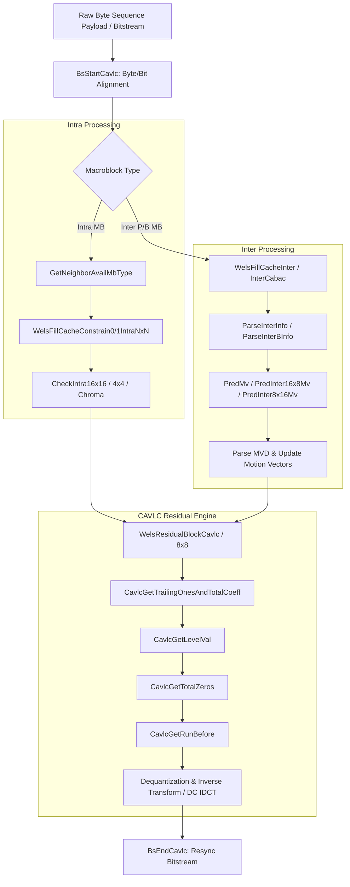
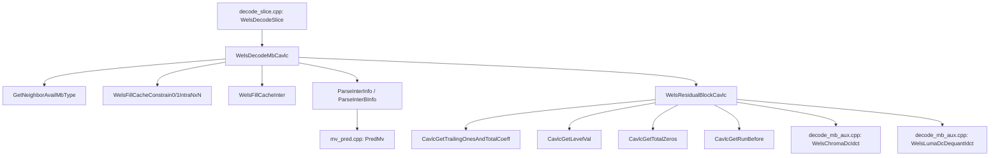

# OpenH264 Decoder: Macroblock Syntax Parsing & CAVLC Entropy Decoding (`parse_mb_syn_cavlc.cpp`)

This document provides a comprehensive, literate-programming-style technical deep dive into [parse_mb_syn_cavlc.cpp](openh264/codec/decoder/core/src/parse_mb_syn_cavlc.cpp) and its companion header [parse_mb_syn_cavlc.h](openh264/codec/decoder/core/inc/parse_mb_syn_cavlc.h).

---

## Table of Contents
1. [Module Overview & Architectural Purpose](#1-module-overview--architectural-purpose)
2. [Data Structures, Type Definitions, & Constants](#2-data-structures-type-definitions--constants)
   - [2.1 SReadBitsCache](#21-sreadbitscache)
   - [2.2 Constant Definitions & Macro Helpers](#22-constant-definitions--macro-helpers)
3. [Neighborhood Availability & Cache Filling](#3-neighborhood-availability--cache-filling)
   - [3.1 GetNeighborAvailMbType](#31-getneighboravailmbtype)
   - [3.2 WelsFillCacheNonZeroCount](#32-welsfillcachenonzerocount)
   - [3.3 WelsFillCacheConstrain1IntraNxN & WelsFillCacheConstrain0IntraNxN](#33-welsfillcacheconstrain1intranxn--welsfillcacheconstrain0intranxn)
   - [3.4 WelsFillCacheInter & WelsFillCacheInterCabac](#34-welsfillcacheinter--welsfillcacheintercabac)
   - [3.5 WelsFillDirectCacheCabac](#35-welsfilldirectcachecabac)
4. [Intra Prediction Mode Validation & Derivation](#4-intra-prediction-mode-validation--derivation)
   - [4.1 PredIntra4x4Mode](#41-predintra4x4mode)
   - [4.2 CheckIntra16x16PredMode](#42-checkintra16x16predmode)
   - [4.3 CheckIntraChromaPredMode](#43-checkintrachromapredmode)
   - [4.4 CheckIntraNxNPredMode](#44-checkintranxnpredmode)
5. [CAVLC Bitstream Synchronization & Core Entropy Decoding](#5-cavlc-bitstream-synchronization--core-entropy-decoding)
   - [5.1 BsStartCavlc & BsEndCavlc](#51-bsstartcavlc--bsendcavlc)
   - [5.2 CavlcGetTrailingOnesAndTotalCoeff](#52-cavlcgettrailingonesandtotalcoeff)
   - [5.3 CavlcGetLevelVal](#53-cavlcgetlevelval)
   - [5.4 CavlcGetTotalZeros](#54-cavlcgettotalzeros)
   - [5.5 CavlcGetRunBefore](#55-cavlcgetrunbefore)
6. [Residual Block Reconstruction Engines](#6-residual-block-reconstruction-engines)
   - [6.1 WelsResidualBlockCavlc](#61-welsresidualblockcavlc)
   - [6.2 WelsResidualBlockCavlc8x8](#62-welsresidualblockcavlc8x8)
7. [Inter Motion Information Parsing](#7-inter-motion-information-parsing)
   - [7.1 ParseInterInfo (P-Slice Inter Parsing)](#71-parseinterinfo-p-slice-inter-parsing)
   - [7.2 ParseInterBInfo (B-Slice Inter & Direct Parsing)](#72-parseinterbinfo-b-slice-inter--direct-parsing)
8. [Call Graph & Interaction Matrix](#8-call-graph--interaction-matrix)

---

## 1. Module Overview & Architectural Purpose

The source file [parse_mb_syn_cavlc.cpp](openh264/codec/decoder/core/src/parse_mb_syn_cavlc.cpp) is a foundational module of the OpenH264 decoding pipeline. It is responsible for parsing macroblock-level syntax elements and decoding residual coefficient blocks using **Context-Adaptive Variable-Length Coding (CAVLC)** under ITU-T H.264 / ISO/IEC 14496-10.



### Key Architectural Responsibilities
1. **Neighborhood Availability Derivation**: Determines spatial macroblock boundaries, availability masks, coded block patterns (`CBP`), and macroblock prediction types for Top, Left, Top-Left, and Top-Right neighbors across slice boundaries.
2. **Context Cache Initialization**: Manages 1D/2D local cache buffers for Non-Zero Coefficient counts (`NZC`), Intra Prediction Modes, Motion Vectors (`MV`), Motion Vector Differences (`MVD`), and Reference Picture Indices (`RefIdx`).
3. **Intra Prediction Mode Validation**: Verifies and adjusts Intra prediction modes (Intra-4x4, Intra-8x8, Intra-16x16, Intra-Chroma) based on neighbor pixel sample availability.
4. **CAVLC Residual Decoding**: Decodes the 5 distinct CAVLC syntax elements:
   - `coeff_token` (Total coefficients & trailing ones)
   - Signs of trailing ones
   - Levels (magnitudes & signs) of remaining non-zero coefficients
   - `total_zeros` (Total zero runs)
   - `run_before` (Zero runs preceding each coefficient)
5. **Dequantization & DC IDCT Integration**: Applies inverse quantization scaling factors and performs Hadamard inverse transforms on Chroma DC (2x2) and Intra-16x16 Luma DC (4x4) blocks directly during CAVLC syntax extraction.
6. **Inter Motion Parsing**: Parses reference frame indices (`ref_idx_l0`, `ref_idx_l1`) and motion vector differences (`mvd_l0`, `mvd_l1`), predicting motion vectors via [mv_pred.h](openh264/codec/decoder/core/inc/mv_pred.h) and applying error concealment when reference frames are missing.

---

## 2. Data Structures, Type Definitions, & Constants

### 2.1 SReadBitsCache

Local 32-bit sliding bitstream cache used for rapid variable-length code word extraction without redundant bitstream reader overhead.

```cpp
typedef struct TagReadBitsCache {
  uint32_t uiCache32Bit;  // Current 32-bit big-endian bit window
  uint8_t  uiRemainBits;   // Number of unconsumed bits remaining in uiCache32Bit
  uint8_t* pBuf;           // Pointer to current raw byte stream position
} SReadBitsCache;
```

| Field | Type | Description |
| :--- | :--- | :--- |
| `uiCache32Bit` | `uint32_t` | Contains up to 32 bits left-aligned from the bitstream. Code words are extracted by right-shifting or masking off leading bits. |
| `uiRemainBits` | `uint8_t` | Count of valid bits remaining in `uiCache32Bit` (ranges from 0 to 32). When `uiRemainBits <= 16`, `SHIFT_BUFFER` loads the next 16/32 bits from `pBuf`. |
| `pBuf` | `uint8_t*` | Memory pointer to the next unread byte in the bitstream buffer. |

### 2.2 Constant Definitions & Macro Helpers

#### `MAX_LEVEL_PREFIX`
```cpp
#define MAX_LEVEL_PREFIX 15
```
Defines the maximum prefix bit length allowed for CAVLC level codes. In standard H.264 syntax (Section 9.2.2.1), a level prefix greater than 15 represents an illegal or corrupted code word in the bitstream.

#### Validation Macros for Intra Modes
```cpp
#define CHECK_I16_MODE(a, b, c, d)                           \
                      ((a == g_ksI16PredInfo[a].iPredMode) &&  \
                       (b >= g_ksI16PredInfo[a].iLeftAvail) && \
                       (c >= g_ksI16PredInfo[a].iTopAvail) &&  \
                       (d >= g_ksI16PredInfo[a].iLeftTopAvail))

#define CHECK_CHROMA_MODE(a, b, c, d)                              \
                        ((a == g_ksChromaPredInfo[a].iPredMode) &&  \
                         (b >= g_ksChromaPredInfo[a].iLeftAvail) && \
                         (c >= g_ksChromaPredInfo[a].iTopAvail) &&  \
                         (d >= g_ksChromaPredInfo[a].iLeftTopAvail))

#define CHECK_I4_MODE(a, b, c, d)                              \
                      ((a == g_ksI4PredInfo[a].iPredMode) &&      \
                       (b >= g_ksI4PredInfo[a].iLeftAvail) &&     \
                       (c >= g_ksI4PredInfo[a].iTopAvail) &&      \
                       (d >= g_ksI4PredInfo[a].iLeftTopAvail))
```
These macros check whether candidate prediction mode `a` matches the table entry requirement for Left (`b`), Top (`c`), and Top-Left (`d`) sample availability.

#### Bit Manipulation & Memory Macros
- `ST32(dst, src)`: Stores 32 bits into memory (unaligned safe).
- `LD32(src)`: Loads 32 bits from memory.
- `ST16(dst, src)` / `LD16(src)`: 16-bit store/load primitives.
- `ST64(dst, src)` / `LD64(src)`: 64-bit store/load primitives.
- `POP_BUFFER(pCache, nBits)`: Discards $n$ consumed bits from `uiCache32Bit` and decrements `uiRemainBits`.
- `SHIFT_BUFFER(pCache)`: Refills `uiCache32Bit` from `pCache->pBuf` when `uiRemainBits` drops below threshold.

---

## 3. Neighborhood Availability & Cache Filling

### 3.1 GetNeighborAvailMbType

[GetNeighborAvailMbType](openh264/codec/decoder/core/src/parse_mb_syn_cavlc.cpp#L56-L106) evaluates boundary conditions for the current macroblock and identifies which spatial neighbors (Left, Top, Top-Left, Top-Right) belong to the same slice.

```cpp
void GetNeighborAvailMbType (PWelsNeighAvail pNeighAvail, PDqLayer pCurDqLayer);
```

```
       +--------------+--------------+--------------+
       | Left-Top MB  |    Top MB    | Top-Right MB |
       | (iLeftTopXy) |   (iTopXy)   | (iRightTopXy)|
       +--------------+--------------+--------------+
       |   Left MB    |  Current MB  |
       |  (iLeftXy)   |   (iCurXy)   |
       +--------------+--------------+
```

#### Algorithm & Mathematical Rules
Given macroblock coordinates $(X, Y)$ and macroblock raster index $XY = X + Y \cdot W_{\text{mb}}$:
1. **Left Neighbor ($XY - 1$)**:
   $$\text{Available} \iff (X > 0) \land (\text{SliceIdc}[XY - 1] == \text{SliceIdc}[XY])$$
2. **Top Neighbor ($XY - W_{\text{mb}}$)**:
   $$\text{Available} \iff (Y > 0) \land (\text{SliceIdc}[XY - W_{\text{mb}}] == \text{SliceIdc}[XY])$$
3. **Top-Left Neighbor ($XY - W_{\text{mb}} - 1$)**:
   $$\text{Available} \iff \text{Top Available} \land (X > 0) \land (\text{SliceIdc}[XY - W_{\text{mb}} - 1] == \text{SliceIdc}[XY])$$
4. **Top-Right Neighbor ($XY - W_{\text{mb}} + 1$)**:
   $$\text{Available} \iff \text{Top Available} \land (X < W_{\text{mb}} - 1) \land (\text{SliceIdc}[XY - W_{\text{mb}} + 1] == \text{SliceIdc}[XY])$$

If a neighbor is available, its Coded Block Pattern (`CBP`) and Macroblock Type (`MbType`) are populated into `pNeighAvail`; otherwise, they are set to `0`.

---

### 3.2 WelsFillCacheNonZeroCount

[WelsFillCacheNonZeroCount](openh264/codec/decoder/core/src/parse_mb_syn_cavlc.cpp#L107-L154) loads the non-zero coefficient counts (`NZC`) from neighboring macroblocks into the 48-entry local cache `pNonZeroCount`.

```cpp
void WelsFillCacheNonZeroCount (PWelsNeighAvail pNeighAvail, uint8_t* pNonZeroCount, PDqLayer pCurDqLayer);
```

#### Cache Structure (48 Elements)
The 48-element cache represents a 6x8 grid storing Luma (16 sub-blocks), Cb (4 sub-blocks), and Cr (4 sub-blocks) along with their top and left boundary contexts:

```
Top Row Luma:   pNonZeroCount[1..4]   <- Bottom row of Top MB (sub-blocks 12, 13, 14, 15)
Left Col Luma:  pNonZeroCount[8, 16, 24, 32] <- Right col of Left MB (sub-blocks 3, 7, 11, 15)
Chroma Cb/Cr:   Loaded from corresponding Chroma sub-block boundaries (17, 21, 19, 23).
```

- **Top Available**: Copies 4 bytes from `pNzc[iTopXy][12..15]` via `LD32`/`ST32`.
- **Top Unavailable**: Fills top row entries with `0xFF` (indicating unavailable context).
- **Left Available**: Populates column entries with values from `pNzc[iLeftXy]`.
- **Left Unavailable**: Fills left column entries with `-1` (`0xFF`).

---

### 3.3 WelsFillCacheConstrain1IntraNxN & WelsFillCacheConstrain0IntraNxN

These functions load non-zero coefficient counts and intra prediction mode caches (`pIntraPredMode`) for Intra 4x4 / Intra 8x8 prediction:

- [WelsFillCacheConstrain1IntraNxN](openh264/codec/decoder/core/src/parse_mb_syn_cavlc.cpp#L155-L200): Invoked when `constrained_intra_pred_flag == 1`. Inter-coded neighbor macroblocks are strictly prohibited from being used as spatial prediction references and are marked unavailable (`-1`).
- [WelsFillCacheConstrain0IntraNxN](openh264/codec/decoder/core/src/parse_mb_syn_cavlc.cpp#L201-L246): Invoked when `constrained_intra_pred_flag == 0`. Inter-coded neighbor macroblocks are treated as available and assigned default DC prediction mode (`2`).

---

### 3.4 WelsFillCacheInter & WelsFillCacheInterCabac

Prepares the motion vector (`iMvArray`), reference index (`iRefIdxArray`), and motion vector difference (`iMvdCache`) caches for Inter-coded macroblocks across active reference picture lists (`LIST_0` and `LIST_1`).

- [WelsFillCacheInter](openh264/codec/decoder/core/src/parse_mb_syn_cavlc.cpp#L429-L542) (CAVLC):
  Loads 32-bit packed MVs (`MV_x`, `MV_y`) and 8-bit reference indices from Left, Top-Left, Top, and Top-Right neighbors into a 30-entry 2D neighborhood cache.
- [WelsFillCacheInterCabac](openh264/codec/decoder/core/src/parse_mb_syn_cavlc.cpp#L247-L386) (CABAC):
  In addition to MVs and Ref Indices, loads 32-bit packed MVD values (`iMvdCache`) required for CABAC context modeling of motion vector differences.

#### Sentinel Reference Index Values
- `REF_NOT_AVAIL (-1)`: Neighbor block is outside the picture or slice boundary.
- `REF_NOT_IN_LIST (-2)`: Neighbor block is available, but is Intra-coded (contains no reference index).

---

### 3.5 WelsFillDirectCacheCabac

[WelsFillDirectCacheCabac](openh264/codec/decoder/core/src/parse_mb_syn_cavlc.cpp#L388-L428) fills the 30-entry direct prediction cache `iDirect` for B-slice CABAC decoding.

```cpp
void WelsFillDirectCacheCabac (PWelsNeighAvail pNeighAvail, int8_t iDirect[30], PDqLayer pCurDqLayer);
```

Populates `iDirect[6, 12, 18, 24]` from the left neighbor, `iDirect[0]` from top-left, `iDirect[1..4]` from top, and `iDirect[5]` from top-right.

---

## 4. Intra Prediction Mode Validation & Derivation

### 4.1 PredIntra4x4Mode

[PredIntra4x4Mode](openh264/codec/decoder/core/src/parse_mb_syn_cavlc.cpp#L544-L555) derives the Most Probable Mode (MPM) for an Intra 4x4 sub-block from its Top and Left neighbors.

```cpp
int32_t PredIntra4x4Mode (int8_t* pIntraPredMode, int32_t iIdx4);
```

#### Mathematical Formulation
Let $M_A$ be the prediction mode of the Left 4x4 sub-block and $M_B$ be the prediction mode of the Top 4x4 sub-block:

$$\text{MPM} = \begin{cases} 2 \; (\text{Intra\_4x4\_DC}), & \text{if } M_A < 0 \lor M_B < 0 \\ \min(M_A, M_B), & \text{otherwise} \end{cases}$$

---

### 4.2 CheckIntra16x16PredMode

[CheckIntra16x16PredMode](openh264/codec/decoder/core/src/parse_mb_syn_cavlc.cpp#L574-L600) validates the parsed Intra 16x16 prediction mode (`*pMode`) against neighbor sample availability bitmask `uiSampleAvail` (`0x04`: Left, `0x02`: Top-Left, `0x01`: Top).

```cpp
int32_t CheckIntra16x16PredMode (uint8_t uiSampleAvail, int8_t* pMode);
```

- **DC Prediction (`I16_PRED_DC = 2`)**:
  - Both Left and Top available $\to$ `I16_PRED_DC`
  - Only Left available $\to$ modified to `I16_PRED_DC_L` (Left DC only)
  - Only Top available $\to$ modified to `I16_PRED_DC_T` (Top DC only)
  - Neither available $\to$ modified to `I16_PRED_DC_128` (constant 128)
- **Vertical (`0`), Horizontal (`1`), Plane (`3`)**:
  Validated via `CHECK_I16_MODE`. Returns `ERR_INFO_INVALID_I16x16_PRED_MODE` on invalid configuration.

---

### 4.3 CheckIntraChromaPredMode

[CheckIntraChromaPredMode](openh264/codec/decoder/core/src/parse_mb_syn_cavlc.cpp#L603-L625) validates the 8x8 Intra Chroma prediction mode (`C_PRED_DC`, `C_PRED_H`, `C_PRED_V`, `C_PRED_P`). DC mode is dynamically adapted to `C_PRED_DC_L`, `C_PRED_DC_T`, or `C_PRED_DC_128` depending on boundary availability.

---

### 4.4 CheckIntraNxNPredMode

[CheckIntraNxNPredMode](openh264/codec/decoder/core/src/parse_mb_syn_cavlc.cpp#L627-L667) validates Intra 4x4 or Intra 8x8 prediction modes.

#### Diagonal Boundary Padding Rule
If mode is **Diagonal Down-Left (`I4_PRED_DDL = 3`)** or **Vertical-Left (`I4_PRED_VL = 7`)** and the Top-Right neighbor is unavailable (`bRightTopAvail == 0`), the mode is modified to `I4_PRED_DDL_TOP` or `I4_PRED_VL_TOP`. These specialized prediction kernels replicate the top-rightmost sample of the Top neighbor across the missing top-right boundary.

---

## 5. CAVLC Bitstream Synchronization & Core Entropy Decoding

### 5.1 BsStartCavlc & BsEndCavlc

When switching between byte-level bitstream parsing and bit-level CAVLC cache operations, [BsStartCavlc](openh264/codec/decoder/core/src/parse_mb_syn_cavlc.cpp#L669-L671) and [BsEndCavlc](openh264/codec/decoder/core/src/parse_mb_syn_cavlc.cpp#L672-L679) synchronize the bitstream reader [SBitStringAux](openh264/codec/decoder/core/inc/bit_stream.h).

```cpp
void BsStartCavlc (PBitStringAux pBs) {
  pBs->iIndex = ((pBs->pCurBuf - pBs->pStartBuf) << 3) - (16 - pBs->iLeftBits);
}

void BsEndCavlc (PBitStringAux pBs) {
  pBs->pCurBuf   = pBs->pStartBuf + (pBs->iIndex >> 3);
  uint32_t uiCache32Bit = (uint32_t) ((((pBs->pCurBuf[0] << 8) | pBs->pCurBuf[1]) << 16) |
                                      (pBs->pCurBuf[2] << 8) | pBs->pCurBuf[3]);
  pBs->uiCurBits = uiCache32Bit << (pBs->iIndex & 0x07);
  pBs->pCurBuf  += 4;
  pBs->iLeftBits = -16 + (pBs->iIndex & 0x07);
}
```

---

### 5.2 CavlcGetTrailingOnesAndTotalCoeff

[CavlcGetTrailingOnesAndTotalCoeff](openh264/codec/decoder/core/src/parse_mb_syn_cavlc.cpp#L683-L729) decodes `coeff_token`, returning `uiTotalCoeff` (total non-zero coefficients, $0 \le \text{TotalCoeff} \le 16$) and `uiTrailingOnes` (number of trailing $\pm 1$ coefficients, $0 \le \text{TrailingOnes} \le 3$).

```cpp
static int32_t CavlcGetTrailingOnesAndTotalCoeff (uint8_t& uiTotalCoeff, uint8_t& uiTrailingOnes,
    SReadBitsCache* pBitsCache, SVlcTable* pVlcTable, bool bChromaDc, int8_t nC);
```

#### Context Parameter $nC$
For Luma and Chroma AC blocks, the context parameter $nC$ is derived from the non-zero counts of the Left ($nA$) and Top ($nB$) neighbor blocks:

$$nC = \begin{cases} nB, & \text{if } nA < 0 \land nB \ge 0 \\ nA, & \text{if } nA \ge 0 \land nB < 0 \\ 0, & \text{if } nA < 0 \land nB < 0 \\ (nA + nB + 1) \gg 1, & \text{if } nA \ge 0 \land nB \ge 0 \end{cases}$$

#### VLC Table Mapping
$nC$ is mapped via `g_kuiNcMapTable[nC]` to select one of 4 VLC tables:
- $0 \le nC < 2 \implies \text{Table } 0$
- $2 \le nC < 4 \implies \text{Table } 1$
- $4 \le nC < 8 \implies \text{Table } 2$
- $nC \ge 8 \implies \text{Table } 3$ (6-bit fixed-length suffix lookup)

---

### 5.3 CavlcGetLevelVal

[CavlcGetLevelVal](openh264/codec/decoder/core/src/parse_mb_syn_cavlc.cpp#L731-L782) decodes the non-zero coefficient level values (magnitudes and signs) in reverse zigzag scan order.

```cpp
static int32_t CavlcGetLevelVal (int32_t iLevel[16], SReadBitsCache* pBitsCache, uint8_t uiTotalCoeff,
                                 uint8_t uiTrailingOnes);
```

#### Algorithmic Steps
1. **Trailing $\pm 1$ Signs**: Decodes 1 bit per trailing one. Bit $0 \implies +1$, Bit $1 \implies -1$.
2. **Remaining Levels**: Decoded using prefix bits (`iPrefixBits`) and suffix bits of length `iSuffixLength`.
3. **Adaptive `iSuffixLength` Update**:
   - Initialized to $0$ (or $1$ if $\text{uiTotalCoeff} > 10$ and $\text{uiTrailingOnes} < 3$).
   - After decoding each level, `iSuffixLength` is adaptively updated:
     $$\text{Threshold} = 3 \ll (\text{iSuffixLength} - 1)$$
     $$\text{if } (|iLevel[i]| > \text{Threshold}) \land (\text{iSuffixLength} < 6) \implies \text{iSuffixLength} = \text{iSuffixLength} + 1$$

---

### 5.4 CavlcGetTotalZeros

[CavlcGetTotalZeros](openh264/codec/decoder/core/src/parse_mb_syn_cavlc.cpp#L784-L814) decodes `total_zeros`, representing the total number of zero-valued coefficients located before the last non-zero coefficient in zigzag scan order.

```cpp
static int32_t CavlcGetTotalZeros (int32_t& iZerosLeft, SReadBitsCache* pBitsCache, uint8_t uiTotalCoeff,
                                   SVlcTable* pVlcTable, bool bChromaDc);
```

Uses `pVlcTable->kpTotalZerosTable` indexed by `uiTotalCoeff - 1` and bitstream bits extracted via `g_kuiTotalZerosBitNumMap`.

---

### 5.5 CavlcGetRunBefore

[CavlcGetRunBefore](openh264/codec/decoder/core/src/parse_mb_syn_cavlc.cpp#L815-L858) decodes `run_before`, the number of consecutive zeros preceding each non-zero coefficient.

```cpp
static int32_t CavlcGetRunBefore (int32_t iRun[16], SReadBitsCache* pBitsCache, uint8_t uiTotalCoeff,
                                  SVlcTable* pVlcTable, int32_t iZerosLeft);
```

Iterates for $i = 0 \dots \text{uiTotalCoeff} - 2$. As long as `iZerosLeft > 0`, decodes `iRun[i]` using `pVlcTable->kpZeroTable[iZerosLeft - 1]`. The final run `iRun[uiTotalCoeff - 1]` receives all remaining zeros (`iZerosLeft`).

---

## 6. Residual Block Reconstruction Engines

### 6.1 WelsResidualBlockCavlc

[WelsResidualBlockCavlc](openh264/codec/decoder/core/src/parse_mb_syn_cavlc.cpp#L860-L977) is the master CAVLC residual decoder for standard 4x4 blocks, Intra-16x16 Luma DC blocks, and Chroma DC blocks.

```cpp
int32_t WelsResidualBlockCavlc (SVlcTable* pVlcTable, uint8_t* pNonZeroCountCache, PBitStringAux pBs, int32_t iIndex,
                                int32_t iMaxNumCoeff, const uint8_t* kpZigzagTable, int32_t iResidualProperty,
                                int16_t* pTCoeff, uint8_t uiQp, PWelsDecoderContext pCtx);
```

#### Processing Pipeline
1. Computes neighbor average $nC = (nA + nB + 1) \gg 1$ via macro `WELS_NON_ZERO_COUNT_AVERAGE`.
2. Decodes `uiTotalCoeff` and `uiTrailingOnes`.
3. If `uiTotalCoeff == 0`, writes 0 into `pNonZeroCountCache` and exits immediately with `ERR_NONE`.
4. Decodes levels `iLevel[]`, `total_zeros` (`iZerosLeft`), and zero runs `iRun[]`.
5. **Dequantization & IDCT Transformation**:
   - **Chroma DC (`CHROMA_DC`)**:
     Reconstructs 2x2 DC block, executes `WelsChromaDcIdct(pTCoeff)`, and dequantizes:
     $$pTCoeff[j] = \frac{pTCoeff[j] \cdot \text{DequantCoeff}[0]}{2}$$
   - **Intra 16x16 Luma DC (`I16_LUMA_DC`)**:
     Reconstructs 4x4 DC block and executes `WelsLumaDcDequantIdct(pTCoeff, uiQp, pCtx)` (4x4 Hadamard transform).
   - **Standard 4x4 Residual**:
     Dequantizes coefficients into `pTCoeff` at zigzag position $j = \text{kpZigzagTable}[\text{iCoeffNum}]$:
     $$pTCoeff[j] = iLevel[i] \cdot \text{kpDequantCoeff}[j \ \& \ 7]$$

---

### 6.2 WelsResidualBlockCavlc8x8

[WelsResidualBlockCavlc8x8](openh264/codec/decoder/core/src/parse_mb_syn_cavlc.cpp#L979-L1064) performs CAVLC residual decoding for 8x8 transform blocks.

```cpp
int32_t WelsResidualBlockCavlc8x8 (SVlcTable* pVlcTable, uint8_t* pNonZeroCountCache, PBitStringAux pBs, int32_t iIndex,
                                   int32_t iMaxNumCoeff, const uint8_t* kpZigzagTable, int32_t iResidualProperty,
                                   int16_t* pTCoeff, int32_t iIdx4x4, uint8_t uiQp, PWelsDecoderContext pCtx);
```

#### 8x8 Dequantization Formula
For each non-zero coefficient at index $j = \text{kpZigzagTable}[(iCoeffNum \ll 2) + iIdx4x4]$:

$$pTCoeff[j] = \begin{cases} (iLevel[i] \cdot \text{DequantCoeff8x8}[j]) \ll \left(\frac{QP}{6} - 6\right), & \text{if } QP \ge 36 \\ \left(iLevel[i] \cdot \text{DequantCoeff8x8}[j] + 2^{5 - QP/6}\right) \gg \left(6 - \frac{QP}{6}\right), & \text{if } QP < 36 \end{cases}$$

---

## 7. Inter Motion Information Parsing

### 7.1 ParseInterInfo (P-Slice Inter Parsing)

[ParseInterInfo](openh264/codec/decoder/core/src/parse_mb_syn_cavlc.cpp#L1066-L1327) parses reference picture indices and motion vector differences (`MVD`) for P-slice macroblocks (`16x16`, `16x8`, `8x16`, `8x8`).

```cpp
int32_t ParseInterInfo (PWelsDecoderContext pCtx, int16_t iMvArray[LIST_A][30][MV_A], int8_t iRefIdxArray[LIST_A][30],
                        PBitStringAux pBs);
```

#### Partition Handling
- **`MB_TYPE_16x16`**:
  Parses `ref_idx_l0`, validates against active reference picture list `ppRefPic[iRefIdx]`, calculates predicted MV via `PredMv()`, reads signed MVDs (`BsGetSe`), and updates layer motion buffers via `UpdateP16x16MotionInfo()`.
- **`MB_TYPE_16x8` & `MB_TYPE_8x16`**:
  Parses independent reference indices and MVDs for each of the two 16x8 or 8x16 partitions, invoking `PredInter16x8Mv()` / `PredInter8x16Mv()`.
- **`MB_TYPE_8x8` / `MB_TYPE_8x8_REF0`**:
  Parses `sub_mb_type` for each 8x8 quadrant (`8x8`, `8x4`, `4x8`, `4x4`), parses sub-partition MVDs, and stores MVs into both `pCurDqLayer->pDec->pMv` and cache `iMvArray`.

#### Error Concealment Handling
If a decoded reference index $iRefIdx \ge iRefCount[0]$ or points to a `NULL` reference frame:
```cpp
pCtx->bMbRefConcealed = true;
if (pCtx->pParam->eEcActiveIdc != ERROR_CON_DISABLE) {
  iRefIdx = 0; // Clamp to base reference frame
  pCtx->iErrorCode |= dsBitstreamError;
} else {
  return GENERATE_ERROR_NO (ERR_LEVEL_MB_DATA, ERR_INFO_INVALID_REF_INDEX);
}
```

---

### 7.2 ParseInterBInfo (B-Slice Inter & Direct Parsing)

[ParseInterBInfo](openh264/codec/decoder/core/src/parse_mb_syn_cavlc.cpp#L1328-L1728) parses bidirectional motion parameters for B-slices.

```cpp
int32_t ParseInterBInfo (PWelsDecoderContext pCtx, int16_t iMvArray[LIST_A][30][MV_A],
                         int8_t iRefIdxArray[LIST_A][30], PBitStringAux pBs);
```

#### B-Slice Prediction Modes
1. **Direct Mode (`IS_DIRECT`)**:
   - **Spatial Direct**: Invokes `PredMvBDirectSpatial()` to derive List 0 and List 1 MVs and reference indices from spatial neighbors.
   - **Temporal Direct**: Invokes `PredBDirectTemporal()` to scale collocated picture motion vectors based on Picture Order Count (`POC`) distances.
2. **List 0 / List 1 / Bi-predictive Partitions**:
   Evaluates partition direction via `IS_DIR(mbType, partIdx, listIdx)`. For each active list, parses reference indices and MVDs, computes MV predictions, and updates 8x8/4x4 motion structures.

---

## 8. Call Graph & Interaction Matrix



### Module Cross-Reference Table
| Function | Declared In | Called By | Key Callees |
| :--- | :--- | :--- | :--- |
| [GetNeighborAvailMbType](openh264/codec/decoder/core/src/parse_mb_syn_cavlc.cpp#L56) | [parse_mb_syn_cavlc.h](openh264/codec/decoder/core/inc/parse_mb_syn_cavlc.h) | `decode_slice.cpp` | None |
| [WelsFillCacheNonZeroCount](openh264/codec/decoder/core/src/parse_mb_syn_cavlc.cpp#L107) | [parse_mb_syn_cavlc.h](openh264/codec/decoder/core/inc/parse_mb_syn_cavlc.h) | `WelsFillCacheConstrain*`, `WelsFillCacheInter*` | `LD32`, `ST32`, `LD16`, `ST16` |
| [PredIntra4x4Mode](openh264/codec/decoder/core/src/parse_mb_syn_cavlc.cpp#L544) | [parse_mb_syn_cavlc.h](openh264/codec/decoder/core/inc/parse_mb_syn_cavlc.h) | `decode_slice.cpp` | `WELS_MIN` |
| [WelsResidualBlockCavlc](openh264/codec/decoder/core/src/parse_mb_syn_cavlc.cpp#L860) | [parse_mb_syn_cavlc.h](openh264/codec/decoder/core/inc/parse_mb_syn_cavlc.h) | `decode_slice.cpp` | `CavlcGetTrailingOnesAndTotalCoeff`, `CavlcGetLevelVal`, `CavlcGetTotalZeros`, `CavlcGetRunBefore`, `WelsChromaDcIdct`, `WelsLumaDcDequantIdct` |
| [ParseInterInfo](openh264/codec/decoder/core/src/parse_mb_syn_cavlc.cpp#L1066) | [parse_mb_syn_cavlc.h](openh264/codec/decoder/core/inc/parse_mb_syn_cavlc.h) | `decode_slice.cpp` | `PredMv`, `PredInter16x8Mv`, `PredInter8x16Mv`, `UpdateP16x16MotionInfo`, `UpdateP16x8MotionInfo`, `UpdateP8x16MotionInfo` |
| [ParseInterBInfo](openh264/codec/decoder/core/src/parse_mb_syn_cavlc.cpp#L1328) | [parse_mb_syn_cavlc.h](openh264/codec/decoder/core/inc/parse_mb_syn_cavlc.h) | `decode_slice.cpp` | `PredMvBDirectSpatial`, `PredBDirectTemporal`, `FillSpatialDirect8x8Mv`, `FillTemporalDirect8x8Mv` |
