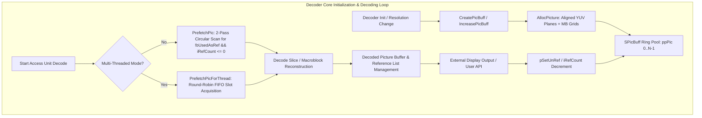
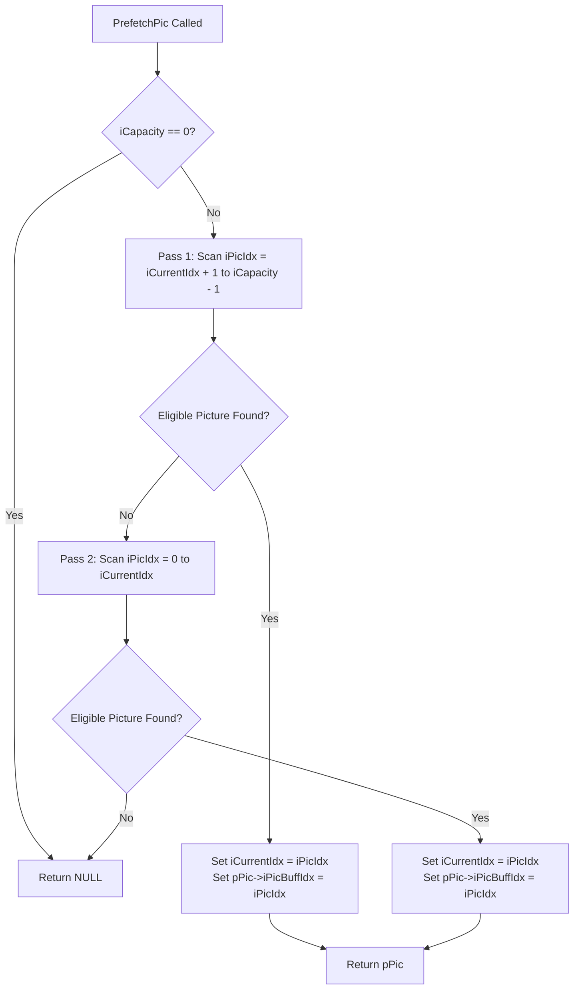
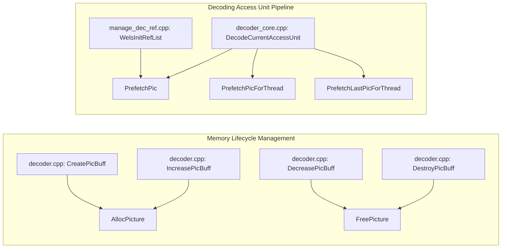

# OpenH264 Decoder: Picture Buffer Queue & Memory Architecture (`pic_queue.cpp`)

This document provides a comprehensive, literate-programming-style deep dive into [`codec/decoder/core/src/pic_queue.cpp`](openh264/codec/decoder/core/src/pic_queue.cpp), its companion header [`codec/decoder/core/inc/pic_queue.h`](openh264/codec/decoder/core/inc/pic_queue.h), and the associated picture structures defined in [`codec/decoder/core/inc/picture.h`](openh264/codec/decoder/core/inc/picture.h).

---

## Table of Contents
1. [High-Level Module & Architectural Role](#1-high-level-module--architectural-role)
2. [Data Structures & Memory Layout](#2-data-structures--memory-layout)
   - [2.1 SPicBuff (Picture Buffer Queue Container)](#21-spicbuff-picture-buffer-queue-container)
   - [2.2 SPicture (Reconstructed Picture Object)](#22-spicture-reconstructed-picture-object)
   - [2.3 Aligned Memory & Pixel Padding Geometry](#23-aligned-memory--pixel-padding-geometry)
3. [Deep-Dive Function Implementations](#3-deep-dive-function-implementations)
   - [3.1 AllocPicture](#31-allocpicture)
   - [3.2 FreePicture](#32-freepicture)
   - [3.3 PrefetchPic (Single-Threaded Reference-Aware Prefetch)](#33-prefetchpic-single-threaded-reference-aware-prefetch)
   - [3.4 PrefetchPicForThread (Multi-Threaded Round-Robin Prefetch)](#34-prefetchpicforthread-multi-threaded-round-robin-prefetch)
   - [3.5 PrefetchLastPicForThread (Direct-Indexed Prefetch)](#35-prefetchlastpicforthread-direct-indexed-prefetch)
4. [Subsystem Interactions & Call Graph](#4-subsystem-interactions--call-graph)

---

## 1. High-Level Module & Architectural Role

In high-performance video decoding (H.264 / AVC and SVC), dynamically allocating and deallocating large video sample buffers (such as 1080p or 4K YUV frames) on every decoded picture introduces unacceptable heap contention, page faults, and cache thrashing.

[`pic_queue.cpp`](openh264/codec/decoder/core/src/pic_queue.cpp) implements the **Recycled Picture Buffer Management Subsystem** for the OpenH264 decoder. It manages a fixed-capacity ring/pool of pre-allocated [`SPicture`](openh264/codec/decoder/core/inc/picture.h#L51-L106) instances within [`SPicBuff`](openh264/codec/decoder/core/inc/pic_queue.h#L45-L49).



### Key Architectural Responsibilities
1. **Recycled Frame Pool**: Pre-allocates and maintains a contiguous pool of [`SPicture`](openh264/codec/decoder/core/inc/picture.h#L51-L106) structures sized according to the sequence's maximum reference frame requirement (`max_num_ref_frames`) plus output reordering delay buffers.
2. **SIMD-Aligned Sample Memory with Perimeter Padding**: Allocates 32-byte cache-aligned pixel storage with a 32-pixel boundary perimeter (`PADDING_LENGTH = 32`). This allows motion compensation Wiener interpolation filters (SSE2, AVX2, NEON) to read outside the visible frame boundary without per-sample branching or clamping.
3. **Macroblock Auxiliary Data Allocation**: Pre-allocates aligned memory grids for per-macroblock metadata, including motion vector grids (`pMv[LIST_0]`, `pMv[LIST_1]`), reference indices (`pRefIndex[LIST_0]`, `pRefIndex[LIST_1]`), macroblock types (`pMbType`), non-zero transform coefficient counts (`pNzc`), and error concealment masks (`pMbCorrectlyDecodedFlag`).
4. **Multithreaded Row-Level Synchronization Primitives**: Initializes operating system event primitives (`pReadyEvent`) per macroblock row when slice or frame multithreading is enabled, allowing worker threads to coordinate inter-row dependencies safely.

---

## 2. Data Structures & Memory Layout

### 2.1 SPicBuff (Picture Buffer Queue Container)

Defined in [`codec/decoder/core/inc/pic_queue.h`](openh264/codec/decoder/core/inc/pic_queue.h#L45-L49):

```cpp
typedef struct TagPicBuff {
  PPicture*      ppPic;        // Array of pointers to SPicture objects (size: iCapacity)
  int32_t        iCapacity;    // Total allocated capacity / number of picture slots
  int32_t        iCurrentIdx;  // Current ring buffer cursor index
} SPicBuff, *PPicBuff;
```

| Member Field | Type | Description |
| :--- | :--- | :--- |
| `ppPic` | [`PPicture*`](openh264/codec/decoder/core/inc/picture.h#L108) | Dynamically allocated array of pointers to [`SPicture`](openh264/codec/decoder/core/inc/picture.h#L51-L106) instances. Length equals `iCapacity`. |
| `iCapacity` | `int32_t` | Total number of picture buffers allocated in the pool. |
| `iCurrentIdx` | `int32_t` | Cursor tracking the index of the most recently prefetched or evaluated picture slot in the circular pool. |

---

### 2.2 SPicture (Reconstructed Picture Object)

Defined in [`codec/decoder/core/inc/picture.h`](openh264/codec/decoder/core/inc/picture.h#L51-L106):

```cpp
struct SPicture {
  uint8_t*        pBuffer[4];             // Base pointer to the first allocated byte of each plane buffer
  uint8_t*        pData[4];               // Pointer to the active video origin (0,0) of each plane
  int32_t         iLinesize[4];           // Stride / pitch of picture planes in bytes (aligned to 32 bytes)
  int32_t         iPlanes;                // Number of color planes (3 for YUV 4:2:0 planar)
  bool            bIdrFlag;               // True if current picture is an IDR keyframe
  int32_t         iWidthInPixel;          // Active frame width in luma pixels
  int32_t         iHeightInPixel;         // Active frame height in luma pixels
  int32_t         iFramePoc;              // Picture Order Count (POC)
  bool            bUsedAsRef;             // Flag indicating picture is currently retained as DPB reference
  bool            bIsLongRef;             // Flag indicating picture is a Long-Term Reference (LTR)
  int8_t          iRefCount;              // Consumer reference counter (held by output queue / active threads)
  void            (*pSetUnRef)(SPicture*);// Unreference callback function pointer
  bool            bIsComplete;            // Indicates if picture decoding finished completely
  uint8_t         uiTemporalId;           // Scalable Video Coding (SVC) Temporal Layer ID
  uint8_t         uiSpatialId;            // SVC Spatial Dependency Layer ID
  uint8_t         uiQualityId;            // SVC Quality Layer ID
  int32_t         iFrameNum;              // H.264 slice header frame_num syntax element
  int32_t         iFrameWrapNum;          // Wrapped frame number for reference list reordering
  int32_t         iLongTermFrameIdx;      // Long-term reference frame index
  uint32_t        uiLongTermPicNum;       // Long-term picture number
  int32_t         iSpsId;                 // Active SPS ID used to decode this picture
  int32_t         iPpsId;                 // Active PPS ID used to decode this picture
  unsigned long long uiTimeStamp;         // Presentation timestamp (PTS)
  uint32_t        uiDecodingTimeStamp;    // Decoding timestamp (DTS)
  int32_t         iPicBuffIdx;            // Index of this picture slot in parent SPicBuff
  EWelsSliceType  eSliceType;             // Primary slice type (I_SLICE, P_SLICE, B_SLICE)
  bool            bIsUngroupedMultiSlice; // Multi-slice status
  bool            bNewSeqBegin;           // New sequence boundary flag
  int32_t         iMbEcedNum;             // Number of error-concealed macroblocks
  int32_t         iMbEcedPropNum;         // Number of propagated error-concealed macroblocks
  int32_t         iMbNum;                 // Total macroblock count
  bool*           pMbCorrectlyDecodedFlag;// Per-macroblock decoding success mask (size: uiMbCount)
  int8_t        (*pNzc)[24];              // Per-macroblock non-zero transform coefficient count grid
  uint32_t*       pMbType;                // Per-macroblock prediction mode array (size: uiMbCount)
  int16_t       (*pMv[LIST_A])[16][2];    // Motion vector grids for List 0 and List 1 (16 4x4 blocks/MB)
  int8_t        (*pRefIndex[LIST_A])[16]; // Reference indices for List 0 and List 1 (16 4x4 blocks/MB)
  struct SPicture* pRefPic[LIST_A][17];   // Cached reference picture pointers for direct mode
  SWelsDecEvent*  pReadyEvent;            // Per-macroblock-row synchronization events for multithreading
};
```

---

### 2.3 Aligned Memory & Pixel Padding Geometry

OpenH264 allocates planar YUV 4:2:0 frame buffers in a single contiguous memory block via [`CMemoryAlign`](openh264/codec/common/inc/memory_align.h). To support vector SIMD memory loads (128-bit SSE / NEON and 256-bit AVX2) and sub-pixel motion compensation filters without boundary clipping overhead, each plane is expanded with perimeter padding:

```
+-------------------------------------------------------------------------+
|                  TOP PADDING (PADDING_LENGTH = 32 lines)                |
+---------+-----------------------------------------------------+---------+
|  LEFT   |                                                     |  RIGHT  |
| PADDING |                ACTIVE LUMA VIDEO SAMPLES            | PADDING |
| (32 px) |         pData[0] points here -> (0, 0)              | (32 px) |
|         |                 (kiPicWidth x kiPicHeight)          |         |
+---------+-----------------------------------------------------+---------+
|                 BOTTOM PADDING (PADDING_LENGTH = 32 lines)              |
+-------------------------------------------------------------------------+
|<-------------------------- iPicWidth (stride) ------------------------->|
```

#### Mathematical Formulas for Frame Geometry
Given the requested active video dimensions $(W, H) = (\text{kiPicWidth}, \text{kiPicHeight})$:

1. **Padded Luma Stride and Height**:
   $$\text{iPicWidth} = \text{WELS\_ALIGN}\left(W + 2 \times \text{PADDING\_LENGTH},\, 32\right)$$
   $$\text{iPicHeight} = \text{WELS\_ALIGN}\left(H + 2 \times \text{PADDING\_LENGTH},\, 32\right)$$
   where $\text{PADDING\_LENGTH} = 32$ and $\text{PICTURE\_RESOLUTION\_ALIGNMENT} = 32$.

2. **Chroma Dimensions (YUV 4:2:0)**:
   $$\text{iPicChromaWidth} = \text{iPicWidth} \gg 1$$
   $$\text{iPicChromaHeight} = \text{iPicHeight} \gg 1$$

3. **Buffer Sizes**:
   $$\text{iLumaSize} = \text{iPicWidth} \times \text{iPicHeight}$$
   $$\text{iChromaSize} = \text{iPicChromaWidth} \times \text{iPicChromaHeight}$$
   $$\text{TotalBufferSize} = \text{iLumaSize} + 2 \times \text{iChromaSize}$$

4. **Plane Offset Calculations (`pBuffer` vs `pData`)**:
   - Base buffer allocations:
     $$\text{pBuffer}[0] = \text{BaseAlloc}$$
     $$\text{pBuffer}[1] = \text{BaseAlloc} + \text{iLumaSize}$$
     $$\text{pBuffer}[2] = \text{BaseAlloc} + \text{iLumaSize} + \text{iChromaSize}$$
   - Active origin pointers (`pData`), offset past the left and top padding borders:
     $$\text{pData}[0] = \text{pBuffer}[0] + (1 + \text{iLinesize}[0]) \times \text{PADDING\_LENGTH}$$
     $$\text{pData}[1] = \text{pBuffer}[1] + \left( \frac{(1 + \text{iLinesize}[1]) \times \text{PADDING\_LENGTH}}{2} \right)$$
     $$\text{pData}[2] = \text{pBuffer}[2] + \left( \frac{(1 + \text{iLinesize}[2]) \times \text{PADDING\_LENGTH}}{2} \right)$$

> [!NOTE]
> The pointer arithmetic $(1 + \text{stride}) \times 32$ is algebraically equivalent to $(\text{stride} \times 32) + 32$, which skips exactly $32$ vertical padding lines and $32$ horizontal padding pixels to land at $(x=0, y=0)$.

---

## 3. Deep-Dive Function Implementations

### 3.1 AllocPicture

[`AllocPicture`](openh264/codec/decoder/core/src/pic_queue.cpp#L62-L137) allocates and initializes a single [`SPicture`](openh264/codec/decoder/core/inc/picture.h#L51-L106) structure along with all planar sample buffers, macroblock tracking metadata arrays, and multi-threading synchronization events.

#### Signature
```cpp
PPicture AllocPicture (PWelsDecoderContext pCtx, const int32_t kiPicWidth, const int32_t kiPicHeight);
```

#### Parameters
* `pCtx`: Pointer to the current [`SWelsDecoderContext`](openh264/codec/decoder/core/inc/decoder_context.h#L306-L455). Supplies the aligned memory manager (`pCtx->pMemAlign`), bitstream parsing flags (`pCtx->pParam->bParseOnly`), and multi-threading context (`pCtx->pThreadCtx`).
* `kiPicWidth`: Frame width in luma pixels.
* `kiPicHeight`: Frame height in luma pixels.

#### Return Value
* Returns a valid [`PPicture`](openh264/codec/decoder/core/inc/picture.h#L108) pointer on success.
* Returns `NULL` if memory allocation fails at any step.

#### Execution Walkthrough & Code Breakdown

```cpp
PPicture AllocPicture (PWelsDecoderContext pCtx, const int32_t kiPicWidth, const int32_t kiPicHeight) {
  PPicture pPic = NULL;
  int32_t iPicWidth = 0;
  int32_t iPicHeight = 0;
  int32_t iPicChromaWidth   = 0;
  int32_t iPicChromaHeight  = 0;
  int32_t iLumaSize         = 0;
  int32_t iChromaSize       = 0;
  CMemoryAlign* pMa = pCtx->pMemAlign;

  pPic = (PPicture) pMa->WelsMallocz (sizeof (SPicture), "PPicture");
  WELS_VERIFY_RETURN_IF (NULL, NULL == pPic);
  memset (pPic, 0, sizeof (SPicture));
```

1. **Picture Object Allocation**: Allocates a zero-initialized [`SPicture`](openh264/codec/decoder/core/inc/picture.h#L51-L106) container via [`CMemoryAlign::WelsMallocz`](openh264/codec/common/inc/memory_align.h).

```cpp
  iPicWidth = WELS_ALIGN (kiPicWidth + (PADDING_LENGTH << 1), PICTURE_RESOLUTION_ALIGNMENT);
  iPicHeight = WELS_ALIGN (kiPicHeight + (PADDING_LENGTH << 1), PICTURE_RESOLUTION_ALIGNMENT);
  iPicChromaWidth   = iPicWidth >> 1;
  iPicChromaHeight  = iPicHeight >> 1;

  iLumaSize     = iPicWidth * iPicHeight;
  iChromaSize   = iPicChromaWidth * iPicChromaHeight;
```

2. **Dimension & Stride Calculation**: Computes 32-byte aligned strides and buffer dimensions including the 32-pixel padding borders on all sides.

```cpp
  if (pCtx->pParam->bParseOnly) {
    pPic->pBuffer[0] = pPic->pBuffer[1] = pPic->pBuffer[2] = NULL;
    pPic->pData[0] = pPic->pData[1] = pPic->pData[2] = NULL;
    pPic->iLinesize[0] = iPicWidth;
    pPic->iLinesize[1] = pPic->iLinesize[2] = iPicChromaWidth;
  } else {
    pPic->pBuffer[0] = static_cast<uint8_t*> (pMa->WelsMallocz (iLumaSize /* luma */
                       + (iChromaSize << 1) /* Cb,Cr */, "_pic->buffer[0]"));
    WELS_VERIFY_RETURN_PROC_IF (NULL, NULL == pPic->pBuffer[0], FreePicture (pPic, pMa));

    memset (pPic->pBuffer[0], 128, (iLumaSize + (iChromaSize << 1)));
    pPic->iLinesize[0] = iPicWidth;
    pPic->iLinesize[1] = pPic->iLinesize[2] = iPicChromaWidth;
    pPic->pBuffer[1]   = pPic->pBuffer[0] + iLumaSize;
    pPic->pBuffer[2]   = pPic->pBuffer[1] + iChromaSize;
    pPic->pData[0]     = pPic->pBuffer[0] + (1 + pPic->iLinesize[0]) * PADDING_LENGTH;
    pPic->pData[1]     = pPic->pBuffer[1] + (((1 + pPic->iLinesize[1]) * PADDING_LENGTH) >> 1);
    pPic->pData[2]     = pPic->pBuffer[2] + (((1 + pPic->iLinesize[2]) * PADDING_LENGTH) >> 1);
  }
```

3. **Sample Buffer Allocation & Neutral Gray Initialization**:
   - If `bParseOnly` is set, bitstream parsing does not reconstruct pixel samples. Sample pointers remain `NULL`, avoiding unnecessary memory allocation.
   - In full decoding mode, a single buffer of size $iLumaSize + 2 \times iChromaSize$ is allocated.
   - The buffer is pre-filled with `128` ($0x80$), representing mid-level neutral gray for YUV ($Y=128, U=128, V=128$), ensuring predictable edge padding values for motion compensation.

```cpp
  uint32_t uiMbWidth = (kiPicWidth + 15) >> 4;
  uint32_t uiMbHeight = (kiPicHeight + 15) >> 4;
  uint32_t uiMbCount = uiMbWidth * uiMbHeight;

  pPic->pMbCorrectlyDecodedFlag = (bool*)pMa->WelsMallocz (uiMbCount * sizeof (bool), "pPic->pMbCorrectlyDecodedFlag");
  pPic->pNzc = GetThreadCount (pCtx) > 1 ? (int8_t (*)[24])pMa->WelsMallocz (uiMbCount * 24, "pPic->pNzc") : NULL;
  pPic->pMbType = (uint32_t*)pMa->WelsMallocz (uiMbCount * sizeof (uint32_t), "pPic->pMbType");
  pPic->pMv[LIST_0] = (int16_t (*)[16][2])pMa->WelsMallocz (uiMbCount * sizeof (
                        int16_t) * MV_A * MB_BLOCK4x4_NUM, "pPic->pMv[]");
  pPic->pMv[LIST_1] = (int16_t (*)[16][2])pMa->WelsMallocz (uiMbCount * sizeof (
                        int16_t) * MV_A * MB_BLOCK4x4_NUM, "pPic->pMv[]");
  pPic->pRefIndex[LIST_0] = (int8_t (*)[16])pMa->WelsMallocz (uiMbCount * sizeof (
                              int8_t) * MB_BLOCK4x4_NUM, "pCtx->sMb.pRefIndex[]");
  pPic->pRefIndex[LIST_1] = (int8_t (*)[16])pMa->WelsMallocz (uiMbCount * sizeof (
                              int8_t) * MB_BLOCK4x4_NUM, "pCtx->sMb.pRefIndex[]");
```

4. **Macroblock Grid Metadata Allocation**:
   Computes macroblock grid dimensions $\text{uiMbWidth} = \lceil W / 16 \rceil$ and $\text{uiMbHeight} = \lceil H / 16 \rceil$. Allocates:
   - `pMbCorrectlyDecodedFlag`: Boolean status mask per macroblock.
   - `pNzc`: 24-entry non-zero transform coefficient count table per MB (allocated only when thread count $> 1$).
   - `pMbType`: Macroblock type identifier array.
   - `pMv[LIST_0]` & `pMv[LIST_1]`: Motion vectors for all 16 4x4 sub-blocks in each macroblock ($16 \times 2 \times \text{sizeof(int16\_t)}$ per MB).
   - `pRefIndex[LIST_0]` & `pRefIndex[LIST_1]`: Reference picture indices for all 16 4x4 sub-blocks in each macroblock.

```cpp
  if (pCtx->pThreadCtx != NULL) {
    pPic->pReadyEvent = (SWelsDecEvent*)pMa->WelsMallocz (uiMbHeight * sizeof (SWelsDecEvent), "pPic->pReadyEvent");
    for (uint32_t i = 0; i < uiMbHeight; ++i) {
      CREATE_EVENT (&pPic->pReadyEvent[i], 1, 0, NULL);
    }
  } else {
    pPic->pReadyEvent = NULL;
  }

  return pPic;
}
```

5. **Multithreaded Synchronization Event Allocation**:
   When multi-threading is active (`pCtx->pThreadCtx != NULL`), creates an array of manual-reset synchronization events (`pPic->pReadyEvent`) with one event per macroblock row (`uiMbHeight`).

---

### 3.2 FreePicture

[`FreePicture`](openh264/codec/decoder/core/src/pic_queue.cpp#L139-L183) safely tears down an [`SPicture`](openh264/codec/decoder/core/inc/picture.h#L51-L106) structure, closing all OS event handles and returning allocated memory to the memory manager.

#### Signature
```cpp
void FreePicture (PPicture pPic, CMemoryAlign* pMa);
```

#### Parameters
* `pPic`: Pointer to the [`SPicture`](openh264/codec/decoder/core/inc/picture.h#L51-L106) object to be freed. Safe against `NULL`.
* `pMa`: Pointer to the [`CMemoryAlign`](openh264/codec/common/inc/memory_align.h) memory allocator instance.

#### Deallocation Sequence
1. Frees contiguous YUV sample plane memory (`pPic->pBuffer[0]`).
2. Frees `pMbCorrectlyDecodedFlag`, `pNzc`, and `pMbType`.
3. Iterates over reference lists (`LIST_0` and `LIST_1`), freeing `pPic->pMv[listIdx]` and `pPic->pRefIndex[listIdx]`.
4. If `pPic->pReadyEvent` is non-null, iterates through all macroblock rows $0 \dots \text{uiMbHeight}-1$, closes each OS event handle via `CLOSE_EVENT(&pPic->pReadyEvent[i])`, and frees the event array buffer.
5. Frees the top-level [`SPicture`](openh264/codec/decoder/core/inc/picture.h#L51-L106) struct container.

---

### 3.3 PrefetchPic (Single-Threaded Reference-Aware Prefetch)

[`PrefetchPic`](openh264/codec/decoder/core/src/pic_queue.cpp#L184-L217) retrieves an available, non-referenced picture buffer from the queue using a **2-pass circular scan**.

#### Signature
```cpp
PPicture PrefetchPic (PPicBuff pPicBuf);
```

#### Recycling Conditions
A picture buffer slot `ppPic[i]` is eligible for reuse if and only if all three conditions are satisfied:
1. `ppPic[i] != NULL`
2. `!ppPic[i]->bUsedAsRef` (Picture is not retained in the Decoded Picture Buffer as a short-term or long-term reference)
3. `ppPic[i]->iRefCount <= 0` (Picture is not currently locked by an external display queue or worker thread)

#### Algorithm Flow



#### Code Implementation
```cpp
PPicture PrefetchPic (PPicBuff pPicBuf) {
  int32_t iPicIdx = 0;
  PPicture pPic  = NULL;

  if (pPicBuf->iCapacity == 0) {
    return NULL;
  }

  // Pass 1: Scan forward from iCurrentIdx + 1 to end of buffer
  for (iPicIdx = pPicBuf->iCurrentIdx + 1; iPicIdx < pPicBuf->iCapacity ; ++iPicIdx) {
    if (pPicBuf->ppPic[iPicIdx] != NULL && !pPicBuf->ppPic[iPicIdx]->bUsedAsRef
        && pPicBuf->ppPic[iPicIdx]->iRefCount <= 0) {
      pPic = pPicBuf->ppPic[iPicIdx];
      break;
    }
  }
  if (pPic != NULL) {
    pPicBuf->iCurrentIdx = iPicIdx;
    pPic->iPicBuffIdx = iPicIdx;
    return pPic;
  }

  // Pass 2: Wrap around and scan from index 0 to iCurrentIdx
  for (iPicIdx = 0 ; iPicIdx <= pPicBuf->iCurrentIdx ; ++iPicIdx) {
    if (pPicBuf->ppPic[iPicIdx] != NULL && !pPicBuf->ppPic[iPicIdx]->bUsedAsRef
        && pPicBuf->ppPic[iPicIdx]->iRefCount <= 0) {
      pPic = pPicBuf->ppPic[iPicIdx];
      break;
    }
  }

  pPicBuf->iCurrentIdx = iPicIdx;
  if (pPic != NULL) {
    pPic->iPicBuffIdx = iPicIdx;
  }
  return pPic;
}
```

---

### 3.4 PrefetchPicForThread (Multi-Threaded Round-Robin Prefetch)

[`PrefetchPicForThread`](openh264/codec/decoder/core/src/pic_queue.cpp#L219-L231) implements an unconditional round-robin FIFO ring buffer slot acquisition for multi-threaded decoding.

#### Signature
```cpp
PPicture PrefetchPicForThread (PPicBuff pPicBuf);
```

#### Architectural Rationale
In multi-threaded frame decoding, buffer slot assignments are pre-scheduled in strict sequence across worker threads. Rather than performing dynamic reference condition searching (which could cause thread races), worker threads acquire consecutive slots in modulo ring order:

```cpp
PPicture PrefetchPicForThread (PPicBuff pPicBuf) {
  PPicture pPic = NULL;

  if (pPicBuf->iCapacity == 0) {
    return NULL;
  }
  pPic = pPicBuf->ppPic[pPicBuf->iCurrentIdx];
  pPic->iPicBuffIdx = pPicBuf->iCurrentIdx;
  if (++pPicBuf->iCurrentIdx >= pPicBuf->iCapacity) {
    pPicBuf->iCurrentIdx = 0;
  }
  return pPic;
}
```

---

### 3.5 PrefetchLastPicForThread (Direct-Indexed Prefetch)

[`PrefetchLastPicForThread`](openh264/codec/decoder/core/src/pic_queue.cpp#L233-L243) provides direct indexed access to a specific picture slot within the pool.

#### Signature
```cpp
PPicture PrefetchLastPicForThread (PPicBuff pPicBuf, const int32_t& iLastPicBuffIdx);
```

#### Use Case
Used during multi-threaded slice decoding and error concealment in [`decoder_core.cpp`](openh264/codec/decoder/core/src/decoder_core.cpp#L2507) to retrieve the previously decoded reference picture (`pPreviousDecodedPictureInDpb`) using its stored buffer index `iLastPicBuffIdx`.

```cpp
PPicture PrefetchLastPicForThread (PPicBuff pPicBuf, const int32_t& iLastPicBuffIdx) {
  PPicture pPic = NULL;

  if (pPicBuf->iCapacity == 0) {
    return NULL;
  }
  if (iLastPicBuffIdx >= 0 && iLastPicBuffIdx < pPicBuf->iCapacity) {
    pPic = pPicBuf->ppPic[iLastPicBuffIdx];
  }
  return pPic;
}
```

---

## 4. Subsystem Interactions & Call Graph

The picture queue functions in [`pic_queue.cpp`](openh264/codec/decoder/core/src/pic_queue.cpp) form the foundation of frame memory management across the decoder lifecycle:



### Key Call Sites
1. **Buffer Pool Creation & Resizing**:
   - [`CreatePicBuff`](openh264/codec/decoder/core/src/decoder.cpp#L89): Invoked upon decoder initialization or SPS resolution change to allocate `iCapacity` picture buffers via [`AllocPicture`](openh264/codec/decoder/core/src/pic_queue.cpp#L62-L137).
   - [`IncreasePicBuff`](openh264/codec/decoder/core/src/decoder.cpp#L133) & [`DecreasePicBuff`](openh264/codec/decoder/core/src/decoder.cpp#L230): Dynamically resize the picture buffer pool when a new SPS demands a different DPB capacity (`max_num_ref_frames`).
   - [`DestroyPicBuff`](openh264/codec/decoder/core/src/decoder.cpp#L274): Invoked on decoder uninitialization to release all picture buffers via [`FreePicture`](openh264/codec/decoder/core/src/pic_queue.cpp#L139-L183).

2. **Active Frame Prefetching**:
   - [`DecodeCurrentAccessUnit`](openh264/codec/decoder/core/src/decoder_core.cpp#L2545): Obtains the destination [`SPicture`](openh264/codec/decoder/core/inc/picture.h#L51-L106) buffer (`pCtx->pDec`) via [`PrefetchPic`](openh264/codec/decoder/core/src/pic_queue.cpp#L184-L217) or [`PrefetchPicForThread`](openh264/codec/decoder/core/src/pic_queue.cpp#L219-L231) before slice decoding begins.
   - [`WelsInitRefList`](openh264/codec/decoder/core/src/manage_dec_ref.cpp#L156): Obtains virtual reference frame buffers during error concealment fallback scenarios.
