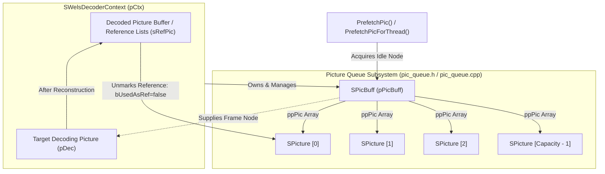
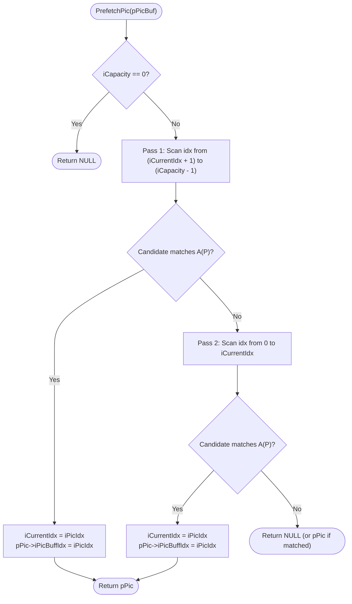
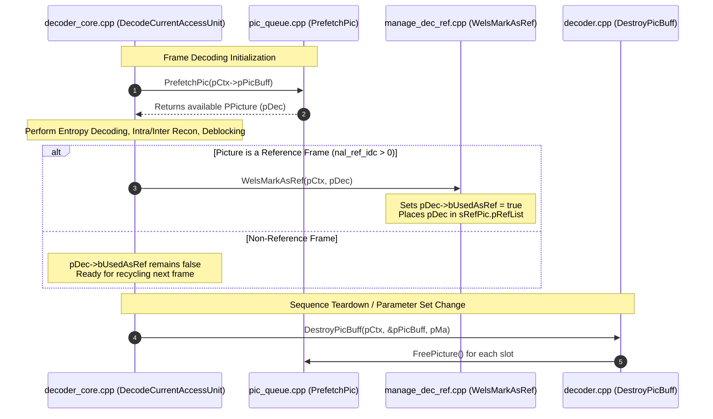

# `pic_queue.h`: Reconstructed Picture Buffer Pool & Recycled Queue

This document provides a comprehensive, literate-programming-style architectural and implementation breakdown of [`pic_queue.h`](openh264/codec/decoder/core/inc/pic_queue.h) in the Cisco OpenH264 H.264 / AVC video decoder engine.

---

## Table of Contents
1. [Architectural Overview & Module Purpose](#1-architectural-overview--module-purpose)
2. [Constants & Preprocessor Definitions](#2-constants--preprocessor-definitions)
3. [Data Structures & Memory Topology](#3-data-structures--memory-topology)
   - [3.1 `SPicBuff` / `TagPicBuff` Structure](#31-spicbuff--tagpicbuff-structure)
   - [3.2 Memory Layout & Buffer Pool Organization](#32-memory-layout--buffer-pool-organization)
   - [3.3 Pool Sizing & Capacity Requirements](#33-pool-sizing--capacity-requirements)
4. [Queue Interface Functions](#4-queue-interface-functions)
   - [4.1 `PrefetchPic`](#41-prefetchpic)
   - [4.2 `PrefetchPicForThread`](#42-prefetchpicforthread)
   - [4.3 `PrefetchLastPicForThread`](#43-prefetchlastpicforthread)
5. [Associated Memory Lifecycle Functions](#5-associated-memory-lifecycle-functions)
   - [5.1 `AllocPicture`](#51-allocpicture)
   - [5.2 `FreePicture`](#52-freepicture)
   - [5.3 `CreatePicBuff`, `IncreasePicBuff`, `DecreasePicBuff`, and `DestroyPicBuff`](#53-createpicbuff-increasepicbuff-decreasepicbuff-and-destroypicbuff)
6. [Call Graph & Subsystem Interactions](#6-call-graph--subsystem-interactions)

---

## 1. Architectural Overview & Module Purpose

In an H.264/AVC video decoder, allocating and deallocating high-resolution YUV 4:2:0 frame buffers, motion vector maps, and macroblock metadata buffers on a per-frame basis introduces intolerable heap fragmentation and dynamic memory overhead. Furthermore, decoded frames must be preserved across multiple future frames if they are marked as short-term or long-term references in the **Decoded Picture Buffer (DPB)**.

[`pic_queue.h`](openh264/codec/decoder/core/inc/pic_queue.h) defines the core data structure ([`SPicBuff`](openh264/codec/decoder/core/inc/pic_queue.h#L45-L49)) and interface routines responsible for managing a **recycled picture buffer pool**. This pool acts as a fixed-capacity circular and reference-aware memory cache that allocates a fixed number of [`SPicture`](openh264/codec/decoder/core/inc/picture.h#L51-L106) nodes during sequence initialization and recycles available nodes as soon as they are no longer referenced or locked by downstream consumers.



### Key Architectural Tenets
1. **Zero-Allocation Decoding Loop**: Once the picture buffer pool is allocated at the start of a sequence (or upon resolution/capacity change), zero dynamic heap allocations occur during the frame decoding loop.
2. **Reference-Aware Recycling**: In single-threaded decoding, [`PrefetchPic`](openh264/codec/decoder/core/inc/pic_queue.h#L55) dynamically skips any picture node whose `bUsedAsRef` flag is true or whose `iRefCount` is positive.
3. **Pipelined Multi-Threaded Round-Robin**: In multi-threaded slice/frame decoding, [`PrefetchPicForThread`](openh264/codec/decoder/core/inc/pic_queue.h#L56) advances the queue cursor in a circular FIFO round-robin fashion, decoupled from immediate reference marking.

---

## 2. Constants & Preprocessor Definitions

[`pic_queue.h`](openh264/codec/decoder/core/inc/pic_queue.h#L42) defines the following fundamental alignment macro:

```cpp
#define PICTURE_RESOLUTION_ALIGNMENT      32
```

### Technical Rationale & Memory Geometry

| Parameter | Value | Purpose & Architectural Rationale |
| :--- | :--- | :--- |
| `PICTURE_RESOLUTION_ALIGNMENT` | `32` | Defines the pixel boundary alignment applied when allocating frame buffer width and height dimensions. |

When allocating picture memory in [`AllocPicture`](openh264/codec/decoder/core/src/pic_queue.cpp#L62-L137), the allocated buffer dimensions include both edge padding boundaries (`PADDING_LENGTH = 32`) and alignment rounding:

$$\text{iPicWidth} = \text{WELS\_ALIGN}(W_{\text{pixel}} + 2 \cdot \text{PADDING\_LENGTH}, \text{PICTURE\_RESOLUTION\_ALIGNMENT})$$
$$\text{iPicHeight} = \text{WELS\_ALIGN}(H_{\text{pixel}} + 2 \cdot \text{PADDING\_LENGTH}, \text{PICTURE\_RESOLUTION\_ALIGNMENT})$$

$$\text{WELS\_ALIGN}(X, A) = (X + (A - 1)) \ \& \ \sim(A - 1)$$

#### Why 32-Byte Alignment?
1. **SIMD Vector Alignment**: SIMD execution units (such as AVX2 on x86/x64 and 128-bit NEON on ARM) require 16-byte or 32-byte aligned base pointers and line strides to execute vector load/store instructions (`vmovdqa`, `vld1q_u8`) without performance penalties or hardware faults.
2. **Sub-Pixel Motion Compensation Padding**: Sub-pixel motion compensation interpolation filters (e.g. 6-tap Wiener filter) access pixel samples outside the picture boundaries. Adding 32-pixel padding around all four edges eliminates boundary clipping branches inside inner assembly loops.
3. **Chroma 4:2:0 Subsampling**: In YUV 4:2:0 planar formats, chroma planes are downsampled by $2\times$ horizontally and vertically. Aligning luma dimensions to 32 guarantees that chroma planes remain aligned to at least 16 bytes.

---

## 3. Data Structures & Memory Topology

### 3.1 `SPicBuff` / `TagPicBuff` Structure

Declared in [`pic_queue.h`](openh264/codec/decoder/core/inc/pic_queue.h#L45-L49):

```cpp
typedef struct TagPicBuff {
  PPicture*      ppPic;
  int32_t        iCapacity;  // capacity size of queue
  int32_t        iCurrentIdx;
} SPicBuff, *PPicBuff;
```

#### Member Field Breakdown

| Field Name | Type | Description & Lifecycle |
| :--- | :--- | :--- |
| `ppPic` | [`PPicture*`](openh264/codec/decoder/core/inc/picture.h#L108) (i.e. `SPicture**`) | Dynamically allocated array of pointers to [`SPicture`](openh264/codec/decoder/core/inc/picture.h#L51-L106) instances. Length is equal to `iCapacity`. Each element `ppPic[i]` points to an independently allocated picture container. |
| `iCapacity` | `int32_t` | Total number of picture slots allocated in the queue pool. Must be greater than or equal to the maximum active reference frames (`iNumRefFrames`) plus required working slots. |
| `iCurrentIdx` | `int32_t` | Current circular cursor / index position $[0, \text{iCapacity} - 1]$ within the `ppPic` array. Tracks the last accessed or next candidate picture slot. |

---

### 3.2 Memory Layout & Buffer Pool Organization

The picture buffer pool forms a two-tier pointer hierarchy allocated via [`CMemoryAlign`](openh264/codec/common/inc/memory_align.h):

```
SPicBuff (pPicBuff)
 ├── iCapacity = N
 ├── iCurrentIdx = k
 └── ppPic ───────────► [ Ptr 0 | Ptr 1 | Ptr 2 | ... | Ptr N-1 ]
                            │       │       │             │
                            ▼       ▼       ▼             ▼
                         SPicture SPicture SPicture    SPicture
                         ┌──────────────────────────────────────┐
                         │ pBuffer[0] (YUV Linear Memory Block)  │
                         │   ├── Y-Plane  (iLumaSize)           │
                         │   ├── Cb:      (iChromaSize)         │
                         │   └── Cr:      (iChromaSize)         │
                         │ pData[0..2] (Pointers + Padding)     │
                         │ pMbCorrectlyDecodedFlag (bool array) │
                         │ pMbType (uint32_t array)             │
                         │ pMv[LIST_0, LIST_1] (Motion Vectors) │
                         │ pRefIndex[LIST_0, LIST_1] (Ref Idxs) │
                         │ pReadyEvent (Threading Events)       │
                         └──────────────────────────────────────┘
```

---

### 3.3 Pool Sizing & Capacity Requirements

The queue capacity `iCapacity` is calculated dynamically in [`decoder_core.cpp`](openh264/codec/decoder/core/src/decoder_core.cpp) based on the Sequence Parameter Set (SPS) syntax and decoding mode:

$$N_{\text{capacity}} = \max\left(N_{\text{ref\_min}}, \quad \text{pSps}\to\text{iNumRefFrames} + 1 + N_{\text{extra}}\right)$$

Where:
* $\text{pSps}\to\text{iNumRefFrames}$: Maximum short-term + long-term reference frames defined in SPS ($1 \le \text{iNumRefFrames} \le 16$).
* $+1$: Target picture currently being reconstructed (`pDec`).
* $N_{\text{extra}}$: Additional slots allocated for multi-threaded pipelining (`iThreadCount > 1`), picture reordering (`pPictReoderingStatus`), or error concealment buffering.

---

## 4. Queue Interface Functions

[`pic_queue.h`](openh264/codec/decoder/core/inc/pic_queue.h#L55-L58) declares three picture retrieval routines. Their definitions are implemented in [`pic_queue.cpp`](openh264/codec/decoder/core/src/pic_queue.cpp#L184-L243).

---

### 4.1 `PrefetchPic`

```cpp
PPicture PrefetchPic (PPicBuff pPicBuff);
```

#### Purpose & Operational Semantics
Fetches an available, recyclable [`SPicture`](openh264/codec/decoder/core/inc/picture.h#L51-L106) node from the buffer pool for single-threaded decoding or reference picture allocation during error concealment.

#### Parameters & Return Values
* **`pPicBuff`** (`PPicBuff`): Pointer to the active picture buffer queue structure.
* **Return Value** (`PPicture`): Pointer to a valid, recyclable [`SPicture`](openh264/codec/decoder/core/inc/picture.h#L51-L106) object, or `NULL` if `iCapacity == 0` or if every picture in the queue is currently in use as a reference frame.

#### Search Algorithm & Flow

The function executes a **two-pass circular search** across the `ppPic` array to locate a picture node satisfying the availability predicate $\mathcal{A}(P)$:

$$\mathcal{A}(P) = (P \neq \text{NULL}) \ \land \ (\neg P\to\text{bUsedAsRef}) \ \land \ (P\to\text{iRefCount} \le 0)$$



#### Code Implementation ([`pic_queue.cpp:184-217`](openh264/codec/decoder/core/src/pic_queue.cpp#L184-L217))
```cpp
PPicture PrefetchPic (PPicBuff pPicBuf) {
  int32_t iPicIdx = 0;
  PPicture pPic  = NULL;

  if (pPicBuf->iCapacity == 0) {
    return NULL;
  }

  // Pass 1: Scan from current index + 1 to capacity - 1
  for (iPicIdx = pPicBuf->iCurrentIdx + 1; iPicIdx < pPicBuf->iCapacity ; ++iPicIdx) {
    if (pPicBuf->ppPic[iPicIdx] != NULL && !pPicBuf->ppPic[iPicIdx]->bUsedAsRef
        && pPicBuf->ppPic[iPicIdx]->iRefCount <= 0) {
      pPic = pPicBuf->ppPic[iPicIdx];
      break;
    }
  }
  if (pPic != NULL) {
    pPicBuf->iCurrentIdx = iPicIdx;
    pPic->iPicBuffIdx = iPicIdx;
    return pPic;
  }

  // Pass 2: Wrap around and scan from 0 to current index
  for (iPicIdx = 0 ; iPicIdx <= pPicBuf->iCurrentIdx ; ++iPicIdx) {
    if (pPicBuf->ppPic[iPicIdx] != NULL && !pPicBuf->ppPic[iPicIdx]->bUsedAsRef
        && pPicBuf->ppPic[iPicIdx]->iRefCount <= 0) {
      pPic = pPicBuf->ppPic[iPicIdx];
      break;
    }
  }

  pPicBuf->iCurrentIdx = iPicIdx;
  if (pPic != NULL) {
    pPic->iPicBuffIdx = iPicIdx;
  }
  return pPic;
}
```

---

### 4.2 `PrefetchPicForThread`

```cpp
PPicture PrefetchPicForThread (PPicBuff pPicBuff);
```

#### Purpose & Multi-Threading Design
Used exclusively in multi-threaded decoding mode (`iThreadCount > 1`). Instead of evaluating reference locks in real time (which could stall worker threads or cause race conditions before slice headers are parsed), it retrieves the picture at `iCurrentIdx` and advances the index sequentially in a circular ring:

$$i_{\text{next}} = (i_{\text{current}} + 1) \bmod \text{iCapacity}$$

#### Code Implementation ([`pic_queue.cpp:219-231`](openh264/codec/decoder/core/src/pic_queue.cpp#L219-L231))
```cpp
PPicture PrefetchPicForThread (PPicBuff pPicBuf) {
  PPicture pPic = NULL;

  if (pPicBuf->iCapacity == 0) {
    return NULL;
  }
  pPic = pPicBuf->ppPic[pPicBuf->iCurrentIdx];
  pPic->iPicBuffIdx = pPicBuf->iCurrentIdx;
  if (++pPicBuf->iCurrentIdx >= pPicBuf->iCapacity) {
    pPicBuf->iCurrentIdx = 0;
  }
  return pPic;
}
```

---

### 4.3 `PrefetchLastPicForThread`

```cpp
PPicture PrefetchLastPicForThread (PPicBuff pPicBuff, const int32_t& iLast);
```

#### Purpose & Cross-Thread Synchronization
Retrieves an explicit [`SPicture`](openh264/codec/decoder/core/inc/picture.h#L51-L106) node by its buffer index (`iLastPicBuffIdx`).

#### Calling Context
When multithreaded frame decoding transitions between consecutive access units, the previous thread context (`pLastThreadCtx`) may need to complete DPB reference marking ([`WelsMarkAsRef`](openh264/codec/decoder/core/src/manage_dec_ref.cpp)) for the frame it just finished decoding. `PrefetchLastPicForThread` looks up the exact picture node using the thread's recorded `iPicBuffIdx`.

#### Code Implementation ([`pic_queue.cpp:233-243`](openh264/codec/decoder/core/src/pic_queue.cpp#L233-L243))
```cpp
PPicture PrefetchLastPicForThread (PPicBuff pPicBuf, const int32_t& iLastPicBuffIdx) {
  PPicture pPic = NULL;

  if (pPicBuf->iCapacity == 0) {
    return NULL;
  }
  if (iLastPicBuffIdx >= 0 && iLastPicBuffIdx < pPicBuf->iCapacity) {
    pPic = pPicBuf->ppPic[iLastPicBuffIdx];
  }
  return pPic;
}
```

---

## 5. Associated Memory Lifecycle Functions

While `pic_queue.h` defines the structure and retrieval interfaces, the allocation, resizing, and freeing of the queue and its underlying picture nodes are implemented in [`pic_queue.cpp`](openh264/codec/decoder/core/src/pic_queue.cpp) and [`decoder.cpp`](openh264/codec/decoder/core/src/decoder.cpp).

### 5.1 `AllocPicture`

Implemented in [`pic_queue.cpp:62-137`](openh264/codec/decoder/core/src/pic_queue.cpp#L62-L137):

```cpp
PPicture AllocPicture (PWelsDecoderContext pCtx, const int32_t kiPicWidth, const int32_t kiPicHeight);
```

#### Allocated Buffers & Sub-Structures

```
AllocPicture
 ├── SPicture Header (WelsMallocz)
 ├── YUV Pixel Planes: pBuffer[0]
 │     ├── Luma:   iPicWidth * iPicHeight bytes
 │     ├── Cb:     (iPicWidth/2) * (iPicHeight/2) bytes
 │     └── Cr:     (iPicWidth/2) * (iPicHeight/2) bytes
 ├── MB Correct Flag: pMbCorrectlyDecodedFlag (uiMbCount * sizeof(bool))
 ├── Non-Zero Coeffs: pNzc (uiMbCount * 24 bytes, threaded mode only)
 ├── Macroblock Types: pMbType (uiMbCount * sizeof(uint32_t))
 ├── Motion Vectors:   pMv[LIST_0, LIST_1] (uiMbCount * 16 * 2 * sizeof(int16_t))
 ├── Ref Indices:      pRefIndex[LIST_0, LIST_1] (uiMbCount * 16 * sizeof(int8_t))
 └── Thread Events:    pReadyEvent (uiMbHeight * sizeof(SWelsDecEvent))
```

1. **Plane Pointers & Offsets**:
   - `pBuffer[0]`: Base pointer for continuous Y+U+V memory block.
   - `pBuffer[1] = pBuffer[0] + iLumaSize` (Cb base).
   - `pBuffer[2] = pBuffer[1] + iChromaSize` (Cr base).
   - `pData[0]`: Active origin pointing past the top/left padding:
     $$pData[0] = pBuffer[0] + (1 + \text{iLinesize}[0]) \cdot \text{PADDING\_LENGTH}$$
   - `pData[1], pData[2]`: Chroma plane active origins offset by half the padding length.
2. **Macroblock Level Buffers**:
   - Number of macroblock columns: $W_{\text{MB}} = (W_{\text{pixel}} + 15) \gg 4$
   - Number of macroblock rows: $H_{\text{MB}} = (H_{\text{pixel}} + 15) \gg 4$
   - Total macroblocks: $N_{\text{MB}} = W_{\text{MB}} \cdot H_{\text{MB}}$

---

### 5.2 `FreePicture`

Implemented in [`pic_queue.cpp:139-183`](openh264/codec/decoder/core/src/pic_queue.cpp#L139-L183):

```cpp
void FreePicture (PPicture pPic, CMemoryAlign* pMa);
```

Performs orderly teardown:
1. Frees `pBuffer[0]` (releasing the combined YUV pixel plane allocation).
2. Frees macroblock metadata arrays: `pMbCorrectlyDecodedFlag`, `pNzc`, `pMbType`, `pMv[LIST_0]`, `pMv[LIST_1]`, `pRefIndex[LIST_0]`, and `pRefIndex[LIST_1]`.
3. Destroys all macroblock-row synchronization events in `pReadyEvent` via `CLOSE_EVENT(&pPic->pReadyEvent[i])` and frees the array.
4. Frees the [`SPicture`](openh264/codec/decoder/core/inc/picture.h#L51-L106) structure itself.

---

### 5.3 `CreatePicBuff`, `IncreasePicBuff`, `DecreasePicBuff`, and `DestroyPicBuff`

Implemented in [`decoder.cpp:63-280`](openh264/codec/decoder/core/src/decoder.cpp#L63-L280):

| Function | Purpose & Dynamic Resizing Strategy |
| :--- | :--- |
| **`CreatePicBuff`** | Allocates `SPicBuff`, creates the `ppPic` pointer array of size `kiSize`, and calls `AllocPicture` for each slot $[0, \text{kiSize}-1]$. |
| **`IncreasePicBuff`** | Allocates a new `SPicBuff` with larger capacity `kiNewSize`. Copies existing `ppPic` pointers from old queue $[0, \text{kiOldSize}-1]$ and allocates new `SPicture` instances for the expansion slots $[\text{kiOldSize}, \text{kiNewSize}-1]$. Frees old queue header. |
| **`DecreasePicBuff`** | Reallocates a smaller `SPicBuff`. Preserves active DPB reference pictures, frees unused excess `SPicture` instances via `FreePicture`, and updates queue pointers. |
| **`DestroyPicBuff`** | Iterates over all picture slots $[0, \text{iCapacity}-1]$, calls `FreePicture` for each valid `pPic`, frees the `ppPic` array, and deallocates `SPicBuff`. |

---

## 6. Call Graph & Subsystem Interactions



### Summary of Symbol & File Links
* Header: [`codec/decoder/core/inc/pic_queue.h`](openh264/codec/decoder/core/inc/pic_queue.h)
* Implementation: [`codec/decoder/core/src/pic_queue.cpp`](openh264/codec/decoder/core/src/pic_queue.cpp)
* Reconstructed Picture Structure: [`codec/decoder/core/inc/picture.h`](openh264/codec/decoder/core/inc/picture.h)
* Decoder Context: [`codec/decoder/core/inc/decoder_context.h`](openh264/codec/decoder/core/inc/decoder_context.h)
* Queue Allocator & Sizing: [`codec/decoder/core/src/decoder.cpp`](openh264/codec/decoder/core/src/decoder.cpp)
* Frame Decoding Loop: [`codec/decoder/core/src/decoder_core.cpp`](openh264/codec/decoder/core/src/decoder_core.cpp)
* Reference Management: [`codec/decoder/core/src/manage_dec_ref.cpp`](openh264/codec/decoder/core/src/manage_dec_ref.cpp)
