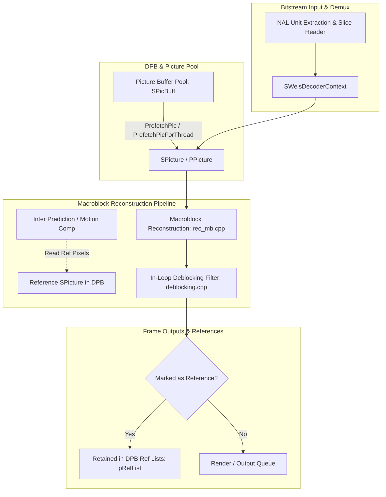
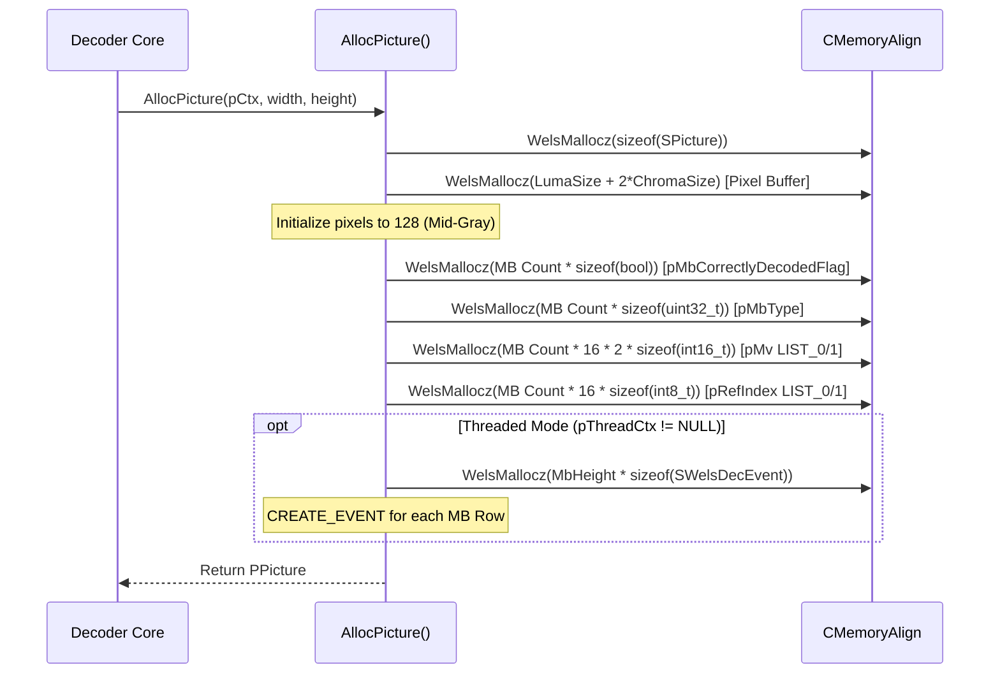

# OpenH264 Architecture & Implementation: Reconstructed Picture Management (`picture.h`)

This document provides comprehensive, literate-programming-style technical documentation for [`picture.h`](openh264/codec/decoder/core/inc/picture.h#L1-L113) in the OpenH264 decoder core engine. It covers the architectural role, memory layouts, data structures, member lifecycle, reference management, direct-mode motion vector caching, multi-threaded row synchronization, and error-concealment metadata.

---

## Table of Contents
1. [Architectural Role & System Context](#1-architectural-role--system-context)
2. [Memory Layout & Plane Organization](#2-memory-layout--plane-organization)
3. [Data Structures & Typedefs](#3-data-structures--typedefs)
   - [3.1 Structure `SPicture`](#31-structure-spicture)
   - [3.2 Typedef `PPicture`](#32-typedef-ppicture)
   - [3.3 Comprehensive Field Reference Table](#33-comprehensive-field-reference-table)
4. [Memory Allocation, Geometry & Lifecycle Methods](#4-memory-allocation-geometry--lifecycle-methods)
   - [4.1 Picture Allocation (`AllocPicture`)](#41-picture-allocation-allocpicture)
   - [4.2 Picture Destruction (`FreePicture`)](#42-picture-destruction-freepicture)
   - [4.3 Recycled Picture Buffer Queue (`PrefetchPic`)](#43-recycled-picture-buffer-queue-prefetchpic)
5. [Algorithmic Interactions & Subsystem Integration](#5-algorithmic-interactions--subsystem-integration)
   - [5.1 Motion Compensation & SIMD Boundary Padding](#51-motion-compensation--simd-boundary-padding)
   - [5.2 B-Slice Temporal Direct Mode Derivation](#52-b-slice-temporal-direct-mode-derivation)
   - [5.3 Error Concealment Tracking](#53-error-concealment-tracking)
   - [5.4 Multi-Threaded Row Synchronization (`pReadyEvent`)](#54-multi-threaded-row-synchronization-preadyevent)
6. [Summary Code Map](#6-summary-code-map)

---

## 1. Architectural Role & System Context

In the OpenH264 video decoder, [`SPicture`](openh264/codec/decoder/core/inc/picture.h#L51-L106) is the primary data structure encapsulating a decoded frame buffer. It serves multiple overlapping roles throughout the H.264 / AVC decoding pipeline:

1. **Reconstruction Target Canvas**: Holds the uncompressed YUV 4:2:0 planar pixel data currently being assembled by the slice decoding and macroblock reconstruction loops ([`rec_mb.cpp`](openh264/codec/decoder/core/src/rec_mb.cpp) and [`decode_slice.cpp`](openh264/codec/decoder/core/src/decode_slice.cpp)).
2. **Reference Frame Storage (DPB)**: Stored in the Decoded Picture Buffer ([`SPicBuff`](openh264/codec/decoder/core/inc/pic_queue.h#L45-L49)) and indexed by short-term (`pShortRefList`) and long-term (`pLongRefList`) reference lists ([`manage_dec_ref.cpp`](openh264/codec/decoder/core/src/manage_dec_ref.cpp)) to supply prediction samples for inter-macroblock motion compensation.
3. **Temporal Motion Vector & Reference Index Cache**: Maintains macroblock-level metadata (`pMbType`, `pMv`, `pRefIndex`, `pRefPic`) required for B-slice direct mode motion vector scaling and temporal collocated predictor derivation.
4. **Display Output Frame**: Handed off to the external application or renderer via the public interface ([`ISVCDecoder`](openh264/codec/api/wels/codec_api.h)) after post-processing and in-loop deblocking.
5. **Thread Synchronization Primitive**: Carries row-level synchronization events (`pReadyEvent`) allowing frame-level or slice-level multithreading worker threads to signal progress across macroblock rows.



---

## 2. Memory Layout & Plane Organization

To maximize SIMD throughput (SSE2, AVX2, NEON) and eliminate out-of-bounds branching during fractional-pel motion compensation (6-tap FIR filtering), OpenH264 allocates all three YUV color planes (Luma $Y$, Chroma $C_b$, Chroma $C_r$) within a **single contiguous memory buffer** aligned to 32-byte boundaries.

### 2.1 Buffer Dimension & Stride Calculations

For a coded picture with width $W_{\text{pixel}}$ and height $H_{\text{pixel}}$ in luma samples:

$$\text{Stride}_{\text{Luma}} = \text{ALIGN}\left(W_{\text{pixel}} + 2 \cdot \text{PADDING\_LENGTH}, \; \text{PICTURE\_RESOLUTION\_ALIGNMENT}\right)$$

$$\text{Height}_{\text{Alloc}} = \text{ALIGN}\left(H_{\text{pixel}} + 2 \cdot \text{PADDING\_LENGTH}, \; \text{PICTURE\_RESOLUTION\_ALIGNMENT}\right)$$

where $\text{PADDING\_LENGTH} = 32$ and $\text{PICTURE\_RESOLUTION\_ALIGNMENT} = 32$.

For the chroma planes (4:2:0 subsampling):

$$\text{Stride}_{\text{Chroma}} = \frac{\text{Stride}_{\text{Luma}}}{2}$$

$$\text{Height}_{\text{Chroma}} = \frac{\text{Height}_{\text{Alloc}}}{2}$$

The total allocated contiguous byte size $S_{\text{total}}$ is:

$$S_{\text{Luma}} = \text{Stride}_{\text{Luma}} \times \text{Height}_{\text{Alloc}}$$

$$S_{\text{Chroma}} = \text{Stride}_{\text{Chroma}} \times \text{Height}_{\text{Chroma}} = \frac{1}{4} S_{\text{Luma}}$$

$$S_{\text{total}} = S_{\text{Luma}} + 2 \times S_{\text{Chroma}} = \frac{3}{2} S_{\text{Luma}}$$

### 2.2 Buffer Pointers vs. Data Pointers

* `pBuffer[i]`: Points to the absolute physical memory base allocated for plane $i$ (including the top/left border padding).
* `pData[i]`: Points to the active top-left pixel $(0, 0)$ of the visible picture area, offset past the padding margins.

```
+-----------------------------------------------------------------------------------+
| pBuffer[0] (Physical Luma Allocation Base)                                        |
| <----------------------------- Stride_Luma -------------------------------------> |
| +-------------------------------------------------------------------------------+ |
| |                         TOP PADDING (32 rows)                                 | |
| |-------------------------------------------------------------------------------| |
| | LEFT PADDING (32 px) | pData[0] -> Visible Luma Pixels | RIGHT PADDING (32 px) | |
| |                      |            (W_pixel x H_pixel)  |                      | |
| |-------------------------------------------------------------------------------| |
| |                         BOTTOM PADDING (32 rows)                              | |
| +-------------------------------------------------------------------------------+ |
+-----------------------------------------------------------------------------------+
| pBuffer[1] (Physical Chroma Cb Base = pBuffer[0] + S_Luma)                        |
| +-------------------------------------------------------------------------------+ |
| | pData[1] -> Active Cb Plane (offset by padding / 2)                           | |
+-----------------------------------------------------------------------------------+
| pBuffer[2] (Physical Chroma Cr Base = pBuffer[1] + S_Chroma)                      |
| +-------------------------------------------------------------------------------+ |
| | pData[2] -> Active Cr Plane (offset by padding / 2)                           | |
+-----------------------------------------------------------------------------------+
```

The data pointer offsets are computed as:

$$\text{pData}[0] = \text{pBuffer}[0] + (1 + \text{iLinesize}[0]) \cdot \text{PADDING\_LENGTH}$$

$$\text{pData}[1] = \text{pBuffer}[1] + \left( \frac{(1 + \text{iLinesize}[1]) \cdot \text{PADDING\_LENGTH}}{2} \right)$$

$$\text{pData}[2] = \text{pBuffer}[2] + \left( \frac{(1 + \text{iLinesize}[2]) \cdot \text{PADDING\_LENGTH}}{2} \right)$$

---

## 3. Data Structures & Typedefs

Defined in [`picture.h`](openh264/codec/decoder/core/inc/picture.h#L51-L110):

### 3.1 Structure `SPicture`

```cpp
namespace WelsDec {

struct SPicture {
  /************************************payload data*********************************/
  uint8_t*        pBuffer[4];             // pointer to the first allocated byte
  uint8_t*        pData[4];               // pointer to picture planes respectively
  int32_t         iLinesize[4];           // linesize of picture planes respectively used currently
  int32_t         iPlanes;                // How many planes are introduced due to color space format?

  /*******************************from EC mv copy****************************/
  bool            bIdrFlag;

  /*******************************from other standard syntax****************************/
  int32_t         iWidthInPixel;          // picture width in pixel
  int32_t         iHeightInPixel;         // picture height in pixel
  int32_t         iFramePoc;              // frame POC

  /*******************************self_definition for misc use****************************/
  bool            bUsedAsRef;             // for ref pic management
  bool            bIsLongRef;             // long term reference frame flag
  int8_t          iRefCount;
  void            (*pSetUnRef)(WelsDec::SPicture*);

  bool            bIsComplete;            // indicate whether current picture is complete, not from EC
  
  /*******************************for future use / SVC****************************/
  uint8_t         uiTemporalId;
  uint8_t         uiSpatialId;
  uint8_t         uiQualityId;

  int32_t         iFrameNum;              // frame number for ref pic management
  int32_t         iFrameWrapNum;          // frame wrap number for ref pic management
  int32_t         iLongTermFrameIdx;      // id for long term ref pic
  uint32_t        uiLongTermPicNum;       // long_term_pic_num

  int32_t         iSpsId;                 // against mosaic caused by cross-IDR interval reference
  int32_t         iPpsId;
  unsigned long long uiTimeStamp;
  uint32_t        uiDecodingTimeStamp;    // represent relative decoding time stamps
  int32_t         iPicBuffIdx;
  EWelsSliceType  eSliceType;
  bool            bIsUngroupedMultiSlice; // multi-slice picture where each slice group contains one slice
  bool            bNewSeqBegin;
  int32_t         iMbEcedNum;
  int32_t         iMbEcedPropNum;
  int32_t         iMbNum;

  bool*           pMbCorrectlyDecodedFlag;
  int8_t          (*pNzc)[24];
  uint32_t*       pMbType;                // mb type used for direct mode
  int16_t         (*pMv[LIST_A])[MB_BLOCK4x4_NUM][MV_A]; // used for direct mode
  int8_t          (*pRefIndex[LIST_A])[MB_BLOCK4x4_NUM];  // used for direct mode
  struct SPicture* pRefPic[LIST_A][17];   // ref pictures used for direct mode
  SWelsDecEvent*  pReadyEvent;            // MB line ready event
};

typedef struct SPicture* PPicture;

} // namespace WelsDec
```

> [!NOTE]
> **Naming Rationale**: The structure is named `SPicture` (and typedef `PPicture`) rather than plain `Picture` to avoid symbol collisions with legacy QuickTime and macOS system header definitions.

---

### 3.2 Typedef `PPicture`

[`PPicture`](openh264/codec/decoder/core/inc/picture.h#L108) is defined as:
```cpp
typedef struct SPicture* PPicture;
```
It is the standard pointer type used across the decoder codebase for reference picture lists (`pRefList`), decoded picture passing, and picture buffer pool arrays.

---

### 3.3 Comprehensive Field Reference Table

| Field Name | Type | Size / Dimensions | Description & Functional Semantics |
| :--- | :--- | :--- | :--- |
| `pBuffer[4]` | `uint8_t*` | 4 pointers | Base memory address of allocated buffers for planes (Y, Cb, Cr, +1 reserved). Includes padding borders. |
| `pData[4]` | `uint8_t*` | 4 pointers | Memory pointers to the top-left visible pixel $(0, 0)$ for each color plane. |
| `iLinesize[4]` | `int32_t` | 4 elements | Stride (bytes per line) for each plane. `iLinesize[0]` is Luma stride; `iLinesize[1,2]` are Chroma strides. |
| `iPlanes` | `int32_t` | 4 bytes | Number of color planes in the image (defaults to 3 for YUV 4:2:0 / YV12). |
| `bIdrFlag` | `bool` | 1 byte | `true` if this picture is an IDR (Instantaneous Decoder Refresh) keyframe (`NAL_UNIT_CODED_SLICE_IDR`). |
| `iWidthInPixel` | `int32_t` | 4 bytes | Active picture width in luma pixels ($16 \times \text{iMbWidth}$). |
| `iHeightInPixel` | `int32_t` | 4 bytes | Active picture height in luma pixels ($16 \times \text{iMbHeight}$). |
| `iFramePoc` | `int32_t` | 4 bytes | Picture Order Count (POC). Defines output display order and temporal direct mode distance scaling. |
| `bUsedAsRef` | `bool` | 1 byte | `true` if the picture is currently marked as a reference picture in the DPB. |
| `bIsLongRef` | `bool` | 1 byte | `true` if marked as a Long-Term Reference (LTR) frame. |
| `iRefCount` | `int8_t` | 1 byte | Active reference/usage counter. Prevents recycling while held by threads or reference lists. |
| `pSetUnRef` | `void (*)(SPicture*)` | Function Pointer | Callback invoked to clear the reference mark and release the picture. |
| `bIsComplete` | `bool` | 1 byte | `true` if all macroblocks in the picture were completely and cleanly decoded from the bitstream. |
| `uiTemporalId` | `uint8_t` | 1 byte | SVC Temporal Layer Identifier ($T_{id} \in [0, 7]$). |
| `uiSpatialId` | `uint8_t` | 1 byte | SVC Spatial Dependency Layer Identifier ($D_{id} \in [0, 7]$). |
| `uiQualityId` | `uint8_t` | 1 byte | SVC Quality Layer Identifier ($Q_{id} \in [0, 15]$). |
| `iFrameNum` | `int32_t` | 4 bytes | `frame_num` syntax element parsed from slice header. |
| `iFrameWrapNum` | `int32_t` | 4 bytes | Normalized frame wrap number used during reference picture list construction. |
| `iLongTermFrameIdx`| `int32_t` | 4 bytes | Long-term frame index assigned via MMCO commands (`long_term_frame_idx`). |
| `uiLongTermPicNum` | `uint32_t` | 4 bytes | Derived long-term picture number. |
| `iSpsId` | `int32_t` | 4 bytes | Bound Sequence Parameter Set ID (`seq_parameter_set_id`). Prevents cross-SPS mosaic corruption. |
| `iPpsId` | `int32_t` | 4 bytes | Bound Picture Parameter Set ID (`pic_parameter_set_id`). |
| `uiTimeStamp` | `unsigned long long` | 8 bytes | External presentation timestamp (PTS) in microseconds/clock ticks. |
| `uiDecodingTimeStamp` | `uint32_t` | 4 bytes | Monotonic internal decoder sequence counter. |
| `iPicBuffIdx` | `int32_t` | 4 bytes | Index of this picture node inside the parent [`SPicBuff`](openh264/codec/decoder/core/inc/pic_queue.h#L45-L49) pool. |
| `eSliceType` | `EWelsSliceType` | Enum | Primary slice type of the picture (`I_SLICE`, `P_SLICE`, `B_SLICE`). |
| `bIsUngroupedMultiSlice` | `bool` | 1 byte | `true` if multi-slice frame where each slice group contains exactly one slice. |
| `bNewSeqBegin` | `bool` | 1 byte | `true` if this picture starts a new video sequence. |
| `iMbEcedNum` | `int32_t` | 4 bytes | Total number of macroblocks in this picture that underwent error concealment. |
| `iMbEcedPropNum` | `int32_t` | 4 bytes | Number of macroblocks affected by error-concealment propagation. |
| `iMbNum` | `int32_t` | 4 bytes | Total macroblock count ($MB_{\text{count}} = \text{uiMbWidth} \times \text{uiMbHeight}$). |
| `pMbCorrectlyDecodedFlag` | `bool*` | `iMbNum` bytes | Array of boolean flags indicating clean decoding per macroblock. |
| `pNzc` | `int8_t (*)[24]` | `iMbNum × 24` bytes | Non-Zero Count (NZC) transform coefficient table for multithreaded decoding context sharing. |
| `pMbType` | `uint32_t*` | `iMbNum × 4` bytes | Array of macroblock coding types (`MB_TYPE_*`). Used for B-slice direct mode derivation. |
| `pMv[LIST_A]` | `int16_t (*)[16][2]` | `2 × iMbNum × 16 × 2 × 2` bytes | Motion vectors for `LIST_0` and `LIST_1` per 4x4 block inside every macroblock. |
| `pRefIndex[LIST_A]` | `int8_t (*)[16]` | `2 × iMbNum × 16` bytes | Reference frame indices for `LIST_0` and `LIST_1` per 4x4 block inside every macroblock. |
| `pRefPic[LIST_A][17]` | `SPicture*` | $2 \times 17$ pointers | Pointers to active reference pictures in `LIST_0` and `LIST_1` used for motion compensation. |
| `pReadyEvent` | `SWelsDecEvent*` | `uiMbHeight` events | Row-level synchronization events for macroblock line decoding in threaded mode. |

---

## 4. Memory Allocation, Geometry & Lifecycle Methods

The lifecycle of an [`SPicture`](openh264/codec/decoder/core/inc/picture.h#L51-L106) object is managed by the picture queue subsystem in [`pic_queue.cpp`](openh264/codec/decoder/core/src/pic_queue.cpp#L1-L246).

### 4.1 Picture Allocation (`AllocPicture`)

```cpp
PPicture AllocPicture (PWelsDecoderContext pCtx, const int32_t kiPicWidth, const int32_t kiPicHeight);
```

Defined in [`pic_queue.cpp:L62-L137`](openh264/codec/decoder/core/src/pic_queue.cpp#L62-L137).



Key Implementation Highlights:
1. **Pixel Buffer Initialization**: `memset(pPic->pBuffer[0], 128, ...)` fills the entire allocated pixel buffer (including padding borders) with `128` (neutral mid-gray). This ensures predictable boundary samples if out-of-frame motion vectors reference uninitialized padding.
2. **Parse-Only Optimization**: If `pCtx->pParam->bParseOnly` is enabled, pixel allocation is bypassed (`pPic->pBuffer[0..2] = NULL`), and only metadata arrays are allocated.
3. **Macroblock Array Allocation**: Allocates `pMbCorrectlyDecodedFlag`, `pMbType`, `pMv[LIST_0]`, `pMv[LIST_1]`, `pRefIndex[LIST_0]`, and `pRefIndex[LIST_1]` sized proportionally to $MB_{\text{count}} = \left(\frac{W + 15}{16}\right) \times \left(\frac{H + 15}{16}\right)$.

---

### 4.2 Picture Destruction (`FreePicture`)

```cpp
void FreePicture (PPicture pPic, CMemoryAlign* pMa);
```

Defined in [`pic_queue.cpp:L139-L183`](openh264/codec/decoder/core/src/pic_queue.cpp#L139-L183).

Safely frees all heap buffers associated with the picture in reverse order of allocation:
1. Deallocates contiguous pixel buffer `pPic->pBuffer[0]`.
2. Frees macroblock status flag array `pPic->pMbCorrectlyDecodedFlag`.
3. Frees multi-threaded NZC array `pPic->pNzc` (if allocated).
4. Frees macroblock type array `pPic->pMbType`.
5. Frees motion vector matrices `pPic->pMv[LIST_0]` and `pPic->pMv[LIST_1]`.
6. Frees reference index matrices `pPic->pRefIndex[LIST_0]` and `pPic->pRefIndex[LIST_1]`.
7. Closes and frees row-level thread synchronization events `pPic->pReadyEvent[i]`.
8. Frees the top-level `SPicture` struct container.

---

### 4.3 Recycled Picture Buffer Queue (`PrefetchPic`)

Defined in [`pic_queue.cpp:L184-L217`](openh264/codec/decoder/core/src/pic_queue.cpp#L184-L217).

To eliminate runtime memory allocations during steady-state video decoding, OpenH264 manages pictures in a circular recycled buffer pool ([`SPicBuff`](openh264/codec/decoder/core/inc/pic_queue.h#L45-L49)).

A picture node in the pool is eligible for reuse if and only if:
$$\neg \text{bUsedAsRef} \quad \wedge \quad \text{iRefCount} \le 0$$

```cpp
PPicture PrefetchPic (PPicBuff pPicBuf) {
  int32_t iPicIdx = 0;
  PPicture pPic  = NULL;

  if (pPicBuf->iCapacity == 0) return NULL;

  for (iPicIdx = pPicBuf->iCurrentIdx + 1; iPicIdx < pPicBuf->iCapacity; ++iPicIdx) {
    if (pPicBuf->ppPic[iPicIdx] != NULL && !pPicBuf->ppPic[iPicIdx]->bUsedAsRef
        && pPicBuf->ppPic[iPicIdx]->iRefCount <= 0) {
      pPic = pPicBuf->ppPic[iPicIdx];
      break;
    }
  }
  // Wrap-around search from index 0 if not found in upper partition
  if (pPic == NULL) {
    for (iPicIdx = 0; iPicIdx <= pPicBuf->iCurrentIdx; ++iPicIdx) {
      if (pPicBuf->ppPic[iPicIdx] != NULL && !pPicBuf->ppPic[iPicIdx]->bUsedAsRef
          && pPicBuf->ppPic[iPicIdx]->iRefCount <= 0) {
        pPic = pPicBuf->ppPic[iPicIdx];
        break;
      }
    }
  }
  ...
  return pPic;
}
```

---

## 5. Algorithmic Interactions & Subsystem Integration

### 5.1 Motion Compensation & SIMD Boundary Padding

During fractional-pel motion compensation ([`mc.cpp`](openh264/codec/common/src/mc.cpp)), half-pel interpolation applies a 6-tap symmetric FIR filter:

$$S_{\text{half}} = \text{Clip1}\left(\frac{E - 5F + 20G + 20H - 5I + J + 16}{32}\right)$$

When motion vectors point outside the visible picture frame, the 6-tap filter accesses samples up to $\pm 3$ pixels outside the boundary. By embedding `PADDING_LENGTH = 32` pixels surrounding `pData[0..2]`, OpenH264 allows vector SIMD instructions (128-bit SSE / 256-bit AVX / NEON) to read clamped edge samples directly from memory without costly branch conditions or coordinate clamping per pixel.

---

### 5.2 B-Slice Temporal Direct Mode Derivation

In B-slice decoding, Direct Mode macroblocks derive motion vectors from collocated macroblocks in the reference picture stored in `LIST_1[0]`. The arrays embedded in [`SPicture`](openh264/codec/decoder/core/inc/picture.h#L51-L106) (`pMv`, `pRefIndex`, `pRefPic`, `iFramePoc`) supply the temporal parameters:

$$\text{DistScaleFactor} = \text{Clip3}\left(-1024, 1023, \frac{(POC_{\text{curr}} - POC_{L0}) \times 256}{POC_{L1} - POC_{L0}}\right)$$

$$MV_{L0} = \frac{\text{DistScaleFactor} \times MV_{\text{col}} + 128}{256}$$

$$MV_{L1} = MV_{L0} - MV_{\text{col}}$$

---

### 5.3 Error Concealment Tracking

When bitstream packet loss or syntax corruptions occur:
1. `pMbCorrectlyDecodedFlag[mb_index]` marks whether each macroblock was decoded cleanly.
2. If corrupted, [`DoMbECMvCopy`](openh264/codec/decoder/core/src/error_concealment.cpp) copies collocated motion vectors and pixel data from `pPreviousDecodedPictureInDpb`.
3. `iMbEcedNum` records the count of concealed macroblocks, while `iMbEcedPropNum` tracks error propagation to downstream frames.

---

### 5.4 Multi-Threaded Row Synchronization (`pReadyEvent`)

For multi-threaded slice and frame decoding ([`wels_decoder_thread.h`](openh264/codec/decoder/core/inc/wels_decoder_thread.h)):

* `pReadyEvent` contains an array of `SWelsDecEvent` handles, with one event per macroblock row ($0 \le y < \text{uiMbHeight}$).
* As worker thread $T_A$ completes reconstruction and deblocking for row $Y$, it signals `pReadyEvent[Y]` (`SET_EVENT`).
* Dependent worker thread $T_B$ (decoding a subsequent frame or dependent slice) waits on `pReadyEvent[Y]` (`WAIT_EVENT`) before reading reference samples from row $Y$.

---

## 6. Summary Code Map

| File | Purpose |
| :--- | :--- |
| [`picture.h`](openh264/codec/decoder/core/inc/picture.h#L1-L113) | Definition of `SPicture` struct and `PPicture` pointer typedef. |
| [`pic_queue.h`](openh264/codec/decoder/core/inc/pic_queue.h#L1-L63) | Recycled picture buffer queue declarations (`SPicBuff`). |
| [`pic_queue.cpp`](openh264/codec/decoder/core/src/pic_queue.cpp#L1-L246) | Memory allocation (`AllocPicture`), cleanup (`FreePicture`), and recycling logic (`PrefetchPic`). |
| [`decoder_context.h`](openh264/codec/decoder/core/inc/decoder_context.h#L306-L455) | Core decoder context embedding active reconstruction target `pDec` and reference lists. |
| [`manage_dec_ref.cpp`](openh264/codec/decoder/core/src/manage_dec_ref.cpp) | Reference picture list marking (MMCO) and DPB sliding window management. |
| [`error_concealment.cpp`](openh264/codec/decoder/core/src/error_concealment.cpp) | Spatial and temporal error concealment using `SPicture` metadata. |
