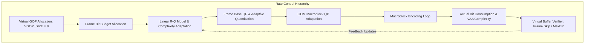
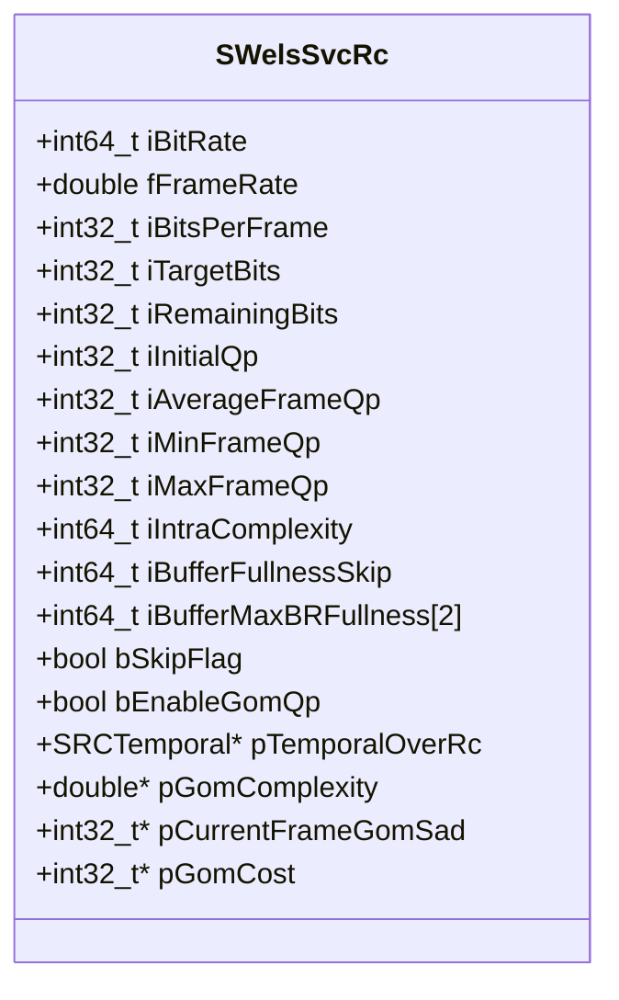
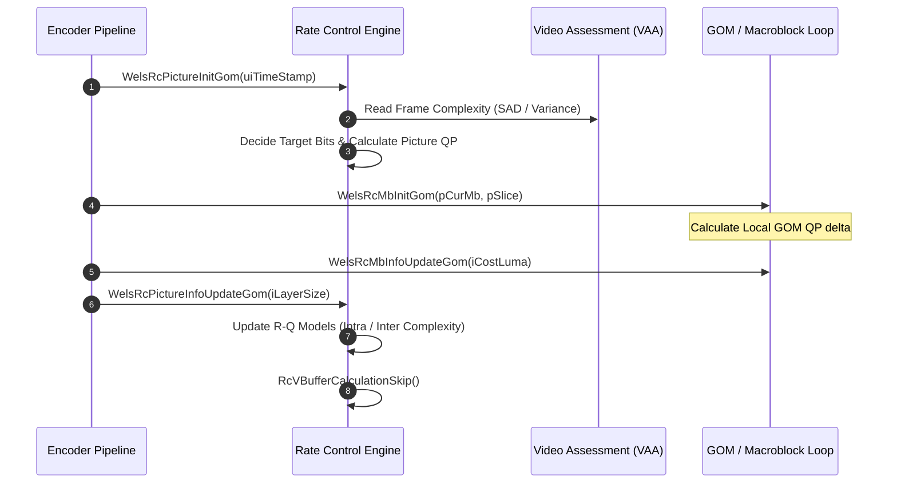

# Literate Documentation: `ratectl.cpp` — OpenH264 Rate Control Subsystem

This document provides a comprehensive, literate-programming analysis of the hierarchical rate control engine implemented in [ratectl.cpp](openh264/codec/encoder/core/src/ratectl.cpp) and declared in [rc.h](openh264/codec/encoder/core/inc/rc.h).

---

## Table of Contents
1. [Subsystem Overview & Architectural Role](#1-subsystem-overview--architectural-role)
2. [Constants, Lookup Tables, and Fixed-Point Arithmetic](#2-constants-lookup-tables-and-fixed-point-arithmetic)
3. [Data Structures Deep-Dive](#3-data-structures-deep-dive)
   - [3.1 SRCTemporal](#31-srctemporal)
   - [3.2 SWelsSvcRc](#32-swelssvcrc)
   - [3.3 SWelsRcFunc Function Pointer Dispatch Table](#33-swelsrcfunc-function-pointer-dispatch-table)
   - [3.4 RC_MODES Enumeration](#34-rc_modes-enumeration)
4. [Hierarchical Rate Control Pipeline & Algorithms](#4-hierarchical-rate-control-pipeline--algorithms)
5. [Complete Function & Method Reference](#5-complete-function--method-reference)
   - [5.1 Memory Management & Allocation](#51-memory-management--allocation)
   - [5.2 Quantization Step Conversion Utilities](#52-quantization-step-conversion-utilities)
   - [5.3 Sequence & Virtual GOP (VGOP) Initialization](#53-sequence--virtual-gop-vgop-initialization)
   - [5.4 Frame-Level Bit Budget & Target Allocation](#54-frame-level-bit-budget--target-allocation)
   - [5.5 Frame-Level Quantization Parameter (QP) Calculation](#55-frame-level-quantization-parameter-qp-calculation)
   - [5.6 Group of Macroblocks (GOM) & Macroblock QP Control](#56-group-of-macroblocks-gom--macroblock-qp-control)
   - [5.7 Virtual Buffer Verifier (VBV), Frame Skipping, and Bitrate Capping](#57-virtual-buffer-verifier-vbv-frame-skipping-and-bitrate-capping)
   - [5.8 Complexity Update & Feedback Adaptation Loop](#58-complexity-update--feedback-adaptation-loop)
   - [5.9 Screen Content Coding (SCC) & Buffer-Based Modes](#59-screen-content-coding-scc--buffer-based-modes)
   - [5.10 Dispatch Table Initialization & Top-Level Entry Points](#510-dispatch-table-initialization--top-level-entry-points)

---

## 1. Subsystem Overview & Architectural Role

The rate control subsystem in OpenH264 regulates the bitstream generation to match target bitrates while maximizing perceptual video quality, preventing buffer underflow/overflow, and maintaining temporal stability across Scalable Video Coding (SVC) hierarchies.



### Key Architectural Tenets
1. **Scalable Hierarchical Rate Control**: Allocates bit budgets across spatial dependency layers ($D_0, D_1, \dots$) and hierarchical temporal layers ($T_0, T_1, T_2, T_3$). Lower temporal layers (serving as key temporal references) are assigned larger bit budgets and lower QPs.
2. **Virtual GOP (VGOP) Framework**: Operates over a virtual group of pictures ($\text{VGOP\_SIZE} = 8$ frames) to distribute bits non-linearly across temporal decomposition stages.
3. **Linear Rate-Complexity Model ($R-Q$)**: Relates bit consumption $R$, quantization step $Q_{\text{step}}$, and frame complexity $X$ via:
   $$R = \frac{X}{Q_{\text{step}}}$$
   Complexity is dynamically tracked using Sum of Absolute Differences (SAD) and frame variances computed during Video Assessment and Analysis (VAA) in [wels_preprocess.cpp](openh264/codec/encoder/core/src/wels_preprocess.cpp).
4. **Group of Macroblocks (GOM) Local Adaptation**: Subdivides pictures into macroblock rows (GOM units) to dynamically adjust macroblock QPs during slice encoding based on local SAD and residual bit quotas.
5. **Virtual Buffer Verifier (VBV) & Frame Skipping**: Monitors virtual buffer fullness against maximum bitrate constraints and frame rate deadlines over a dual-window sliding time model (`TIME_CHECK_WINDOW` = 5000 ms).

---

## 2. Constants, Lookup Tables, and Fixed-Point Arithmetic

To avoid floating-point overhead and ensure deterministic cross-platform execution, [ratectl.cpp](openh264/codec/encoder/core/src/ratectl.cpp) relies on fixed-point integer scaling multipliers:

* `INT_MULTIPLY = 100`: Base scaling multiplier for double-to-integer conversion ($1.0 \equiv 100$).
* `WEIGHT_MULTIPLY = 2000`: Base scaling multiplier for temporal layer weights ($1.0 \equiv 2000$).

### 2.1 QP to Quantization Step Lookup Table

[g_kiQpToQstepTable](openh264/codec/encoder/core/src/ratectl.cpp#L52-L59) defines the integer quantization step sizes scaled by `INT_MULTIPLY` (100) for all valid H.264 QP values ($0 \le \text{QP} \le 51$):

$$Q_{\text{step}}(\text{QP}) = \text{round}\left( 100 \times 2^{\frac{\text{QP} - 4}{6}} \right)$$

```cpp
const int32_t g_kiQpToQstepTable[52] = {
    63,    71,    79,    89,   100,   112,   126,   141,   159,   178,
   200,   224,   252,   283,   317,   356,   400,   449,   504,   566,
   635,   713,   800,   898,  1008,  1131,  1270,  1425,  1600,  1796,
  2016,  2263,  2540,  2851,  3200,  3592,  4032,  4525,  5080,  5702,
  6400,  7184,  8063,  9051, 10159, 11404, 12800, 14368, 16127, 18102,
 20319, 22807
};
```

### 2.2 Macro Definitions and Constants

| Constant | Value | Description |
| :--- | :--- | :--- |
| `VGOP_SIZE` | `8` | Size of the Virtual GOP in frames. |
| `IDR_BITRATE_RATIO` | `4` | Bitrate allocation multiplier for IDR frames relative to average frame bits. |
| `LINEAR_MODEL_DECAY_FACTOR` | `80` | Moving-average memory factor ($\alpha = 0.80$, scaled by 100) for $R-Q$ complexity updates. |
| `FRAME_CMPLX_RATIO_RANGE` | `20` | Dynamic range clamp ($\pm 20\%$) for frame complexity ratios. |
| `TIME_CHECK_WINDOW` | `5000` | Sliding time check window duration (in milliseconds) for Max-Bitrate enforcement. |
| `SKIP_RATIO` | `50` | Buffer fullness skip threshold factor ($50\%$). |
| `PADDING_BUFFER_RATIO`| `50` | Buffer fullness padding trigger threshold factor ($50\%$). |
| `PADDING_THRESHOLD` | `5` | Minimum buffer underflow margin before bit stuffing/padding is triggered. |
| `LAST_FRAME_PREDICT_WEIGHT` | `0.5` | Exponential smoothing weight for previous frame bit predictions. |

---

## 3. Data Structures Deep-Dive

### 3.1 SRCTemporal

Declared in [rc.h:L145-L156](openh264/codec/encoder/core/inc/rc.h#L145-L156), [SRCTemporal](openh264/codec/encoder/core/inc/rc.h#L145-L156) maintains rate control statistics and linear rate-distortion complexity states for a specific temporal layer index ($0 \le \text{TID} \le \text{kiHighestTid}$).

```cpp
typedef struct TagRCTemporal {
  int32_t   iMinBitsTl;       // Minimum bit budget allocated to this temporal layer
  int32_t   iMaxBitsTl;       // Maximum bit budget allocated to this temporal layer
  int32_t   iTlayerWeight;    // Temporal layer bit allocation weight (scaled by WEIGHT_MULTIPLY)
  int32_t   iGopBitsDq;       // Cumulative encoded bits in the current GOP for this TID
  int64_t   iLinearCmplx;     // P-frame linear rate-complexity accumulator (R * Qstep * INT_MULTIPLY)
  int32_t   iPFrameNum;       // Number of encoded P-frames at this TID (clamped to 255)
  int64_t   iFrameCmplxMean;  // Exponential moving average of VAA frame complexity
  int32_t   iMaxQp;           // Upper bound QP for this temporal layer
  int32_t   iMinQp;           // Lower bound QP for this temporal layer
} SRCTemporal;
```

### 3.2 SWelsSvcRc

Declared in [rc.h:L158-L243](openh264/codec/encoder/core/inc/rc.h#L158-L243), [SWelsSvcRc](openh264/codec/encoder/core/inc/rc.h#L158-L243) is the central state machine structure for spatial dependency layer rate control.



#### Field Category Breakdown

| Category | Fields | Semantics & Units |
| :--- | :--- | :--- |
| **Bitrate & Timing** | `iBitRate`, `fFrameRate`, `iBitsPerFrame`, `iMaxBitsPerFrame`, `iPreviousBitrate`, `dPreviousFps` | Target stream bitrates (bps), output framerate (fps), and computed bit budgets per frame. |
| **Virtual GOP State** | `iGopNumberInVGop`, `iGopIndexInVGop`, `iFrameCodedInVGop`, `iSkipFrameInVGop`, `iTlOfFrames[8]`, `iRemainingWeights` | Tracking position and temporal layer assignments across the 8-frame Virtual GOP. |
| **Bit Allocation** | `iRemainingBits`, `iLastAllocatedBits`, `iTargetBits`, `iBitsPerMb`, `iCurrentBitsLevel` | Residual bit quota for current VGOP and frame-level bit allocations. `iCurrentBitsLevel` tracks `BITS_NORMAL`, `BITS_LIMITED`, or `BITS_EXCEEDED`. |
| **Intra Model** | `iIdrNum`, `iIntraComplexity`, `iIntraMbCount`, `iIntraComplxMean` | Exponential moving average of I/IDR frame complexity ($Q_{\text{step}} \cdot \text{Bits}$) and VAA SAD. |
| **GOM Subsystem** | `bGomRC`, `bEnableGomQp`, `iNumberMbFrame`, `iNumberMbGom`, `iGomSize`, `pGomComplexity`, `pCurrentFrameGomSad`, `pGomCost` | Macroblock grouping arrays and dynamically computed GOM complexity weights. |
| **QP Bounds** | `iInitialQp`, `iAverageFrameQp`, `iMinFrameQp`, `iMaxFrameQp`, `iMinQp`, `iMaxQp`, `iQStep`, `iLastCalculatedQScale` | Clamping boundaries for frame and macroblock QP derivation. |
| **Virtual Buffer & Skip**| `iBufferSizeSkip`, `iBufferFullnessSkip`, `iBufferMaxBRFullness[2]`, `bNeedShiftWindowCheck[2]`, `bSkipFlag`, `iContinualSkipFrames`, `iSkipFrameNum` | Leaky-bucket virtual buffer verifiers for frame drop decisions and maximum bitrate capping. |
| **Screen Content** | `iAvgCost2Bits`, `iCost2BitsIntra`, `iBaseQp`, `uiLastTimeStamp` | Specialized R-Q cost accumulators for screen content animation and static display modes. |

### 3.3 SWelsRcFunc Function Pointer Dispatch Table

Declared in [rc.h:L255-L266](openh264/codec/encoder/core/inc/rc.h#L255-L266), [SWelsRcFunc](openh264/codec/encoder/core/inc/rc.h#L255-L266) establishes runtime polymorphic function dispatch according to the configured `RC_MODES`.

```cpp
typedef struct WelsRcFunc_s {
  PWelsRCPictureInitFunc                 pfWelsRcPictureInit;
  PWelsRCPictureDelayJudgeFunc           pfWelsRcPicDelayJudge;
  PWelsRCPictureInfoUpdateFunc           pfWelsRcPictureInfoUpdate;
  PWelsRCMBInitFunc                      pfWelsRcMbInit;
  PWelsRCMBInfoUpdateFunc                pfWelsRcMbInfoUpdate;
  PWelsCheckFrameSkipBasedMaxbrFunc      pfWelsCheckSkipBasedMaxbr;
  PWelsUpdateBufferWhenFrameSkippedFunc  pfWelsUpdateBufferWhenSkip;
  PWelsUpdateMaxBrCheckWindowStatusFunc  pfWelsUpdateMaxBrWindowStatus;
  PWelsRCPostFrameSkippingFunc           pfWelsRcPostFrameSkipping;
} SWelsRcFunc;
```

### 3.4 RC_MODES Enumeration

Defined in [codec_app_def.h](openh264/codec/api/wels/codec_app_def.h):

* `RC_OFF_MODE (-1)`: Rate control disabled. Encoding operates at fixed user QP (`iDLayerQp`).
* `RC_BUFFERBASED_MODE (0)`: Buffer-occupancy QP adjustment based on scene change detection.
* `RC_BITRATE_MODE (1)`: Full hierarchical VGOP + Frame + GOM bitrate control.
* `RC_BITRATE_MODE_POST_SKIP (2)`: Bitrate control with post-encoding frame dropping.
* `RC_TIMESTAMP_MODE (3)`: Variable framerate timestamp-driven rate control.
* `RC_QUALITY_MODE`: Bitrate mode optimized for constant perceptual quality.

---

## 4. Hierarchical Rate Control Pipeline & Algorithms

The rate control engine operates across four sequential phases per encoded frame:



---

## 5. Complete Function & Method Reference

### 5.1 Memory Management & Allocation

#### [RcInitLayerMemory](openh264/codec/encoder/core/src/ratectl.cpp#L61-L81)
* **Signature**: `void RcInitLayerMemory(SWelsSvcRc* pWelsSvcRc, CMemoryAlign* pMA, const int32_t kiMaxTl)`
* **Parameters**:
  * `pWelsSvcRc`: Pointer to target layer's [SWelsSvcRc](openh264/codec/encoder/core/inc/rc.h#L158-L243) state.
  * `pMA`: Pointer to cache-aligned memory allocator ([CMemoryAlign](openh264/codec/common/inc/memory_align.h)).
  * `kiMaxTl`: Total number of temporal scalability layers ($1 + \text{iHighestTemporalId}$).
* **Description**: Performs a single contiguous heap allocation via `pMA->WelsMalloc()` to host all dynamic arrays required by the rate control engine for one spatial layer:
  $$\text{kiLayerRcSize} = (\text{kiGomSize} \cdot 8) + 3 \cdot (\text{kiGomSize} \cdot 4) + (\text{sizeof}(\text{SRCTemporal}) \cdot \text{kiMaxTl})$$
  Partitions the contiguous block into `pTemporalOverRc`, `pGomComplexity`, `pGomForegroundBlockNum`, `pCurrentFrameGomSad`, and `pGomCost`.

#### [RcFreeLayerMemory](openh264/codec/encoder/core/src/ratectl.cpp#L83-L92)
* **Signature**: `void RcFreeLayerMemory(SWelsSvcRc* pWelsSvcRc, CMemoryAlign* pMA)`
* **Description**: Deallocates the contiguous layer buffer previously allocated by `RcInitLayerMemory` using `pMA->WelsFree()` and resets all internal array pointers to `NULL`.

#### [WelsRcFreeMemory](openh264/codec/encoder/core/src/ratectl.cpp#L1572-L1579)
* **Signature**: `void WelsRcFreeMemory(sWelsEncCtx* pEncCtx)`
* **Description**: Top-level teardown routine. Iterates across all spatial dependency layers ($0 \le j < \text{iSpatialLayerNum}$) and frees their rate control memory.

---

### 5.2 Quantization Step Conversion Utilities

#### [RcConvertQp2QStep](openh264/codec/encoder/core/src/ratectl.cpp#L94-L96)
* **Signature**: `static inline int32_t RcConvertQp2QStep(int32_t iQP)`
* **Return Value**: Quantization step scaled by `INT_MULTIPLY` (100).
* **Implementation**: Direct index into [g_kiQpToQstepTable](openh264/codec/encoder/core/src/ratectl.cpp#L52-L59):
  $$\text{return } g\_kiQpToQstepTable[iQP]$$

#### [RcConvertQStep2Qp](openh264/codec/encoder/core/src/ratectl.cpp#L97-L101)
* **Signature**: `static inline int32_t RcConvertQStep2Qp(int32_t iQpStep)`
* **Return Value**: Integer QP value ($0 \le \text{QP} \le 51$).
* **Implementation**: If `iQpStep <= g_kiQpToQstepTable[0]`, returns `0`. Otherwise computes the inverse exponential formula:
  $$\text{QP} = \text{round}\left( 6 \cdot \frac{\ln(iQpStep / 100.0)}{\ln(2.0)} + 4.0 \right)$$

#### [RcCalculateCascadingQp](openh264/codec/encoder/core/src/ratectl.cpp#L1164-L1175)
* **Signature**: `int32_t RcCalculateCascadingQp(struct TagWelsEncCtx* pEncCtx, int32_t iQp)`
* **Description**: Derives cascaded temporal layer QPs when rate control is disabled (`RC_OFF_MODE`). Higher temporal layers receive progressively larger QPs to preserve quality in base reference frames:
  $$\text{QP}(T_0) = iQp - 3 - (\text{iDecompStages} - 1)$$
  $$\text{QP}(T_n) = iQp - (\text{iDecompStages} - n) \quad (n > 0)$$
  Clamps the result to $[1, 51]$.

---

### 5.3 Sequence & Virtual GOP (VGOP) Initialization

#### [RcInitSequenceParameter](openh264/codec/encoder/core/src/ratectl.cpp#L103-L175)
* **Signature**: `void RcInitSequenceParameter(sWelsEncCtx* pEncCtx)`
* **Description**: Initializes sequence-level rate control parameters for every spatial layer:
  1. Computes total macroblocks per frame: `iNumberMbFrame = (width >> 4) * (height >> 4)`.
  2. Sets up QP variation range bounds (`iQpRangeUpperInFrame`, `iQpRangeLowerInFrame`) based on bitrate variation percentages.
  3. Configures GOM row height parameters based on frame resolution (90p, 180p, 360p, 720p).
  4. Allocates layer heap memory via `RcInitLayerMemory`.
  5. If raster or size-limited multi-slice mode is active, sets `iNumberMbGom = iNumberMbFrame` to disable intra-frame GOM QP updates across slice boundaries.

#### [RcInitTlWeight](openh264/codec/encoder/core/src/ratectl.cpp#L178-L211)
* **Signature**: `void RcInitTlWeight(sWelsEncCtx* pEncCtx)`
* **Description**: Configures temporal layer weighting coefficients based on the number of hierarchical decomposition stages ($0 \le \text{stage} \le 3$).
* **Weighting Matrix** (`iWeightArray[4][4]` scaled by `WEIGHT_MULTIPLY` = 2000):
  * 0 stages: $\{2000, 0, 0, 0\}$ ($T_0 = 1.0$)
  * 1 stage: $\{1200, 800, 0, 0\}$ ($T_0 = 0.60, T_1 = 0.40$)
  * 2 stages: $\{800, 600, 300, 0\}$ ($T_0 = 0.40, T_1 = 0.30, T_2 = 0.15$)
  * 3 stages: $\{500, 300, 250, 175\}$ ($T_0 = 0.25, T_1 = 0.15, T_2 = 0.125, T_3 = 0.0875$)
* **Frame-to-TID Map**: Fills `iTlOfFrames[0..7]` for the 8-frame Virtual GOP using binary tree decomposition.

#### [RcUpdateBitrateFps](openh264/codec/encoder/core/src/ratectl.cpp#L213-L252)
* **Signature**: `void RcUpdateBitrateFps(sWelsEncCtx* pEncCtx)`
* **Description**: Recomputes frame and temporal bit quotas whenever user bitrate or framerate changes at runtime:
  $$\text{iBitsPerFrame} = \text{round}\left(\frac{\text{iSpatialBitrate}}{\text{fOutputFrameRate}}\right)$$
  $$\text{kiGopBits} = \text{iBitsPerFrame} \cdot 2^{\text{iDecompositionStages}}$$
  Allocates `iMinBitsTl` and `iMaxBitsTl` for each temporal layer using `iTlayerWeight`.

#### [RcInitVGop](openh264/codec/encoder/core/src/ratectl.cpp#L255-L288)
* **Signature**: `void RcInitVGop(sWelsEncCtx* pEncCtx)`
* **Description**: Resets the bit budget accumulator at the start of a Virtual GOP ($\text{VGOP\_SIZE} = 8$). Handles bitrate deficit carry-over when `bFixRCOverShoot` is enabled:
  $$\text{iRemainingBits} = \text{VGOP\_SIZE} \cdot \text{iBitsPerFrame}$$
  $$\text{iRemainingWeights} = \text{iGopNumberInVGop} \cdot \text{WEIGHT\_MULTIPLY}$$

#### [RcInitRefreshParameter](openh264/codec/encoder/core/src/ratectl.cpp#L290-L333)
* **Signature**: `void RcInitRefreshParameter(sWelsEncCtx* pEncCtx)`
* **Description**: Performs a full reset of the rate control state machine (called upon encoder initialization or IDR frame insertion). Clears R-Q model statistics, resets virtual buffers to 0, and invokes `RcInitTlWeight`, `RcUpdateBitrateFps`, and `RcInitVGop`.

#### [RcJudgeBitrateFpsUpdate](openh264/codec/encoder/core/src/ratectl.cpp#L335-L349)
* **Signature**: `bool RcJudgeBitrateFpsUpdate(sWelsEncCtx* pEncCtx)`
* **Return Value**: `true` if bitrate or framerate differs from previous values beyond floating-point epsilon (`EPSN`), `false` otherwise.

#### [RcUpdateTemporalZero](openh264/codec/encoder/core/src/ratectl.cpp#L381-L400)
* **Signature**: `void RcUpdateTemporalZero(sWelsEncCtx* pEncCtx)`
* **Description**: Invoked at the boundary of base temporal frames (`uiTemporalId == 0`). Triggers `RcInitVGop` when the current VGOP completes or an I-slice is encountered.

---

### 5.4 Frame-Level Bit Budget & Target Allocation

#### [RcDecideTargetBits](openh264/codec/encoder/core/src/ratectl.cpp#L569-L597)
* **Signature**: `void RcDecideTargetBits(sWelsEncCtx* pEncCtx)`
* **Description**: Allocates the target bit budget `iTargetBits` for the current frame:
  * **I-Frames**:
    $$\text{iTargetBits} = \text{iBitsPerFrame} \cdot \frac{\text{iIdrBitrateRatio}}{100} \quad (\text{or } \text{iBitsPerFrame} \cdot 4)$$
  * **P-Frames**: Pro-rates remaining VGOP bits based on temporal layer weight:
    $$\text{iTargetBits} = \text{round}\left( \frac{\text{iRemainingBits} \cdot \text{iTlayerWeight}}{\text{iRemainingWeights}} \right)$$
    Clamps `iTargetBits` to $[\text{iMinBitsTl}, \text{iMaxBitsTl}]$.

#### [RcDecideTargetBitsTimestamp](openh264/codec/encoder/core/src/ratectl.cpp#L599-L653)
* **Signature**: `void RcDecideTargetBitsTimestamp(sWelsEncCtx* pEncCtx)`
* **Description**: Target bit allocation routine used under `RC_TIMESTAMP_MODE`. Adjusts bit targets based on available virtual buffer capacity:
  $$\text{iBufferTh} = \text{iBufferSizeSkip} - \text{iBufferFullnessSkip}$$
  If buffer capacity is exhausted ($\text{iBufferTh} \le 0$), flags `BITS_EXCEEDED` and assigns `iMinBitsTl`.

#### [GetTimestampForRc](openh264/codec/encoder/core/src/ratectl.cpp#L1581-L1586)
* **Signature**: `long long GetTimestampForRc(const long long uiTimeStamp, const long long uiLastTimeStamp, const float fFrameRate)`
* **Description**: Sanitizes input timestamps. If timestamps are non-monotonic or missing, synthesizes a forward increment based on $1000.0 / \text{fFrameRate}$.

---

### 5.5 Frame-Level Quantization Parameter (QP) Calculation

#### [RcCalculateIdrQp](openh264/codec/encoder/core/src/ratectl.cpp#L403-L474)
* **Signature**: `void RcCalculateIdrQp(sWelsEncCtx* pEncCtx)`
* **Description**: Calculates the quantization parameter for IDR frames:
  1. For the first IDR frame (`iIdrNum == 0`), computes bits-per-pixel ($bpp$):
     $$bpp = \frac{\text{iSpatialBitrate}}{\text{fOutputFrameRate} \cdot \text{width} \cdot \text{height}}$$
     Searches empirical lookup tables (`dBppArray`, `dInitialQPArray`) indexed by resolution category (90p, 180p, 360p, 720p) to select initial QP.
  2. For subsequent IDR frames, scales the intra R-Q model complexity by the frame complexity ratio:
     $$\text{iCmplxRatio} = \text{round}\left( \frac{\text{iFrameComplexity} \cdot 100}{\text{iIntraComplxMean}} \right)$$
     $$Q_{\text{step}} = \text{round}\left( \frac{\text{iIntraComplexity} \cdot \text{iCmplxRatio}}{\text{iTargetBits} \cdot 100} \right)$$
     Converts $Q_{\text{step}}$ to integer QP via `RcConvertQStep2Qp()`.

#### [RcCalculatePictureQp](openh264/codec/encoder/core/src/ratectl.cpp#L476-L539)
* **Signature**: `void RcCalculatePictureQp(sWelsEncCtx* pEncCtx)`
* **Description**: Calculates the base quantization parameter for Inter P-frames:
  1. Computes complexity scaling ratio:
     $$\text{iCmplxRatio} = \text{clip}\left(\frac{\text{iFrameComplexity} \cdot 100}{\text{iFrameCmplxMean}}, 100 - 20, 100 + 20\right)$$
  2. Evaluates the linear $R-Q$ equation:
     $$Q_{\text{step}} = \text{round}\left( \frac{\text{iLinearCmplx} \cdot \text{iCmplxRatio}}{\text{iTargetBits} \cdot 100} \right)$$
  3. Converts $Q_{\text{step}}$ to luma QP and applies temporal delta adjustments based on the previous frame's temporal layer index.
  4. If adaptive quantization is enabled (`bEnableAdaptiveQuant`), incorporates motion-texture delta QP offsets from VAA.

#### [WelsRcPictureInitGom](openh264/codec/encoder/core/src/ratectl.cpp#L1177-L1214)
* **Signature**: `void WelsRcPictureInitGom(sWelsEncCtx* pEncCtx, long long uiTimeStamp)`
* **Description**: Main picture-level rate control entry point for `RC_BITRATE_MODE`. Invokes parameter refresh, VGOP updates, target bit allocation (`RcDecideTargetBits`), and picture QP calculation (`RcCalculateIdrQp` or `RcCalculatePictureQp`).

---

### 5.6 Group of Macroblocks (GOM) & Macroblock QP Control

#### [GomRCInitForOneSlice](openh264/codec/encoder/core/src/ratectl.cpp#L541-L547)
* **Signature**: `void GomRCInitForOneSlice(SSlice* pSlice, const int32_t kiBitsPerMb)`
* **Description**: Configures slice-level GOM rate control parameters [SRCSlicing](openh264/codec/encoder/core/inc/slice.h) including start/end macroblock indices and slice target bit quotas.

#### [RcInitSliceInformation](openh264/codec/encoder/core/src/ratectl.cpp#L549-L567)
* **Signature**: `void RcInitSliceInformation(sWelsEncCtx* pEncCtx)`
* **Description**: Resets bit accumulators and macroblock counters across all slices in the current spatial layer context.

#### [RcInitGomParameters](openh264/codec/encoder/core/src/ratectl.cpp#L655-L670)
* **Signature**: `void RcInitGomParameters(sWelsEncCtx* pEncCtx)`
* **Description**: Clears `pGomComplexity` and `pGomCost` arrays and initializes slice calculated QPs to `pEncCtx->iGlobalQp`.

#### [RcJudgeBaseUsability](openh264/codec/encoder/core/src/ratectl.cpp#L688-L709)
* **Signature**: `SWelsSvcRc* RcJudgeBaseUsability(sWelsEncCtx* pEncCtx)`
* **Return Value**: Pointer to lower spatial layer's [SWelsSvcRc](openh264/codec/encoder/core/inc/rc.h#L158-L243) if lower-layer GOM SAD statistics can be reused for inter-layer prediction; otherwise `NULL`.

#### [RcGomTargetBits](openh264/codec/encoder/core/src/ratectl.cpp#L711-L745)
* **Signature**: `void RcGomTargetBits(sWelsEncCtx* pEncCtx, SSlice* pSlice)`
* **Description**: Distributes remaining slice bit quotas to the upcoming GOM unit proportional to its relative SAD complexity:
  $$\text{iAllocateBits} = \text{round}\left( \frac{\text{iLeftBits} \cdot \text{pCurrentFrameGomSad}[GOM_{idx}]}{\sum \text{pCurrentFrameGomSad}} \right)$$

#### [RcCalculateGomQp](openh264/codec/encoder/core/src/ratectl.cpp#L748-L774)
* **Signature**: `void RcCalculateGomQp(sWelsEncCtx* pEncCtx, SSlice* pSlice, SMB* pCurMb)`
* **Description**: Dynamically adjusts slice QP at GOM boundaries based on the ratio of remaining bits to target remaining bits:
  $$\text{iBitsRatio} = 10000 \cdot \frac{\text{iLeftBits}}{\text{iTargetLeftBits} + 1}$$
  * If $\text{iBitsRatio} < 8409$ ($2^{-1.5/6}$): $\text{QP} \mathrel{+}= 2$ (bit deficit, increase compression).
  * If $\text{iBitsRatio} < 9439$ ($2^{-0.5/6}$): $\text{QP} \mathrel{+}= 1$.
  * If $\text{iBitsRatio} > 10600$ ($2^{+0.5/6}$): $\text{QP} \mathrel{-}= 1$.
  * If $\text{iBitsRatio} > 11900$ ($2^{+1.5/6}$): $\text{QP} \mathrel{-}= 2$ (bit surplus, decrease compression).

#### [RcCalculateMbQp](openh264/codec/encoder/core/src/ratectl.cpp#L672-L686)
* **Signature**: `void RcCalculateMbQp(sWelsEncCtx* pEncCtx, SSlice* pSlice, SMB* pCurMb)`
* **Description**: Assigns final luma and chroma QPs for an individual macroblock. If adaptive quantization is enabled, applies macroblock-level delta QP offsets from VAA. Chroma QP is mapped through `g_kuiChromaQpTable` with `uiChromaQpIndexOffset`.

#### [WelsRcMbInitGom](openh264/codec/encoder/core/src/ratectl.cpp#L1239-L1262)
* **Signature**: `void WelsRcMbInitGom(sWelsEncCtx* pEncCtx, SMB* pCurMb, SSlice* pSlice)`
* **Description**: Per-macroblock initialization callback. When the macroblock crosses a GOM row boundary (`pCurMb->iMbXY % iNumberMbGom == 0`), triggers `RcCalculateGomQp` and `RcGomTargetBits`.

#### [WelsRcMbInfoUpdateGom](openh264/codec/encoder/core/src/ratectl.cpp#L1264-L1278)
* **Signature**: `void WelsRcMbInfoUpdateGom(sWelsEncCtx* pEncCtx, SMB* pCurMb, int32_t iCostLuma, SSlice* pSlice)`
* **Description**: Per-macroblock post-encode callback. Updates slice bit counters and accumulates SAD costs into `pGomCost`.

---

### 5.7 Virtual Buffer Verifier (VBV), Frame Skipping, and Bitrate Capping

#### [RcVBufferCalculationSkip](openh264/codec/encoder/core/src/ratectl.cpp#L776-L805)
* **Signature**: `void RcVBufferCalculationSkip(sWelsEncCtx* pEncCtx)`
* **Description**: Updates virtual buffer fullness after encoding a frame:
  $$\text{iBufferFullnessSkip} \mathrel{+}= (\text{iFrameDqBits} - \text{iBitsPerFrame})$$
  Flags frame drop (`bSkipFlag = true`) if:
  1. Buffer fullness exceeds `iBufferSizeSkip` AND average frame QP exceeds `iSkipQpValue`.
  2. VGOP predicted bit consumption exceeds `iRcVaryPercentage`.

#### [CheckFrameSkipBasedMaxbr](openh264/codec/encoder/core/src/ratectl.cpp#L806-L868)
* **Signature**: `void CheckFrameSkipBasedMaxbr(sWelsEncCtx* pEncCtx, const long long uiTimeStamp, int32_t iDidIdx)`
* **Description**: Enforces maximum bitrate constraints (`iMaxSpatialBitrate`) over dual sliding time windows (`EVEN_TIME_WINDOW` and `ODD_TIME_WINDOW`). If maximum bitrate buffer capacity is violated, triggers frame skipping.

#### [WelsRcCheckFrameStatus](openh264/codec/encoder/core/src/ratectl.cpp#L870-L938)
* **Signature**: `bool WelsRcCheckFrameStatus(sWelsEncCtx* pEncCtx, long long uiTimeStamp, int32_t iSpatialNum, int32_t iCurDid)`
* **Return Value**: `true` if current frame must be dropped/skipped; `false` if encoding should proceed.
* **Description**: Evaluates delay-based skipping and maximum bitrate skipping across all active spatial layers (handling both Simulcast AVC and SVC modes).

#### [UpdateBufferWhenFrameSkipped](openh264/codec/encoder/core/src/ratectl.cpp#L939-L962)
* **Signature**: `void UpdateBufferWhenFrameSkipped(sWelsEncCtx* pEncCtx, int32_t iCurDid)`
* **Description**: Adjusts virtual buffer fullness and bit quotas when a frame is dropped: decrements virtual buffer fullness by `iBitsPerFrame`, credits `iRemainingBits`, and logs a warning if `iContinualSkipFrames` exceeds 3.

#### [UpdateMaxBrCheckWindowStatus](openh264/codec/encoder/core/src/ratectl.cpp#L963-L1013)
* **Signature**: `void UpdateMaxBrCheckWindowStatus(sWelsEncCtx* pEncCtx, int32_t iSpatialNum, const long long uiTimeStamp)`
* **Description**: Advances the dual 5000 ms sliding check windows (`iCheckWindowInterval`, `iCheckWindowIntervalShift`) used for maximum bitrate constraint tracking.

#### [RcVBufferCalculationPadding](openh264/codec/encoder/core/src/ratectl.cpp#L1025-L1038)
* **Signature**: `void RcVBufferCalculationPadding(sWelsEncCtx* pEncCtx)`
* **Description**: Detects virtual buffer underflow. When bit generation falls significantly below target bitrate, computes `iPaddingSize` to insert filler NAL units into the bitstream.

---

### 5.8 Complexity Update & Feedback Adaptation Loop

#### [RcUpdatePictureQpBits](openh264/codec/encoder/core/src/ratectl.cpp#L1063-L1087)
* **Signature**: `void RcUpdatePictureQpBits(sWelsEncCtx* pEncCtx, int32_t iCodedBits)`
* **Description**: Computes the actual average frame QP across all slices and updates temporal layer bit accumulators (`iGopBitsDq`).

#### [RcUpdateIntraComplexity](openh264/codec/encoder/core/src/ratectl.cpp#L1089-L1123)
* **Signature**: `void RcUpdateIntraComplexity(sWelsEncCtx* pEncCtx)`
* **Description**: Updates the exponential moving average of Intra frame complexity ($\alpha = 0.80$ via `LINEAR_MODEL_DECAY_FACTOR`):
  $$X_{\text{intra}} = Q_{\text{step}} \cdot \text{iFrameDqBits}$$
  $$\overline{X}_{\text{intra}} = \frac{80 \cdot \overline{X}_{\text{intra}} + 20 \cdot X_{\text{intra}}}{100}$$

#### [RcUpdateFrameComplexity](openh264/codec/encoder/core/src/ratectl.cpp#L1125-L1162)
* **Signature**: `void RcUpdateFrameComplexity(sWelsEncCtx* pEncCtx)`
* **Description**: Updates the exponential moving average of Inter P-frame linear complexity ($R \cdot Q_{\text{step}}$) and mean VAA frame SAD for the current temporal layer.

#### [WelsRcPictureInfoUpdateGom](openh264/codec/encoder/core/src/ratectl.cpp#L1216-L1237)
* **Signature**: `void WelsRcPictureInfoUpdateGom(sWelsEncCtx* pEncCtx, int32_t iLayerSize)`
* **Description**: Post-encode picture callback for `RC_BITRATE_MODE`. Invokes `RcUpdatePictureQpBits`, updates complexity models, updates virtual buffers, and evaluates padding/skipping.

---

### 5.9 Screen Content Coding (SCC) & Buffer-Based Modes

#### [WelRcPictureInitScc](openh264/codec/encoder/core/src/ratectl.cpp#L1339-L1399)
* **Signature**: `void WelRcPictureInitScc(sWelsEncCtx* pEncCtx, long long uiTimeStamp)`
* **Description**: Specialized rate control initialization for screen content (`SCREEN_CONTENT_REAL_TIME`). Operates on screen complexity metrics (`sComplexityScreenParam`) and maintains stable base QP (`iBaseQp`) across static frames, with rapid step increases on scene changes.

#### [WelsRcPictureInfoUpdateScc](openh264/codec/encoder/core/src/ratectl.cpp#L1409-L1424)
* **Signature**: `void WelsRcPictureInfoUpdateScc(sWelsEncCtx* pEncCtx, int32_t iNalSize)`
* **Description**: Post-encode callback for screen content. Updates `iAvgCost2Bits` and `iCost2BitsIntra` moving averages.

#### [WelRcPictureInitBufferBasedQp](openh264/codec/encoder/core/src/ratectl.cpp#L1322-L1338)
* **Signature**: `void WelRcPictureInitBufferBasedQp(sWelsEncCtx* pEncCtx, long long uiTimeStamp)`
* **Description**: Picture initialization for `RC_BUFFERBASED_MODE`. Adjusts QP dynamically based on scene change indicators (`eSceneChangeIdc`) from VAA.

---

### 5.10 Dispatch Table Initialization & Top-Level Entry Points

#### [WelsRcInitFuncPointers](openh264/codec/encoder/core/src/ratectl.cpp#L1492-L1565)
* **Signature**: `void WelsRcInitFuncPointers(sWelsEncCtx* pEncCtx, RC_MODES iRcMode)`
* **Description**: Populates the [SWelsRcFunc](openh264/codec/encoder/core/inc/rc.h#L255-L266) dispatch table (`pEncCtx->pFuncList->pfRc`) according to `iRcMode`:

| RC Mode | `pfWelsRcPictureInit` | `pfWelsRcPictureInfoUpdate` | `pfWelsRcMbInit` | `pfWelsRcMbInfoUpdate` | `pfWelsCheckSkipBasedMaxbr` |
| :--- | :--- | :--- | :--- | :--- | :--- |
| `RC_OFF_MODE` | `WelsRcPictureInitDisable` | `WelsRcPictureInfoUpdateDisable` | `WelsRcMbInitDisable` | `WelsRcMbInfoUpdateDisable` | `NULL` |
| `RC_BUFFERBASED_MODE` | `WelRcPictureInitBufferBasedQp` | `WelsRcPictureInfoUpdateDisable` | `WelsRcMbInitDisable` | `WelsRcMbInfoUpdateDisable` | `NULL` |
| `RC_BITRATE_MODE` | `WelsRcPictureInitGom` | `WelsRcPictureInfoUpdateGom` | `WelsRcMbInitGom` | `WelsRcMbInfoUpdateGom` | `CheckFrameSkipBasedMaxbr` |
| `RC_TIMESTAMP_MODE` | `WelsRcPictureInitGom` | `WelsRcPictureInfoUpdateGomTimeStamp` | `WelsRcMbInitGom` | `WelsRcMbInfoUpdateGom` | `NULL` |

#### [WelsRcInitModule](openh264/codec/encoder/core/src/ratectl.cpp#L1567-L1570)
* **Signature**: `void WelsRcInitModule(sWelsEncCtx* pEncCtx, RC_MODES iRcMode)`
* **Description**: Top-level initialization entry point called during encoder creation in [encoder.cpp](openh264/codec/encoder/core/src/encoder.cpp). Sets up function pointers via `WelsRcInitFuncPointers` and initializes sequence parameters via `RcInitSequenceParameter`.
