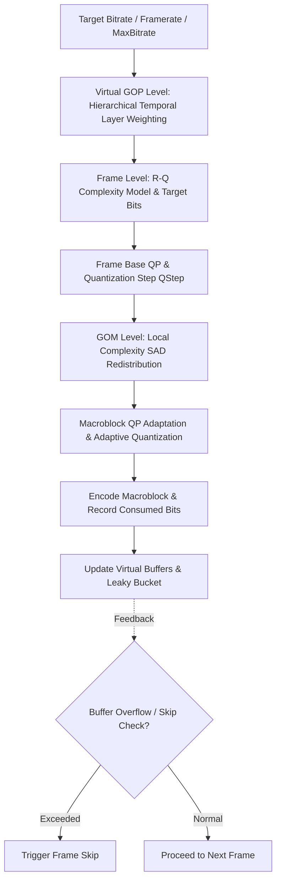
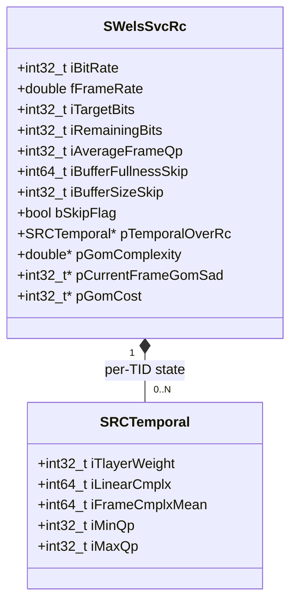
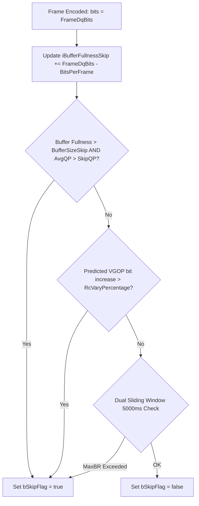

# Literate Programming Documentation: `rc.h`

The rate control subsystem of **Cisco OpenH264** is declared in [`codec/encoder/core/inc/rc.h`](openh264/codec/encoder/core/inc/rc.h) and implemented primarily in [`codec/encoder/core/src/ratectl.cpp`](openh264/codec/encoder/core/src/ratectl.cpp). It governs bit budget allocation, quantization parameter ($QP$) selection, buffer fullness management, and dynamic frame skipping across hierarchical temporal layers ($T_0 \dots T_N$) and spatial dependency layers ($D_0 \dots D_M$).

---

## Table of Contents
1. [Subsystem Overview & Architecture](#1-subsystem-overview--architecture)
2. [Constants, Macros, and Enumerations](#2-constants-macros-and-enumerations)
3. [Data Structures & Type Definitions](#3-data-structures--type-definitions)
   - [3.1 SRCTemporal (`TagRCTemporal`)](#31-srctemporal-tagrctemporal)
   - [3.2 SWelsSvcRc (`TagWelsRc`)](#32-swelssc-tagwelsrc)
   - [3.3 Function Pointer Dispatch Table (`SWelsRcFunc`)](#33-function-pointer-dispatch-table-swelsrcfunc)
4. [Mathematical Formulations & Rate Control Algorithms](#4-mathematical-formulations--rate-control-algorithms)
   - [4.1 Linear Rate-Quantization (R-Q) Model](#41-linear-rate-quantization-r-q-model)
   - [4.2 Hierarchical Virtual GOP (VGOP) Bit Allocation](#42-hierarchical-virtual-gop-vgop-bit-allocation)
   - [4.3 Group of Macroblocks (GOM) Local Adaptation](#43-group-of-macroblocks-gom-local-adaptation)
   - [4.4 Virtual Buffer Verifier & Dual Sliding-Window Frame Skip](#44-virtual-buffer-verifier--dual-sliding-window-frame-skip)
5. [Function Reference](#5-function-reference)
   - [5.1 Initialization & Lifecycle Management](#51-initialization--lifecycle-management)
   - [5.2 Frame-Level & Slice-Level Rate Control](#52-frame-level--slice-level-rate-control)
   - [5.3 Frame Skipping & Buffer Fullness Maintenance](#53-frame-skipping--buffer-fullness-maintenance)
   - [5.4 Diagnostics & Timing Utilities](#54-diagnostics--timing-utilities)

---

## 1. Subsystem Overview & Architecture

Rate control in OpenH264 operates in a multi-level hierarchy designed to balance strict bitrate constraints with minimal visual quality fluctuation in real-time communications (WebRTC, video conferencing, screen sharing).



### Rate Control Operational Modes (`RC_MODES`)
OpenH264 configures rate control behavior dynamically using the `RC_MODES` enumeration:
1. `RC_OFF_MODE`: Rate control disabled. Slices are encoded using fixed quantization parameters configured by `iDLayerQp`.
2. `RC_QUALITY_MODE`: Constant Quality mode prioritizing visual fidelity while adhering to loose average bitrate constraints.
3. `RC_BITRATE_MODE`: Constant Bitrate (CBR) mode with GOM-level adaptation, VBV buffer fullness enforcement, and frame skipping.
4. `RC_BITRATE_MODE_POST_SKIP`: CBR mode enhanced with post-encoding frame skip logic for aggressive bandwidth capping.
5. `RC_TIMESTAMP_MODE`: Variable-framerate rate control taking frame arrival timestamps into account for jitter-prone capture sources.
6. `RC_BUFFERBASED_MODE`: Scene-adaptive buffer-based rate control mode primarily utilized in screen content coding (`SCREEN_CONTENT_REAL_TIME`).

---

## 2. Constants, Macros, and Enumerations

All rate control constants and macros in [`rc.h`](openh264/codec/encoder/core/inc/rc.h#L56-L143) use fixed-point integer scaling factors to avoid floating-point non-determinism across platforms.

### 2.1 Fixed-Point Scaling & Algorithm Tuning Macros

| Macro Name | Value | Scaling / Unit | Description |
| :--- | :---: | :---: | :--- |
| `INT_MULTIPLY` | `100` | $100\times$ | Fixed-point multiplier for percentage-based and decimal integer calculations (matches `AQ_QSTEP_INT_MULTIPLY`). |
| `WEIGHT_MULTIPLY` | `2000` | Fixed Base | Normalization base weight for temporal layer bit distribution within a Virtual GOP. |
| `MAX_BITS_VARY_PERCENTAGE` | `100` | Percentage | Maximum allowed bitrate variation range ($100\%$). |
| `MAX_BITS_VARY_PERCENTAGE_x3d2` | `150` | Percentage | Maximum upper bound on bitrate burstiness ($150\%$). |
| `LINEAR_MODEL_DECAY_FACTOR` | `80` | Scaled by `INT_MULTIPLY` | Exponential moving average decay parameter ($0.80$) for updating frame complexity and linear R-Q models. |
| `FRAME_CMPLX_RATIO_RANGE` | `20` | Scaled by `INT_MULTIPLY` | Clamping limit ($\pm 20\%$) on frame complexity variation relative to the running mean. |
| `SMOOTH_FACTOR_MIN_VALUE` | `2` | Scaled by `INT_MULTIPLY` | Minimum smoothing factor ($0.02$) to prevent divide-by-zero or step instabilities. |
| `TIME_CHECK_WINDOW` | `5000` | Milliseconds | Dual sliding time window duration ($5000\,\text{ms}$) for maximum bitrate (`iMaxSpatialBitrate`) enforcement. |
| `SKIP_RATIO` | `50` | Scaled by `INT_MULTIPLY` | Leaky bucket buffer capacity ratio ($50\%$) determining skip threshold buffer sizing. |
| `LAST_FRAME_PREDICT_WEIGHT` | `0.5` | Floating Weight | Weight given to the most recent frame when calculating the moving average predicted frame size. |
| `PADDING_BUFFER_RATIO` | `50` | Scaled by `INT_MULTIPLY` | Padding buffer capacity scaling factor ($50\%$). |
| `PADDING_THRESHOLD` | `5` | Scaled by `INT_MULTIPLY` | Low-buffer underflow threshold ($5\%$) below which padding bits (filler NAL units) are injected. |
| `VGOP_BITS_PERCENTAGE_DIFF` | `5` | Percentage | Margin of error permitted for Virtual GOP bit budget estimation. |
| `IDR_BITRATE_RATIO` | `4` | Multiplier | Default bit budget allocation multiplier for IDR keyframes relative to regular P-frames ($4\times$). |

---

### 2.2 Enumerations

#### Bit Consumption Status
```cpp
enum {
  BITS_NORMAL   = 0,  // Target bit budget is within standard operating limits
  BITS_LIMITED  = 1,  // Bit budget clamped by min/max layer boundaries
  BITS_EXCEEDED = 2   // Virtual buffer overflow condition; QP forced upward
};
```

#### Rate Control & Resolution Thresholds
```cpp
enum {
  VGOP_SIZE             = 8,   // Standard Virtual GOP frame count (8 frames)
  GOM_MIN_QP_MODE       = 12,  // Minimum allowed QP in GOM adaptive mode
  GOM_MAX_QP_MODE       = 36,  // Maximum allowed QP in GOM adaptive mode
  MAX_LOW_BR_QP         = 42,  // Max QP ceiling for very low bitrate targets
  MIN_IDR_QP            = 26,  // Default minimum QP for IDR frames
  MAX_IDR_QP            = 32,  // Default maximum QP for IDR frames
  MIN_SCREEN_QP         = 26,  // Minimum QP boundary for screen content
  MAX_SCREEN_QP         = 35,  // Maximum QP boundary for screen content
  DELTA_QP              = 2,   // Step size for macroblock QP delta adjustments
  DELTA_QP_BGD_THD      = 3,   // Threshold delta for background/static macroblock QP
  QP_MIN_VALUE          = 0,   // Standard H.264 minimum QP
  QP_MAX_VALUE          = 51,  // Standard H.264 maximum QP

  // Frame Skip Base QP Thresholds by Resolution
  SKIP_QP_90P           = 24,  // 160x90 (Sub-QCIF / Low Res)
  SKIP_QP_180P          = 24,  // 320x180 (QCIF / QQVGA)
  SKIP_QP_360P          = 31,  // 640x360 (nHD / Standard)
  SKIP_QP_720P          = 31,  // 1280x720 (HD)

  // Macroblock Width Classification Thresholds
  MB_WIDTH_THRESHOLD_90P   = 15, // <= 15 MBs wide (160x90)
  MB_WIDTH_THRESHOLD_180P  = 30, // <= 30 MBs wide (320x180)
  MB_WIDTH_THRESHOLD_360P  = 60, // <= 60 MBs wide (640x360)

  // GOM Row Heights (Number of MB rows per Group of Macroblocks)
  GOM_ROW_MODE0_90P     = 2,
  GOM_ROW_MODE0_180P    = 2,
  GOM_ROW_MODE0_360P    = 4,
  GOM_ROW_MODE0_720P    = 4,
  QP_RANGE_MODE0        = 3,

  GOM_ROW_MODE1_90P     = 1,
  GOM_ROW_MODE1_180P    = 1,
  GOM_ROW_MODE1_360P    = 2,
  GOM_ROW_MODE1_720P    = 2,
  QP_RANGE_UPPER_MODE1  = 9,
  QP_RANGE_LOWER_MODE1  = 4,
  QP_RANGE_INTRA_MODE1  = 3
};
```

#### Dual Sliding Time Windows
```cpp
enum {
  EVEN_TIME_WINDOW  = 0,  // First 5-second observation sliding window
  ODD_TIME_WINDOW   = 1,  // Second (shifted) 5-second observation sliding window
  TIME_WINDOW_TOTAL = 2   // Total number of parallel sliding windows
};
```

---

## 3. Data Structures & Type Definitions

### 3.1 SRCTemporal (`TagRCTemporal`)
Declared at [`rc.h:145-156`](openh264/codec/encoder/core/inc/rc.h#L145-L156). Encapsulates rate control tracking and linear model state for a single temporal scalability layer (`uiTemporalId`).

```cpp
typedef struct TagRCTemporal {
  int32_t   iMinBitsTl;       // Minimum bit budget allocated to this temporal layer
  int32_t   iMaxBitsTl;       // Maximum bit budget ceiling for this temporal layer
  int32_t   iTlayerWeight;    // Normalized bit allocation weight (scaled by WEIGHT_MULTIPLY)
  int32_t   iGopBitsDq;       // Cumulative bits consumed by this temporal layer in current VGOP
  int64_t   iLinearCmplx;     // P-frame linear R-Q complexity accumulator (scaled by INT_MULTIPLY)
  int32_t   iPFrameNum;       // Count of P-frames encoded in this temporal layer (clamped at 255)
  int64_t   iFrameCmplxMean;  // Exponential moving average of spatial frame complexity (VAA SAD)
  int32_t   iMaxQp;           // Upper QP clamp limit for this temporal layer
  int32_t   iMinQp;           // Lower QP clamp limit for this temporal layer
} SRCTemporal;
```

---

### 3.2 SWelsSvcRc (`TagWelsRc`)
Declared at [`rc.h:158-243`](openh264/codec/encoder/core/inc/rc.h#L158-L243). The central state structure of the rate control engine for a given spatial dependency layer ($D$).



#### Detailed Member Breakdown

| Member Field | Type | Unit / Range | Purpose & Lifecycle |
| :--- | :--- | :--- | :--- |
| `iRcVaryPercentage` | `int32_t` | $0 \dots 100\%$ | Bitrate variation percentage configured by user (`pSvcParam->iBitsVaryPercentage`). |
| `iRcVaryRatio` | `int32_t` | Ratio | Active variation ratio used to interpolate QP range clamp bounds. |
| `iInitialQp` | `int32_t` | $0 \dots 51$ | Starting quantization parameter calculated for the initial IDR keyframe. |
| `iBitRate` | `int64_t` | bps | Target bitrate for the current spatial layer (`iSpatialBitrate`). Stored as `int64_t` to avoid overflow during multiply operations. |
| `iPreviousBitrate` | `int32_t` | bps | Cached bitrate value used to detect dynamic runtime bitrate reconfigurations. |
| `iPreviousGopSize` | `int32_t` | Frames | Previous temporal decomposition GOP size ($1 \ll \text{iDecompositionStages}$). |
| `fFrameRate` | `double` | fps | Active output frame rate for this spatial dependency layer. |
| `iBitsPerFrame` | `int32_t` | Bits | Average bit budget per frame: $\lfloor \text{iBitRate} / \text{fFrameRate} \rfloor$. |
| `iMaxBitsPerFrame` | `int32_t` | Bits | Maximum burst frame bit budget: $\lfloor \text{iMaxSpatialBitrate} / \text{fFrameRate} \rfloor$. |
| `dPreviousFps` | `double` | fps | Cached frame rate used to detect dynamic framerate changes. |
| `iLastAllocatedBits` | `int32_t` | Bits | Bits allocated to the preceding frame; used to adjust carry-over deficit when `bFixRCOverShoot` is true. |
| `iRemainingBits` | `int32_t` | Bits | Remaining bit budget pool for the current Virtual GOP ($8 \times \text{iBitsPerFrame}$). |
| `iBitsPerMb` | `int32_t` | Bits $\times 100$ | Fixed-point average bit budget allocated per macroblock. |
| `iTargetBits` | `int32_t` | Bits | Bit target computed for the current frame being encoded. |
| `iCurrentBitsLevel`| `int32_t` | Enum | Current bit budget availability status (`BITS_NORMAL`, `BITS_LIMITED`, `BITS_EXCEEDED`). |
| `iIdrNum` | `int32_t` | $0 \dots 255$ | Count of IDR keyframes encoded. |
| `iIntraComplexity` | `int64_t` | Energy | Cumulative intra frame complexity metric ($Q_{\text{step}} \times \text{Bits}$). |
| `iIntraMbCount` | `int32_t` | Count | Number of macroblocks in the reference intra frame. |
| `iIntraComplxMean` | `int64_t` | Energy | Exponential moving average of intra-frame spatial SAD complexity from VAA. |
| `iTlOfFrames[8]` | `int8_t[8]` | $0 \dots 4$ | Temporal Layer ID lookup table for every frame index within the 8-frame Virtual GOP. |
| `iRemainingWeights`| `int32_t` | Weights | Sum of remaining temporal layer weights in the active Virtual GOP. |
| `iFrameDqBits` | `int32_t` | Bits | Actual coded bit count consumed by the most recently reconstructed frame. |
| `bGomRC` | `bool` | Flag | Boolean flag enabling Group of Macroblocks (GOM) QP adaptation within frames. |
| `pGomComplexity` | `double*` | Pointer | Dynamically allocated array ($N_{\text{GOM}}$ elements) storing relative GOM complexity weights. |
| `pGomForegroundBlockNum` | `int32_t*` | Pointer | Array tracking the number of foreground macroblocks in each GOM row. |
| `pCurrentFrameGomSad` | `int32_t*` | Pointer | Array storing pre-calculated Sum of Absolute Differences (SAD) per GOM row from VAA. |
| `pGomCost` | `int32_t*` | Pointer | Array accumulating actual mode decision luma rate-distortion costs per GOM. |
| `bEnableGomQp` | `int32_t` | Bool/Flag | Runtime switch disabling GOM QP variation when multi-slice mode (`iMaxSliceNum > 1`) is active. |
| `iAverageFrameQp` | `int32_t` | $0 \dots 51$ | Actual macroblock-averaged QP of the most recently encoded frame. |
| `iMinFrameQp` | `int32_t` | $0 \dots 51$ | Lower QP clamping boundary for the current frame. |
| `iMaxFrameQp` | `int32_t` | $0 \dots 51$ | Upper QP clamping boundary for the current frame. |
| `iNumberMbFrame` | `int32_t` | Count | Total macroblocks in one frame ($\text{MbWidth} \times \text{MbHeight}$). |
| `iNumberMbGom` | `int32_t` | Count | Number of macroblocks contained within a single GOM block row. |
| `iGomSize` | `int32_t` | Count | Total number of GOM partitions in one frame ($\lceil \text{iNumberMbFrame} / \text{iNumberMbGom} \rceil$). |
| `iSkipFrameNum` | `int32_t` | Count | Total count of skipped frames since encoder initialization. |
| `iFrameCodedInVGop`| `int32_t` | $0 \dots 8$ | Number of successfully encoded frames in the current Virtual GOP. |
| `iSkipFrameInVGop` | `int32_t` | $0 \dots 8$ | Number of skipped frames in the current Virtual GOP. |
| `iGopNumberInVGop` | `int32_t` | Count | Number of sub-GOP structures contained in one 8-frame Virtual GOP. |
| `iGopIndexInVGop` | `int32_t` | Index | Sub-GOP iteration index within the active Virtual GOP. |
| `iSkipQpValue` | `int32_t` | $0 \dots 51$ | Resolution-dependent QP threshold above which frame skipping is permitted. |
| `iQStep` | `int32_t` | $100\times$ | Integer quantization step size ($Q_{\text{step}}$) scaled by `INT_MULTIPLY`. |
| `iBufferSizeSkip` | `int32_t` | Bits | Leaky bucket virtual buffer size threshold for frame skipping. |
| `iBufferFullnessSkip`| `int64_t` | Bits | Current virtual buffer fullness level for frame skip determination. |
| `iBufferMaxBRFullness[2]` | `int64_t[2]` | Bits | Dual sliding window buffer fullness tracking maximum bitrate constraints. |
| `bSkipFlag` | `bool` | Flag | Skip flag asserted when virtual buffer fullness breaches threshold limits. |
| `iContinualSkipFrames` | `int32_t` | Count | Count of consecutively skipped frames (triggers warning logs if $\ge 3$). |
| `pTemporalOverRc` | `SRCTemporal*` | Pointer | Contiguous heap buffer holding temporal layer RC state structures (`SRCTemporal[kiMaxTl]`). |
| `iAvgCost2Bits` | `int64_t` | Fixed Ratio | Screen content coding moving average cost-to-bits ratio for P-frames. |
| `iCost2BitsIntra` | `int64_t` | Fixed Ratio | Screen content coding moving average cost-to-bits ratio for I-frames. |
| `iBaseQp` | `int32_t` | $0 \dots 51$ | Base quantization parameter maintained across frames in Screen Content Coding. |
| `uiLastTimeStamp` | `long long` | ms | Timestamp of the preceding encoded picture. |

---

### 3.3 Function Pointer Dispatch Table (`SWelsRcFunc`)
Declared at [`rc.h:255-266`](openh264/codec/encoder/core/inc/rc.h#L255-L266). Enables dynamic polymorphism for rate control modes without runtime `switch` overhead during macroblock encoding loops.

```cpp
typedef struct WelsRcFunc_s {
  PWelsRCPictureInitFunc                pfWelsRcPictureInit;
  PWelsRCPictureDelayJudgeFunc          pfWelsRcPicDelayJudge;
  PWelsRCPictureInfoUpdateFunc          pfWelsRcPictureInfoUpdate;
  PWelsRCMBInitFunc                     pfWelsRcMbInit;
  PWelsRCMBInfoUpdateFunc               pfWelsRcMbInfoUpdate;
  PWelsCheckFrameSkipBasedMaxbrFunc     pfWelsCheckSkipBasedMaxbr;
  PWelsUpdateBufferWhenFrameSkippedFunc pfWelsUpdateBufferWhenSkip;
  PWelsUpdateMaxBrCheckWindowStatusFunc pfWelsUpdateMaxBrWindowStatus;
  PWelsRCPostFrameSkippingFunc          pfWelsRcPostFrameSkipping;
} SWelsRcFunc;
```

#### Dispatch Table Mapping by `RC_MODES`

| Function Pointer | `RC_OFF_MODE` | `RC_BUFFERBASED_MODE` | `RC_BITRATE_MODE` / `RC_QUALITY_MODE` | `RC_TIMESTAMP_MODE` |
| :--- | :--- | :--- | :--- | :--- |
| `pfWelsRcPictureInit` | `WelsRcPictureInitDisable` | `WelRcPictureInitBufferBasedQp` | `WelsRcPictureInitGom` | `WelsRcPictureInitGom` |
| `pfWelsRcPicDelayJudge` | `NULL` | `NULL` | `NULL` | `WelsRcFrameDelayJudgeTimeStamp` |
| `pfWelsRcPictureInfoUpdate` | `WelsRcPictureInfoUpdateDisable` | `WelsRcPictureInfoUpdateDisable` | `WelsRcPictureInfoUpdateGom` | `WelsRcPictureInfoUpdateGomTimeStamp` |
| `pfWelsRcMbInit` | `WelsRcMbInitDisable` | `WelsRcMbInitDisable` | `WelsRcMbInitGom` | `WelsRcMbInitGom` |
| `pfWelsRcMbInfoUpdate` | `WelsRcMbInfoUpdateDisable` | `WelsRcMbInfoUpdateDisable` | `WelsRcMbInfoUpdateGom` | `WelsRcMbInfoUpdateGom` |
| `pfWelsCheckSkipBasedMaxbr` | `NULL` | `NULL` | `CheckFrameSkipBasedMaxbr` | `NULL` |
| `pfWelsUpdateBufferWhenSkip` | `NULL` | `NULL` | `UpdateBufferWhenFrameSkipped` | `NULL` |
| `pfWelsUpdateMaxBrWindowStatus` | `NULL` | `NULL` | `UpdateMaxBrCheckWindowStatus` | `NULL` |
| `pfWelsRcPostFrameSkipping` | `NULL` | `NULL` | `WelsRcPostFrameSkipping` | `NULL` |

---

## 4. Mathematical Formulations & Rate Control Algorithms

### 4.1 Linear Rate-Quantization (R-Q) Model

OpenH264 establishes a linear relationship between the frame bit budget $R$, the spatial complexity $C$ (derived from frame SAD in Video Analysis & Assessment / VAA), and the quantization step size $Q_{\text{step}}$:

$$R = \frac{X \cdot C}{Q_{\text{step}}}$$

where $X$ represents the linear model complexity scaling factor. Given target bits $R_{\text{target}}$ and estimated complexity $C_{\text{frame}}$, the required quantization step $Q_{\text{step}}$ is computed as:

$$Q_{\text{step}} = \text{round}\left(\frac{X_{\text{linear}} \cdot \left(\frac{C_{\text{frame}} \cdot 100}{\bar{C}_{\text{mean}}}\right)}{R_{\text{target}} \cdot 100}\right)$$

#### Conversion Between $QP$ and $Q_{\text{step}}$
Quantization step values are mapped to H.264 integer quantization parameters via the pre-computed table `g_kiQpToQstepTable[52]` (declared in [`ratectl.cpp:52-59`](openh264/codec/encoder/core/src/ratectl.cpp#L52-L59)):

$$Q_{\text{step}}(QP) \approx \text{round}\left(100 \cdot 2^{\frac{QP - 4}{6}}\right)$$

The inverse transformation from $Q_{\text{step}}$ back to $QP$ is computed by `RcConvertQStep2Qp`:

$$QP(Q_{\text{step}}) = \text{round}\left(6 \cdot \frac{\ln\left(\frac{Q_{\text{step}}}{100}\right)}{\ln 2} + 4\right)$$

```cpp
static inline int32_t RcConvertQp2QStep (int32_t iQP) {
  return g_kiQpToQstepTable[iQP];
}
static inline int32_t RcConvertQStep2Qp (int32_t iQpStep) {
  if (iQpStep <= g_kiQpToQstepTable[0])
    return 0;
  return WELS_ROUND ((6 * log (iQpStep * 1.0f / INT_MULTIPLY) / log (2.0) + 4.0));
}
```

---

### 4.2 Hierarchical Virtual GOP (VGOP) Bit Allocation

A Virtual GOP spans 8 frames (`VGOP_SIZE = 8`). Bit budgets are distributed across hierarchical temporal layers according to the decomposition structure:

$$\text{Weight Array } W[\text{DecompositionStages}][T_{\text{id}}] = \begin{pmatrix} 2000 & 0 & 0 & 0 \\ 1200 & 800 & 0 & 0 \\ 800 & 600 & 300 & 0 \\ 500 & 300 & 250 & 175 \end{pmatrix}$$

For temporal layer $T_{\text{id}}$, the target bit allocation is proportional to its weight $W(T_{\text{id}})$:

$$R_{\text{target}}(T_{\text{id}}) = \text{round}\left(\frac{R_{\text{remaining\_vgop}} \cdot W(T_{\text{id}})}{W_{\text{remaining}}}\right)$$

The allocated bits are then clamped within the layer's allowable variation envelope $[R_{\text{min}}(T_{\text{id}}), R_{\text{max}}(T_{\text{id}})]$.

---

### 4.3 Group of Macroblocks (GOM) Local Adaptation

To prevent intra-frame bitrate spikes and buffer overflow when complex local motion or textures appear, frames are partitioned into horizontal slices called Groups of Macroblocks (GOM).

$$\text{GOM Bit Target } R_{\text{GOM}, k} = R_{\text{left\_slice}} \cdot \frac{\text{SAD}_{\text{GOM}, k}}{\sum_{j = k}^{\text{last}} \text{SAD}_{\text{GOM}, j}}$$

During macroblock raster traversal, the bitrate consumption ratio $\rho$ is calculated:

$$\rho = 10000 \cdot \frac{R_{\text{left\_slice}}}{R_{\text{target\_left}} + 1}$$

The GOM quantization parameter $QP_{\text{GOM}}$ is modulated according to $\rho$:

$$QP_{\text{GOM}} \leftarrow \begin{cases}
QP_{\text{slice}} + 2 & \text{if } \rho < 8409 \quad \left(\approx 2^{-\frac{1.5}{6}} \cdot 10000\right) \\
QP_{\text{slice}} + 1 & \text{if } 8409 \le \rho < 9439 \quad \left(\approx 2^{-\frac{0.5}{6}} \cdot 10000\right) \\
QP_{\text{slice}} - 1 & \text{if } 10600 < \rho \le 11900 \quad \left(\approx 2^{\frac{0.5}{6}} \cdot 10000\right) \\
QP_{\text{slice}} - 2 & \text{if } \rho > 11900 \quad \left(\approx 2^{\frac{1.5}{6}} \cdot 10000\right)
\end{cases}$$

---

### 4.4 Virtual Buffer Verifier & Dual Sliding-Window Frame Skip

OpenH264 implements a dual-condition Leaky Bucket Virtual Buffer Verifier (VBV) to prevent encoder buffer overflow and network transmission congestion.



1. **Virtual Buffer Fullness Condition**:
   $$\text{BufferFullness} > \text{BufferSizeSkip} \quad \text{AND} \quad \bar{QP}_{\text{frame}} > QP_{\text{skip\_threshold}}$$
2. **VGOP Burst Constraint Condition**:
   $$\Delta_{\text{VGOP}}\% = \frac{\sum_{i = \text{coded}+1}^{\text{VGOP\_SIZE}} R_{\text{min}}(T_i) - R_{\text{remaining}}}{8 \cdot R_{\text{frame\_target}}} \cdot 100\% - 5\% > \text{iRcVaryPercentage}$$
3. **Dual Sliding Window ($5000\,\text{ms}$) Maximum Bitrate Check**:
   Evaluates bits consumed in `EVEN_TIME_WINDOW` and `ODD_TIME_WINDOW` against `iMaxSpatialBitrate` over time intervals $\Delta t \ge 2500\,\text{ms}$. If available bits in the window are exhausted, `bSkipFlag` is raised.

---

## 5. Function Reference

### 5.1 Initialization & Lifecycle Management

#### [`WelsRcInitModule`](openh264/codec/encoder/core/inc/rc.h#L276)
```cpp
void WelsRcInitModule (sWelsEncCtx* pCtx, RC_MODES iRcMode);
```
* **Purpose**: Top-level entry point initializing the rate control module.
* **Operations**:
  1. Invokes [`WelsRcInitFuncPointers`](openh264/codec/encoder/core/inc/rc.h#L277) to populate the function pointer table `pCtx->pFuncList->pfRc` based on `iRcMode`.
  2. Calls `RcInitSequenceParameter(pCtx)` to initialize resolution, macroblock counts, GOM row sizes, and allocate heap memory per spatial layer.

#### [`WelsRcInitFuncPointers`](openh264/codec/encoder/core/inc/rc.h#L277)
```cpp
void WelsRcInitFuncPointers (sWelsEncCtx* pEncCtx, RC_MODES iRcMode);
```
* **Purpose**: Configures the function dispatch table [`SWelsRcFunc`](openh264/codec/encoder/core/inc/rc.h#L255-L266) according to the requested rate control operational mode.

#### [`WelsRcFreeMemory`](openh264/codec/encoder/core/inc/rc.h#L278)
```cpp
void WelsRcFreeMemory (sWelsEncCtx* pCtx);
```
* **Purpose**: Deallocates dynamic memory for all spatial layers (`pTemporalOverRc`, `pGomComplexity`, `pGomForegroundBlockNum`, `pCurrentFrameGomSad`, and `pGomCost`) via `pCtx->pMemAlign->WelsFree`.

---

### 5.2 Frame-Level & Slice-Level Rate Control

#### [`GomRCInitForOneSlice`](openh264/codec/encoder/core/inc/rc.h#L268)
```cpp
void GomRCInitForOneSlice (SSlice* pSlice, const int32_t kiBitsPerMb);
```
* **Parameters**:
  * `pSlice`: Pointer to current slice structure ([`SSlice`](openh264/codec/encoder/core/inc/slice.h)).
  * `kiBitsPerMb`: Target bit budget allocated per macroblock (scaled by `INT_MULTIPLY`).
* **Logic**: Initializes slice-level rate control tracking parameters in [`SRCSlicing`](openh264/codec/encoder/core/inc/slice.h#L84-L97):
  $$iStartMbSlice = \text{iFirstMbInSlice}$$
  $$iEndMbSlice = iStartMbSlice + \text{iCountMbNumInSlice} - 1$$
  $$iTargetBitsSlice = \text{round}\left(\frac{\text{kiBitsPerMb} \cdot \text{iCountMbNumInSlice}}{100}\right)$$

---

### 5.3 Frame Skipping & Buffer Fullness Maintenance

#### [`CheckFrameSkipBasedMaxbr`](openh264/codec/encoder/core/inc/rc.h#L269)
```cpp
void CheckFrameSkipBasedMaxbr (sWelsEncCtx* pCtx, const long long uiTimeStamp, int32_t iDidIdx);
```
* **Purpose**: Evaluates virtual buffer status and sliding time windows to determine if the upcoming frame on spatial layer `iDidIdx` must be dropped to prevent breaching `iMaxSpatialBitrate`.
* **Logic**:
  1. Computes allowed consecutive skip frame estimates `iPredSkipFramesTarBr` and `iPredSkipFramesMaxBr`.
  2. Evaluates 4 skip conditions:
     - Buffer fullness exceeding skip threshold: $\text{iBufferFullnessSkip} > \text{iBufferSizeSkip}$.
     - Maximum bitrate time window saturation.
     - Dual sliding-window overflow (`EVEN_TIME_WINDOW` and `ODD_TIME_WINDOW`).
  3. Sets `pWelsSvcRc->bSkipFlag = true` if any condition is met.

#### [`UpdateBufferWhenFrameSkipped`](openh264/codec/encoder/core/inc/rc.h#L270)
```cpp
void UpdateBufferWhenFrameSkipped (sWelsEncCtx* pCtx, int32_t iCurDid);
```
* **Purpose**: Reclaims bit budgets and updates virtual buffer fullness metrics after a frame has been skipped.
* **Mathematical Operations**:
  $$\text{iBufferFullnessSkip} \leftarrow \max(0, \text{iBufferFullnessSkip} - \text{iBitsPerFrame})$$
  $$\text{iBufferMaxBRFullness}[\text{window}] \leftarrow \text{iBufferMaxBRFullness}[\text{window}] - \text{iMaxBitsPerFrame}$$
  $$\text{iRemainingBits} \leftarrow \text{iRemainingBits} + \text{iBitsPerFrame}$$

#### [`UpdateMaxBrCheckWindowStatus`](openh264/codec/encoder/core/inc/rc.h#L271)
```cpp
void UpdateMaxBrCheckWindowStatus (sWelsEncCtx* pCtx, int32_t iSpatialNum, const long long uiTimeStamp);
```
* **Purpose**: Advances the 5-second sliding time window clock for maximum bitrate regulation across all active spatial layers.

#### [`WelsRcCheckFrameStatus`](openh264/codec/encoder/core/inc/rc.h#L279)
```cpp
bool WelsRcCheckFrameStatus (sWelsEncCtx* pEncCtx, long long uiTimeStamp, int32_t iSpatialNum, int32_t iCurDid);
```
* **Purpose**: Top-level frame skip coordinator called prior to encoding a picture. Returns `true` if the frame must be skipped, `false` if encoding should proceed.

---

### 5.4 Diagnostics & Timing Utilities

#### [`RcTraceFrameBits`](openh264/codec/encoder/core/inc/rc.h#L275)
```cpp
void RcTraceFrameBits (sWelsEncCtx* pEncCtx, long long uiTimeStamp, int32_t iFrameSize);
```
* **Purpose**: Logs debug diagnostic telemetry (target bits, consumed bits, average QP, min/max frame QP, buffer fullness) to the encoder logging context (`pEncCtx->sLogCtx`).

#### [`GetTimestampForRc`](openh264/codec/encoder/core/inc/rc.h#L281)
```cpp
long long GetTimestampForRc (const long long uiTimeStamp, const long long uiLastTimeStamp, const float fFrameRate);
```
* **Purpose**: Guarantees monotonically increasing timestamps for rate control calculations in variable framerate or timestamp-jitter environments:
  $$\text{Timestamp} = \begin{cases}
  \text{uiLastTimeStamp} + \text{round}\left(\frac{1000.0}{f_{\text{framerate}}}\right) & \text{if } \text{uiLastTimeStamp} \ge \text{uiTimeStamp} \text{ or } \text{uiTimeStamp} = 0 \\
  \text{uiTimeStamp} & \text{otherwise}
  \end{cases}$$
