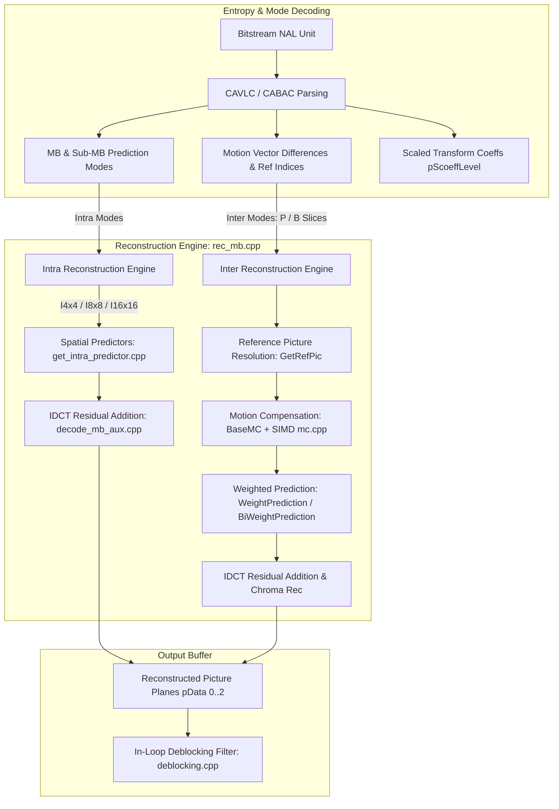
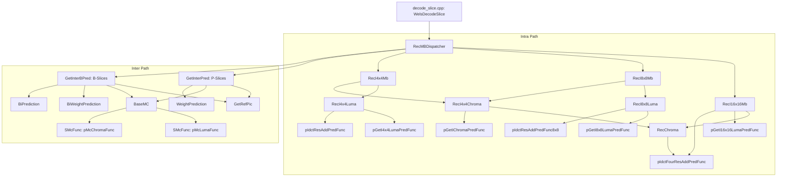

# OpenH264 Decoder: Macroblock Reconstruction Engine (`rec_mb.cpp`)

This document provides a comprehensive, literate-programming-style technical analysis of [codec/decoder/core/src/rec_mb.cpp](openh264/codec/decoder/core/src/rec_mb.cpp) and its associated header [codec/decoder/core/inc/rec_mb.h](openh264/codec/decoder/core/inc/rec_mb.h). It details the core macroblock reconstruction pipeline, covering spatial intra prediction synthesis, inter motion compensation, uni-directional and bi-directional weighted prediction, multi-threaded line-synchronization, and inverse transform residual integration.

---

## Table of Contents
1. [Module Architecture & Pipeline Role](#1-module-architecture--pipeline-role)
2. [Data Structures, Types, and Constants](#2-data-structures-types-and-constants)
   - [2.1 `sMCRefMember` (`TagMCRefMember`)](#21-smcrefmember-tagmcrefmember)
   - [2.2 Macroblock Types & Partitioning Constants](#22-macroblock-types--partitioning-constants)
   - [2.3 Helper Macros & Scan Tables](#23-helper-macros--scan-tables)
3. [Deep-Dive Function Analysis](#3-deep-dive-function-analysis)
   - [3.1 `WelsFillRecNeededMbInfo`](#31-welsfillrecneededmbinfo)
   - [3.2 Intra Reconstruction Functions](#32-intra-reconstruction-functions)
     - [`RecI8x8Mb`](#rec8x8mb)
     - [`RecI8x8Luma`](#rec8x8luma)
     - [`RecI4x4Mb`](#reci4x4mb)
     - [`RecI4x4Luma`](#reci4x4luma)
     - [`RecI4x4Chroma`](#reci4x4chroma)
     - [`RecI16x16Mb`](#reci16x16mb)
     - [`RecChroma`](#recchroma)
   - [3.3 Inter Prediction & Motion Compensation](#33-inter-prediction--motion-compensation)
     - [`GetRefPic`](#getrefpic)
     - [`BaseMC`](#basemc)
     - [`WeightPrediction`](#weightprediction)
     - [`BiWeightPrediction`](#biweightprediction)
     - [`BiPrediction`](#biprediction)
     - [`GetInterPred`](#getinterpred)
     - [`GetInterBPred`](#getinterbpred)
4. [Call Graph & Interaction Matrix](#4-call-graph--interaction-matrix)

---

## 1. Module Architecture & Pipeline Role

In the OpenH264 decoding pipeline ([decode_slice.cpp](openh264/codec/decoder/core/src/decode_slice.cpp)), macroblock processing proceeds in three successive stages:
1. **Bitstream Entropy Parsing**: NAL syntax elements, prediction modes, motion vectors ($MV$), and transform coefficients are parsed via CAVLC ([parse_mb_syn_cavlc.cpp](openh264/codec/decoder/core/src/parse_mb_syn_cavlc.cpp)) or CABAC ([parse_mb_syn_cabac.cpp](openh264/codec/decoder/core/src/parse_mb_syn_cabac.cpp)).
2. **Macroblock Reconstruction (`rec_mb.cpp`)**: Combines predicted pixel values (derived from spatial neighbors for Intra blocks or motion-compensated reference frame buffers for Inter blocks) with inverse-quantized and inverse-transformed (IDCT) residual matrices ($R$). Reconstructed pixel samples ($S'$) are clamped to $[0, 255]$ and written to the active decoded picture buffer ([PPicture](openh264/codec/decoder/core/inc/picture.h)).
3. **In-Loop Deblocking**: The reconstructed frame is filtered across block boundaries to suppress blocking artifacts ([deblocking.cpp](openh264/codec/decoder/core/src/deblocking.cpp)).



---

## 2. Data Structures, Types, and Constants

### 2.1 `sMCRefMember` (`TagMCRefMember`)

Defined in [codec/decoder/core/inc/rec_mb.h](openh264/codec/decoder/core/inc/rec_mb.h#L58-L75), `sMCRefMember` encapsulates the source reference buffer and destination buffer pointers, strides, and frame boundary boundaries required for sub-pixel motion compensation.

```cpp
typedef struct TagMCRefMember {
  uint8_t* pDstY;          // Destination pointer for reconstructed Luma samples
  uint8_t* pDstU;          // Destination pointer for reconstructed Cb Chroma samples
  uint8_t* pDstV;          // Destination pointer for reconstructed Cr Chroma samples

  uint8_t* pSrcY;          // Source pointer into reference picture Luma plane
  uint8_t* pSrcU;          // Source pointer into reference picture Cb plane
  uint8_t* pSrcV;          // Source pointer into reference picture Cr plane

  int32_t iSrcLineLuma;    // Reference picture Luma buffer stride in bytes (iLinesize[0])
  int32_t iSrcLineChroma;  // Reference picture Chroma buffer stride in bytes (iLinesize[1])

  int32_t iDstLineLuma;    // Destination picture Luma buffer stride in bytes
  int32_t iDstLineChroma;  // Destination picture Chroma buffer stride in bytes

  int32_t iPicWidth;       // Luma picture width in pixels (iMbWidth << 4)
  int32_t iPicHeight;      // Luma picture height in pixels (iMbHeight << 4)
} sMCRefMember;
```

#### Field Details & Bit-Depths
| Field | Type | Description |
| :--- | :--- | :--- |
| `pDstY`, `pDstU`, `pDstV` | `uint8_t*` | Pointers to 8-bit unsigned destination planar YUV 4:2:0 sample arrays. |
| `pSrcY`, `pSrcU`, `pSrcV` | `uint8_t*` | Pointers to 8-bit unsigned source reference picture planes stored in the DPB. |
| `iSrcLineLuma`, `iSrcLineChroma` | `int32_t` | Byte stride between consecutive rows in the reference frame. |
| `iDstLineLuma`, `iDstLineChroma` | `int32_t` | Byte stride between consecutive rows in the destination frame. |
| `iPicWidth`, `iPicHeight` | `int32_t` | Frame dimensions in pixels ($W = 16 \times \text{MbWidth}$, $H = 16 \times \text{MbHeight}$). |

---

### 2.2 Macroblock Types & Partitioning Constants

The reconstruction dispatcher switches behavior based on the macroblock type (`iMBType`) and sub-macroblock type (`iSubMBType`):

| Macro / Constant | Definition / Value | Meaning |
| :--- | :--- | :--- |
| `MB_TYPE_SKIP` | Defined in [wels_common_basis.h](openh264/codec/common/inc/wels_common_basis.h) | Inter P/B skip macroblock ($16 \times 16$ partition, 0 residual). |
| `MB_TYPE_16x16` | Bitmask | Inter $16 \times 16$ macroblock with single motion vector per reference list. |
| `MB_TYPE_16x8` | Bitmask | Inter macroblock split vertically into two $16 \times 8$ partitions. |
| `MB_TYPE_8x16` | Bitmask | Inter macroblock split horizontally into two $8 \times 16$ partitions. |
| `MB_TYPE_8x8` | Bitmask | Inter macroblock split into four $8 \times 8$ sub-macroblocks. |
| `SUB_MB_TYPE_8x8` | Sub-partition mode | Sub-macroblock with one $8 \times 8$ partition. |
| `SUB_MB_TYPE_8x4` | Sub-partition mode | Sub-macroblock split into two $8 \times 4$ partitions. |
| `SUB_MB_TYPE_4x8` | Sub-partition mode | Sub-macroblock split into two $4 \times 8$ partitions. |
| `SUB_MB_TYPE_4x4` | Sub-partition mode | Sub-macroblock split into four $4 \times 4$ partitions. |
| `LIST_0`, `LIST_1` | `0`, `1` | Reference picture lists (Forward list L0, Backward list L1). |

---

### 2.3 Helper Macros & Scan Tables

* **`WELS_B_MB_REC_VERIFY(uiRet)`**:
  ```cpp
  #define WELS_B_MB_REC_VERIFY(uiRet) do { \
    uint32_t uiRetTmp = (uint32_t)uiRet; \
    if (uiRetTmp != ERR_NONE) return uiRetTmp; \
  } while (0)
  ```
  Ensures that if reference picture retrieval fails (`ERR_INFO_REFERENCE_PIC_LOST`), the function immediately propagates the error code to abort corruption cascading.

* **Scan Index Lookups**:
  * `g_kuiScan4`: Raster-to-zigzag scan mapping for 4x4 blocks.
  * `g_kuiMbCountScan4Idx`: Converts sub-block index ($0..15$) to the non-zero coefficient count array index (`pNzc`).

---

## 3. Deep-Dive Function Analysis

### 3.1 `WelsFillRecNeededMbInfo`

[rec_mb.cpp:L47-L62](openh264/codec/decoder/core/src/rec_mb.cpp#L47-L62)

```cpp
void WelsFillRecNeededMbInfo (PWelsDecoderContext pCtx, bool bOutput, PDqLayer pCurDqLayer);
```

#### Purpose
Initializes target prediction buffer pointers (`pPred[0..2]`) and plane strides in the current spatial dependency layer (`pCurDqLayer`) for the active macroblock at coordinate $(iMbX, iMbY)$.

#### Parameters
| Parameter | Type | Description |
| :--- | :--- | :--- |
| `pCtx` | `PWelsDecoderContext` | Global decoder context pointer. |
| `bOutput` | `bool` | True if the current dependency layer produces decoded output. |
| `pCurDqLayer` | `PDqLayer` | Target spatial layer context structure. |

#### Mathematical Pointer Computation
When `bOutput` is true, the top-left sample pointer for the macroblock in each color component is derived as:
$$\text{pPred}[0] = \text{pCurPic}\to\text{pData}[0] + \left( (iMbY \cdot iLumaStride + iMbX) \ll 4 \right)$$
$$\text{pPred}[1] = \text{pCurPic}\to\text{pData}[1] + \left( (iMbY \cdot iChromaStride + iMbX) \ll 3 \right)$$
$$\text{pPred}[2] = \text{pCurPic}\to\text{pData}[2] + \left( (iMbY \cdot iChromaStride + iMbX) \ll 3 \right)$$

---

### 3.2 Intra Reconstruction Functions

#### `RecI8x8Mb`
[rec_mb.cpp:L64-L68](openh264/codec/decoder/core/src/rec_mb.cpp#L64-L68)
```cpp
int32_t RecI8x8Mb (int32_t iMbXy, PWelsDecoderContext pCtx, int16_t* pScoeffLevel, PDqLayer pDqLayer);
```
Orchestrates High Profile Intra 8x8 macroblock reconstruction by invoking `RecI8x8Luma` followed by `RecI4x4Chroma`.

---

#### `RecI8x8Luma`
[rec_mb.cpp:L70-L115](openh264/codec/decoder/core/src/rec_mb.cpp#L70-L115)
```cpp
int32_t RecI8x8Luma (int32_t iMbXy, PWelsDecoderContext pCtx, int16_t* pScoeffLevel, PDqLayer pDqLayer);
```

#### Detailed Execution Steps
1. **Neighbor Availability Evaluation**:
   Evaluates top-left (`bTLAvail`) and top-right (`bTRAvail`) neighbor availability masks from `pDqLayer->pIntraNxNAvailFlag[iMbXy]` for each of the four $8 \times 8$ blocks:
   * Block 0: `bTLAvail[0] = (flag & 0x02)`, `bTRAvail[0] = (flag & 0x01)`
   * Block 1: `bTLAvail[1] = (flag & 0x01)`, `bTRAvail[1] = (flag & 0x08)`
   * Block 2: `bTLAvail[2] = (flag & 0x04)`, `bTRAvail[2] = true`
   * Block 3: `bTLAvail[3] = true`, `bTRAvail[3] = false`
2. **Predictor & IDCT Loop ($i = 0..3$)**:
   * Resolves target prediction pointer `pPredI8x8 = pPred + pBlockOffset[i << 2]`.
   * Invokes 8x8 Intra prediction function pointer:
     `pGetI8x8LumaPredFunc[uiMode](pPredI8x8, iLumaStride, bTLAvail[i], bTRAvail[i])`.
   * Checks if any of the four constituent 4x4 sub-blocks contains non-zero coefficients (`pNzc`). If non-zero, applies the 8x8 inverse transform and adds residual:
     `pIdctResAddPredFunc(pPredI8x8, iLumaStride, &pRS[i << 6])`.

---

#### `RecI4x4Mb`
[rec_mb.cpp:L117-L121](openh264/codec/decoder/core/src/rec_mb.cpp#L117-L121)
```cpp
int32_t RecI4x4Mb (int32_t iMBXY, PWelsDecoderContext pCtx, int16_t* pScoeffLevel, PDqLayer pDqLayer);
```
Reconstructs an Intra 4x4 macroblock by sequentially calling `RecI4x4Luma` and `RecI4x4Chroma`.

---

#### `RecI4x4Luma`
[rec_mb.cpp:L124-L157](openh264/codec/decoder/core/src/rec_mb.cpp#L124-L157)
```cpp
int32_t RecI4x4Luma (int32_t iMBXY, PWelsDecoderContext pCtx, int16_t* pScoeffLevel, PDqLayer pDqLayer);
```

#### Loop Process (16 Sub-blocks)
Iterates through all 16 $4 \times 4$ sub-blocks in raster order ($i = 0..15$):
1. Calculates sub-block pointer: `pPredI4x4 = pPred + pBlockOffset[i]`.
2. Extracts intra 4x4 mode: `uiMode = pIntra4x4PredMode[g_kuiScan4[i]]`.
3. Synthesizes intra prediction samples:
   `pGetI4x4LumaPredFunc[uiMode](pPredI4x4, iLumaStride)`.
4. If `pNzc[iMBXY][g_kuiMbCountScan4Idx[i]] != 0`, executes 4x4 IDCT residual addition:
   `pIdctResAddPredFunc(pPredI4x4, iLumaStride, &pRS[i << 4])`.

---

#### `RecI4x4Chroma`
[rec_mb.cpp:L160-L176](openh264/codec/decoder/core/src/rec_mb.cpp#L160-L176)
```cpp
int32_t RecI4x4Chroma (int32_t iMBXY, PWelsDecoderContext pCtx, int16_t* pScoeffLevel, PDqLayer pDqLayer);
```
Synthesizes Cb (`pPred[1]`) and Cr (`pPred[2]`) chroma prediction samples using `pGetIChromaPredFunc[iChromaPredMode]`, then invokes `RecChroma` to apply the chroma IDCT transform.

---

#### `RecI16x16Mb`
[rec_mb.cpp:L179-L213](openh264/codec/decoder/core/src/rec_mb.cpp#L179-L213)
```cpp
int32_t RecI16x16Mb (int32_t iMBXY, PWelsDecoderContext pCtx, int16_t* pScoeffLevel, PDqLayer pDqLayer);
```

#### Process
1. Generates $16 \times 16$ luma prediction plane via `pGetI16x16LumaPredFunc[iI16x16PredMode](pPred, iYStride)`.
2. Employs `pIdctFourResAddPredFunc` to perform IDCT on 4 groups of 4x4 blocks concurrently:
   - Block group 0: `(pPred + 0*iYStride + 0, pRS + 0*64, pNzc + 0)`
   - Block group 1: `(pPred + 0*iYStride + 8, pRS + 1*64, pNzc + 2)`
   - Block group 2: `(pPred + 8*iYStride + 0, pRS + 2*64, pNzc + 8)`
   - Block group 3: `(pPred + 8*iYStride + 8, pRS + 3*64, pNzc + 10)`
3. Reconstructs chroma planes via `pGetIChromaPredFunc` and `RecChroma`.

---

#### `RecChroma`
[rec_mb.cpp:L1057-L1076](openh264/codec/decoder/core/src/rec_mb.cpp#L1057-L1076)
```cpp
int32_t RecChroma (int32_t iMBXY, PWelsDecoderContext pCtx, int16_t* pScoeffLevel, PDqLayer pDqLayer);
```
Checks the Chroma Coded Block Pattern (`uiCbpC = pDqLayer->pCbp[iMBXY] >> 4`). If `uiCbpC` is 1 or 2 (indicating DC or AC chroma residual presence), applies `pIdctFourResAddPredFunc` to Cb ($i = 0$) and Cr ($i = 1$) planes.

---

### 3.3 Inter Prediction & Motion Compensation

#### `GetRefPic`
[rec_mb.cpp:L217-L238](openh264/codec/decoder/core/src/rec_mb.cpp#L217-L238)
```cpp
static inline int32_t GetRefPic (sMCRefMember* pMCRefMem, PWelsDecoderContext pCtx, const int8_t& iRefIdx, int32_t listIdx);
```
Retrieves the reference picture pointer from `pCtx->sRefPic.pRefList[listIdx][iRefIdx]`. Populates `pMCRefMem` with reference line strides and plane base pointers (`pSrcY`, `pSrcU`, `pSrcV`). Returns `ERR_INFO_REFERENCE_PIC_LOST` if the reference index is invalid or picture pointers are NULL.

---

#### `BaseMC`
[rec_mb.cpp:L244-L296](openh264/codec/decoder/core/src/rec_mb.cpp#L244-L296)
```cpp
void BaseMC (PWelsDecoderContext pCtx, sMCRefMember* pMCRefMem, const int32_t& listIdx, const int8_t& iRefIdx,
             int32_t iXOffset, int32_t iYOffset,
             SMcFunc* pMCFunc,
             int32_t iBlkWidth, int32_t iBlkHeight, int16_t iMVs[2]);
```

#### Motion Vector Conversion & Clamping
Converts macroblock partition pixel offsets and quarter-pel motion vectors into full quarter-pel reference coordinates:
$$iFullMVx = (iXOffset \ll 2) + iMVs[0]$$
$$iFullMVy = (iYOffset \ll 2) + iMVs[1]$$

Coordinates are clamped to frame padding boundaries to guarantee memory safety:
$$iFullMVx = \text{clip3}\left( (-P + 2) \cdot 4, (W + P - 19) \cdot 4, iFullMVx \right)$$
$$iFullMVy = \text{clip3}\left( (-P + 2) \cdot 4, (H + P - 19) \cdot 4, iFullMVy \right)$$
where $P = \text{PADDING\_LENGTH} = 32$.

#### Multi-Threaded Synchronization
In multi-threaded slice decoding (`GetThreadCount(pCtx) > 1`), `BaseMC` computes the required vertical line offset in the reference frame:
$$\text{offset} = (iFullMVy \gg 2) + iBlkHeight + 19$$
If $\text{offset}$ exceeds the currently signaled reference line, the thread blocks on the ready event:
`WAIT_EVENT(&pRefPic->pReadyEvent[down_line], WELS_DEC_THREAD_WAIT_INFINITE)`

#### SIMD Kernel Dispatch
Calls optimized assembly / C motion compensation routines:
- Luma: `pMCFunc->pMcLumaFunc(pSrcY, iSrcLineLuma, pDstY, iDstLineLuma, iFullMVx, iFullMVy, iBlkWidth, iBlkHeight)`
- Chroma: `pMCFunc->pMcChromaFunc(pSrcU/V, iSrcLineChroma, pDstU/V, iDstLineChroma, iFullMVx, iFullMVy, iBlkWidth >> 1, iBlkHeight >> 1)`

---

#### `WeightPrediction`
[rec_mb.cpp:L298-L364](openh264/codec/decoder/core/src/rec_mb.cpp#L298-L364)
```cpp
static void WeightPrediction (PDqLayer pCurDqLayer, sMCRefMember* pMCRefMem, int32_t listIdx, int32_t iRefIdx,
                              int32_t iBlkWidth, int32_t iBlkHeight);
```

Applies H.264 explicit uni-directional weighted prediction in-place to the destination buffer:

$$\text{Pred}(x,y) = \begin{cases} \text{clip3}\left(0, 255, \left( (P_{\text{dst}}(x,y) \cdot W + 2^{\text{denom}-1}) \gg \text{denom} \right) + O \right), & \text{denom} \ge 1 \\ \text{clip3}\left(0, 255, P_{\text{dst}}(x,y) \cdot W + O \right), & \text{denom} = 0 \end{cases}$$

Where $W = \text{iLumaWeight}[iRefIdx]$, $O = \text{iLumaOffset}[iRefIdx]$, and $\text{denom} = \text{uiLumaLog2WeightDenom}$. Applied similarly to Cb and Cr using chroma weight tables.

---

#### `BiWeightPrediction`
[rec_mb.cpp:L366-L423](openh264/codec/decoder/core/src/rec_mb.cpp#L366-L423)
```cpp
static void BiWeightPrediction (PDqLayer pCurDqLayer, sMCRefMember* pMCRefMem, sMCRefMember* pTempMCRefMem,
                                int32_t iRefIdx1, int32_t iRefIdx2, bool bWeightedBipredIdcIs1, int32_t iBlkWidth,
                                int32_t iBlkHeight);
```

Blends samples from List 0 (`pMCRefMem`) and List 1 (`pTempMCRefMem`):
* **Explicit Mode** (`bWeightedBipredIdcIs1 == true`): Uses $W_1, O_1$ from List 0 and $W_2, O_2$ from List 1.
* **Implicit Mode** (`bWeightedBipredIdcIs1 == false`): Uses $W_1 = \text{iImplicitWeight}[iRefIdx1][iRefIdx2]$, $W_2 = 64 - W_1$, $O_1 = O_2 = 0$.

$$\text{Pred}(x,y) = \text{clip3}\left(0, 255, \frac{P_1(x,y) \cdot W_1 + P_2(x,y) \cdot W_2 + 2^{\text{denom}}}{2^{\text{denom} + 1}} + \frac{O_1 + O_2 + 1}{2}\right)$$

---

#### `BiPrediction`
[rec_mb.cpp:L425-L460](openh264/codec/decoder/core/src/rec_mb.cpp#L425-L460)
```cpp
static void BiPrediction (PDqLayer pCurDqLayer, sMCRefMember* pMCRefMem, sMCRefMember* pTempMCRefMem, int32_t iBlkWidth,
                          int32_t iBlkHeight);
```
Standard unweighted bi-prediction averaging:
$$\text{Pred}(x,y) = \text{clip3}\left(0, 255, (P_1(x,y) + P_2(x,y) + 1) \gg 1\right)$$

---

#### `GetInterPred`
[rec_mb.cpp:L462-L664](openh264/codec/decoder/core/src/rec_mb.cpp#L462-L664)
```cpp
int32_t GetInterPred (uint8_t* pPredY, uint8_t* pPredCb, uint8_t* pPredCr, PWelsDecoderContext pCtx);
```
Dispatches motion compensation across P-slice macroblock partition types:
* `MB_TYPE_SKIP` & `MB_TYPE_16x16`: Single $16 \times 16$ partition.
* `MB_TYPE_16x8`: Top ($16 \times 8$) and bottom ($16 \times 8$) partitions.
* `MB_TYPE_8x16`: Left ($8 \times 16$) and right ($8 \times 16$) partitions.
* `MB_TYPE_8x8` / `MB_TYPE_8x8_REF0`: Sub-divided into $8 \times 8$, $8 \times 4$, $4 \times 8$, or $4 \times 4$ sub-blocks.

---

#### `GetInterBPred`
[rec_mb.cpp:L666-L1055](openh264/codec/decoder/core/src/rec_mb.cpp#L666-L1055)
```cpp
int32_t GetInterBPred (uint8_t* pPredYCbCr[3], uint8_t* pTempPredYCbCr[3], PWelsDecoderContext pCtx);
```
Dispatches bi-directional motion compensation for B-slice macroblocks. Handles forward (L0), backward (L1), and bi-directional (L0 + L1) predictions across all partition modes (`16x16`, `16x8`, `8x16`, `8x8`, `8x4`, `4x8`, `4x4`), applying `BiWeightPrediction` or `BiPrediction` when both references are present.

---

## 4. Call Graph & Interaction Matrix


