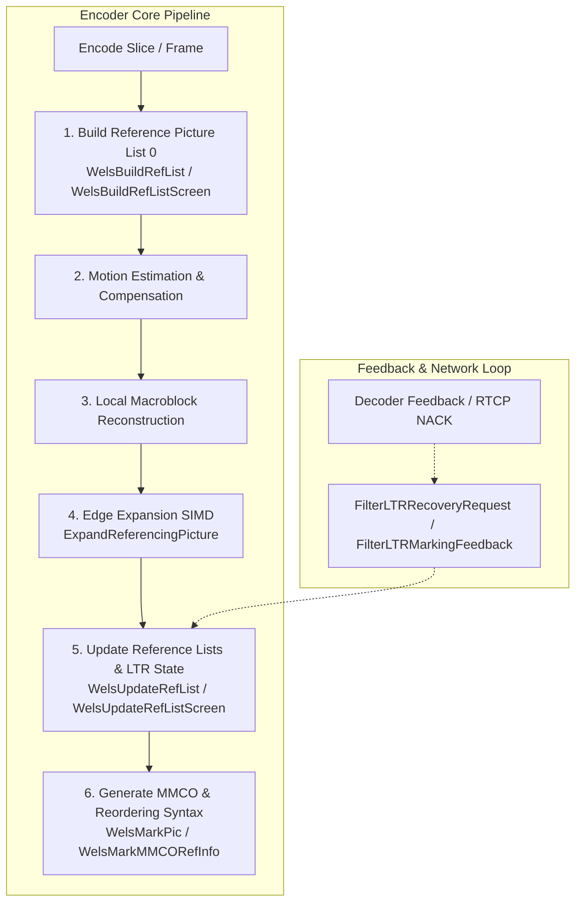
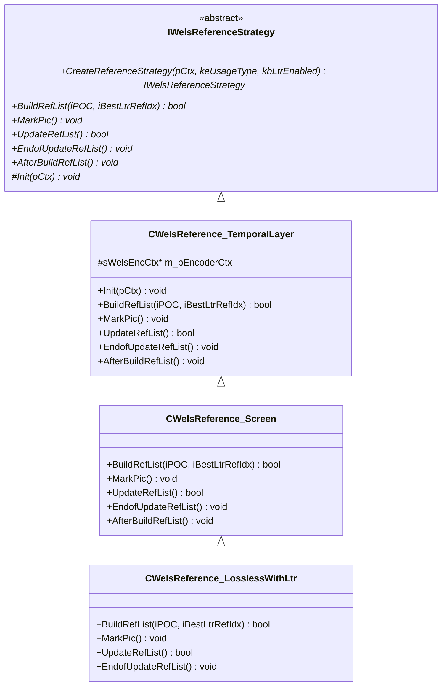

# Reference Picture List Management & Long-Term Reference Control (`ref_list_mgr_svc.cpp`)

## 1. High-Level Architectural Purpose

In H.264 / AVC and SVC video coding, inter-frame prediction relies fundamentally on managing one or more lists of reconstructed reference pictures (*Decoded Picture Buffer* or DPB). For real-time interactive communication (e.g. video conferencing, screen sharing, low-latency live streaming), reference picture management serves two crucial functions:
1. **Temporal Scalability & Coding Efficiency**: Organizing short-term reference pictures by temporal layer ($T_0, T_1, \dots, T_N$) and Picture Order Count (POC) to enable hierarchical prediction structures.
2. **Error Resilience & Fast Recovery via Long-Term References (LTR)**: Marking specific reference frames (typically base temporal layer $T_0$ frames or key visual anchors) as Long-Term References. When packet loss occurs downstream, the decoder sends feedback (e.g. LTR recovery request or marking confirmation). Instead of triggering an expensive Intra IDR keyframe that causes network bit-rate spikes, the encoder references an acknowledged LTR frame to resume decodable inter prediction instantly.

The implementation in [ref_list_mgr_svc.cpp](openh264/codec/encoder/core/src/ref_list_mgr_svc.cpp) provides the complete reference picture management engine for the OpenH264 SVC/AVC encoder core.



---

## 2. Core Data Structures, Enums, and Constants

The reference list manager operates on structures declared across [ref_list_mgr_svc.h](openh264/codec/encoder/core/inc/ref_list_mgr_svc.h), [encoder_context.h](openh264/codec/encoder/core/inc/encoder_context.h#L68-L102), [picture.h](openh264/codec/encoder/core/inc/picture.h#L64-L121), and [slice.h](openh264/codec/encoder/core/inc/slice.h#L52-L81).

### 2.1 Constants & Macros

| Constant / Macro | Value | Description |
| :--- | :--- | :--- |
| `STR_ROOM` | `1` | Short-Term Reference room offset reserved in reference list indexing calculations for screen content. |
| `MAX_SHORT_REF_COUNT` | `16` | Maximum number of active short-term reference pictures stored per spatial layer. |
| `MAX_REF_PIC_COUNT` | `16` | Maximum total reference pictures supported in the DPB pool. |
| `LONG_TERM_REF_NUM` | `2` | Number of long-term reference frame slots managed concurrently in standard LTR modes. |
| `MAX_TEMPORAL_LAYER_NUM` | `4` | Maximum hierarchical temporal layers ($T_0, T_1, T_2, T_3$) supported in SVC encoding. |

### 2.2 Enumerations

#### `LTR_MARKING_PROCESS_MODE`
Defines how long-term reference marking operations are scheduled relative to GOP boundaries:
```cpp
typedef enum {
  LTR_DIRECT_MARK = 0, // Frame is marked as LTR immediately upon encoding
  LTR_DELAY_MARK  = 1  // Frame is held in short-term list and marked as LTR after 1 GOP delay
} LTR_MARKING_PROCESS_MODE;
```

#### `COMPARE_FRAME_NUM`
Bitmask return values for modulo frame number comparison arithmetic:
```cpp
typedef enum {
  FRAME_NUM_EQUAL    = 0x01, // FrameNum A == FrameNum B
  FRAME_NUM_BIGGER   = 0x02, // FrameNum A > FrameNum B (topologically newer)
  FRAME_NUM_SMALLER  = 0x04, // FrameNum A < FrameNum B (topologically older)
  FRAME_NUM_OVER_MAX = 0x08  // Either FrameNum exceeds max allowed frame number limit
} COMPARE_FRAME_NUM;
```

---

### 2.3 Key Structs

#### `SLTRState` ([encoder_context.h](openh264/codec/encoder/core/inc/encoder_context.h#L80-L102))
Maintains the complete Long-Term Reference state machine per spatial dependency layer (`uiDependencyId`):

```cpp
typedef struct TagLTRState {
  // LTR Mark Feedback from Decoder
  uint32_t uiLtrMarkState;               // NO_LTR_MARKING_FEEDBACK, LTR_MARKING_SUCCESS, or LTR_MARKING_FAILED
  int32_t  iLtrMarkFbFrameNum;           // Frame number reported in the decoder marking feedback

  // LTR Recovery References
  int32_t  iLastRecoverFrameNum;         // Last frame number recovered via LTR or IDR
  int32_t  iLastCorFrameNumDec;          // Last verified correct frame position on decoder side
  int32_t  iCurFrameNumInDec;            // Current frame number on decoder side during recovery

  // LTR Marking Control
  int32_t  iLTRMarkMode;                 // LTR_DIRECT_MARK or LTR_DELAY_MARK
  int32_t  iLTRMarkSuccessNum;           // Cumulative count of successfully acknowledged LTR marks
  int32_t  iCurLtrIdx;                   // Current target Long-Term Reference index (0 to LONG_TERM_REF_NUM - 1)
  int32_t  iLastLtrIdx[MAX_TEMPORAL_LAYER_NUM]; // Active LTR index per temporal layer
  int32_t  iSceneLtrIdx;                 // Monotonically advancing index for screen content scene LTRs
  uint32_t uiLtrMarkInterval;            // Number of frames elapsed since last LTR mark operation

  // State Flags
  bool     bLTRMarkingFlag;              // Whether current frame is actively marked as an LTR
  bool     bLTRMarkEnable;               // Set true when LTR is confirmed and ready for next mark interval
  bool     bReceivedT0LostFlag;          // Set true when decoder reports T0 base layer packet loss
} SLTRState;
```

#### `SRefList` ([encoder_context.h](openh264/codec/encoder/core/inc/encoder_context.h#L71-L78))
Contains the active reference picture pointers and buffer pool for a spatial layer:

```cpp
typedef struct TagRefList {
  SPicture* pShortRefList[1 + MAX_SHORT_REF_COUNT]; // Active short-term reference pictures (ordered newest first)
  SPicture* pLongRefList[1 + MAX_REF_PIC_COUNT];    // Active long-term reference pictures (indexed by LTR index)
  SPicture* pNextBuffer;                            // Prefetched destination buffer for upcoming reconstruction
  SPicture* pRef[1 + MAX_REF_PIC_COUNT];            // Physical picture buffer pool storage
  uint8_t   uiShortRefCount;                        // Count of active short-term references
  uint8_t   uiLongRefCount;                         // Count of active long-term references
} SRefList;
```

---

## 3. Polymorphic Strategy Pattern Hierarchy

OpenH264 decouples reference list management policies across usage scenarios (standard camera video vs. real-time screen content vs. lossless screen content with LTR) using C++ polymorphism via [IWelsReferenceStrategy](openh264/codec/encoder/core/inc/ref_list_mgr_svc.h#L100-L146).



### 3.1 Class Responsibilities

1. **[IWelsReferenceStrategy](openh264/codec/encoder/core/inc/ref_list_mgr_svc.h#L100-L115)**:
   - Abstract interface defining the five lifecycle hooks invoked during frame encoding: `BuildRefList`, `MarkPic`, `UpdateRefList`, `EndofUpdateRefList`, and `AfterBuildRefList`.
   - Contains the static factory method `CreateReferenceStrategy(...)`.

2. **[CWelsReference_TemporalLayer](openh264/codec/encoder/core/inc/ref_list_mgr_svc.h#L117-L129)**:
   - Default strategy for `CAMERA_VIDEO_REAL_TIME` and `CAMERA_VIDEO_NON_REAL_TIME`.
   - Manages standard short-term temporal hierarchy ($T_0 \to T_1 \to T_2$) and standard LTR feedback.

3. **[CWelsReference_Screen](openh264/codec/encoder/core/inc/ref_list_mgr_svc.h#L131-L138)**:
   - Strategy for `SCREEN_CONTENT_REAL_TIME` when LTR is disabled (`kbLtrEnabled == false`).
   - Delegates reference updates to `WelsUpdateRefList` and updates block static indicators (`UpdateBlockStatic`) in VAA (Video Analysis & Assessment) for screen content hash-matching.

4. **[CWelsReference_LosslessWithLtr](openh264/codec/encoder/core/inc/ref_list_mgr_svc.h#L140-L146)**:
   - Strategy for `SCREEN_CONTENT_REAL_TIME` when LTR is enabled (`kbLtrEnabled == true`).
   - Implements specialized screen content reference selection (`WelsBuildRefListScreen`, `WelsUpdateRefListScreen`, `WelsMarkPicScreen`) and updates the lossless screen source list.

---

## 4. Deep Dive: Functions and Algorithmic Implementations

### 4.1 State Initialization and List Reset

#### `ResetLtrState`
```cpp
void ResetLtrState (SLTRState* pLtr);
```
- **Purpose**: Clears all LTR feedback, recovery markers, and marking state flags back to default values.
- **Parameters**:
  - `pLtr`: Pointer to [SLTRState](openh264/codec/encoder/core/inc/encoder_context.h#L80) instance for a spatial layer.
- **Behavior**:
  - Sets `bReceivedT0LostFlag = false`, `iLastRecoverFrameNum = 0`, `iLastCorFrameNumDec = -1`, `iCurFrameNumInDec = -1`.
  - Resets marking parameters: `iLTRMarkMode = LTR_DIRECT_MARK`, `iLTRMarkSuccessNum = 0`, `bLTRMarkingFlag = false`, `bLTRMarkEnable = false`, `iCurLtrIdx = 0`, `uiLtrMarkInterval = 0`.
  - Clears decoder feedback tracking: `uiLtrMarkState = NO_LTR_MARKING_FEEDBACK`, `iLtrMarkFbFrameNum = -1`.

#### `WelsResetRefList`
```cpp
void WelsResetRefList (sWelsEncCtx* pCtx);
```
- **Purpose**: Clears and unreferences all active short-term and long-term reference pictures in the current spatial dependency layer (`pCtx->uiDependencyId`).
- **Algorithm**:
  1. Sets all pointers in `pShortRefList[0 .. MAX_SHORT_REF_COUNT]` to `NULL`.
  2. Sets all pointers in `pLongRefList[0 .. iLTRRefNum]` to `NULL`.
  3. Calls `SetUnref()` on all physical frame buffers in `pRef[0 .. iNumRefFrame]`.
  4. Resets reference counts: `uiLongRefCount = 0`, `uiShortRefCount = 0`.
  5. Assigns `pNextBuffer = pRefList->pRef[0]`.

---

### 4.2 Reference List Deletion Helpers

#### `DeleteLTRFromLongList` & `DeleteSTRFromShortList`
```cpp
static inline void DeleteLTRFromLongList (sWelsEncCtx* pCtx, int32_t iIdx);
static inline void DeleteSTRFromShortList (sWelsEncCtx* pCtx, int32_t iIdx);
```
- **Purpose**: Removes a reference picture at index `iIdx` from `pLongRefList` or `pShortRefList` respectively, shifting trailing pointers to the left and decrementing the reference count.
- **Complexity**: $O(K)$ where $K \le 16$.

#### `DeleteNonSceneLTR`
```cpp
static void DeleteNonSceneLTR (sWelsEncCtx* pCtx);
```
- **Purpose**: In screen content coding, unreferences and purges all long-term reference frames that are *not* marked as Scene LTRs (`!pRef->bIsSceneLTR`) when the current frame is marked as a Scene LTR or has a lower temporal ID than the referenced frame.

---

### 4.3 Modulo Frame Number Comparison Arithmetic

#### `CompareFrameNum`
```cpp
static inline int32_t CompareFrameNum (int32_t iFrameNumA, int32_t iFrameNumB, int32_t iMaxFrameNumPlus1);
```
- **Purpose**: Compares two frame numbers $A$ (`iFrameNumA`) and $B$ (`iFrameNumB`) taking into account cyclic modulo wrap-around at $M = 2^{\text{log2\_max\_frame\_num}}$ (`iMaxFrameNumPlus1`).
- **Mathematical Formulation**:
  Let $M = \text{iMaxFrameNumPlus1}$. The standard absolute difference is:
  $$\Delta_{AB} = |A - B|$$
  To handle modular wrap-around across zero boundaries, the algorithm computes the wrapped distances:
  $$\Delta_A = |(A + M) - B|$$
  $$\Delta_B = |(B + M) - A|$$
- **Decision Logic**:
  1. If $A > M$ or $B > M$, returns `-2` (`FRAME_NUM_OVER_MAX`).
  2. If $\Delta_{AB} == 0$, returns `FRAME_NUM_EQUAL`.
  3. If $\Delta_{AB} > \Delta_A$, $A + M$ is closer to $B$, indicating $A$ has wrapped around past $B$: returns `FRAME_NUM_BIGGER`.
  4. If $\Delta_{AB} > \Delta_B$, returns `FRAME_NUM_SMALLER`.
  5. Otherwise, returns `(A > B) ? FRAME_NUM_BIGGER : FRAME_NUM_SMALLER`.

---

### 4.4 Long-Term Reference State Management & Feedback

#### `DeleteInvalidLTR`
```cpp
static inline void DeleteInvalidLTR (sWelsEncCtx* pCtx);
```
- **Purpose**: Iterates over all active long-term reference pictures in `pLongRefList` and deletes invalid or unacknowledged LTRs based on decoder feedback (`pLtr->iLastCorFrameNumDec` and `pLtr->iCurFrameNumInDec`).
- **Recovery Condition**: If all long-term references are deleted (`uiLongRefCount == 0`), the encoder forces the next frame to be encoded as an IDR frame:
  ```cpp
  pParamInternal->bEncCurFrmAsIdrFlag = true;
  ```

#### `HandleLTRMarkFeedback`
```cpp
static inline void HandleLTRMarkFeedback (sWelsEncCtx* pCtx);
```
- **Purpose**: Handles asynchronous decoder confirmation or failure feedback for LTR marking.
- **Workflow**:
  ```mermaid
  flowchart TD
      Feedback[uiLtrMarkState] -->|LTR_MARKING_SUCCESS| SuccessPath[1. Confirm Long-Term Pic: uiRecieveConfirmed = RECIEVE_SUCCESS<br/>2. Update VAA Valid LTR Index<br/>3. Delete obsolete LTRs not matching iCurLtrIdx<br/>4. iLTRMarkSuccessNum++<br/>5. Advance iCurLtrIdx modulo LONG_TERM_REF_NUM<br/>6. Switch Mode: LTR_DELAY_MARK if success >= LONG_TERM_REF_NUM]
      Feedback -->|LTR_MARKING_FAILED| FailPath[1. Unref & Delete failed LTR from pLongRefList<br/>2. If iLTRMarkSuccessNum == 0, force IDR keyframe]
  ```

#### `LTRMarkProcess` & `LTRMarkProcessScreen`
```cpp
static inline void LTRMarkProcess (sWelsEncCtx* pCtx);
static inline void LTRMarkProcessScreen (sWelsEncCtx* pCtx);
```
- **Purpose**: Executes the promotion and movement of frames from the short-term list to the long-term list based on marking flags and marking mode (`LTR_DIRECT_MARK` vs `LTR_DELAY_MARK`).
- **Mechanism**:
  - For `I_SLICE` or when `pLtr->bLTRMarkingFlag` is true, sets picture flags `bIsLongRef = true`, `iLongTermPicNum = pLtr->iCurLtrIdx`, and records `iMarkFrameNum`.
  - In `LTR_DIRECT_MARK`, the marked frame in `pShortRefList` is moved to `pLongRefList[0]`. Existing long-term references are shifted right via `memmove`. If `uiLongRefCount > iLTRRefNum`, the oldest LTR is unreferenced and deleted.

---

### 4.5 Reference List Building & Updating

#### `WelsBuildRefList`
```cpp
bool WelsBuildRefList (sWelsEncCtx* pCtx, const int32_t iPOC, int32_t iBestLtrRefIdx);
```
- **Purpose**: Constructs Reference Picture List 0 (`pCtx->pRefList0`) for the current frame before motion estimation.
- **Logic**:
  1. For `I_SLICE` (IDR): resets all reference lists via `WelsResetRefList(pCtx)` and resets LTR state via `ResetLtrState(...)`.
  2. For `P_SLICE`:
     - If LTR is enabled, a base-layer packet loss occurred (`bReceivedT0LostFlag == true`), and $uiTemporalId == 0$: scans `pLongRefList` for the first confirmed reference (`uiRecieveConfirmed == RECIEVE_SUCCESS`), adds it to `pRefList0[0]`, and records recovery frame number.
     - Otherwise: scans `pShortRefList` in reverse temporal order, adding all valid references satisfying $uiTemporalId \le \text{kuiTid}$ into `pRefList0`.
  3. Clamps total active references `pCtx->iNumRef0` to `pCtx->pSvcParam->iNumRefFrame`.
  4. Returns `true` if `iNumRef0 > 0` or if encoding an `I_SLICE`.

#### `WelsUpdateRefList`
```cpp
bool WelsUpdateRefList (sWelsEncCtx* pCtx);
```
- **Purpose**: Updates reference lists after the current frame has been reconstructed.
- **Workflow**:
  1. **SIMD Reference Picture Expansion**:
     Calls `ExpandReferencingPicture` to extrapolate edge boundary pixels for luma and chroma planes using SIMD assembly routines (`pfExpandLumaPicture`, `pfExpandChromaPicture`). This allows motion vectors to point outside picture boundaries.
  2. **Short-Term List Insertion**:
     Sets `pDecPic` metadata ($uiTemporalId, uiSpatialId, iFrameNum, iPOC, bUsedAsRef = \text{true}$) and inserts `pDecPic` at index 0 of `pShortRefList`, shifting existing elements right.
  3. **Temporal Layer 0 & LTR Maintenance**:
     If $uiTemporalId == 0$ in a $P$-slice:
     - Runs `LTRMarkProcess`, `DeleteInvalidLTR`, and `HandleLTRMarkFeedback`.
     - Clears unreferenced short-term frames from `pShortRefList`.
  4. Calls `pCtx->pReferenceStrategy->EndofUpdateRefList()`.

#### `PrefetchNextBuffer`
```cpp
static void PrefetchNextBuffer (sWelsEncCtx* pCtx);
```
- **Purpose**: Pre-allocates the destination frame buffer pointer `pCtx->pDecPic` for the *next* frame reconstruction.
- **Algorithm**:
  - Searches the physical buffer pool `pRefList->pRef[0 .. kiNumRef]` for an unused buffer (`!bUsedAsRef`).
  - If no free buffer exists (DPB full), forces unreferencing of the oldest short-term picture (`pShortRefList[uiShortRefCount - 1]->SetUnref()`) to reclaim its buffer.

---

### 4.6 Syntax Element Generation for Slice Headers

#### `WelsMarkMMCORefInfo` & `WelsMarkMMCORefInfoScreen`
```cpp
void WelsMarkMMCORefInfo (sWelsEncCtx* pCtx, SLTRState* pLtr, SSlice** ppSliceList, const int32_t kiCountSliceNum);
void WelsMarkMMCORefInfoScreen (sWelsEncCtx* pCtx, SLTRState* pLtr, SSlice** ppSliceList, const int32_t kiCountSliceNum);
```
- **Purpose**: Generates H.264 Memory Management Control Operation (MMCO) syntax commands in [SRefPicMarking](openh264/codec/encoder/core/inc/slice.h#L66-L81) for slice headers.
- **MMCO Command Generation**:
  - **`LTR_DIRECT_MARK`**:
    1. `MMCO_SET_MAX_LONG`: Sets `iMaxLongTermFrameIdx = LONG_TERM_REF_NUM - 1`.
    2. `MMCO_SHORT2UNUSED`: Marks the previous reference frame at distance $iGoPFrameNumInterval$ as unused for reference.
    3. `MMCO_LONG`: Marks the current picture as a long-term reference with index `iLongTermFrameIdx = pLtr->iCurLtrIdx`.
  - **`LTR_DELAY_MARK`**:
    1. `MMCO_SHORT2LONG`: Converts the short-term picture at distance $iGoPFrameNumInterval$ into a long-term reference at index `iLongTermFrameIdx`.

#### `WelsUpdateSliceHeaderSyntax` & `WelsUpdateRefSyntax`
```cpp
void WelsUpdateSliceHeaderSyntax (sWelsEncCtx* pCtx, const int32_t iAbsDiffPicNumMinus1, SSlice** ppSliceList, const int32_t uiFrameType);
void WelsUpdateRefSyntax (sWelsEncCtx* pCtx, const int32_t iPOC, const int32_t uiFrameType);
```
- **Purpose**: Populates slice header reference picture list reordering syntax ([SRefPicListReorderSyntax](openh264/codec/encoder/core/inc/slice.h#L55-L62)) and adaptive reference marking flags across all slices in the current dependency layer.
- **Reordering Syntax**:
  - For short-term references: sets `uiReorderingOfPicNumsIdc = 0` with `uiAbsDiffPicNumMinus1 = iAbsDiffPicNumMinus1`, terminated by opcode `3`.
  - For long-term references: sets `uiReorderingOfPicNumsIdc = 2` with `iLongTermPicNum`, terminated by opcode `3`.

---

### 4.7 Screen Content & Lossless LTR Processing

#### `WelsBuildRefListScreen` & `WelsUpdateRefListScreen`
```cpp
bool WelsBuildRefListScreen (sWelsEncCtx* pCtx, const int32_t iPOC, int32_t iBestLtrRefIdx);
bool WelsUpdateRefListScreen (sWelsEncCtx* pCtx);
```
- **Purpose**: Specialized reference picture list building and updating tailored for screen content video coding (`SCREEN_CONTENT_REAL_TIME`).
- **Key Features**:
  - Queries VPP (Video Pre-Processing) via `pCtx->pVpp->GetRefFrameInfo(...)` to select reference pictures based on screen block hash features and static background detection.
  - Manages `bIsSceneLTR` flags to retain high-complexity static background frames across long temporal horizons.

---

## 5. Function Map & Implementation Reference

| Function / Method | Scope | Key Operations & Interacting Subsystems |
| :--- | :--- | :--- |
| `ResetLtrState` | Global | Resets [SLTRState](openh264/codec/encoder/core/inc/encoder_context.h#L80) fields to default initialization values. |
| `WelsResetRefList` | Global | Clears [SRefList](openh264/codec/encoder/core/inc/encoder_context.h#L71) lists and calls `SetUnref()` on physical buffers. |
| `DeleteLTRFromLongList` | `static inline` | Left-shifts `pLongRefList` pointers and decrements `uiLongRefCount`. |
| `DeleteSTRFromShortList` | `static inline` | Left-shifts `pShortRefList` pointers and decrements `uiShortRefCount`. |
| `DeleteNonSceneLTR` | `static` | Unreferences non-scene LTR frames when a new scene LTR is marked. |
| `CompareFrameNum` | `static inline` | Modulo-$2^{\text{log2\_max\_frame\_num}}$ frame number distance comparison. |
| `DeleteInvalidLTR` | `static inline` | Removes unacknowledged or out-of-sequence LTR frames based on decoder feedback. |
| `HandleLTRMarkFeedback` | `static inline` | Processes `LTR_MARKING_SUCCESS` and `LTR_MARKING_FAILED` feedback events. |
| `LTRMarkProcess` | `static inline` | Promotes short-term references to long-term references during camera encoding. |
| `LTRMarkProcessScreen` | `static inline` | Promotes screen content references to long-term reference slots. |
| `PrefetchNextBuffer` | `static` | Recycles unused frame buffer from `pRef[]` or unrefs oldest short-term picture. |
| `WelsUpdateRefList` | Global | Edge expansion ([ExpandReferencingPicture](openh264/codec/encoder/core/src/picture_handle.cpp)), short-term list updates, LTR processing. |
| `CheckCurMarkFrameNumUsed` | Global | Verifies whether the candidate frame number is already occupied in the LTR list. |
| `WelsMarkMMCORefInfo` | Global | Generates H.264 MMCO syntax commands (`MMCO_SET_MAX_LONG`, `MMCO_SHORT2UNUSED`, `MMCO_LONG`, `MMCO_SHORT2LONG`). |
| `WelsMarkPic` | Global | Evaluates LTR interval and sets `bLTRMarkingFlag` before populating slice MMCO info. |
| `FilterLTRRecoveryRequest` | Global | Handles decoder LTR recovery requests (RTCP feedback) and sets `bReceivedT0LostFlag`. |
| `FilterLTRMarkingFeedback` | Global | Records LTR marking confirmation/failure feedback from the decoder. |
| `WelsBuildRefList` | Global | Builds `pRefList0` for motion estimation from `pLongRefList` (recovery) or `pShortRefList`. |
| `UpdateBlockStatic` | `static` | Invokes VPP `UpdateBlockIdcForScreen` to calculate static block maps for screen content. |
| `WelsUpdateSliceHeaderSyntax` | Global | Formulates slice header reference picture reordering syntax (`uiReorderingOfPicNumsIdc`). |
| `WelsUpdateRefSyntax` | Global | Calculates frame number deltas (`iAbsDiffPicNumMinus1`) and updates slice headers. |
| `UpdateOriginalPicInfo` | `static inline` | Synchronizes metadata from reconstructed picture (`pReconPic`) to source picture (`pOrigPic`). |
| `UpdateSrcPicList` | `static` | Synchronizes source picture metadata and updates VPP short-term reference list. |
| `UpdateSrcPicListLosslessScreenRefSelectionWithLtr` | `static` | Synchronizes source picture metadata and updates VPP long-term reference list. |
| `WelsUpdateRefListScreen` | Global | Screen content reference picture expansion and LTR list update. |
| `WelsBuildRefListScreen` | Global | Screen content reference list building using VPP block feature matching. |
| `WelsMarkMMCORefInfoScreen` | Global | Generates MMCO commands for screen content LTR marking. |
| `WelsMarkPicScreen` | Global | Manages screen content LTR marking intervals and delta frame number selection. |
| `CreateReferenceStrategy` | Static Factory | Instantiates `CWelsReference_TemporalLayer`, `CWelsReference_Screen`, or `CWelsReference_LosslessWithLtr`. |
