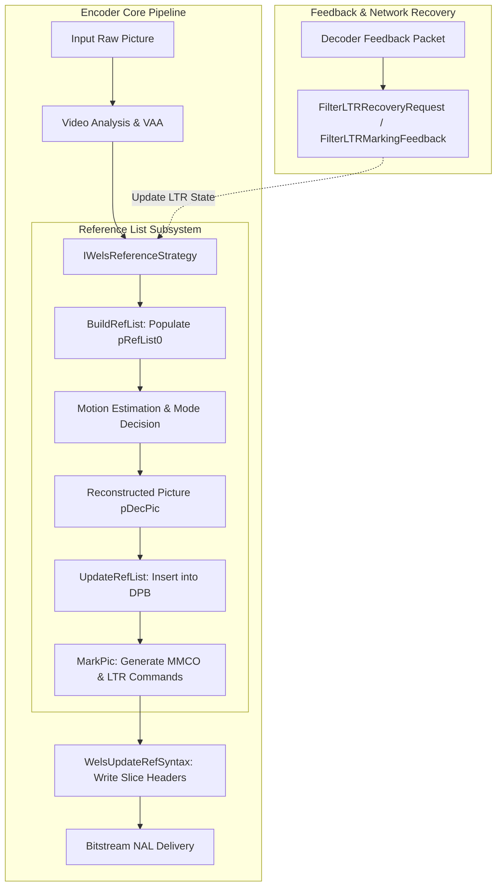
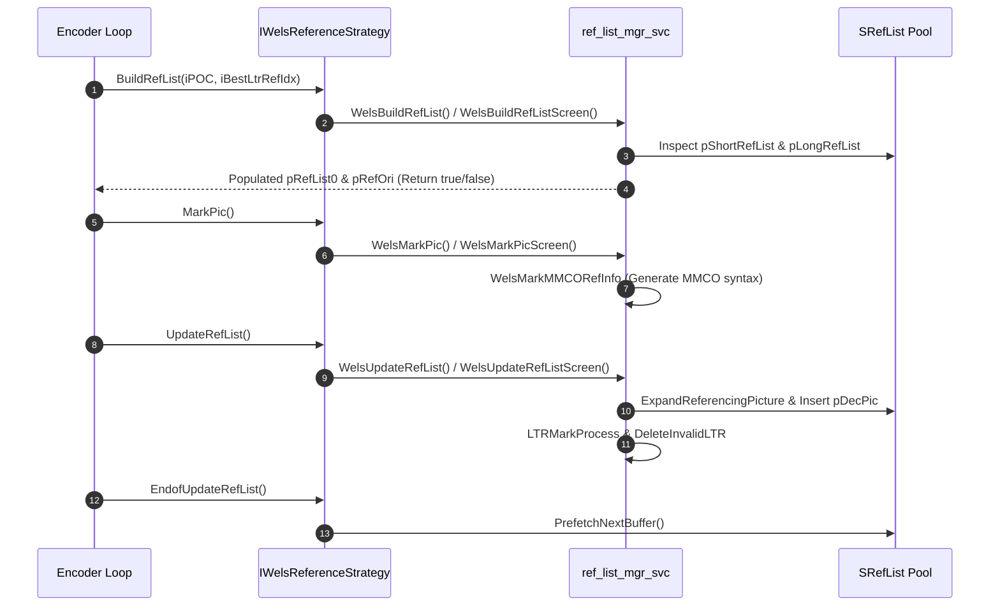
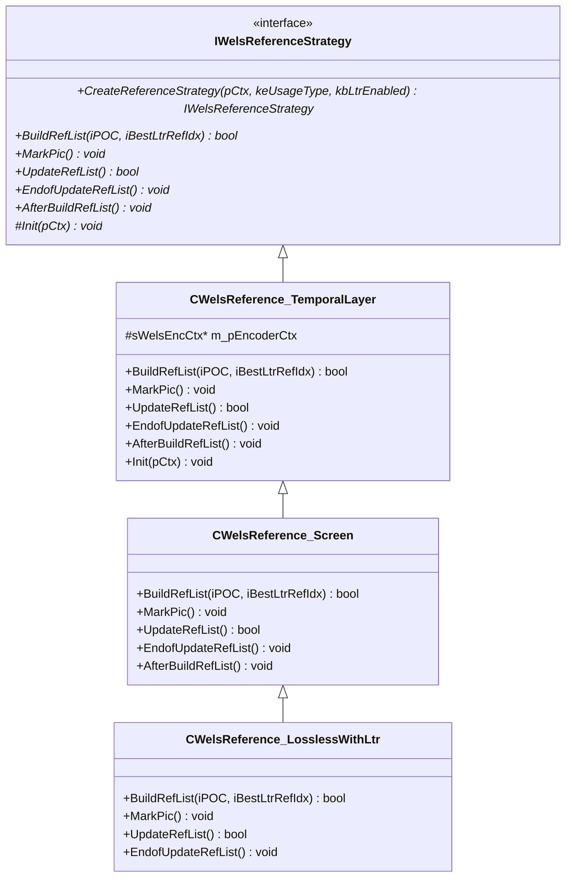
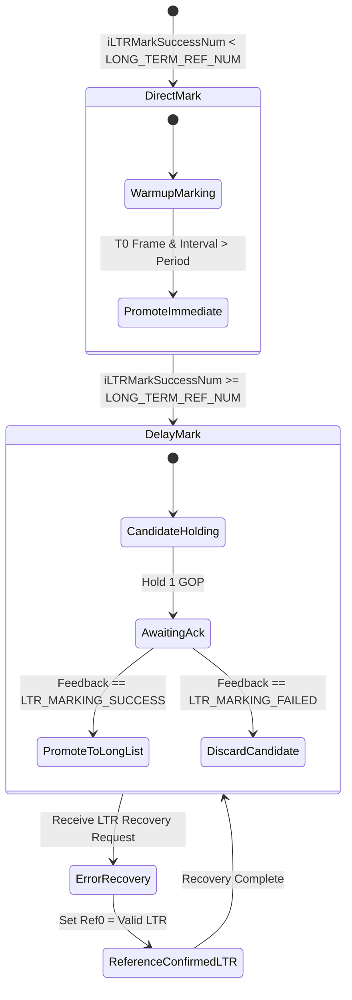

# Reference Picture List Management (`ref_list_mgr_svc.h`)

This document provides a comprehensive, literate-programming-style architectural breakdown of the Reference Picture List Management subsystem for the Cisco OpenH264 SVC encoder, declared in [`codec/encoder/core/inc/ref_list_mgr_svc.h`](openh264/codec/encoder/core/inc/ref_list_mgr_svc.h) and implemented in [`codec/encoder/core/src/ref_list_mgr_svc.cpp`](openh264/codec/encoder/core/src/ref_list_mgr_svc.cpp).

---

## Table of Contents
1. [Architectural Role & System Context](#1-architectural-role--system-context)
2. [Data Types, Enumerations, and Constants](#2-data-types-enumerations-and-constants)
   - [2.1 `LTR_MARKING_PROCESS_MODE`](#21-ltr_marking_process_mode)
   - [2.2 `COMPARE_FRAME_NUM`](#22-compare_frame_num)
   - [2.3 Closely Coupled Core Data Structures](#23-closely-coupled-core-data-structures)
3. [Global Functions & Reference List Lifecycle API](#3-global-functions--reference-list-lifecycle-api)
   - [3.1 State Initialization & Reset (`ResetLtrState`, `WelsResetRefList`)](#31-state-initialization--reset)
   - [3.2 Reference Picture List Construction (`WelsBuildRefList`, `WelsBuildRefListScreen`)](#32-reference-picture-list-construction)
   - [3.3 Decoded Picture Buffer Insertion & Updating (`WelsUpdateRefList`, `WelsUpdateRefListScreen`)](#33-decoded-picture-buffer-insertion--updating)
   - [3.4 Long-Term Reference Marking & MMCO Generation (`WelsMarkPic`, `WelsMarkPicScreen`, `WelsMarkMMCORefInfo`)](#34-long-term-reference-marking--mmco-generation)
   - [3.5 Reference Syntax Serialization (`WelsUpdateRefSyntax`, `WelsUpdateSliceHeaderSyntax`)](#35-reference-syntax-serialization)
   - [3.6 Decoder Feedback & Resilience Handlers (`FilterLTRRecoveryRequest`, `FilterLTRMarkingFeedback`)](#36-decoder-feedback--resilience-handlers)
4. [Polymorphic Strategy Architecture (`IWelsReferenceStrategy`)](#4-polymorphic-strategy-architecture-iwelsreferencestrategy)
   - [4.1 Abstract Base Interface: `IWelsReferenceStrategy`](#41-abstract-base-interface-iwelsreferencestrategy)
   - [4.2 Strategy: `CWelsReference_TemporalLayer`](#42-strategy-cwelsreference_temporallayer)
   - [4.3 Strategy: `CWelsReference_Screen`](#43-strategy-cwelsreference_screen)
   - [4.4 Strategy: `CWelsReference_LosslessWithLtr`](#44-strategy-cwelsreference_losslesswithltr)
5. [Mathematical Formulations & Algorithmic Details](#5-mathematical-formulations--algorithmic-details)
   - [5.1 Modular Frame Number Arithmetic](#51-modular-frame-number-arithmetic)
   - [5.2 Long-Term Reference (LTR) State Machine & Feedback Loop](#52-long-term-reference-ltr-state-machine--feedback-loop)
   - [5.3 Memory Management Control Operations (MMCO) Mapping](#53-memory-management-control-operations-mmco-mapping)

---

## 1. Architectural Role & System Context

In H.264 / AVC and SVC (Scalable Video Coding) streams, motion estimation and inter-frame prediction rely on reconstructed reference frames maintained in the **Decoded Picture Buffer (DPB)**. The reference list manager is responsible for:

1. **Active Reference List Construction**: Building `RefPicList0` (`pRefList0`) for motion estimation and compensation before encoding a P-slice.
2. **Temporal Scalability Enforcing**: Managing hierarchical temporal prediction structures ($T_0 \to T_1 \to T_2 \to T_3$), ensuring that lower temporal layers do not reference higher temporal layers.
3. **Long-Term Reference (LTR) State Management**: Enabling error recovery in lossy network environments by maintaining validated long-term frames and using decoder feedback (via RTCP feedback or application-level signaling) to avoid full IDR intra-refreshes.
4. **H.264 Bitstream Syntax Synchronization**: Generating standard Annex A/G H.264 slice header syntax elements:
   - `ref_pic_list_reordering()`
   - `dec_ref_pic_marking()` (Memory Management Control Operations: **MMCO**)
5. **Content-Adaptive Polymorphism**: Supplying specialized reference strategies for camera video versus real-time screen content sharing.



---

## 2. Data Types, Enumerations, and Constants

### 2.1 `LTR_MARKING_PROCESS_MODE`

Declared in [`ref_list_mgr_svc.h`](openh264/codec/encoder/core/inc/ref_list_mgr_svc.h#L51-L54):

```cpp
typedef enum {
  LTR_DIRECT_MARK = 0,
  LTR_DELAY_MARK  = 1
} LTR_MARKING_PROCESS_MODE;
```

#### Field & Semantic Details

| Enumerator | Value | Description |
| :--- | :---: | :--- |
| `LTR_DIRECT_MARK` | `0` | **Direct Marking Mode**: Applied during the initial warmup phase when the total number of successfully acknowledged LTR markings (`iLTRMarkSuccessNum`) is less than `LONG_TERM_REF_NUM`. Short-term reference frames are promoted to long-term reference status immediately upon encoding. |
| `LTR_DELAY_MARK` | `1` | **Delayed Marking Mode**: Activated once `iLTRMarkSuccessNum >= LONG_TERM_REF_NUM`. To guarantee reference stability over lossy networks, short-term references are held in a candidate state for 1 GOP interval before being promoted to the long-term list, ensuring decoder feedback has been received. |

---

### 2.2 `COMPARE_FRAME_NUM`

Declared in [`ref_list_mgr_svc.h`](openh264/codec/encoder/core/inc/ref_list_mgr_svc.h#L56-L61):

```cpp
typedef enum {
  FRAME_NUM_EQUAL    = 0x01,
  FRAME_NUM_BIGGER   = 0x02,
  FRAME_NUM_SMALLER  = 0x04,
  FRAME_NUM_OVER_MAX = 0x08
} COMPARE_FRAME_NUM;
```

#### Bitmask Description

These flags represent the topological relationship between two H.264 frame numbers ($A$ and $B$) modulo $2^{\text{log2\_max\_frame\_num}}$:

* **`FRAME_NUM_EQUAL` (`0x01`)**: Frame numbers are identical ($A = B$).
* **`FRAME_NUM_BIGGER` (`0x02`)**: Frame number $A$ is topologically ahead of $B$ in the circular sequence number space.
* **`FRAME_NUM_SMALLER` (`0x04`)**: Frame number $A$ is topologically behind $B$.
* **`FRAME_NUM_OVER_MAX` (`0x08`)**: Frame number exceeds the maximum allowed modulus limit ($2^{\text{uiLog2MaxFrameNum}}$).

---

### 2.3 Closely Coupled Core Data Structures

While declared across [`encoder_context.h`](openh264/codec/encoder/core/inc/encoder_context.h#L71-L102), the reference list manager operates directly on these primary structures:

#### A. `SLTRState` ([`TagLTRState`](openh264/codec/encoder/core/inc/encoder_context.h#L80-L102))

Encapsulates the state machine for Long-Term Reference tracking, feedback acknowledgement, and error recovery:

```cpp
typedef struct TagLTRState {
  // LTR mark feedback
  uint32_t  uiLtrMarkState;             // Current feedback status: NO_LTR_MARKING_FEEDBACK, LTR_MARKING_SUCCESS, LTR_MARKING_FAILED
  int32_t   iLtrMarkFbFrameNum;         // Frame number referenced in the decoder's LTR feedback message

  // LTR recovery reference tracking
  int32_t   iLastRecoverFrameNum;       // Frame number of the most recent IDR or LTR recovery event
  int32_t   iLastCorFrameNumDec;        // Last correct frame number acknowledged by the decoder
  int32_t   iCurFrameNumInDec;          // Decoder's current frame number when feedback was dispatched

  // LTR mark state machine
  int32_t   iLTRMarkMode;               // Marking mode: LTR_DIRECT_MARK (0) or LTR_DELAY_MARK (1)
  int32_t   iLTRMarkSuccessNum;         // Cumulative count of successfully acknowledged LTR frames
  int32_t   iCurLtrIdx;                 // Long-term picture index (long_term_frame_idx) currently targeted
  int32_t   iLastLtrIdx[MAX_TEMPORAL_LAYER_NUM]; // Latest active LTR index mapped per temporal layer
  int32_t   iSceneLtrIdx;               // Dedicated LTR index counter for Screen Content scene changes

  uint32_t  uiLtrMarkInterval;          // Number of frames encoded since the last LTR mark was executed

  bool      bLTRMarkingFlag;            // True if the current frame is being marked as an LTR
  bool      bLTRMarkEnable;             // True if LTR marking is permitted (interval >= iLtrMarkPeriod)
  bool      bReceivedT0LostFlag;        // True if loss feedback on temporal layer T0 was received
} SLTRState;
```

#### B. `SRefList` ([`TagRefList`](openh264/codec/encoder/core/inc/encoder_context.h#L71-L78))

Represents the physical DPB frame arrays allocated per spatial dependency layer (`uiDependencyId`):

```cpp
typedef struct TagRefList {
  SPicture* pShortRefList[1 + MAX_SHORT_REF_COUNT]; // Array of active short-term reference pictures (STR)
  SPicture* pLongRefList[1 + MAX_REF_PIC_COUNT];    // Array of active long-term reference pictures (LTR)
  SPicture* pNextBuffer;                            // Pointer to pre-fetched empty picture buffer for next frame
  SPicture* pRef[1 + MAX_REF_PIC_COUNT];            // Physical picture buffer pool storage
  uint8_t   uiShortRefCount;                        // Count of valid active short-term references
  uint8_t   uiLongRefCount;                         // Count of valid active long-term references
} SRefList;
```

---

## 3. Global Functions & Reference List Lifecycle API

The C-linkage functions declared in [`ref_list_mgr_svc.h`](openh264/codec/encoder/core/inc/ref_list_mgr_svc.h#L63-L98) govern reference picture lifecycle transitions.



---

### 3.1 State Initialization & Reset

#### `ResetLtrState`
```cpp
void ResetLtrState (SLTRState* pLtr);
```
* **Location**: [`ref_list_mgr_svc.h:66`](openh264/codec/encoder/core/inc/ref_list_mgr_svc.h#L66), [`ref_list_mgr_svc.cpp:43-61`](openh264/codec/encoder/core/src/ref_list_mgr_svc.cpp#L43-61)
* **Purpose**: Restores the entire [`SLTRState`](openh264/codec/encoder/core/inc/encoder_context.h#L80-L102) state machine to clean initial values.
* **Operations**:
  * Clears loss and recovery flags: `bReceivedT0LostFlag = false`, `iLastRecoverFrameNum = 0`, `iLastCorFrameNumDec = -1`, `iCurFrameNumInDec = -1`.
  * Resets LTR mode to `LTR_DIRECT_MARK`.
  * Clears `iLTRMarkSuccessNum`, `bLTRMarkingFlag`, `bLTRMarkEnable`, `uiLtrMarkInterval`, and zeroes `iLastLtrIdx`.
  * Resets feedback state to `NO_LTR_MARKING_FEEDBACK` and `iLtrMarkFbFrameNum = -1`.

#### `WelsResetRefList`
```cpp
void WelsResetRefList (sWelsEncCtx* pCtx);
```
* **Location**: [`ref_list_mgr_svc.h:70`](openh264/codec/encoder/core/inc/ref_list_mgr_svc.h#L70), [`ref_list_mgr_svc.cpp:66-80`](openh264/codec/encoder/core/src/ref_list_mgr_svc.cpp#L66-L80)
* **Purpose**: Flushes the DPB for the current spatial layer upon encoding an IDR frame or re-initializing the encoder.
* **Operations**:
  * Sets all pointers in `pShortRefList[0 .. MAX_SHORT_REF_COUNT]` to `NULL`.
  * Sets all pointers in `pLongRefList[0 .. iLTRRefNum]` to `NULL`.
  * Invokes `pRef[i]->SetUnref()` on all physical frames in the DPB pool.
  * Resets `uiLongRefCount = 0` and `uiShortRefCount = 0`.
  * Assigns `pNextBuffer = pRef[0]`.

---

### 3.2 Reference Picture List Construction

#### `WelsBuildRefList`
```cpp
bool WelsBuildRefList (sWelsEncCtx* pCtx, const int32_t kiPOC, int32_t iBestLtrRefIdx);
```
* **Location**: [`ref_list_mgr_svc.h:79`](openh264/codec/encoder/core/inc/ref_list_mgr_svc.h#L79), [`ref_list_mgr_svc.cpp:594-646`](openh264/codec/encoder/core/src/ref_list_mgr_svc.cpp#L594-L646)
* **Parameters**:
  * `pCtx`: Pointer to the master encoder context [`sWelsEncCtx`](openh264/codec/encoder/core/inc/encoder_context.h).
  * `kiPOC`: Picture Order Count of the frame currently being encoded.
  * `iBestLtrRefIdx`: Best long-term reference index suggested by VAA or external heuristics.
* **Return Value**: `true` if valid reference pictures exist or if the current slice is an `I_SLICE`; `false` otherwise.
* **Algorithmic Logic**:
  1. For `I_SLICE` / IDR frames: invokes `WelsResetRefList(pCtx)` and `ResetLtrState(...)`.
  2. For `P_SLICE` frames:
     * **LTR Recovery Path**: If `bEnableLongTermReference` is active, `bReceivedT0LostFlag == true`, and `uiTemporalId == 0`:
       Searches `pLongRefList` for the first reference marked with `uiRecieveConfirmed == RECIEVE_SUCCESS`. Places this confirmed LTR into `pRefList0[0]` and `pCurDqLayer->pRefOri[0]`. Sets `pLtr->iLastRecoverFrameNum = pParamD->iFrameNum`.
     * **Standard Temporal Scalability Path**: Iterates over `pShortRefList[0 .. uiShortRefCount-1]`. Selects all short-term frames matching:
       $$pRef \neq \text{NULL} \quad \wedge \quad pRef\text{->bUsedAsRef} \quad \wedge \quad pRef\text{->iFramePoc} \ge 0 \quad \wedge \quad pRef\text{->uiTemporalId} \le \text{kuiTid}$$
       Populates `pRefList0` and increments `pCtx->iNumRef0`.
  3. Clamps `pCtx->iNumRef0` to `pCtx->pSvcParam->iNumRefFrame`.

#### `WelsBuildRefListScreen`
```cpp
bool WelsBuildRefListScreen (sWelsEncCtx* pCtx, const int32_t iPOC, int32_t iBestLtrRefIdx);
```
* **Location**: [`ref_list_mgr_svc.cpp:811-887`](openh264/codec/encoder/core/src/ref_list_mgr_svc.cpp#L811-L887)
* **Purpose**: Specialized reference list builder for screen content coding (`SCREEN_CONTENT_REAL_TIME`).
* **Algorithmic Logic**:
  * Uses Video Pre-Processing (`pVpp->GetRefFrameInfo`) to query available long-term reference candidates detected through screen scene change analysis or static background tracking.
  * Filters candidate pictures based on `bIsSceneLTR` flags and temporal hierarchy constraints.

---

### 3.3 Decoded Picture Buffer Insertion & Updating

#### `WelsUpdateRefList`
```cpp
bool WelsUpdateRefList (sWelsEncCtx* pCtx);
```
* **Location**: [`ref_list_mgr_svc.h:75`](openh264/codec/encoder/core/inc/ref_list_mgr_svc.h#L75), [`ref_list_mgr_svc.cpp:353-431`](openh264/codec/encoder/core/src/ref_list_mgr_svc.cpp#L353-L431)
* **Algorithmic Logic**:
  1. **Border Sample Padding**: Calls `ExpandReferencingPicture` on `pCtx->pDecPic` to expand luma and chroma boundaries with edge-repetition padding (allowing motion vectors to point outside picture boundaries).
  2. **Metadata Tagging**: Updates `pDecPic` properties: `uiTemporalId`, `uiSpatialId`, `iFrameNum`, `iFramePoc`, `bUsedAsRef = true`.
  3. **Short-Term List Insertion**: Shifts existing entries in `pShortRefList` right by 1 and inserts `pDecPic` at index 0 (`pShortRefList[0] = pDecPic`), incrementing `uiShortRefCount`.
  4. **P-Slice $T_0$ LTR Handling**:
     * If `pCtx->uiTemporalId == 0` and LTR is enabled:
       * Invokes `LTRMarkProcess(pCtx)` to handle promotions from STR to LTR.
       * Calls `DeleteInvalidLTR(pCtx)` to purge unacknowledged LTRs.
       * Executes `HandleLTRMarkFeedback(pCtx)` to process incoming decoder feedback.
       * Resets `pLtr->bReceivedT0LostFlag = false` and increments `pLtr->uiLtrMarkInterval`.
     * Evicts stale short-term frames from `pShortRefList` exceeding reference capacity.
  5. **IDR Handling**: Initializes default LTR parameters for IDR keyframes.
  6. Dispatches strategy completion callback `pCtx->pReferenceStrategy->EndofUpdateRefList()`.

---

### 3.4 Long-Term Reference Marking & MMCO Generation

#### `WelsMarkPic`
```cpp
void WelsMarkPic (sWelsEncCtx* pCtx);
```
* **Location**: [`ref_list_mgr_svc.h:94`](openh264/codec/encoder/core/inc/ref_list_mgr_svc.h#L94), [`ref_list_mgr_svc.cpp:494-515`](openh264/codec/encoder/core/src/ref_list_mgr_svc.cpp#L494-515)
* **Purpose**: Evaluates whether the current frame should be marked as a Long-Term Reference and constructs the required MMCO slice header commands.
* **Marking Criteria**:
  $$\text{LTR\_Mark} = \text{bEnableLongTermReference} \quad \wedge \quad \text{bLTRMarkEnable} \quad \wedge \quad (\text{uiTemporalId} == 0) \quad \wedge \quad (\neg \text{bReceivedT0LostFlag}) \quad \wedge \quad (\text{uiLtrMarkInterval} > \text{iLtrMarkPeriod}) \quad \wedge \quad \text{CheckCurMarkFrameNumUsed}(pCtx)$$

#### `WelsMarkMMCORefInfo`
* **Location**: [`ref_list_mgr_svc.cpp:466-492`](openh264/codec/encoder/core/src/ref_list_mgr_svc.cpp#L466-L492)
* **Generated MMCO Commands**:
  * **In `LTR_DIRECT_MARK` Mode**:
    1. `MMCO_SET_MAX_LONG` (`type 4`): Sets `iMaxLongTermFrameIdx = LONG_TERM_REF_NUM - 1`.
    2. `MMCO_SHORT2UNUSED` (`type 2`): Marks the short-term reference at $\Delta = \text{iGoPFrameNumInterval}$ as unused for reference.
    3. `MMCO_LONG` (`type 6`): Assigns `long_term_frame_idx = pLtr->iCurLtrIdx` to the current picture.
  * **In `LTR_DELAY_MARK` Mode**:
    1. `MMCO_SHORT2LONG` (`type 3`): Promotes the short-term reference frame with difference $\Delta = \text{iGoPFrameNumInterval}$ directly to long-term frame index `pLtr->iCurLtrIdx`.

---

### 3.5 Reference Syntax Serialization

#### `WelsUpdateRefSyntax`
```cpp
void WelsUpdateRefSyntax (sWelsEncCtx* pCtx, const int32_t kiPOC, const int32_t kiFrameType);
```
* **Location**: [`ref_list_mgr_svc.h:84`](openh264/codec/encoder/core/inc/ref_list_mgr_svc.h#L84), [`ref_list_mgr_svc.cpp:710-726`](openh264/codec/encoder/core/src/ref_list_mgr_svc.cpp#L710-L726)
* **Calculates Picture Number Delta**:
  $$\text{iAbsDiffPicNumMinus1} = \text{iFrameNum}_{\text{curr}} - \text{iFrameNum}_{\text{ref0}} - 1$$
  If $\text{iAbsDiffPicNumMinus1} < 0$ (due to sequence counter wrap-around), corrects the value:
  $$\text{iAbsDiffPicNumMinus1} \mathrel{+}= 2^{\text{uiLog2MaxFrameNum}}$$
* Delegates to `WelsUpdateSliceHeaderSyntax` to write reordering syntax (`uiReorderingOfPicNumsIdc`) and adaptive reference marking flags into each slice header in the spatial layer.

---

### 3.6 Decoder Feedback & Resilience Handlers

#### `FilterLTRRecoveryRequest`
```cpp
int32_t FilterLTRRecoveryRequest (sWelsEncCtx* pCtx, SLTRRecoverRequest* pLTRRecoverRequest);
```
* **Location**: [`ref_list_mgr_svc.cpp:517-562`](openh264/codec/encoder/core/src/ref_list_mgr_svc.cpp#L517-L562)
* **Purpose**: Inspects incoming feedback packets notifying the encoder of packet loss at the receiver.
* **Handling Logic**:
  * If LTR is disabled: sets `bEncCurFrmAsIdrFlag = true` across all dependency layers to force an IDR intra-frame recovery.
  * If LTR is enabled:
    * If `iLastCorrectFrameNum == -1`: forces an IDR keyframe.
    * If `iCurrentFrameNum == -1`: sets `pLtr->bReceivedT0LostFlag = true`.
    * Otherwise: verifies acknowledged frame numbers using modular comparison `CompareFrameNum`. If the recovery request is topologically valid, activates `bReceivedT0LostFlag = true`, loads `iLastCorFrameNumDec` and `iCurFrameNumInDec`, instructing `WelsBuildRefList` to fall back to the intact LTR.

#### `FilterLTRMarkingFeedback`
```cpp
void FilterLTRMarkingFeedback (sWelsEncCtx* pCtx, SLTRMarkingFeedback* pLTRMarkingFeedback);
```
* **Location**: [`ref_list_mgr_svc.cpp:563-589`](openh264/codec/encoder/core/src/ref_list_mgr_svc.cpp#L563-L589)
* **Purpose**: Updates `pLtr->uiLtrMarkState` to `LTR_MARKING_SUCCESS` or `LTR_MARKING_FAILED` based on whether the decoder successfully marked the specified LTR frame.

---

## 4. Polymorphic Strategy Architecture (`IWelsReferenceStrategy`)

The reference picture management module employs the **Strategy Pattern** via C++ polymorphism to decouple high-level encoding loops from content-specific reference selection algorithms.



---

### 4.1 Abstract Base Interface: `IWelsReferenceStrategy`

Declared in [`ref_list_mgr_svc.h:100-115`](openh264/codec/encoder/core/inc/ref_list_mgr_svc.h#L100-L115):

```cpp
class IWelsReferenceStrategy {
 public:
  IWelsReferenceStrategy() {};
  virtual ~IWelsReferenceStrategy() {};

  static IWelsReferenceStrategy* CreateReferenceStrategy (sWelsEncCtx* pCtx,
      const EUsageType keUsageType,
      const bool kbLtrEnabled);

  virtual bool BuildRefList (const int32_t iPOC, int32_t iBestLtrRefIdx) = 0;
  virtual void MarkPic() = 0;
  virtual bool UpdateRefList() = 0;
  virtual void EndofUpdateRefList() = 0;
  virtual void AfterBuildRefList() = 0;

 protected:
  virtual void Init (sWelsEncCtx* pCtx) = 0;
};
```

#### Factory Method: `CreateReferenceStrategy`
* **Location**: [`ref_list_mgr_svc.cpp:1000-1026`](openh264/codec/encoder/core/src/ref_list_mgr_svc.cpp#L1000-L1026)
* **Instantiation Matrix**:

| `EUsageType` | `kbLtrEnabled` | Instantiated Concrete Class | Primary Optimization Target |
| :--- | :---: | :--- | :--- |
| `SCREEN_CONTENT_REAL_TIME` | `true` | [`CWelsReference_LosslessWithLtr`](#44-strategy-cwelsreference_losslesswithltr) | Screen sharing with lossless LTR referencing & scene-change cache |
| `SCREEN_CONTENT_REAL_TIME` | `false` | [`CWelsReference_Screen`](#43-strategy-cwelsreference_screen) | Screen sharing with static block detection (`UpdateBlockStatic`) |
| `CAMERA_VIDEO_REAL_TIME` / `CAMERA_VIDEO_NON_REAL_TIME` | Any | [`CWelsReference_TemporalLayer`](#42-strategy-cwelsreference_temporallayer) | Camera video with hierarchical temporal scalability ($T_0 \dots T_3$) |

---

### 4.2 Strategy: `CWelsReference_TemporalLayer`
* **Inheritance**: Implements [`IWelsReferenceStrategy`](openh264/codec/encoder/core/inc/ref_list_mgr_svc.h#L100-L115).
* **Target Scenario**: Standard real-time camera video streams.
* **Method Implementation**:
  * `BuildRefList()`: Invokes [`WelsBuildRefList`](#32-reference-picture-list-construction).
  * `MarkPic()`: Invokes [`WelsMarkPic`](#34-long-term-reference-marking--mmco-generation).
  * `UpdateRefList()`: Invokes [`WelsUpdateRefList`](#33-decoded-picture-buffer-insertion--updating).
  * `EndofUpdateRefList()`: Calls `PrefetchNextBuffer(m_pEncoderCtx)` to allocate the next free DPB slot.
  * `AfterBuildRefList()`: No-op (`DoNothing`).

---

### 4.3 Strategy: `CWelsReference_Screen`
* **Inheritance**: Derives from [`CWelsReference_TemporalLayer`](openh264/codec/encoder/core/inc/ref_list_mgr_svc.h#L117-L129).
* **Target Scenario**: Screen content video without explicit LTR signaling.
* **Method Overrides**:
  * `EndofUpdateRefList()`: Calls `UpdateSrcPicList(m_pEncoderCtx)` to synchronize source picture indices with short-term reference lists.
  * `AfterBuildRefList()`: Calls `UpdateBlockStatic(m_pEncoderCtx)` which delegates to Video Pre-Processing (`pVpp->UpdateBlockIdcForScreen`) to detect static macroblock regions.

---

### 4.4 Strategy: `CWelsReference_LosslessWithLtr`
* **Inheritance**: Derives from [`CWelsReference_Screen`](openh264/codec/encoder/core/inc/ref_list_mgr_svc.h#L131-L138).
* **Target Scenario**: High-fidelity screen sharing with active Long-Term Reference scene change caching.
* **Method Overrides**:
  * `BuildRefList()`: Invokes `WelsBuildRefListScreen`.
  * `MarkPic()`: Invokes `WelsMarkPicScreen`.
  * `UpdateRefList()`: Invokes `WelsUpdateRefListScreen`.
  * `EndofUpdateRefList()`: Invokes `UpdateSrcPicListLosslessScreenRefSelectionWithLtr`.

---

## 5. Mathematical Formulations & Algorithmic Details

### 5.1 Modular Frame Number Arithmetic

Frame numbers in H.264 wrap around at $M = 2^{\text{log2\_max\_frame\_num\_minus4} + 4}$. Comparing whether frame number $A$ is topologically ahead of frame number $B$ in modular ring $\mathbb{Z}_M$ is implemented in `CompareFrameNum` ([`ref_list_mgr_svc.cpp:118-148`](openh264/codec/encoder/core/src/ref_list_mgr_svc.cpp#L118-L148)):

$$D_{\text{direct}} = |A - B|$$
$$D_{\text{wrapA}} = |(A + M) - B|$$
$$D_{\text{wrapB}} = |(B + M) - A|$$

The function determines the minimal geodesic distance in the modular circle:

$$\text{Result} = \begin{cases} 
\text{FRAME\_NUM\_EQUAL} & \text{if } A = B \text{ or } D_{\text{wrapA}} = 0 \text{ or } D_{\text{wrapB}} = 0 \\
\text{FRAME\_NUM\_BIGGER} & \text{if } D_{\text{direct}} > D_{\text{wrapA}} \text{ or } (D_{\text{direct}} \le D_{\text{wrapB}} \wedge A > B) \\
\text{FRAME\_NUM\_SMALLER} & \text{if } D_{\text{direct}} > D_{\text{wrapB}} \text{ or } (D_{\text{direct}} \le D_{\text{wrapA}} \wedge A < B)
\end{cases}$$

---

### 5.2 Long-Term Reference (LTR) State Machine & Feedback Loop

The LTR recovery mechanism protects video streams against channel packet loss without requiring costly IDR frames.



---

### 5.3 Memory Management Control Operations (MMCO) Mapping

H.264 slice headers convey reference list modifications using MMCO opcodes defined in ITU-T H.264 Section 7.4.3.3:

| MMCO Opcode (`iMmcoType`) | Standard Name | Encoder Function / Action |
| :---: | :--- | :--- |
| `MMCO_SHORT2UNUSED` (`2`) | Mark Short-Term Picture as Unused | Marks short-term frame at difference $\Delta = \text{iGoPFrameNumInterval}$ as unreferenced. |
| `MMCO_SHORT2LONG` (`3`) | Assign Long-Term Index to Short-Term Picture | Promotes short-term reference frame to `long_term_frame_idx = pLtr->iCurLtrIdx`. |
| `MMCO_SET_MAX_LONG` (`4`) | Set Max Long-Term Frame Index | Sets maximum long-term index capacity to `iMaxLongTermFrameIdx`. |
| `MMCO_LONG` (`6`) | Mark Current Picture as Long-Term Reference | Assigns `long_term_frame_idx = pLtr->iCurLtrIdx` directly to the current reconstructed frame. |

---

## 6. Related Source Links

* **Header File**: [`ref_list_mgr_svc.h`](openh264/codec/encoder/core/inc/ref_list_mgr_svc.h)
* **Implementation File**: [`ref_list_mgr_svc.cpp`](openh264/codec/encoder/core/src/ref_list_mgr_svc.cpp)
* **Encoder Context**: [`encoder_context.h`](openh264/codec/encoder/core/inc/encoder_context.h)
* **System Architecture Overview**: [`overview.md`](openh264/rust/docs/overview.md)
