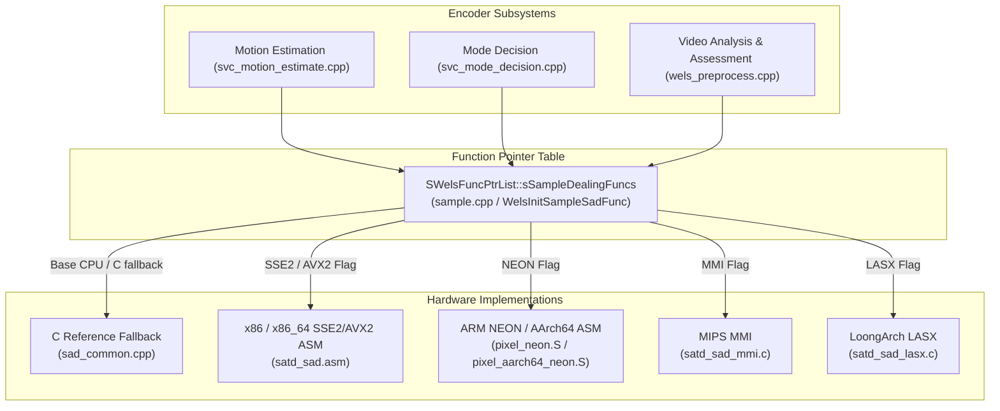
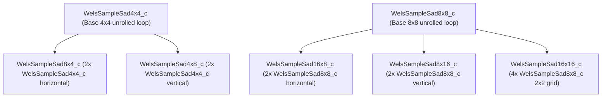
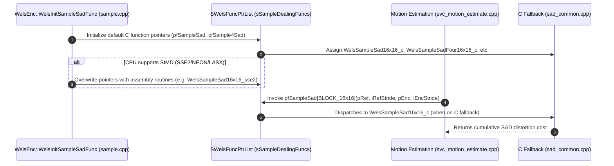

# Literate Programming: Sum of Absolute Differences Reference Implementation (`codec/common/src/sad_common.cpp`)

This document provides a comprehensive, literate-programming-style analysis of the platform-independent C reference implementation of the **Sum of Absolute Differences (SAD)** distortion calculation kernels in OpenH264, located at [`codec/common/src/sad_common.cpp`](openh264/codec/common/src/sad_common.cpp).

---

## Table of Contents
1. [Module Overview & Architectural Context](#1-module-overview--architectural-context)
2. [Mathematical Definition & Block Hierarchy](#2-mathematical-definition--block-hierarchy)
3. [Macros, Data Structures, & Type Definitions](#3-macros-data-structures--type-definitions)
4. [Function Deep Dive: Single-Candidate SAD Functions](#4-function-deep-dive-single-candidate-sad-functions)
   - [4.1 WelsSampleSad4x4_c](#41-welssamplesad4x4_c)
   - [4.2 WelsSampleSad8x4_c](#42-welssamplesad8x4_c)
   - [4.3 WelsSampleSad4x8_c](#43-welssamplesad4x8_c)
   - [4.4 WelsSampleSad8x8_c](#44-welssamplesad8x8_c)
   - [4.5 WelsSampleSad16x8_c](#45-welssamplesad16x8_c)
   - [4.6 WelsSampleSad8x16_c](#46-welssamplesad8x16_c)
   - [4.7 WelsSampleSad16x16_c](#47-welssamplesad16x16_c)
5. [Function Deep Dive: 4-Point Directional Search SAD Functions](#5-function-deep-dive-4-point-directional-search-sad-functions)
   - [5.1 WelsSampleSadFour16x16_c](#51-welssamplesadfour16x16_c)
   - [5.2 WelsSampleSadFour16x8_c](#52-welssamplesadfour16x8_c)
   - [5.3 WelsSampleSadFour8x16_c](#53-welssamplesadfour8x16_c)
   - [5.4 WelsSampleSadFour8x8_c](#54-welssamplesadfour8x8_c)
   - [5.5 WelsSampleSadFour4x4_c](#55-welssamplesadfour4x4_c)
   - [5.6 WelsSampleSadFour8x4_c](#56-welssamplesadfour8x4_c)
   - [5.7 WelsSampleSadFour4x8_c](#57-welssamplesadfour4x8_c)
6. [Hardware SIMD Specialization & Dispatch Architecture](#6-hardware-simd-specialization--dispatch-architecture)
7. [Call Graph & Interaction Matrix](#7-call-graph--interaction-matrix)

---

## 1. Module Overview & Architectural Context

In video compression algorithms conforming to ITU-T H.264 / ISO/IEC 14496-10 (AVC), the **Sum of Absolute Differences (SAD)** is the fundamental distortion metric used during **Motion Estimation (ME)**, **Mode Decision (MD)**, and **Video Analysis & Assessment (VAA)**.

The source file [`codec/common/src/sad_common.cpp`](openh264/codec/common/src/sad_common.cpp) provides the clean, bit-exact, portable C reference implementations for all standard H.264 block partition sizes ($16\times16$, $16\times8$, $8\times16$, $8\times8$, $8\times4$, $4\times8$, and $4\times4$) as well as 4-point composite directional search functions.



### Key Architectural Characteristics
1. **Platform Independence**: Contains zero assembly code or compiler-specific intrinsics, ensuring OpenH264 can compile and run correctly on any target CPU architecture.
2. **Hierarchical Block Composition**: Larger rectangular and square block partitions are built out of optimized compositions of fundamental base kernels ($4\times4$ and $8\times8$), maximizing instruction cache locality and algorithmic reuse.
3. **Motion Search Acceleration**: Supplies specialized `Four` variants (`WelsSampleSadFour*`) that calculate 4 neighboring diamond/cross search offsets (Up, Down, Left, Right) in a single invocation, enabling vectorization and cache reuse in motion estimation loops.

---

## 2. Mathematical Definition & Block Hierarchy

### 2.1 The SAD Formulation

Given two 2D sample matrices $S_1$ (original/target block) and $S_2$ (reference/prediction block) of dimensions $W \times H$:

$$\text{SAD}(W, H) = \sum_{y=0}^{H-1} \sum_{x=0}^{W-1} \left| S_1(x, y \cdot \text{stride}_1) - S_2(x, y \cdot \text{stride}_2) \right|$$

Where:
* $S_1(x, y) \in [0, 255]$: 8-bit unsigned integer pixel luminance or chrominance sample.
* $\text{stride}_1$: Memory pitch (in bytes) between successive rows in the source image buffer.
* $\text{stride}_2$: Memory pitch (in bytes) between successive rows in the reference image buffer.

### 2.2 Hierarchical Block Composition Graph

OpenH264 structures the C reference SAD implementations hierarchically:



---

## 3. Macros, Data Structures, & Type Definitions

The implementation relies on shared headers [`sad_common.h`](openh264/codec/common/inc/sad_common.h) and [`macros.h`](openh264/codec/common/inc/macros.h).

### 3.1 The `WELS_ABS` Macro

Defined in [`codec/common/inc/macros.h`](openh264/codec/common/inc/macros.h#L194-L200):

```cpp
#ifndef WELS_ABS
#define WELS_ABS(iX) ((iX)>0 ? (iX) : -(iX))
#endif
```

* **Inputs**: Signed integer difference `(pSrc1[x] - pSrc2[x])` with value range $[-255, 255]$.
* **Return**: Non-negative integer $|iX| \in [0, 255]$.

### 3.2 Block Partition Identifiers (`EBlockType`)

The block sizes supported by the SAD kernel table are indexed in [`codec/common/inc/wels_func_ptr_def.h`](openh264/codec/common/inc/wels_func_ptr_def.h):

| Enumeration / Index | Block Dimensions ($W \times H$) | Macroblock Sub-partition Context |
| :--- | :--- | :--- |
| `BLOCK_16x16` | $16 \times 16$ | Full Macroblock (Inter 16x16 / Intra 16x16) |
| `BLOCK_16x8` | $16 \times 8$ | Horizontal Sub-macroblock partition |
| `BLOCK_8x16` | $8 \times 16$ | Vertical Sub-macroblock partition |
| `BLOCK_8x8` | $8 \times 8$ | P8x8 Sub-macroblock partition / Chroma block |
| `BLOCK_4x4` | $4 \times 4$ | Sub-partition 4x4 / Intra 4x4 block |
| `BLOCK_8x4` | $8 \times 4$ | P8x4 Sub-macroblock partition |
| `BLOCK_4x8` | $4 \times 8$ | P4x8 Sub-macroblock partition |

### 3.3 Function Pointer Declarations

Declared in [`codec/common/inc/sad_common.h`](openh264/codec/common/inc/sad_common.h#L40-L56):

```cpp
typedef int32_t (*PFunctionSampleSad)(uint8_t* pSample1, int32_t iStride1, uint8_t* pSample2, int32_t iStride2);
typedef void (*PFunctionSample4Sad)(uint8_t* iSample1, int32_t iStride1, uint8_t* iSample2, int32_t iStride2, int32_t* pSad);
```

---

## 4. Function Deep Dive: Single-Candidate SAD Functions

### 4.1 `WelsSampleSad4x4_c`

```cpp
int32_t WelsSampleSad4x4_c (uint8_t* pSample1, int32_t iStride1, uint8_t* pSample2, int32_t iStride2)
```

[sad_common.cpp:L44-L60](openh264/codec/common/src/sad_common.cpp#L44-L60)

#### Architectural Role & Algorithm
Computes the SAD for a fundamental $4\times4$ pixel block. This is the atomic building block for $4\times8$ and $8\times4$ partition metrics.

#### Mathematical Specification
$$\text{SAD}_{4\times4} = \sum_{y=0}^{3} \sum_{x=0}^{3} |pSample1[x + y \cdot iStride1] - pSample2[x + y \cdot iStride2]|$$

#### Implementation Details
* Loop unrolls 4 rows ($y = 0 \dots 3$).
* In each row, all 4 pixel difference magnitudes are accumulated:
  ```cpp
  iSadSum += WELS_ABS((pSrc1[0] - pSrc2[0]));
  iSadSum += WELS_ABS((pSrc1[1] - pSrc2[1]));
  iSadSum += WELS_ABS((pSrc1[2] - pSrc2[2]));
  iSadSum += WELS_ABS((pSrc1[3] - pSrc2[3]));
  ```
* Row pointers advance by their respective strides: `pSrc1 += iStride1`, `pSrc2 += iStride2`.

#### Complexity & Return Value
* **Time Complexity**: $\mathcal{O}(1)$ (fixed 16 absolute differences).
* **Return Value**: `int32_t` cumulative absolute error $\in [0, 16 \times 255 = 4080]$.

---

### 4.2 `WelsSampleSad8x4_c`

```cpp
int32_t WelsSampleSad8x4_c (uint8_t* pSample1, int32_t iStride1, uint8_t* pSample2, int32_t iStride2)
```

[sad_common.cpp:L62-L67](openh264/codec/common/src/sad_common.cpp#L62-L67)

#### Architectural Role & Algorithm
Computes the SAD for an $8\times4$ block partition (width 8, height 4) by decomposing it into two horizontally adjacent $4\times4$ blocks:

$$\text{SAD}_{8\times4} = \text{SAD}_{4\times4}(pSample1, pSample2) + \text{SAD}_{4\times4}(pSample1 + 4, pSample2 + 4)$$

```
Offset Diagram (8x4 Block):
+--------------------+--------------------+
| 4x4 Left (Base)    | 4x4 Right (+4)     |
+--------------------+--------------------+
```

---

### 4.3 `WelsSampleSad4x8_c`

```cpp
int32_t WelsSampleSad4x8_c (uint8_t* pSample1, int32_t iStride1, uint8_t* pSample2, int32_t iStride2)
```

[sad_common.cpp:L69-L74](openh264/codec/common/src/sad_common.cpp#L69-L74)

#### Architectural Role & Algorithm
Computes the SAD for a $4\times8$ block partition (width 4, height 8) by decomposing it into two vertically stacked $4\times4$ blocks:

$$\text{SAD}_{4\times8} = \text{SAD}_{4\times4}(pSample1, pSample2) + \text{SAD}_{4\times4}(pSample1 + (iStride1 \ll 2), pSample2 + (iStride2 \ll 2))$$

> [!NOTE]
> The bit shift `iStride << 2` is equivalent to multiplying the stride by 4 (`iStride * 4`), cleanly stepping down 4 rows in memory.

---

### 4.4 `WelsSampleSad8x8_c`

```cpp
int32_t WelsSampleSad8x8_c (uint8_t* pSample1, int32_t iStride1, uint8_t* pSample2, int32_t iStride2)
```

[sad_common.cpp:L76-L96](openh264/codec/common/src/sad_common.cpp#L76-L96)

#### Architectural Role & Algorithm
Computes the SAD for an $8\times8$ sub-macroblock or chroma block. Implemented with a direct unrolled 8-row loop to maximize performance without function call overhead.

#### Mathematical Specification
$$\text{SAD}_{8\times8} = \sum_{y=0}^{7} \sum_{x=0}^{7} |pSample1[x + y \cdot iStride1] - pSample2[x + y \cdot iStride2]|$$

#### Implementation Details
Across 8 rows (`i = 0 ... 7`), all 8 column samples (`x = 0 ... 7`) are accumulated in a single scalar loop:
```cpp
for (i = 0; i < 8; i++) {
  iSadSum += WELS_ABS ((pSrc1[0] - pSrc2[0]));
  iSadSum += WELS_ABS ((pSrc1[1] - pSrc2[1]));
  ...
  iSadSum += WELS_ABS ((pSrc1[7] - pSrc2[7]));
  pSrc1 += iStride1;
  pSrc2 += iStride2;
}
```
* **Return Value**: `int32_t` cumulative error $\in [0, 64 \times 255 = 16320]$.

---

### 4.5 `WelsSampleSad16x8_c`

```cpp
int32_t WelsSampleSad16x8_c (uint8_t* pSample1, int32_t iStride1, uint8_t* pSample2, int32_t iStride2)
```

[sad_common.cpp:L97-L104](openh264/codec/common/src/sad_common.cpp#L97-L104)

#### Architectural Role & Algorithm
Computes the SAD for a $16\times8$ macroblock partition (two stacked horizontal halves) by summing two horizontally adjacent $8\times8$ blocks:

$$\text{SAD}_{16\times8} = \text{SAD}_{8\times8}(pSample1, pSample2) + \text{SAD}_{8\times8}(pSample1 + 8, pSample2 + 8)$$

---

### 4.6 `WelsSampleSad8x16_c`

```cpp
int32_t WelsSampleSad8x16_c (uint8_t* pSample1, int32_t iStride1, uint8_t* pSample2, int32_t iStride2)
```

[sad_common.cpp:L105-L111](openh264/codec/common/src/sad_common.cpp#L105-L111)

#### Architectural Role & Algorithm
Computes the SAD for an $8\times16$ macroblock partition (two side-by-side vertical halves) by summing two vertically stacked $8\times8$ blocks:

$$\text{SAD}_{8\times16} = \text{SAD}_{8\times8}(pSample1, pSample2) + \text{SAD}_{8\times8}(pSample1 + (iStride1 \ll 3), pSample2 + (iStride2 \ll 3))$$

> [!NOTE]
> The bit shift `iStride << 3` computes `iStride * 8`, stepping down 8 rows to the lower $8\times8$ block.

---

### 4.7 `WelsSampleSad16x16_c`

```cpp
int32_t WelsSampleSad16x16_c (uint8_t* pSample1, int32_t iStride1, uint8_t* pSample2, int32_t iStride2)
```

[sad_common.cpp:L112-L120](openh264/codec/common/src/sad_common.cpp#L112-L120)

#### Architectural Role & Algorithm
Computes the SAD for a full $16\times16$ Macroblock. Decomposes the macroblock into a $2\times2$ grid of four $8\times8$ blocks:

$$\begin{aligned}
\text{SAD}_{16\times16} &= \text{SAD}_{8\times8}(p_1, p_2) \\
&+ \text{SAD}_{8\times8}(p_1 + 8, p_2 + 8) \\
&+ \text{SAD}_{8\times8}(p_1 + (s_1 \ll 3), p_2 + (s_2 \ll 3)) \\
&+ \text{SAD}_{8\times8}(p_1 + (s_1 \ll 3) + 8, p_2 + (s_2 \ll 3) + 8)
\end{aligned}$$

```
Quadrant Decomposition (16x16 Macroblock):
+------------------------------+------------------------------+
| Top-Left:                    | Top-Right:                   |
| SAD8x8(p1, p2)               | SAD8x8(p1+8, p2+8)           |
+------------------------------+------------------------------+
| Bottom-Left:                 | Bottom-Right:                |
| SAD8x8(p1 + s1*8, p2 + s2*8) | SAD8x8(p1+s1*8+8, p2+s2*8+8) |
+------------------------------+------------------------------+
```

* **Return Value**: `int32_t` cumulative error $\in [0, 256 \times 255 = 65280]$.

---

## 5. Function Deep Dive: 4-Point Directional Search SAD Functions

During fast integer-pel Motion Estimation (such as Diamond Search or Cross Search in [`svc_motion_estimate.cpp`](openh264/codec/encoder/core/src/svc_motion_estimate.cpp)), the encoder evaluates candidate motion vectors at 4 orthogonal offsets surrounding the current center $(x, y)$:

```
           Up [0]: (x, y - 1)  -->  iSample2 - iStride2
                           ^
                           |
Left [2]: (x - 1, y) <-- Center --> Right [3]: (x + 1, y)
    iSample2 - 1           |           iSample2 + 1
                           v
          Down [1]: (x, y + 1) -->  iSample2 + iStride2
```

The `WelsSampleSadFour*` family evaluates all 4 candidates in a single function call, storing the resulting SAD values into an output array `pSad[4]`.

```cpp
pSad[0] = Top / Up Neighbor     (offset: -iStride2)
pSad[1] = Bottom / Down Neighbor (offset: +iStride2)
pSad[2] = Left Neighbor         (offset: -1)
pSad[3] = Right Neighbor        (offset: +1)
```

---

### 5.1 `WelsSampleSadFour16x16_c`

```cpp
void WelsSampleSadFour16x16_c (uint8_t* iSample1, int32_t iStride1, uint8_t* iSample2, int32_t iStride2, int32_t* pSad)
```

[sad_common.cpp:L122-L128](openh264/codec/common/src/sad_common.cpp#L122-L128)

* **Target Partition**: Full $16\times16$ Macroblock.
* **Output**:
  ```cpp
  pSad[0] = WelsSampleSad16x16_c(iSample1, iStride1, iSample2 - iStride2, iStride2);
  pSad[1] = WelsSampleSad16x16_c(iSample1, iStride1, iSample2 + iStride2, iStride2);
  pSad[2] = WelsSampleSad16x16_c(iSample1, iStride1, iSample2 - 1,        iStride2);
  pSad[3] = WelsSampleSad16x16_c(iSample1, iStride1, iSample2 + 1,        iStride2);
  ```

---

### 5.2 `WelsSampleSadFour16x8_c`

```cpp
void WelsSampleSadFour16x8_c (uint8_t* iSample1, int32_t iStride1, uint8_t* iSample2, int32_t iStride2, int32_t* pSad)
```

[sad_common.cpp:L129-L134](openh264/codec/common/src/sad_common.cpp#L129-L134)

* **Target Partition**: $16\times8$ partition. Calls [`WelsSampleSad16x8_c`](#45-welssamplesad16x8_c) for each of the 4 directional offsets.

---

### 5.3 `WelsSampleSadFour8x16_c`

```cpp
void WelsSampleSadFour8x16_c (uint8_t* iSample1, int32_t iStride1, uint8_t* iSample2, int32_t iStride2, int32_t* pSad)
```

[sad_common.cpp:L135-L141](openh264/codec/common/src/sad_common.cpp#L135-L141)

* **Target Partition**: $8\times16$ partition. Calls [`WelsSampleSad8x16_c`](#46-welssamplesad8x16_c) for each of the 4 directional offsets.

---

### 5.4 `WelsSampleSadFour8x8_c`

```cpp
void WelsSampleSadFour8x8_c (uint8_t* iSample1, int32_t iStride1, uint8_t* iSample2, int32_t iStride2, int32_t* pSad)
```

[sad_common.cpp:L142-L147](openh264/codec/common/src/sad_common.cpp#L142-L147)

* **Target Partition**: $8\times8$ partition. Calls [`WelsSampleSad8x8_c`](#44-welssamplesad8x8_c) for each of the 4 directional offsets.

---

### 5.5 `WelsSampleSadFour4x4_c`

```cpp
void WelsSampleSadFour4x4_c (uint8_t* iSample1, int32_t iStride1, uint8_t* iSample2, int32_t iStride2, int32_t* pSad)
```

[sad_common.cpp:L148-L153](openh264/codec/common/src/sad_common.cpp#L148-L153)

* **Target Partition**: $4\times4$ partition. Calls [`WelsSampleSad4x4_c`](#41-welssamplesad4x4_c) for each of the 4 directional offsets.

---

### 5.6 `WelsSampleSadFour8x4_c`

```cpp
void WelsSampleSadFour8x4_c (uint8_t* iSample1, int32_t iStride1, uint8_t* iSample2, int32_t iStride2, int32_t* pSad)
```

[sad_common.cpp:L154-L159](openh264/codec/common/src/sad_common.cpp#L154-L159)

* **Target Partition**: $8\times4$ partition. Calls [`WelsSampleSad8x4_c`](#42-welssamplesad8x4_c) for each of the 4 directional offsets.

---

### 5.7 `WelsSampleSadFour4x8_c`

```cpp
void WelsSampleSadFour4x8_c (uint8_t* iSample1, int32_t iStride1, uint8_t* iSample2, int32_t iStride2, int32_t* pSad)
```

[sad_common.cpp:L160-L165](openh264/codec/common/src/sad_common.cpp#L160-L165)

* **Target Partition**: $4\times8$ partition. Calls [`WelsSampleSad4x8_c`](#43-welssamplesad4x8_c) for each of the 4 directional offsets.

---

## 6. Hardware SIMD Specialization & Dispatch Architecture

During encoder initialization in [`WelsInitSampleSadFunc`](openh264/codec/encoder/core/src/sample.cpp#L336-L516), the function pointer table `sSampleDealingFuncs` is first populated with the C reference routines from [`sad_common.cpp`](openh264/codec/common/src/sad_common.cpp). If hardware SIMD extensions are detected at runtime via `uiCpuFlag`, the function pointers are dynamically overridden with high-performance vector assembly routines.

| Partition Size | C Reference (`sad_common.cpp`) | x86 SSE2 / AVX2 (`satd_sad.asm`) | ARM NEON (`pixel_neon.S`) | AArch64 NEON (`pixel_aarch64_neon.S`) |
| :--- | :--- | :--- | :--- | :--- |
| **$16\times16$** | `WelsSampleSad16x16_c` | `WelsSampleSad16x16_sse2` | `WelsSampleSad16x16_neon` | `WelsSampleSad16x16_AArch64_neon` |
| **$16\times8$** | `WelsSampleSad16x8_c` | `WelsSampleSad16x8_sse2` | `WelsSampleSad16x8_neon` | `WelsSampleSad16x8_AArch64_neon` |
| **$8\times16$** | `WelsSampleSad8x16_c` | `WelsSampleSad8x16_sse2` | `WelsSampleSad8x16_neon` | `WelsSampleSad8x16_AArch64_neon` |
| **$8\times8$** | `WelsSampleSad8x8_c` | `WelsSampleSad8x8_sse21` | `WelsSampleSad8x8_neon` | `WelsSampleSad8x8_AArch64_neon` |
| **$4\times4$** | `WelsSampleSad4x4_c` | `WelsSampleSad4x4_mmx` | `WelsSampleSad4x4_neon` | `WelsSampleSad4x4_AArch64_neon` |
| **Four $16\times16$** | `WelsSampleSadFour16x16_c` | `WelsSampleSadFour16x16_sse2` | `WelsSampleSadFour16x16_neon` | `WelsSampleSadFour16x16_AArch64_neon` |
| **Four $16\times8$** | `WelsSampleSadFour16x8_c` | `WelsSampleSadFour16x8_sse2` | `WelsSampleSadFour16x8_neon` | `WelsSampleSadFour16x8_AArch64_neon` |
| **Four $8\times16$** | `WelsSampleSadFour8x16_c` | `WelsSampleSadFour8x16_sse2` | `WelsSampleSadFour8x16_neon` | `WelsSampleSadFour8x16_AArch64_neon` |
| **Four $8\times8$** | `WelsSampleSadFour8x8_c` | `WelsSampleSadFour8x8_sse2` | `WelsSampleSadFour8x8_neon` | `WelsSampleSadFour8x8_AArch64_neon` |
| **Four $4\times4$** | `WelsSampleSadFour4x4_c` | `WelsSampleSadFour4x4_sse2` | `WelsSampleSadFour4x4_neon` | `WelsSampleSadFour4x4_AArch64_neon` |

---

## 7. Call Graph & Interaction Matrix



### Direct Callers in Codebase
* **Motion Estimation**: Evaluated in [`codec/encoder/core/src/svc_motion_estimate.cpp`](openh264/codec/encoder/core/src/svc_motion_estimate.cpp) during diamond search, cross search, and full search loops to determine optimal motion vectors.
* **Complexity Analysis**: Evaluated in [`codec/processing/src/complexityanalysis/ComplexityAnalysis.cpp`](openh264/codec/processing/src/complexityanalysis/ComplexityAnalysis.cpp) for frame-level motion complexity and scene change detection.
* **Unit Testing**: Thoroughly validated against assembly implementations for bit-exactness in [`test/encoder/EncUT_Sample.cpp`](openh264/test/encoder/EncUT_Sample.cpp).
