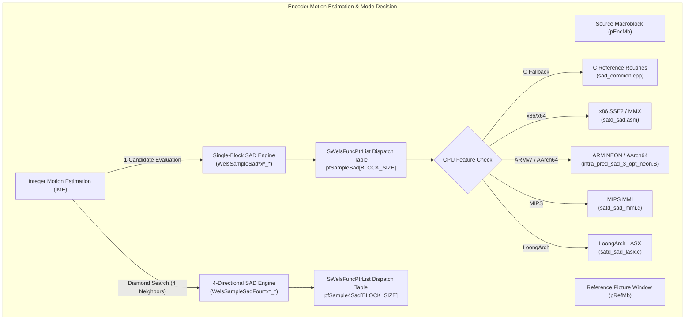
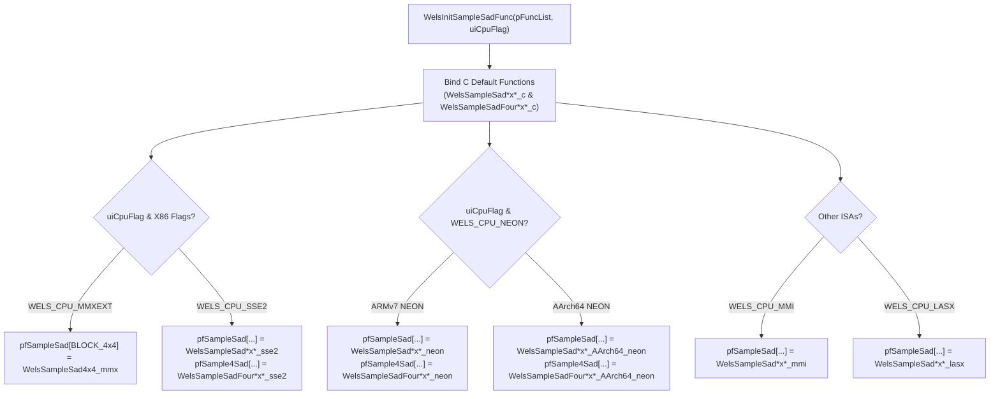

# Literate Documentation: `codec/common/inc/sad_common.h`

This document provides a comprehensive, literate-programming-style technical reference for [`codec/common/inc/sad_common.h`](openh264/codec/common/inc/sad_common.h). It details the mathematical foundations, block geometry partitions, baseline C implementations, multi-target SIMD assembly optimizations, preprocessor configuration flags, and runtime function-pointer dispatch tables for the Sum of Absolute Differences (SAD) distortion calculation engine in OpenH264.

---

## Table of Contents

1. [Architectural Overview & Module Purpose](#1-architectural-overview--module-purpose)
2. [Mathematical Foundations of SAD & 4-Directional Diamond SAD](#2-mathematical-foundations-of-sad--4-directional-diamond-sad)
3. [Type Definitions, Macros & Header Layout](#3-type-definitions-macros--header-layout)
4. [Standard C Reference Implementations (Single-Block SAD)](#4-standard-c-reference-implementations-single-block-sad)
5. [Standard C Reference Implementations (4-Directional Diamond SAD)](#5-standard-c-reference-implementations-4-directional-diamond-sad)
6. [Hardware Acceleration & SIMD Implementations](#6-hardware-acceleration--simd-implementations)
   - [6.1 x86 & x86-64 SIMD (MMX & SSE2)](#61-x86--x86-64-simd-mmx--sse2)
   - [6.2 ARMv7 32-bit NEON](#62-armv7-32-bit-neon)
   - [6.3 ARM64 / AArch64 NEON](#63-arm64--aarch64-neon)
   - [6.4 MIPS MMI (MultiMedia Instructions)](#64-mips-mmi-multimedia-instructions)
   - [6.5 LoongArch LASX (256-bit Vector Extension)](#65-loongarch-lasx-256-bit-vector-extension)
7. [Runtime Initialization & Function Pointer Dispatch Mapping](#7-runtime-initialization--function-pointer-dispatch-mapping)
8. [Call Graph & Code Interactions](#8-call-graph--code-interactions)

---

## 1. Architectural Overview & Module Purpose

In video compression algorithms adhering to the H.264 / MPEG-4 AVC standard, **Sum of Absolute Differences (SAD)** serves as the fundamental, compute-intensive block distortion metric. It is invoked millions of times per encoded video frame during:

1. **Integer Motion Estimation (IME)**: Searching for the best displacement motion vector $(\Delta x, \Delta y)$ within a reference picture search window.
2. **Fast Diamond Search (`ME_DIA`)**: Simultaneously computing distortion costs across four neighboring orthogonal search candidates (Top, Bottom, Left, Right).
3. **Macroblock Mode Decision (MD)**: Evaluating partition candidates ($16\times 16$, $16\times 8$, $8\times 16$, $8\times 8$, $8\times 4$, $4\times 8$, $4\times 4$) to balance rate-distortion efficiency against computation time.
4. **Video Analysis & Assessment (VAA)**: Measuring spatial and temporal complexity metrics for scene change detection and background static macroblock skipping.



The header [`codec/common/inc/sad_common.h`](openh264/codec/common/inc/sad_common.h) declares the C baseline functions and the external architecture-specific assembly prototypes that implement these SAD calculation kernels across all standard H.264 macroblock and sub-macroblock partition sizes.

---

## 2. Mathematical Foundations of SAD & 4-Directional Diamond SAD

### 2.1 Single-Block 2D SAD

Given two 2D pixel blocks $S_1$ (source block) and $S_2$ (reference candidate block) of width $W$ and height $H$, with horizontal memory strides $I_1$ (`iStride1`) and $I_2$ (`iStride2`), the Sum of Absolute Differences is defined as:

$$\text{SAD}(S_1, S_2, W, H, I_1, I_2) = \sum_{y=0}^{H-1} \sum_{x=0}^{W-1} \left| S_1[y \cdot I_1 + x] - S_2[y \cdot I_2 + x] \right|$$

Where:
- $S_1[y \cdot I_1 + x] \in [0, 255]$ is the unsigned 8-bit luma/chroma sample at row $y$, column $x$ of the current encoding block.
- $S_2[y \cdot I_2 + x] \in [0, 255]$ is the corresponding sample in the reference picture buffer.
- The return value is bounded by $[0, W \cdot H \cdot 255]$, which fits inside a standard signed 32-bit integer (`int32_t`). For the largest block ($16 \times 16 = 256$ pixels), $\text{SAD}_{\max} = 256 \times 255 = 65{,}280 \ll 2^{31}-1$.

### 2.2 4-Directional Diamond SAD (`SampleSadFour`)

During iterative diamond integer motion search (`ME_DIA`), the encoder evaluates four adjacent reference candidate blocks offset by $\pm 1$ pixel horizontally and $\pm 1$ pixel vertically from a central reference pointer `pSample2`.

Rather than executing four distinct function calls—which introduces repeated subroutine call overhead and prevents vector register caching of the source block $S_1$—OpenH264 utilizes the `SampleSadFour` kernel family. Given a center reference base pointer $S_2$, it computes four SAD values simultaneously and writes them into an output array `pSad[4]`:

$$\begin{aligned}
pSad[0] &= \text{SAD}\Big(S_1, \; S_2 - I_2, \; W, \; H\Big) \quad &&\text{[Top / Up Neighbor: } (x, y - 1)\text{]} \\
pSad[1] &= \text{SAD}\Big(S_1, \; S_2 + I_2, \; W, \; H\Big) \quad &&\text{[Bottom / Down Neighbor: } (x, y + 1)\text{]} \\
pSad[2] &= \text{SAD}\Big(S_1, \; S_2 - 1, \; W, \; H\Big) \quad &&\text{[Left Neighbor: } (x - 1, y)\text{]} \\
pSad[3] &= \text{SAD}\Big(S_1, \; S_2 + 1, \; W, \; H\Big) \quad &&\text{[Right Neighbor: } (x + 1, y)\text{]}
\end{aligned}$$

```
                [Top Candidate: S2 - iStride2]
                            pSad[0]
                               │
                               │
 [Left Candidate: S2 - 1] ─── (S2) ─── [Right Candidate: S2 + 1]
         pSad[2]               │               pSad[3]
                               │
               [Bottom Candidate: S2 + iStride2]
                            pSad[1]
```

---

## 3. Type Definitions, Macros & Header Layout

### 3.1 Header Guards & Inclusions

```c
#ifndef WELS_SAD_COMMON_H_
#define WELS_SAD_COMMON_H_

#include "typedefs.h"
```

- **Header Guard**: `WELS_SAD_COMMON_H_` prevents multiple inclusion errors.
- **Includes**: [`typedefs.h`](openh264/codec/common/inc/typedefs.h) imports standard integer primitive types:
  - `uint8_t`: Unsigned 8-bit integer (pixel sample values $0 \dots 255$).
  - `int32_t`: Signed 32-bit integer (strides, SAD distortion sums, coordinates).
  - `uint32_t`: Unsigned 32-bit integer (CPU feature flags).

### 3.2 C++ Linkage Wrapper

```c
#if defined(__cplusplus)
extern "C" {
#endif//__cplusplus
```

All assembly and C functions are enclosed in an `extern "C"` block when compiled with a C++ compiler to disable C++ name mangling, ensuring binary compatibility with NASM/GAS assembly symbols.

### 3.3 Function Pointer Typedefs & Block Partition Enums

In [`codec/encoder/core/inc/wels_func_ptr_def.h`](openh264/codec/encoder/core/inc/wels_func_ptr_def.h#L160-L166), the function signatures declared in `sad_common.h` correspond to the following function pointer types:

```c
typedef int32_t (*PSampleSadSatdCostFunc) (uint8_t* pSample1, int32_t iStride1, uint8_t* pSample2, int32_t iStride2);
typedef void    (*PSample4SadCostFunc)    (uint8_t* pSample1, int32_t iStride1, uint8_t* pSample2, int32_t iStride2, int32_t* pSad);
```

These function pointers are indexed by the macroblock partition size enumeration `Sub_Block_Multiple_T`:

| Enum Symbol | Partition Size ($W \times H$) | Typical Usage in H.264 |
| :--- | :--- | :--- |
| `BLOCK_16x16` | $16 \times 16$ | Standard luma macroblock |
| `BLOCK_16x8`  | $16 \times 8$  | Inter macroblock partition |
| `BLOCK_8x16`  | $8 \times 16$  | Inter macroblock partition |
| `BLOCK_8x8`   | $8 \times 8$   | $8\times 8$ sub-partition / Chroma block |
| `BLOCK_8x4`   | $8 \times 4$   | Sub-macroblock partition |
| `BLOCK_4x8`   | $4 \times 8$   | Sub-macroblock partition |
| `BLOCK_4x4`   | $4 \times 4$   | Smallest sub-macroblock partition |

---

## 4. Standard C Reference Implementations (Single-Block SAD)

The baseline C implementations are defined in [`codec/common/src/sad_common.cpp`](openh264/codec/common/src/sad_common.cpp).

### 4.1 Function Prototypes

```c
int32_t WelsSampleSad16x16_c (uint8_t*, int32_t, uint8_t*, int32_t);
int32_t WelsSampleSad16x8_c  (uint8_t*, int32_t, uint8_t*, int32_t);
int32_t WelsSampleSad8x16_c  (uint8_t*, int32_t, uint8_t*, int32_t);
int32_t WelsSampleSad8x8_c   (uint8_t*, int32_t, uint8_t*, int32_t);
int32_t WelsSampleSad8x4_c   (uint8_t*, int32_t, uint8_t*, int32_t);
int32_t WelsSampleSad4x8_c   (uint8_t*, int32_t, uint8_t*, int32_t);
int32_t WelsSampleSad4x4_c   (uint8_t*, int32_t, uint8_t*, int32_t);
```

### 4.2 Parameter Specifications

All single-block SAD functions share identical parameter conventions:

| Parameter | Type | Direction | Description |
| :--- | :--- | :--- | :--- |
| `pSample1` | `uint8_t*` | Input | Pointer to the top-left pixel of the first block (source/encoding frame). |
| `iStride1` | `int32_t`  | Input | Line stride (bytes per row) of the first block buffer. |
| `pSample2` | `uint8_t*` | Input | Pointer to the top-left pixel of the second block (reference picture). |
| `iStride2` | `int32_t`  | Input | Line stride (bytes per row) of the second block buffer. |
| **Return** | `int32_t`  | Output | Accumulated Sum of Absolute Differences ($0 \le \text{SAD} \le 65{,}280$). |

---

### 4.3 Detailed Function Breakdown

#### 1. [`WelsSampleSad4x4_c`](openh264/codec/common/src/sad_common.cpp#L44-L60)

* **Partition**: $4 \times 4$ pixels (16 samples total).
* **Algorithm**: Unrolls 4 pixel differences per row across 4 vertical iterations.
* **Implementation Details**:
  ```cpp
  int32_t WelsSampleSad4x4_c (uint8_t* pSample1, int32_t iStride1, uint8_t* pSample2, int32_t iStride2) {
    int32_t iSadSum = 0;
    uint8_t* pSrc1 = pSample1;
    uint8_t* pSrc2 = pSample2;
    for (int32_t i = 0; i < 4; i++) {
      iSadSum += WELS_ABS(pSrc1[0] - pSrc2[0]);
      iSadSum += WELS_ABS(pSrc1[1] - pSrc2[1]);
      iSadSum += WELS_ABS(pSrc1[2] - pSrc2[2]);
      iSadSum += WELS_ABS(pSrc1[3] - pSrc2[3]);
      pSrc1 += iStride1;
      pSrc2 += iStride2;
    }
    return iSadSum;
  }
  ```

#### 2. [`WelsSampleSad8x4_c`](openh264/codec/common/src/sad_common.cpp#L62-L67) & [`WelsSampleSad4x8_c`](openh264/codec/common/src/sad_common.cpp#L69-L74)

* **Partition**: $8 \times 4$ and $4 \times 8$ pixels (32 samples total).
* **Composition**: Implemented hierarchically by summing two adjacent $4 \times 4$ blocks:
  - $8 \times 4$: Left $4\times 4$ block at `pSample1` + Right $4\times 4$ block at `pSample1 + 4`.
  - $4 \times 8$: Top $4\times 4$ block at `pSample1` + Bottom $4\times 4$ block at `pSample1 + (iStride1 << 2)`.

#### 3. [`WelsSampleSad8x8_c`](openh264/codec/common/src/sad_common.cpp#L76-L96)

* **Partition**: $8 \times 8$ pixels (64 samples total).
* **Algorithm**: Loops over 8 rows, accumulating absolute differences for columns $0 \dots 7$ on each row.

#### 4. [`WelsSampleSad16x8_c`](openh264/codec/common/src/sad_common.cpp#L97-L104) & [`WelsSampleSad8x16_c`](openh264/codec/common/src/sad_common.cpp#L105-L111)

* **Partition**: $16 \times 8$ and $8 \times 16$ pixels (128 samples total).
* **Composition**: Hierarchically sums two $8 \times 8$ blocks:
  - $16 \times 8$: `WelsSampleSad8x8_c(pSample1)` + `WelsSampleSad8x8_c(pSample1 + 8)`.
  - $8 \times 16$: `WelsSampleSad8x8_c(pSample1)` + `WelsSampleSad8x8_c(pSample1 + (iStride1 << 3))`.

#### 5. [`WelsSampleSad16x16_c`](openh264/codec/common/src/sad_common.cpp#L112-L120)

* **Partition**: $16 \times 16$ pixels (256 samples total).
* **Composition**: Hierarchically combines four $8 \times 8$ quadrants:
  $$\begin{aligned}
  \text{SAD}_{16\times 16} &= \text{SAD}_{8\times 8}(\text{Top-Left: } p_1, p_2) \\
  &+ \text{SAD}_{8\times 8}(\text{Top-Right: } p_1 + 8, p_2 + 8) \\
  &+ \text{SAD}_{8\times 8}(\text{Bottom-Left: } p_1 + 8 \cdot I_1, p_2 + 8 \cdot I_2) \\
  &+ \text{SAD}_{8\times 8}(\text{Bottom-Right: } p_1 + 8 \cdot I_1 + 8, p_2 + 8 \cdot I_2 + 8)
  \end{aligned}$$

---

## 5. Standard C Reference Implementations (4-Directional Diamond SAD)

### 5.1 Function Prototypes

```c
void WelsSampleSadFour16x16_c (uint8_t* iSample1, int32_t iStride1, uint8_t* iSample2, int32_t iStride2, int32_t* pSad);
void WelsSampleSadFour16x8_c  (uint8_t* iSample1, int32_t iStride1, uint8_t* iSample2, int32_t iStride2, int32_t* pSad);
void WelsSampleSadFour8x16_c  (uint8_t* iSample1, int32_t iStride1, uint8_t* iSample2, int32_t iStride2, int32_t* pSad);
void WelsSampleSadFour8x8_c   (uint8_t* iSample1, int32_t iStride1, uint8_t* iSample2, int32_t iStride2, int32_t* pSad);
void WelsSampleSadFour4x4_c   (uint8_t* iSample1, int32_t iStride1, uint8_t* iSample2, int32_t iStride2, int32_t* pSad);
void WelsSampleSadFour8x4_c   (uint8_t* iSample1, int32_t iStride1, uint8_t* iSample2, int32_t iStride2, int32_t* pSad);
void WelsSampleSadFour4x8_c   (uint8_t* iSample1, int32_t iStride1, uint8_t* iSample2, int32_t iStride2, int32_t* pSad);
```

### 5.2 Parameter Specifications & Offset Logic

| Parameter | Type | Direction | Description |
| :--- | :--- | :--- | :--- |
| `iSample1` | `uint8_t*` | Input | Pointer to the source encoding macroblock top-left pixel. |
| `iStride1` | `int32_t`  | Input | Row stride of the source buffer. |
| `iSample2` | `uint8_t*` | Input | Pointer to the center reference candidate top-left pixel. |
| `iStride2` | `int32_t`  | Input | Row stride of the reference buffer. |
| `pSad`     | `int32_t*` | Output | Pointer to an array of 4 `int32_t` elements receiving the 4 calculated SAD costs. |

#### Implementation Structure in [`sad_common.cpp`](openh264/codec/common/src/sad_common.cpp#L122-L165):

```cpp
void WelsSampleSadFour16x16_c (uint8_t* iSample1, int32_t iStride1, uint8_t* iSample2, int32_t iStride2, int32_t* pSad) {
  *(pSad + 0) = WelsSampleSad16x16_c (iSample1, iStride1, iSample2 - iStride2, iStride2); // Top
  *(pSad + 1) = WelsSampleSad16x16_c (iSample1, iStride1, iSample2 + iStride2, iStride2); // Bottom
  *(pSad + 2) = WelsSampleSad16x16_c (iSample1, iStride1, iSample2 - 1,        iStride2); // Left
  *(pSad + 3) = WelsSampleSad16x16_c (iSample1, iStride1, iSample2 + 1,        iStride2); // Right
}
```

---

## 6. Hardware Acceleration & SIMD Implementations

OpenH264 provides optimized assembly implementations for all critical hardware architectures.

```
                                  sad_common.h
                                        │
        ┌──────────────┬────────────────┼──────────────┬──────────────┐
        ▼              ▼                ▼              ▼              ▼
     X86_ASM       HAVE_NEON   HAVE_NEON_AARCH64    HAVE_MMI      HAVE_LASX
   (MMX/SSE2)     (ARMv7 NEON)    (AArch64 NEON)   (MIPS MMI)  (LoongArch LASX)
```

---

### 6.1 x86 & x86-64 SIMD (MMX & SSE2)

Guarded by `#if defined (X86_ASM)`:

```c
#if defined (X86_ASM)
int32_t WelsSampleSad4x4_mmx   (uint8_t*, int32_t, uint8_t*, int32_t);
int32_t WelsSampleSad16x16_sse2(uint8_t*, int32_t, uint8_t*, int32_t);
int32_t WelsSampleSad16x8_sse2 (uint8_t*, int32_t, uint8_t*, int32_t);
int32_t WelsSampleSad8x16_sse2 (uint8_t*, int32_t, uint8_t*, int32_t);
int32_t WelsSampleSad8x8_sse21 (uint8_t*, int32_t, uint8_t*, int32_t);

void WelsSampleSadFour16x16_sse2 (uint8_t*, int32_t, uint8_t*, int32_t, int32_t*);
void WelsSampleSadFour16x8_sse2  (uint8_t*, int32_t, uint8_t*, int32_t, int32_t*);
void WelsSampleSadFour8x16_sse2  (uint8_t*, int32_t, uint8_t*, int32_t, int32_t*);
void WelsSampleSadFour8x8_sse2   (uint8_t*, int32_t, uint8_t*, int32_t, int32_t*);
void WelsSampleSadFour4x4_sse2   (uint8_t*, int32_t, uint8_t*, int32_t, int32_t*);
#endif//X86_ASM
```

#### Assembly Mechanism ([`satd_sad.asm`](openh264/codec/common/x86/satd_sad.asm)):
1. **`PSADBW` (Packed Sum of Absolute Differences of Bytes)**:
   Computes the absolute difference between eight 8-bit unsigned integers from the source and destination registers, sums the differences into unsigned 16-bit words, and writes the result to the lower 16 bits of each 64-bit quadword.
2. **SSE2 Vector Registers (`xmm0`–`xmm7`)**:
   In `WelsSampleSad16x16_sse2`, an entire 16-byte row is loaded via `movdqu`/`movdqa` in a single instruction. `psadbw` computes the 16-byte SAD in one cycle per row, accumulating into a 32-bit register with `paddd`.

---

### 6.2 ARMv7 32-bit NEON

Guarded by `#if defined (HAVE_NEON)`:

```c
#if defined (HAVE_NEON)
int32_t WelsSampleSad4x4_neon  (uint8_t*, int32_t, uint8_t*, int32_t);
int32_t WelsSampleSad16x16_neon(uint8_t*, int32_t, uint8_t*, int32_t);
int32_t WelsSampleSad16x8_neon (uint8_t*, int32_t, uint8_t*, int32_t);
int32_t WelsSampleSad8x16_neon (uint8_t*, int32_t, uint8_t*, int32_t);
int32_t WelsSampleSad8x8_neon  (uint8_t*, int32_t, uint8_t*, int32_t);

void WelsSampleSadFour16x16_neon (uint8_t*, int32_t, uint8_t*, int32_t, int32_t*);
void WelsSampleSadFour16x8_neon  (uint8_t*, int32_t, uint8_t*, int32_t, int32_t*);
void WelsSampleSadFour8x16_neon  (uint8_t*, int32_t, uint8_t*, int32_t, int32_t*);
void WelsSampleSadFour8x8_neon   (uint8_t*, int32_t, uint8_t*, int32_t, int32_t*);
void WelsSampleSadFour4x4_neon   (uint8_t*, int32_t, uint8_t*, int32_t, int32_t*);
#endif
```

#### Assembly Mechanism:
- **`vabd.u8` / `vaba.u8`**: Vector Absolute Difference and Accumulate operating on 8-bit unsigned vector registers (`d0`-`d31` / `q0`-`q15`).
- **`vpadal.u16` / `vaddw.u8`**: Pairwise vector addition widening from 8-bit to 16-bit and accumulating into 32-bit vector accumulators.

---

### 6.3 ARM64 / AArch64 NEON

Guarded by `#if defined (HAVE_NEON_AARCH64) && defined(__aarch64__)`:

```c
#if defined (HAVE_NEON_AARCH64) && defined(__aarch64__)
int32_t WelsSampleSad4x4_AArch64_neon  (uint8_t*, int32_t, uint8_t*, int32_t);
int32_t WelsSampleSad16x16_AArch64_neon(uint8_t*, int32_t, uint8_t*, int32_t);
int32_t WelsSampleSad16x8_AArch64_neon (uint8_t*, int32_t, uint8_t*, int32_t);
int32_t WelsSampleSad8x16_AArch64_neon (uint8_t*, int32_t, uint8_t*, int32_t);
int32_t WelsSampleSad8x8_AArch64_neon  (uint8_t*, int32_t, uint8_t*, int32_t);

void WelsSampleSadFour16x16_AArch64_neon (uint8_t*, int32_t, uint8_t*, int32_t, int32_t*);
void WelsSampleSadFour16x8_AArch64_neon  (uint8_t*, int32_t, uint8_t*, int32_t, int32_t*);
void WelsSampleSadFour8x16_AArch64_neon  (uint8_t*, int32_t, uint8_t*, int32_t, int32_t*);
void WelsSampleSadFour8x8_AArch64_neon   (uint8_t*, int32_t, uint8_t*, int32_t, int32_t*);
void WelsSampleSadFour4x4_AArch64_neon   (uint8_t*, int32_t, uint8_t*, int32_t, int32_t*);
#endif
```

#### Assembly Mechanism:
- Uses 64-bit and 128-bit vector instructions (`uabd`, `uaba`, `uaddlp`) across 32 AArch64 vector registers (`v0`–`v31`).

---

### 6.4 MIPS MMI (MultiMedia Instructions)

Guarded by `#if defined (HAVE_MMI)`:

```c
#if defined (HAVE_MMI)
int32_t WelsSampleSad4x4_mmi   (uint8_t*, int32_t, uint8_t*, int32_t);
int32_t WelsSampleSad16x16_mmi (uint8_t*, int32_t, uint8_t*, int32_t);
int32_t WelsSampleSad16x8_mmi  (uint8_t*, int32_t, uint8_t*, int32_t);
int32_t WelsSampleSad8x16_mmi  (uint8_t*, int32_t, uint8_t*, int32_t);
int32_t WelsSampleSad8x8_mmi   (uint8_t*, int32_t, uint8_t*, int32_t);

void WelsSampleSadFour16x16_mmi (uint8_t*, int32_t, uint8_t*, int32_t, int32_t*);
void WelsSampleSadFour16x8_mmi  (uint8_t*, int32_t, uint8_t*, int32_t, int32_t*);
void WelsSampleSadFour8x16_mmi  (uint8_t*, int32_t, uint8_t*, int32_t, int32_t*);
void WelsSampleSadFour8x8_mmi   (uint8_t*, int32_t, uint8_t*, int32_t, int32_t*);
#endif//HAVE_MMI
```

---

### 6.5 LoongArch LASX (256-bit Vector Extension)

Guarded by `#if defined (HAVE_LASX)`:

```c
#if defined (HAVE_LASX)
int32_t WelsSampleSad4x4_lasx  (uint8_t*, int32_t, uint8_t*, int32_t);
int32_t WelsSampleSad8x8_lasx   (uint8_t*, int32_t, uint8_t*, int32_t);
int32_t WelsSampleSad8x16_lasx  (uint8_t*, int32_t, uint8_t*, int32_t);
int32_t WelsSampleSad16x8_lasx  (uint8_t*, int32_t, uint8_t*, int32_t);
int32_t WelsSampleSad16x16_lasx (uint8_t*, int32_t, uint8_t*, int32_t);

void WelsSampleSadFour4x4_lasx   (uint8_t*, int32_t, uint8_t*, int32_t, int32_t*);
void WelsSampleSadFour8x8_lasx   (uint8_t*, int32_t, uint8_t*, int32_t, int32_t*);
void WelsSampleSadFour8x16_lasx  (uint8_t*, int32_t, uint8_t*, int32_t, int32_t*);
void WelsSampleSadFour16x8_lasx  (uint8_t*, int32_t, uint8_t*, int32_t, int32_t*);
void WelsSampleSadFour16x16_lasx (uint8_t*, int32_t, uint8_t*, int32_t, int32_t*);
#endif
```

---

## 7. Runtime Initialization & Function Pointer Dispatch Mapping

During encoder initialization in [`WelsInitSampleSadFunc`](openh264/codec/encoder/core/src/sample.cpp#L336-L516), OpenH264 evaluates runtime CPU capability flags (`uiCpuFlag`) and binds the appropriate function pointer into the global table `pFuncList->sSampleDealingFuncs`:



### Complete Dispatch Mapping Table

| Partition Size | C Default (`_c`) | x86 SSE2 (`_sse2`) | ARMv7 NEON (`_neon`) | ARM64 NEON (`_AArch64_neon`) | MIPS MMI (`_mmi`) | LoongArch LASX (`_lasx`) |
| :--- | :--- | :--- | :--- | :--- | :--- | :--- |
| **`BLOCK_16x16`** | `WelsSampleSad16x16_c` | `WelsSampleSad16x16_sse2` | `WelsSampleSad16x16_neon` | `WelsSampleSad16x16_AArch64_neon` | `WelsSampleSad16x16_mmi` | `WelsSampleSad16x16_lasx` |
| **`BLOCK_16x8`**  | `WelsSampleSad16x8_c`  | `WelsSampleSad16x8_sse2`  | `WelsSampleSad16x8_neon`  | `WelsSampleSad16x8_AArch64_neon`  | `WelsSampleSad16x8_mmi`  | `WelsSampleSad16x8_lasx`  |
| **`BLOCK_8x16`**  | `WelsSampleSad8x16_c`  | `WelsSampleSad8x16_sse2`  | `WelsSampleSad8x16_neon`  | `WelsSampleSad8x16_AArch64_neon`  | `WelsSampleSad8x16_mmi`  | `WelsSampleSad8x16_lasx`  |
| **`BLOCK_8x8`**   | `WelsSampleSad8x8_c`   | `WelsSampleSad8x8_sse21`  | `WelsSampleSad8x8_neon`   | `WelsSampleSad8x8_AArch64_neon`   | `WelsSampleSad8x8_mmi`   | `WelsSampleSad8x8_lasx`   |
| **`BLOCK_4x4`**   | `WelsSampleSad4x4_c`   | `WelsSampleSad4x4_mmx`    | `WelsSampleSad4x4_neon`   | `WelsSampleSad4x4_AArch64_neon`   | `WelsSampleSad4x4_mmi`   | `WelsSampleSad4x4_lasx`   |
| **`BLOCK_8x4`**   | `WelsSampleSad8x4_c`   | *(C fallback)*            | *(C fallback)*            | *(C fallback)*                    | *(C fallback)*           | *(C fallback)*            |
| **`BLOCK_4x8`**   | `WelsSampleSad4x8_c`   | *(C fallback)*            | *(C fallback)*            | *(C fallback)*                    | *(C fallback)*           | *(C fallback)*            |

---

## 8. Call Graph & Code Interactions

The SAD and 4-Directional SAD functions declared in [`sad_common.h`](openh264/codec/common/inc/sad_common.h) are called across multiple core encoder modules:

1. **Integer Motion Estimation ([`svc_motion_estimate.cpp`](openh264/codec/encoder/core/src/svc_motion_estimate.cpp#L191-L337))**:
   - `pfSampleSad[pMe->uiBlockSize]` evaluates individual candidate motion vector displacements.
   - `pfSample4Sad[pMe->uiBlockSize]` evaluates the diamond search pattern in `WelsDiamondSearch`.
2. **Mode Decision ([`svc_mode_decision.cpp`](openh264/codec/encoder/core/src/svc_mode_decision.cpp#L177-L457))**:
   - `pfSampleSad[BLOCK_16x16]` computes luma macroblock costs for Inter/Intra mode comparison.
   - `pfSampleSad[BLOCK_8x8]` computes chroma block costs for Cb/Cr planes.
3. **Base Layer Mode Decision ([`svc_base_layer_md.cpp`](openh264/codec/encoder/core/src/svc_base_layer_md.cpp#L1379-L1618))**:
   - Evaluates SKIP macroblock SAD thresholding to bypass forward DCT/quantization when residual distortion is near zero.
4. **Complexity Analysis ([`ComplexityAnalysis.cpp`](openh264/codec/processing/src/complexityanalysis/ComplexityAnalysis.cpp))**:
   - Computes frame-level SAD variance to guide hierarchical rate control and GOP bit allocation.
