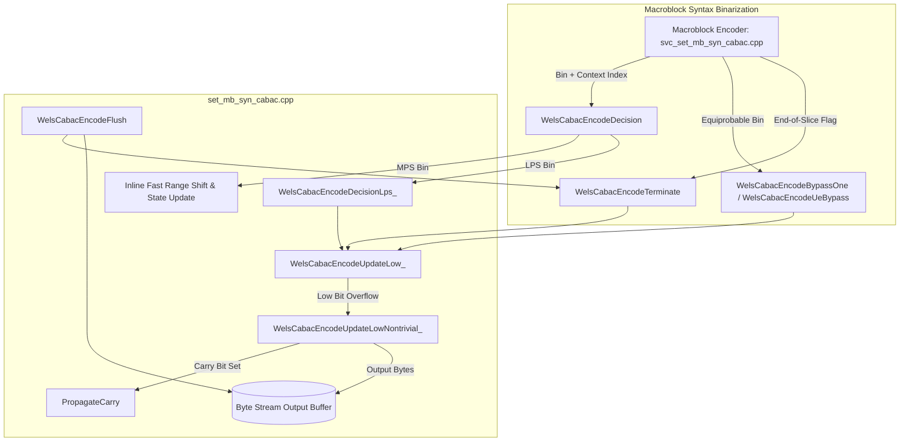
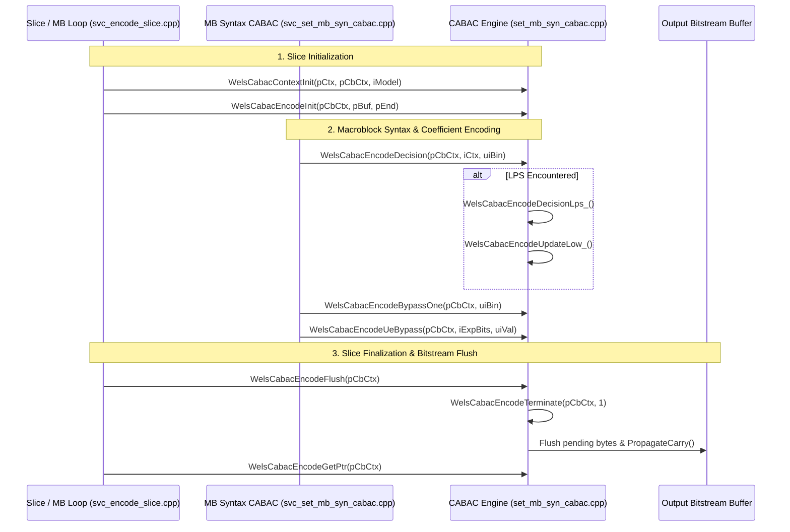

# OpenH264: CABAC Binary Arithmetic Encoding Engine (`set_mb_syn_cabac.cpp`)

This document provides an exhaustive, literate-programming-style technical specification and architectural deep dive for the Context-Based Adaptive Binary Arithmetic Coding (CABAC) entropy encoding engine implemented in [set_mb_syn_cabac.cpp](openh264/codec/encoder/core/src/set_mb_syn_cabac.cpp) and its companion header [set_mb_syn_cabac.h](openh264/codec/encoder/core/inc/set_mb_syn_cabac.h).

---

## Table of Contents
1. [Module Overview & Architectural Role](#1-module-overview--architectural-role)
2. [Data Structures, Type Definitions, and Constants](#2-data-structures-type-definitions-and-constants)
   - [2.1 Type Definitions & Bit-Width Constants](#21-type-definitions--bit-width-constants)
   - [2.2 Probability Context Model Structure (`SStateCtx`)](#22-probability-context-model-structure-sstatectx)
   - [2.3 Arithmetic Coding Engine State (`SCabacCtx`)](#23-arithmetic-coding-engine-state-scabacctx)
   - [2.4 Internal Look-Up Tables](#24-internal-look-up-tables)
3. [Mathematical Foundation of H.264 CABAC Encoding](#3-mathematical-foundation-of-h264-cabac-encoding)
   - [3.1 Arithmetic Interval Subdivision](#31-arithmetic-interval-subdivision)
   - [3.2 State Transition & Probability Estimation](#32-state-transition--probability-estimation)
   - [3.3 Renormalization & Carry Propagation](#33-renormalization--carry-propagation)
4. [Detailed Function & Method Breakdown](#4-detailed-function--method-breakdown)
   - [4.1 Helper Routines (Anonymous Namespace)](#41-helper-routines-anonymous-namespace)
     - [`PropagateCarry`](#propagatecarry)
   - [4.2 Initialization Routines](#42-initialization-routines)
     - [`WelsCabacInit`](#welscabacinit)
     - [`WelsCabacContextInit`](#welscabaccontextinit)
     - [`WelsCabacEncodeInit`](#welscabacencodeinit)
   - [4.3 Arithmetic Interval & Register Normalization](#43-arithmetic-interval--register-normalization)
     - [`WelsCabacEncodeUpdateLow_`](#welscabacencodeupdatelow_)
     - [`WelsCabacEncodeUpdateLowNontrivial_`](#welscabacencodeupdatelownontrivial_)
   - [4.4 Regular & LPS Decision Encoding](#44-regular--lps-decision-encoding)
     - [`WelsCabacEncodeDecision`](#welscabacencodedecision)
     - [`WelsCabacEncodeDecisionLps_`](#welscabacencodedecisionlps_)
   - [4.5 Bypass & Exp-Golomb Encoding](#45-bypass--exp-golomb-encoding)
     - [`WelsCabacEncodeBypassOne`](#welscabacencodebypassone)
     - [`WelsCabacEncodeUeBypass`](#welscabacencodeuebypass)
   - [4.6 Stream Termination & Buffer Management](#46-stream-termination--buffer-management)
     - [`WelsCabacEncodeTerminate`](#welscabacencodeterminate)
     - [`WelsCabacEncodeFlush`](#welscabacencodeflush)
     - [`WelsCabacEncodeGetPtr`](#welscabacencodegetptr)
5. [Call Graph & Subsystem Interactions](#5-call-graph--subsystem-interactions)

---

## 1. Module Overview & Architectural Role

In the H.264 / AVC (ISO/IEC 14496-10 / ITU-T Rec. H.264) video coding standard, **Context-Based Adaptive Binary Arithmetic Coding (CABAC)** provides lossless entropy coding with superior compression efficiency (typically 10–15% bitrate reduction over CAVLC at equivalent visual fidelity).

The source file [set_mb_syn_cabac.cpp](openh264/codec/encoder/core/src/set_mb_syn_cabac.cpp) and header [set_mb_syn_cabac.h](openh264/codec/encoder/core/inc/set_mb_syn_cabac.h) form the core arithmetic coding engine for the OpenH264 encoder. Higher-level macroblock syntax writers (such as [svc_set_mb_syn_cabac.cpp](openh264/codec/encoder/core/src/svc_set_mb_syn_cabac.cpp)) binarize macroblock headers, prediction modes, motion vector differences (MVDs), and transform coefficients into binary bins, and feed them into the arithmetic engine routines defined here.



---

## 2. Data Structures, Type Definitions, and Constants

### 2.1 Type Definitions & Bit-Width Constants

```cpp
#define WELS_QP_MAX 51

typedef uint64_t cabac_low_t;
enum { CABAC_LOW_WIDTH = sizeof (cabac_low_t) / sizeof (uint8_t) * 8 };
```

* **`WELS_QP_MAX`**: The maximum Quantization Parameter (QP) defined in the H.264 standard ($QP \in [0, 51]$, total 52 discrete QP levels).
* **[cabac_low_t](openh264/codec/encoder/core/inc/set_mb_syn_cabac.h#L53)**: `uint64_t`. A 64-bit unsigned integer holding the lower bound register `m_uiLow` ($L$) of the current arithmetic coding interval. Utilizing a 64-bit register allows the encoder to accumulate up to 63 shifted bits before writing multi-byte words to memory or propagating carry bits.
* **`CABAC_LOW_WIDTH`**: Integer constant `64`. Evaluated as `sizeof(uint64_t) / sizeof(uint8_t) * 8`.

---

### 2.2 Probability Context Model Structure (`SStateCtx`)

The structure [SStateCtx](openh264/codec/encoder/core/inc/set_mb_syn_cabac.h#L56-L63) encapsulates the state of a single adaptive binary context model in a compact 1-byte representation:

```cpp
typedef struct TagStateCtx {
  uint8_t   m_uiStateMps;

  uint8_t Mps()   const { return m_uiStateMps  & 1; }
  uint8_t State() const { return m_uiStateMps >> 1; }
  void Set (uint8_t uiState, uint8_t uiMps) { m_uiStateMps = uiState * 2 + uiMps; }
} SStateCtx;
```

#### Memory Layout & Bit Allocation
* **Total Size**: 1 byte (`uint8_t`).
* **Bit 0 (`uiMps`)**: The **Most Probable Symbol** ($\text{MPS} \in \{0, 1\}$).
* **Bits 1–6 (`uiState`)**: The 6-bit **Probability State Index** ($pStateIdx \in [0, 63]$), indexing the probability estimation state machine defined by H.264 Table 9-45.
* **Packing Formula**:
  $$\text{m\_uiStateMps} = (\text{uiState} \ll 1) \mid \text{uiMps} = 2 \cdot \text{uiState} + \text{uiMps}$$

#### Methods
* **`uint8_t Mps() const`**: Returns `m_uiStateMps & 1`.
* **`uint8_t State() const`**: Returns `m_uiStateMps >> 1`.
* **`void Set(uint8_t uiState, uint8_t uiMps)`**: Packs and assigns the 6-bit state index and 1-bit MPS symbol.

---

### 2.3 Arithmetic Coding Engine State (`SCabacCtx`)

The structure [SCabacCtx](openh264/codec/encoder/core/inc/set_mb_syn_cabac.h#L64-L73) encapsulates the full runtime state of the CABAC arithmetic encoder across an active slice:

```cpp
typedef struct TagCabacCtx {
  cabac_low_t m_uiLow;
  int32_t     m_iLowBitCnt;
  int32_t     m_iRenormCnt;
  uint32_t    m_uiRange;
  SStateCtx   m_sStateCtx[WELS_CONTEXT_COUNT];
  uint8_t*    m_pBufStart;
  uint8_t*    m_pBufEnd;
  uint8_t*    m_pBufCur;
} SCabacCtx;
```

| Field Name | Type | Size / Range | Purpose & Lifecycle |
| :--- | :--- | :--- | :--- |
| **`m_uiLow`** | [cabac_low_t](openh264/codec/encoder/core/inc/set_mb_syn_cabac.h#L53) (`uint64_t`) | 64-bit | Arithmetic interval lower bound ($L$). Shifted during bin encoding and flushed to the output byte buffer. |
| **`m_iLowBitCnt`** | `int32_t` | $[0, 63]$ | Number of active valid bits accumulated in `m_uiLow`. Initialized to `9`. |
| **`m_iRenormCnt`** | `int32_t` | $[0, 7]$ | Number of pending renormalization left-shifts queued for the next interval update. |
| **`m_uiRange`** | `uint32_t` | $[256, 510]$ | Current arithmetic interval range ($R$). Initialized to `510` (`0x1FE`). |
| **`m_sStateCtx`** | `SStateCtx[460]` | 460 bytes | Array of 460 context models ([WELS_CONTEXT_COUNT](openh264/codec/common/inc/wels_common_defs.h#L77)) for all H.264 syntax elements. |
| **`m_pBufStart`** | `uint8_t*` | Pointer | Pointer to the beginning of the slice output NAL buffer. Used as boundary limit for carry propagation. |
| **`m_pBufEnd`** | `uint8_t*` | Pointer | Pointer to the upper boundary of the slice output bitstream buffer. |
| **`m_pBufCur`** | `uint8_t*` | Pointer | Current write position in the output byte stream. Incremented as bytes are emitted. |

---

### 2.4 Internal Look-Up Tables

#### 1. `g_kiClz5Table[32]`
Defined in the anonymous namespace of [set_mb_syn_cabac.cpp](openh264/codec/encoder/core/src/set_mb_syn_cabac.cpp#L49-L52):
```cpp
const int8_t g_kiClz5Table[32] = {
  6, 5, 4, 4, 3, 3, 3, 3, 2, 2, 2, 2, 2, 2, 2, 2,
  1, 1, 1, 1, 1, 1, 1, 1, 1, 1, 1, 1, 1, 1, 1, 1
};
```
* **Purpose**: Computes the renormalization shift count ($kiRenormAmount$) for Least Probable Symbol (LPS) range values $uiRangeLps \in [2, 255]$.
* **Indexing**: Indexed by $(uiRangeLps \gg 3) \in [0, 31]$. It returns the exact number of left-shifts required to restore $uiRangeLps$ back into the normalized interval $[256, 510]$ ($uiRangeLps \ll kiRenormAmount \ge 256$).

#### 2. External Shared CABAC Tables
* **`g_kiCabacGlobalContextIdx[460][4][2]`**: Context initialization parameters $(m, n)$ defined in [wels_common_defs.h](openh264/codec/common/inc/wels_common_defs.h#L77) and [common_tables.cpp](openh264/codec/common/src/common_tables.cpp#L374).
* **`g_kuiCabacRangeLps[64][4]`**: Standard H.264 Table 9-44 range sub-interval table for LPS $R_{\text{LPS}}$, indexed by probability state $pStateIdx \in [0, 63]$ and quantized range $(Range \gg 6) \& 3$.
* **`g_kuiStateTransTable[64][2]`**: Standard H.264 Table 9-45 state transition table:
  * Index `[state][0]`: Next probability state upon encoding an **LPS** (`transIdxLPS`).
  * Index `[state][1]`: Next probability state upon encoding an **MPS** (`transIdxMPS`).

---

## 3. Mathematical Foundation of H.264 CABAC Encoding

### 3.1 Arithmetic Interval Subdivision

At any point in CABAC encoding, the current coding interval is characterized by lower bound $L$ (`m_uiLow`) and range $R$ (`m_uiRange`), where $R \in [256, 510]$.

When encoding a binary value $bin$ with context model $iCtx$:
1. Quantized range index $\rho = (R \gg 6) \& 3$.
2. Look up the LPS sub-interval $R_{\text{LPS}}$:
   $$R_{\text{LPS}} = \text{g\_kuiCabacRangeLps}[pStateIdx][\rho]$$
3. Compute the MPS sub-interval $R_{\text{MPS}}$:
   $$R_{\text{MPS}} = R - R_{\text{LPS}}$$

```
[---------------------------- Range R ----------------------------)
[--------------- R_MPS ---------------)[---------- R_LPS ---------)
^                                      ^
L (if bin == MPS)                      L + R_MPS (if bin == LPS)
```

* **If $bin == \text{MPS}$**:
  $$R \leftarrow R_{\text{MPS}}, \quad L \leftarrow L$$
* **If $bin == \text{LPS}$**:
  $$R \leftarrow R_{\text{LPS}}, \quad L \leftarrow L + R_{\text{MPS}}$$

---

### 3.2 State Transition & Probability Estimation

Each context model adapts its probability state $pStateIdx$ after every encoded bin:
* **Upon MPS**:
  $$pStateIdx_{\text{next}} = \text{g\_kuiStateTransTable}[pStateIdx][1]$$
  The MPS symbol identity remains unchanged.
* **Upon LPS**:
  $$pStateIdx_{\text{next}} = \text{g\_kuiStateTransTable}[pStateIdx][0]$$
  If $pStateIdx == 0$ (both symbols are equally likely), the MPS symbol flips:
  $$\text{MPS}_{\text{next}} = \text{MPS} \oplus 1$$

---

### 3.3 Renormalization & Carry Propagation

When $R < 256$, the interval must be renormalized by left-shifting $R$ and $L$ by $K$ bits such that $R \cdot 2^K \ge 256$.

Because additions to $L$ (`m_uiLow`) can cause an arithmetic overflow out of the active bit range, a carry bit is produced. When the MSB of the 64-bit register is set, [PropagateCarry](openh264/codec/encoder/core/src/set_mb_syn_cabac.cpp#L54-L58) ripples backward through the emitted byte stream:

$$\text{If } \text{byte}[i] == 0\text{xFF}: \quad \text{byte}[i] \leftarrow 0\text{x}00, \quad \text{carry } +1 \to \text{byte}[i-1]$$
$$\text{Else}: \quad \text{byte}[i] \leftarrow \text{byte}[i] + 1, \quad \text{terminate carry}$$

---

## 4. Detailed Function & Method Breakdown

### 4.1 Helper Routines (Anonymous Namespace)

#### `PropagateCarry`
Defined in [set_mb_syn_cabac.cpp:L54-L58](openh264/codec/encoder/core/src/set_mb_syn_cabac.cpp#L54-L58).

```cpp
void PropagateCarry (uint8_t* pBufCur, uint8_t* pBufStart) {
  for (; pBufCur > pBufStart; --pBufCur)
    if (++ * (pBufCur - 1))
      break;
}
```

* **Signature**: `void PropagateCarry(uint8_t* pBufCur, uint8_t* pBufStart)`
* **Parameters**:
  * `pBufCur`: Pointer to the current write position in the output buffer.
  * `pBufStart`: Pointer to the beginning of the slice buffer (acts as lower bound check).
* **Return Value**: None (`void`).
* **Behavior & Logic**:
  1. Iterates backwards starting from the most recently emitted byte `*(pBufCur - 1)`.
  2. Pre-increments the byte value (`++*(pBufCur - 1)`).
  3. If the resulting value is non-zero (meaning the original byte was not `0xFF`), the carry $+1$ is successfully absorbed, and the loop breaks immediately.
  4. If the original byte was `0xFF`, `++0xFF` overflows to `0x00` in 8-bit unsigned arithmetic, and the loop continues backwards to propagate $+1$ to `*(pBufCur - 2)`.

---

### 4.2 Initialization Routines

#### `WelsCabacInit`
Defined in [set_mb_syn_cabac.cpp:L64-L84](openh264/codec/encoder/core/src/set_mb_syn_cabac.cpp#L64-L84).

```cpp
void WelsCabacInit (void* pCtx) {
  sWelsEncCtx* pEncCtx = (sWelsEncCtx*)pCtx;
  for (int32_t iModel = 0; iModel < 4; iModel++) {
    for (int32_t iQp = 0; iQp <= WELS_QP_MAX; iQp++)
      for (int32_t iIdx = 0; iIdx < WELS_CONTEXT_COUNT; iIdx++) {
        int32_t m               = g_kiCabacGlobalContextIdx[iIdx][iModel][0];
        int32_t n               = g_kiCabacGlobalContextIdx[iIdx][iModel][1];
        int32_t iPreCtxState    = WELS_CLIP3 ((((m * iQp) >> 4) + n), 1, 126);
        uint8_t uiValMps         = 0;
        uint8_t uiStateIdx       = 0;
        if (iPreCtxState <= 63) {
          uiStateIdx = 63 - iPreCtxState;
          uiValMps = 0;
        } else {
          uiStateIdx = iPreCtxState - 64;
          uiValMps = 1;
        }
        pEncCtx->sWelsCabacContexts[iModel][iQp][iIdx].Set (uiStateIdx, uiValMps);
      }
  }
}
```

* **Signature**: `void WelsCabacInit (void* pCtx)`
* **Parameters**:
  * `pCtx`: Pointer to the top-level encoder context ([sWelsEncCtx](openh264/codec/encoder/core/inc/encoder_context.h#L116)).
* **Return Value**: None (`void`).
* **Algorithmic Breakdown**:
  * Precomputes the global CABAC context model lookup table `sWelsCabacContexts[4][52][460]` stored in the encoder context.
  * Loops over:
    * 4 slice initialization models (`iModel` $\in [0, 3]$).
    * 52 quantization parameters (`iQp` $\in [0, 51]$).
    * 460 standard H.264 context indices (`iIdx` $\in [0, 459]$).
  * Computes the linear pre-clamped context state:
    $$iPreCtxState = \text{clip3}\left(1, 126, \left\lfloor \frac{m \cdot iQp}{16} \right\rfloor + n\right)$$
  * Maps $iPreCtxState$ to probability state index $uiStateIdx$ and $uiValMps$:
    $$\begin{cases} uiValMps = 0, \quad uiStateIdx = 63 - iPreCtxState & \text{if } iPreCtxState \le 63 \\ uiValMps = 1, \quad uiStateIdx = iPreCtxState - 64 & \text{if } iPreCtxState > 63 \end{cases}$$

---

#### `WelsCabacContextInit`
Defined in [set_mb_syn_cabac.cpp:L86-L92](openh264/codec/encoder/core/src/set_mb_syn_cabac.cpp#L86-L92).

```cpp
void WelsCabacContextInit (void* pCtx, SCabacCtx* pCbCtx, int32_t iModel) {
  sWelsEncCtx* pEncCtx = (sWelsEncCtx*)pCtx;
  int32_t iIdx =  pEncCtx->eSliceType == WelsCommon::I_SLICE ? 0 : iModel + 1;
  int32_t iQp = pEncCtx->iGlobalQp;
  memcpy (pCbCtx->m_sStateCtx, pEncCtx->sWelsCabacContexts[iIdx][iQp],
          WELS_CONTEXT_COUNT * sizeof (SStateCtx));
}
```

* **Signature**: `void WelsCabacContextInit (void* pCtx, SCabacCtx* pCbCtx, int32_t iModel)`
* **Parameters**:
  * `pCtx`: Pointer to the encoder context `sWelsEncCtx`.
  * `pCbCtx`: Pointer to the target slice CABAC state structure [SCabacCtx](openh264/codec/encoder/core/inc/set_mb_syn_cabac.h#L64).
  * `iModel`: `cabac_init_idc` value from the slice header ($0, 1, \text{ or } 2$).
* **Logic**:
  * For intra slices (`I_SLICE`), the model index is always `0`.
  * For inter slices (`P_SLICE` / `B_SLICE`), `iIdx = iModel + 1` ($1, 2, \text{ or } 3$).
  * Fast-copies the precomputed 460-element context array for slice QP `pEncCtx->iGlobalQp` via a single 460-byte `memcpy`.

---

#### `WelsCabacEncodeInit`
Defined in [set_mb_syn_cabac.cpp:L94-L102](openh264/codec/encoder/core/src/set_mb_syn_cabac.cpp#L94-L102).

```cpp
void WelsCabacEncodeInit (SCabacCtx* pCbCtx, uint8_t* pBuf, uint8_t* pEnd) {
  pCbCtx->m_uiLow     = 0;
  pCbCtx->m_iLowBitCnt = 9;
  pCbCtx->m_iRenormCnt = 0;
  pCbCtx->m_uiRange   = 510;
  pCbCtx->m_pBufStart = pBuf;
  pCbCtx->m_pBufEnd   = pEnd;
  pCbCtx->m_pBufCur   = pBuf;
}
```

* **Signature**: `void WelsCabacEncodeInit (SCabacCtx* pCbCtx, uint8_t* pBuf, uint8_t* pEnd)`
* **Parameters**:
  * `pCbCtx`: Target CABAC context.
  * `pBuf`: Start pointer of the output slice payload buffer.
  * `pEnd`: End pointer of the output buffer.
* **Initial State Values**:
  * `m_uiLow = 0`: Initial lower bound.
  * `m_iLowBitCnt = 9`: Starts with 9 guard bits.
  * `m_iRenormCnt = 0`: No pending renormalization shifts.
  * `m_uiRange = 510`: Initial full range ($0\text{x}1\text{FE}$).

---

### 4.3 Arithmetic Interval & Register Normalization

#### `WelsCabacEncodeUpdateLow_`
Defined as an inline function in [set_mb_syn_cabac.h:L92-L100](openh264/codec/encoder/core/inc/set_mb_syn_cabac.h#L92-L100).

```cpp
inline void WelsCabacEncodeUpdateLow_ (SCabacCtx* pCbCtx) {
  if (pCbCtx->m_iLowBitCnt + pCbCtx->m_iRenormCnt < CABAC_LOW_WIDTH) {
    pCbCtx->m_iLowBitCnt  += pCbCtx->m_iRenormCnt;
    pCbCtx->m_uiLow      <<= pCbCtx->m_iRenormCnt;
  } else {
    WelsCabacEncodeUpdateLowNontrivial_ (pCbCtx);
  }
  pCbCtx->m_iRenormCnt = 0;
}
```

* **Logic**:
  * **Fast In-Register Path**: When `m_iLowBitCnt + m_iRenormCnt < 64`, all accumulated bits fit inside `m_uiLow`. Shifts `m_uiLow` left by `m_iRenormCnt` and adds `m_iRenormCnt` to `m_iLowBitCnt`.
  * **Slow Flushing Path**: When `m_iLowBitCnt + m_iRenormCnt \ge 64`, invokes `WelsCabacEncodeUpdateLowNontrivial_`.

---

#### `WelsCabacEncodeUpdateLowNontrivial_`
Defined in [set_mb_syn_cabac.cpp:L104-L131](openh264/codec/encoder/core/src/set_mb_syn_cabac.cpp#L104-L131).

```cpp
void WelsCabacEncodeUpdateLowNontrivial_ (SCabacCtx* pCbCtx) {
  int32_t iLowBitCnt = pCbCtx->m_iLowBitCnt;
  int32_t iRenormCnt = pCbCtx->m_iRenormCnt;
  cabac_low_t uiLow  = pCbCtx->m_uiLow;

  do {
    uint8_t* pBufCur = pCbCtx->m_pBufCur;
    const int32_t kiInc = CABAC_LOW_WIDTH - 1 - iLowBitCnt;

    uiLow <<= kiInc;
    if (uiLow & cabac_low_t (1) << (CABAC_LOW_WIDTH - 1))
      PropagateCarry (pBufCur, pCbCtx->m_pBufStart);

    if (CABAC_LOW_WIDTH > 32) {
      WRITE_BE_32 (pBufCur, (uint32_t) (uiLow >> 31));
      pBufCur += 4;
    }
    *pBufCur++ = (uint8_t) (uiLow >> 23);
    *pBufCur++ = (uint8_t) (uiLow >> 15);
    iRenormCnt -= kiInc;
    iLowBitCnt = 15;
    uiLow &= (1u << iLowBitCnt) - 1;
    pCbCtx->m_pBufCur = pBufCur;
  } while (iLowBitCnt + iRenormCnt > CABAC_LOW_WIDTH - 1);

  pCbCtx->m_iLowBitCnt = iLowBitCnt + iRenormCnt;
  pCbCtx->m_uiLow = uiLow << iRenormCnt;
}
```

* **Detailed Mechanics**:
  1. Computes the maximum shift step $kiInc = 63 - iLowBitCnt$.
  2. Shifts `uiLow <<= kiInc`.
  3. Tests bit 63 (`uiLow & (1ULL << 63)`). If set, invokes [PropagateCarry](openh264/codec/encoder/core/src/set_mb_syn_cabac.cpp#L54) to ripple the carry bit backwards through the emitted buffer.
  4. Writes 4 bytes in big-endian order via `WRITE_BE_32(pBufCur, (uint32_t)(uiLow >> 31))`.
  5. Emits two additional bytes `(uiLow >> 23)` and `(uiLow >> 15)`.
  6. Resets `iLowBitCnt = 15` and masks out written upper bits (`uiLow &= 0x7FFF`).
  7. Loops if remaining `iLowBitCnt + iRenormCnt > 63`.

---

### 4.4 Regular & LPS Decision Encoding

#### `WelsCabacEncodeDecision`
Defined as an inline function in [set_mb_syn_cabac.h:L103-L117](openh264/codec/encoder/core/inc/set_mb_syn_cabac.h#L103-L117).

```cpp
void WelsCabacEncodeDecision (SCabacCtx* pCbCtx, int32_t iCtx, uint32_t uiBin) {
  if (uiBin == pCbCtx->m_sStateCtx[iCtx].Mps()) {
    const int32_t kiState = pCbCtx->m_sStateCtx[iCtx].State();
    uint32_t uiRange = pCbCtx->m_uiRange;
    uint32_t uiRangeLps = g_kuiCabacRangeLps[kiState][(uiRange & 0xff) >> 6];
    uiRange -= uiRangeLps;

    const int32_t kiRenormAmount = uiRange >> 8 ^ 1;
    pCbCtx->m_uiRange = uiRange << kiRenormAmount;
    pCbCtx->m_iRenormCnt += kiRenormAmount;
    pCbCtx->m_sStateCtx[iCtx].Set (g_kuiStateTransTable[kiState][1], uiBin);
  } else {
    WelsCabacEncodeDecisionLps_ (pCbCtx, iCtx);
  }
}
```

* **Parameters**:
  * `pCbCtx`: Active CABAC context.
  * `iCtx`: Context index $iCtx \in [0, 459]$.
  * `uiBin`: Binary symbol to encode ($0 \text{ or } 1$).
* **Algorithmic Flow**:
  * **MPS Path (`uiBin == Mps()`)**:
    * Extracts state index $kiState$.
    * Subtracts $uiRangeLps$ from $uiRange$.
    * Evaluates $kiRenormAmount = (uiRange \gg 8) \oplus 1$:
      * If $uiRange \ge 256$, $(uiRange \gg 8) = 1 \implies kiRenormAmount = 0$.
      * If $uiRange < 256$, $(uiRange \gg 8) = 0 \implies kiRenormAmount = 1$.
    * Normalizes range: `m_uiRange = uiRange << kiRenormAmount`.
    * Accumulates renormalization count: `m_iRenormCnt += kiRenormAmount`.
    * Updates context state via MPS transition table `g_kuiStateTransTable[kiState][1]`.
  * **LPS Path (`uiBin != Mps()`)**:
    * Calls out-of-line helper `WelsCabacEncodeDecisionLps_`.

---

#### `WelsCabacEncodeDecisionLps_`
Defined in [set_mb_syn_cabac.cpp:L133-L147](openh264/codec/encoder/core/src/set_mb_syn_cabac.cpp#L133-L147).

```cpp
void WelsCabacEncodeDecisionLps_ (SCabacCtx* pCbCtx, int32_t iCtx) {
  const int32_t kiState = pCbCtx->m_sStateCtx[iCtx].State();
  uint32_t uiRange = pCbCtx->m_uiRange;
  uint32_t uiRangeLps = g_kuiCabacRangeLps[kiState][ (uiRange & 0xff) >> 6];
  uiRange -= uiRangeLps;
  pCbCtx->m_sStateCtx[iCtx].Set (g_kuiStateTransTable[kiState][0],
                                 pCbCtx->m_sStateCtx[iCtx].Mps() ^ (kiState == 0));

  WelsCabacEncodeUpdateLow_ (pCbCtx);
  pCbCtx->m_uiLow += uiRange;

  const int32_t kiRenormAmount = g_kiClz5Table[uiRangeLps >> 3];
  pCbCtx->m_uiRange = uiRangeLps << kiRenormAmount;
  pCbCtx->m_iRenormCnt = kiRenormAmount;
}
```

* **Behavior**:
  1. Derives $uiRangeLps$ and sub-interval remainder $uiRange = uiRange - uiRangeLps$.
  2. Updates context state using LPS transition `g_kuiStateTransTable[kiState][0]`. If $kiState == 0$, inverts MPS (`Mps() ^ 1`).
  3. Flushes queued shifts in `m_uiLow` via `WelsCabacEncodeUpdateLow_(pCbCtx)`.
  4. Offsets lower bound interval: `m_uiLow += uiRange`.
  5. Computes renormalization shift count $kiRenormAmount$ using `g_kiClz5Table[uiRangeLps >> 3]`.
  6. Sets new range `m_uiRange = uiRangeLps << kiRenormAmount` and `m_iRenormCnt = kiRenormAmount`.

---

### 4.5 Bypass & Exp-Golomb Encoding

#### `WelsCabacEncodeBypassOne`
Defined as an inline function in [set_mb_syn_cabac.h:L119-L124](openh264/codec/encoder/core/inc/set_mb_syn_cabac.h#L119-L124).

```cpp
void WelsCabacEncodeBypassOne (SCabacCtx* pCbCtx, int32_t uiBin) {
  const uint32_t kuiBinBitmask = -uiBin;
  pCbCtx->m_iRenormCnt++;
  WelsCabacEncodeUpdateLow_ (pCbCtx);
  pCbCtx->m_uiLow += kuiBinBitmask & pCbCtx->m_uiRange;
}
```

* **Bypass Arithmetic**:
  * Used for equiprobable bins ($p = 0.5$, such as sign bits and suffix bins) without context modeling.
  * Formulates bitmask: `kuiBinBitmask = -uiBin` (`0x00000000` for bin `0`, `0xFFFFFFFF` for bin `1`).
  * Increments `m_iRenormCnt++`.
  * Calls `WelsCabacEncodeUpdateLow_(pCbCtx)`.
  * Adds `m_uiRange` to `m_uiLow` if `uiBin == 1`.

---

#### `WelsCabacEncodeUeBypass`
Defined in [set_mb_syn_cabac.cpp:L167-L183](openh264/codec/encoder/core/src/set_mb_syn_cabac.cpp#L167-L183).

```cpp
void WelsCabacEncodeUeBypass (SCabacCtx* pCbCtx, int32_t iExpBits, uint32_t uiVal) {
  int32_t iSufS = uiVal;
  int32_t iStopLoop = 0;
  int32_t k = iExpBits;
  do {
    if (iSufS >= (1 << k)) {
      WelsCabacEncodeBypassOne (pCbCtx, 1);
      iSufS = iSufS - (1 << k);
      k++;
    } else {
      WelsCabacEncodeBypassOne (pCbCtx, 0);
      while (k--)
        WelsCabacEncodeBypassOne (pCbCtx, (iSufS >> k) & 1);
      iStopLoop = 1;
    }
  } while (!iStopLoop);
}
```

* **Signature**: `void WelsCabacEncodeUeBypass (SCabacCtx* pCbCtx, int32_t iExpBits, uint32_t uiVal)`
* **Parameters**:
  * `pCbCtx`: CABAC context.
  * `iExpBits`: Initial Exp-Golomb order $k$.
  * `uiVal`: Unsigned value to encode.
* **Algorithm**:
  * Encodes the prefix unary string: While $iSufS \ge 2^k$, encodes bypass bin `1`, subtracts $2^k$, and increments $k \leftarrow k + 1$.
  * Once $iSufS < 2^k$, encodes terminal bypass bin `0`, followed by the $k$-bit binary suffix of $iSufS$.

---

### 4.6 Stream Termination & Buffer Management

#### `WelsCabacEncodeTerminate`
Defined in [set_mb_syn_cabac.cpp:L149-L166](openh264/codec/encoder/core/src/set_mb_syn_cabac.cpp#L149-L166).

```cpp
void WelsCabacEncodeTerminate (SCabacCtx* pCbCtx, uint32_t uiBin) {
  pCbCtx->m_uiRange -= 2;
  if (uiBin) {
    WelsCabacEncodeUpdateLow_ (pCbCtx);
    pCbCtx->m_uiLow  += pCbCtx->m_uiRange;

    const int32_t kiRenormAmount = 7;
    pCbCtx->m_uiRange = 2 << kiRenormAmount;
    pCbCtx->m_iRenormCnt = kiRenormAmount;

    WelsCabacEncodeUpdateLow_ (pCbCtx);
    pCbCtx->m_uiLow |= 0x80;
  } else {
    const int32_t kiRenormAmount = pCbCtx->m_uiRange >> 8 ^ 1;
    pCbCtx->m_uiRange = pCbCtx->m_uiRange << kiRenormAmount;
    pCbCtx->m_iRenormCnt += kiRenormAmount;
  }
}
```

* **Purpose**: Encodes the `end_of_slice_flag` or terminates macroblock syntax streams.
* **Standard Specification**: H.264 allocates a fixed range $R_{\text{term}} = 2$ for the terminating symbol.
* **Logic**:
  * Subdivides range: `m_uiRange -= 2`.
  * **If `uiBin == 1` (Slice termination)**:
    * Adds `m_uiRange` to `m_uiLow`.
    * Normalizes with a 7-bit left shift ($2 \ll 7 = 256$).
    * Sets terminating marker bit `0x80` in `m_uiLow`.
  * **If `uiBin == 0` (Continue slice)**:
    * Renormalizes if `m_uiRange < 256` by shifting `m_uiRange` left by $(m\_uiRange \gg 8) \oplus 1$.

---

#### `WelsCabacEncodeFlush`
Defined in [set_mb_syn_cabac.cpp:L185-L199](openh264/codec/encoder/core/src/set_mb_syn_cabac.cpp#L185-L199).

```cpp
void WelsCabacEncodeFlush (SCabacCtx* pCbCtx) {
  WelsCabacEncodeTerminate (pCbCtx, 1);

  cabac_low_t uiLow = pCbCtx->m_uiLow;
  int32_t iLowBitCnt = pCbCtx->m_iLowBitCnt;
  uint8_t* pBufCur = pCbCtx->m_pBufCur;

  uiLow <<= CABAC_LOW_WIDTH - 1 - iLowBitCnt;
  if (uiLow & cabac_low_t (1) << (CABAC_LOW_WIDTH - 1))
    PropagateCarry (pBufCur, pCbCtx->m_pBufStart);
  for (; (iLowBitCnt -= 8) >= 0; uiLow <<= 8)
    * pBufCur++ = (uint8_t) (uiLow >> (CABAC_LOW_WIDTH - 9));

  pCbCtx->m_pBufCur = pBufCur;
}
```

* **Flushing Mechanism**:
  1. Calls `WelsCabacEncodeTerminate(pCbCtx, 1)` to encode the slice terminal symbol.
  2. Shifts `uiLow` left by $63 - iLowBitCnt$.
  3. Checks and propagates any pending carry to earlier buffer bytes via `PropagateCarry`.
  4. Flushes all remaining complete 8-bit bytes from `uiLow` to `pBufCur`.
  5. Updates `pCbCtx->m_pBufCur`.

---

#### `WelsCabacEncodeGetPtr`
Defined in [set_mb_syn_cabac.cpp:L201-L203](openh264/codec/encoder/core/src/set_mb_syn_cabac.cpp#L201-L203).

```cpp
uint8_t* WelsCabacEncodeGetPtr (SCabacCtx* pCbCtx) {
  return pCbCtx->m_pBufCur;
}
```

* **Signature**: `uint8_t* WelsCabacEncodeGetPtr (SCabacCtx* pCbCtx)`
* **Returns**: Pointer to the current output write position `pCbCtx->m_pBufCur`.

---

## 5. Call Graph & Subsystem Interactions



---

## Related Files & Links
* **Implementation Source**: [set_mb_syn_cabac.cpp](openh264/codec/encoder/core/src/set_mb_syn_cabac.cpp)
* **Header Declarations**: [set_mb_syn_cabac.h](openh264/codec/encoder/core/inc/set_mb_syn_cabac.h)
* **Macroblock Syntax Writer**: [svc_set_mb_syn_cabac.cpp](openh264/codec/encoder/core/src/svc_set_mb_syn_cabac.cpp)
* **Common Tables**: [common_tables.cpp](openh264/codec/common/src/common_tables.cpp)
* **Encoder Context**: [encoder_context.h](openh264/codec/encoder/core/inc/encoder_context.h)
