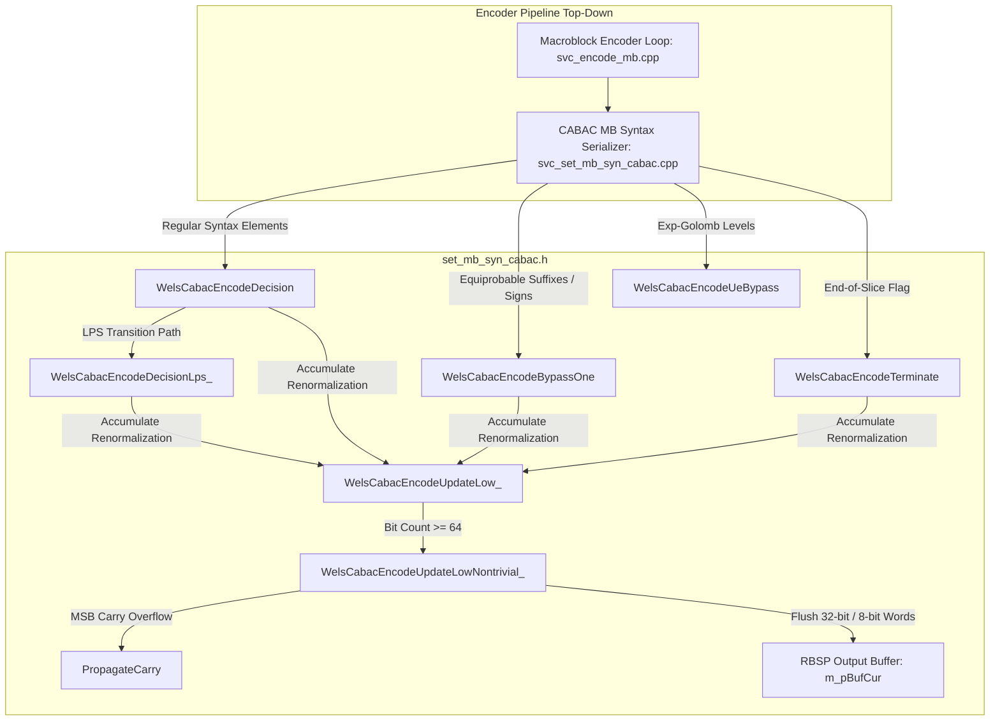
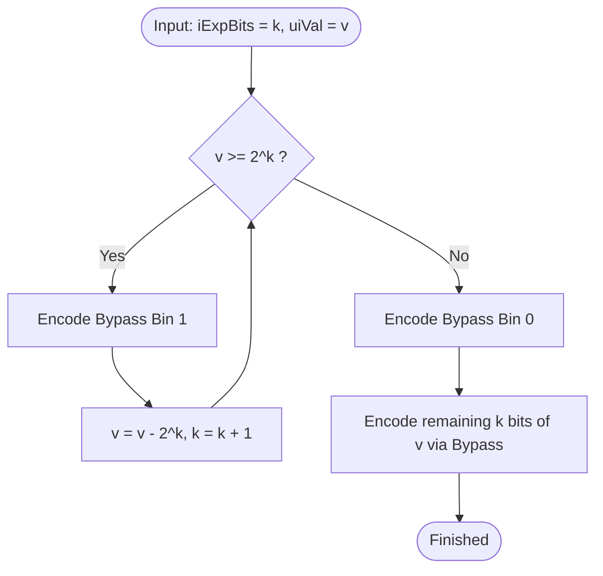
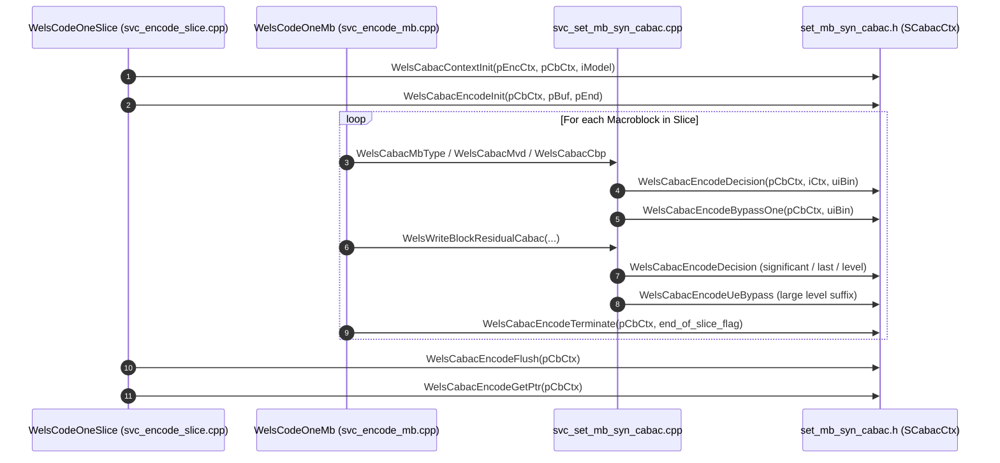

# OpenH264 CABAC Encoder Engine: `set_mb_syn_cabac.h`

This document provides a comprehensive, literate-programming-style technical specification and architectural deep dive into the **Context-Adaptive Binary Arithmetic Coding (CABAC) Encoder Engine** declared in [`codec/encoder/core/inc/set_mb_syn_cabac.h`](openh264/codec/encoder/core/inc/set_mb_syn_cabac.h) and implemented in [`codec/encoder/core/src/set_mb_syn_cabac.cpp`](openh264/codec/encoder/core/src/set_mb_syn_cabac.cpp) and [`codec/encoder/core/src/svc_set_mb_syn_cabac.cpp`](openh264/codec/encoder/core/src/svc_set_mb_syn_cabac.cpp).

---

## Table of Contents
1. [Architectural Overview & Module Purpose](#1-architectural-overview--module-purpose)
2. [H.264 CABAC Binary Arithmetic Encoding Principles](#2-h264-cabac-binary-arithmetic-encoding-principles)
3. [Data Structures, Types, and Constants](#3-data-structures-types-and-constants)
   - [3.1 Primitive Types & Bit-Width Constants](#31-primitive-types--bit-width-constants)
   - [3.2 Packed Context Model State: `SStateCtx` / `TagStateCtx`](#32-packed-context-model-state-sstatectx--tagstatectx)
   - [3.3 CABAC Encoder Engine State: `SCabacCtx` / `TagCabacCtx`](#33-cabac-encoder-engine-state-scabacctx--tagcabacctx)
4. [Deep Dive: Function & Method Implementations](#4-deep-dive-function--method-implementations)
   - [4.1 Global Context & Slice State Initialization: `WelsCabacContextInit`](#41-global-context--slice-state-initialization-welscabaccontextinit)
   - [4.2 Engine Setup & Register Reset: `WelsCabacEncodeInit`](#42-engine-setup--register-reset-welscabacencodeinit)
   - [4.3 Regular Decision Encoding: `WelsCabacEncodeDecision` & `WelsCabacEncodeDecisionLps_`](#43-regular-decision-encoding-welscabacencodedecision--welscabacencodedecisionlps_)
   - [4.4 Low Register Renormalization & Carry Propagation: `WelsCabacEncodeUpdateLow_`, `WelsCabacEncodeUpdateLowNontrivial_`, & `PropagateCarry`](#44-low-register-renormalization--carry-propagation-welscabacencodeupdatelow_-welscabacencodeupdatelownontrivial_--propagatecarry)
   - [4.5 Equiprobable Bypass Encoding: `WelsCabacEncodeBypassOne`](#45-equiprobable-bypass-encoding-welscabacencodebypassone)
   - [4.6 Syntax Element Termination & Flush: `WelsCabacEncodeTerminate` & `WelsCabacEncodeFlush`](#46-syntax-element-termination--flush-welscabacencodeterminate--welscabacencodeflush)
   - [4.7 Multi-Bin Exp-Golomb Bypass: `WelsCabacEncodeUeBypass`](#47-multi-bin-exp-golomb-bypass-welscabacencodeuebypass)
   - [4.8 Buffer Cursor Query: `WelsCabacEncodeGetPtr`](#48-buffer-cursor-query-welscabacencodegetptr)
   - [4.9 Block Residual Serialization Prototype: `WriteBlockResidualCabac`](#49-block-residual-serialization-prototype-writeblockresidualcabac)
5. [Call Graph & Encoder Pipeline Integration](#5-call-graph--encoder-pipeline-integration)

---

## 1. Architectural Overview & Module Purpose

In the H.264 / AVC video coding standard (ITU-T Recommendation H.264 / ISO/IEC 14496-10, Section 9.3), **Context-Adaptive Binary Arithmetic Coding (CABAC)** is the advanced entropy coding engine that provides optimal lossless compression of binarized syntax elements. Compared to Context-Adaptive Variable-Length Coding (CAVLC), CABAC reduces the compressed video bitrate by 10% to 15% at identical visual quality.

The header file [`set_mb_syn_cabac.h`](openh264/codec/encoder/core/inc/set_mb_syn_cabac.h) defines the core C/C++ data structures and inline routines for the **OpenH264 Video Encoder CABAC engine**. Its primary responsibilities include:

1. **Context Model Management**: Managing the probability estimation state machines for all 460 standard H.264 context models (`WELS_CONTEXT_COUNT = 460`).
2. **64-bit Low Register Arithmetic Engine**: Implementing a high-throughput, low-overhead binary arithmetic coder that leverages a 64-bit integer low register (`cabac_low_t` / `uint64_t`) to defer byte flushes and minimize branching during macroblock encoding loops.
3. **Carry Propagation & Byte-Stream Serialization**: Handling arithmetic overflow bits with backward carry propagation (`PropagateCarry`) and big-endian multi-byte output streaming (`WRITE_BE_32`).
4. **Adaptive, Bypass, and Terminating Binary Encoding**: Providing specialized fast paths for regular context-modeled bins (`WelsCabacEncodeDecision`), equiprobable bypass bins (`WelsCabacEncodeBypassOne`), Exp-Golomb bypass suffixes (`WelsCabacEncodeUeBypass`), and slice/I_PCM terminating bins (`WelsCabacEncodeTerminate`).



---

## 2. H.264 CABAC Binary Arithmetic Encoding Principles

The CABAC encoder models a sequence of binary decisions (bins) by recursively subdividing a probability interval $[L, L + R)$, where:
- $L$ (`m_uiLow`) represents the lower bound of the arithmetic coding interval.
- $R$ (`m_uiRange`) represents the current width of the interval, normalized to the 9-bit range $[256, 510]$ (`0x0100` to `0x01FE`).

### Mathematical Sub-Division & Interval Updating

For any given syntax element context index $iCtx \in [0, 459]$, the context state is characterized by:
- 6-bit probability state index $\sigma \in [0, 63]$ estimating the Least Probable Symbol (LPS) probability $p_{\text{LPS}}$.
- 1-bit Most Probable Symbol indicator $\text{MPS} \in \{0, 1\}$.

#### 1. Range Sub-Division
The interval range $R$ is partitioned into two sub-intervals: $R_{\text{LPS}}$ for the least probable symbol and $R_{\text{MPS}}$ for the most probable symbol. The value of $R_{\text{LPS}}$ is obtained via table lookup using the current 6-bit state index $\sigma$ and the 2 most significant fractional bits of $R$:

$$R_{\text{LPS}} = \text{g\_kuiCabacRangeLps}[\sigma][(R \ \& \ 0\text{xFF}) \gg 6]$$
$$R_{\text{MPS}} = R - R_{\text{LPS}}$$

#### 2. Decision Paths

- **Most Probable Symbol ($\text{bin} = \text{MPS}$)**:
  The interval range is updated to $R \leftarrow R_{\text{MPS}}$. The lower bound $L$ remains unchanged. The context model state transitions to a higher probability state:
  $$\sigma_{\text{next}} = \text{g\_kuiStateTransTable}[\sigma][1]$$

- **Least Probable Symbol ($\text{bin} \ne \text{MPS}$)**:
  The lower bound $L$ is shifted to the start of the LPS sub-interval:
  $$L \leftarrow L + R_{\text{MPS}}$$
  The interval range is updated to $R \leftarrow R_{\text{LPS}}$. The context model state transitions to a lower probability state:
  $$\sigma_{\text{next}} = \text{g\_kuiStateTransTable}[\sigma][0]$$
  If the previous state was $\sigma = 0$, the MPS flag is inverted ($\text{MPS} \leftarrow \text{MPS} \oplus 1$).

#### 3. Renormalization

Whenever $R < 256$, the interval range $R$ and the lower bound $L$ must be left-shifted by $k$ bits ($R \leftarrow R \ll k, L \leftarrow L \ll k$) until $R \in [256, 510]$. OpenH264 batches these shift operations inside the 64-bit integer `m_uiLow` using `m_iRenormCnt`.

---

## 3. Data Structures, Types, and Constants

### 3.1 Primitive Types & Bit-Width Constants

Declared in [`set_mb_syn_cabac.h:L51-L54`](openh264/codec/encoder/core/inc/set_mb_syn_cabac.h#L51-L54):

```cpp
#define WELS_QP_MAX 51

typedef uint64_t cabac_low_t;
enum { CABAC_LOW_WIDTH = sizeof (cabac_low_t) / sizeof (uint8_t) * 8 };
```

| Constant / Type | Data Type | Value / Evaluation | Description |
| :--- | :--- | :--- | :--- |
| `WELS_QP_MAX` | `#define` macro | `51` | Maximum Quantization Parameter (QP) defined in the H.264 specification ($0 \le QP \le 51$). |
| `cabac_low_t` | `typedef uint64_t` | 64-bit unsigned int | Internal arithmetic coding lower interval register $L$. |
| `CABAC_LOW_WIDTH` | Anonymous `enum` | `64` | Total bit-width of `cabac_low_t` ($8 \text{ bytes} \times 8 \text{ bits/byte} = 64 \text{ bits}$). |

---

### 3.2 Packed Context Model State: `SStateCtx` / `TagStateCtx`

Declared in [`set_mb_syn_cabac.h:L56-L63`](openh264/codec/encoder/core/inc/set_mb_syn_cabac.h#L56-L63):

```cpp
typedef struct TagStateCtx {
  // Packed representation of state and MPS as state << 1 | MPS.
  uint8_t m_uiStateMps;

  uint8_t Mps()   const { return m_uiStateMps  & 1; }
  uint8_t State() const { return m_uiStateMps >> 1; }
  void Set (uint8_t uiState, uint8_t uiMps) { m_uiStateMps = uiState * 2 + uiMps; }
} SStateCtx;
```

#### Memory Layout & Bit-Packing
The `SStateCtx` structure compresses both the 6-bit probability state index $\sigma$ and the 1-bit Most Probable Symbol (MPS) into a single 8-bit unsigned integer (`uint8_t`).

```
+---+---+---+---+---+---+---+---+
| 7 | 6 | 5 | 4 | 3 | 2 | 1 | 0 |  <-- Bit index
+---+---+---+---+---+---+---+---+
|   Probability State (6-bit)   |MPS|
+---+---+---+---+---+---+---+---+
```

- **Bit 0** (`m_uiStateMps & 1`): Most Probable Symbol (`MPS`), either `0` or `1`.
- **Bits 1..6** (`m_uiStateMps >> 1`): Probability State Index $\sigma \in [0, 63]$.
- **Bit 7**: Always `0` since $\sigma \le 63$.

#### Member Methods
- `uint8_t Mps() const`: Extracts the MPS bit (`return m_uiStateMps & 1;`).
- `uint8_t State() const`: Extracts the 6-bit probability state index (`return m_uiStateMps >> 1;`).
- `void Set(uint8_t uiState, uint8_t uiMps)`: Packs $\sigma$ and MPS into `m_uiStateMps` via `uiState * 2 + uiMps` (equivalent to `(uiState << 1) | uiMps`).

> [!NOTE]
> **Cache Efficiency**: By storing each context model in exactly **1 byte** (unlike the decoder's 2-byte structure), the entire array of 460 context models occupies only **460 bytes**. This fits cleanly within a single L1 data cache line block, eliminating cache misses during high-speed macroblock entropy serialization.

---

### 3.3 CABAC Encoder Engine State: `SCabacCtx` / `TagCabacCtx`

Declared in [`set_mb_syn_cabac.h:L64-L73`](openh264/codec/encoder/core/inc/set_mb_syn_cabac.h#L64-L73):

```cpp
typedef struct TagCabacCtx {
  cabac_low_t m_uiLow;
  int32_t     m_iLowBitCnt;
  int32_t     m_iRenormCnt;
  uint32_t    m_uiRange;
  SStateCtx   m_sStateCtx[WELS_CONTEXT_COUNT];
  uint8_t*    m_pBufStart;
  uint8_t*    m_pBufEnd;
  uint8_t*    m_pBufCur;
} SCabacCtx;
```

#### Detailed Member Specifications

| Member Field | Data Type | Size (Bytes) | Initial Value | Architectural Description |
| :--- | :--- | :--- | :--- | :--- |
| `m_uiLow` | `cabac_low_t` (`uint64_t`) | 8 | `0` | 64-bit arithmetic interval lower bound register $L$. Accumulates fractional bits and bitstream additions. |
| `m_iLowBitCnt` | `int32_t` | 4 | `9` | Number of valid buffered bits currently accumulated inside `m_uiLow`. |
| `m_iRenormCnt` | `int32_t` | 4 | `0` | Renormalization shift counter. Accumulates pending left shifts until flushed to the output byte stream. |
| `m_uiRange` | `uint32_t` | 4 | `510` (`0x01FE`) | Current arithmetic coding interval range $R$. Normalized to $[256, 510]$. |
| `m_sStateCtx` | `SStateCtx[460]` | 460 | Initialized per slice | Array of 460 packed probability context models (`WELS_CONTEXT_COUNT = 460`). |
| `m_pBufStart` | `uint8_t*` | Pointer (4/8) | Slice Buffer Start | Pointer to the beginning of the slice NAL RBSP output buffer. Used for backward carry propagation. |
| `m_pBufEnd` | `uint8_t*` | Pointer (4/8) | Slice Buffer End | Upper memory boundary limit of the bitstream output buffer. |
| `m_pBufCur` | `uint8_t*` | Pointer (4/8) | Slice Buffer Start | Current byte-write cursor in the output bitstream buffer. |

---

## 4. Deep Dive: Function & Method Implementations

### 4.1 Global Context & Slice State Initialization: `WelsCabacContextInit`

```cpp
void WelsCabacContextInit (void* pCtx, SCabacCtx* pCbCtx, int32_t iModel);
```

* **Header Reference**: [`set_mb_syn_cabac.h:L76`](openh264/codec/encoder/core/inc/set_mb_syn_cabac.h#L76)
* **Implementation**: [`set_mb_syn_cabac.cpp:L86-L92`](openh264/codec/encoder/core/src/set_mb_syn_cabac.cpp#L86-L92)

#### Purpose & Logic
Initializes the slice's active context models (`pCbCtx->m_sStateCtx`) by copying the precomputed context state table corresponding to the slice's coding type and quantization parameter ($QP$).

```cpp
void WelsCabacContextInit (void* pCtx, SCabacCtx* pCbCtx, int32_t iModel) {
  sWelsEncCtx* pEncCtx = (sWelsEncCtx*)pCtx;
  int32_t iIdx = pEncCtx->eSliceType == WelsCommon::I_SLICE ? 0 : iModel + 1;
  int32_t iQp = pEncCtx->iGlobalQp;
  memcpy (pCbCtx->m_sStateCtx, pEncCtx->sWelsCabacContexts[iIdx][iQp],
          WELS_CONTEXT_COUNT * sizeof (SStateCtx));
}
```

1. **Model Selection**:
   - For `I_SLICE`, model index `iIdx = 0`.
   - For `P_SLICE` / `B_SLICE`, model index `iIdx = iModel + 1` (where `iModel` is `cabac_init_idc` $\in [0, 2]$).
2. **Context Table Lookup**: Copies 460 bytes directly from `pEncCtx->sWelsCabacContexts[iIdx][iQp]` into `pCbCtx->m_sStateCtx`.

---

### 4.2 Engine Setup & Register Reset: `WelsCabacEncodeInit`

```cpp
void WelsCabacEncodeInit (SCabacCtx* pCbCtx, uint8_t* pBuf, uint8_t* pEnd);
```

* **Header Reference**: [`set_mb_syn_cabac.h:L77`](openh264/codec/encoder/core/inc/set_mb_syn_cabac.h#L77)
* **Implementation**: [`set_mb_syn_cabac.cpp:L94-L102`](openh264/codec/encoder/core/src/set_mb_syn_cabac.cpp#L94-L102)

#### Operational Flow
Prepares the arithmetic encoder state registers at the beginning of a slice NAL unit:

$$\begin{aligned}
L &\leftarrow 0 \quad (\text{m\_uiLow} = 0) \\
\text{m\_iLowBitCnt} &\leftarrow 9 \\
\text{m\_iRenormCnt} &\leftarrow 0 \\
R &\leftarrow 510 \quad (\text{m\_uiRange} = 510 = \text{0x01FE})
\end{aligned}$$

The buffer pointers `m_pBufStart`, `m_pBufEnd`, and `m_pBufCur` are bound to the allocated RBSP memory slice `[pBuf, pEnd]`.

---

### 4.3 Regular Decision Encoding: `WelsCabacEncodeDecision` & `WelsCabacEncodeDecisionLps_`

```cpp
inline void WelsCabacEncodeDecision (SCabacCtx* pCbCtx, int32_t iCtx, uint32_t uiBin);
void WelsCabacEncodeDecisionLps_ (SCabacCtx* pCbCtx, int32_t iCtx);
```

* **Header Reference**: [`set_mb_syn_cabac.h:L78, L90, L103-L117`](openh264/codec/encoder/core/inc/set_mb_syn_cabac.h#L103-L117)
* **LPS Implementation**: [`set_mb_syn_cabac.cpp:L133-L147`](openh264/codec/encoder/core/src/set_mb_syn_cabac.cpp#L133-L147)

#### Inline Implementation Walkthrough

```cpp
inline void WelsCabacEncodeDecision (SCabacCtx* pCbCtx, int32_t iCtx, uint32_t uiBin) {
  if (uiBin == pCbCtx->m_sStateCtx[iCtx].Mps()) {
    const int32_t kiState = pCbCtx->m_sStateCtx[iCtx].State();
    uint32_t uiRange = pCbCtx->m_uiRange;
    uint32_t uiRangeLps = g_kuiCabacRangeLps[kiState][(uiRange & 0xff) >> 6];
    uiRange -= uiRangeLps;

    const int32_t kiRenormAmount = uiRange >> 8 ^ 1;
    pCbCtx->m_uiRange = uiRange << kiRenormAmount;
    pCbCtx->m_iRenormCnt += kiRenormAmount;
    pCbCtx->m_sStateCtx[iCtx].Set (g_kuiStateTransTable[kiState][1], uiBin);
  } else {
    WelsCabacEncodeDecisionLps_ (pCbCtx, iCtx);
  }
}
```

#### Fast-Path: MPS Branch (`uiBin == Mps()`)
1. **Range Subtraction**:
   $$R_{\text{LPS}} = \text{g\_kuiCabacRangeLps}[\sigma][(R \ \& \ 0\text{xFF}) \gg 6]$$
   $$R \leftarrow R - R_{\text{LPS}}$$
2. **Branchless Renormalization Trick**:
   $$\text{kiRenormAmount} = (R \gg 8) \oplus 1$$
   - If $R \ge 256$ (bit 8 is 1), $\text{kiRenormAmount} = 1 \oplus 1 = 0 \implies$ No shift needed.
   - If $R < 256$ (bit 8 is 0), $\text{kiRenormAmount} = 0 \oplus 1 = 1 \implies$ Left-shift $R$ by 1 bit.
3. **State Transition**: Updates context model $\sigma \leftarrow \text{g\_kuiStateTransTable}[\sigma][1]$ while keeping MPS unchanged.

#### Slow-Path: LPS Branch (`WelsCabacEncodeDecisionLps_`)

```cpp
void WelsCabacEncodeDecisionLps_ (SCabacCtx* pCbCtx, int32_t iCtx) {
  const int32_t kiState = pCbCtx->m_sStateCtx[iCtx].State();
  uint32_t uiRange = pCbCtx->m_uiRange;
  uint32_t uiRangeLps = g_kuiCabacRangeLps[kiState][ (uiRange & 0xff) >> 6];
  uiRange -= uiRangeLps;
  pCbCtx->m_sStateCtx[iCtx].Set (g_kuiStateTransTable[kiState][0],
                                 pCbCtx->m_sStateCtx[iCtx].Mps() ^ (kiState == 0));

  WelsCabacEncodeUpdateLow_ (pCbCtx);
  pCbCtx->m_uiLow += uiRange;

  const int32_t kiRenormAmount = g_kiClz5Table[uiRangeLps >> 3];
  pCbCtx->m_uiRange = uiRangeLps << kiRenormAmount;
  pCbCtx->m_iRenormCnt = kiRenormAmount;
}
```

1. **State & MPS Toggle**: Updates $\sigma \leftarrow \text{g\_kuiStateTransTable}[\sigma][0]$. If $\sigma = 0$, the MPS bit is inverted ($\text{MPS} \leftarrow \text{MPS} \oplus 1$).
2. **Flush Pending Shifts**: Invokes `WelsCabacEncodeUpdateLow_(pCbCtx)` to push accumulated shift counts into `m_uiLow`.
3. **Low Addition**: Adds the MPS interval $R_{\text{MPS}}$ to $L$:
   $$L \leftarrow L + R_{\text{MPS}}$$
4. **CLZ Table Lookup**: Derives the exact renormalization shift count from the static 5-bit lookup table `g_kiClz5Table[uiRangeLps >> 3]`.

---

### 4.4 Low Register Renormalization & Carry Propagation: `WelsCabacEncodeUpdateLow_`, `WelsCabacEncodeUpdateLowNontrivial_`, & `PropagateCarry`

```cpp
inline void WelsCabacEncodeUpdateLow_ (SCabacCtx* pCbCtx);
void WelsCabacEncodeUpdateLowNontrivial_ (SCabacCtx* pCbCtx);
void PropagateCarry (uint8_t* pBufCur, uint8_t* pBufStart);
```

* **Header Reference**: [`set_mb_syn_cabac.h:L91-L100`](openh264/codec/encoder/core/inc/set_mb_syn_cabac.h#L91-L100)
* **Implementation**: [`set_mb_syn_cabac.cpp:L54-L58, L104-L131`](openh264/codec/encoder/core/src/set_mb_syn_cabac.cpp#L104-L131)

#### Inline Fast-Path: `WelsCabacEncodeUpdateLow_`

```cpp
inline void WelsCabacEncodeUpdateLow_ (SCabacCtx* pCbCtx) {
  if (pCbCtx->m_iLowBitCnt + pCbCtx->m_iRenormCnt < CABAC_LOW_WIDTH) {
    pCbCtx->m_iLowBitCnt += pCbCtx->m_iRenormCnt;
    pCbCtx->m_uiLow      <<= pCbCtx->m_iRenormCnt;
  } else {
    WelsCabacEncodeUpdateLowNontrivial_ (pCbCtx);
  }
  pCbCtx->m_iRenormCnt = 0;
}
```

If the sum of accumulated valid bits `m_iLowBitCnt` and pending shifts `m_iRenormCnt` remains strictly less than 64 (`CABAC_LOW_WIDTH`), the low register is shifted directly in CPU registers without memory access.

#### Buffer Emission: `WelsCabacEncodeUpdateLowNontrivial_`

When `m_iLowBitCnt + m_iRenormCnt >= 64`:
1. Shifts `uiLow` left by `kiInc = 63 - iLowBitCnt`.
2. **Carry Test**: Tests if the bit shifted into MSB position 63 is set (`uiLow & (1ULL << 63)`). If set, calls `PropagateCarry(pBufCur, pBufStart)`.
3. **Word/Byte Extraction**:
   - If `CABAC_LOW_WIDTH > 32`, writes a 32-bit big-endian integer to the buffer (`WRITE_BE_32(pBufCur, (uint32_t)(uiLow >> 31))`) and advances `pBufCur += 4`.
   - Writes the remaining upper bytes: `(uint8_t)(uiLow >> 23)` and `(uint8_t)(uiLow >> 15)`.
4. Resets `iLowBitCnt = 15` and loops until all accumulated shifts have been emitted.

#### Carry Propagation: `PropagateCarry`

```cpp
void PropagateCarry (uint8_t* pBufCur, uint8_t* pBufStart) {
  for (; pBufCur > pBufStart; --pBufCur)
    if (++ * (pBufCur - 1))
      break;
}
```
Traverses backward from `pBufCur - 1` towards `pBufStart`. Increments the preceding byte. If the byte overflows (`0xFF + 1 = 0x00`), the loop continues propagating the carry bit to the left until a non-overflowing byte is incremented.

---

### 4.5 Equiprobable Bypass Encoding: `WelsCabacEncodeBypassOne`

```cpp
inline void WelsCabacEncodeBypassOne (SCabacCtx* pCbCtx, int32_t uiBin);
```

* **Header Reference**: [`set_mb_syn_cabac.h:L79, L119-L124`](openh264/codec/encoder/core/inc/set_mb_syn_cabac.h#L119-L124)

```cpp
void WelsCabacEncodeBypassOne (SCabacCtx* pCbCtx, int32_t uiBin) {
  const uint32_t kuiBinBitmask = -uiBin;
  pCbCtx->m_iRenormCnt++;
  WelsCabacEncodeUpdateLow_ (pCbCtx);
  pCbCtx->m_uiLow += kuiBinBitmask & pCbCtx->m_uiRange;
}
```

#### Operational Mechanics
Used for equiprobable bins where $p(0) = p(1) = 0.5$ (e.g. sign flags, Exp-Golomb suffix bits):
1. **Branchless Mask**: `kuiBinBitmask = -uiBin` evaluates to `0x00000000` when `uiBin == 0`, and `0xFFFFFFFF` when `uiBin == 1`.
2. **Renormalization Increment**: Increments `m_iRenormCnt++` and updates `m_uiLow`.
3. **Range Addition**: If `uiBin == 1`, adds the current range $R$ (`m_uiRange`) to `m_uiLow`.

---

### 4.6 Syntax Element Termination & Flush: `WelsCabacEncodeTerminate` & `WelsCabacEncodeFlush`

```cpp
void WelsCabacEncodeTerminate (SCabacCtx* pCbCtx, uint32_t uiBin);
void WelsCabacEncodeFlush (SCabacCtx* pCbCtx);
```

* **Header Reference**: [`set_mb_syn_cabac.h:L80, L82`](openh264/codec/encoder/core/inc/set_mb_syn_cabac.h#L80-L82)
* **Implementation**: [`set_mb_syn_cabac.cpp:L149-L166, L185-L200`](openh264/codec/encoder/core/src/set_mb_syn_cabac.cpp#L149-L200)

#### `WelsCabacEncodeTerminate`
Encodes terminating syntax elements (`end_of_slice_flag` or `mb_type == I_PCM`):
1. Decrements range: $R \leftarrow R - 2$.
2. **Terminating Bin (`uiBin == 1`)**:
   - Flushes low register `WelsCabacEncodeUpdateLow_`.
   - Adds $R$ to `m_uiLow`.
   - Sets $R \leftarrow 2 \ll 7 = 256$, `m_iRenormCnt = 7`.
   - Calls `WelsCabacEncodeUpdateLow_` again and injects bit 7 (`m_uiLow |= 0x80`).
3. **Normal Bin (`uiBin == 0`)**: Renormalizes $R$ if $R < 256$ via `(R >> 8) ^ 1`.

#### `WelsCabacEncodeFlush`
Finalizes the CABAC stream at the end of a slice NAL unit:
1. Calls `WelsCabacEncodeTerminate(pCbCtx, 1)`.
2. Shifts remaining active bits in `m_uiLow` to the MSB boundary (`CABAC_LOW_WIDTH - 1 - iLowBitCnt`).
3. Handles final carry propagation (`PropagateCarry`).
4. Writes all remaining whole bytes (`uiLow >> (CABAC_LOW_WIDTH - 9)`) into `m_pBufCur`.

---

### 4.7 Multi-Bin Exp-Golomb Bypass: `WelsCabacEncodeUeBypass`

```cpp
void WelsCabacEncodeUeBypass (SCabacCtx* pCbCtx, int32_t iExpBits, uint32_t uiVal);
```

* **Header Reference**: [`set_mb_syn_cabac.h:L81`](openh264/codec/encoder/core/inc/set_mb_syn_cabac.h#L81)
* **Implementation**: [`set_mb_syn_cabac.cpp:L167-L183`](openh264/codec/encoder/core/src/set_mb_syn_cabac.cpp#L167-L183)

#### Suffix Encoding Algorithm
Encodes multi-bit unsigned integer values (such as the suffix of large transform coefficient absolute levels `coeff_abs_level_minus1`) using Exp-Golomb bypass bins:



---

### 4.8 Buffer Cursor Query: `WelsCabacEncodeGetPtr`

```cpp
uint8_t* WelsCabacEncodeGetPtr (SCabacCtx* pCbCtx);
```

* **Header Reference**: [`set_mb_syn_cabac.h:L83`](openh264/codec/encoder/core/inc/set_mb_syn_cabac.h#L83)
* **Implementation**: [`set_mb_syn_cabac.cpp:L201-L203`](openh264/codec/encoder/core/src/set_mb_syn_cabac.cpp#L201-L203)

Returns the current write position `pCbCtx->m_pBufCur`, enabling the slice encoder to calculate the exact number of RBSP bytes produced so far:

$$\text{Bytes Written} = \text{pCbCtx}\to\text{m\_pBufCur} - \text{pCbCtx}\to\text{m\_pBufStart}$$

---

### 4.9 Block Residual Serialization Prototype: `WriteBlockResidualCabac`

```cpp
int32_t WriteBlockResidualCabac (void* pEncCtx, int16_t* pCoffLevel, int32_t iEndIdx,
                                 int32_t iCalRunLevelFlag,
                                 int32_t iResidualProperty, int8_t iNC, SBitStringAux* pBs);
```

* **Header Reference**: [`set_mb_syn_cabac.h:L84-L86`](openh264/codec/encoder/core/inc/set_mb_syn_cabac.h#L84-L86)
* **Implementation File**: [`svc_set_mb_syn_cabac.cpp:L456-L612`](openh264/codec/encoder/core/src/svc_set_mb_syn_cabac.cpp#L456-L612)

Declared prototype for serializing 4x4 transform block residual coefficients (`LUMA_DC`, `LUMA_AC`, `LUMA_4x4`, `CHROMA_DC`, `CHROMA_AC`) using CABAC coded block flags (`coded_block_flag`), significant coefficient maps (`significant_coeff_flag`), last significant coefficient flags (`last_significant_coeff_flag`), and coefficient absolute levels (`coeff_abs_level_minus1`).

---

## 5. Call Graph & Encoder Pipeline Integration


