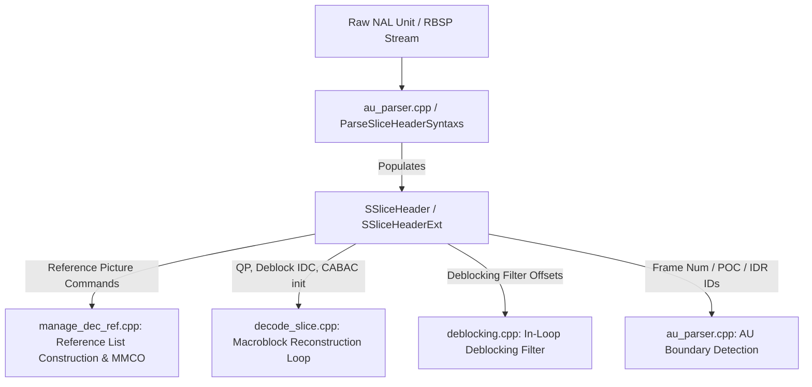
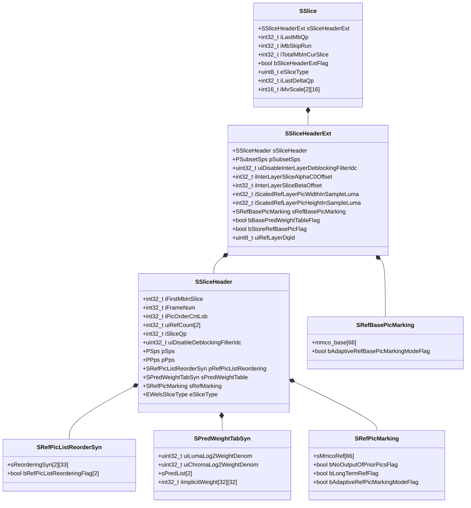
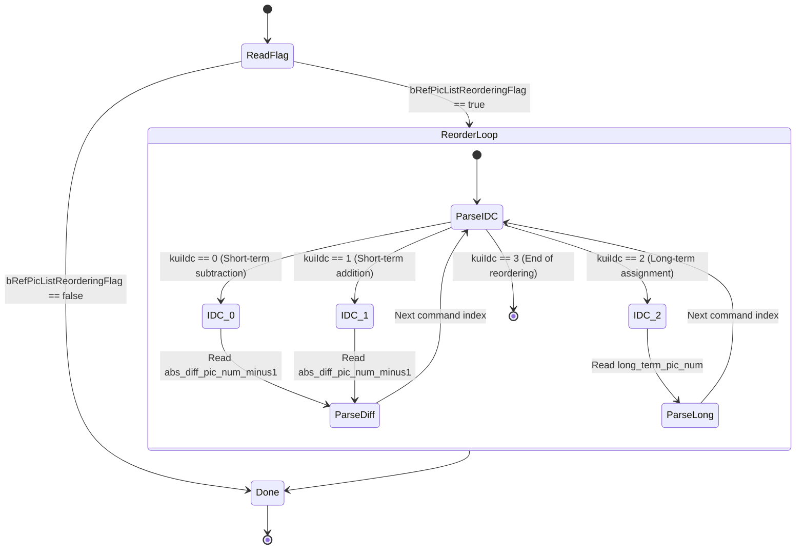
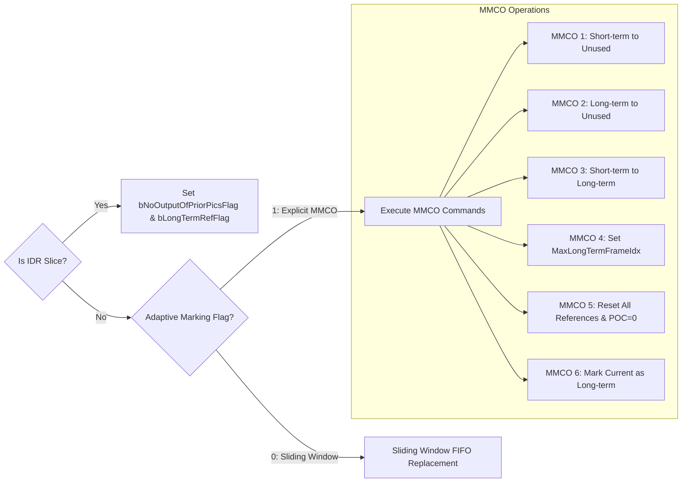
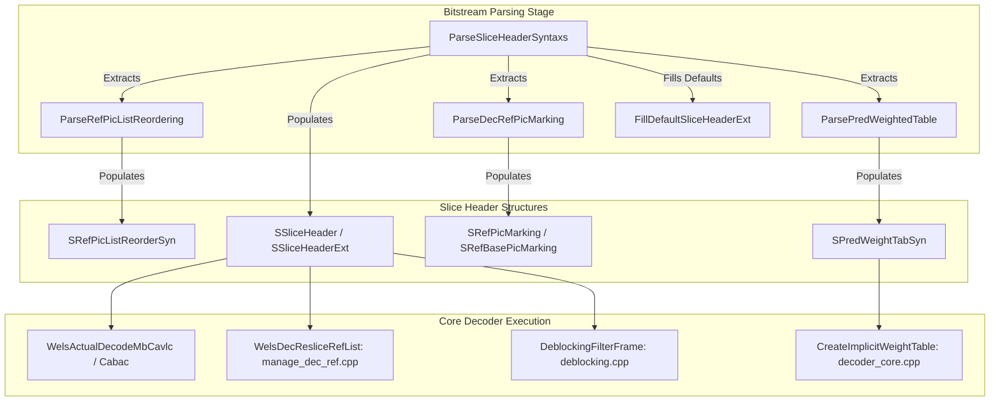

# OpenH264 Decoder: Slice Header & Control Architecture (`slice.h`)

This document provides a comprehensive, literate-programming-style technical specification for the slice-level data structures, H.264 / AVC syntax elements, and Scalable Video Coding (SVC) extension headers declared in [`codec/decoder/core/inc/slice.h`](openh264/codec/decoder/core/inc/slice.h).

---

## Table of Contents
1. [Architectural Role & Module Overview](#1-architectural-role--module-overview)
2. [Data Structure & Memory Layout Map](#2-data-structure--memory-layout-map)
3. [Detailed Data Structure Breakdown](#3-detailed-data-structure-breakdown)
   - [3.1 SRefPicListReorderSyn (Reference Picture List Reordering)](#31-srefpiclistreordersyn-reference-picture-list-reordering)
   - [3.2 SPredWeightTabSyn (Prediction Weight Table & Implicit Weights)](#32-spredweighttabsyn-prediction-weight-table--implicit-weights)
   - [3.3 SRefPicMarking (Decoded Reference Picture Marking / MMCO)](#33-srefpicmarking-decoded-reference-picture-marking--mmco)
   - [3.4 SRefBasePicMarking (SVC Base Reference Picture Marking)](#34-srefbasepicmarking-svc-base-reference-picture-marking)
   - [3.5 SSliceHeader (Base AVC Slice Header)](#35-ssliceheader-base-avc-slice-header)
   - [3.6 SSliceHeaderExt (SVC Extension Slice Header)](#36-ssliceheaderext-svc-extension-slice-header)
   - [3.7 SSlice (Active Slice Context & State Tracking)](#37-sslice-active-slice-context--state-tracking)
4. [Mathematical Models & Algorithmic Deep Dive](#4-mathematical-models--algorithmic-deep-dive)
   - [4.1 Slice Quantization Parameter (QP) Derivation](#41-slice-quantization-parameter-qp-derivation)
   - [4.2 Picture Order Count (POC) Computation & Wrap-Around](#42-picture-order-count-poc-computation--wrap-around)
   - [4.3 Implicit Bi-Prediction Weight Calculation](#43-implicit-bi-prediction-weight-calculation)
   - [4.4 Reference Picture List Reordering Mechanics](#44-reference-picture-list-reordering-mechanics)
   - [4.5 Memory Management Control Operations (MMCO) State Machine](#45-memory-management-control-operations-mmco-state-machine)
   - [4.6 Access Unit (AU) Boundary Detection Rules](#46-access-unit-au-boundary-detection-rules)
5. [Function & Parser Call Graph Interaction](#5-function--parser-call-graph-interaction)
6. [Cross-Reference & File Map](#6-cross-reference--file-map)

---

## 1. Architectural Role & Module Overview

In the ITU-T H.264 / ISO/IEC 14496-10 (AVC) and Annex G (SVC) video coding specifications, a **Slice** represents an independently decodable integer number of macroblocks within a picture. The slice header contains the critical syntax elements required to configure entropy decoding, motion vector prediction, reference picture indexing, in-loop deblocking filter parameters, and spatial/temporal scalability decoding.

In the OpenH264 decoder pipeline, [`slice.h`](openh264/codec/decoder/core/inc/slice.h) defines the primary data structures that bridge the NAL unit parsing stage ([`au_parser.cpp`](openh264/codec/decoder/core/src/au_parser.cpp) and [`decoder_core.cpp`](openh264/codec/decoder/core/src/decoder_core.cpp)) with downstream macroblock decoding ([`decode_slice.cpp`](openh264/codec/decoder/core/src/decode_slice.cpp)), reference picture list construction ([`manage_dec_ref.cpp`](openh264/codec/decoder/core/src/manage_dec_ref.cpp)), and deblocking filtering ([`deblocking.cpp`](openh264/codec/decoder/core/src/deblocking.cpp)).



All types in this header reside in the `WelsDec` C++ namespace.

---

## 2. Data Structure & Memory Layout Map

The data structures in [`slice.h`](openh264/codec/decoder/core/inc/slice.h) are organized in a strict compositional hierarchy:



---

## 3. Detailed Data Structure Breakdown

### 3.1 `SRefPicListReorderSyn` (Reference Picture List Reordering)

* **C++ Type Definition**: [`TagRefPicListReorderSyntax`](openh264/codec/decoder/core/inc/slice.h#L48-L55), typedef'd to `SRefPicListReorderSyn`, pointer type `PRefPicListReorderSyn`.
* **Standard Reference**: ITU-T H.264 Section 7.3.3.1 (*Reference picture list reordering syntax*) and JVT-X201wcm Page 64.

```cpp
typedef struct TagRefPicListReorderSyntax {
  struct {
    uint32_t    uiAbsDiffPicNumMinus1;
    uint16_t    uiLongTermPicNum;
    uint16_t    uiReorderingOfPicNumsIdc;
  } sReorderingSyn[LIST_A][MAX_REF_PIC_COUNT + 1];
  bool          bRefPicListReorderingFlag[LIST_A];
} SRefPicListReorderSyn, *PRefPicListReorderSyn;
```

#### Member Fields & Semantic Specification

| Field Name | Type | Size / Limits | Semantic Description |
| :--- | :--- | :--- | :--- |
| `bRefPicListReorderingFlag[LIST_A]` | `bool[2]` | 2 bytes | Corresponds to `ref_pic_list_modification_flag_l0` and `ref_pic_list_modification_flag_l1`. When `true`, default reference list ordering is overridden by explicit reordering commands. |
| `sReorderingSyn[LIST_A][MAX_REF_PIC_COUNT + 1]` | Nested Struct Array | `2 × 33` entries | Ordered sequence of modification instructions for List 0 (`LIST_0 = 0`) and List 1 (`LIST_1 = 1`). Capped by sentinel IDC `3`. |
| `sReorderingSyn[...].uiReorderingOfPicNumsIdc` | `uint16_t` | $[0, 3]$ | Reordering command code:<br>• `0`: Subtract `(abs_diff_pic_num_minus1 + 1)` from picture number prediction.<br>• `1`: Add `(abs_diff_pic_num_minus1 + 1)` to picture number prediction.<br>• `2`: Specify `long_term_pic_num`.<br>• `3`: End of reordering loop. |
| `sReorderingSyn[...].uiAbsDiffPicNumMinus1` | `uint32_t` | $[0, 2^{\text{log2\_max\_frame\_num}} - 1]$ | `abs_diff_pic_num_minus1`. Used with IDC `0` or `1` to calculate the target short-term reference picture difference. |
| `sReorderingSyn[...].uiLongTermPicNum` | `uint16_t` | $[0, \text{MaxLongTermFrameIdx}]$ | `long_term_pic_num`. Used with IDC `2` to specify the target long-term reference frame index. |

---

### 3.2 `SPredWeightTabSyn` (Prediction Weight Table & Implicit Weights)

* **C++ Type Definition**: [`TagPredWeightTabSyntax`](openh264/codec/decoder/core/inc/slice.h#L60-L72), typedef'd to `SPredWeightTabSyn`, pointer type `PPredWeightTabSyn`.
* **Standard Reference**: ITU-T H.264 Section 7.3.3.2 (*Prediction weight table syntax*) and JVT-X201wcm Page 65.

```cpp
typedef struct TagPredWeightTabSyntax {
  uint32_t  uiLumaLog2WeightDenom;
  uint32_t  uiChromaLog2WeightDenom;
  struct {
    int32_t iLumaWeight[MAX_REF_PIC_COUNT];
    int32_t iLumaOffset[MAX_REF_PIC_COUNT];
    int32_t iChromaWeight[MAX_REF_PIC_COUNT][2];
    int32_t iChromaOffset[MAX_REF_PIC_COUNT][2];
    bool    bLumaWeightFlag;
    bool    bChromaWeightFlag;
  } sPredList[LIST_A];
  int32_t   iImplicitWeight[MAX_REF_PIC_COUNT][MAX_REF_PIC_COUNT];
} SPredWeightTabSyn, *PPredWeightTabSyn;
```

#### Member Fields & Semantic Specification

| Field Name | Type | Size / Limits | Semantic Description |
| :--- | :--- | :--- | :--- |
| `uiLumaLog2WeightDenom` | `uint32_t` | $[0, 7]$ | `luma_log2_weight_denom`. Base-2 logarithm of the denominator for luma weighting factors ($\text{WDenom}_L$). |
| `uiChromaLog2WeightDenom` | `uint32_t` | $[0, 7]$ | `chroma_log2_weight_denom`. Base-2 logarithm of the denominator for chroma weighting factors ($\text{WDenom}_C$). |
| `sPredList[LIST_A].iLumaWeight[i]` | `int32_t[32]` | $[-128, 127]$ | Explicit luma weighting factor $W_{L,i}$ for reference index $i$. Defaults to $1 \ll \text{uiLumaLog2WeightDenom}$. |
| `sPredList[LIST_A].iLumaOffset[i]` | `int32_t[32]` | $[-128, 127]$ | Additive luma offset $O_{L,i}$ for reference index $i$. Defaults to `0`. |
| `sPredList[LIST_A].iChromaWeight[i][j]` | `int32_t[32][2]` | $[-128, 127]$ | Explicit chroma weighting factor $W_{C,i,j}$ for reference index $i$ and color component $j \in \{0 (\text{Cb}), 1 (\text{Cr})\}$. |
| `sPredList[LIST_A].iChromaOffset[i][j]` | `int32_t[32][2]` | $[-128, 127]$ | Additive chroma offset $O_{C,i,j}$ for reference index $i$ and color component $j \in \{0, 1\}$. |
| `sPredList[LIST_A].bLumaWeightFlag` | `bool` | 1 byte | Indicates whether explicit luma weights are active for this reference list. |
| `sPredList[LIST_A].bChromaWeightFlag` | `bool` | 1 byte | Indicates whether explicit chroma weights are active for this reference list. |
| `iImplicitWeight[MAX_REF_PIC_COUNT][MAX_REF_PIC_COUNT]` | `int32_t[32][32]` | Matrix ($32 \times 32$) | Precomputed implicit bi-prediction scaling matrix when `weighted_bipred_idc == 2`. Derived from relative Picture Order Counts (POC). |

---

### 3.3 `SRefPicMarking` (Decoded Reference Picture Marking / MMCO)

* **C++ Type Definition**: [`TagRefPicMarking`](openh264/codec/decoder/core/inc/slice.h#L75-L88), typedef'd to `SRefPicMarking`, pointer type `PRefPicMarking`.
* **Standard Reference**: ITU-T H.264 Section 7.3.3.3 (*Decoded reference picture marking syntax*) and JVT-X201wcm Page 66.

```cpp
typedef struct TagRefPicMarking {
  struct {
    uint32_t    uiMmcoType;
    int32_t     iShortFrameNum;
    int32_t     iDiffOfPicNum;
    uint32_t    uiLongTermPicNum;
    int32_t     iLongTermFrameIdx;
    int32_t     iMaxLongTermFrameIdx;
  } sMmcoRef[MAX_MMCO_COUNT];

  bool          bNoOutputOfPriorPicsFlag;
  bool          bLongTermRefFlag;
  bool          bAdaptiveRefPicMarkingModeFlag;
} SRefPicMarking, *PRefPicMarking;
```

#### Member Fields & Semantic Specification

| Field Name | Type | Size / Limits | Semantic Description |
| :--- | :--- | :--- | :--- |
| `bNoOutputOfPriorPicsFlag` | `bool` | 1 byte | `no_output_of_prior_pics_flag` (IDR slices only). When `true`, previous frames in the DPB are marked unused and discarded without display. |
| `bLongTermRefFlag` | `bool` | 1 byte | `long_term_reference_flag` (IDR slices only). When `true`, marks the current IDR picture as a long-term reference frame with `LongTermFrameIdx = 0`. |
| `bAdaptiveRefPicMarkingModeFlag` | `bool` | 1 byte | `adaptive_ref_pic_marking_mode_flag` (Non-IDR slices). `0` = Sliding window FIFO marking; `1` = Explicit Memory Management Control Operations (MMCO). |
| `sMmcoRef[MAX_MMCO_COUNT]` | Nested Struct Array | 66 commands | Array of MMCO commands (where `MAX_MMCO_COUNT = 66`). Terminated by `uiMmcoType = MMCO_END` (`0`). |
| `sMmcoRef[...].uiMmcoType` | `uint32_t` | $[0, 6]$ | `memory_management_control_operation` opcode: `1`=Short to Unused, `2`=Long to Unused, `3`=Short to Long, `4`=Set Max Long, `5`=Clear All References, `6`=Current to Long. |
| `sMmcoRef[...].iShortFrameNum` | `int32_t` | Derived | Calculated short-term frame number: $(iFrameNum - iDiffOfPicNum) \pmod{2^{\text{log2\_max\_frame\_num}}}$. |
| `sMmcoRef[...].iDiffOfPicNum` | `int32_t` | $\ge 1$ | `difference_of_pic_nums_minus1 + 1`. Offset from current picture number to target short-term reference picture. |
| `sMmcoRef[...].uiLongTermPicNum` | `uint32_t` | $\ge 0$ | `long_term_pic_num` target for MMCO command `2`. |
| `sMmcoRef[...].iLongTermFrameIdx` | `int32_t` | $\ge 0$ | `long_term_frame_idx` assigned by MMCO command `3` or `6`. |
| `sMmcoRef[...].iMaxLongTermFrameIdx` | `int32_t` | $[-1, \text{num\_ref\_frames}]$ | `max_long_term_frame_idx_plus1 - 1` set by MMCO command `4`. `-1` indicates no long-term reference frame indices are allowed. |

---

### 3.4 `SRefBasePicMarking` (SVC Base Reference Picture Marking)

* **C++ Type Definition**: [`TagRefBasePicMarkingSyn`](openh264/codec/decoder/core/inc/slice.h#L91-L100), typedef'd to `SRefBasePicMarking`, pointer type `PRefBasePicMarking`.
* **Standard Reference**: ITU-T H.264 Annex G Section G.7.3.3.4 (*Decoded reference base picture marking syntax*) and JVT-X201wcm Page 396.

```cpp
typedef struct TagRefBasePicMarkingSyn {
  struct {
    uint32_t      uiMmcoType;
    int32_t       iShortFrameNum;
    uint32_t      uiDiffOfPicNums;
    uint32_t      uiLongTermPicNum;
  } mmco_base[MAX_MMCO_COUNT];

  bool            bAdaptiveRefBasePicMarkingModeFlag;
} SRefBasePicMarking, *PRefBasePicMarking;
```

#### Member Fields & Semantic Specification

| Field Name | Type | Size / Limits | Semantic Description |
| :--- | :--- | :--- | :--- |
| `bAdaptiveRefBasePicMarkingModeFlag` | `bool` | 1 byte | `adaptive_ref_base_pic_marking_mode_flag`. Indicates whether adaptive reference base picture marking syntax is present for SVC base representation layers. |
| `mmco_base[MAX_MMCO_COUNT]` | Nested Struct Array | 66 commands | MMCO instructions governing base representation reference picture caching. |
| `mmco_base[...].uiMmcoType` | `uint32_t` | $[0, 6]$ | MMCO opcode for reference base picture buffers. |
| `mmco_base[...].uiDiffOfPicNums` | `uint32_t` | $\ge 0$ | Picture number difference offset for base reference frames. |

---

### 3.5 `SSliceHeader` (Base AVC Slice Header)

* **C++ Type Definition**: [`TagSliceHeaders`](openh264/codec/decoder/core/inc/slice.h#L103-L143), typedef'd to `SSliceHeader`, pointer type `PSliceHeader`.
* **Standard Reference**: ITU-T H.264 Section 7.3.3 (*Slice header syntax*) and JVT-X201wcm Page 63.

```cpp
typedef struct TagSliceHeaders {
  int32_t         iFirstMbInSlice;
  int32_t         iFrameNum;
  int32_t         iPicOrderCntLsb;
  int32_t         iDeltaPicOrderCntBottom;
  int32_t         iDeltaPicOrderCnt[2];
  int32_t         iRedundantPicCnt;
  int32_t         iDirectSpatialMvPredFlag;
  int32_t         uiRefCount[LIST_A];
  int32_t         iSliceQpDelta;
  int32_t         iSliceQp;
  int32_t         iSliceQsDelta;
  uint32_t        uiDisableDeblockingFilterIdc;
  int32_t         iSliceAlphaC0Offset;
  int32_t         iSliceBetaOffset;
  int32_t         iSliceGroupChangeCycle;

  PSps            pSps;
  PPps            pPps;
  int32_t         iSpsId;
  int32_t         iPpsId;
  bool            bIdrFlag;

  SRefPicListReorderSyn   pRefPicListReordering;
  SPredWeightTabSyn       sPredWeightTable;
  int32_t                 iCabacInitIdc;
  int32_t                 iMbWidth;
  int32_t                 iMbHeight;
  SRefPicMarking          sRefMarking;

  uint16_t    uiIdrPicId;
  EWelsSliceType  eSliceType;
  bool            bNumRefIdxActiveOverrideFlag;
  bool            bFieldPicFlag;
  bool            bBottomFiledFlag;
  uint8_t         uiPadding1Byte;
  bool            bSpForSwitchFlag;
  int16_t         iPadding2Bytes;
} SSliceHeader, *PSliceHeader;
```

#### Detailed Member Variable Breakdown

| Field Name | Data Type | Semantic / Specification Details |
| :--- | :--- | :--- |
| `iFirstMbInSlice` | `int32_t` | `first_mb_in_slice`. The macroblock address (in raster scan order) of the first macroblock in this slice ($0 \le \text{addr} < \text{TotalMbCount}$). |
| `iFrameNum` | `int32_t` | `frame_num`. Decoded frame number counter modulo $2^{\text{log2\_max\_frame\_num}}$. |
| `iPicOrderCntLsb` | `int32_t` | `pic_order_cnt_lsb`. Least significant bits of the Picture Order Count (POC type 0). Combined with MSB calculation to form absolute POC. |
| `iDeltaPicOrderCntBottom` | `int32_t` | `delta_pic_order_cnt_bottom`. POC delta between top and bottom fields when field coding is present. |
| `iDeltaPicOrderCnt[2]` | `int32_t[2]` | `delta_pic_order_cnt[0]` and `delta_pic_order_cnt[1]` for POC type 1. |
| `iRedundantPicCnt` | `int32_t` | `redundant_pic_cnt`. Count for redundant coded pictures ($0 \le \text{cnt} \le 127$). OpenH264 rejects non-zero redundant picture counts. |
| `iDirectSpatialMvPredFlag` | `int32_t` | `direct_spatial_mv_pred_flag` (B slices only). `1` = Direct Spatial MV prediction; `0` = Direct Temporal MV prediction. |
| `uiRefCount[LIST_A]` | `int32_t[2]` | Active reference picture counts: `uiRefCount[0]` for List 0, `uiRefCount[1]` for List 1 ($1 \le \text{ref\_count} \le 32$). Initialized from PPS and overridden if `bNumRefIdxActiveOverrideFlag` is set. |
| `iSliceQpDelta` | `int32_t` | `slice_qp_delta`. Signed differential QP parsed from the slice header. |
| `iSliceQp` | `int32_t` | Final effective slice quantization parameter: $QP_{\text{slice}} = QP_{\text{init,PPS}} + \text{iSliceQpDelta}$. Must satisfy $0 \le QP_{\text{slice}} \le 51$. |
| `iSliceQsDelta` | `int32_t` | `slice_qs_delta`. Quantization delta for SP / SI switching slices. |
| `uiDisableDeblockingFilterIdc` | `uint32_t` | `disable_deblocking_filter_idc` ($[0, 6]$):<br>• `0`: Deblock all edges.<br>• `1`: Disable deblocking across all macroblock edges.<br>• `2`: Disable deblocking across slice boundaries only.<br>• `3`–`6`: SVC inter-layer deblocking modes. |
| `iSliceAlphaC0Offset` | `int32_t` | Deblocking filter $\alpha$ offset ($2 \times \text{slice\_alpha\_c0\_offset\_div2}$). Clamped to $[-12, 12]$. |
| `iSliceBetaOffset` | `int32_t` | Deblocking filter $\beta$ offset ($2 \times \text{slice\_beta\_offset\_div2}$). Clamped to $[-12, 12]$. |
| `iSliceGroupChangeCycle` | `int32_t` | `slice_group_change_cycle` for Flexible Macroblock Ordering (FMO) box-out, wipe, or raster map types. |
| `pSps` / `pPps` | `PSps` / `PPps` | Pointers to active Sequence Parameter Set ([`SSps`](openh264/codec/decoder/core/inc/parameter_sets.h)) and Picture Parameter Set ([`SPps`](openh264/codec/decoder/core/inc/parameter_sets.h)). |
| `iSpsId` / `iPpsId` | `int32_t` | Active SPS and PPS identification indices parsed from the bitstream. |
| `bIdrFlag` | `bool` | Indicates whether the current slice belongs to an Instantaneous Decoding Refresh (IDR) keyframe. |
| `pRefPicListReordering` | `SRefPicListReorderSyn` | Reference picture list modification command state. |
| `sPredWeightTable` | `SPredWeightTabSyn` | Weighted prediction tables and implicit weighting matrices. |
| `iCabacInitIdc` | `int32_t` | `cabac_init_idc` ($[0, 2]$). Index used to initialize CABAC context models for non-intra slices. |
| `iMbWidth` / `iMbHeight` | `int32_t` | Slice frame dimensions in 16x16 macroblock units. |
| `sRefMarking` | `SRefPicMarking` | Decoded reference picture marking commands (sliding window / MMCO). |
| `uiIdrPicId` | `uint16_t` | `idr_pic_id`. Identifier distinguishing consecutive IDR frames ($0 \le \text{id} \le 65535$). |
| `eSliceType` | `EWelsSliceType` | Slice coding type: `P_SLICE` (0), `B_SLICE` (1), `I_SLICE` (2), `SP_SLICE` (3), `SI_SLICE` (4). |
| `bNumRefIdxActiveOverrideFlag` | `bool` | `num_ref_idx_active_override_flag`. When `true`, bitstream provides explicit active reference index overrides. |
| `bFieldPicFlag` / `bBottomFiledFlag` | `bool` | Interlaced field picture flags (unsupported in AVC Baseline/SVC Constrained profiles). |
| `bSpForSwitchFlag` | `bool` | `sp_for_switch_flag` for SP slice switching. |

---

### 3.6 `SSliceHeaderExt` (SVC Extension Slice Header)

* **C++ Type Definition**: [`TagSliceHeaderExt`](openh264/codec/decoder/core/inc/slice.h#L147-L178), typedef'd to `SSliceHeaderExt`, pointer type `PSliceHeaderExt`.
* **Standard Reference**: ITU-T H.264 Annex G Section G.7.3.3.4 (*Slice header in scalable extension*) and JVT-X201wcm Page 394.

```cpp
typedef struct TagSliceHeaderExt {
  SSliceHeader    sSliceHeader;
  PSubsetSps      pSubsetSps;

  uint32_t        uiDisableInterLayerDeblockingFilterIdc;
  int32_t         iInterLayerSliceAlphaC0Offset;
  int32_t         iInterLayerSliceBetaOffset;

  int32_t         iScaledRefLayerPicWidthInSampleLuma;
  int32_t         iScaledRefLayerPicHeightInSampleLuma;

  SRefBasePicMarking sRefBasePicMarking;
  bool            bBasePredWeightTableFlag;
  bool            bStoreRefBasePicFlag;
  bool            bConstrainedIntraResamplingFlag;
  bool            bSliceSkipFlag;

  bool            bAdaptiveBaseModeFlag;
  bool            bDefaultBaseModeFlag;
  bool            bAdaptiveMotionPredFlag;
  bool            bDefaultMotionPredFlag;
  bool            bAdaptiveResidualPredFlag;
  bool            bDefaultResidualPredFlag;
  bool            bTCoeffLevelPredFlag;
  uint8_t         uiRefLayerChromaPhaseXPlus1Flag;

  uint8_t         uiRefLayerChromaPhaseYPlus1;
  uint8_t         uiRefLayerDqId;
  uint8_t         uiScanIdxStart;
  uint8_t         uiScanIdxEnd;
} SSliceHeaderExt, *PSliceHeaderExt;
```

#### Member Fields & Semantic Specification

| Field Name | Type | Description & Usage |
| :--- | :--- | :--- |
| `sSliceHeader` | `SSliceHeader` | Embedded base AVC slice header. |
| `pSubsetSps` | `PSubsetSps` | Pointer to active Subset Sequence Parameter Set ([`SSubsetSps`](openh264/codec/decoder/core/inc/parameter_sets.h)) containing SVC extension metadata. |
| `uiDisableInterLayerDeblockingFilterIdc` | `uint32_t` | `disable_inter_layer_deblocking_filter_idc` ($[0, 6]$). Controls in-loop deblocking across spatial SVC layer boundaries. |
| `iInterLayerSliceAlphaC0Offset` | `int32_t` | `inter_layer_slice_alpha_c0_offset_div2 * 2`. Alpha offset for inter-layer boundary deblocking. |
| `iInterLayerSliceBetaOffset` | `int32_t` | `inter_layer_slice_beta_offset_div2 * 2`. Beta offset for inter-layer boundary deblocking. |
| `iScaledRefLayerPicWidthInSampleLuma` | `int32_t` | Spatial reference layer picture width in luma samples: `iMbWidth << 4`. |
| `iScaledRefLayerPicHeightInSampleLuma` | `int32_t` | Spatial reference layer picture height in luma samples: `iMbHeight << 4`. |
| `sRefBasePicMarking` | `SRefBasePicMarking` | Memory management control syntax for base reference representations. |
| `bBasePredWeightTableFlag` | `bool` | Inherits weighted prediction parameters directly from the lower reference layer. |
| `bStoreRefBasePicFlag` | `bool` | `store_ref_base_pic_flag`. Instructs decoder to store reconstructed base layer representation for inter-layer reference. |
| `bConstrainedIntraResamplingFlag` | `bool` | `constrained_intra_resampling_flag`. Enforces intra resampling restrictions across spatial layers. |
| `bSliceSkipFlag` | `bool` | `slice_skip_flag`. Indicates all macroblocks in this slice are completely skipped and inferred from reference layer. |
| `bAdaptiveBaseModeFlag` / `bDefaultBaseModeFlag` | `bool` | Inter-layer macroblock prediction mode inheritance controls. |
| `bAdaptiveMotionPredFlag` / `bDefaultMotionPredFlag` | `bool` | Inter-layer motion vector prediction inheritance controls. |
| `bAdaptiveResidualPredFlag` / `bDefaultResidualPredFlag` | `bool` | Inter-layer residual texture prediction inheritance controls. |
| `bTCoeffLevelPredFlag` | `bool` | Transform coefficient level prediction flag for SNR scalability layers. |
| `uiRefLayerDqId` | `uint8_t` | Combined Dependency ID and Quality ID ($D \ll 4 | Q$) of the inter-layer reference layer. |
| `uiScanIdxStart` / `uiScanIdxEnd` | `uint8_t` | Transform coefficient sub-band scanning range (default `[0, 15]`). |

---

### 3.7 `SSlice` (Active Slice Context & State Tracking)

* **C++ Type Definition**: [`TagSlice`](openh264/codec/decoder/core/inc/slice.h#L181-L204), typedef'd to `SSlice`, pointer type `PSlice`.

```cpp
typedef struct TagSlice {
  SSliceHeaderExt sSliceHeaderExt;
  int32_t         iLastMbQp;
  int32_t         iMbSkipRun;
  int32_t         iTotalMbInCurSlice;
  bool            bSliceHeaderExtFlag;
  uint8_t         eSliceType;
  uint8_t         uiPadding[2];
  int32_t         iLastDeltaQp;
  int16_t         iMvScale[LIST_A][MAX_DPB_COUNT];
} SSlice, *PSlice;
```

#### Member Fields & Semantic Specification

| Field Name | Type | Description & Runtime Lifecycle |
| :--- | :--- | :--- |
| `sSliceHeaderExt` | `SSliceHeaderExt` | The full parsed slice header (including base and SVC extension fields). |
| `iLastMbQp` | `int32_t` | Quantization parameter ($QP_Y$) of the immediately preceding decoded macroblock. Initialized to `iSliceQp` at slice start; updated after decoding each macroblock `mb_qp_delta`. |
| `iMbSkipRun` | `int32_t` | `mb_skip_run` counter for CAVLC entropy decoding in P/B slices. Tracks remaining consecutive skipped macroblocks. |
| `iTotalMbInCurSlice` | `int32_t` | Running accumulator of total macroblocks decoded in the current slice. |
| `bSliceHeaderExtFlag` | `bool` | `true` if the slice header contains SVC extension syntax (`NAL_UNIT_CODED_SLICE_EXT`); `false` for base AVC slices. |
| `eSliceType` | `uint8_t` | Cached slice type (`P_SLICE`, `B_SLICE`, `I_SLICE`). |
| `iLastDeltaQp` | `int32_t` | Last parsed `mb_qp_delta` value. Used for CABAC context modeling and differential QP tracking. |
| `iMvScale[LIST_A][MAX_DPB_COUNT]` | `int16_t[2][16]` | Temporal Direct Mode motion vector scaling look-up table calculated from POC temporal distances. |

---

## 4. Mathematical Models & Algorithmic Deep Dive

### 4.1 Slice Quantization Parameter (QP) Derivation

The baseline slice quantization parameter $QP_{\text{slice}}$ is derived from the Picture Parameter Set initial QP ($QP_{\text{init,PPS}}$) and the signed differential QP parsed from the slice bitstream (`slice_qp_delta`):

$$QP_{\text{slice}} = \text{iPicInitQp}_{\text{PPS}} + \text{iSliceQpDelta}$$

OpenH264 verifies that the resulting slice QP is bounded within the valid H.264 range:

$$0 \le QP_{\text{slice}} \le 51$$

At the macroblock level, the running macroblock quantization parameter $QP_{Y,\text{curr}}$ is updated sequentially across macroblocks using the previous macroblock's QP ($QP_{Y,\text{prev}}$) and the parsed `mb_qp_delta`:

$$QP_{Y,\text{curr}} = (QP_{Y,\text{prev}} + \Delta QP_{\text{MB}} + 52) \pmod{52}$$

At the beginning of each slice, $QP_{Y,\text{prev}}$ is initialized to $QP_{\text{slice}}$ (`iLastMbQp = pSliceHead->iSliceQp`).

---

### 4.2 Picture Order Count (POC) Computation & Wrap-Around

OpenH264 implements Picture Order Count (POC) derivation according to H.264 specification subclause 8.2.1. For **POC Type 0**, the decoder computes the Most Significant Bits ($\text{POC}_{\text{msb}}$) from the parsed `pic_order_cnt_lsb` and the previous reference picture's POC state:

Let $\text{MaxPocLsb} = 2^{\text{iLog2MaxPocLsb}}$. When decoding a slice with `pic_order_cnt_lsb`:

$$\text{POC}_{\text{msb}} = \begin{cases} 
\text{PrevPocMsb} + \text{MaxPocLsb}, & \text{if } (\text{pic\_order\_cnt\_lsb} < \text{PrevPocLsb}) \land (\text{PrevPocLsb} - \text{pic\_order\_cnt\_lsb} \ge \frac{\text{MaxPocLsb}}{2}) \\
\text{PrevPocMsb} - \text{MaxPocLsb}, & \text{if } (\text{pic\_order\_cnt\_lsb} > \text{PrevPocLsb}) \land (\text{pic\_order\_cnt\_lsb} - \text{PrevPocLsb} > \frac{\text{MaxPocLsb}}{2}) \\
\text{PrevPocMsb}, & \text{otherwise}
\end{cases}$$

The final top-field / frame Picture Order Count is:

$$\text{TopFieldOrderCnt} = \text{POC}_{\text{msb}} + \text{pic\_order\_cnt\_lsb}$$

If field coding or `delta_pic_order_cnt_bottom` is present:

$$\text{BottomFieldOrderCnt} = \text{TopFieldOrderCnt} + \text{iDeltaPicOrderCntBottom}$$

$$\text{PicOrderCnt} = \min(\text{TopFieldOrderCnt}, \text{BottomFieldOrderCnt})$$

---

### 4.3 Implicit Bi-Prediction Weight Calculation

When bi-prediction is enabled with implicit weighting (`uiWeightedBipredIdc == 2`), the weighting factor matrix `iImplicitWeight[iRef0][iRef1]` in [`SPredWeightTabSyn`](openh264/codec/decoder/core/inc/slice.h#L60-L72) is dynamically computed by [`CreateImplicitWeightTable()`](openh264/codec/decoder/core/src/decoder_core.cpp#L397-L442) using POC temporal distances:

1. **Temporal Distances**:
   $$Tb = \text{clip3}(-128, 127, \text{PicOrderCnt}_{\text{curr}} - \text{PicOrderCnt}_{\text{Ref0}})$$
   $$Td = \text{clip3}(-128, 127, \text{PicOrderCnt}_{\text{Ref1}} - \text{PicOrderCnt}_{\text{Ref0}})$$

2. **Scaling Factor Derivation**:
   $$Tx = \left\lfloor \frac{16384 + \lfloor |Td| / 2 \rfloor}{Td} \right\rfloor$$
   $$\text{DistScaleFactor} = (Tb \cdot Tx + 32) \gg 8$$

3. **Weight Matrix Assignment**:
   $$\text{ImplicitWeight}[iRef0][iRef1] = \begin{cases}
   64 - \text{DistScaleFactor}, & \text{if } -64 \le \text{DistScaleFactor} \le 128 \\
   32, & \text{otherwise (fallback to equal weighting)}
   \end{cases}$$

---

### 4.4 Reference Picture List Reordering Mechanics

The reference picture list reordering loop in [`ParseRefPicListReordering()`](openh264/codec/decoder/core/src/decoder_core.cpp#L447-L499) parses modification commands into `pRefPicListReordering` (`SRefPicListReorderSyn`):



---

### 4.5 Memory Management Control Operations (MMCO) State Machine

Decoded reference picture buffer (DPB) lifecycle management commands parsed into `sRefMarking` (`SRefPicMarking`) execute according to the following state transitions:



---

### 4.6 Access Unit (AU) Boundary Detection Rules

In [`au_parser.cpp`](openh264/codec/decoder/core/src/au_parser.cpp#L510-L560), the decoder compares consecutive slice headers (`kpLastSliceHeader` and `kpCurSliceHeader`) to detect the boundary between two distinct video Access Units (frames). A new AU is detected if any of the following conditions evaluate to `true`:

1. `iFrameNum` differs: `kpLastSliceHeader->iFrameNum != kpCurSliceHeader->iFrameNum`.
2. `iPpsId` differs within the same dependency layer: `kpLastSliceHeader->iPpsId != kpCurSliceHeader->iPpsId`.
3. `bFieldPicFlag` or `bBottomFiledFlag` differ.
4. `uiNalRefIdc` changes from zero (`NRI_PRI_LOWEST`) to non-zero (or vice-versa).
5. `bIdrFlag` differs, or `uiIdrPicId` differs between consecutive IDR slices.
6. POC Type 0: `iPicOrderCntLsb` or `iDeltaPicOrderCntBottom` differ.
7. POC Type 1: `iDeltaPicOrderCnt[0]` or `iDeltaPicOrderCnt[1]` differ.
8. `iRedundantPicCnt` decreases.

---

## 5. Function & Parser Call Graph Interaction

The data structures defined in [`slice.h`](openh264/codec/decoder/core/inc/slice.h) are parsed, populated, and consumed by core decoder functions as illustrated below:



### Key Function Interactions

| Function Name | Source File | Input / Output with `slice.h` Structures |
| :--- | :--- | :--- |
| [`ParseSliceHeaderSyntaxs()`](openh264/codec/decoder/core/src/decoder_core.cpp#L874-L1250) | [`decoder_core.cpp`](openh264/codec/decoder/core/src/decoder_core.cpp) | Parses RBSP bitstream bits via [`PBitStringAux`](openh264/codec/decoder/core/inc/bit_stream.h) and completely populates [`SSliceHeader`](openh264/codec/decoder/core/inc/slice.h#L103-L143) and [`SSliceHeaderExt`](openh264/codec/decoder/core/inc/slice.h#L147-L178). |
| [`ParseRefPicListReordering()`](openh264/codec/decoder/core/src/decoder_core.cpp#L447-L499) | [`decoder_core.cpp`](openh264/codec/decoder/core/src/decoder_core.cpp) | Reads reordering syntax elements and populates `pSh->pRefPicListReordering` ([`SRefPicListReorderSyn`](openh264/codec/decoder/core/inc/slice.h#L48-L55)). |
| [`ParsePredWeightedTable()`](openh264/codec/decoder/core/src/decoder_core.cpp#L320-L395) | [`decoder_core.cpp`](openh264/codec/decoder/core/src/decoder_core.cpp) | Reads explicit luma/chroma weights and offsets into `pSh->sPredWeightTable` ([`SPredWeightTabSyn`](openh264/codec/decoder/core/inc/slice.h#L60-L72)). |
| [`ParseDecRefPicMarking()`](openh264/codec/decoder/core/src/decoder_core.cpp#L501-L569) | [`decoder_core.cpp`](openh264/codec/decoder/core/src/decoder_core.cpp) | Reads MMCO commands and flags into `pSh->sRefMarking` ([`SRefPicMarking`](openh264/codec/decoder/core/inc/slice.h#L75-L88)). |
| [`FillDefaultSliceHeaderExt()`](openh264/codec/decoder/core/src/decoder_core.cpp#L571-L603) | [`decoder_core.cpp`](openh264/codec/decoder/core/src/decoder_core.cpp) | Initializes default parameters for [`SSliceHeaderExt`](openh264/codec/decoder/core/inc/slice.h#L147-L178) when decoding base or extension slices. |
| [`CreateImplicitWeightTable()`](openh264/codec/decoder/core/src/decoder_core.cpp#L397-L442) | [`decoder_core.cpp`](openh264/codec/decoder/core/src/decoder_core.cpp) | Computes the implicit bi-prediction weighting matrix in [`SPredWeightTabSyn`](openh264/codec/decoder/core/inc/slice.h#L60-L72) based on POC temporal deltas. |

---

## 6. Cross-Reference & File Map

| Related File | Path | Role & Relationship to `slice.h` |
| :--- | :--- | :--- |
| **`slice.h`** | [`codec/decoder/core/inc/slice.h`](openh264/codec/decoder/core/inc/slice.h) | **Primary Header**: Defines `SSliceHeader`, `SSliceHeaderExt`, `SSlice`, `SRefPicListReorderSyn`, `SPredWeightTabSyn`, `SRefPicMarking`. |
| `decoder_core.h` | [`codec/decoder/core/inc/decoder_core.h`](openh264/codec/decoder/core/inc/decoder_core.h) | Declares top-level decoder core routines and `SDqLayer` structures containing slice contexts. |
| `decoder_core.cpp` | [`codec/decoder/core/src/decoder_core.cpp`](openh264/codec/decoder/core/src/decoder_core.cpp) | Implements slice header parsing (`ParseSliceHeaderSyntaxs`), reordering, weighted prediction, and marking. |
| `au_parser.cpp` | [`codec/decoder/core/src/au_parser.cpp`](openh264/codec/decoder/core/src/au_parser.cpp) | Access Unit boundary detection using slice header comparison. |
| `decode_slice.cpp` | [`codec/decoder/core/src/decode_slice.cpp`](openh264/codec/decoder/core/src/decode_slice.cpp) | Macroblock decoding loop execution using slice QP, slice type, and skip run state. |
| `manage_dec_ref.cpp` | [`codec/decoder/core/src/manage_dec_ref.cpp`](openh264/codec/decoder/core/src/manage_dec_ref.cpp) | Reference picture list ordering and DPB marking driven by `SRefPicListReorderSyn` and `SRefPicMarking`. |
| `deblocking.cpp` | [`codec/decoder/core/src/deblocking.cpp`](openh264/codec/decoder/core/src/deblocking.cpp) | In-loop deblocking filter configured by `uiDisableDeblockingFilterIdc`, `iSliceAlphaC0Offset`, and `iSliceBetaOffset`. |
| `parameter_sets.h` | [`codec/decoder/core/inc/parameter_sets.h`](openh264/codec/decoder/core/inc/parameter_sets.h) | Defines `SSps`, `SPps`, and `SSubsetSps` referenced by pointer in `SSliceHeader`. |
