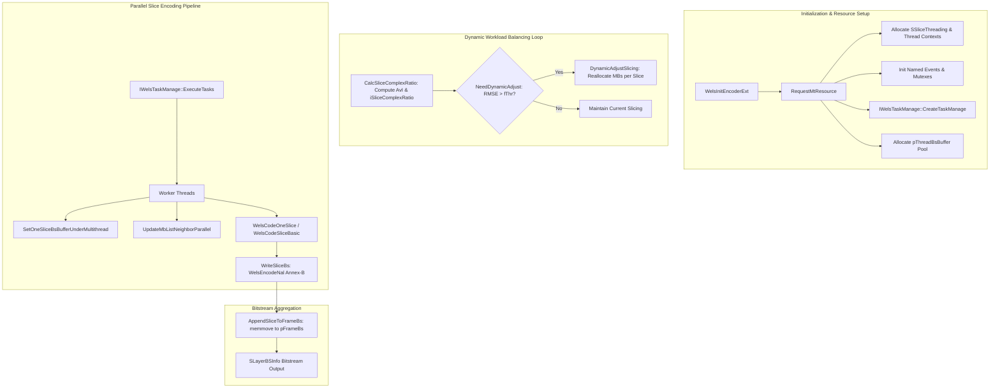
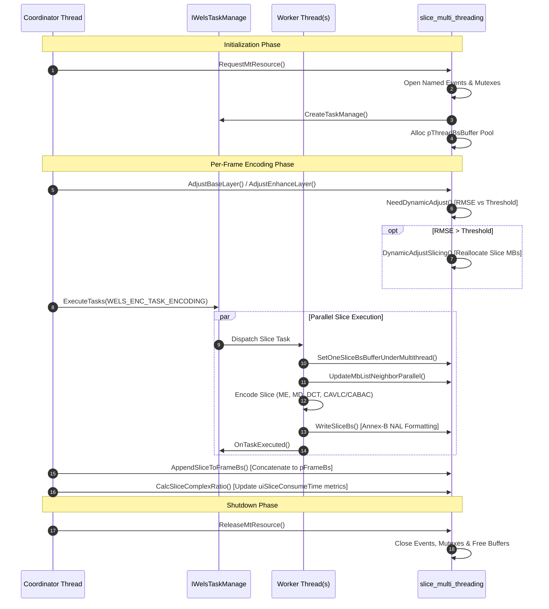

# OpenH264 Encoder: Multithreaded Slice Processing & Dynamic Workload Balancing (`slice_multi_threading.cpp`)

This document provides a comprehensive, literate-programming-style technical analysis of [codec/encoder/core/src/slice_multi_threading.cpp](openh264/codec/encoder/core/src/slice_multi_threading.cpp) and its associated header [codec/encoder/core/inc/slice_multi_threading.h](openh264/codec/encoder/core/inc/slice_multi_threading.h). It details OpenH264's slice-level multithreading architecture, the Root-Mean-Square Error (RMSE) dynamic load balancing algorithm, synchronization primitives, thread-local bitstream buffer management, and Annex-B NAL bitstream aggregation.

---

## Table of Contents
1. [Module Architecture & Concurrency Model](#1-module-architecture--concurrency-model)
2. [Data Structures, Types, and Constants](#2-data-structures-types-and-constants)
   - [2.1 `SSliceThreading` (`TagSliceThreading`)](#21-sslicethreading-tagsslicethreading)
   - [2.2 `SSliceThreadPrivateData` (`TagSliceThreadPrivateData`)](#22-sslicethreadprivatedata-tagslicethreadprivatedata)
   - [2.3 Slice Bitstream & Layer Structures](#23-slice-bitstream--layer-structures)
   - [2.4 Multithreading Constants & Thresholds](#24-multithreading-constants--thresholds)
3. [Deep-Dive Function Analysis](#3-deep-dive-function-analysis)
   - [3.1 Workload Analysis & Dynamic Slicing](#31-workload-analysis--dynamic-slicing)
     - [`CalcSliceComplexRatio`](#calcslicecomplexratio)
     - [`NeedDynamicAdjust`](#needdynamicadjust)
     - [`DynamicAdjustSlicing`](#dynamicadjustslicing)
     - [`AdjustBaseLayer`](#adjustbaselayer)
     - [`AdjustEnhanceLayer`](#adjustenhancelayer)
   - [3.2 Multithreading Resource Lifecycle](#32-multithreading-resource-lifecycle)
     - [`RequestMtResource`](#requestmtresource)
     - [`ReleaseMtResource`](#releasemtresource)
   - [3.3 Parallel Execution & Buffer Management](#33-parallel-execution--buffer-management)
     - [`UpdateMbListNeighborParallel`](#updatemblistneighborparallel)
     - [`SetOneSliceBsBufferUnderMultithread`](#setoneslicebsbufferundermultithread)
     - [`DynamicDetectCpuCores`](#dynamicdetectcpucores)
   - [3.4 Bitstream Serialization & NAL Packaging](#34-bitstream-serialization--nal-packaging)
     - [`WriteSliceBs`](#writeslicebs)
     - [`AppendSliceToFrameBs`](#appendslicetoframebs)
   - [3.5 Debug Profiling & Instrumentation (`MT_DEBUG`)](#35-debug-profiling--instrumentation-mt_debug)
4. [Call Graph & Concurrency State Machine](#4-call-graph--concurrency-state-machine)

---

## 1. Module Architecture & Concurrency Model

In OpenH264, real-time encoding throughput on multi-core CPUs is achieved through **Slice-Level Parallelism (SLP)**. A video frame (or spatial dependency layer `SDqLayer`) is partitioned into multiple independent slices. Because slice boundaries disable spatial intra prediction and context modeling dependencies across slice seams, each slice can be encoded concurrently by worker threads.

[slice_multi_threading.cpp](openh264/codec/encoder/core/src/slice_multi_threading.cpp) serves four essential architectural responsibilities:
1. **Dynamic Load Balancing**: Visual complexity varies across picture regions. Slices with high motion or complex textures take significantly longer to encode than background slices. The module dynamically computes per-slice execution time ratios and Root-Mean-Square Error ($RMSE$) variance, adjusting the number of macroblocks assigned to each slice on subsequent frames to balance core load.
2. **Resource Allocation & Lifecycle Management**: Initializes synchronization events (named POSIX semaphores / Windows events), mutexes, thread-local bitstream staging buffers (`pThreadBsBuffer`), and the thread-pool task manager interface ([IWelsTaskManage](openh264/codec/encoder/core/inc/wels_task_management.h)).
3. **Macroblock Neighborhood Cache Synchronization**: Coordinates macroblock boundary updates across slices executing in parallel ([UpdateMbListNeighborParallel](#updatemblistneighborparallel)).
4. **Bitstream Multiplexing & Annex-B NAL Aggregation**: Encapsulates raw slice bitstreams into NAL units via emulation-prevention byte stuffing ([WriteSliceBs](#writeslicebs)), and aggregates thread-local slice bitstreams into a single contiguous picture bitstream buffer ([AppendSliceToFrameBs](#appendslicetoframebs)).



---

## 2. Data Structures, Types, and Constants

### 2.1 `SSliceThreading` (`TagSliceThreading`)

Defined in [codec/encoder/core/inc/mt_defs.h](openh264/codec/encoder/core/inc/mt_defs.h#L68-L89), `SSliceThreading` is the central control structure managing thread synchronization, event handles, bitstream staging pools, and debugging files for slice-level multithreading.

```cpp
typedef struct TagSliceThreading {
  SSliceThreadPrivateData*        pThreadPEncCtx;                   // Per-thread context array [iThreadIdx]
  char                            eventNamespace[100];              // Unique event name suffix string
  WELS_THREAD_HANDLE              pThreadHandles[MAX_THREADS_NUM];  // OS thread handles
  WELS_EVENT                      pSliceCodedEvent[MAX_THREADS_NUM];// Signaled when slice encoding completes
  WELS_EVENT                      pSliceCodedMasterEvent;           // Signaled when any slice event fires
  WELS_EVENT                      pReadySliceCodingEvent[MAX_THREADS_NUM]; // Signaled to start slice coding
  WELS_EVENT                      pUpdateMbListEvent[MAX_THREADS_NUM];     // Signaled to update MB neighbors
  WELS_EVENT                      pFinUpdateMbListEvent[MAX_THREADS_NUM];  // Signaled upon MB update finish

  WELS_MUTEX                      mutexSliceNumUpdate;              // Guards dynamic slicing reallocations

#ifdef MT_DEBUG
  FILE*                           pFSliceDiff;                      // Debug log file handle ("slice_time.txt")
#endif

  uint8_t*                        pThreadBsBuffer[MAX_THREADS_NUM]; // Staging memory for slice bitstreams
  bool                            bThreadBsBufferUsage[MAX_THREADS_NUM]; // Occupancy flags for bitstream buffers
  WELS_MUTEX                      mutexThreadBsBufferUsage;         // Protects bitstream buffer checkout
  WELS_MUTEX                      mutexEvent;                       // Protects event operations
  WELS_MUTEX                      mutexThreadSlcBuffReallocate;     // Guards slice buffer reallocations
} SSliceThreading;
```

#### Field Details & Lifecycle
| Field | Type | Description |
| :--- | :--- | :--- |
| `pThreadPEncCtx` | `SSliceThreadPrivateData*` | Heap array allocated via `pMa->WelsMalloc` containing thread-private execution descriptors. Size equals `iMultipleThreadIdc`. |
| `eventNamespace` | `char[100]` | String uniquely identifying named semaphores/events. On POSIX platforms, formatted as `"%p%x"` (pointer address + PID) to prevent cross-process name collisions. |
| `pSliceCodedEvent` | `WELS_EVENT[MAX_THREADS_NUM]` | Event signaled by a worker thread upon completing slice reconstruction and entropy coding. |
| `pSliceCodedMasterEvent` | `WELS_EVENT` | Master event signaled to wake the coordinating thread when any worker thread finishes. |
| `pReadySliceCodingEvent` | `WELS_EVENT[MAX_THREADS_NUM]` | Event signaled by the coordinator thread to release a worker thread to begin slice processing. |
| `pUpdateMbListEvent` | `WELS_EVENT[MAX_THREADS_NUM]` | Event triggered to start parallel macroblock neighbor availability calculation. |
| `pFinUpdateMbListEvent` | `WELS_EVENT[MAX_THREADS_NUM]` | Event signaled when parallel macroblock neighbor updating completes. |
| `mutexSliceNumUpdate` | `WELS_MUTEX` | Mutex protecting dynamic slice reconfiguration during runtime encoding adjustments. |
| `pThreadBsBuffer` | `uint8_t*[MAX_THREADS_NUM]` | Array of pre-allocated raw memory buffers (each of size `iCountBsLen`) where worker threads write intermediate slice bitstreams in parallel. |
| `bThreadBsBufferUsage` | `bool[MAX_THREADS_NUM]` | Array of boolean occupancy flags tracking which thread bitstream buffers are currently checked out. |
| `mutexThreadBsBufferUsage`| `WELS_MUTEX` | Mutex serializing access to `bThreadBsBufferUsage` flags. |
| `mutexThreadSlcBuffReallocate` | `WELS_MUTEX` | Mutex guarding memory reallocation of slice buffers when macroblock counts expand dynamically. |

---

### 2.2 `SSliceThreadPrivateData` (`TagSliceThreadPrivateData`)

Defined in [codec/encoder/core/inc/mt_defs.h](openh264/codec/encoder/core/inc/mt_defs.h#L60-L66):

```cpp
typedef struct TagSliceThreadPrivateData {
  void*           pWelsPEncCtx;   // Pointer back to the parent sWelsEncCtx encoder context
  SFrameBSInfo*   pFrameBsInfo;   // Pointer to the target frame bitstream metadata structure
  int32_t         iSliceIndex;    // Zero-based slice index assigned to this thread
  int32_t         iThreadIndex;   // Zero-based worker thread index
} SSliceThreadPrivateData;
```

---

### 2.3 Slice Bitstream & Layer Structures

The multithreading engine directly operates on spatial dependency layers ([SDqLayer](openh264/codec/encoder/core/inc/encoder_context.h)) and slice representations ([SSlice](openh264/codec/encoder/core/inc/svc_enc_slice_segment.h)):

* **`SSlice`**: Contains slice runtime metrics and slice bitstream storage:
  * `uiSliceConsumeTime`: Execution time in microseconds consumed by encoding this slice on the preceding frame.
  * `iSliceComplexRatio`: Normalized complexity ratio scaled by `INT_MULTIPLY` ($100$).
  * `iCountMbNumInSlice`: Current number of macroblocks assigned to this slice.
  * `sSliceBs` ([SWelsSliceBs](openh264/codec/encoder/core/inc/svc_enc_slice_segment.h)): Slice bitstream buffer wrapper holding `pBs` (buffer pointer), `uiBsPos` (current write offset in bytes), `uiBsSize` (allocated capacity), `iNalIndex` (number of NAL units generated, $\le 2$), and `iNalLen` (array of NAL byte lengths).
* **`SDqLayer`**: Represents a spatial resolution layer:
  * `ppSliceInLayer`: Array of pointers to active `SSlice` objects for this layer.
  * `sSliceEncCtx` ([SSliceCtx](openh264/codec/encoder/core/inc/svc_enc_slice_segment.h)): Slice context holding `iSliceNumInFrame`, `iMbNumInFrame`, and `iMbWidth`.
  * `pFirstMbIdxOfSlice`: Array mapping slice index $\rightarrow$ starting macroblock raster index.
  * `pCountMbNumInSlice`: Array mapping slice index $\rightarrow$ count of macroblocks in the slice.
  * `bNeedAdjustingSlicing`: Boolean flag indicating whether slice boundaries require reallocation.

---

### 2.4 Multithreading Constants & Thresholds

Defined in [codec/encoder/core/inc/mt_defs.h](openh264/codec/encoder/core/inc/mt_defs.h#L56-L58), [codec/encoder/core/inc/rc.h](openh264/codec/encoder/core/inc/rc.h#L116), and [codec/common/inc/typedefs.h](openh264/codec/common/inc/typedefs.h#L83):

| Constant / Macro | Value | Description |
| :--- | :--- | :--- |
| `THRESHOLD_RMSE_CORE8` | `0.0320f` | RMSE variance threshold for dynamic slice adjustment with $\ge 8$ slices. |
| `THRESHOLD_RMSE_CORE4` | `0.0215f` | RMSE variance threshold for dynamic slice adjustment with $4 \le N_{\text{slices}} < 8$. |
| `THRESHOLD_RMSE_CORE2` | `0.0200f` | RMSE variance threshold for dynamic slice adjustment with $2 \le N_{\text{slices}} < 4$. |
| `INT_MULTIPLY` | `100` | Fixed-point integer scale factor for complexity ratio and rate control arithmetic. |
| `EPSN` | `0.000001f` ($10^{-6}$) | Floating-point epsilon to prevent division-by-zero and threshold rounding inaccuracies. |
| `SEM_NAME_MAX` | `32` | Maximum character length for named semaphore strings. |
| `MAX_THREADS_NUM` | `4` / Architecture Bound | Maximum number of concurrent worker threads supported. |
| `MAX_SLICES_NUM` | `35` | Maximum number of slices allowed in a single frame. |

---

## 3. Deep-Dive Function Analysis

### 3.1 Workload Analysis & Dynamic Slicing

#### `CalcSliceComplexRatio`

[slice_multi_threading.cpp:L88-L112](openh264/codec/encoder/core/src/slice_multi_threading.cpp#L88-L112)

```cpp
void CalcSliceComplexRatio (SDqLayer* pCurDq)
```

Computes the relative computational throughput and normalized complexity ratio for each slice based on its measured execution time (`uiSliceConsumeTime`) and macroblock count (`iCountMbNumInSlice`).

```
                              INT_MULTIPLY * iCountMbNumInSlice[i]
      iAvI[i]              = --------------------------------------
                                     uiSliceConsumeTime[i]

                              INT_MULTIPLY * iAvI[i]
      iSliceComplexRatio[i]= ------------------------
                                     sum(iAvI)
```

##### Mathematical Algorithm
1. For each slice $i \in [0, N_{\text{slices}} - 1]$, compute the speed metric $iAvI[i]$ (MBs encoded per unit time, scaled by $\text{INT\_MULTIPLY} = 100$):
   $$iAvI[i] = \text{round}\left( \frac{\text{INT\_MULTIPLY} \times \text{ppSliceInLayer}[i]\text{->iCountMbNumInSlice}}{\text{ppSliceInLayer}[i]\text{->uiSliceConsumeTime}} \right)$$
2. Accumulate the total throughput across all slices:
   $$iSumAv = \sum_{i=0}^{N_{\text{slices}}-1} iAvI[i]$$
3. In a second pass, compute the normalized complexity ratio for each slice:
   $$\text{ppSliceInLayer}[i]\text{->iSliceComplexRatio} = \text{round}\left( \frac{\text{INT\_MULTIPLY} \times iAvI[i]}{iSumAv} \right)$$

##### Key Implementation Details
- Calls `WelsEmms()` prior to integer division loops to clear MMX state and avoid x87/FPU register conflicts.
- Uses `WELS_DIV_ROUND(x, y)` which rounds to the nearest integer ($(\text{x} + (\text{y} \gg 1)) / \text{y}$).

---

#### `NeedDynamicAdjust`

[slice_multi_threading.cpp:L114-L166](openh264/codec/encoder/core/src/slice_multi_threading.cpp#L114-L166)

```cpp
int32_t NeedDynamicAdjust (SSlice** ppSliceInLayer, const int32_t iSliceNum)
```

Evaluates whether the distribution of encoding times across slices is sufficiently unbalanced to justify recalculating slice macroblock boundaries.

##### Mathematical Algorithm
1. Sums the total elapsed slice encoding time across all slices:
   $$T_{\text{total}} = \sum_{i=0}^{N-1} \text{ppSliceInLayer}[i]\text{->uiSliceConsumeTime}$$
   If $T_{\text{total}} == 0$ (e.g., first encoded frame), returns `false` (no adjustment).
2. Calculates the ideal mean time consumption ratio per slice:
   $$\bar{r} = \frac{1.0}{N}$$
3. Computes the Root-Mean-Square Error ($RMSE$) of the actual slice time ratios relative to the ideal uniform ratio $\bar{r}$:
   $$r_i = \frac{\text{ppSliceInLayer}[i]\text{->uiSliceConsumeTime}}{T_{\text{total}}}$$
   $$fRmse = \sqrt{ \frac{1}{N} \sum_{i=0}^{N-1} (r_i - \bar{r})^2 }$$
4. Evaluates $fRmse$ against the core-count-dependent threshold $fThr$:
   $$fThr = \text{EPSN} + \begin{cases} 
      0.0320f & \text{if } N \ge 8 \\
      0.0215f & \text{if } 4 \le N < 8 \\
      0.0200f & \text{if } 2 \le N < 4 \\
      1.0f    & \text{otherwise}
   \end{cases}$$
5. Returns `true` if $fRmse > fThr$, triggering dynamic slice adjustment.

---

#### `DynamicAdjustSlicing`

[slice_multi_threading.cpp:L168-L267](openh264/codec/encoder/core/src/slice_multi_threading.cpp#L168-L267)

```cpp
void DynamicAdjustSlicing (sWelsEncCtx* pCtx,
                           SDqLayer* pCurDqLayer,
                           int32_t iCurDid)
```

Dynamically recalculates the number of macroblocks assigned to each slice in `pCurDqLayer` to achieve uniform execution time across worker threads on subsequent frames.

##### Parameter Requirements & Guard Conditions
- **Slice Count Requirement**: Slicing adjustment requires $N_{\text{slices}} \ge 2$ and an even slice count (`!(kiCountSliceNum & 0x01)`).
- **Rate Control (RC) Alignment**:
  - When RC is active (`iRCMode != RC_OFF_MODE`), slice sizes must align to Group of Macroblocks (GOM) boundaries (`iNumberMbGom`). Each slice must contain at least one GOM:
    $$iMinimalMbNum = iNumMbInEachGom$$
    If $iNumMbInEachGom \times N_{\text{slices}} \ge N_{\text{MB}}$, adjustment is aborted.
  - When RC is disabled (`RC_OFF_MODE`), $iMinimalMbNum$ defaults to 1 macroblock row (`iMbWidth`). If 1 row per slice exceeds total capacity (e.g. ultra-wide aspect ratios), it falls back to $iMinimalMbNum = 1$.

##### Redistribution Algorithm
1. Initialize remaining macroblock pool: $iMbNumLeft = N_{\text{MB}}$.
2. Calculate initial upper limit on macroblocks assignable to any single slice:
   $$iMaximalMbNum = N_{\text{MB}} - (N_{\text{slices}} - 1) \times iMinimalMbNum$$
3. For slices $i = 0$ to $N_{\text{slices}} - 2$:
   - Calculate target MB count proportional to the slice complexity ratio:
     $$iNumMbAssigning = \text{round}\left( \frac{N_{\text{MB}} \times \text{ppSliceInLayer}[i]\text{->iSliceComplexRatio}}{\text{INT\_MULTIPLY}} \right)$$
   - Align to GOM boundary if RC is enabled:
     $$iNumMbAssigning = \left\lfloor \frac{iNumMbAssigning}{iNumMbInEachGom} \right\rfloor \times iNumMbInEachGom$$
   - Clamp to valid range $[iMinimalMbNum, iMaximalMbNum]$:
     $$iNumMbAssigning = \max\left(iMinimalMbNum, \min(iNumMbAssigning, iMaximalMbNum)\right)$$
   - Deduct assigned MBs: $iMbNumLeft \leftarrow iMbNumLeft - iNumMbAssigning$.
   - Record in run-length array: $iRunLen[i] = iNumMbAssigning$.
   - Update remaining slice upper bound:
     $$iMaximalMbNum = iMbNumLeft - (N_{\text{slices}} - i - 1) \times iMinimalMbNum$$
4. Assign all remaining macroblocks to the final slice:
   $$iRunLen[N_{\text{slices}} - 1] = iMbNumLeft$$
5. Commit the new macroblock partitioning by invoking `DynamicAdjustSlicePEncCtxAll(pCurDqLayer, iRunLen)` and update `pCurDqLayer->bNeedAdjustingSlicing`.

---

#### `AdjustBaseLayer`

[slice_multi_threading.cpp:L529-L555](openh264/codec/encoder/core/src/slice_multi_threading.cpp#L529-L555)

```cpp
int32_t AdjustBaseLayer (sWelsEncCtx* pCtx)
```

Performs dynamic slicing workload assessment for the base spatial dependency layer (`iDid = 0`).
1. Binds `pCtx->pCurDqLayer = pCtx->ppDqLayerList[0]`.
2. Calls [NeedDynamicAdjust](#needdynamicadjust) using base layer slice execution times.
3. If adjustment is needed, invokes [DynamicAdjustSlicing](#dynamicadjustslicing)`(pCtx, pCurDq, 0)`.
4. Returns `iNeedAdj`.

---

#### `AdjustEnhanceLayer`

[slice_multi_threading.cpp:L557-L600](openh264/codec/encoder/core/src/slice_multi_threading.cpp#L557-L600)

```cpp
int32_t AdjustEnhanceLayer (sWelsEncCtx* pCtx, int32_t iCurDid)
```

Performs dynamic slicing workload assessment for spatial enhancement layers (`iCurDid > 0`).

##### Complexity Modeling Selection Logic
The function chooses between two complexity modeling sources:
- **Spatial Cross-Layer Modeling (`kbModelingFromSpatial`)**:
  Used when a spatial reference layer exists (`pRefLayer != NULL`), the lower layer was encoded using fixed slice count mode (`SM_FIXEDSLCNUM_SLICE`), and the thread count satisfies $iMultipleThreadIdc \ge uiSliceNum_{\text{base}}$.
  In this mode, `NeedDynamicAdjust` uses slice timings from the lower spatial layer (`ppDqLayerList[iCurDid - 1]`).
- **Temporal Layer Modeling**:
  Otherwise, `NeedDynamicAdjust` evaluates slice timings from the current spatial layer's previous temporal frame (`ppDqLayerList[iCurDid]`).

If `iNeedAdj` is true, executes [DynamicAdjustSlicing](#dynamicadjustslicing)`(pCtx, pCtx->pCurDqLayer, iCurDid)`.

---

### 3.2 Multithreading Resource Lifecycle

#### `RequestMtResource`

[slice_multi_threading.cpp:L269-L379](openh264/codec/encoder/core/src/slice_multi_threading.cpp#L269-L379)

```cpp
int32_t RequestMtResource (sWelsEncCtx** ppCtx,
                           SWelsSvcCodingParam* pCodingParam,
                           const int32_t iCountBsLen,
                           const int32_t iMaxSliceBufferSize,
                           bool bDynamicSlice)
```

Allocates and initializes all multithreading synchronization objects, thread-private contexts, bitstream staging buffers, and task manager instances.

##### Initialization Sequence
1. **Validation**: Ensures `ppCtx`, `*ppCtx`, `pCodingParam`, and `iCountBsLen > 0` are valid.
2. **SSliceThreading Allocation**: Allocates `SSliceThreading` structure using `pMa->WelsMalloc`.
3. **Thread Contexts**: Allocates array of `SSliceThreadPrivateData` for `iThreadNum = pCodingParam->iMultipleThreadIdc` threads.
4. **Unique Event Namespace**:
   - On Windows: Formats `eventNamespace` as `"%p"` using encoder context pointer.
   - On POSIX: Formats `eventNamespace` as `"%p%x"` using context pointer and `getpid()`.
5. **Named Event Initialization**:
   For each thread $i \in [0, \text{iThreadNum} - 1]$, creates named OS events via `WelsEventOpen`:
   - `pUpdateMbListEvent[i]`: Named `"ud%d<namespace>"`
   - `pFinUpdateMbListEvent[i]`: Named `"fu%d<namespace>"`
   - `pSliceCodedEvent[i]`: Named `"sc%d<namespace>"`
   - `pReadySliceCodingEvent[i]`: Named `"rc%d<namespace>"`
   Also opens master completion event `pSliceCodedMasterEvent` (named `"scm<namespace>"`).
6. **Mutex Initialization**: Initializes `mutexSliceNumUpdate`, `mutexThreadBsBufferUsage`, `mutexEvent`, `mutexThreadSlcBuffReallocate`, and context-level `mutexEncoderError` via `WelsMutexInit`.
7. **Task Manager Instantiation**: Creates the task manager instance:
   ```cpp
   (*ppCtx)->pTaskManage = IWelsTaskManage::CreateTaskManage (*ppCtx, iNumSpatialLayers, bDynamicSlice);
   ```
8. **Thread Bitstream Buffers**: Queries thread pool size `iThreadBufferNum` and allocates zero-initialized heap buffers `pThreadBsBuffer[i]` of size `iCountBsLen` via `pMa->WelsMallocz`.

Returns `0` (`ENC_RETURN_SUCCESS`) on success, or `1` on failure (invoking `FreeMemorySvc` for cleanup).

---

#### `ReleaseMtResource`

[slice_multi_threading.cpp:L381-L445](openh264/codec/encoder/core/src/slice_multi_threading.cpp#L381-L445)

```cpp
void ReleaseMtResource (sWelsEncCtx** ppCtx)
```

Gracefully tears down and deallocates all multithreading synchronization primitives, thread pools, and bitstream buffers.

##### Deallocation Sequence
1. Closes all per-thread named events (`pSliceCodedEvent`, `pReadySliceCodingEvent`, `pUpdateMbListEvent`, `pFinUpdateMbListEvent`) and `pSliceCodedMasterEvent` via `WelsEventClose`.
2. Destroys all mutexes (`mutexSliceNumUpdate`, `mutexThreadBsBufferUsage`, `mutexThreadSlcBuffReallocate`, `mutexEncoderError`, `mutexEvent`) via `WelsMutexDestroy`.
3. Frees `pThreadPEncCtx` array via `pMa->WelsFree`.
4. Frees all bitstream buffers `pThreadBsBuffer[i]` and zeroes occupancy array `bThreadBsBufferUsage`.
5. Destroys task manager instance `pTaskManage` via `WELS_DELETE_OP`.
6. Closes MT debug file handle `pFSliceDiff` if open.
7. Frees `SSliceThreading` structure and zeroes `(*ppCtx)->pSliceThreading`.

---

### 3.3 Parallel Execution & Buffer Management

#### `UpdateMbListNeighborParallel`

[slice_multi_threading.cpp:L74-L86](openh264/codec/encoder/core/src/slice_multi_threading.cpp#L74-L86)

```cpp
void UpdateMbListNeighborParallel (SDqLayer* pCurDq,
                                   SMB* pMbList,
                                   const int32_t uiSliceIdc)
```

Updates spatial neighbor availability (left, top, top-left, top-right) and macroblock cache indices for all macroblocks belonging to a specific slice `uiSliceIdc`.

##### Execution Details
- Retrieves slice start raster index: `iIdx = pCurDq->pFirstMbIdxOfSlice[uiSliceIdc]`.
- Calculates slice end raster index: `kiEndMbInSlice = iIdx + pCurDq->pCountMbNumInSlice[uiSliceIdc] - 1`.
- Iterates from `iIdx` to `kiEndMbInSlice`, invoking `UpdateMbNeighbor (pCurDq, &pMbList[iIdx], kiMbWidth, uiSliceIdc)`.

---

#### `SetOneSliceBsBufferUnderMultithread`

[slice_multi_threading.cpp:L661-L665](openh264/codec/encoder/core/src/slice_multi_threading.cpp#L661-L665)

```cpp
void SetOneSliceBsBufferUnderMultithread (sWelsEncCtx* pCtx,
                                         const int32_t kiThreadIdx,
                                         SSlice* pSlice)
```

Binds pre-allocated thread-specific bitstream buffer `pThreadBsBuffer[kiThreadIdx]` to the target slice's `sSliceBs` container and resets the write pointer `uiBsPos = 0`.

---

#### `DynamicDetectCpuCores`

[slice_multi_threading.cpp:L523-L527](openh264/codec/encoder/core/src/slice_multi_threading.cpp#L523-L527)

```cpp
int32_t DynamicDetectCpuCores()
```

Queries the operating system for the number of active logical CPU processor cores by calling `WelsQueryLogicalProcessInfo(&info)` and returning `info.ProcessorCount`.

---

### 3.4 Bitstream Serialization & NAL Packaging

#### `WriteSliceBs`

[slice_multi_threading.cpp:L492-L520](openh264/codec/encoder/core/src/slice_multi_threading.cpp#L492-L520)

```cpp
int32_t WriteSliceBs (sWelsEncCtx* pCtx,
                      SWelsSliceBs* pSliceBs,
                      const int32_t iSliceIdx,
                      int32_t& iSliceSize)
```

Encapsulates raw slice RBSP bitstreams into Annex-B compliant NAL units with start codes and emulation prevention bytes.

##### Implementation Details
1. Verifies NAL count `kiNalCnt = pSliceBs->iNalIndex \le 2`.
2. Obtains SVC NAL unit header extension pointer `pNalHdrExt = &pCtx->pCurDqLayer->sLayerInfo.sNalHeaderExt`.
3. Iterates over each NAL unit $i \in [0, \text{kiNalCnt} - 1]$:
   - Calls `WelsEncodeNal (&pSliceBs->sNalList[i], pNalHdrExt, iTotalLeftLength - iSliceSize, pDst, &iNalSize)`.
   - Records NAL byte length in `pSliceBs->iNalLen[i] = iNalSize`.
   - Accumulates total slice byte size in `iSliceSize`.
   - Advances destination buffer pointer `pDst += iNalSize`.
4. Sets `pSliceBs->uiBsPos = iSliceSize` and returns `ENC_RETURN_SUCCESS`.

---

#### `AppendSliceToFrameBs`

[slice_multi_threading.cpp:L447-L490](openh264/codec/encoder/core/src/slice_multi_threading.cpp#L447-L490)

```cpp
int32_t AppendSliceToFrameBs (sWelsEncCtx* pCtx,
                              SLayerBSInfo* pLbi,
                              const int32_t iSliceCount)
```

Aggregates individual thread-local slice bitstream buffers (`sSliceBs`) into the primary contiguous frame bitstream buffer (`pCtx->pFrameBs`) and updates layer NAL unit metadata in [SLayerBSInfo](openh264/codec/api/wels/codec_app_def.h).

##### Buffer Concatenation Logic
1. Resets NAL counter in `SLayerBSInfo`: `pLbi->iNalCount = 0`.
2. For each slice index $0 \le i < \text{iSliceCount}$:
   - Inspects `pSliceBs = &ppSliceInlayer[i]->sSliceBs`.
   - **Buffer Overflow Protection**: Checks if appending exceeds frame buffer capacity:
     $$\text{iPosBsBuffer} + \text{uiBsPos} > \text{iFrameBsSize}$$
     If overflow occurs, logs an error, sets `pCtx->iEncoderError |= ENC_RETURN_MEMALLOCERR`, and aborts.
   - Copies slice bitstream:
     ```cpp
     memmove (pCtx->pFrameBs + pCtx->iPosBsBuffer, pSliceBs->pBs, pSliceBs->uiBsPos);
     ```
   - Advances write pointer: `pCtx->iPosBsBuffer += pSliceBs->uiBsPos`.
   - Copies individual NAL unit lengths into `pLbi->pNalLengthInByte` array and updates `pLbi->iNalCount`.
3. Returns the total byte size of the spatial layer bitstream (`iLayerSize`).

---

### 3.5 Debug Profiling & Instrumentation (`MT_DEBUG`)

When compiled with `-DMT_DEBUG`, the module enables two instrumentation routines for offline load-balancing diagnostics:

- **`TrackSliceComplexities`**: Writes normalized slice complexity ratios (`iSliceComplexRatio`) for each slice to `slice_time.txt`.
- **`TrackSliceConsumeTime`**: Logs execution durations (`uiSliceConsumeTime` in microseconds) for each slice and identifies the bottleneck slice (`uiMaxT`).

---

## 4. Call Graph & Concurrency State Machine


