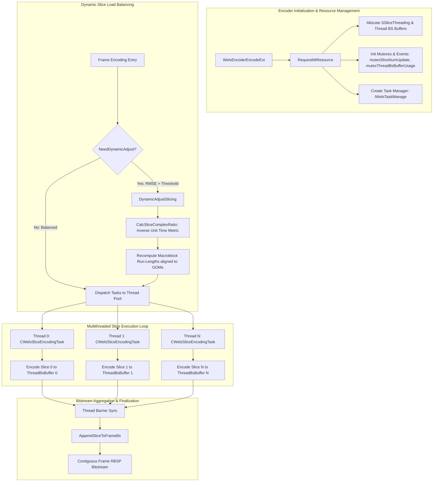
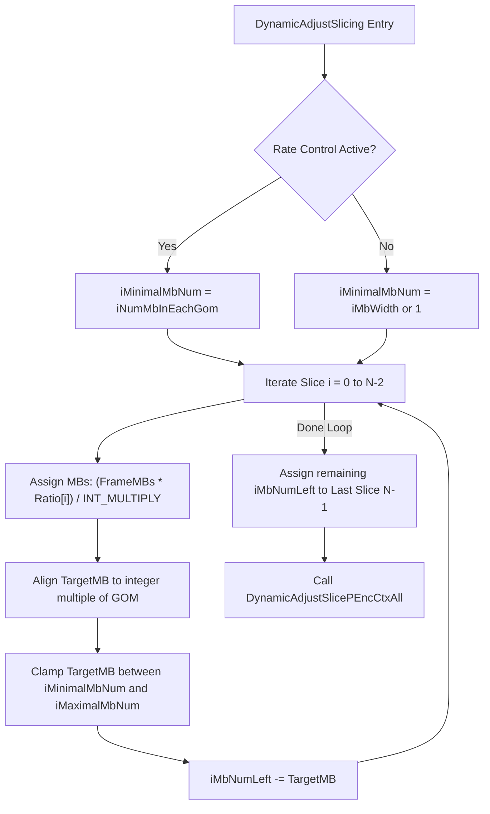
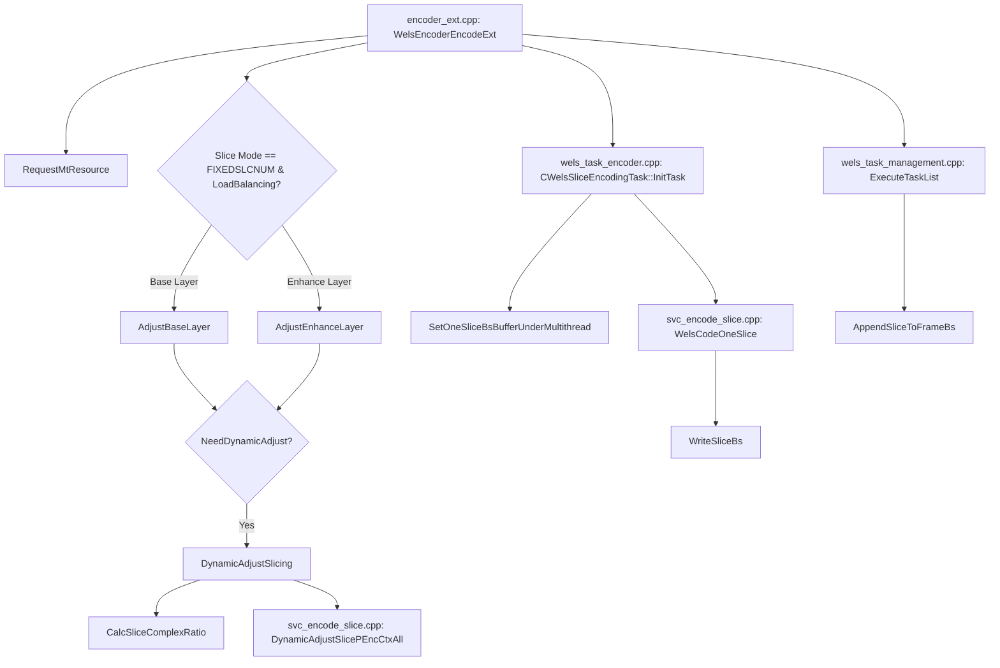

# OpenH264: Multithreaded Slice Processing & Dynamic Load Balancing

**Source Header File**: [`codec/encoder/core/inc/slice_multi_threading.h`](openh264/codec/encoder/core/inc/slice_multi_threading.h)  
**Source Implementation File**: [`codec/encoder/core/src/slice_multi_threading.cpp`](openh264/codec/encoder/core/src/slice_multi_threading.cpp)  
**Related Definitions & Task Headers**: [`codec/encoder/core/inc/mt_defs.h`](openh264/codec/encoder/core/inc/mt_defs.h), [`codec/encoder/core/inc/wels_task_management.h`](openh264/codec/encoder/core/inc/wels_task_management.h), [`codec/encoder/core/inc/encoder_context.h`](openh264/codec/encoder/core/inc/encoder_context.h)

---

## 1. High-Level Architectural Purpose & Module Overview

In modern video compression engines, real-time H.264 / AVC video encoding at high resolutions ($1080\text{p}$, $4\text{K}$) requires exploiting multi-core CPU parallelism. OpenH264 achieves scalable, low-latency parallel encoding through **slice-level multi-threading**.

The header [`slice_multi_threading.h`](openh264/codec/encoder/core/inc/slice_multi_threading.h) defines the core C/C++ interface for managing multithreaded slice encoding, resource allocation, dynamic workload rebalancing, and thread-safe bitstream aggregation.



### Key Architectural Tenets
1. **Slice Partitioning Modes**:
   - `SM_SINGLE_SLICE` ($0$): 1 slice per picture frame (single-threaded or layer-threaded).
   - `SM_FIXEDSLCNUM_SLICE` ($1$): Fixed $N$ slices per frame. Each slice is mapped to an independent worker thread in parallel.
   - `SM_RASTER_SLICE` ($2$): Slices partitioned by a fixed count of macroblocks in raster scan order.
   - `SM_SIZELIMITED_SLICE` ($3$): Slices dynamically partitioned according to Maximum Transmission Unit (MTU) packet size constraints.
2. **Dynamic Workload Rebalancing (Dynamic Slicing)**:
   In real-world scenes, image complexity varies spatially across a video frame (e.g., moving foreground actors vs. static background sky). If macroblocks are divided evenly by spatial area, threads encoding complex high-detail macroblocks take significantly longer than threads encoding flat macroblocks, causing thread stalling at synchronization barriers. OpenH264 measures the CPU execution time ($\text{uiSliceConsumeTime}$) of each slice and computes a **Root-Mean-Square Error (RMSE)** metric. When RMSE exceeds adaptive thresholds, `DynamicAdjustSlicing()` redistributes macroblock allocations across slices to equalize thread processing times.
3. **Thread-Isolated Bitstream Buffering**:
   Each worker thread writes entropy-coded NAL units to an independent, pre-allocated thread bitstream buffer (`pThreadBsBuffer`). After all worker threads complete execution, `AppendSliceToFrameBs()` concatenates the slice payloads into the continuous frame bitstream buffer (`pFrameBs`) in deterministic slice order.

---

## 2. Data Structures, Types, and Constants

The slice multithreading subsystem relies on definitions declared in [`codec/encoder/core/inc/mt_defs.h`](openh264/codec/encoder/core/inc/mt_defs.h), [`codec/encoder/core/inc/encoder_context.h`](openh264/codec/encoder/core/inc/encoder_context.h), and [`codec/encoder/core/inc/slice_multi_threading.h`](openh264/codec/encoder/core/inc/slice_multi_threading.h).

### 2.1 Constants and Threshold Macros

| Macro / Constant | Type / Value | Description |
| :--- | :--- | :--- |
| `THRESHOLD_RMSE_CORE8` | `float` ($0.0320f$) | RMSE threshold for 8 or more CPU cores. If the slice time standard deviation exceeds $3.2\%$, dynamic slice adjustment is triggered. |
| `THRESHOLD_RMSE_CORE4` | `float` ($0.0215f$) | RMSE threshold for 4 to 7 CPU cores ($2.15\%$). |
| `THRESHOLD_RMSE_CORE2` | `float` ($0.0200f$) | RMSE threshold for 2 to 3 CPU cores ($2.00\%$). |
| `EPSN` | `float` ($0.000001f$) | Small floating-point epsilon to avoid division by zero or underflow in variance calculation. |
| `INT_MULTIPLY` | `int32_t` ($10000$) | Fixed-point integer scaling factor used to maintain integer precision when computing slice complexity ratios. |
| `SEM_NAME_MAX` | `int32_t` ($32$) | Maximum character length for POSIX / Windows named event and semaphore identifiers. |

---

### 2.2 `SSliceThreadPrivateData` (`TagSliceThreadPrivateData`)

Defined in [`codec/encoder/core/inc/mt_defs.h`](openh264/codec/encoder/core/inc/mt_defs.h#L60-L66). Encapsulates thread-specific contextual parameters passed to each worker thread.

```cpp
typedef struct TagSliceThreadPrivateData {
  void*          pWelsPEncCtx;  // Pointer back to the parent sWelsEncCtx encoder context
  SFrameBSInfo*  pFrameBsInfo;  // Pointer to output frame bitstream information
  int32_t        iSliceIndex;   // Zero-based slice index assigned to this thread task
  int32_t        iThreadIndex;  // Zero-based thread index in the thread pool
} SSliceThreadPrivateData;
```

#### Field Breakdown & Lifecycle
* `pWelsPEncCtx` (`void*`): Cast to `sWelsEncCtx*` inside worker thread routines to access slice contexts, memory allocators, rate controllers, and configuration parameters.
* `pFrameBsInfo` (`SFrameBSInfo*`): Pointer to frame-level bitstream metadata containing NAL unit counts and layer lengths.
* `iSliceIndex` (`int32_t`): Identifies the specific slice ($0 \le \text{iSliceIndex} < \text{iSliceNumInFrame}$) assigned to this task.
* `iThreadIndex` (`int32_t`): Index ($0 \le \text{iThreadIndex} < \text{MAX\_THREADS\_NUM}$) used to index into thread-local buffer arrays (`pThreadBsBuffer`) and synchronization event handles.

---

### 2.3 `SSliceThreading` (`TagSliceThreading`)

Defined in [`codec/encoder/core/inc/mt_defs.h`](openh264/codec/encoder/core/inc/mt_defs.h#L68-L89). Central multithreading control block allocated inside `sWelsEncCtx::pSliceThreading`.

```cpp
typedef struct TagSliceThreading {
  SSliceThreadPrivateData* pThreadPEncCtx;                         // Thread context array [iThreadIdx]
  char                     eventNamespace[100];                    // Unique namespace prefix for named events
  WELS_THREAD_HANDLE       pThreadHandles[MAX_THREADS_NUM];        // OS thread handles [iThreadIdx]
  WELS_EVENT               pSliceCodedEvent[MAX_THREADS_NUM];      // Event signaled when slice finishes encoding
  WELS_EVENT               pSliceCodedMasterEvent;                 // Master event signaled by any finished slice
  WELS_EVENT               pReadySliceCodingEvent[MAX_THREADS_NUM];// Event signaling slice is ready for encoding
  WELS_EVENT               pUpdateMbListEvent[MAX_THREADS_NUM];    // Signal to update MB neighbor lists in parallel
  WELS_EVENT               pFinUpdateMbListEvent[MAX_THREADS_NUM]; // Signal indicating MB neighbor list finished
  WELS_MUTEX               mutexSliceNumUpdate;                    // Mutex protecting dynamic slice count adjustment
#ifdef MT_DEBUG
  FILE*                    pFSliceDiff;                            // Debug file handle for slice timing logs
#endif
  uint8_t*                 pThreadBsBuffer[MAX_THREADS_NUM];       // Aligned thread-local bitstream memory
  bool                     bThreadBsBufferUsage[MAX_THREADS_NUM];  // Allocation usage flags for thread buffers
  WELS_MUTEX               mutexThreadBsBufferUsage;               // Mutex protecting thread buffer checkout
  WELS_MUTEX               mutexEvent;                             // Mutex protecting event signaling
  WELS_MUTEX               mutexThreadSlcBuffReallocate;           // Mutex protecting slice buffer reallocation
} SSliceThreading;
```

#### Field Breakdown & Synchronization Primitives
* `pThreadPEncCtx`: Dynamically allocated array of `SSliceThreadPrivateData` of size `iMultipleThreadIdc`.
* `eventNamespace`: Unique string generated via `sprintf(eventNamespace, "%p%x", pCtx, getpid())` to avoid event collision across multiple encoder instances in the same process address space.
* `pSliceCodedEvent` / `pSliceCodedMasterEvent`: POSIX semaphores / Windows events for thread completion signaling.
* `pThreadBsBuffer`: Array of heap buffers allocated with 16-byte alignment via `CMemoryAlign::WelsMallocz()`. Each buffer holds up to `iCountBsLen` bytes.
* `mutexThreadBsBufferUsage`: Mutex locked when worker threads query and reserve an available buffer index via `QueryEmptyThread()`.

---

## 3. Comprehensive Function & Method Reference

All functions are declared inside the `WelsEnc` namespace in [`slice_multi_threading.h`](openh264/codec/encoder/core/inc/slice_multi_threading.h).

---

### 3.1 `UpdateMbListNeighborParallel`

```cpp
void UpdateMbListNeighborParallel (
    SDqLayer* pCurDq,
    SMB* pMbList,
    const int32_t kiSliceIdc
);
```

#### Purpose
Updates macroblock spatial neighbor availability bitmasks (`uiNeighborAvail`, `pNeighAvail`, `pLeft`, `pTop`, `pTopLeft`, `pTopRight`) for all macroblocks belonging to a specific slice partition in parallel.

#### Parameters
* `pCurDq` (`SDqLayer*`): Pointer to the current spatial dependency layer context.
* `pMbList` (`SMB*`): Pointer to the full frame macroblock array (`pCurDq->sMbDataP`).
* `kiSliceIdc` (`const int32_t`): Zero-based slice index to process.

#### Execution Flow & Logic
1. Accesses the slice encoding context `pSliceCtx = &pCurDq->sSliceEncCtx`.
2. Retrieves the starting macroblock index:
   $$i_{\text{start}} = \text{pCurDq->pFirstMbIdxOfSlice}[\text{kiSliceIdc}]$$
3. Computes the terminating macroblock index:
   $$i_{\text{end}} = i_{\text{start}} + \text{pCurDq->pCountMbNumInSlice}[\text{kiSliceIdc}] - 1$$
4. Iterates $i$ from $i_{\text{start}}$ through $i_{\text{end}}$, invoking [`UpdateMbNeighbor()`](openh264/codec/encoder/core/inc/svc_enc_macroblock.h) for each macroblock:
   ```cpp
   do {
     UpdateMbNeighbor (pCurDq, &pMbList[iIdx], kiMbWidth, uiSliceIdc);
     ++ iIdx;
   } while (iIdx <= kiEndMbInSlice);
   ```

---

### 3.2 `CalcSliceComplexRatio`

```cpp
void CalcSliceComplexRatio (SDqLayer* pCurDq);
```

#### Purpose
Calculates the normalized computational complexity ratio (`iSliceComplexRatio`) for each slice in a spatial layer based on measured CPU consumption time ($\text{uiSliceConsumeTime}$) and the number of macroblocks encoded in the slice ($\text{iCountMbNumInSlice}$).

#### Parameters
* `pCurDq` (`SDqLayer*`): Pointer to the spatial dependency layer context.

#### Mathematical Algorithm
1. Clears SIMD register state via `WelsEmms()`.
2. For each slice $i \in [0, N-1]$, computes the inverse time efficiency metric $AvI[i]$:
   $$AvI[i] = \left\lfloor \frac{\text{INT\_MULTIPLY} \times \text{iCountMbNumInSlice}[i]}{\text{uiSliceConsumeTime}[i]} + 0.5 \right\rfloor$$
   where $\text{INT\_MULTIPLY} = 10000$.
3. Sums all slice speed values:
   $$\text{SumAv} = \sum_{i=0}^{N-1} AvI[i]$$
4. Derives the normalized integer complexity ratio for each slice:
   $$\text{iSliceComplexRatio}[i] = \left\lfloor \frac{\text{INT\_MULTIPLY} \times AvI[i]}{\text{SumAv}} + 0.5 \right\rfloor$$

---

### 3.3 `NeedDynamicAdjust`

```cpp
int32_t NeedDynamicAdjust (
    SSlice** ppSliceInLayer,
    const int32_t iSliceNum
);
```

#### Purpose
Statistical decision engine that evaluates whether the timing variance across slices is large enough to justify dynamic slice repartitioning.

#### Parameters
* `ppSliceInLayer` (`SSlice**`): Array of slice pointer structures for the layer.
* `iSliceNum` (`const int32_t`): Total number of slices in the layer ($N$).

#### Return Value
* Returns `1` (`true`): Timing imbalance exceeds the core-count RMSE threshold; dynamic slicing adjustment should be performed.
* Returns `0` (`false`): Slices are evenly balanced or insufficient timing data is available.

#### Statistical Thresholding Formulation
1. Computes total frame slice execution time:
   $$T_{\text{total}} = \sum_{i=0}^{N-1} \text{uiSliceConsumeTime}[i]$$
   If $T_{\text{total}} = 0$ (e.g. first encoded frame), returns `false`.
2. Computes the ideal uniform slice time fraction $\bar{r} = \frac{1.0}{N}$.
3. Computes the Root-Mean-Square Error (RMSE) of observed slice time ratios:
   $$r_i = \frac{\text{uiSliceConsumeTime}[i]}{T_{\text{total}}}$$
   $$\text{RMSE} = \sqrt{\frac{1}{N} \sum_{i=0}^{N-1} (r_i - \bar{r})^2}$$
4. Compares $\text{RMSE}$ against adaptive core thresholds:
   $$\tau = \begin{cases} \text{EPSN} + \text{THRESHOLD\_RMSE\_CORE8} = 0.032001 & \text{if } N \ge 8 \\ \text{EPSN} + \text{THRESHOLD\_RMSE\_CORE4} = 0.021501 & \text{if } 4 \le N < 8 \\ \text{EPSN} + \text{THRESHOLD\_RMSE\_CORE2} = 0.020001 & \text{if } 2 \le N < 4 \\ 1.0 & \text{otherwise} \end{cases}$$
5. Returns `true` if $\text{RMSE} > \tau$.

---

### 3.4 `DynamicAdjustSlicing`

```cpp
void DynamicAdjustSlicing (
    sWelsEncCtx* pCtx,
    SDqLayer* pCurDqLayer,
    int32_t iCurDid
);
```

#### Purpose
Dynamically recalculates macroblock run-lengths assigned to each slice in a spatial layer based on complexity ratios, Rate Control GOM boundaries, and frame dimension limits.

#### Parameters
* `pCtx` (`sWelsEncCtx*`): Pointer to top-level encoder context.
* `pCurDqLayer` (`SDqLayer*`): Pointer to target spatial dependency layer.
* `iCurDid` (`int32_t`): Spatial dependency layer index.

#### Algorithmic Workflow



1. **Minimum Constraint Determination**:
   - If Rate Control is active (`iRCMode != RC_OFF_MODE`), `iMinimalMbNum` is set to `iNumberMbGom` (Group of Macroblocks size).
   - If Rate Control is disabled, `iMinimalMbNum` defaults to 1 macroblock row (`iMbWidth`), falling back to $1$ macroblock if the frame width exceeds total capacity.
2. **Iterative Allocation**:
   For each slice $i \in [0, N-2]$:
   - Proportional allocation:
     $$MB_{\text{target}} = \left\lfloor \frac{MB_{\text{total}} \times \text{iSliceComplexRatio}[i]}{\text{INT\_MULTIPLY}} + 0.5 \right\rfloor$$
   - Aligns $MB_{\text{target}}$ to a multiple of `iNumMbInEachGom` when Rate Control is active:
     $$MB_{\text{target}} = \left( \frac{MB_{\text{target}}}{iNumMbInEachGom} \right) \times iNumMbInEachGom$$
   - Clamps $MB_{\text{target}} \in [\text{iMinimalMbNum}, \text{iMaximalMbNum}]$.
   - Records $iRunLen[i] = MB_{\text{target}}$ and updates remaining macroblocks:
     $$MB_{\text{left}} = MB_{\text{left}} - MB_{\text{target}}$$
3. **Tail Slice Assignment**:
   The final slice ($i = N-1$) receives all remaining macroblocks: $iRunLen[N-1] = MB_{\text{left}}$.
4. **Context Application**:
   Applies new partition boundaries to encoder structures via [`DynamicAdjustSlicePEncCtxAll()`](openh264/codec/encoder/core/src/svc_encode_slice.cpp).

---

### 3.5 `RequestMtResource`

```cpp
int32_t RequestMtResource (
    sWelsEncCtx** ppCtx,
    SWelsSvcCodingParam* pCodingParam,
    const int32_t iCountBsLen,
    const int32_t iMaxSliceBufferSize,
    bool bDynamicSlice
);
```

#### Purpose
Allocates and initializes all multithreading resources, thread-private contexts, synchronization events/mutexes, task manager, and thread-local bitstream buffers.

#### Parameters
* `ppCtx` (`sWelsEncCtx**`): Double pointer to the encoder context.
* `pCodingParam` (`SWelsSvcCodingParam*`): Pointer to SVC encoder configuration parameters.
* `iCountBsLen` (`const int32_t`): Maximum size in bytes for each thread-local bitstream buffer.
* `iMaxSliceBufferSize` (`const int32_t`): Maximum target spatial bitstream buffer size.
* `bDynamicSlice` (`bool`): Flag indicating if dynamic slice sizing is active.

#### Return Value
* `0` (`ENC_RETURN_SUCCESS`): Initialization succeeded.
* `1` / Non-zero: Memory allocation error or mutex initialization failure.

#### Resource Allocation Sequence
1. Allocates `SSliceThreading` via `pMa->WelsMalloc(sizeof(SSliceThreading))`.
2. Allocates `SSliceThreadPrivateData` array for `iThreadNum` threads.
3. Generates unique semaphore name string `eventNamespace`.
4. Opens named/unnamed events for each thread index:
   - `pUpdateMbListEvent[iIdx]`
   - `pFinUpdateMbListEvent[iIdx]`
   - `pSliceCodedEvent[iIdx]`
   - `pReadySliceCodingEvent[iIdx]`
5. Opens master event `pSliceCodedMasterEvent`.
6. Initializes mutexes:
   - `mutexSliceNumUpdate`
   - `mutexThreadBsBufferUsage`
   - `mutexEvent`
   - `mutexThreadSlcBuffReallocate`
   - `mutexEncoderError`
7. Creates task manager via [`IWelsTaskManage::CreateTaskManage()`](openh264/codec/encoder/core/src/wels_task_management.cpp).
8. Allocates thread-local bitstream buffers `pThreadBsBuffer[iIdx]` with zero-initialized memory.

---

### 3.6 `ReleaseMtResource`

```cpp
void ReleaseMtResource (sWelsEncCtx** ppCtx);
```

#### Purpose
Tears down and frees all multithreading objects, closing OS event handles, destroying mutexes, deleting the task manager, and freeing allocated buffers.

#### Parameters
* `ppCtx` (`sWelsEncCtx**`): Double pointer to the encoder context.

#### Cleanup Sequence
1. Loops through `iThreadNum` threads and calls `WelsEventClose()` on:
   - `pSliceCodedEvent[i]`
   - `pReadySliceCodingEvent[i]`
   - `pUpdateMbListEvent[i]`
   - `pFinUpdateMbListEvent[i]`
2. Closes `pSliceCodedMasterEvent`.
3. Destroys all mutexes via `WelsMutexDestroy()`.
4. Frees `pThreadPEncCtx` array.
5. Frees all `pThreadBsBuffer[i]` allocations.
6. Deletes `pTaskManage` instance (`WELS_DELETE_OP((*ppCtx)->pTaskManage)`).
7. Frees `SSliceThreading` structure and resets `(*ppCtx)->pSliceThreading = NULL`.

---

### 3.7 `AppendSliceToFrameBs`

```cpp
int32_t AppendSliceToFrameBs (
    sWelsEncCtx* pCtx,
    SLayerBSInfo* pLbi,
    const int32_t iSliceCount
);
```

#### Purpose
Gathers completed slice bitstream buffers from worker threads and packs them sequentially into the contiguous layer bitstream buffer (`pCtx->pFrameBs`).

#### Parameters
* `pCtx` (`sWelsEncCtx*`): Pointer to encoder context.
* `pLbi` (`SLayerBSInfo*`): Pointer to layer bitstream metadata structure.
* `iSliceCount` (`const int32_t`): Number of slices in the layer.

#### Return Value
* Returns total aggregated layer bitstream size in bytes (`iLayerSize`), or `0` on memory overflow.

#### Safety & Aggregation Logic
1. Resets NAL index base: `pLbi->iNalCount = 0`.
2. For each slice $i \in [0, \text{iSliceCount}-1]$:
   - Accesses slice bitstream `pSliceBs = &ppSliceInlayer[i]->sSliceBs`.
   - If `pSliceBs->uiBsPos > 0`:
     - **Overflow Verification**:
       ```cpp
       if ((uint64_t)pCtx->iPosBsBuffer + pSliceBs->uiBsPos > (uint64_t)pCtx->iFrameBsSize) {
         pCtx->iEncoderError |= ENC_RETURN_MEMALLOCERR;
         return 0;
       }
       ```
     - Copies slice payload to contiguous frame buffer:
       ```cpp
       memmove (pCtx->pFrameBs + pCtx->iPosBsBuffer, pSliceBs->pBs, pSliceBs->uiBsPos);
       ```
     - Updates frame buffer write cursor: `pCtx->iPosBsBuffer += pSliceBs->uiBsPos`.
     - Appends individual NAL lengths into `pLbi->pNalLengthInByte`.
     - Updates `pLbi->iNalCount` and accumulates `iLayerSize`.

---

### 3.8 `DynamicDetectCpuCores`

```cpp
int32_t DynamicDetectCpuCores();
```

#### Purpose
Queries the operating system host environment to detect the number of active logical CPU processing cores.

#### Implementation
Invokes `WelsQueryLogicalProcessInfo(&info)` declared in [`codec/common/inc/cpu.h`](openh264/codec/common/inc/cpu.h) and returns `info.ProcessorCount`.

---

### 3.9 `AdjustBaseLayer` & `AdjustEnhanceLayer`

```cpp
int32_t AdjustBaseLayer (sWelsEncCtx* pCtx);
int32_t AdjustEnhanceLayer (sWelsEncCtx* pCtx, int32_t iCurDid);
```

#### Purpose
Entry points invoked before frame encoding to evaluate load balance and dynamically adjust slicing for spatial base layers (`iDid = 0`) and spatial enhancement layers (`iCurDid > 0`).

#### Parameters
* `pCtx` (`sWelsEncCtx*`): Pointer to encoder context.
* `iCurDid` (`int32_t`): Target spatial enhancement dependency layer index.

#### Return Value
* Returns `1` (`true`) if dynamic slicing was applied; `0` (`false`) otherwise.

#### Layer Dependency Logic
* **`AdjustBaseLayer()`**: Evaluates `NeedDynamicAdjust()` on base layer slices `ppDqLayerList[0]->ppSliceInLayer`. If true, calls `DynamicAdjustSlicing(pCtx, pCurDq, 0)`.
* **`AdjustEnhanceLayer()`**: 
  - Checks if spatial reference modeling is possible (`kbModelingFromSpatial`):
    $$\text{Condition} = (\text{pRefLayer} \ne \text{NULL}) \land (\text{uiSliceMode} == \text{SM\_FIXEDSLCNUM\_SLICE}) \land (\text{iMultipleThreadIdc} \ge \text{uiSliceNum})$$
  - If true, models complexity from the lower spatial layer $iCurDid - 1$.
  - Otherwise, models complexity from temporal history of the current layer $iCurDid$.

---

### 3.10 `SetOneSliceBsBufferUnderMultithread`

```cpp
void SetOneSliceBsBufferUnderMultithread (
    sWelsEncCtx* pCtx,
    const int32_t kiThreadIdx,
    SSlice* pSlice
);
```

#### Purpose
Binds a thread-local bitstream buffer (`pThreadBsBuffer[kiThreadIdx]`) to a specific slice object before encoding begins.

#### Implementation
```cpp
void SetOneSliceBsBufferUnderMultithread (sWelsEncCtx* pCtx, const int32_t kiThreadIdx, SSlice* pSlice) {
  SWelsSliceBs* pSliceBs  = &pSlice->sSliceBs;
  pSliceBs->pBsBuffer     = pCtx->pSliceThreading->pThreadBsBuffer[kiThreadIdx];
  pSliceBs->uiBsPos       = 0;
}
```

---

### 3.11 `WriteSliceBs`

```cpp
int32_t WriteSliceBs (
    sWelsEncCtx* pCtx,
    SWelsSliceBs* pSliceBs,
    const int32_t iSliceIdx,
    int32_t& iSliceSize
);
```

#### Purpose
Encapsulates Raw Byte Sequence Payload (RBSP) data into Annex B NAL units for a slice using [`WelsEncodeNal()`](openh264/codec/encoder/core/inc/nal_encap.h).

#### Parameters
* `pCtx` (`sWelsEncCtx*`): Pointer to encoder context.
* `pSliceBs` (`SWelsSliceBs*`): Pointer to slice bitstream container.
* `iSliceIdx` (`const int32_t`): Slice index.
* `iSliceSize` (`int32_t&`): Output reference receiving total generated slice byte size.

#### Return Value
* `ENC_RETURN_SUCCESS` ($0$) on success, or encoder error code on failure.

---

### 3.12 Diagnostic Functions (`MT_DEBUG`)

```cpp
#if defined(MT_DEBUG)
void TrackSliceComplexities (sWelsEncCtx* pCtx, const int32_t kiCurDid);
void TrackSliceConsumeTime (sWelsEncCtx* pCtx, int32_t* pDidList, const int32_t kiSpatialNum);
#endif
```

#### Purpose
When compiled with `MT_DEBUG`, writes detailed per-slice execution timestamps ($\mu s$), complexity ratios, and bottleneck thread metrics to the trace file `slice_time.txt` (`pFSliceDiff`).

---

## 4. Function Call Graph & Subsystem Interactions



---

## 5. Thread Safety, Synchronization, and Memory Integrity

1. **Bitstream Memory Protection**:
   Worker threads write only to their designated `pThreadBsBuffer[kiThreadIdx]`. Buffer usage is tracked via `bThreadBsBufferUsage[i]` and guarded by `mutexThreadBsBufferUsage` to prevent race conditions during thread checkout.
2. **Error Aggregation Across Threads**:
   Worker thread errors cannot be returned directly to the main thread via function returns. Instead, errors are bitwise OR-ed into the shared encoder context under mutex synchronization:
   ```cpp
   WelsMutexLock (&m_pCtx->mutexEncoderError);
   if (ENC_RETURN_SUCCESS != m_eTaskResult) {
     m_pCtx->iEncoderError |= m_eTaskResult;
   }
   WelsMutexUnlock (&m_pCtx->mutexEncoderError);
   ```
3. **Memory Overflow Verification**:
   `AppendSliceToFrameBs()` uses explicit 64-bit integer casts during boundary arithmetic (`(uint64_t)pCtx->iPosBsBuffer + pSliceBs->uiBsPos > (uint64_t)pCtx->iFrameBsSize`) to prevent integer overflow exploits on corrupted bitstream buffers.
