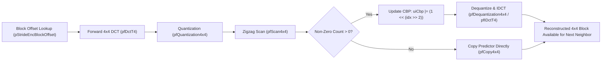

# OpenH264 Core Encoder: Macroblock Encoding & Reconstruction Engine (`svc_encode_mb.cpp`)

## 1. High-Level Architectural Role & Purpose

The source file [`svc_encode_mb.cpp`](openh264/codec/encoder/core/src/svc_encode_mb.cpp) (paired with its header [`svc_encode_mb.h`](openh264/codec/encoder/core/inc/svc_encode_mb.h)) implements the core **Macroblock (MB) Encoding and Local Reconstruction Loop** for the OpenH264 SVC/AVC encoder.

Once mode decision ([`svc_mode_decision.cpp`](openh264/codec/encoder/core/src/svc_mode_decision.cpp)) or motion estimation ([`svc_motion_estimate.cpp`](openh264/codec/encoder/core/src/svc_motion_estimate.cpp)) determines the optimal prediction mode for a $16 \times 16$ macroblock, the encoding engine must:
1. **Transform Residuals**: Compute the 2D forward $4 \times 4$ Integer Discrete Cosine Transform (DCT) and, for Intra $16 \times 16$ or Chroma DC blocks, second-stage $4 \times 4$ or $2 \times 2$ Hadamard transforms.
2. **Quantization & Dead-Zone Rounding**: Scale and quantize transform coefficients according to the macroblock's Luma/Chroma Quantization Parameters ($\text{QP}_{\text{Y}}$ and $\text{QP}_{\text{C}}$) using dead-zone rounding offsets.
3. **Scan & Non-Zero Counting**: Perform 2D-to-1D zigzag scanning into entropy arrays and calculate non-zero coefficient counts (`pNonZeroCount`) across all sub-blocks.
4. **Fast Zero-Block Early Termination (JVT-O079)**: Statistically evaluate high-frequency transform energy against adaptive thresholds (`iSingleCtrMb`, `iSingleCtr8x8`) to eliminate dequantization/IDCT and skip residual coding for blocks below visual perceptibility limits.
5. **Dequantization & Inverse Transform (IDCT)**: Inverse-quantize and inverse-transform significant coefficients to recover the reconstructed residual signal.
6. **Local Sample Reconstruction**: Add the reconstructed residual back to spatial/temporal predictors, clamp values to $[0, 255]$, and store reconstructed luma/chroma samples in the dependency layer's reference picture buffer (`pCsMb`).

```mermaid
flowchart TD
    subgraph MB Encoding & Reconstruction Pipeline
        A["Pixel Residual (Original - Prediction)"] --> B["Forward 4x4 Integer DCT (pfDctFourT4 / pfDctT4)"]
        B --> C{"Macroblock Type"}
        
        C -->|Intra 16x16| D["4x4 Luma DC Hadamard Transform (pfTransformHadamard4x4Dc)"]
        C -->|Intra 4x4 / Inter| E["4x4 AC Quantization (pfQuantizationFour4x4 / pfQuantization4x4)"]
        
        D --> F["Quantize DC Hadamard (pfQuantizationDc4x4)"]
        F --> E
        
        E --> G["Zigzag Scan & Coefficient Counting (pfScan4x4 / pfGetNoneZeroCount)"]
        G --> H{"JVT-O079 Fast Zero-Block Check"}
        
        H -->|iSingleCtrMb < 6 (Inter)| I["Early Zero Cutoff (Zero 768B Residual, CBP=0)"]
        H -->|Significant Residual| J["Dequantization (pfDequantizationFour4x4 / pfDequantization4x4)"]
        
        J --> K["Inverse Transform / IDCT (pfIDctFourT4 / pfIDctT4)"]
        K --> L["Reconstruct Pixels: Rec = Clip(Pred + IDCT_Res)"]
        I --> M["Reconstruct Pixels: Rec = Copy(Pred)"]
        
        L --> N["Write to Reconstructed Frame Buffer (pCsMb)"]
        M --> N
    end
```

---

## 2. Core Data Structures & Type Interactions

Although [`svc_encode_mb.cpp`](openh264/codec/encoder/core/src/svc_encode_mb.cpp) contains pure C++ algorithmic functions, it operates directly upon core encoder state structures:

### 2.1 Macroblock State Structure: [`SMB`](openh264/codec/encoder/core/inc/svc_enc_macroblock.h#L49-L90) / `TagMB`

| Field Name | Type | Size / Bit-depth | Architectural Purpose & Lifecycle in `svc_encode_mb.cpp` |
| :--- | :--- | :--- | :--- |
| `uiLumaQp` | `uint8_t` | 8-bit ($0 \dots 51$) | Active Luma Quantization Parameter ($\text{QP}_{\text{Y}}$) used to index forward/inverse quantization tables. |
| `uiChromaQp` | `uint8_t` | 8-bit ($0 \dots 51$) | Active Chroma Quantization Parameter ($\text{QP}_{\text{C}}$) derived via [`g_kuiChromaQpTable`](openh264/codec/encoder/core/src/svc_encode_mb.cpp#L355). |
| `uiCbp` | `uint8_t` | 8-bit bitmask | Coded Block Pattern. Bits $0 \dots 3$ represent non-zero AC coefficients in the four $8 \times 8$ Luma quadrants. Bits $4 \dots 5$ represent Chroma DC ($0x10$) and Chroma AC ($0x20$). |
| `pNonZeroCount` | `int8_t[24]` | 24 bytes | Array tracking the number of non-zero transform coefficients for each $4 \times 4$ sub-block ($0 \dots 15$: Luma, $16 \dots 19$: Cb, $20 \dots 23$: Cr). Used by CAVLC/CABAC entropy coders for context modeling. |
| `uiMbType` | `Mb_Type` | 32-bit enum | Macroblock mode flag (`MB_TYPE_INTRA4x4`, `MB_TYPE_INTRA16x16`, `MB_TYPE_16x16`, `MB_TYPE_SKIP`, etc.). |

### 2.2 Macroblock Scratchpad Cache: [`SMbCache`](openh264/codec/encoder/core/inc/mb_cache.h#L110-L137)

| Field Name | Type | Alignment / Buffer Size | Usage in `svc_encode_mb.cpp` |
| :--- | :--- | :--- | :--- |
| `pCoeffLevel` | `int16_t*` | 16-byte aligned, 768 bytes ($384 \times \text{int16}$) | Intermediate storage for transformed and quantized coefficients (256 Luma + 64 Cb + 64 Cr). |
| `pDct` | `SDctMb*` | Pointer to struct | Pointer to zigzag scanned coefficient arrays (`iLumaBlock[16][16]`, `iLumaI16x16Dc[16]`, `iChromaBlock[8][16]`, `iChromaDc[2][4]`). |
| `SPicData.pEncMb` | `uint8_t*[3]` | Planar Y/U/V pointers | Pointers to source original macroblock uncompressed pixel data. |
| `SPicData.pCsMb` | `uint8_t*[3]` | Planar Y/U/V pointers | Pointers to local reconstructed picture buffer destinations where newly reconstructed samples are written. |
| `pMemPredLuma` | `uint8_t*` | 16-byte aligned ($16 \times 16 = 256$ B) | Contiguous $16 \times 16$ predictor buffer for Intra $16 \times 16$ luma prediction samples. |
| `pBestPredI4x4Blk4` | `uint8_t*` | 16-byte aligned ($4 \times 4 = 16$ B) | Scratchpad buffer for the best Intra $4 \times 4$ prediction sub-block. |
| `pSkipMb` | `uint8_t*` | 16-byte aligned (384 B) | Cached motion-compensated prediction samples for `P_SKIP` macroblocks (256B Luma, 64B Cb, 64B Cr). |

### 2.3 Encoder Context & Dependency Layer: [`sWelsEncCtx`](openh264/codec/encoder/core/inc/encoder_context.h#L116-L238) & [`SDqLayer`](openh264/codec/encoder/core/inc/encoder_context.h)

- `pFuncList`: Pointer to [`SWelsFuncPtrList`](openh264/codec/encoder/core/inc/wels_func_ptr_def.h#L52-L102), providing dynamically initialized SIMD/assembly optimized function pointers.
- `pCurDqLayer`: Pointer to the active spatial layer context containing frame strides:
  - `iEncStride[0]`: Original source frame luma pitch in bytes.
  - `iCsStride[0]`: Reconstructed frame luma pitch in bytes.
- `pStrideTab`: Stride lookup table containing precalculated sub-block memory offsets (`pStrideEncBlockOffset`, `pStrideDecBlockOffset`).

---

## 3. Global Constants & Quantization Lookup Tables

Quantization and dequantization in H.264 rely on precomputed lookup tables indexed by $\text{QP}$:

```cpp
ALIGNED_DECLARE (extern const int16_t, g_kiQuantMF[52][8], 16);
ALIGNED_DECLARE (extern const int16_t, g_kiQuantInterFF[58][8], 16);
#define g_iQuantIntraFF (g_kiQuantInterFF + 6)
ALIGNED_DECLARE (extern const uint16_t, g_kuiDequantCoeff[52][8], 16);
extern const uint8_t g_kuiMbCountScan4Idx[24];
extern const uint8_t g_kuiChromaQpTable[52];
```

1. **Multiplication Factor Table (`g_kiQuantMF[52][8]`)**:
   Contains scaled forward quantization multiplication factors $MF_{ij}(q_m)$ for $q_m = \text{QP} \pmod 6$.
2. **Dead-Zone Rounding Tables (`g_kiQuantInterFF` / `g_iQuantIntraFF`)**:
   Contains dead-zone rounding offsets $f$. Intra mode uses a smaller dead-zone ($f \approx \frac{1}{3} \cdot 2^{15 + \lfloor \text{QP}/6 \rfloor}$) to preserve fine texture detail, whereas Inter mode uses a wider dead-zone ($f \approx \frac{1}{6} \cdot 2^{15 + \lfloor \text{QP}/6 \rfloor}$) to suppress high-frequency temporal noise.
3. **Dequantization Table (`g_kuiDequantCoeff[52][8]`)**:
   Contains inverse quantization scaling multipliers $V_{ij}(q_m) \cdot 2^{\lfloor \text{QP}/6 \rfloor}$.
4. **Scan-4 Block Index Table (`g_kuiMbCountScan4Idx[24]`)**:
   Maps the linear $4 \times 4$ sub-block execution order ($0 \dots 15$ for Luma, $16 \dots 19$ for Cb, $20 \dots 23$ for Cr) into the standard H.264 $4 \times 4$ neighbor context layout inside `pCurMb->pNonZeroCount`.

---

## 4. In-Depth Function Breakdown

```
svc_encode_mb.cpp
├── WelsDctMb()            -> Computes 4x4 forward DCT on all four 8x8 quadrants of a 16x16 MB
├── WelsEncRecI16x16Y()     -> Full DCT, DC Hadamard, Quant, Scan, IDCT & Rec for Intra 16x16 Luma
├── WelsEncRecI4x4Y()       -> Forward DCT, Quant, Scan, IDCT & Rec for a single Intra 4x4 sub-block
├── WelsEncInterY()         -> Quantization, JVT-O079 fast zero cutoff, Scan & Dequant for Inter Luma
├── WelsEncRecUV()          -> 2x2 Hadamard DC & 4x4 AC Quant, JVT-O079 cutoff & Dequant for Chroma
├── WelsRecPskip()          -> Sample copying and non-zero count clearing for P_SKIP macroblocks
├── WelsTryPYskip()         -> Evaluates JVT-O079 zero-block criteria for Luma P_SKIP mode candidate
└── WelsTryPUVskip()        -> Evaluates JVT-O079 zero-block criteria for Chroma P_SKIP mode candidate
```

---

### 4.1 `WelsDctMb`

[svc_encode_mb.cpp:L47-L52](openh264/codec/encoder/core/src/svc_encode_mb.cpp#L47-L52)

```cpp
void WelsDctMb (int16_t* pRes, uint8_t* pEncMb, int32_t iEncStride, uint8_t* pBestPred, PDctFunc pfDctFourT4);
```

#### Purpose & Mathematical Formulation
Executes the forward $4 \times 4$ integer DCT on all sixteen $4 \times 4$ residual blocks within a $16 \times 16$ luma macroblock. It divides the $16 \times 16$ macroblock into four $8 \times 8$ quadrants and invokes the SIMD kernel `pfDctFourT4` once per quadrant.

For each $4 \times 4$ residual block $D = X_{\text{orig}} - X_{\text{pred}}$, the forward integer DCT calculates:
$$W = C_f \cdot D \cdot C_f^T$$
where $C_f$ is the H.264 integer transform matrix:
$$C_f = \begin{pmatrix} 1 & 1 & 1 & 1 \\ 2 & 1 & -1 & -2 \\ 1 & -1 & -1 & 1 \\ 1 & -2 & 2 & -1 \end{pmatrix}$$

#### Parameter Breakdown
- `pRes`: Pointer to the output transform coefficient buffer (`int16_t*`, 256 elements).
- `pEncMb`: Pointer to the top-left source pixel of the $16 \times 16$ macroblock in the original frame buffer.
- `iEncStride`: Stride (row pitch in bytes) of the source image buffer.
- `pBestPred`: Pointer to the contiguous $16 \times 16$ predictor buffer (`stride = 16`).
- `pfDctFourT4`: SIMD/C function pointer computing four $4 \times 4$ DCTs concurrently.

#### Memory Layout & Quadrant Offsets
```
Quadrant 0 (Top-Left):     pEncMb + 0                  pBestPred + 0     pRes + 0
Quadrant 1 (Top-Right):    pEncMb + 8                  pBestPred + 8     pRes + 64
Quadrant 2 (Bottom-Left):  pEncMb + 8 * iEncStride     pBestPred + 128   pRes + 128
Quadrant 3 (Bottom-Right): pEncMb + 8 * iEncStride + 8 pBestPred + 136   pRes + 192
```

---

### 4.2 `WelsEncRecI16x16Y`

[svc_encode_mb.cpp:L54-L138](openh264/codec/encoder/core/src/svc_encode_mb.cpp#L54-L138)

```cpp
void WelsEncRecI16x16Y (sWelsEncCtx* pEncCtx, SMB* pCurMb, SMbCache* pMbCache);
```

#### Purpose & Encoding Flow
Implements the complete encoding and local reconstruction pipeline for an **`Intra_16x16` Luma** macroblock.

#### Algorithmic Steps & Mathematical Breakdown

1. **Stack Buffer Allocation**:
   Allocates a 16-byte aligned local stack buffer `aDctT4Dc[16]` via `ENFORCE_STACK_ALIGN_1D` to hold the 16 DC coefficients.

2. **Forward 4x4 DCT**:
   Calls [`WelsDctMb`](openh264/codec/encoder/core/src/svc_encode_mb.cpp#L71) to compute forward DCT on all 256 luma residual samples, storing result in `pRes`.

3. **4x4 DC Hadamard Transform & Quantization**:
   Extracts the DC coefficient from each of the 16 sub-blocks and applies the $4 \times 4$ Hadamard transform:
   $$H_{\text{DC}} = H_4 \cdot W_{\text{DC}} \cdot H_4^T, \quad H_4 = \begin{pmatrix} 1 & 1 & 1 & 1 \\ 1 & 1 & -1 & -1 \\ 1 & -1 & -1 & 1 \\ 1 & -1 & 1 & -1 \end{pmatrix}$$
   Quantizes the Hadamard-transformed DC coefficients via `pfQuantizationDc4x4`:
   $$Z_{\text{DC}, ij} = \text{sign}(H_{\text{DC}, ij}) \cdot \left\lfloor \frac{|H_{\text{DC}, ij}| \cdot MF_{00} + 2f}{2^{16 + q_e}} \right\rfloor$$
   Counts non-zero quantized DC coefficients `uiCountI16x16Dc`.

4. **4x4 AC Quantization & Zigzag Scan**:
   Quantizes AC coefficients across the four $8 \times 8$ quadrants via `pfQuantizationFour4x4` and scans them into `pBlock` (`pMbCache->pDct->iLumaBlock`) via `pfScan4x4Ac`. Records non-zero counts in `pCurMb->pNonZeroCount`.

5. **Inverse DC Hadamard & Dequantization**:
   If `uiCountI16x16Dc > 0`:
   - If $\text{QP} < 12$: Applies inverse Hadamard [`WelsIHadamard4x4Dc`](openh264/codec/encoder/core/src/svc_encode_mb.cpp#L99) followed by DC dequantization [`WelsDequantLumaDc4x4`](openh264/codec/encoder/core/src/svc_encode_mb.cpp#L100).
   - If $\text{QP} \ge 12$: Applies combined inverse Hadamard and dequantization via `pfDequantizationIHadamard4x4`.

6. **Sample Reconstruction Branches**:
   - **Branch A (`uiNoneZeroCountMbAc > 0`)**: Both AC and DC coefficients are present. Sets `uiCbp = 15`. Dequantizes AC blocks via `pfDequantizationFour4x4`, injects the dequantized DC coefficients back into the DC position (`pRes[0]`, `pRes[16]`, `pRes[32]`, $\dots$) of each $4 \times 4$ block, and reconstructs samples via `pfIDctFourT4`:
     $$X'_{\text{rec}} = \text{clip}_{0..255} \left( X_{\text{pred}} + \text{IDCT}(Z') \right)$$
   - **Branch B (`uiNoneZeroCountMbAc == 0 && uiCountI16x16Dc > 0`)**: Only DC coefficients are non-zero. Invokes optimized fast kernel `pfIDctI16x16Dc` to add uniform DC bias across each $4 \times 4$ sub-block.
   - **Branch C (`uiNoneZeroCountMbAc == 0 && uiCountI16x16Dc == 0`)**: All coefficients quantized to zero. Invokes `pfCopy16x16Aligned` to copy prediction directly to reconstructed frame buffer.

---

### 4.3 `WelsEncRecI4x4Y`

[svc_encode_mb.cpp:L139-L178](openh264/codec/encoder/core/src/svc_encode_mb.cpp#L139-L178)

```cpp
void WelsEncRecI4x4Y (sWelsEncCtx* pEncCtx, SMB* pCurMb, SMbCache* pMbCache, uint8_t uiI4x4Idx);
```

#### Purpose
Encodes and immediately reconstructs a single $4 \times 4$ sub-block (`uiI4x4Idx` $\in [0, 15]$) within an **`Intra_4x4` Luma** macroblock.

> [!NOTE]
> Unlike Inter or Intra $16 \times 16$ modes which process the entire macroblock at once, `Intra_4x4` must encode and reconstruct sub-blocks **sequentially in raster order**. This is because neighboring subsequent $4 \times 4$ blocks depend on the reconstructed pixel boundaries of preceding $4 \times 4$ blocks for spatial intra prediction.



#### Detailed Execution
1. Resolves sub-block spatial memory offsets via `pStrideEncBlockOffset[uiI4x4Idx]` and `pStrideDecBlockOffset[uiI4x4Idx]`.
2. Computes forward $4 \times 4$ DCT via `pfDctT4`.
3. Quantizes via `pfQuantization4x4` using Intra rounding factor `pFF = g_iQuantIntraFF[uiQp]`.
4. Zigzag scans into `pMbCache->pDct->iLumaBlock[uiI4x4Idx]` and counts non-zero coefficients `iNoneZeroCount`.
5. If `iNoneZeroCount > 0`:
   - Sets the Coded Block Pattern bit for the corresponding $8 \times 8$ block: `pCurMb->uiCbp |= (1 << (uiI4x4Idx >> 2))`.
   - Dequantizes via `pfDequantization4x4`.
   - Reconstructs pixels via `pfIDctT4`.
6. Else (`iNoneZeroCount == 0`):
   - Fast path: copies prediction pixels directly into destination buffer via `pfCopy4x4`.

---

### 4.4 `WelsEncInterY`

[svc_encode_mb.cpp:L180-L242](openh264/codec/encoder/core/src/svc_encode_mb.cpp#L180-L242)

```cpp
void WelsEncInterY (SWelsFuncPtrList* pFuncList, SMB* pCurMb, SMbCache* pMbCache);
```

#### Purpose & Fast JVT-O079 Early Termination
Performs quantization, zigzag scanning, and dequantization for **Inter-coded Luma** macroblocks (`P_16x16`, `P_16x8`, `P_8x16`, `P_8x8`). Forward DCT has already been computed during motion estimation / mode decision.

This function implements the **JVT-O079 Fast Zero-Block Detection Algorithm** to avoid costly dequantization, IDCT, and entropy coding for negligible inter residual energy:

#### Algorithm Details
1. **Parallel Quantization with Max-Magnitude Extraction**:
   Invokes `pfQuantizationFour4x4Max` on four $4 \times 4$ blocks simultaneously. It returns the quantized coefficients and `aMax[4]`, where:
   $$aMax[j] = \max_{k \in [0..15]} |Z_{j, k}|$$
2. **Sub-block Threshold Accumulation**:
   For each sub-block $j \in [0..3]$ in $8 \times 8$ block $i$:
   - If $aMax[j] == 0$: All coefficients are 0; zeroes memory via `pfSetMemZeroSize8(pBlock, 32)`.
   - If $aMax[j] > 1$: Sub-block has at least one coefficient $> 1$; adds $+9$ to `iSingleCtr8x8[i]`.
   - If $aMax[j] == 1$: Scans coefficients via `pfScan4x4` and evaluates `pfCalculateSingleCtr4x4(pBlock)`.
   Accumulates `iSingleCtrMb += iSingleCtr8x8[i]`.

3. **Macroblock & Block Level Pruning**:
   $$\text{Macroblock Pruning Rule: } \text{If } iSingleCtrMb < 6 \implies \text{All coefficients forced to } 0$$
   - When `iSingleCtrMb < 6`: The entire $16 \times 16$ residual is zeroed out (768 bytes via `pfSetMemZeroSize64`), `uiCbp` remains 0, and all non-zero counts are cleared.
   - When `iSingleCtrMb >= 6`: Each $8 \times 8$ block $i$ is checked individually:
     - If `iSingleCtr8x8[i] >= 4`: Quantized coefficients are retained, non-zero counts recorded, dequantized via `pfDequantizationFour4x4`, and `pCurMb->uiCbp |= (1 << i)`.
     - If `iSingleCtr8x8[i] < 4`: The $8 \times 8$ block is forced to zero (128 bytes cleared via `pfSetMemZeroSize64`).

---

### 4.5 `WelsEncRecUV`

[svc_encode_mb.cpp:L244-L312](openh264/codec/encoder/core/src/svc_encode_mb.cpp#L244-L312)

```cpp
void WelsEncRecUV (SWelsFuncPtrList* pFuncList, SMB* pCurMb, SMbCache* pMbCache, int16_t* pRes, int32_t iUV);
```

#### Purpose
Processes transform, quantization, JVT-O079 thresholding, and dequantization for Chroma planes ($U$ / Cb when `iUV = 1`, $V$ / Cr when `iUV = 2`).

#### Mathematical Equations
1. **2x2 Chroma DC Hadamard Transform & Quantization**:
   The four DC coefficients from the $4 \times 4$ chroma sub-blocks form a $2 \times 2$ matrix $W_{\text{DC, chroma}}$:
   $$H_{\text{DC, chroma}} = \begin{pmatrix} 1 & 1 \\ 1 & -1 \end{pmatrix} \cdot W_{\text{DC, chroma}} \cdot \begin{pmatrix} 1 & 1 \\ 1 & -1 \end{pmatrix}$$
   Quantized via `pfQuantizationHadamard2x2`.

2. **Chroma AC Quantization & JVT-O079 Threshold**:
   Quantizes AC blocks via `pfQuantizationFour4x4Max`.
   - If Inter MB (`kiInterFlag == true`): If cumulative `iSingleCtr8x8 < 7`, all Chroma AC coefficients are zeroed out (`pfSetMemZeroSize64(pRes, 128)`).
   - If Intra MB: `iSingleCtr8x8 = INT_MAX` (threshold cutoff bypassed).

3. **Chroma CBP Updates**:
   - If AC coefficients exist: `pCurMb->uiCbp |= 0x20` (CBP Chroma = 2).
   - If DC coefficients exist (`uiNoneZeroCountMbDc > 0`):
     - Inverse $2 \times 2$ Hadamard dequantization via [`WelsDequantIHadamard2x2Dc`](openh264/codec/encoder/core/src/svc_encode_mb.cpp#L304):
       $$W'_{\text{DC, chroma}} = \begin{pmatrix} 1 & 1 \\ 1 & -1 \end{pmatrix} \cdot Z_{\text{DC, chroma}} \cdot \begin{pmatrix} 1 & 1 \\ 1 & -1 \end{pmatrix} \cdot \frac{V_{00}(q_m)}{2}$$
     - If CBP Chroma bit 5 is not set, sets bit 4 (`pCurMb->uiCbp |= 0x10`, CBP Chroma = 1).
     - Injects DC coefficients into `pRes[0]`, `pRes[16]`, `pRes[32]`, `pRes[48]`.

---

### 4.6 `WelsRecPskip`

[svc_encode_mb.cpp:L315-L323](openh264/codec/encoder/core/src/svc_encode_mb.cpp#L315-L323)

```cpp
void WelsRecPskip (SDqLayer* pCurLayer, SWelsFuncPtrList* pFuncList, SMB* pCurMb, SMbCache* pMbCache);
```

#### Purpose
Performs fast sample reconstruction for **`P_SKIP`** macroblocks.

For `P_SKIP` macroblocks, the residual is defined to be zero ($\text{CBP} = 0$). The reconstructed picture is identical to the motion-compensated prediction from the reference frame:
- **Luma (16x16)**: Copied via `pfCopy16x16Aligned(pCsMb[0], iRecStrideY, pMbCache->pSkipMb, 16)`.
- **Chroma Cb (8x8)**: Copied via `pfCopy8x8Aligned(pCsMb[1], iRecStrideUV, pMbCache->pSkipMb + 256, 8)`.
- **Chroma Cr (8x8)**: Copied via `pfCopy8x8Aligned(pCsMb[2], iRecStrideUV, pMbCache->pSkipMb + 320, 8)`.
- Clears all 24 non-zero count entries in `pCurMb->pNonZeroCount` using `pfSetMemZeroSize8(..., 24)`.

---

### 4.7 `WelsTryPYskip` & `WelsTryPUVskip`

[svc_encode_mb.cpp:L325-L381](openh264/codec/encoder/core/src/svc_encode_mb.cpp#L325-L381)

```cpp
bool WelsTryPYskip  (sWelsEncCtx* pEncCtx, SMB* pCurMb, SMbCache* pMbCache);
bool WelsTryPUVskip (sWelsEncCtx* pEncCtx, SMB* pCurMb, SMbCache* pMbCache, int32_t iUV);
```

#### Purpose & Return Values
Predicative test functions used during mode decision to determine if a candidate macroblock qualifies for `P_SKIP` encoding without generating non-zero transform coefficients:

| Function | Test Condition | Return Value |
| :--- | :--- | :--- |
| `WelsTryPYskip` | Luma residual quantization check. Early returns `false` if any $aMax[j] > 1$ or if $\sum \text{iSingleCtr} \ge 6$. | `true` if Luma residual quantizes completely to zero; `false` otherwise. |
| `WelsTryPUVskip` | Chroma residual ($U$ or $V$) quantization check. Early returns `false` if DC Hadamard skip fails (`pfQuantizationHadamard2x2Skip`), any AC $aMax[j] > 1$, or $\text{iSingleCtrMb} \ge 7$. | `true` if Chroma residual quantizes completely to zero; `false` otherwise. |

---

## 5. SIMD Acceleration & Hardware Dispatch Matrix

The functions in `svc_encode_mb.cpp` dispatch performance-critical kernels through `SWelsFuncPtrList`. Below is the hardware acceleration matrix across CPU architectures:

| Kernel Function Pointer | C/C++ Fallback | x86 / x86_64 (SSE2, AVX2) | ARM / AArch64 (NEON) | MIPS / LoongArch (MMI, LSX, LASX) |
| :--- | :--- | :--- | :--- | :--- |
| `pfDctFourT4` | `WelsDctFourT4_c` | `WelsDctFourT4_sse2` | `WelsDctFourT4_neon` | `WelsDctFourT4_lasx` |
| `pfDctT4` | `WelsDctT4_c` | `WelsDctT4_sse2` | `WelsDctT4_neon` | `WelsDctT4_lasx` |
| `pfQuantizationFour4x4Max` | `WelsQuantFour4x4Max_c` | `WelsQuantFour4x4Max_sse2` / `avx2` | `WelsQuantFour4x4Max_neon` | `WelsQuantFour4x4Max_mmi` / `lsx` |
| `pfQuantizationHadamard2x2` | `WelsQuantizationHadamard2x2_c` | `WelsQuantizationHadamard2x2_sse2` | `WelsQuantizationHadamard2x2_neon` | `WelsQuantizationHadamard2x2_mmi` |
| `pfIDctFourT4` | `WelsIDctFourT4Rec_c` | `WelsIDctFourT4Rec_sse2` / `avx2` | `WelsIDctFourT4Rec_neon` | `WelsIDctFourT4Rec_lasx` |
| `pfIDctI16x16Dc` | `WelsIDctRecI16x16Dc_c` | `WelsIDctRecI16x16Dc_sse2` | `WelsIDctRecI16x16Dc_neon` | `WelsIDctRecI16x16Dc_mmi` |
| `pfCopy16x16Aligned` | `WelsCopy16x16_c` | `WelsCopy16x16_sse2` | `WelsCopy16x16_neon` | `WelsCopy16x16_mmi` |

---

## 6. Summary of Key Architectural Insights

1. **JVT-O079 Zero-Block Cutoff**: By evaluating the maximum coefficient magnitude `aMax` and the statistical counter `iSingleCtrMb`, OpenH264 skips dequantization, IDCT, and CAVLC/CABAC symbol generation for up to 60-80% of inter blocks in typical videoconferencing scenes.
2. **Stack Alignment Constraints**: `ENFORCE_STACK_ALIGN_1D` guarantees 16-byte alignment for intermediate DC transform arrays (`aDctT4Dc`), preventing vector alignment faults in SSE2/AVX2/NEON SIMD instructions.
3. **Sequential Dependency in `Intra_4x4`**: `WelsEncRecI4x4Y` explicitly couples transform, quantization, and immediate IDCT pixel reconstruction on each individual $4 \times 4$ sub-block to maintain spatial intra-prediction feedback loops across neighboring blocks.
