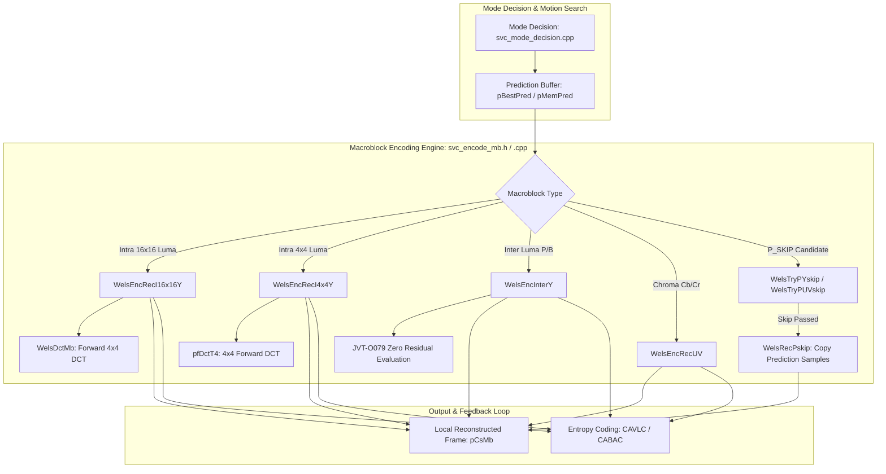
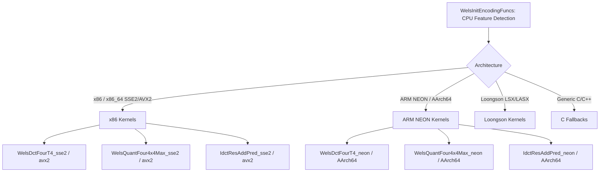
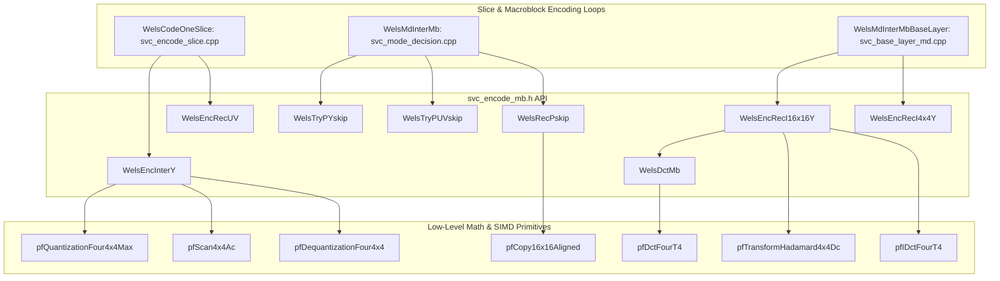

# OpenH264 Encoder: Macroblock Encoding & Reconstruction Engine (`svc_encode_mb.h`)

This document provides a comprehensive, literate-programming-style technical analysis of [codec/encoder/core/inc/svc_encode_mb.h](openh264/codec/encoder/core/inc/svc_encode_mb.h) and its corresponding implementation [codec/encoder/core/src/svc_encode_mb.cpp](openh264/codec/encoder/core/src/svc_encode_mb.cpp). It details the core macroblock encoding and reconstruction engine for the H.264 / AVC / SVC encoder, covering forward integer DCT transformation, Hadamard matrix processing, dead-zone quantization, coefficient scanning, JVT-O079 fast zero-residual thresholding, inverse quantization/IDCT reconstruction, and early-termination skip testing.

---

## Table of Contents
1. [Module Architecture & Pipeline Role](#1-module-architecture--pipeline-role)
2. [Data Structures, Type Definitions, and Constants](#2-data-structures-type-definitions-and-constants)
   - [2.1 Context & State Structures (`sWelsEncCtx`, `SMB`, `SMbCache`, `SDqLayer`)](#21-context--state-structures-swelsencctx-smb-smbcache-sdqlayer)
   - [2.2 Function Pointer Interfaces (`SWelsFuncPtrList`)](#22-function-pointer-interfaces-swelsfuncptrlist)
   - [2.3 Quantization Tables, Scan Mappings, and Bitmasks](#23-quantization-tables-scan-mappings-and-bitmasks)
3. [Deep-Dive Function Analysis](#3-deep-dive-function-analysis)
   - [3.1 `WelsDctMb`](#31-welsdctmb)
   - [3.2 `WelsEncRecI16x16Y`](#32-welsencreci16x16y)
   - [3.3 `WelsEncRecI4x4Y`](#33-welsencreci4x4y)
   - [3.4 `WelsEncInterY`](#34-welsencintery)
   - [3.5 `WelsEncRecUV`](#35-welsencrecuv)
   - [3.6 `WelsRecPskip`](#36-welsrecpskip)
   - [3.7 `WelsTryPYskip`](#37-welstrypyskip)
   - [3.8 `WelsTryPUVskip`](#38-welstrypuvskip)
4. [Mathematical Foundations & Algorithmic Optimizations](#4-mathematical-foundations--algorithmic-optimizations)
   - [4.1 4x4 Forward and Inverse Integer DCT](#41-4x4-forward-and-inverse-integer-dct)
   - [4.2 4x4 and 2x2 Hadamard Transforms](#42-4x4-and-2x2-hadamard-transforms)
   - [4.3 Dead-Zone Quantization & Dequantization](#43-dead-zone-quantization--dequantization)
   - [4.4 JVT-O079 Zero-Residual Fast Decision Algorithm](#44-jvt-o079-zero-residual-fast-decision-algorithm)
5. [Hardware Acceleration & SIMD Dispatch](#5-hardware-acceleration--simd-dispatch)
6. [Call Graph & Interaction Matrix](#6-call-graph--interaction-matrix)

---

## 1. Module Architecture & Pipeline Role

In the OpenH264 encoding pipeline ([svc_encode_slice.cpp](openh264/codec/encoder/core/src/svc_encode_slice.cpp) and [svc_mode_decision.cpp](openh264/codec/encoder/core/src/svc_mode_decision.cpp)), macroblock encoding operates at the critical junction between **Mode Decision (MD)**, **Residual Transformation & Quantization**, and **Local Picture Reconstruction**.

The functions declared in [svc_encode_mb.h](openh264/codec/encoder/core/inc/svc_encode_mb.h) perform three indispensable roles:
1. **Forward Transformation & Quantization**: Computes residual pixel differences ($S_{\text{orig}} - S_{\text{pred}}$), executes forward $4 \times 4$ integer Discrete Cosine Transforms (DCT) and Hadamard transforms, applies scalar dead-zone quantization, and arranges quantized transform levels in zigzag order.
2. **Local Closed-Loop Reconstruction**: Dequantizes transform coefficients, computes inverse integer DCT / Hadamard transforms, adds the inverse residual back to the prediction samples, and writes reconstructed pixels ($S'$) into the local decoded frame buffer ([pCsMb](openh264/codec/encoder/core/inc/mb_cache.h#L133)) to ensure encoder-decoder drift-free closed-loop prediction.
3. **Fast Early-Termination & Skip Decision**: Implements rate-distortion optimizations (such as the JVT-O079 single-counter zero-residual criterion) to quickly identify macroblocks or sub-blocks with negligible residual energy, bypassing expensive transforms and signaling `P_SKIP` or zero Coded Block Patterns (`uiCbp = 0`).



---

## 2. Data Structures, Type Definitions, and Constants

### 2.1 Context & State Structures (`sWelsEncCtx`, `SMB`, `SMbCache`, `SDqLayer`)

The functions in [svc_encode_mb.h](openh264/codec/encoder/core/inc/svc_encode_mb.h) operate primarily on four core data structures:

#### A. Macroblock Metadata: [SMB](openh264/codec/encoder/core/inc/svc_enc_macroblock.h#L49-L78) (`TagMB`)
Encapsulates all syntax, partitioning, quantization, and coding state for a single $16 \times 16$ macroblock:
* `uiMbType` (`Mb_Type` / `uint32_t`): Macroblock type bitmask (`MB_TYPE_INTRA4x4`, `MB_TYPE_INTRA16x16`, `MB_TYPE_16x16`, `MB_TYPE_SKIP`, etc.).
* `uiCbp` (`uint8_t`): Coded Block Pattern bitmask. Bits $0..3$ correspond to luma $8 \times 8$ blocks ($1 \ll i$). Bits $4..5$ indicate chroma residual status ($0 = \text{no chroma residual}$, $1 = \text{chroma DC only}$, $2 = \text{chroma DC + AC}$).
* `pNonZeroCount` (`int8_t*`): Array of size 24 (`MB_LUMA_CHROMA_BLOCK4x4_NUM`). Tracks the count of non-zero transform coefficients for each $4 \times 4$ sub-block (indices $0..15$ for Luma, $16..19$ for Cb, $20..23$ for Cr).
* `uiLumaQp` (`uint8_t`): Quantization parameter for luma ($0..51$).
* `uiChromaQp` (`uint8_t`): Quantization parameter for chroma ($0..51$).

#### B. Working Scratchpad: [SMbCache](openh264/codec/encoder/core/inc/mb_cache.h#L72-L137) (`TagMbCache`)
Per-slice / per-thread scratchpad holding temporary buffers for predictions, transform coefficients, and frame pointers:
* `pCoeffLevel` (`int16_t*`): Intermediate $16$-bit buffer storing unquantized DCT residuals and dequantized coefficients. Sized for 384 entries (256 for Luma, 64 for Cb, 64 for Cr).
* `pDct` ([SDCTCoeff*](openh264/codec/encoder/core/inc/mb_cache.h#L62-L70)): Structured matrix container:
  * `iLumaBlock[16][16]` (`int16_t`): Zigzag-scanned quantized AC/DC levels for sixteen $4 \times 4$ luma blocks.
  * `iLumaI16x16Dc[16]` (`int16_t`): Zigzag-scanned quantized DC levels for Intra $16 \times 16$ luma.
  * `iChromaBlock[8][16]` (`int16_t`): Zigzag-scanned quantized AC levels for eight $4 \times 4$ chroma blocks.
  * `iChromaDc[2][4]` (`int16_t`): $2 \times 2$ Hadamard DC transform coefficients for Cb and Cr planes.
* `SPicData`: Triplet array of pixel pointers for Y, Cb, Cr planes:
  * `pEncMb[3]` (`uint8_t*`): Pointers to the current macroblock in the source input frame.
  * `pCsMb[3]` (`uint8_t*`): Pointers to the current macroblock in the local reconstruction frame.
* `pSkipMb` (`uint8_t*`): Motion-compensated pixel prediction buffer for `P_SKIP` macroblocks (256 bytes for Luma, 64 for Cb, 64 for Cr).
* `pMemPredLuma`, `pBestPredI4x4Blk4` (`uint8_t*`): Optimal spatial intra prediction buffers.

#### C. Spatial Layer: [SDqLayer](openh264/codec/encoder/core/inc/encoder_context.h)
Encapsulates layer strides and frame buffers:
* `iEncStride[3]` (`int32_t`): Row stride in bytes for source input planes (Y, Cb, Cr).
* `iCsStride[3]` (`int32_t`): Row stride in bytes for local reconstructed planes (Y, Cb, Cr).

---

### 2.2 Function Pointer Interfaces (`SWelsFuncPtrList`)

All compute-intensive kernels are invoked via function pointers in [SWelsFuncPtrList](openh264/codec/encoder/core/inc/wels_func_ptr_def.h#L198-L296), dynamically populated with SIMD assembly (x86 SSE2/AVX2, ARM NEON/AArch64, MIPS MMI, Loongson LSX/LASX) or C reference fallbacks:

| Function Pointer Typedef | Signature / Description |
| :--- | :--- |
| `PDctFunc` | `void (*PDctFunc)(int16_t* pDct, uint8_t* pSample1, int32_t iStride1, uint8_t* pSample2, int32_t iStride2)`<br>Computes forward $4 \times 4$ integer DCT on residual difference $(pSample1 - pSample2)$. |
| `PTransformHadamard4x4Func` | `void (*PTransformHadamard4x4Func)(int16_t* pLumaDc, int16_t* pDct)`<br>Executes $4 \times 4$ Hadamard transform on DC coefficients extracted from 16 DCT blocks. |
| `PQuantizationFunc` | `void (*PQuantizationFunc)(int16_t* pDct, const int16_t* pFF, const int16_t* pMF)`<br>Performs dead-zone scalar quantization on $4 \times 4$ or four $4 \times 4$ blocks. |
| `PQuantizationMaxFunc` | `void (*PQuantizationMaxFunc)(int16_t* pDct, const int16_t* pFF, const int16_t* pMF, int16_t* pMax)`<br>Quantizes four $4 \times 4$ blocks concurrently and returns the maximum absolute quantized coefficient `pMax[0..3]`. |
| `PQuantizationHadamardFunc` | `int32_t (*PQuantizationHadamardFunc)(int16_t* pRes, const int16_t kiFF, int16_t iMF, int16_t* pDct, int16_t* pBlock)`<br>Transforms and quantizes $2 \times 2$ chroma DC Hadamard block; returns non-zero count. |
| `PScanFunc` | `void (*PScanFunc)(int16_t* pLevel, int16_t* pDct)`<br>Reorders $4 \times 4$ transform coefficients from raster to zigzag scan order (`pfScan4x4` or `pfScan4x4Ac`). |
| `PCalculateSingleCtrFunc` | `int32_t (*PCalculateSingleCtrFunc)(int16_t* pDct)`<br>Evaluates JVT-O079 single $\pm 1$ run-rate threshold for an AC block. |
| `PGetNoneZeroCountFunc` | `int32_t (*PGetNoneZeroCountFunc)(int16_t* pLevel)`<br>Returns the number of non-zero quantized coefficients in a zigzag-scanned block. |
| `PDeQuantizationFunc` | `void (*PDeQuantizationFunc)(int16_t* pRes, const uint16_t* kpQpTable)`<br>Performs inverse quantization on $4 \times 4$ transform blocks. |
| `PIDctFunc` | `void (*PIDctFunc)(uint8_t* pRec, int32_t iStride, uint8_t* pPred, int32_t iPredStride, int16_t* pRes)`<br>Computes $4 \times 4$ inverse integer DCT (IDCT), adds prediction samples, clamps to $[0, 255]$, and writes to reconstructed frame. |

---

### 2.3 Quantization Tables, Scan Mappings, and Bitmasks

#### A. Quantization Matrices & Constants
* `g_kiQuantMF[52][8]`: Multiplication factor table $MF(QP \pmod 6, q_{ij})$ used during scalar quantization.
* `g_iQuantIntraFF[52]`: Rounding offset factor $f$ for intra blocks ($f \approx 1/3 \times 2^{15+QP/6}$).
* `g_kiQuantInterFF[58][8]`: Rounding offset factor $f$ for inter blocks ($f \approx 1/6 \times 2^{15+QP/6}$).
* `g_kuiDequantCoeff[52][8]`: Dequantization scaling factor table $V(QP \pmod 6, q_{ij}) \ll (QP / 6)$.
* `g_kuiChromaQpTable[52]`: Standard H.264 mapping table from Luma QP to Chroma QP ($\text{clip3}(0, 51, QP_Y + \Delta QP_{chroma})$).

#### B. Scan Tables & Macros
* `g_kuiMbCountScan4Idx[24]`: Mapping table converting $4 \times 4$ sub-block index ($0..23$) to the corresponding offset in `pCurMb->pNonZeroCount`.
* `ENFORCE_STACK_ALIGN_1D(type, var, size, align)`: Macro ensuring 16-byte stack alignment for local SIMD buffers (e.g. `aDctT4Dc`).
* `ST16(p, val)`: 16-bit word write store helper macro.

---

## 3. Deep-Dive Function Analysis

### 3.1 `WelsDctMb`

[svc_encode_mb.h:L51](openh264/codec/encoder/core/inc/svc_encode_mb.h#L51), [svc_encode_mb.cpp:L47-L52](openh264/codec/encoder/core/src/svc_encode_mb.cpp#L47-L52)

```cpp
void WelsDctMb (int16_t* pRes, uint8_t* pEncMb, int32_t iEncStride, uint8_t* pBestPred, PDctFunc pfDctFourT4);
```

#### Purpose
Computes the forward $4 \times 4$ integer DCT for all sixteen $4 \times 4$ luma blocks of a $16 \times 16$ macroblock by partitioning the macroblock into four $8 \times 8$ quadrants.

#### Parameters
* `pRes`: Output destination pointer to a contiguous array of 256 `int16_t` residual DCT coefficients.
* `pEncMb`: Input pointer to the top-left sample of the current macroblock in the source frame.
* `iEncStride`: Row stride (in bytes) of the source frame buffer.
* `pBestPred`: Input pointer to the prediction pixel buffer (stored with a fixed stride of 16 bytes).
* `pfDctFourT4`: Function pointer to the optimized SIMD/C 4-in-1 DCT kernel (`WelsDctFourT4_sse2`, `WelsDctFourT4_avx2`, `WelsDctFourT4_neon`, or `WelsDctFourT4_c`).

#### Algorithmic Breakdown
The macroblock is decomposed into four $8 \times 8$ quadrants processed in raster order:

1. **Top-Left Quadrant ($8 \times 8$, blocks 0..3)**:
   $$\text{pfDctFourT4}(pRes + 0, \quad pEncMb + 0, \quad iEncStride, \quad pBestPred + 0, \quad 16)$$
2. **Top-Right Quadrant ($8 \times 8$, blocks 4..7)**:
   $$\text{pfDctFourT4}(pRes + 64, \quad pEncMb + 8, \quad iEncStride, \quad pBestPred + 8, \quad 16)$$
3. **Bottom-Left Quadrant ($8 \times 8$, blocks 8..11)**:
   $$\text{pfDctFourT4}(pRes + 128, \quad pEncMb + 8 \times iEncStride, \quad iEncStride, \quad pBestPred + 128, \quad 16)$$
4. **Bottom-Right Quadrant ($8 \times 8$, blocks 12..15)**:
   $$\text{pfDctFourT4}(pRes + 192, \quad pEncMb + 8 \times iEncStride + 8, \quad iEncStride, \quad pBestPred + 136, \quad 16)$$
   *(Note: For the prediction buffer with stride 16, offset to row 8, column 8 is $8 \times 16 + 8 = 136$).*

---

### 3.2 `WelsEncRecI16x16Y`

[svc_encode_mb.h:L53](openh264/codec/encoder/core/inc/svc_encode_mb.h#L53), [svc_encode_mb.cpp:L54-L138](openh264/codec/encoder/core/src/svc_encode_mb.cpp#L54-L138)

```cpp
void WelsEncRecI16x16Y (sWelsEncCtx* pEncCtx, SMB* pCurMb, SMbCache* pMbCache);
```

#### Purpose
Executes the complete transform, quantization, scanning, inverse quantization, inverse transform, and local reconstruction loop for an **Intra 16x16 Luma** macroblock.

#### Algorithmic Workflow
1. **Forward DCT**: Invokes [WelsDctMb](openh264/codec/encoder/core/src/svc_encode_mb.cpp#L47-L52) to compute sixteen $4 \times 4$ DCT blocks in `pRes` (`pMbCache->pCoeffLevel`).
2. **DC Hadamard Transform**: Extracts the 16 DC coefficients (the top-left coefficient of each $4 \times 4$ DCT block) and applies a $4 \times 4$ Hadamard transform:
   ```cpp
   pFuncList->pfTransformHadamard4x4Dc (aDctT4Dc, pRes);
   ```
3. **DC Quantization & Scan**: Quantizes the $4 \times 4$ DC Hadamard matrix and scans it into `pMbCache->pDct->iLumaI16x16Dc`:
   ```cpp
   pFuncList->pfQuantizationDc4x4 (aDctT4Dc, pFF[0] << 1, pMF[0] >> 1);
   pFuncList->pfScan4x4 (pMbCache->pDct->iLumaI16x16Dc, aDctT4Dc);
   uiCountI16x16Dc = pFuncList->pfGetNoneZeroCount (pMbCache->pDct->iLumaI16x16Dc);
   ```
4. **AC Quantization & Scan**: For each of the 4 quadrants ($i = 0..3$):
   - Quantizes AC coefficients using `pfQuantizationFour4x4`.
   - Scans AC levels into `pBlock` using `pfScan4x4Ac` (omitting the DC level).
   - Counts non-zero AC coefficients for each $4 \times 4$ block and updates `pCurMb->pNonZeroCount`. Accumulates `uiNoneZeroCountMbAc`.
5. **Inverse DC Hadamard & Dequantization**:
   - If `uiCountI16x16Dc > 0`:
     - If $QP < 12$: Applies C-fallback `WelsIHadamard4x4Dc(aDctT4Dc)` and `WelsDequantLumaDc4x4(aDctT4Dc, uiQp)`.
     - Else ($QP \ge 12$): Calls `pfDequantizationIHadamard4x4(aDctT4Dc, g_kuiDequantCoeff[uiQp][0] >> 2)`.
6. **Reconstruction Branching**:
   - **Branch A (`uiNoneZeroCountMbAc > 0`)**:
     Sets Coded Block Pattern `pCurMb->uiCbp = 15`. Dequantizes all AC blocks via `pfDequantizationFour4x4`. Restores dequantized DC levels from `aDctT4Dc[0..15]` into the DC positions of `pRes`. Reconstructs pixels via four calls to `pfIDctFourT4`.
   - **Branch B (`uiNoneZeroCountMbAc == 0 && uiCountI16x16Dc > 0`)**:
     AC residual is zero; only DC exists. Executes fast DC-only inverse transform `pfIDctI16x16Dc`.
   - **Branch C (`uiNoneZeroCountMbAc == 0 && uiCountI16x16Dc == 0`)**:
     Zero residual across the entire macroblock. Direct copy of prediction samples via `pfCopy16x16Aligned`.

---

### 3.3 `WelsEncRecI4x4Y`

[svc_encode_mb.h:L54](openh264/codec/encoder/core/inc/svc_encode_mb.h#L54), [svc_encode_mb.cpp:L139-L178](openh264/codec/encoder/core/src/svc_encode_mb.cpp#L139-L178)

```cpp
void WelsEncRecI4x4Y (sWelsEncCtx* pEncCtx, SMB* pCurMb, SMbCache* pMbCache, uint8_t uiI4x4Idx);
```

#### Purpose
Performs forward DCT, quantization, scanning, inverse quantization, IDCT, and local reconstruction for a **single Intra 4x4 Luma sub-block** indexed by `uiI4x4Idx` ($0 \le \text{uiI4x4Idx} < 16$).

> [!NOTE]
> Intra $4 \times 4$ encoding must be executed sub-block by sub-block in raster order ($0..15$) because the spatial prediction of block $k+1$ depends on the reconstructed boundary pixels of preceding block $k$ within the same macroblock.

#### Execution Steps
1. Computes source and destination buffer offsets using stride tables:
   ```cpp
   int32_t* pStrideEncBlockOffset = pEncCtx->pStrideTab->pStrideEncBlockOffset[pEncCtx->uiDependencyId];
   int32_t* pStrideDecBlockOffset = pEncCtx->pStrideTab->pStrideDecBlockOffset[pEncCtx->uiDependencyId][0 == pEncCtx->uiTemporalId];
   ```
2. Computes $4 \times 4$ forward integer DCT: `pfDctT4(pResI4x4, &(pEncMb[offset]), iEncStride, pBestPred, 4)`.
3. Quantizes coefficients: `pfQuantization4x4(pResI4x4, pFF, pMF)`.
4. Scans zigzag levels: `pfScan4x4(pBlock, pResI4x4)`.
5. Evaluates non-zero count: `iNoneZeroCount = pfGetNoneZeroCount(pBlock)`. Sets `pCurMb->pNonZeroCount[uiOffset] = iNoneZeroCount`.
6. **Reconstruction**:
   - If `iNoneZeroCount > 0`: Updates CBP bitmask `pCurMb->uiCbp |= 1 << (uiI4x4Idx >> 2)`, dequantizes via `pfDequantization4x4`, and performs $4 \times 4$ IDCT with prediction addition via `pfIDctT4`.
   - If `iNoneZeroCount == 0`: Copies prediction directly to reconstruction buffer via `pfCopy4x4`.

---

### 3.4 `WelsEncInterY`

[svc_encode_mb.h:L55](openh264/codec/encoder/core/inc/svc_encode_mb.h#L55), [svc_encode_mb.cpp:L180-L242](openh264/codec/encoder/core/src/svc_encode_mb.cpp#L180-L242)

```cpp
void WelsEncInterY (SWelsFuncPtrList* pFuncList, SMB* pCurMb, SMbCache* pMbCache);
```

#### Purpose
Performs quantization, coefficient scanning, JVT-O079 fast zero-residual threshold evaluation, dequantization, and Coded Block Pattern (CBP) assignment for **Inter Luma (P-frame / B-frame macroblocks)**.

#### Algorithmic Breakdown
1. **4x4 Max Quantization & Single-Counter Accumulation**:
   For each $8 \times 8$ quadrant ($i = 0..3$):
   - Calls `pfQuantizationFour4x4Max(pRes, pFF, pMF, aMax + (i << 2))`.
   - For each $4 \times 4$ block ($j = 0..3$):
     - If $aMax[j] == 0$: Clears block memory via `pfSetMemZeroSize8(pBlock, 32)`.
     - If $aMax[j] > 1$: Significant residual detected; adds $+9$ to `iSingleCtr8x8[i]`.
     - If $aMax[j] == 1$: Scans zigzag levels via `pfScan4x4` and evaluates the single $\pm 1$ run-rate counter via `pfCalculateSingleCtr4x4(pBlock)`.
   - Accumulates `iSingleCtrMb += iSingleCtr8x8[i]`.
2. **JVT-O079 Macroblock Zero-Residual Decision**:
   - If `iSingleCtrMb < 6`: The entire $16 \times 16$ luma residual is below the perceptual rate-distortion threshold. Zeros all 768 residual bytes via `pfSetMemZeroSize64(pRes, 768)`. Non-zero counts and CBP bits remain 0.
   - Else (`iSingleCtrMb >= 6`): Evaluates each $8 \times 8$ quadrant:
     - If `iSingleCtr8x8[i] >= 4`: The $8 \times 8$ block is coded. Counts non-zero coefficients into `pCurMb->pNonZeroCount`, dequantizes via `pfDequantizationFour4x4`, and sets CBP bit `pCurMb->uiCbp |= (1 << i)`.
     - If `iSingleCtr8x8[i] < 4`: Zeros out the 128 bytes for this $8 \times 8$ block via `pfSetMemZeroSize64(pRes, 128)`.

---

### 3.5 `WelsEncRecUV`

[svc_encode_mb.h:L56](openh264/codec/encoder/core/inc/svc_encode_mb.h#L56), [svc_encode_mb.cpp:L244-L312](openh264/codec/encoder/core/src/svc_encode_mb.cpp#L244-L312)

```cpp
void WelsEncRecUV (SWelsFuncPtrList* pFuncList, SMB* pCurMb, SMbCache* pMbCache, int16_t* pRes, int32_t iUV);
```

#### Purpose
Encodes and transforms the chroma planes ($iUV = 1$ for Cb / U plane, $iUV = 2$ for Cr / V plane), handling $2 \times 2$ chroma DC Hadamard transformation, $4 \times 4$ AC quantization, JVT-O079 chroma AC thresholding, and inverse dequantization.

#### Detailed Logic
1. Distinguishes Inter vs Intra: `kiInterFlag = !IS_INTRA(pCurMb->uiMbType)`.
2. **2x2 Chroma DC Hadamard Transform & Quantization**:
   Executes `pfQuantizationHadamard2x2(pRes, pFF[0] << 1, pMF[0] >> 1, aDct2x2, iChromaDc)` returning `uiNoneZeroCountMbDc`.
3. **4x4 AC Quantization & Scanning**:
   Quantizes AC coefficients via `pfQuantizationFour4x4Max(pRes, pFF, pMF, aMax)`.
   If Inter, updates `iSingleCtr8x8`. If Intra, sets `iSingleCtr8x8 = INT_MAX` (Intra chroma AC is always preserved).
4. **Chroma AC Decision**:
   - If `iSingleCtr8x8 < 7`: Zeroes out the 128 bytes of AC residual via `pfSetMemZeroSize64(pRes, 128)` and clears non-zero counts.
   - Else: Counts non-zero coefficients, dequantizes AC blocks via `pfDequantizationFour4x4`, and sets CBP Chroma Mode 2 ($DC + AC$):
     ```cpp
     pCurMb->uiCbp &= 0x0F;
     pCurMb->uiCbp |= 0x20;
     ```
5. **Chroma DC Inverse Hadamard & Dequantization**:
   If `uiNoneZeroCountMbDc > 0`:
   - Dequantizes $2 \times 2$ DC: `WelsDequantIHadamard2x2Dc(aDct2x2, g_kuiDequantCoeff[kiQp][0])`.
   - If CBP Chroma is not already mode 2, sets CBP Chroma Mode 1 ($DC\text{ only}$, `pCurMb->uiCbp |= 0x10`).
   - Injects dequantized $2 \times 2$ DC coefficients back into `pRes[0]`, `pRes[16]`, `pRes[32]`, `pRes[48]`.

---

### 3.6 `WelsRecPskip`

[svc_encode_mb.h:L57](openh264/codec/encoder/core/inc/svc_encode_mb.h#L57), [svc_encode_mb.cpp:L315-L323](openh264/codec/encoder/core/src/svc_encode_mb.cpp#L315-L323)

```cpp
void WelsRecPskip (SDqLayer* pCurLayer, SWelsFuncPtrList* pFuncList, SMB* pCurMb, SMbCache* pMbCache);
```

#### Purpose
Reconstructs a **P_SKIP** macroblock. Since `P_SKIP` macroblocks have zero motion vector difference and zero residual ($CBP = 0$), the reconstructed pixel output is identical to the motion-compensated prediction buffer (`pMbCache->pSkipMb`).

#### Operations
* Copies aligned $16 \times 16$ luma prediction samples:
  ```cpp
  pFuncList->pfCopy16x16Aligned (pCsMb[0], *iRecStride++, pMbCache->pSkipMb, 16);
  ```
* Copies aligned $8 \times 8$ Cb chroma prediction samples:
  ```cpp
  pFuncList->pfCopy8x8Aligned (pCsMb[1], *iRecStride++, pMbCache->pSkipMb + 256, 8);
  ```
* Copies aligned $8 \times 8$ Cr chroma prediction samples:
  ```cpp
  pFuncList->pfCopy8x8Aligned (pCsMb[2], *iRecStride, pMbCache->pSkipMb + 320, 8);
  ```
* Zeroes out all 24 non-zero coefficient counts in `pCurMb->pNonZeroCount` via `pfSetMemZeroSize8`.

---

### 3.7 `WelsTryPYskip`

[svc_encode_mb.h:L59](openh264/codec/encoder/core/inc/svc_encode_mb.h#L59), [svc_encode_mb.cpp:L325-L350](openh264/codec/encoder/core/src/svc_encode_mb.cpp#L325-L350)

```cpp
bool WelsTryPYskip (sWelsEncCtx* pEncCtx, SMB* pCurMb, SMbCache* pMbCache);
```

#### Purpose
Fast early-termination test to evaluate whether the **Luma (Y)** component of a candidate P_SKIP macroblock can be completely skipped.

#### Return Value
* `true`: Luma residual is zero or negligible ($iSingleCtrMb < 6$), qualifying for `P_SKIP`.
* `false`: Significant residual detected ($aMax > 1$ or $iSingleCtrMb \ge 6$), macroblock cannot be skipped.

---

### 3.8 `WelsTryPUVskip`

[svc_encode_mb.h:L60](openh264/codec/encoder/core/inc/svc_encode_mb.h#L60), [svc_encode_mb.cpp:L352-L381](openh264/codec/encoder/core/src/svc_encode_mb.cpp#L352-L381)

```cpp
bool WelsTryPUVskip (sWelsEncCtx* pEncCtx, SMB* pCurMb, SMbCache* pMbCache, int32_t iUV);
```

#### Purpose
Fast early-termination test to evaluate whether the **Chroma (U or V)** component of a candidate P_SKIP macroblock can be completely skipped.

#### Return Value
* `true`: Chroma residual qualifies for `P_SKIP` (zero $2 \times 2$ DC Hadamard coefficients and AC $iSingleCtrMb < 7$).
* `false`: Non-zero chroma DC or significant AC residual detected, macroblock cannot be skipped.

---

## 4. Mathematical Foundations & Algorithmic Optimizations

### 4.1 4x4 Forward and Inverse Integer DCT

The H.264 $4 \times 4$ integer DCT approximates the discrete cosine transform using exact integer arithmetic, eliminating encoder-decoder rounding mismatches.

#### Forward Integer DCT ($C_f$)
Given a $4 \times 4$ spatial residual block $X = S_{\text{orig}} - S_{\text{pred}}$, the transformed coefficient matrix $W$ is computed as:
$$W = C_f \cdot X \cdot C_f^T$$

where the core integer transformation matrix $C_f$ is:
$$C_f = \begin{pmatrix} 1 & 1 & 1 & 1 \\ 2 & 1 & -1 & -2 \\ 1 & -1 & -1 & 1 \\ 1 & -2 & 2 & -1 \end{pmatrix}$$

#### Inverse Integer DCT ($C_i$)
The inverse integer transform matrix $C_i$ reconstructs the spatial residual $X'$ from dequantized coefficients $W'$:
$$X' = C_i^T \cdot W' \cdot C_i$$

where $C_i$ is:
$$C_i = \begin{pmatrix} 1 & 1 & 1 & 1 \\ 1 & 1/2 & -1/2 & -1 \\ 1 & -1 & -1 & 1 \\ 1/2 & -1 & 1 & -1/2 \end{pmatrix}$$

In fixed-point integer implementation, intermediate IDCT additions and shifts are implemented as 1D butterflies:
$$\begin{aligned}
t_0 &= w_0 + w_2 \\
t_1 &= w_0 - w_2 \\
t_2 &= (w_1 \gg 1) - w_3 \\
t_3 &= w_1 + (w_3 \gg 1) \\
x_0 &= t_0 + t_3, \quad x_1 = t_1 + t_2, \quad x_2 = t_1 - t_2, \quad x_3 = t_0 - t_3
\end{aligned}$$

---

### 4.2 4x4 and 2x2 Hadamard Transforms

#### 4x4 Luma DC Hadamard Transform
For Intra $16 \times 16$ macroblocks, the 16 DC coefficients from each $4 \times 4$ block undergo an additional $4 \times 4$ Hadamard transform:
$$D = H_4 \cdot Y_{DC} \cdot H_4^T$$

where $H_4$ is the symmetric Walsh-Hadamard matrix:
$$H_4 = \begin{pmatrix} 1 & 1 & 1 & 1 \\ 1 & 1 & -1 & -1 \\ 1 & -1 & -1 & 1 \\ 1 & -1 & 1 & -1 \end{pmatrix}$$

#### 2x2 Chroma DC Hadamard Transform
For chroma planes (Cb and Cr), the $2 \times 2$ DC coefficients are transformed via $H_2$:
$$D_c = H_2 \cdot C_{DC} \cdot H_2^T = \begin{pmatrix} 1 & 1 \\ 1 & -1 \end{pmatrix} \begin{pmatrix} c_{00} & c_{01} \\ c_{10} & c_{11} \end{pmatrix} \begin{pmatrix} 1 & 1 \\ 1 & -1 \end{pmatrix}$$

---

### 4.3 Dead-Zone Quantization & Dequantization

#### Scalar Dead-Zone Forward Quantization
Given transform coefficient $W_{ij}$, multiplication factor $MF(QP \pmod 6, q_{ij})$, and rounding offset $f$:
$$Z_{ij} = \text{sign}(W_{ij}) \cdot \left\lfloor \frac{|W_{ij}| \cdot MF + f}{2^{15 + \lfloor QP/6 \rfloor}} \right\rfloor$$

The rounding factor $f$ defines the dead-zone width:
* **Intra blocks**: $f = \frac{1}{3} \times 2^{15 + \lfloor QP/6 \rfloor}$ (`g_iQuantIntraFF`)
* **Inter blocks**: $f = \frac{1}{6} \times 2^{15 + \lfloor QP/6 \rfloor}$ (`g_kiQuantInterFF`)

#### Dequantization
Dequantized coefficient $W'_{ij}$ is reconstructed via:
$$W'_{ij} = Z_{ij} \cdot V(QP \pmod 6, q_{ij}) \cdot 2^{\lfloor QP/6 \rfloor}$$
where $V$ is the scaling factor from `g_kuiDequantCoeff`.

---

### 4.4 JVT-O079 Zero-Residual Fast Decision Algorithm

To accelerate inter-macroblock encoding, OpenH264 implements the **JVT-O079** standard optimization. It avoids full entropy and reconstruction overhead for blocks whose quantized coefficients contain only small, isolated $\pm 1$ levels that do not improve visual quality:

$$\text{Decision}(iSingleCtrMb) = \begin{cases} \text{Zero entire residual (CBP = 0)}, & \text{if } iSingleCtrMb < 6 \\ \text{Code block (CBP } \ne 0), & \text{if } iSingleCtrMb \ge 6 \end{cases}$$

For each $4 \times 4$ block:
* If $aMax > 1 \implies iSingleCtr8x8 \mathrel{+}= 9$ (forces coded residual).
* If $aMax == 1 \implies iSingleCtr8x8 \mathrel{+}= \text{pfCalculateSingleCtr4x4}(pBlock)$.

---

## 5. Hardware Acceleration & SIMD Dispatch

OpenH264 dynamically dispatches the core math functions in [svc_encode_mb.h](openh264/codec/encoder/core/inc/svc_encode_mb.h) using CPU feature flags detected during initialization in [encode_mb_aux.h](openh264/codec/encoder/core/inc/encode_mb_aux.h):



### SIMD Acceleration Matrix

| Operation | C Reference | x86 SSE2 / AVX2 | ARM NEON / AArch64 |
| :--- | :--- | :--- | :--- |
| **4-in-1 Forward DCT** | `WelsDctFourT4_c` | `WelsDctFourT4_sse2`, `WelsDctFourT4_avx2` | `WelsDctFourT4_neon`, `WelsDctFourT4_AArch64_neon` |
| **Max Quantization** | `WelsQuantFour4x4Max_c` | `WelsQuantFour4x4Max_sse2`, `WelsQuantFour4x4Max_avx2` | `WelsQuantFour4x4Max_neon`, `WelsQuantFour4x4Max_AArch64_neon` |
| **4x4 DC Hadamard** | `WelsHadamardT4Dc_c` | `WelsHadamardT4Dc_sse2` | `WelsHadamardT4Dc_neon`, `WelsHadamardT4Dc_AArch64_neon` |
| **2x2 Chroma Quant Skip** | `WelsHadamardQuant2x2Skip_c`| `WelsHadamardQuant2x2Skip_mmx` | `WelsHadamardQuant2x2Skip_neon`, `WelsHadamardQuant2x2Skip_AArch64_neon` |
| **Inverse DCT & Add** | `IdctResAddPred_c` | `IdctResAddPred_sse2`, `IdctResAddPred_avx2` | `IdctResAddPred_neon`, `IdctResAddPred_AArch64_neon` |

---

## 6. Call Graph & Interaction Matrix


