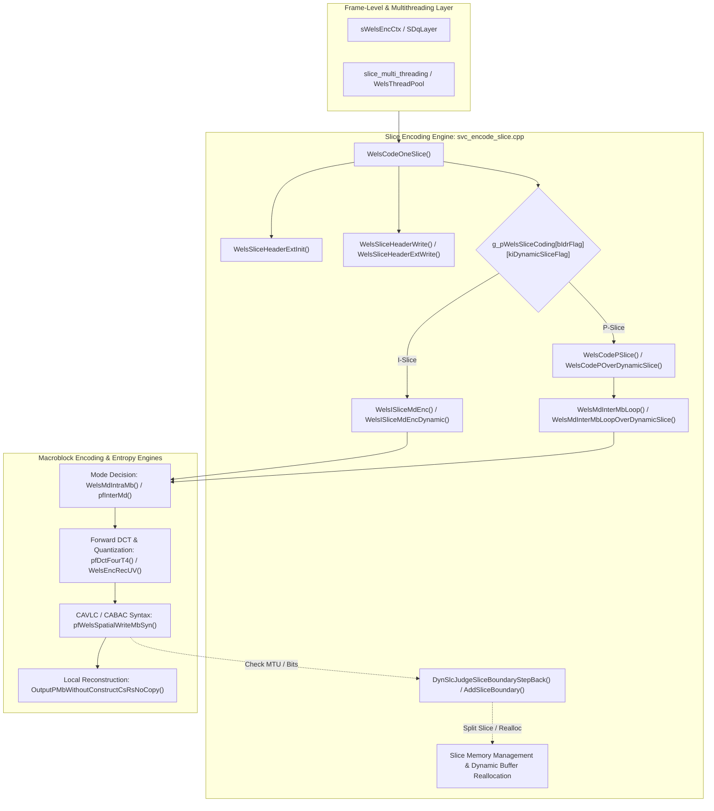

# OpenH264 Core Architecture: Slice Encoding Engine (`svc_encode_slice.cpp`)

This document provides an exhaustive, literate-programming-style deep dive into [`codec/encoder/core/src/svc_encode_slice.cpp`](openh264/codec/encoder/core/src/svc_encode_slice.cpp), the primary slice-level orchestration engine of the OpenH264 video encoder.

---

## 1. Architectural Purpose and System Role

In the OpenH264 encoding pipeline, [`svc_encode_slice.cpp`](openh264/codec/encoder/core/src/svc_encode_slice.cpp) functions as the critical architectural bridge between frame-level orchestration ([`encoder.cpp`](openh264/codec/encoder/core/src/encoder.cpp), [`slice_multi_threading.cpp`](openh264/codec/encoder/core/src/slice_multi_threading.cpp)) and macroblock-level encoding engines ([`svc_mode_decision.cpp`](openh264/codec/encoder/core/src/svc_mode_decision.cpp), [`svc_encode_mb.cpp`](openh264/codec/encoder/core/src/svc_encode_mb.cpp), [`encode_mb_aux.cpp`](openh264/codec/encoder/core/src/encode_mb_aux.cpp), [`svc_set_mb_syn_cavlc.cpp`](openh264/codec/encoder/core/src/svc_set_mb_syn_cavlc.cpp), [`svc_set_mb_syn_cabac.cpp`](openh264/codec/encoder/core/src/svc_set_mb_syn_cabac.cpp)).



### Core Responsibilities

1. **Slice Memory Lifecycle & Management**:
   - Manages memory allocation, cache alignment, thread-partitioned slice buffers (`sSliceBufferInfo`), macroblock working caches ([`SMbCache`](openh264/codec/encoder/core/inc/mb_cache.h)), and bitstream buffers (`SWelsSliceBs`).
   - Dynamically reallocates and expands slice descriptors and NAL unit index buffers when runtime dynamic slicing exceeds pre-allocated boundaries.

2. **Slice Header Formatting & Serialization**:
   - Assembles and serializes standard AVC Annex-A slice headers ([`SSliceHeader`](openh264/codec/decoder/core/inc/slice.h)) and SVC Annex-G Scalable Extension headers ([`SSliceHeaderExt`](openh264/codec/encoder/core/inc/svc_enc_slice_segment.h)).
   - Encodes reference picture list reordering syntax (`ref_pic_list_reordering`) and memory management control operations (`dec_ref_pic_marking` / MMCO).

3. **Macroblock Raster Traversal & Mode Decision Dispatch**:
   - Coordinates the macroblock-by-macroblock raster traversal loop across slices.
   - Sets up rate-control target quantization parameters ($QP$) for each macroblock, configures Lagrangian rate-distortion multipliers ($\lambda$), triggers intra/inter mode decision, and invokes CAVLC/CABAC syntax writers.

4. **Dynamic Slicing & Real-Time MTU Size Control (`SM_SIZELIMITED_SLICE`)**:
   - Continuously monitors accumulated bitstream payload size against user-configured Maximum Transmission Unit (MTU) packet constraints (`uiSliceSizeConstraint`).
   - Implements atomic bitstream/macroblock rollback (`pfStashPopMBStatus`), dynamic slice boundary insertion (`AddSliceBoundary`), neighbor topological mask updates (`UpdateMbNeighbourInfoForNextSlice`), and slice buffer re-ordering (`ReOrderSliceInLayer`).

5. **Bitstream Buffer Overflow Recovery**:
   - Intercepts entropy writer buffer overflow signals (`ENC_RETURN_VLCOVERFLOWFOUND`), rolls back macroblock state, bumps luma/chroma quantization parameters ($\Delta QP$), and triggers local re-encoding (`TRY_REENCODING`).

---

## 2. Type Definitions, Constants, and Dispatch Tables

### 2.1 Function Pointer Typedefs

```cpp
typedef int32_t (*PWelsCodingSliceFunc) (sWelsEncCtx* pCtx, SSlice* pSlice);

typedef void (*PWelsSliceHeaderWriteFunc) (sWelsEncCtx* pCtx, SBitStringAux* pBs,
                                           SDqLayer* pCurLayer, SSlice* pSlice,
                                           IWelsParametersetStrategy* pParametersetStrategy);
```

- **`PWelsCodingSliceFunc`**: Function signature for slice encoding drivers. Accepts the global encoder context [`sWelsEncCtx`](openh264/codec/encoder/core/inc/encoder_context.h) and target [`SSlice`](openh264/codec/encoder/core/inc/slice.h) pointer; returns `ENC_RETURN_SUCCESS` (0) or error status.
- **`PWelsSliceHeaderWriteFunc`**: Function signature for serializing slice headers to the bitstream auxiliary writer [`SBitStringAux`](openh264/codec/decoder/core/inc/bit_stream.h).

---

### 2.2 Jump Tables

```cpp
static const PWelsCodingSliceFunc g_pWelsSliceCoding[2][2] = {
  { WelsCodePSlice,  WelsCodePOverDynamicSlice }, // [0][*]: P Slice (Non-Dynamic vs Dynamic)
  { WelsISliceMdEnc, WelsISliceMdEncDynamic    }  // [1][*]: I Slice (Non-Dynamic vs Dynamic)
};

static const PWelsSliceHeaderWriteFunc g_pWelsWriteSliceHeader[2] = {
  WelsSliceHeaderWrite,    // [0]: Standard AVC Base Slice Header
  WelsSliceHeaderExtWrite  // [1]: SVC Extension Slice Header (SSliceHeaderExt)
};
```

#### Indexing Dimensions of `g_pWelsSliceCoding`:
- **Dimension 1 (`[bIdrFlag]`)**:
  - `0`: Inter P-Slice (`P_SLICE`).
  - `1`: Intra I-Slice (`I_SLICE` / IDR).
- **Dimension 2 (`[kiDynamicSliceFlag]`)**:
  - `0`: Fixed slicing modes (`SM_SINGLE_SLICE`, `SM_FIXEDSLCNUM_SLICE`, `SM_RASTER_SLICE`).
  - `1`: Size-limited dynamic slicing (`SM_SIZELIMITED_SLICE`).

---

## 3. Data Structures and Memory Layout

### 3.1 Macroblock Non-Zero Coefficient Cache Layout (`SMbCache`)

OpenH264 optimizes CAVLC and CABAC context calculation using a strided 1D cache array `iNonZeroCoeffCount` (48 elements) inside [`SMbCache`](openh264/codec/encoder/core/inc/mb_cache.h). The 16 luma 4x4 blocks and 8 chroma 4x4 blocks are mapped into this array to allow fast 32-bit and 16-bit packed loads/stores:

```
Luma 4x4 Blocks (16 blocks -> 4 rows of 4 blocks):
Row 0: iNonZeroCoeffCount[ 9..12]  <-- pMb->pNonZeroCount[ 0.. 3]
Row 1: iNonZeroCoeffCount[17..20]  <-- pMb->pNonZeroCount[ 4.. 7]
Row 2: iNonZeroCoeffCount[25..28]  <-- pMb->pNonZeroCount[ 8..11]
Row 3: iNonZeroCoeffCount[33..36]  <-- pMb->pNonZeroCount[12..15]

Chroma U/V 4x4 Blocks (8 blocks -> 4 pairs of 2 blocks):
Cb Top:    iNonZeroCoeffCount[14..15] <-- pMb->pNonZeroCount[16..17]
Cb Bottom: iNonZeroCoeffCount[38..39] <-- pMb->pNonZeroCount[18..19]
Cr Top:    iNonZeroCoeffCount[22..23] <-- pMb->pNonZeroCount[20..21]
Cr Bottom: iNonZeroCoeffCount[46..47] <-- pMb->pNonZeroCount[22..23]
```

---

## 4. Comprehensive Function and Method Walkthrough

---

### 4.1 Macroblock Cache and Neighbor Management

#### `UpdateNonZeroCountCache`

```cpp
void UpdateNonZeroCountCache (SMB* pMb, SMbCache* pMbCache);
```

- **Purpose**: Copies the persistent macroblock non-zero transform coefficient counts from [`SMB`](openh264/codec/encoder/core/inc/svc_enc_macroblock.h) into the active working cache [`SMbCache`](openh264/codec/encoder/core/inc/mb_cache.h) using packed 32-bit (`LD32`/`ST32`) and 16-bit (`LD16`/`ST16`) memory operations.
- **Parameters**:
  - `pMb`: Pointer to current macroblock metadata structure.
  - `pMbCache`: Pointer to slice macroblock working cache.
- **Mathematical / Bitwise Operation**:
  $$\text{ST32}(\&pMbCache\to iNonZeroCoeffCount[9 + 8 \cdot r], \text{LD32}(\&pMb\to pNonZeroCount[4 \cdot r])) \quad \text{for } r \in \{0, 1, 2, 3\}$$

---

#### `UpdateMbNeighbor`

```cpp
void UpdateMbNeighbor (SDqLayer* pCurDq, SMB* pMb, const int32_t kiMbWidth, uint16_t uiSliceIdc);
```

- **Purpose**: Computes spatial macroblock neighbor availability flags (Left $A$, Top $B$, Top-Left $D$, Top-Right $C$) taking picture boundaries and slice boundaries into account.
- **Parameters**:
  - `pCurDq`: Current spatial dependency layer structure ([`SDqLayer`](openh264/codec/encoder/core/inc/encoder_context.h)).
  - `pMb`: Target macroblock descriptor.
  - `kiMbWidth`: Picture width in macroblocks ($W_{MB}$).
  - `uiSliceIdc`: Slice index/identifier assigned to the current slice.
- **Logic & Boundary Rules**:
  Given macroblock coordinates $(X_{MB}, Y_{MB})$ and linear index $MB_{XY} = Y_{MB} \cdot W_{MB} + X_{MB}$:
  1. **Left Neighbor ($A$)**: $MB_{XY} - 1$. Available if $X_{MB} > 0$ and $\text{SliceID}(MB_{XY}-1) == uiSliceIdc$.
  2. **Top Neighbor ($B$)**: $MB_{XY} - W_{MB}$. Available if $Y_{MB} > 0$ and $\text{SliceID}(MB_{XY}-W_{MB}) == uiSliceIdc$.
  3. **Top-Left Neighbor ($D$)**: $MB_{XY} - W_{MB} - 1$. Available if $X_{MB} > 0$, $Y_{MB} > 0$, and $\text{SliceID}(MB_{XY}-W_{MB}-1) == uiSliceIdc$.
  4. **Top-Right Neighbor ($C$)**: $MB_{XY} - W_{MB} + 1$. Available if $X_{MB} < W_{MB}-1$, $Y_{MB} > 0$, and $\text{SliceID}(MB_{XY}-W_{MB}+1) == uiSliceIdc$.
- **Return Value**: Sets `pMb->uiNeighborAvail` bitmask:
  $$\text{uiNeighborAvail} = (bLeft \cdot \text{LEFT\_MB\_POS}) \mid (bTop \cdot \text{TOP\_MB\_POS}) \mid (bLeftTop \cdot \text{TOPLEFT\_MB\_POS}) \mid (bRightTop \cdot \text{TOPRIGHT\_MB\_POS})$$

---

#### `UpdateMbNeighbourInfoForNextSlice`

```cpp
void UpdateMbNeighbourInfoForNextSlice (SDqLayer* pCurDq, SMB* pMbList,
                                        const int32_t kiFirstMbIdxOfNextSlice,
                                        const int32_t kiLastMbIdxInPartition);
```

- **Purpose**: When dynamic slicing splits a slice mid-frame, this function updates the neighbor availability bitmasks of adjacent macroblocks in the subsequent slice (up to 1 row below the split point) so that intra prediction and motion vector prediction do not illegally reference samples across the new slice boundary.

---

### 4.2 Slice Header Formatting & Bitstream Serialization

#### `WelsSliceHeaderScalExtInit`

```cpp
void WelsSliceHeaderScalExtInit (SDqLayer* pCurLayer, SSlice* pSlice);
```

- **Purpose**: Initializes SVC Scalable Extension slice header flags in [`SSliceHeaderExt`](openh264/codec/encoder/core/inc/svc_enc_slice_segment.h).
- **Behavior**:
  - Clears `bSliceSkipFlag = false`.
  - For spatial enhancement layers (`uiDependencyId > 0`), forces inter-layer prediction override flags to `false`:
    $$bAdaptiveBaseModeFlag = bAdaptiveMotionPredFlag = bAdaptiveResidualPredFlag = \text{false}$$
    $$bDefaultBaseModeFlag = bDefaultMotionPredFlag = bDefaultResidualPredFlag = \text{false}$$

---

#### `WelsSliceHeaderExtInit`

```cpp
void WelsSliceHeaderExtInit (sWelsEncCtx* pEncCtx, SDqLayer* pCurLayer, SSlice* pSlice);
```

- **Purpose**: Fully initializes all syntactic fields in [`SSliceHeader`](openh264/codec/decoder/core/inc/slice.h) and [`SSliceHeaderExt`](openh264/codec/encoder/core/inc/svc_enc_slice_segment.h) prior to bitstream serialization.
- **Key Fields Calculated**:
  - `eSliceType = pEncCtx->eSliceType` (`I_SLICE` or `P_SLICE`).
  - `iFrameNum = pParamInternal->iFrameNum`.
  - `uiIdrPicId = pParamInternal->uiIdrPicId`.
  - `iPicOrderCntLsb = pEncCtx->pEncPic->iFramePoc`.
  - `iSliceQpDelta`:
    $$iSliceQpDelta = iGlobalQp - iPicInitQp$$
  - Deblocking filter offsets: `uiDisableDeblockingFilterIdc`, `iSliceAlphaC0Offset`, `iSliceBetaOffset`.

---

#### `WriteReferenceReorder`

```cpp
void WriteReferenceReorder (SBitStringAux* pBs, SSliceHeader* sSliceHeader);
```

- **Purpose**: Serializes H.264 reference picture list reordering commands into the slice header bitstream.
- **Syntax Elements**:
  - `ref_pic_list_reordering_flag_l0` (`BsWriteOneBit`).
  - Iterative commands `reordering_of_pic_nums_idc` (`BsWriteUE`):
    - `0` / `1`: `abs_diff_pic_num_minus1` (`BsWriteUE`).
    - `2`: `long_term_pic_num` (`BsWriteUE`).
    - `3`: End of reordering loop.

---

#### `WriteRefPicMarking`

```cpp
void WriteRefPicMarking (SBitStringAux* pBs, SSliceHeader* pSliceHeader, SNalUnitHeaderExt* pNalHdrExt);
```

- **Purpose**: Serializes Decoded Reference Picture Marking syntax elements (`dec_ref_pic_marking`).
- **Logic**:
  - **IDR Frames (`bIdrFlag == 1`)**: Writes `no_output_of_prior_pics_flag` and `long_term_reference_flag`.
  - **Non-IDR Frames**: Writes `adaptive_ref_pic_marking_mode_flag`. If true, serializes Memory Management Control Operations (MMCO):
    - MMCO 1 / 3: `difference_of_pic_nums_minus1` (`BsWriteUE`).
    - MMCO 2: `long_term_pic_num` (`BsWriteUE`).
    - MMCO 3 / 6: `long_term_frame_idx` (`BsWriteUE`).
    - MMCO 4: `max_long_term_frame_idx_plus1` (`BsWriteUE`).
    - Terminated by MMCO `0`.

---

#### `WelsSliceHeaderWrite` & `WelsSliceHeaderExtWrite`

```cpp
void WelsSliceHeaderWrite (sWelsEncCtx* pCtx, SBitStringAux* pBs, SDqLayer* pCurLayer, SSlice* pSlice,
                           IWelsParametersetStrategy* pParametersetStrategy);

void WelsSliceHeaderExtWrite (sWelsEncCtx* pCtx, SBitStringAux* pBs, SDqLayer* pCurLayer, SSlice* pSlice,
                              IWelsParametersetStrategy* pParametersetStrategy);
```

- **Purpose**: Writes the complete binary bitstream slice header using Exp-Golomb (`BsWriteUE`, `BsWriteSE`) and fixed-length bit writers (`BsWriteBits`, `BsWriteOneBit`).
- **Syntax Written**:
  1. `first_mb_in_slice` ($ue(v)$)
  2. `slice_type` ($ue(v)$)
  3. `pic_parameter_set_id` ($ue(v)$)
  4. `frame_num` ($u(v)$)
  5. `idr_pic_id` ($ue(v)$, if IDR)
  6. `pic_order_cnt_lsb` ($u(v)$, if POC Type 0)
  7. `num_ref_idx_active_override_flag` & `num_ref_idx_l0_active_minus1` (if P-slice)
  8. Reference reordering & MMCO marking
  9. `cabac_init_idc` ($ue(v)$, if CABAC enabled and non-I slice)
  10. `slice_qp_delta` ($se(v)$)
  11. Deblocking filter parameters (`uiDisableDeblockingFilterIdc`, `slice_alpha_c0_offset_div2`, `slice_beta_offset_div2`)
  12. *(SVC Extension only)*: `store_ref_base_pic_flag`, FMO slice group cycle bits, `slice_skip_flag`, base mode prediction flags.

---

### 4.3 Macroblock Transform, Quantization & Reconstruction Helpers

#### `WelsInterMbEncode`

```cpp
void WelsInterMbEncode (sWelsEncCtx* pEncCtx, SSlice* pSlice, SMB* pCurMb);
```

- **Purpose**: Computes the forward 4x4 integer DCT on luma prediction residuals, followed by quantization, CAVLC/CABAC scanning, and local reconstruction for an inter macroblock.
- **Key Calls**:
  - `pfDctFourT4`: Computes 4x4 forward DCT on four 4x4 luma blocks simultaneously.
  - `WelsEncInterY`: Core luma quantization and coefficient scanning engine.

---

#### `WelsIMbChromaEncode` & `WelsPMbChromaEncode`

```cpp
void WelsIMbChromaEncode (sWelsEncCtx* pEncCtx, SMB* pCurMb, SMbCache* pMbCache);
void WelsPMbChromaEncode (sWelsEncCtx* pEncCtx, SSlice* pSlice, SMB* pCurMb);
```

- **Purpose**: Encodes the chroma components (Cb / Cr) for Intra and Inter macroblocks respectively.
- **Data Flow**:
  1. Forward 4x4 DCT (`pfDctFourT4`) on Cb residual.
  2. Chroma quantization and entropy encoding (`WelsEncRecUV`).
  3. Inverse 4x4 IDCT (`pfIDctFourT4`) writing reconstructed chroma pixels into `pCsCb`.
  4. Repeats for Cr residual, writing reconstructed chroma pixels into `pCsCr`.

---

#### `OutputPMbWithoutConstructCsRsNoCopy`

```cpp
void OutputPMbWithoutConstructCsRsNoCopy (sWelsEncCtx* pCtx, SDqLayer* pDq, SSlice* pSlice, SMB* pMb);
```

- **Purpose**: Reconstructs inter-coded (non-skip) and intra-base-layer (`IS_I_BL`) macroblocks directly into the reference frame buffer (`pDecPic`) without unnecessary temporary buffer copying.
- **Implementation**:
  - Luma Plane: `WelsIDctT4RecOnMb` reconstructs 16 4x4 luma blocks using scaled transform coefficients `pMbCache->pCoeffLevel`.
  - Chroma Planes: Calls `pfIdctFour4x4` on U (`pScaledTcoeff + 256`) and V (`pScaledTcoeff + 320`) planes.

---

#### `UpdateQpForOverflow`

```cpp
void UpdateQpForOverflow (SMB* pCurMb, uint8_t kuiChromaQpIndexOffset);
```

- **Purpose**: Bumps macroblock quantization parameters when a bitstream buffer overflow occurs.
- **Algorithm**:
  $$QP_{Luma} \leftarrow QP_{Luma} + \text{DELTA\_QP} \quad (\text{DELTA\_QP} = 1)$$
  $$QP_{Chroma} \leftarrow \text{g\_kuiChromaQpTable}\left[\text{CLIP3}\left(0, 51, QP_{Luma} + \text{kuiChromaQpIndexOffset}\right)\right]$$

---

### 4.4 Slice Encoding Execution Loops

#### `WelsISliceMdEnc` & `WelsISliceMdEncDynamic`

```cpp
int32_t WelsISliceMdEnc (sWelsEncCtx* pEncCtx, SSlice* pSlice);
int32_t WelsISliceMdEncDynamic (sWelsEncCtx* pEncCtx, SSlice* pSlice);
```

- **Purpose**: Executes the macroblock encoding loop for Intra (I) slices.
- **Workflow**:
  1. Initializes CABAC context if enabled (`WelsInitSliceCabac`).
  2. Loops over macroblocks in slice raster order:
     - Saves macroblock state stack (`pfStashMBStatus`).
     - Initializes Rate Control for MB (`pfWelsRcMbInit`).
     - Computes Lagrangian multiplier $\lambda = \text{g\_kiQpCostTable}[QP_{Luma}]$.
     - Executes Intra Mode Decision (`WelsMdIntraMb`).
     - Synchronizes non-zero coefficient cache (`UpdateNonZeroCountCache`).
     - Writes macroblock syntax to bitstream (`pfWelsSpatialWriteMbSyn`).
     - **Overflow Handling**: If bitstream overflow occurs and $QP_{Luma} < 50$, restores macroblock state (`pfStashPopMBStatus`), adjusts QP (`UpdateQpForOverflow`), and jumps to `TRY_REENCODING`.
     - **Dynamic Slicing Check** (`WelsISliceMdEncDynamic` only): Calls `DynSlcJudgeSliceBoundaryStepBack`. If payload threshold is reached, steps back the current macroblock and terminates the slice.
     - Updates rate control complexity metrics (`pfWelsRcMbInfoUpdate`).
     - Fetches next macroblock index (`WelsGetNextMbOfSlice`).

---

#### `WelsMdInterMbLoop` & `WelsMdInterMbLoopOverDynamicSlice`

```cpp
int32_t WelsMdInterMbLoop (sWelsEncCtx* pEncCtx, SSlice* pSlice, void* pWelsMd, const int32_t kiSliceFirstMbXY);
int32_t WelsMdInterMbLoopOverDynamicSlice (sWelsEncCtx* pEncCtx, SSlice* pSlice, void* pWelsMd, const int32_t kiSliceFirstMbXY);
```

- **Purpose**: Executes the macroblock encoding loop for Inter (P) slices.
- **Workflow**:
  1. Initializes motion vector difference (MVD) cost tables and search parameters (`WelsInitInterMDStruc`).
  2. Iterates over macroblocks:
     - Initializes RC and MD state (`pfWelsRcMbInit`, `WelsMdIntraInit`, `WelsMdInterInit`).
     - Evaluates inter prediction modes via `pFuncList->pfInterMd` (e.g., `WelsMdInterMb` or `WelsMdInterMbEnhancelayer`).
     - Saves motion search SAD and reference types (`WelsMdInterSaveSadAndRefMbType`).
     - Updates background analysis tracking (`pfMdBackgroundInfoUpdate`).
     - Serializes syntax (`pfWelsSpatialWriteMbSyn`).
     - Handles dynamic slicing boundary step-backs (`DynSlcJudgeSliceBoundaryStepBack`).
     - Reconstructs inter macroblock samples into DPB (`OutputPMbWithoutConstructCsRsNoCopy`).
     - Updates Rate Control statistics (`pfWelsRcMbInfoUpdate`).
  3. Writes trailing skip-run count (`BsWriteUE(pBs, pSlice->iMbSkipRun)`) if active.

---

#### `WelsCodeOneSlice`

```cpp
int32_t WelsCodeOneSlice (sWelsEncCtx* pEncCtx, SSlice* pCurSlice, const int32_t kiNalType);
```

- **Purpose**: Top-level dispatch entry point for encoding a single slice.
- **Execution Steps**:
  1. Configures NAL IDR flag (`bIdrFlag`) and temporal scale shift (`sScaleShift`).
  2. Formats slice header (`WelsSliceHeaderExtInit`).
  3. Initializes GOM (Group of Macroblocks) Rate Control (`GomRCInitForOneSlice`) if enabled.
  4. Writes slice header to bitstream via `g_pWelsWriteSliceHeader[pCurSlice->bSliceHeaderExtFlag]`.
  5. Dispatches slice macroblock encoding via 2D jump table:
     $$iEncReturn = \text{g\_pWelsSliceCoding}[bIdrFlag][kiDynamicSliceFlag](pEncCtx, pCurSlice)$$
  6. Finalizes slice bitstream alignment (`WelsWriteSliceEndSyn`).

---

### 4.5 Dynamic Slicing & Packet Size Boundary Control

#### `DynSlcJudgeSliceBoundaryStepBack`

```cpp
bool DynSlcJudgeSliceBoundaryStepBack (void* pCtx, void* pSlice, SSliceCtx* pSliceCtx, SMB* pCurMb,
                                       SDynamicSlicingStack* pDss);
```

- **Purpose**: Core decision function for dynamic slicing. Determines whether the current macroblock's encoded bits cause the accumulated slice payload to exceed the MTU constraint `uiSliceSizeConstraint`.
- **Decision Logic**:
  1. Calculates encoded byte length:
     $$iPosBitOffset = pDss\to iCurrentPos - pDss\to iStartPos$$
     $$uiLen = (iPosBitOffset \gg 3) + ((iPosBitOffset \ \& \ 7) \ ? \ 1 : 0)$$
  2. Evaluates `JUMPPACKETSIZE_JUDGE(uiLen, iCurMbIdx, pSliceCtx->uiSliceSizeConstraint)`:
     If the encoded slice size exceeds the constraint and the current macroblock is neither the first MB of the slice nor the last MB of the partition:
     - Locks multithreading mutex (`mutexSliceNumUpdate`).
     - Calls `AddSliceBoundary` to dynamically split the slice.
     - Increments `pSliceCtx->iSliceNumInFrame`.
     - Returns `true` (signaling the caller to step back and finalize the slice).

---

#### `AddSliceBoundary`

```cpp
void AddSliceBoundary (sWelsEncCtx* pEncCtx, SSlice* pCurSlice, SSliceCtx* pSliceCtx, SMB* pCurMb,
                       int32_t iFirstMbIdxOfNextSlice, const int32_t kiLastMbIdxInPartition);
```

- **Purpose**: Dynamically creates a new slice boundary mid-frame.
- **Actions**:
  1. Finalizes current slice macroblock count:
     $$pCurSlice\to sSliceHeaderExt.uiNumMbsInSlice = 1 + iCurMbIdx - iFirstMbInSlice$$
  2. Acquires the next slice descriptor `pNextSlice` from `pSliceBuffer`.
  3. Copies slice header parameters from current slice to next slice.
  4. Sets next slice's `iFirstMbInSlice = iFirstMbIdxOfNextSlice`.
  5. Updates macroblock-to-slice map `pSliceCtx->pOverallMbMap`.
  6. Invokes `UpdateMbNeighbourInfoForNextSlice` to refresh spatial neighbor availability bitmasks.

---

### 4.6 Memory Management, Allocation & Reallocation

| Function Name | Description | Key Memory Operations |
| :--- | :--- | :--- |
| **`AllocMbCacheAligned`** | Allocates aligned heap scratch buffers inside [`SMbCache`](openh264/codec/encoder/core/inc/mb_cache.h). | `pMemPredMb` (512 B), `pCoeffLevel` (768 B), `pSkipMb` (384 B), `pMemPredBlk4` (32 B), `pBufferInterPredMe` (2560 B). |
| **`FreeMbCache`** | Deallocates all buffers in `SMbCache`. | `pMa->WelsFree` on all allocated member pointers. |
| **`InitSliceBoundaryInfo`** | Calculates slice start macroblock indices and macroblock counts based on slicing mode (`SM_SINGLE_SLICE`, `SM_RASTER_SLICE`, etc.). | Sets `pCurLayer->pFirstMbIdxOfSlice` and `pCountMbNumInSlice`. |
| **`InitSliceBsBuffer`** | Configures slice bitstream output buffer `sSliceBs`. | Allocates `pBs` heap buffer if `bIndependenceBsBuffer` is set. |
| **`InitSliceList`** | Iteratively initializes an array of `SSlice` structures. | Invokes `InitSliceBsBuffer` and `AllocateSliceMBBuffer`. |
| **`InitSliceThreadInfo`** | Allocates thread-partitioned slice buffers (`sSliceBufferInfo`). | Divides `iMaxSliceNum` evenly among active worker threads. |
| **`InitSliceInLayer`** | Top-level layer slice initialization. | Sets up slice pointer arrays `ppSliceInLayer` and thread buffers. |
| **`CalculateNewSliceNum`** | Predicts expanded slice capacity required when dynamic slicing creates extra slices. | Multiplies slice count by `SLICE_NUM_EXPAND_COEF` or calculates proportional partition expansion. |
| **`ReallocateSliceList`** | Expands the slice array buffer while preserving existing slice data. | Allocates new `SSlice` array, copies existing state, initializes new slices, and frees old array. |
| **`ExtendLayerBuffer`** | Reallocates pointer tables `ppSliceInLayer`, `pFirstMbIdxOfSlice`, and `pCountMbNumInSlice`. | Allocates larger arrays aligned via `CMemoryAlign`. |
| **`ReallocSliceBuffer`** | Coordinates full layer slice buffer expansion when dynamic slicing exceeds capacity. | Invokes `CalculateNewSliceNum`, `ReallocateSliceList`, and `ExtendLayerBuffer`. |
| **`ReOrderSliceInLayer`** | Reorders slice pointers in `ppSliceInLayer` to ensure output NAL units match bitstream raster order. | Sorts slices based on partition index and actual slice IDs. |
| **`FrameBsRealloc`** | Dynamically expands frame NAL unit descriptor arrays (`sNalList`, `pNalLen`). | Reallocates `pCtx->pOut->sNalList` and updates layer NAL byte length pointers. |
| **`SliceLayerInfoUpdate`** | Post-encoding validation and NAL list synchronization. | Checks if total encoded slices exceed capacity, triggers reordering, and reallocates NAL buffers if needed. |

---

## 5. SIMD Optimizations and Subsystem Interactions

[`svc_encode_slice.cpp`](openh264/codec/encoder/core/src/svc_encode_slice.cpp) orchestrates several performance-critical assembly/SIMD primitives via `pEncCtx->pFuncList`:

1. **Forward Integer DCT (`pfDctFourT4`)**:
   - Executes 4x4 2D forward integer DCT on 4 blocks concurrently using 128-bit vector registers (SSE2/AVX2/NEON).
2. **Inverse Integer DCT (`pfIDctFourT4`, `WelsIDctT4RecOnMb`)**:
   - Performs 4x4 inverse integer DCT and sample reconstruction directly into DPB memory buffers.
3. **Macroblock State Stashing (`pfStashMBStatus`, `pfStashPopMBStatus`)**:
   - High-speed bitstream pointer and syntax rollback routines utilized during dynamic slicing and QP overflow recovery.
4. **Entropy Encoding Dispatch (`pfWelsSpatialWriteMbSyn`)**:
   - Fast CAVLC Exp-Golomb or CABAC arithmetic coding serialization for macroblock syntax elements.
