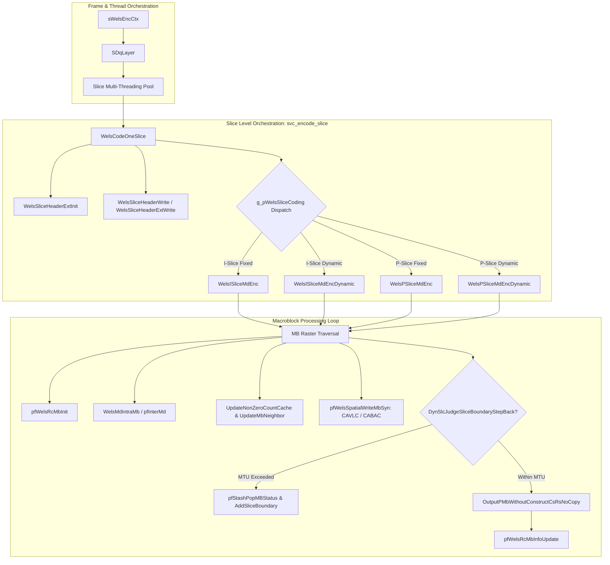
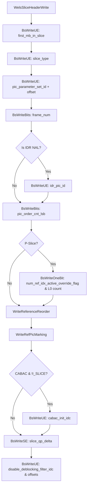
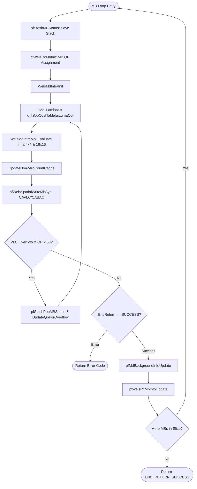
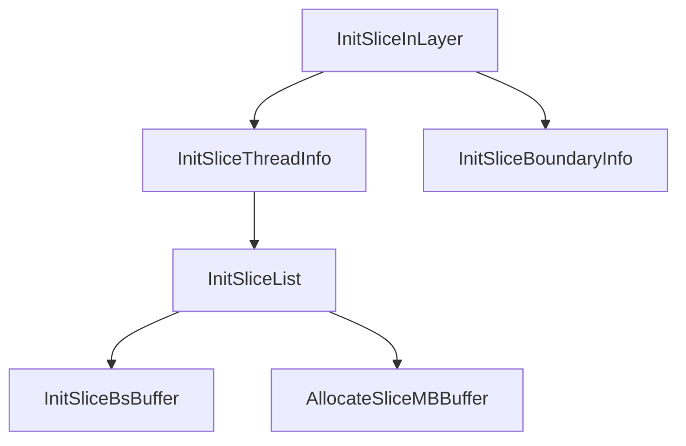

# OpenH264 Video Encoder: Slice Encoding Subsystem Documentation (`svc_encode_slice.h`)

This document provides a comprehensive, literate-programming-style technical breakdown of the slice encoding subsystem in the Cisco OpenH264 encoder, declared in [svc_encode_slice.h](openh264/codec/encoder/core/inc/svc_encode_slice.h) and implemented in [svc_encode_slice.cpp](openh264/codec/encoder/core/src/svc_encode_slice.cpp).

---

## Table of Contents
1. [Module Overview & Architectural Role](#1-module-overview--architectural-role)
2. [Data Structures, Cache Layouts & Dispatch Tables](#2-data-structures-cache-layouts--dispatch-tables)
3. [Macroblock Cache & Neighbor Topology Updates](#3-macroblock-cache--neighbor-topology-updates)
4. [Slice Header Initialization & Bitstream Serialization](#4-slice-header-initialization--bitstream-serialization)
5. [Macroblock-Level Residual & Chroma Encoding](#5-macroblock-level-residual--chroma-encoding)
6. [Slice Mode Decision & Macroblock Traversal Loops](#6-slice-mode-decision--macroblock-traversal-loops)
7. [Dynamic Slicing, MTU Boundary Enforcement & Rollback](#7-dynamic-slicing-mtu-boundary-enforcement--rollback)
8. [Slice Memory Allocation, Thread Management & Dynamic Reallocation](#8-slice-memory-allocation-thread-management--dynamic-reallocation)
9. [Bitstream NAL Aggregation & Layer Layout Updates](#9-bitstream-nal-aggregation--layer-layout-updates)
10. [Function Index & Summary Cross-Reference](#10-function-index--summary-cross-reference)

---

## 1. Module Overview & Architectural Role

In the OpenH264 encoding pipeline, the **Slice Encoding Subsystem** bridges high-level frame and dependency layer orchestration ([sWelsEncCtx](openh264/codec/encoder/core/inc/encoder_context.h#L116-L238), [slice_multi_threading.cpp](openh264/codec/encoder/core/src/slice_multi_threading.cpp)) with low-level macroblock transformation, quantization, and entropy coding ([svc_encode_mb.cpp](openh264/codec/encoder/core/src/svc_encode_mb.cpp), [svc_mode_decision.cpp](openh264/codec/encoder/core/src/svc_mode_decision.cpp), [vlc_encoder.cpp](openh264/codec/encoder/core/src/vlc_encoder.cpp), [svc_set_mb_syn_cabac.cpp](openh264/codec/encoder/core/src/svc_set_mb_syn_cabac.cpp)).



### Core Responsibilities
1. **Slice Configuration & Slicing Mode Management**:
   - `SM_SINGLE_SLICE`: 1 slice per picture layer.
   - `SM_FIXEDSLCNUM_SLICE`: Fixed $N$ slices per picture allocated across parallel worker threads.
   - `SM_RASTER_SLICE`: Fixed number of macroblocks per slice.
   - `SM_SIZELIMITED_SLICE`: Dynamic slicing where slice boundaries are dynamically adjusted based on a Maximum Transmission Unit (MTU) bitstream payload constraint.
2. **Slice Header Construction & Serialization**:
   - Serializes standard AVC Baseline slice headers ([WelsSliceHeaderWrite](openh264/codec/encoder/core/src/svc_encode_slice.cpp#L275-L346)) or SVC Scalable Extension slice headers ([WelsSliceHeaderExtWrite](openh264/codec/encoder/core/src/svc_encode_slice.cpp#L348-L454)).
3. **Macroblock Cache Management**:
   - Allocates and maintains 16-byte aligned memory scratchpads ([SMbCache](openh264/codec/encoder/core/inc/mb_cache.h#L72-L137)) per slice to store fast SIMD prediction buffers, non-zero coefficient count caches, intra prediction modes, and motion vector candidate predictors.
4. **Dynamic Slice Expansion & Multithreaded Buffer Reallocation**:
   - Manages slice memory buffers across worker threads. When dynamic slicing produces more slices than originally pre-allocated, the system dynamically reallocates and expands slice descriptors ([ReallocateSliceList](openh264/codec/encoder/core/src/svc_encode_slice.cpp#L1206-L1296)), layer slice pointer arrays ([ExtendLayerBuffer](openh264/codec/encoder/core/src/svc_encode_slice.cpp#L1358-L1399)), and NAL unit index buffers ([FrameBsRealloc](openh264/codec/encoder/core/src/svc_encode_slice.cpp#L1562-L1599)).

---

## 2. Data Structures, Cache Layouts & Dispatch Tables

### 2.1 [SMbCache](openh264/codec/encoder/core/inc/mb_cache.h#L72-L137) (Macroblock Cache Scratchpad)

Each active slice instance ([SSlice](openh264/codec/encoder/core/inc/slice.h#L172-L209)) owns a dedicated [SMbCache](openh264/codec/encoder/core/inc/mb_cache.h#L72-L137) structure allocated with 16-byte alignment via [CMemoryAlign](openh264/codec/common/inc/memory_align.h).

| Member Field | Type | Size / Alignment | Description |
| :--- | :--- | :--- | :--- |
| `sMvComponents` | `SMVComponentUnit` | 16-byte aligned | Motion vector component buffer for SIMD ME cost calculations |
| `iNonZeroCoeffCount[48]` | `int8_t[48]` | 48 bytes (16-byte aligned) | 2D cache grid for non-zero transform coefficients of neighboring 4x4 blocks (Luma + Chroma) |
| `iIntraPredMode[48]` | `int8_t[48]` | 48 bytes (16-byte aligned) | Intra prediction mode cache for 4x4 neighbor blocks |
| `iSadCost[4]` | `int32_t[4]` | 16 bytes | SAD costs for neighbor blocks |
| `sMbMvp[16]` | `SMVUnitXY[16]` | 64 bytes | Predicted motion vectors for bitstream syntax serialization |
| `pCoeffLevel` | `int16_t*` | Pointer (`MB_COEFF_LIST_SIZE` elements = 384 words) | Scaled DCT residual coefficient buffer for reconstruction |
| `pSkipMb` | `uint8_t*` | Pointer (384 bytes) | Scratchpad for skip-mode candidate evaluation |
| `pMemPredMb` | `uint8_t*` | Pointer ($2 \times 256$ bytes) | Ping-pong prediction memory buffer for Luma $16\times 16$ samples |
| `pMemPredLuma` | `uint8_t*` | Pointer | Pointer to active Luma prediction buffer |
| `pMemPredChroma` | `uint8_t*` | Pointer | Pointer to active Chroma prediction buffer |
| `pBestPredIntraChroma` | `uint8_t*` | Pointer | Best Intra chroma prediction plane ($Cb: 0..63, Cr: 64..127$) |
| `pMemPredBlk4` | `uint8_t*` | Pointer ($2 \times 16$ bytes) | Intra $4\times 4$ block prediction scratchpad |
| `pBufferInterPredMe` | `uint8_t*` | Pointer ($4 \times 640$ bytes) | Half-pel and quarter-pel fractional ME interpolation scratchpad |
| `pPrevIntra4x4PredModeFlag` | `bool*` | Pointer (16 bytes) | Flag indicating most probable intra mode match per 4x4 block |
| `pRemIntra4x4PredModeFlag` | `int8_t*` | Pointer (16 bytes) | Remainder intra 4x4 prediction mode index per block |
| `pDct` | [SDCTCoeff*](openh264/codec/encoder/core/inc/mb_cache.h#L62-L70) | Pointer | Forward DCT transform coefficient matrix storage |
| `SPicData` | Sub-struct | Struct of pointers | Frame pointers: `pEncMb[3]` (source input), `pDecMb[3]` (local reconstructed), `pRefMb[3]` (reference), `pCsMb[3]` (spatial layer reference) |

### 2.2 [SMB](openh264/codec/encoder/core/inc/svc_enc_macroblock.h#L49-L78) / `TagMB` (Macroblock Context Structure)

Represents the syntax, geometry, and coding state of an individual $16\times 16$ macroblock in the frame:

| Field | Type | Semantic Meaning |
| :--- | :--- | :--- |
| `uiMbType` | `Mb_Type` (`uint32_t`) | Partition type (e.g. `MB_TYPE_INTRA4x4`, `MB_TYPE_INTRA16x16`, `MB_TYPE_SKIP`, `MB_TYPE_16x16`, `MB_TYPE_16x8`, `MB_TYPE_8x16`, `MB_TYPE_8x8`, `MB_TYPE_INTRA_BL`) |
| `uiSubMbType[4]` | `uint8_t[4]` | Sub-macroblock partition types for $8\times 8$ blocks |
| `iMbXY` | `int32_t` | Raster scan index ($iMbY \times iMbWidth + iMbX$) |
| `iMbX`, `iMbY` | `int16_t` | Horizontal and vertical macroblock coordinates |
| `uiNeighborAvail` | `uint8_t` | Bitmask for available neighbor macroblocks (`LEFT_MB_POS = 0x01`, `TOP_MB_POS = 0x02`, `TOPRIGHT_MB_POS = 0x04`, `TOPLEFT_MB_POS = 0x08`) |
| `uiCbp` | `uint8_t` | Coded Block Pattern (lower 4 bits = Luma 8x8 blocks, upper 2 bits = Chroma DC/AC) |
| `uiLumaQp`, `uiChromaQp` | `uint8_t` | Quantization parameters for Luma ($0..51$) and Chroma |
| `uiSliceIdc` | `uint16_t` | Index of the slice to which this macroblock belongs |

### 2.3 [SDynamicSlicingStack](openh264/codec/encoder/core/inc/svc_enc_slice_segment.h) (Dynamic Slicing Stack)

Stores bitstream position and restore buffer state to enable transaction-like atomic macroblock encoding rollback when an MTU packet size constraint is exceeded:

```cpp
typedef struct TagDynamicSlicingStack {
  int32_t   iStartPos;       // Bitstream start position (bits) before encoding MB
  int32_t   iCurrentPos;     // Bitstream end position (bits) after encoding MB
  uint8_t*  pRestoreBuffer;  // Dynamic partition restore buffer pointer for CABAC bitstreams
} SDynamicSlicingStack;
```

### 2.4 Internal Function Dispatch Tables

The subsystem relies on static 2D function pointer matrices for dynamic slice coding and header serialization:

```cpp
// 1st index: 0: P-Slice, 1: I-Slice (indexed by pNalHeadExt->bIdrFlag)
// 2nd index: 0: non-dynamic slice, 1: dynamic slice (indexed by kiDynamicSliceFlag)
static const PWelsCodingSliceFunc g_pWelsSliceCoding[2][2] = {
  { WelsCodePSlice,  WelsCodePOverDynamicSlice }, // P-Slice
  { WelsISliceMdEnc, WelsISliceMdEncDynamic    }  // I-Slice
};

// Indexed by pCurSlice->bSliceHeaderExtFlag: 0: Base AVC Header, 1: SVC Extension Header
static const PWelsSliceHeaderWriteFunc g_pWelsWriteSliceHeader[2] = {
  WelsSliceHeaderWrite,
  WelsSliceHeaderExtWrite
};
```

---

## 3. Macroblock Cache & Neighbor Topology Updates

### 3.1 [UpdateNonZeroCountCache](openh264/codec/encoder/core/src/svc_encode_slice.cpp#L57-L67)

```cpp
void UpdateNonZeroCountCache (SMB* pMb, SMbCache* pMbCache);
```

#### Purpose & Algorithmic Details
Updates the slice's macroblock cache non-zero coefficient grid (`pMbCache->iNonZeroCoeffCount`) from the macroblock's computed non-zero coefficient counts (`pMb->pNonZeroCount`). 

In H.264 CAVLC entropy coding, the context parameter $nC$ for decoding/encoding transform coefficient tokens (`coeff_token`) depends on the number of non-zero transform coefficients in the left ($nA$) and top ($nB$) $4\times 4$ blocks:

$$nC = \begin{cases} nB & \text{if } nA \text{ is unavailable} \\ nA & \text{if } nB \text{ is unavailable} \\ \left\lfloor \frac{nA + nB + 1}{2} \right\rfloor & \text{if both } nA \text{ and } nB \text{ are available} \end{cases}$$

To maximize memory bandwidth and avoid scalar byte-by-byte copies, [UpdateNonZeroCountCache](openh264/codec/encoder/core/src/svc_encode_slice.cpp#L57-L67) performs 32-bit (`LD32`/`ST32`) and 16-bit (`LD16`/`ST16`) aligned vector copies to map the $4\times 4$ Luma blocks (indices 0..15) and Chroma blocks (Cb: 16..19, Cr: 20..23) directly into the cache structure:

```cpp
ST32 (&pMbCache->iNonZeroCoeffCount[ 9], LD32 (&pMb->pNonZeroCount[ 0]));
ST32 (&pMbCache->iNonZeroCoeffCount[17], LD32 (&pMb->pNonZeroCount[ 4]));
ST32 (&pMbCache->iNonZeroCoeffCount[25], LD32 (&pMb->pNonZeroCount[ 8]));
ST32 (&pMbCache->iNonZeroCoeffCount[33], LD32 (&pMb->pNonZeroCount[12]));

ST16 (&pMbCache->iNonZeroCoeffCount[14], LD16 (&pMb->pNonZeroCount[16]));
ST16 (&pMbCache->iNonZeroCoeffCount[38], LD16 (&pMb->pNonZeroCount[18]));
ST16 (&pMbCache->iNonZeroCoeffCount[22], LD16 (&pMb->pNonZeroCount[20]));
ST16 (&pMbCache->iNonZeroCoeffCount[46], LD16 (&pMb->pNonZeroCount[22]));
```

---

### 3.2 [UpdateMbNeighbor](openh264/codec/encoder/core/src/svc_encode_slice.cpp#L138-L173)

```cpp
void UpdateMbNeighbor (SDqLayer* pCurDq, SMB* pMb, const int32_t kiMbWidth, uint16_t uiSliceIdc);
```

#### Purpose & Neighbor Availability Logic
Derives spatial neighbor availability bitmasks for macroblock `pMb`. Spatial intra prediction and motion vector prediction (MVP) cannot cross slice boundaries or frame edges.

```
       +--------------+--------------+--------------+
       | Top-Left     | Top          | Top-Right    |
       | (kiMbXY-W-1) | (kiMbXY-W)   | (kiMbXY-W+1) |
       +--------------+--------------+--------------+
       | Left         | Current MB   |
       | (kiMbXY-1)   | (kiMbXY)     |
       +--------------+--------------+
```

#### Availability Conditions
1. **Left Neighbor ($A$)**: Available if $iMbX > 0$ and `uiSliceIdc == WelsMbToSliceIdc(pCurDq, iMbXY - 1)`. Adds `LEFT_MB_POS` (`0x01`).
2. **Top Neighbor ($B$)**: Available if $iMbY > 0$ and `uiSliceIdc == WelsMbToSliceIdc(pCurDq, iMbXY - kiMbWidth)`. Adds `TOP_MB_POS` (`0x02`).
3. **Top-Left Neighbor ($D$)**: Available if $iMbX > 0$, $iMbY > 0$, and `uiSliceIdc == WelsMbToSliceIdc(pCurDq, iMbXY - kiMbWidth - 1)`. Adds `TOPLEFT_MB_POS` (`0x08`).
4. **Top-Right Neighbor ($C$)**: Available if $iMbX < kiMbWidth - 1$, $iMbY > 0$, and `uiSliceIdc == WelsMbToSliceIdc(pCurDq, iMbXY - kiMbWidth + 1)`. Adds `TOPRIGHT_MB_POS` (`0x04`).

The combined bitmask is stored into `pMb->uiNeighborAvail`.

---

### 3.3 [UpdateMbNeighbourInfoForNextSlice](openh264/codec/encoder/core/src/svc_encode_slice.cpp#L1684-L1703)

```cpp
void UpdateMbNeighbourInfoForNextSlice (
    SDqLayer* pCurDq,
    SMB* pMbList,
    const int32_t kiFirstMbIdxOfNextSlice,
    const int32_t kiLastMbIdxInPartition
);
```

#### Purpose
When dynamic slicing creates a new slice boundary mid-frame, neighbor relationships change for macroblocks bordering the new slice. This function recalculates neighbor availability flags (`uiNeighborAvail`) for the first row of macroblocks belonging to the new slice up to `kiLastMbIdxInPartition`.

---

### 3.4 [WelsCountMbType](openh264/codec/encoder/core/src/svc_encode_slice.cpp#L177-L210)

```cpp
#if defined(MB_TYPES_CHECK)
void WelsCountMbType (int32_t (*iMbCount)[18], const EWelsSliceType keSt, const SMB* kpMb);
#endif
```

#### Purpose
A diagnostic/profiling routine enabled when `MB_TYPES_CHECK` is compiled. Increments the per-slice-type histogram counter for the encoded macroblock mode (`Intra4x4`, `Intra16x16`, `PSkip`, `Inter16x16`, `Inter16x8`, `Inter8x16`, `Inter8x8`, or `Intra_BL`).

---

## 4. Slice Header Initialization & Bitstream Serialization

### 4.1 [WelsSliceHeaderExtInit](openh264/codec/encoder/core/src/svc_encode_slice.cpp#L89-L135) & [WelsSliceHeaderScalExtInit](openh264/codec/encoder/core/src/svc_encode_slice.cpp#L69-L87)

```cpp
void WelsSliceHeaderScalExtInit (SDqLayer* pCurLayer, SSlice* pSlice);
void WelsSliceHeaderExtInit (sWelsEncCtx* pEncCtx, SDqLayer* pCurLayer, SSlice* pSlice);
```

#### Initialization Sequence
1. Copies `eSliceType` from encoder context `pEncCtx->eSliceType`.
2. Sets `iFrameNum`, `uiIdrPicId`, and Picture Order Count LSB (`iPicOrderCntLsb = pEncCtx->pEncPic->iFramePoc`).
3. For P-Slices: Sets active reference picture count `uiNumRefIdxL0Active`. If `uiRefCount` is overridden within $[1, \text{iNumRefFrames}]$, sets `bNumRefIdxActiveOverrideFlag = true`.
4. Calculates Slice QP Delta:
   $$\Delta QP_{\text{slice}} = QP_{\text{global}} - QP_{\text{PPS\_Init}}$$
5. Initializes In-Loop Deblocking Filter parameters:
   - `uiDisableDeblockingFilterIdc = pCurLayer->iLoopFilterDisableIdc`
   - `iSliceAlphaC0Offset = pCurLayer->iLoopFilterAlphaC0Offset`
   - `iSliceBetaOffset = pCurLayer->iLoopFilterBetaOffset`
6. If `bSliceHeaderExtFlag` is set (SVC enhancement layer), invokes [WelsSliceHeaderScalExtInit](openh264/codec/encoder/core/src/svc_encode_slice.cpp#L69-L87) to reset adaptive base mode, adaptive motion prediction, and residual prediction flags.

---

### 4.2 [WelsSliceHeaderWrite](openh264/codec/encoder/core/src/svc_encode_slice.cpp#L275-L346) (AVC Baseline Header Writer)

```cpp
void WelsSliceHeaderWrite (
    sWelsEncCtx* pCtx,
    SBitStringAux* pBs,
    SDqLayer* pCurLayer,
    SSlice* pSlice,
    IWelsParametersetStrategy* pParametersetStrategy
);
```

Serializes the standard H.264 Annex-B Slice Header into bitstream buffer `pBs`:



#### Serialized Syntax Elements
1. `first_mb_in_slice` (`ue(v)`)
2. `slice_type` (`ue(v)`)
3. `pic_parameter_set_id` (`ue(v)`) adjusted with `pParametersetStrategy->GetPpsIdOffset(...)`
4. `frame_num` (`u(v)` bits $= \text{uiLog2MaxFrameNum}$)
5. If IDR: `idr_pic_id` (`ue(v)`)
6. If POC Type 0: `pic_order_cnt_lsb` (`u(v)` bits $= \text{iLog2MaxPocLsb}$)
7. If P-Slice: `num_ref_idx_active_override_flag` (`u(1)`), and if true, `num_ref_idx_l0_active_minus1` (`ue(v)`)
8. Reference picture reordering syntax ([WriteReferenceReorder](openh264/codec/encoder/core/src/svc_encode_slice.cpp#L215-L236))
9. Memory Management Control Operations syntax ([WriteRefPicMarking](openh264/codec/encoder/core/src/svc_encode_slice.cpp#L241-L273))
10. If CABAC and not I-Slice: `cabac_init_idc` (`ue(v)`)
11. `slice_qp_delta` (`se(v)`)
12. Deblocking filter controls: `disable_deblocking_filter_idc` (`ue(v)`), and if active, `slice_alpha_c0_offset_div2` (`se(v)`), `slice_beta_offset_div2` (`se(v)`)

---

### 4.3 [WelsSliceHeaderExtWrite](openh264/codec/encoder/core/src/svc_encode_slice.cpp#L348-L454) (SVC Extension Header Writer)

Extends [WelsSliceHeaderWrite](openh264/codec/encoder/core/src/svc_encode_slice.cpp#L275-L346) with SVC Scalable Extension syntax elements defined in Annex G of H.264:
- `store_ref_base_pic_flag` (`u(1)`)
- Flexible Macroblock Ordering (FMO) group change cycle bits when `uiNumSliceGroups > 1`
- Scalable inter-layer prediction syntax: `slice_skip_flag`, `adaptive_base_mode_flag`, `default_base_mode_flag`, `adaptive_residual_prediction_flag`, and `tcoeff_level_prediction_flag`.

---

## 5. Macroblock-Level Residual & Chroma Encoding

### 5.1 [WelsInterMbEncode](openh264/codec/encoder/core/src/svc_encode_slice.cpp#L458-L464)

```cpp
void WelsInterMbEncode (sWelsEncCtx* pEncCtx, SSlice* pSlice, SMB* pCurMb);
```

#### Execution Steps
1. Computes forward $4\times 4$ integer DCT for all 16 Luma blocks via SIMD function pointer `pEncCtx->pFuncList->pfDctFourT4`:
   $$W = C_f \cdot (X_{\text{orig}} - X_{\text{pred}}) \cdot C_f^T$$
   Inputs: source frame block `pMbCache->SPicData.pEncMb[0]`, Luma prediction samples `pMbCache->pMemPredLuma`, and output residual buffer `pMbCache->pCoeffLevel`.
2. Encodes and quantizes Luma residual coefficients via `WelsEncInterY(pEncCtx->pFuncList, pCurMb, pMbCache)`.

---

### 5.2 [WelsIMbChromaEncode](openh264/codec/encoder/core/src/svc_encode_slice.cpp#L469-L488) & [WelsPMbChromaEncode](openh264/codec/encoder/core/src/svc_encode_slice.cpp#L493-L506)

```cpp
void WelsIMbChromaEncode (sWelsEncCtx* pEncCtx, SMB* pCurMb, SMbCache* pMbCache);
void WelsPMbChromaEncode (sWelsEncCtx* pEncCtx, SSlice* pSlice, SMB* pCurMb);
```

#### Chroma Processing ($8\times 8$ $Cb$ and $Cr$ planes)
- **[WelsIMbChromaEncode](openh264/codec/encoder/core/src/svc_encode_slice.cpp#L469-L488)** (For Intra Slices):
  1. Forward DCT on $Cb$ component (`pCurRS`) using best intra chroma predictor `pBestPred`.
  2. Quantizes and reconstructs $Cb$ via `WelsEncRecUV(..., 1)`.
  3. Computes inverse DCT via `pfIDctFourT4` and writes reconstructed samples directly to `pCsCb`.
  4. Repeats for $Cr$ component offset by 64 words (`pCurRS + 64`) to `pCsCr`.
- **[WelsPMbChromaEncode](openh264/codec/encoder/core/src/svc_encode_slice.cpp#L493-L506)** (For Inter Slices):
  1. Forward DCT on $Cb$ (`pCurRS = pMbCache->pCoeffLevel + 256`) and $Cr$ (`pCurRS + 64`).
  2. Quantization and coefficient level assignment via `WelsEncRecUV(..., 1)` and `WelsEncRecUV(..., 2)`.

---

### 5.3 [OutputPMbWithoutConstructCsRsNoCopy](openh264/codec/encoder/core/src/svc_encode_slice.cpp#L508-L524)

```cpp
void OutputPMbWithoutConstructCsRsNoCopy (
    sWelsEncCtx* pCtx,
    SDqLayer* pDq,
    SSlice* pSlice,
    SMB* pMb
);
```

#### Purpose
Performs fast in-place IDCT macroblock reconstruction directly into the local decoded picture buffer (`pDecPic`) for non-skip Inter macroblocks and inter-layer intra macroblocks (`MB_TYPE_INTRA_BL`):
1. **Luma IDCT**: `WelsIDctT4RecOnMb` reconstructs $16\times 16$ Y samples into `pDecMb[0]`.
2. **Chroma IDCT**: `pfIdctFour4x4` reconstructs $8\times 8$ U samples (`pDecMb[1]`) and V samples (`pDecMb[2]`).

---

## 6. Slice Mode Decision & Macroblock Traversal Loops

### 6.1 [WelsISliceMdEnc](openh264/codec/encoder/core/src/svc_encode_slice.cpp#L534-L598) (Intra Non-Dynamic Slice Loop)

```cpp
int32_t WelsISliceMdEnc (sWelsEncCtx* pEncCtx, SSlice* pSlice);
```

#### Macroblock Encoding Pipeline
Iterates through all macroblocks in the slice raster order from `iFirstMbInSlice` to the end of the partition:



#### Algorithmic Highlights
1. **Rate Control MB QP Setup**: `pfWelsRcMbInit` initializes `pCurMb->uiLumaQp`.
2. **Lagrangian Multiplier**:
   $$\lambda = \text{g\_kiQpCostTable}[QP_{\text{Luma}}]$$
3. **Mode Decision**: `WelsMdIntraMb` tests all Intra 4x4 and Intra 16x16 spatial prediction modes to find the minimal Rate-Distortion cost:
   $$J(\text{Mode}) = \text{Distortion} + \lambda \cdot R(\text{Mode})$$
4. **VLC Overflow Recovery**: If CAVLC bit generation overflows the allowable bit length for syntax elements (`ENC_RETURN_VLCOVERFLOWFOUND`), the stack restores MB state via `pfStashPopMBStatus`, increments QP by $\Delta QP = 2$ via [UpdateQpForOverflow](openh264/codec/encoder/core/src/svc_encode_slice.cpp#L526-L529), and re-encodes the macroblock (`goto TRY_REENCODING`).

---

### 6.2 [WelsISliceMdEncDynamic](openh264/codec/encoder/core/src/svc_encode_slice.cpp#L601-L687) (Intra Dynamic Slice Loop)

Operates identically to [WelsISliceMdEnc](openh264/codec/encoder/core/src/svc_encode_slice.cpp#L534-L598), but after each macroblock syntax write, evaluates whether the accumulated slice bitstream length has exceeded the MTU limit via [DynSlcJudgeSliceBoundaryStepBack](openh264/codec/encoder/core/src/svc_encode_slice.cpp#L1745-L1797).

---

### 6.3 [WelsPSliceMdEnc](openh264/codec/encoder/core/src/svc_encode_slice.cpp#L692-L705) & [WelsMdInterMbLoop](openh264/codec/encoder/core/src/svc_encode_slice.cpp#L1811-L1902)

```cpp
int32_t WelsPSliceMdEnc (sWelsEncCtx* pEncCtx, SSlice* pSlice, const bool kbIsHighestDlayerFlag);
int32_t WelsMdInterMbLoop (sWelsEncCtx* pEncCtx, SSlice* pSlice, void* pWelsMd, const int32_t kiSliceFirstMbXY);
```

#### Inter Slice Processing Loop
1. Sets up Motion Vector Difference cost table pointer based on current Luma QP:
   $$\text{pMvdCost} = \&\text{pMvdCostTable}[QP_{\text{Luma}} \times \text{stride}]$$
2. Invokes Inter Mode Decision via function pointer `pEncCtx->pFuncList->pfInterMd`:
   - Single-layer or Base Layer: `WelsMdInterMb`
   - Spatial Enhancement Layer: `WelsMdInterMbEnhancelayer`
3. Saves SAD distortion and reference types via `WelsMdInterSaveSadAndRefMbType`.
4. Serializes macroblock syntax via `pfWelsSpatialWriteMbSyn`.
5. Local picture reconstruction via [OutputPMbWithoutConstructCsRsNoCopy](openh264/codec/encoder/core/src/svc_encode_slice.cpp#L508-L524).
6. If skip runs exist at the end of the slice (`pSlice->iMbSkipRun > 0`), writes `mb_skip_run` (`ue(v)`) into bitstream buffer `pBs`.

---

### 6.4 [WelsCodeOneSlice](openh264/codec/encoder/core/src/svc_encode_slice.cpp#L1646-L1681)

```cpp
int32_t WelsCodeOneSlice (sWelsEncCtx* pEncCtx, SSlice* pCurSlice, const int32_t kiNalType);
```

The top-level slice coordinator function:
1. Determines IDR flag (`pNalHeadExt->bIdrFlag = (I_SLICE == pEncCtx->eSliceType)`).
2. Initializes Slice Header extension structure via [WelsSliceHeaderExtInit](openh264/codec/encoder/core/src/svc_encode_slice.cpp#L89-L135).
3. If Group of Macroblocks Rate Control is active (`pWelsSvcRc->bGomRC`), initializes GOM bit budget allocation via `GomRCInitForOneSlice`.
4. Serializes Slice Header to bitstream via `g_pWelsWriteSliceHeader[pCurSlice->bSliceHeaderExtFlag]`.
5. Dispatches slice macroblock encoding via `g_pWelsSliceCoding[bIdrFlag][kiDynamicSliceFlag]`.
6. Finalizes slice bitstream byte alignment and CABAC termination via `WelsWriteSliceEndSyn`.

---

## 7. Dynamic Slicing, MTU Boundary Enforcement & Rollback

### 7.1 [DynSlcJudgeSliceBoundaryStepBack](openh264/codec/encoder/core/src/svc_encode_slice.cpp#L1745-L1797)

```cpp
bool DynSlcJudgeSliceBoundaryStepBack (
    void* pCtx,
    void* pSlice,
    SSliceCtx* pSliceCtx,
    SMB* pCurMb,
    SDynamicSlicingStack* pDss
);
```

#### Boundary Detection Algorithm
Calculates the byte length of the encoded bitstream slice payload:

$$\text{uiLen} = \left( \frac{iCurrentPos - iStartPos}{8} \right) + \left( (iCurrentPos - iStartPos) \& 7 \neq 0 ? 1 : 0 \right)$$

Evaluates the MTU limit using the `JUMPPACKETSIZE_JUDGE` macro:
$$\text{Exceeded} = (\text{uiLen} \ge pSliceCtx->uiSliceSizeConstraint)$$

If the constraint is exceeded and the current MB is neither the first MB of the slice nor the last MB of the partition:
1. Acquires thread mutex lock `pSliceThreading->mutexSliceNumUpdate` if multithreading is active.
2. Invokes [AddSliceBoundary](openh264/codec/encoder/core/src/svc_encode_slice.cpp#L1705-L1743) to close the current slice and initialize the next slice descriptor.
3. Increments the layer's total frame slice count: `++ pSliceCtx->iSliceNumInFrame`.
4. Returns `true`, triggering a bitstream rollback (`pfStashPopMBStatus`) in the calling loop so that the current MB becomes `first_mb_in_slice` of the newly created slice.

```mermaid
sequenceDiagram
    participant Loop as WelsISliceMdEncDynamic / WelsMdInterMbLoopOverDynamicSlice
    participant DSS as SDynamicSlicingStack
    participant Judge as DynSlcJudgeSliceBoundaryStepBack
    participant Boundary as AddSliceBoundary

    Loop->>DSS: pfStashMBStatus(pDss, pSlice) [Save Bitstream State]
    Loop->>Loop: Encode MB Syntax
    Loop->>Judge: DynSlcJudgeSliceBoundaryStepBack(...)
    alt uiLen >= uiSliceSizeConstraint
        Judge->>Boundary: AddSliceBoundary(pCurSlice, nextMbIdx)
        Judge-->>Loop: return true (Step Back Needed)
        Loop->>DSS: pfStashPopMBStatus(pDss, pSlice) [Rollback Bitstream]
        Loop->>Loop: Terminate Current Slice
    else uiLen < uiSliceSizeConstraint
        Judge-->>Loop: return false (Proceed)
        Loop->>Loop: Encode Next MB
    end
```

---

### 7.2 [AddSliceBoundary](openh264/codec/encoder/core/src/svc_encode_slice.cpp#L1705-L1743)

```cpp
void AddSliceBoundary (
    sWelsEncCtx* pEncCtx,
    SSlice* pCurSlice,
    SSliceCtx* pSliceCtx,
    SMB* pCurMb,
    int32_t iFirstMbIdxOfNextSlice,
    const int32_t kiLastMbIdxInPartition
);
```

#### Responsibilities
1. Finalizes macroblock count for the current slice:
   $$uiNumMbsInSlice = 1 + iCurMbIdx - iFirstMbInSlice$$
2. Locates the next slice descriptor buffer `pNextSlice`.
3. Copies slice header extension parameters from `pCurSlice` to `pNextSlice`.
4. Updates overall macroblock-to-slice mapping table (`pSliceCtx->pOverallMbMap`) with the new slice ID for all remaining macroblocks in the partition.
5. Invokes [UpdateMbNeighbourInfoForNextSlice](openh264/codec/encoder/core/src/svc_encode_slice.cpp#L1684-L1703) to update neighbor availability masks across the new boundary.

---

## 8. Slice Memory Allocation, Thread Management & Dynamic Reallocation

### 8.1 Slice Allocation & Destruction

| Function | Signature | Purpose & Lifecycle |
| :--- | :--- | :--- |
| [AllocMbCacheAligned](openh264/codec/encoder/core/src/svc_encode_slice.cpp#L772-L794) | `int32_t (SMbCache*, CMemoryAlign*)` | Allocates 16-byte aligned scratchpad arrays (`pMemPredMb`, `pCoeffLevel`, `pSkipMb`, `pBufferInterPredMe`, `pDct`) |
| [FreeMbCache](openh264/codec/encoder/core/src/svc_encode_slice.cpp#L797-L830) | `void (SMbCache*, CMemoryAlign*)` | Safely deallocates all aligned scratchpad pointers in [SMbCache](openh264/codec/encoder/core/inc/mb_cache.h#L72-L137) |
| [AllocateSliceMBBuffer](openh264/codec/encoder/core/src/svc_encode_slice.cpp#L896-L902) | `int32_t (SSlice*, CMemoryAlign*)` | Allocates the MB cache scratchpad for a given slice descriptor |
| [InitSliceBsBuffer](openh264/codec/encoder/core/src/svc_encode_slice.cpp#L905-L927) | `int32_t (SSlice*, SBitStringAux*, bool, int32_t, CMemoryAlign*)` | Allocates or binds the slice's bitstream writer buffer (`sSliceBs.pBs`) |
| [FreeSliceBuffer](openh264/codec/encoder/core/src/svc_encode_slice.cpp#L930-L947) | `void (SSlice*&, int32_t, CMemoryAlign*, const char*)` | Frees an entire array of slice descriptors and their associated MB caches and bitstream buffers |

---

### 8.2 Slice Initialization & Layer Binding



1. **[InitSliceBoundaryInfo](openh264/codec/encoder/core/src/svc_encode_slice.cpp#L833-L879)**:
   Computes initial `pFirstMbIdxOfSlice` and `pCountMbNumInSlice` arrays for all slices based on the configured slicing mode (`SM_SINGLE_SLICE`, `SM_RASTER_SLICE`, `SM_FIXEDSLCNUM_SLICE`, `SM_SIZELIMITED_SLICE`).
2. **[SetSliceBoundaryInfo](openh264/codec/encoder/core/src/svc_encode_slice.cpp#L881-L893)**:
   Transfers precomputed first MB index and MB count from `SDqLayer` to the specific [SSlice](openh264/codec/encoder/core/inc/slice.h#L172-L209) structure.
3. **[InitSliceInLayer](openh264/codec/encoder/core/src/svc_encode_slice.cpp#L1089-L1158)**:
   Top-level layer slice initialization. Configures multithreaded slice buffers, allocates `ppSliceInLayer` pointer table, and initializes all slice list structures.

---

### 8.3 Dynamic Slice Expansion & Reallocation

When dynamic MTU slicing generates more slices than `iMaxSliceNumOld`, the encoder dynamically expands its memory buffers without dropping frames:

1. **[CalculateNewSliceNum](openh264/codec/encoder/core/src/svc_encode_slice.cpp#L1298-L1323)**:
   Predicts the new required slice capacity based on remaining uncoded macroblocks in the thread's partition:
   $$\Delta N_{\text{slices}} = \max\left(1, \frac{N_{\text{left\_MB}} \times N_{\text{slices\_old}}}{N_{\text{partition\_MB}}}\right)$$
2. **[ReallocateSliceList](openh264/codec/encoder/core/src/svc_encode_slice.cpp#L1206-L1296)**:
   Allocates a larger array of `SSlice` structures (`kiMaxSliceNumNew`), copies existing slice descriptors (`memcpy`), initializes bitstream and MB buffers for new slice slots, and frees the old slice list.
3. **[ExtendLayerBuffer](openh264/codec/encoder/core/src/svc_encode_slice.cpp#L1358-L1399)**:
   Reallocates the `ppSliceInLayer`, `pFirstMbIdxOfSlice`, and `pCountMbNumInSlice` arrays in `SDqLayer` to accommodate `kiMaxSliceNumNew`.
4. **[ReallocSliceBuffer](openh264/codec/encoder/core/src/svc_encode_slice.cpp#L1401-L1453)**:
   Wrapper coordinating [CalculateNewSliceNum](openh264/codec/encoder/core/src/svc_encode_slice.cpp#L1298-L1323), [ReallocateSliceList](openh264/codec/encoder/core/src/svc_encode_slice.cpp#L1206-L1296), and [ExtendLayerBuffer](openh264/codec/encoder/core/src/svc_encode_slice.cpp#L1358-L1399).

---

## 9. Bitstream NAL Aggregation & Layer Layout Updates

### 9.1 [ReOrderSliceInLayer](openh264/codec/encoder/core/src/svc_encode_slice.cpp#L1470-L1537)

```cpp
int32_t ReOrderSliceInLayer (
    sWelsEncCtx* pCtx,
    const SliceModeEnum kuiSliceMode,
    const int32_t kiThreadNum
);
```

#### Multithreaded Slice Reordering
When multiple threads encode slices concurrently in `SM_SIZELIMITED_SLICE` mode, slice descriptors in thread buffer pools are indexed by local partition IDs. [ReOrderSliceInLayer](openh264/codec/encoder/core/src/svc_encode_slice.cpp#L1470-L1537) maps interleaved thread slice buffers back into monotonic spatial bitstream order:

$$iActualSliceIdx = \text{aiPartitionOffset}[iPartitionID] + \frac{iSliceIdx}{iPartitionNum}$$

Reconstructs `pCurLayer->ppSliceInLayer` and validates correctness via [CheckAllSliceBuffer](openh264/codec/encoder/core/src/svc_encode_slice.cpp#L1455-L1468).

---

### 9.2 [SliceLayerInfoUpdate](openh264/codec/encoder/core/src/svc_encode_slice.cpp#L1601-L1644) & [FrameBsRealloc](openh264/codec/encoder/core/src/svc_encode_slice.cpp#L1562-L1599)

```cpp
int32_t SliceLayerInfoUpdate (
    sWelsEncCtx* pCtx,
    SFrameBSInfo* pFrameBsInfo,
    SLayerBSInfo* pLayerBsInfo,
    const SliceModeEnum kuiSliceMode
);
```

1. Aggregates total encoded slice count across all thread buffers.
2. If `iMaxSliceNum` exceeds current capacity, calls [ExtendLayerBuffer](openh264/codec/encoder/core/src/svc_encode_slice.cpp#L1358-L1399).
3. Invokes [ReOrderSliceInLayer](openh264/codec/encoder/core/src/svc_encode_slice.cpp#L1470-L1537).
4. Derives total encoded NAL unit count via [GetCurLayerNalCount](openh264/codec/encoder/core/src/svc_encode_slice.cpp#L1539-L1551) and [GetTotalCodedNalCount](openh264/codec/encoder/core/src/svc_encode_slice.cpp#L1553-L1560).
5. If total NAL count exceeds `pOut->iCountNals`, invokes [FrameBsRealloc](openh264/codec/encoder/core/src/svc_encode_slice.cpp#L1562-L1599) to expand the global raw NAL descriptor table (`pOut->sNalList`) and NAL byte-length array (`pOut->pNalLen`).

---

## 10. Function Index & Summary Cross-Reference

| Function Name | Return Type | Header Decl | Implementation | Category |
| :--- | :--- | :--- | :--- | :--- |
| `UpdateNonZeroCountCache` | `void` | [svc_encode_slice.h#L55](openh264/codec/encoder/core/inc/svc_encode_slice.h#L55) | [svc_encode_slice.cpp#L57](openh264/codec/encoder/core/src/svc_encode_slice.cpp#L57) | MB Cache |
| `UpdateMbNeighbor` | `void` | [svc_encode_slice.h#L53](openh264/codec/encoder/core/inc/svc_encode_slice.h#L53) | [svc_encode_slice.cpp#L138](openh264/codec/encoder/core/src/svc_encode_slice.cpp#L138) | MB Topology |
| `WelsSliceHeaderScalExtInit`| `void` | [svc_encode_slice.h#L60](openh264/codec/encoder/core/inc/svc_encode_slice.h#L60) | [svc_encode_slice.cpp#L69](openh264/codec/encoder/core/src/svc_encode_slice.cpp#L69) | Slice Header |
| `WelsSliceHeaderExtInit` | `void` | [svc_encode_slice.h#L61](openh264/codec/encoder/core/inc/svc_encode_slice.h#L61) | [svc_encode_slice.cpp#L89](openh264/codec/encoder/core/src/svc_encode_slice.cpp#L89) | Slice Header |
| `WelsSliceHeaderWrite` | `void` | [svc_encode_slice.h#L63](openh264/codec/encoder/core/inc/svc_encode_slice.h#L63) | [svc_encode_slice.cpp#L275](openh264/codec/encoder/core/src/svc_encode_slice.cpp#L275) | Bitstream |
| `WelsSliceHeaderExtWrite` | `void` | [svc_encode_slice.h#L64](openh264/codec/encoder/core/inc/svc_encode_slice.h#L64) | [svc_encode_slice.cpp#L348](openh264/codec/encoder/core/src/svc_encode_slice.cpp#L348) | Bitstream |
| `WelsInterMbEncode` | `void` | [svc_encode_slice.h#L67](openh264/codec/encoder/core/inc/svc_encode_slice.h#L67) | [svc_encode_slice.cpp#L458](openh264/codec/encoder/core/src/svc_encode_slice.cpp#L458) | MB Encoding |
| `WelsIMbChromaEncode` | `void` | [svc_encode_slice.h#L69](openh264/codec/encoder/core/inc/svc_encode_slice.h#L69) | [svc_encode_slice.cpp#L469](openh264/codec/encoder/core/src/svc_encode_slice.cpp#L469) | Chroma Enc |
| `WelsPMbChromaEncode` | `void` | [svc_encode_slice.h#L71](openh264/codec/encoder/core/inc/svc_encode_slice.h#L71) | [svc_encode_slice.cpp#L493](openh264/codec/encoder/core/src/svc_encode_slice.cpp#L493) | Chroma Enc |
| `OutputPMbWithoutConstructCsRsNoCopy` | `void` | [svc_encode_slice.h#L58](openh264/codec/encoder/core/inc/svc_encode_slice.h#L58) | [svc_encode_slice.cpp#L508](openh264/codec/encoder/core/src/svc_encode_slice.cpp#L508) | Reconstruction |
| `WelsISliceMdEnc` | `int32_t` | [svc_encode_slice.h#L80](openh264/codec/encoder/core/inc/svc_encode_slice.h#L80) | [svc_encode_slice.cpp#L534](openh264/codec/encoder/core/src/svc_encode_slice.cpp#L534) | Slice Loop |
| `WelsISliceMdEncDynamic` | `int32_t` | [svc_encode_slice.h#L81](openh264/codec/encoder/core/inc/svc_encode_slice.h#L81) | [svc_encode_slice.cpp#L601](openh264/codec/encoder/core/src/svc_encode_slice.cpp#L601) | Slice Loop |
| `WelsPSliceMdEnc` | `int32_t` | [svc_encode_slice.h#L76](openh264/codec/encoder/core/inc/svc_encode_slice.h#L76) | [svc_encode_slice.cpp#L692](openh264/codec/encoder/core/src/svc_encode_slice.cpp#L692) | Slice Loop |
| `WelsPSliceMdEncDynamic` | `int32_t` | [svc_encode_slice.h#L77](openh264/codec/encoder/core/inc/svc_encode_slice.h#L77) | [svc_encode_slice.cpp#L707](openh264/codec/encoder/core/src/svc_encode_slice.cpp#L707) | Slice Loop |
| `WelsCodePSlice` | `int32_t` | [svc_encode_slice.h#L161](openh264/codec/encoder/core/inc/svc_encode_slice.h#L161) | [svc_encode_slice.cpp#L722](openh264/codec/encoder/core/src/svc_encode_slice.cpp#L722) | Slice Loop |
| `WelsCodePOverDynamicSlice` | `int32_t` | [svc_encode_slice.h#L162](openh264/codec/encoder/core/inc/svc_encode_slice.h#L162) | [svc_encode_slice.cpp#L741](openh264/codec/encoder/core/src/svc_encode_slice.cpp#L741) | Slice Loop |
| `WelsCodeOneSlice` | `int32_t` | [svc_encode_slice.h#L164](openh264/codec/encoder/core/inc/svc_encode_slice.h#L164) | [svc_encode_slice.cpp#L1646](openh264/codec/encoder/core/src/svc_encode_slice.cpp#L1646) | Top Orchestration |
| `AllocMbCacheAligned` | `int32_t` | [svc_encode_slice.h#L84](openh264/codec/encoder/core/inc/svc_encode_slice.h#L84) | [svc_encode_slice.cpp#L772](openh264/codec/encoder/core/src/svc_encode_slice.cpp#L772) | Memory Alloc |
| `FreeMbCache` | `void` | [svc_encode_slice.h#L85](openh264/codec/encoder/core/inc/svc_encode_slice.h#L85) | [svc_encode_slice.cpp#L797](openh264/codec/encoder/core/src/svc_encode_slice.cpp#L797) | Memory Alloc |
| `InitSliceBoundaryInfo` | `int32_t` | [svc_encode_slice.h#L87](openh264/codec/encoder/core/inc/svc_encode_slice.h#L87) | [svc_encode_slice.cpp#L833](openh264/codec/encoder/core/src/svc_encode_slice.cpp#L833) | Slice Geometry |
| `SetSliceBoundaryInfo` | `int32_t` | [svc_encode_slice.h#L91](openh264/codec/encoder/core/inc/svc_encode_slice.h#L91) | [svc_encode_slice.cpp#L881](openh264/codec/encoder/core/src/svc_encode_slice.cpp#L881) | Slice Geometry |
| `AllocateSliceMBBuffer` | `int32_t` | [svc_encode_slice.h#L93](openh264/codec/encoder/core/inc/svc_encode_slice.h#L93) | [svc_encode_slice.cpp#L896](openh264/codec/encoder/core/src/svc_encode_slice.cpp#L896) | Memory Alloc |
| `InitSliceBsBuffer` | `int32_t` | [svc_encode_slice.h#L95](openh264/codec/encoder/core/inc/svc_encode_slice.h#L95) | [svc_encode_slice.cpp#L905](openh264/codec/encoder/core/src/svc_encode_slice.cpp#L905) | Memory Alloc |
| `FreeSliceBuffer` | `void` | [svc_encode_slice.h#L101](openh264/codec/encoder/core/inc/svc_encode_slice.h#L101) | [svc_encode_slice.cpp#L930](openh264/codec/encoder/core/src/svc_encode_slice.cpp#L930) | Memory Alloc |
| `InitSliceList` | `int32_t` | [svc_encode_slice.h#L110](openh264/codec/encoder/core/inc/svc_encode_slice.h#L110) | [svc_encode_slice.cpp#L949](openh264/codec/encoder/core/src/svc_encode_slice.cpp#L949) | Initialization |
| `InitAllSlicesInThread` | `int32_t` | [svc_encode_slice.h#L117](openh264/codec/encoder/core/inc/svc_encode_slice.h#L117) | [svc_encode_slice.cpp#L992](openh264/codec/encoder/core/src/svc_encode_slice.cpp#L992) | Multithreading |
| `InitOneSliceInThread` | `int32_t` | [svc_encode_slice.h#L119](openh264/codec/encoder/core/inc/svc_encode_slice.h#L119) | [svc_encode_slice.cpp#L1012](openh264/codec/encoder/core/src/svc_encode_slice.cpp#L1012) | Multithreading |
| `InitSliceInLayer` | `int32_t` | [svc_encode_slice.h#L125](openh264/codec/encoder/core/inc/svc_encode_slice.h#L125) | [svc_encode_slice.cpp#L1089](openh264/codec/encoder/core/src/svc_encode_slice.cpp#L1089) | Initialization |
| `ReallocateSliceList` | `int32_t` | [svc_encode_slice.h#L130](openh264/codec/encoder/core/inc/svc_encode_slice.h#L130) | [svc_encode_slice.cpp#L1206](openh264/codec/encoder/core/src/svc_encode_slice.cpp#L1206) | Dynamic Slicing |
| `ReallocateSliceInThread` | `int32_t` | [svc_encode_slice.h#L136](openh264/codec/encoder/core/inc/svc_encode_slice.h#L136) | [svc_encode_slice.cpp#L1325](openh264/codec/encoder/core/src/svc_encode_slice.cpp#L1325) | Dynamic Slicing |
| `ReallocSliceBuffer` | `int32_t` | [svc_encode_slice.h#L141](openh264/codec/encoder/core/inc/svc_encode_slice.h#L141) | [svc_encode_slice.cpp#L1401](openh264/codec/encoder/core/src/svc_encode_slice.cpp#L1401) | Dynamic Slicing |
| `GetCurLayerNalCount` | `int32_t` | [svc_encode_slice.h#L143](openh264/codec/encoder/core/inc/svc_encode_slice.h#L143) | [svc_encode_slice.cpp#L1539](openh264/codec/encoder/core/src/svc_encode_slice.cpp#L1539) | NAL Stats |
| `GetTotalCodedNalCount` | `int32_t` | [svc_encode_slice.h#L144](openh264/codec/encoder/core/inc/svc_encode_slice.h#L144) | [svc_encode_slice.cpp#L1553](openh264/codec/encoder/core/src/svc_encode_slice.cpp#L1553) | NAL Stats |
| `FrameBsRealloc` | `int32_t` | [svc_encode_slice.h#L146](openh264/codec/encoder/core/inc/svc_encode_slice.h#L146) | [svc_encode_slice.cpp#L1562](openh264/codec/encoder/core/src/svc_encode_slice.cpp#L1562) | Bitstream Buffer |
| `ReOrderSliceInLayer` | `int32_t` | [svc_encode_slice.h#L151](openh264/codec/encoder/core/inc/svc_encode_slice.h#L151) | [svc_encode_slice.cpp#L1470](openh264/codec/encoder/core/src/svc_encode_slice.cpp#L1470) | Multithreading |
| `SliceLayerInfoUpdate` | `int32_t` | [svc_encode_slice.h#L155](openh264/codec/encoder/core/inc/svc_encode_slice.h#L155) | [svc_encode_slice.cpp#L1601](openh264/codec/encoder/core/src/svc_encode_slice.cpp#L1601) | Layer Update |
| `DynSlcJudgeSliceBoundaryStepBack` | `bool` | [svc_encode_slice.h#L181](openh264/codec/encoder/core/inc/svc_encode_slice.h#L181) | [svc_encode_slice.cpp#L1745](openh264/codec/encoder/core/src/svc_encode_slice.cpp#L1745) | Dynamic Slicing |
| `AddSliceBoundary` | `void` | [svc_encode_slice.h#L173](openh264/codec/encoder/core/inc/svc_encode_slice.h#L173) | [svc_encode_slice.cpp#L1705](openh264/codec/encoder/core/src/svc_encode_slice.cpp#L1705) | Dynamic Slicing |
| `WelsMdInterMbLoop` | `int32_t` | [svc_encode_slice.h#L175](openh264/codec/encoder/core/inc/svc_encode_slice.h#L175) | [svc_encode_slice.cpp#L1811](openh264/codec/encoder/core/src/svc_encode_slice.cpp#L1811) | Inter Loop |
| `WelsMdInterMbLoopOverDynamicSlice` | `int32_t` | [svc_encode_slice.h#L177](openh264/codec/encoder/core/inc/svc_encode_slice.h#L177) | [svc_encode_slice.cpp#L1905](openh264/codec/encoder/core/src/svc_encode_slice.cpp#L1905) | Inter Loop |
