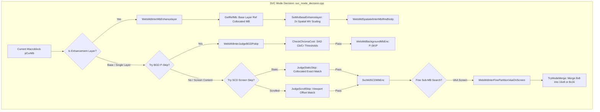
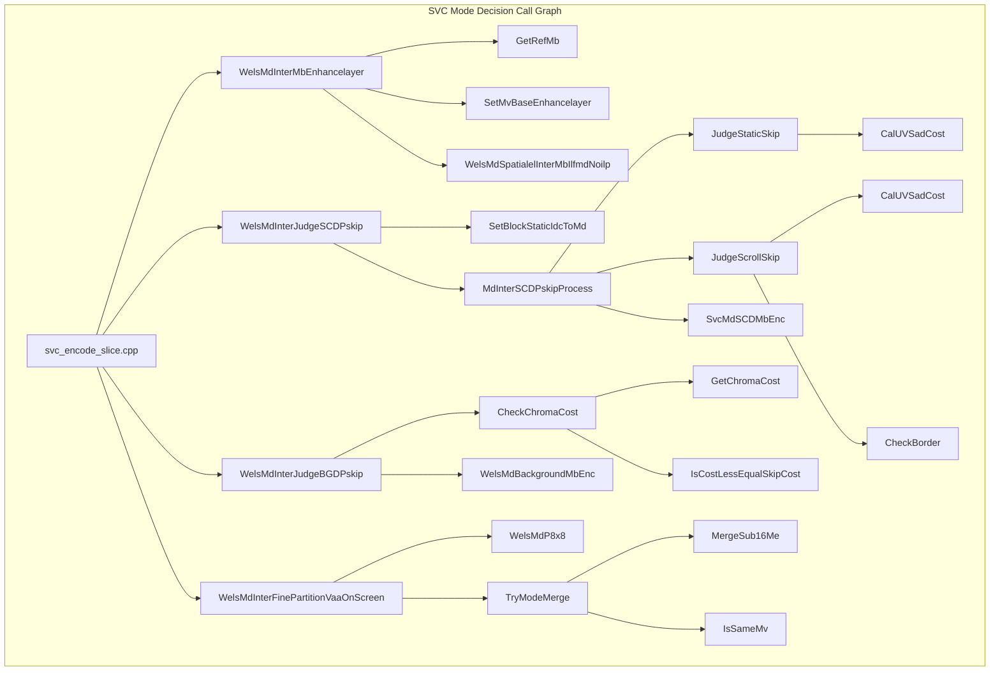

# OpenH264 Encoder: Mode Decision Engine (`svc_mode_decision.cpp`)

This document provides an exhaustive, literate-programming-style technical analysis of [codec/encoder/core/src/svc_mode_decision.cpp](openh264/codec/encoder/core/src/svc_mode_decision.cpp) and its associated header [codec/encoder/core/inc/svc_mode_decision.h](openh264/codec/encoder/core/inc/svc_mode_decision.h). It covers the algorithmic implementations for **Spatial Enhancement Layer Inter Mode Decision (ILFMD / NoILP)**, **Background Detection (BGD) P-Skip Decision with Chroma Artifact Suppression**, **Screen Content Coding (SCC) & Scene Change Detection (SCD) P-Skip (Collocated Static and Viewport Scrolled Skip)**, and **Sub-Macroblock Partition Merging**.

---

## Table of Contents
1. [Module Architecture & Pipeline Role](#1-module-architecture--pipeline-role)
2. [Data Structures, Types, Enums, and Constants](#2-data-structures-types-enums-and-constants)
   - [2.1 Enums & Function Pointer Types](#21-enums--function-pointer-types)
   - [2.2 Threshold Constants & Magic Numbers](#22-threshold-constants--magic-numbers)
   - [2.3 Core Data Structures](#23-core-data-structures)
3. [Algorithmic Principles & Mathematical Foundations](#3-algorithmic-principles--mathematical-foundations)
   - [3.1 Spatial Enhancement Layer MV Mapping (2x Upsampling)](#31-spatial-enhancement-layer-mv-mapping-2x-upsampling)
   - [3.2 Background Detection (BGD) P-Skip & Chroma Color Artifact Prevention](#32-background-detection-bgd-pskip--chroma-color-artifact-prevention)
   - [3.3 Screen Content Coding: Collocated & Scrolled P-Skip](#33-screen-content-coding-collocated--scrolled-pskip)
   - [3.4 Sub-Macroblock Partition Merging ($8\times 8 \to 16\times 8 / 8\times 16$)](#34-sub-macroblock-partition-merging-8times-8-to-16times-8--8times-16)
4. [Deep-Dive Function Analysis](#4-deep-dive-function-analysis)
   - [4.1 Spatial Enhancement Layer Mode Decision](#41-spatial-enhancement-layer-mode-decision)
     - [`WelsMdSpatialelInterMbIlfmdNoilp`](#welsmdspatialelintermbilfmdnoilp)
     - [`WelsMdInterMbEnhancelayer`](#welsmdintermbenhancelayer)
     - [`GetRefMb`](#getrefmb)
     - [`SetMvBaseEnhancelayer`](#setmvbaseenhancelayer)
   - [4.2 Background Detection (BGD) P-Skip Subsystem](#42-background-detection-bgd-pskip-subsystem)
     - [`GetChromaCost`](#getchromacost)
     - [`IsCostLessEqualSkipCost`](#iscostlessequalskipcost)
     - [`CheckChromaCost`](#checkchromacost)
     - [`WelsMdInterJudgeBGDPskip`](#welsmdinterjudgebgdpskip)
     - [`WelsMdInterJudgeBGDPskipFalse`](#welsmdinterjudgebgdpskipfalse)
     - [`WelsMdUpdateBGDInfo`](#welsmdupdatebgdinfo)
     - [`WelsMdUpdateBGDInfoNULL`](#welsmdupdatebgdinfonull)
   - [4.3 Screen Content Coding (SCC) & Scene Change Detection (SCD) Skip Decision](#43-screen-content-coding-scc--scene-change-detection-scd-skip-decision)
     - [`IsMbStatic`, `IsMbCollocatedStatic`, `IsMbScrolledStatic`](#ismbstatic-ismbcollocatedstatic-ismbscrolledstatic)
     - [`CalUVSadCost`](#caluvsadcost)
     - [`CheckBorder`](#checkborder)
     - [`JudgeStaticSkip`](#judgestaticskip)
     - [`JudgeScrollSkip`](#judgescrollskip)
     - [`SvcMdSCDMbEnc`](#svcmdscdmbenc)
     - [`MdInterSCDPskipProcess`](#mdinterscdpskipprocess)
     - [`SetBlockStaticIdcToMd`](#setblockstaticidctomd)
     - [`WelsMdInterJudgeSCDPskip`](#welsmdinterjudgescdpskip)
     - [`WelsMdInterJudgeSCDPskipFalse`](#welsmdinterjudgescdpskipfalse)
     - [`WelsInitSCDPskipFunc`](#welsinitscdpskipfunc)
   - [4.4 Sub-Macroblock Partition Evaluation & Mode Merging](#44-sub-macroblock-partition-evaluation--mode-merging)
     - [`MergeSub16Me`](#mergesub16me)
     - [`IsSameMv`](#issamemv)
     - [`TryModeMerge`](#trymodemerge)
     - [`WelsMdInterFinePartitionVaaOnScreen`](#welsmdinterfinepartitionvaaonscreen)
     - [`SetScrollingMvToMd`](#setscrollingmvtomd)
     - [`SetScrollingMvToMdNull`](#setscrollingmvtomdnull)
5. [Call Graph & Interaction Matrix](#5-call-graph--interaction-matrix)

---

## 1. Module Architecture & Pipeline Role

In the OpenH264 encoding pipeline ([svc_encode_slice.cpp](openh264/codec/encoder/core/src/svc_encode_slice.cpp) and [svc_encode_mb.cpp](openh264/codec/encoder/core/src/svc_encode_mb.cpp)), **Mode Decision (MD)** is the computational centerpiece responsible for selecting the optimal coding mode (e.g., `P_SKIP`, `P_16x16`, `P_16x8`, `P_8x16`, `P_8x8`, `I_16x16`, or `I_4x4`) for every $16\times 16$ macroblock (MB).

The source file [svc_mode_decision.cpp](openh264/codec/encoder/core/src/svc_mode_decision.cpp) provides four specialized, high-performance MD algorithmic subsystems:

1. **Spatial Enhancement Layer Inter Mode Decision (`NoILP / ILFMD`)**:
   Handles multi-layer Scalable Video Coding (SVC) spatial enhancement layers where Inter-Layer Intra Prediction is disabled (`NoILP`) or Inter-Layer Fast Mode Decision (`ILFMD`) is active. It maps and scales motion vectors from the lower base layer ($D_{i-1}$) to initialize candidate motion search vectors for the enhancement layer ($D_i$).

2. **Background Detection (BGD) P-Skip Acceleration**:
   Identifies stationary background blocks using pre-calculated Video Analysis and Assessment (VAA) flags. To prevent unsightly color banding and hue-shifting artifacts in surveillance and camera feeds, it enforces strict chroma planar difference thresholds before confirming a BGD skip.

3. **Screen Content Coding (SCC) & Scene Change Detection (SCD) Fast Skip**:
   Designed for desktop sharing, window scrolling, and document presentation video. It evaluates whether an MB matches a stationary collocated block (`STATIC`) or a globally translated viewport region (`SCROLLED`), allowing entire scrolled UI windows to be encoded as zero-residual P-Skip blocks with fractional CPU cost.

4. **Sub-Macroblock Fine Partitioning & Partition Merging (`TryModeMerge`)**:
   Evaluates $8\times 8$ sub-partitions for screen content and merges homogeneous $8\times 8$ partitions back into larger $16\times 8$ or $8\times 16$ macroblock modes when motion vectors and reference indices match, eliminating redundant sub-block header signaling overhead.



---

## 2. Data Structures, Types, Enums, and Constants

### 2.1 Enums & Function Pointer Types

Declared in [svc_mode_decision.h](openh264/codec/encoder/core/inc/svc_mode_decision.h#L56-L86):

```cpp
typedef enum {
  STATIC   = 0,  // Collocated static block matching the previous frame at offset (0, 0)
  SCROLLED = 1   // Scrolled static block matching the previous frame at offset (iScrollMvX, iScrollMvY)
} ESkipModes;
```

#### Function Pointer Definitions
* **`pJudgeSkipFun`**:
  ```cpp
  typedef bool (*pJudgeSkipFun) (sWelsEncCtx* pEncCtx, SMB* pCurMb, SMbCache* pMbCache, SWelsMD* pWelsMd);
  ```
  Dispatches to either [`JudgeStaticSkip`](#judgestaticskip) (index 0 / `STATIC`) or [`JudgeScrollSkip`](#judgescrollskip) (index 1 / `SCROLLED`).

* **`pfSCDPSkipDecision`**:
  A member of [SWelsFuncPtrList](openh264/codec/encoder/core/inc/wels_func_ptr_def.h) dispatched dynamically at slice/frame initialization:
  * Bound to [`WelsMdInterJudgeSCDPskip`](#welsmdinterjudgescdpskip) when screen scrolling detection is enabled.
  * Bound to [`WelsMdInterJudgeSCDPskipFalse`](#welsmdinterjudgescdpskipfalse) when screen scrolling detection is disabled.

---

### 2.2 Threshold Constants & Magic Numbers

| Constant | Value | Scope / Location | Algorithmic Purpose & Derivation |
| :--- | :--- | :--- | :--- |
| `DELTA_QP_BGD_THD` | `3` | [rc.h](openh264/codec/encoder/core/inc/rc.h#L78) | Maximum allowed quantization step delta ($QP_{\text{ref}} - QP_{\text{cur}} \le 3$) for Background Detection P-Skip. Prevents coarse-QP reference artifacts from propagating into finer-QP current frames. |
| `DELTA_QP_SCD_THD` | `5` | [svc_mode_decision.h](openh264/codec/encoder/core/inc/svc_mode_decision.h#L54) | Maximum allowed quantization delta ($QP_{\text{ref}} - QP_{\text{cur}} \le 5$) for Screen Content Scene Change Detection P-Skip. |
| `KNOWN_CHROMA_TOO_LARGE` | `640` | [svc_mode_decision.cpp:L174](openh264/codec/encoder/core/src/svc_mode_decision.cpp#L174) | Per-chroma plane 8x8 SAD threshold. If $SAD_{Cb} > 640$ or $SAD_{Cr} > 640$ (average pixel error $> 10$ across $64$ samples), color drift is visually noticeable, so BGD P-Skip is rejected. |
| `SMALLEST_INVISIBLE` | `128` | [svc_mode_decision.cpp:L175](openh264/codec/encoder/core/src/svc_mode_decision.cpp#L175) | Represents $2 \times 64 = 128$. An average pixel absolute difference of $\le 2$ across an $8\times 8$ block is imperceptible to the human visual system (HVS). |
| `MBVAASIGN_FLAT` | `15` | [md.h](openh264/codec/encoder/core/inc/md.h#L70) | VAA 8x8 block texture classification signature bitmask (`0x0F`). If all four $8\times 8$ blocks in an MB are flat, sub-partition mode decision is safely bypassed. |

---

### 2.3 Core Data Structures

The algorithms in `svc_mode_decision.cpp` interface with the primary encoder structures:

#### A. [SWelsMD](openh264/codec/encoder/core/inc/md.h#L86-L118) (`pWelsMd`)
Maintains mode decision cost accumulators, candidate motion vectors, and partition states for the active macroblock:
* `iLambda`: Lagrange multiplier $\lambda_{\text{MODE}}$ for rate-distortion cost computation ($J = D + \lambda R$).
* `iCostLuma`: Best accumulated luma distortion/rate-distortion cost.
* `iCostSkipMb`: Evaluated distortion cost for the P-Skip candidate mode.
* `iSadPredMb`, `iSadPredSkip`: Predicted SAD values derived from spatial neighbors used for fast early termination.
* `iBlock8x8StaticIdc[4]`: Array storing the static classification status (`COLLOCATED_STATIC`, `SCROLLED_STATIC`, or other) for each of the four $8\times 8$ sub-blocks.
* `sMe`: Nested structure containing motion estimation containers:
  * `sMe16x16`: Motion estimation parameters for $16\times 16$ partition.
  * `sMe8x8[4]`: Motion estimation parameters for four $8\times 8$ partitions.
  * `sMe16x8[2]`, `sMe8x16[2]`: Motion estimation parameters for rectangular sub-partitions.

#### B. [SVAAFrameInfoExt_t](openh264/codec/encoder/core/inc/wels_preprocess.h) (`pVaaExt`)
Pre-processing and video analysis metadata extracted during frame ingestion:
* `sScrollDetectInfo.bScrollDetectFlag`: Boolean flag set to `true` when global screen scrolling is detected in the frame.
* `sScrollDetectInfo.iScrollMvX`, `iScrollMvY`: Global screen translation displacement vector in integer pixel units.
* `pVaaBestBlockStaticIdc`: Array storing per-8x8-block static classification index.
* `pVaaBackgroundMbFlag`: Array of flags indicating whether each macroblock belongs to the static background model.

---

## 3. Algorithmic Principles & Mathematical Foundations

### 3.1 Spatial Enhancement Layer MV Mapping (2x Upsampling)

In SVC spatial scalability, an enhancement layer ($D_i$) typically doubles the spatial resolution of the reference base layer ($D_{i-1}$) in both horizontal and vertical dimensions ($W_{\text{enh}} = 2 W_{\text{base}}, H_{\text{enh}} = 2 H_{\text{base}}$).

#### Collocated Base MB Coordinate Derivation
For an enhancement layer macroblock at raster coordinates $(X_{\text{enh}}, Y_{\text{enh}})$:
$$X_{\text{base}} = X_{\text{enh}} \gg 1, \quad Y_{\text{base}} = Y_{\text{enh}} \gg 1$$
$$\text{Index}_{\text{base}} = Y_{\text{base}} \cdot W_{\text{base\_MB}} + X_{\text{base}}$$

#### Sub-Partition Mapping & Motion Vector Scaling
Because the spatial resolution is doubled, spatial distances and motion vectors scale by a factor of 2. The $4\times 4$ sub-block partition index within the base MB is determined by the quadrant offset of the enhancement MB:
$$\text{PartIdx} = ((Y_{\text{enh}} \& 1) \ll 1) + (X_{\text{enh}} \& 1)$$
$$\text{ScanIdx} = \text{g\_kuiMbCountScan4Idx}[\text{PartIdx} \ll 2]$$
$$\vec{MV}_{\text{base\_scaled}} = 2 \cdot \vec{MV}_{\text{base}}[\text{ScanIdx}] = \begin{pmatrix} 2 \cdot MV_{x} \\ 2 \cdot MV_{y} \end{pmatrix}$$

This $\vec{MV}_{\text{base\_scaled}}$ is loaded directly into `pMd->sMe.sMe16x16.sMvBase` and all sub-partition base vectors, establishing an accurate starting point for enhancement layer motion search.

---

### 3.2 Background Detection (BGD) P-Skip & Chroma Color Artifact Prevention

Background Detection classifies macroblocks that remain stationary over long durations. While luma ($Y$) differences might be small, subtle color shifts in chroma ($Cb/Cr$) can cause disturbing visual color patches (e.g., grey-to-yellow or green-to-pink tint shifts).

To guarantee visual quality, OpenH264 executes a rigorous multi-stage verification:

1. **VAA Background & Neighbor Consistency**:
   * Current MB flag `pVaaBgMbFlag[iMbXY]` must be non-zero.
   * Collocated reference MB must not be Intra-coded (`!IS_INTRA(uiRefMbType)`).
   * Quantization parameter constraint:
     $$(QP_{\text{ref}} - QP_{\text{cur}} \le 3) \quad \lor \quad (QP_{\text{ref}} \le 26)$$
2. **Chroma SAD Thresholding ([`CheckChromaCost`](#checkchromacost))**:
   * Measures $8\times 8$ SAD on both chroma planes: $SAD_{Cb} = \text{SAD8x8}(pCb_{\text{enc}}, pCb_{\text{ref}})$ and $SAD_{Cr} = \text{SAD8x8}(pCr_{\text{enc}}, pCr_{\text{ref}})$.
   * **Individual Plane Constraint**:
     $$SAD_{Cb} \le 640 \quad \text{and} \quad SAD_{Cr} \le 640$$
   * **Combined Chroma Skip Cost Comparison**:
     $$SAD_{\text{chroma}} = SAD_{Cb} + SAD_{Cr}$$
     The skip candidate is accepted only if $SAD_{\text{chroma}}$ does not exceed the predicted skip SAD threshold and is within imperceptible limits ($\le 128$).

---

### 3.3 Screen Content Coding: Collocated & Scrolled P-Skip

Screen content (e.g., text, spreadsheets, web browsers, slide presentations) exhibits two unique spatial-temporal properties:
1. **Pixel-Exact Static Blocks**: Macroblocks that are identical bit-for-bit to the collocated block in the previous frame.
2. **Global Viewport Scrolling**: Application windows or documents scrolled by $(\Delta X_{\text{scroll}}, \Delta Y_{\text{scroll}})$ pixels.

```
       Previous Frame Reference Buffer                 Current Encoding Frame
    +------------------------------------+      +------------------------------------+
    |                                    |      |                                    |
    |    [ Referenced Scrolled Block ]   |      |                                    |
    |    (X + dX, Y + dY)                |      |                                    |
    |            \                       |      |                                    |
    |             \                      |      |                                    |
    +--------------\---------------------+      +------------------------------------+
                    \                                           ^
                     \================ Global Translation =====/
                                       (iScrollMvX, iScrollMvY)
```

#### Viewport Scrolled Motion Vector Formulation
For scrolled skip, the motion vector in quarter-pel precision is derived from the integer scroll displacement:
$$MV_{x} = \text{Clip3}(-R_{\text{mv}}, R_{\text{mv}}, \Delta X_{\text{scroll}}) \ll 2$$
$$MV_{y} = \text{Clip3}(-R_{\text{mv}}, R_{\text{mv}}, \Delta Y_{\text{scroll}}) \ll 2$$

#### Pixel-Exact Verification
For both static and scrolled skip, OpenH264 tests both chroma planes ($Cb$ and $Cr$) against the reference picture. It requires:
$$SAD_{Cb} = 0 \quad \text{and} \quad SAD_{Cr} = 0$$
Zero chroma SAD ensures perfect color fidelity before committing to a zero-residual skip.

---

### 3.4 Sub-Macroblock Partition Merging ($8\times 8 \to 16\times 8 / 8\times 16$)

When fine partition search evaluates four $8\times 8$ sub-macroblocks, it is common in screen content for adjacent sub-blocks to share identical motion vectors and reference indices. Signaling four separate $8\times 8$ sub-partitions introduces unneeded syntax overhead in the bitstream.

[`TryModeMerge`](#trymodemerge) tests adjacent $8\times 8$ motion vectors:

```
        8x8 Partition Layout                  16x8 Merged Layout                  8x16 Merged Layout
    +-------------+-------------+       +---------------------------+       +-------------+-------------+
    |   SubMB 0   |   SubMB 1   |       |          Part 0           |       |   Part 0    |   Part 1    |
    |  (Me8x8[0]) |  (Me8x8[1]) |  ==>  |     (SubMB 0 + SubMB 1)   |  OR   |  (SubMB 0 + |  (SubMB 1 + |
    +-------------+-------------+       +---------------------------+       |   SubMB 2)  |   SubMB 3)  |
    |   SubMB 2   |   SubMB 3   |       |          Part 1           |       |             |             |
    |  (Me8x8[2]) |  (Me8x8[3]) |       |     (SubMB 2 + SubMB 3)   |       |             |             |
    +-------------+-------------+       +---------------------------+       +-------------+-------------+
```

* **Condition for $16\times 8$ Merge** (`iSameMv == 2`):
  $$\vec{MV}_{\text{Sub0}} == \vec{MV}_{\text{Sub1}} \quad \text{and} \quad \vec{MV}_{\text{Sub2}} == \vec{MV}_{\text{Sub3}}$$
  Merges into `MB_TYPE_16x8`.

* **Condition for $8\times 16$ Merge** (`iSameMv == 1`):
  $$\vec{MV}_{\text{Sub0}} == \vec{MV}_{\text{Sub2}} \quad \text{and} \quad \vec{MV}_{\text{Sub1}} == \vec{MV}_{\text{Sub3}}$$
  Merges into `MB_TYPE_8x16`.

---

## 4. Deep-Dive Function Analysis

### 4.1 Spatial Enhancement Layer Mode Decision

#### `WelsMdSpatialelInterMbIlfmdNoilp`
[svc_mode_decision.cpp:L53-L104](openh264/codec/encoder/core/src/svc_mode_decision.cpp#L53-L104)

```cpp
void WelsMdSpatialelInterMbIlfmdNoilp (sWelsEncCtx* pEncCtx, SWelsMD* pWelsMd, SSlice* pSlice,
                                       SMB* pCurMb, const Mb_Type kuiRefMbType);
```

* **Purpose**: Core mode decision routine for Inter-coded macroblocks in spatial enhancement layers when Inter-Layer Prediction is disabled (`NoILP`) or using Inter-Layer Fast Mode Decision (`ILFMD`).
* **Parameters**:
  * `pEncCtx`: Pointer to encoder context [sWelsEncCtx](openh264/codec/encoder/core/inc/encoder_context.h).
  * `pWelsMd`: Mode decision state structure [SWelsMD](openh264/codec/encoder/core/inc/md.h).
  * `pSlice`: Current slice descriptor [SSlice](openh264/codec/encoder/core/inc/slice.h).
  * `pCurMb`: Current macroblock data structure [SMB](openh264/codec/encoder/core/inc/svc_enc_macroblock.h).
  * `kuiRefMbType`: Macroblock type of the collocated base/reference layer MB.
* **Algorithmic Flow**:
  1. **Neighbor Skip Availability Check**: Inspects left, top, top-left, and top-right neighboring MBs using `uiNeighborAvail` bitmasks.
     ```cpp
     bool bTrySkip  = kbMbLeftAvailPskip | kbMbTopAvailPskip | kbMbTopLeftAvailPskip | kbMbTopRightAvailPskip;
     bool bKeepSkip = kbMbLeftAvailPskip & kbMbTopAvailPskip & kbMbTopRightAvailPskip;
     ```
  2. **Background Decision Hook**: Invokes `pfInterMdBackgroundDecision(...)`. If the MB is identified as background, MD terminates immediately.
  3. **P-Skip Candidate Check**: Evaluates [`WelsMdInterJudgePskip`](openh264/codec/encoder/core/inc/svc_base_layer_md.h#L84). If skip conditions hold and `bKeepSkip` is true, commits P-Skip via `WelsMdInterDecidedPskip` and returns.
  4. **Inter vs Intra Base Layer Branching**:
     * **If Base MB is Inter (`!IS_SVC_INTRA(kuiRefMbType)`)**:
       - Predicts SAD cost via `PredictSad(...)`.
       - Evaluates `P_16x16` mode cost via `WelsMdP16x16(...)`.
       - Evaluates secondary inter partition modes via `WelsMdInterSecondaryModesEnc(...)`.
     * **If Base MB is Intra (`IS_SVC_INTRA(kuiRefMbType)`)**:
       - Evaluates `I_16x16` cost via `WelsMdI16x16(...)`.
       - If `bSkip` was successful and luma cost $\le$ `kiCostI16x16`, commits P-Skip.
       - Otherwise sets mode to `MB_TYPE_INTRA16x16` and tests secondary intra modes via `WelsMdIntraSecondaryModesEnc(...)`.

---

#### `WelsMdInterMbEnhancelayer`
[svc_mode_decision.cpp:L108-L118](openh264/codec/encoder/core/src/svc_mode_decision.cpp#L108-L118)

```cpp
void WelsMdInterMbEnhancelayer (sWelsEncCtx* pEncCtx, SWelsMD* pMd, SSlice* pSlice, SMB* pCurMb, SMbCache* pMbCache);
```

* **Purpose**: Top-level entry point called from the slice encoder for spatial enhancement layer Inter MB mode decision.
* **Operation**:
  1. Resolves collocated base layer reference MB via [`GetRefMb`](#getrefmb).
  2. Scales and initializes base motion vectors via [`SetMvBaseEnhancelayer`](#setmvbaseenhancelayer).
  3. Dispatches to [`WelsMdSpatialelInterMbIlfmdNoilp`](#welsmdspatialelintermbilfmdnoilp).

---

#### `GetRefMb`
[svc_mode_decision.cpp:L122-L127](openh264/codec/encoder/core/src/svc_mode_decision.cpp#L122-L127)

```cpp
SMB* GetRefMb (SDqLayer* pCurLayer, SMB* pCurMb);
```

* **Purpose**: Maps current enhancement layer macroblock to the collocated base layer reference macroblock.
* **Formula**:
  $$\text{kiRefMbIdx} = \left(\text{iMbY} \gg 1\right) \cdot W_{\text{ref\_MB}} + \left(\text{iMbX} \gg 1\right)$$
* **Returns**: Pointer `&kpRefLayer->sMbDataP[kiRefMbIdx]`.

---

#### `SetMvBaseEnhancelayer`
[svc_mode_decision.cpp:L129-L151](openh264/codec/encoder/core/src/svc_mode_decision.cpp#L129-L151)

```cpp
void SetMvBaseEnhancelayer (SWelsMD* pMd, SMB* pCurMb, const SMB* kpRefMb);
```

* **Purpose**: Initializes the base motion vector candidates (`sMvBase`) in `SWelsMD` by 2x scaling of the base layer reference MB motion vectors.
* **Operation**:
  If the base layer MB is not Intra-coded:
  ```cpp
  int32_t iRefMbPartIdx = ((pCurMb->iMbY & 0x01) << 1) + (pCurMb->iMbX & 0x01);
  int32_t iScan4RefPartIdx = g_kuiMbCountScan4Idx[(iRefMbPartIdx << 2)];
  sMv.iMvX = kpRefMb->sMv[iScan4RefPartIdx].iMvX * 2;
  sMv.iMvY = kpRefMb->sMv[iScan4RefPartIdx].iMvY * 2;
  ```
  Copies `sMv` to `sMe16x16.sMvBase`, `sMe8x8[0..3].sMvBase`, `sMe16x8[0..1].sMvBase`, and `sMe8x16[0..1].sMvBase`.

---

### 4.2 Background Detection (BGD) P-Skip Subsystem

#### `GetChromaCost`
[svc_mode_decision.cpp:L161-L164](openh264/codec/encoder/core/src/svc_mode_decision.cpp#L161-L164)

```cpp
inline int32_t GetChromaCost (PSampleSadSatdCostFunc* pCalculateFunc,
                              uint8_t* pSrcChroma, int32_t iSrcStride,
                              uint8_t* pRefChroma, int32_t iRefStride);
```

* **Purpose**: Computes the Sum of Absolute Differences (SAD) for an $8\times 8$ chroma block ($Cb$ or $Cr$) by calling the SIMD-accelerated function pointer `pCalculateFunc[BLOCK_8x8]`.

---

#### `IsCostLessEqualSkipCost`
[svc_mode_decision.cpp:L165-L172](openh264/codec/encoder/core/src/svc_mode_decision.cpp#L165-L172)

```cpp
inline bool IsCostLessEqualSkipCost (int32_t iCurCost, const int32_t iPredPskipSad, const int32_t iRefMbType,
                                     const SPicture* pRef, const int32_t iMbXy, const int32_t iSmallestInvisibleTh);
```

* **Purpose**: Helper function determining if the evaluated candidate cost is too high to qualify for P-Skip.
* **Condition**:
  Returns `true` (meaning skip is **invalid**) if:
  1. `iPredPskipSad > iSmallestInvisibleTh` AND `iCurCost >= iPredPskipSad`, OR
  2. Reference picture is a P-slice, reference MB was `MB_TYPE_SKIP`, reference skip SAD $> 128$, and `iCurCost >= pRef->pMbSkipSad[iMbXy]`.

---

#### `CheckChromaCost`
[svc_mode_decision.cpp:L173-L213](openh264/codec/encoder/core/src/svc_mode_decision.cpp#L173-L213)

```cpp
bool CheckChromaCost (sWelsEncCtx* pEncCtx, SWelsMD* pWelsMd, SMbCache* pMbCache, const int32_t iCurMbXy);
```

* **Purpose**: Validates chroma color difference between current and reference MBs to prevent noticeable color artifacts during background P-Skip.
* **Key Logic**:
  * Calculates `iCbSad` and `iCrSad` on $8\times 8$ chroma planes.
  * Checks if either chroma plane exceeds `KNOWN_CHROMA_TOO_LARGE` (640):
    ```cpp
    const bool bChromaTooLarge = (iCbSad > 640 || iCrSad > 640);
    ```
  * Predicts skip SAD via `PredictSadSkip(...)` and checks combined chroma cost `iChromaSad = iCbSad + iCrSad` via `IsCostLessEqualSkipCost(...)`.
* **Returns**: `true` if chroma differences are imperceptible and skip is safe; `false` otherwise.

---

#### `WelsMdInterJudgeBGDPskip`
[svc_mode_decision.cpp:L216-L255](openh264/codec/encoder/core/src/svc_mode_decision.cpp#L216-L255)

```cpp
bool WelsMdInterJudgeBGDPskip (sWelsEncCtx* pEncCtx, SWelsMD* pWelsMd, SSlice* pSlice,
                               SMB* pCurMb, SMbCache* pMbCache, bool* bKeepSkip);
```

* **Purpose**: Primary decision logic for Background Detection (BGD) P-Skip mode.
* **Operation**:
  1. Updates neighbor skip persistence flag `*bKeepSkip` based on neighboring VAA background flags (`pVaaBgMbFlag[-1]`, `[-kiMbWidth]`, `[-kiMbWidth+1]`).
  2. Verifies background prerequisites:
     - `*pVaaBgMbFlag == true`
     - Collocated reference MB is not Intra (`!IS_INTRA(pMbCache->uiRefMbType)`)
     - Quantization condition: `(kiRefMbQp - kiCurMbQp <= 3) || (kiRefMbQp <= 26)`
  3. Executes [`CheckChromaCost`](#checkchromacost).
  4. If all checks pass:
     - Derives predicted skip motion vector via `PredSkipMv(pMbCache, &sVaaPredSkipMv)`.
     - Encodes background MB via `WelsMdBackgroundMbEnc(..., (LD32(&sVaaPredSkipMv) == 0))`.
     - Returns `true`.
  5. Returns `false` otherwise.

---

#### `WelsMdInterJudgeBGDPskipFalse`
[svc_mode_decision.cpp:L257-L260](openh264/codec/encoder/core/src/svc_mode_decision.cpp#L257-L260)

```cpp
bool WelsMdInterJudgeBGDPskipFalse (sWelsEncCtx* pCtx, SWelsMD* pMd, SSlice* pSlice,
                                    SMB* pCurMb, SMbCache* pMbCache, bool* bKeepSkip);
```

* **Purpose**: Stub function used when Background Detection is disabled; unconditionally returns `false`.

---

#### `WelsMdUpdateBGDInfo` & `WelsMdUpdateBGDInfoNULL`
[svc_mode_decision.cpp:L267-L287](openh264/codec/encoder/core/src/svc_mode_decision.cpp#L267-L287)

```cpp
void WelsMdUpdateBGDInfo (SDqLayer* pCurLayer, SMB* pCurMb, const bool bCollocatedPredFlag, const int32_t iRefPictureType);
void WelsMdUpdateBGDInfoNULL (SDqLayer* pCurLayer, SMB* pCurMb, const bool bCollocatedPredFlag, const int32_t iRefPictureType);
```

* **Purpose**: Updates the reference picture's QP metadata table (`pDecPic->pRefMbQp[kiMbXY]`) following mode decision.
* **Logic**:
  * If the macroblock has non-zero transform coefficients (`pCurMb->uiCbp != 0`), the reference picture is an Intra frame (`I_SLICE`), or collocated prediction is disabled (`!bCollocatedPredFlag`), records current MB QP `pCurMb->uiLumaQp`.
  * Otherwise, propagates previous reference picture QP `pRefPicRefMbQpList[kiMbXY]`.
  * If `pCurMb->uiMbType == MB_TYPE_BACKGROUND`, standardizes the type to `MB_TYPE_SKIP`.

---

### 4.3 Screen Content Coding (SCC) & Scene Change Detection (SCD) Skip Decision

#### `IsMbStatic`, `IsMbCollocatedStatic`, `IsMbScrolledStatic`
[svc_mode_decision.cpp:L293-L306](openh264/codec/encoder/core/src/svc_mode_decision.cpp#L293-L306)

```cpp
inline bool IsMbStatic (int32_t* pBlockType, EStaticBlockIdc eType);
inline bool IsMbCollocatedStatic (int32_t* pBlockType);
inline bool IsMbScrolledStatic (int32_t* pBlockType);
```

* **Purpose**: Checks whether all four $8\times 8$ sub-blocks within the macroblock match the static classification type `eType` (`COLLOCATED_STATIC` or `SCROLLED_STATIC`).

---

#### `CalUVSadCost`
[svc_mode_decision.cpp:L308-L311](openh264/codec/encoder/core/src/svc_mode_decision.cpp#L308-L311)

```cpp
inline int32_t CalUVSadCost (SWelsFuncPtrList* pFunc, uint8_t* pEncOri, int32_t iStrideUV,
                             uint8_t* pRefOri, int32_t iRefLineSize);
```

* **Purpose**: Computes $8\times 8$ SAD between original source chroma pixels and reference picture chroma pixels via `pFunc->sSampleDealingFuncs.pfSampleSad[BLOCK_8x8]`.

---

#### `CheckBorder`
[svc_mode_decision.cpp:L313-L320](openh264/codec/encoder/core/src/svc_mode_decision.cpp#L313-L320)

```cpp
inline bool CheckBorder (int32_t iMbX, int32_t iMbY, int32_t iScrollMvX, int32_t iScrollMvY,
                         int32_t iMbWidth, int32_t iMbHeight);
```

* **Purpose**: Frame boundary safety validation for scrolled screen content blocks.
* **Logic**:
  Returns `true` (out-of-bounds violation) if:
  $$(iMbX \ll 4) + iScrollMvX < 0 \quad \lor \quad (iMbX \ll 4) + iScrollMvX > (iMbWidth - 1) \ll 4$$
  $$(iMbY \ll 4) + iScrollMvY < 0 \quad \lor \quad (iMbY \ll 4) + iScrollMvY > (iMbHeight - 1) \ll 4$$

---

#### `JudgeStaticSkip`
[svc_mode_decision.cpp:L323-L349](openh264/codec/encoder/core/src/svc_mode_decision.cpp#L323-L349)

```cpp
bool JudgeStaticSkip (sWelsEncCtx* pEncCtx, SMB* pCurMb, SMbCache* pMbCache, SWelsMD* pWelsMd);
```

* **Purpose**: Evaluates eligibility for Collocated Static P-Skip (`STATIC`).
* **Validation**:
  1. Tests if all four sub-blocks are `COLLOCATED_STATIC`.
  2. Computes chroma $8\times 8$ SAD costs `iSadCostCb` and `iSadCostCr` on original uncompressed source buffers (`pRefOri[0]`).
  3. Demands exact zero residual: returns `true` only if `iSadCostCb == 0` AND `iSadCostCr == 0`.

---

#### `JudgeScrollSkip`
[svc_mode_decision.cpp:L351-L390](openh264/codec/encoder/core/src/svc_mode_decision.cpp#L351-L390)

```cpp
bool JudgeScrollSkip (sWelsEncCtx* pEncCtx, SMB* pCurMb, SMbCache* pMbCache, SWelsMD* pWelsMd);
```

* **Purpose**: Evaluates eligibility for Viewport Scrolled P-Skip (`SCROLLED`).
* **Validation**:
  1. Verifies `pVaaExt->sScrollDetectInfo.bScrollDetectFlag == true` and sub-blocks are `SCROLLED_STATIC`.
  2. Executes [`CheckBorder`](#checkborder) to prevent memory access violations.
  3. Calculates chroma offsets shifted by the half-scale scroll motion vector $(iScrollMvX \gg 1, iScrollMvY \gg 1)$.
  4. Returns `true` only if `iSadCostCb == 0` AND `iSadCostCr == 0`.

---

#### `SvcMdSCDMbEnc`
[svc_mode_decision.cpp:L392-L466](openh264/codec/encoder/core/src/svc_mode_decision.cpp#L392-L466)

```cpp
void SvcMdSCDMbEnc (sWelsEncCtx* pEncCtx, SWelsMD* pWelsMd, SMB* pCurMb, SMbCache* pMbCache,
                    SSlice* pSlice, bool bQpSimilarFlag, bool bMbSkipFlag,
                    SMVUnitXY sCurMbMv[], ESkipModes eSkipMode);
```

* **Purpose**: Encodes and reconstructs a macroblock that passed Static or Scrolled P-Skip evaluation.
* **Operation**:
  1. Executes luma and chroma motion compensation (`pMcLumaFunc`, `pMcChromaFunc`).
  2. Calculates $16\times 16$ luma SAD cost.
  3. **P-Skip Path (`bQpSimilarFlag && bMbSkipFlag`)**:
     - Sets reference index to 0 (`ST32(pCurMb->pRefIndex, 0)`).
     - Updates macroblock motion vector via `pfUpdateMbMv`.
     - Sets `pCurMb->uiMbType = MB_TYPE_SKIP`.
     - Reconstructs via `WelsRecPskip(...)` and updates state via `WelsMdInterUpdatePskip(...)`.
  4. **P_16x16 Path (QP mismatch or MV deviation)**:
     - Sets `pCurMb->uiMbType = MB_TYPE_16x16`.
     - Predicts MV via `PredMv(...)` and updates motion info via `UpdateP16x16MotionInfo(...)`.
     - Executes residual transform, quantization, and entropy encoding via `WelsInterMbEncode(...)` and `WelsPMbChromaEncode(...)`.
     - Copies reconstructed pixels to `pCsMb` cache planes using `pfCopy16x16Aligned` and `pfCopy8x8Aligned`.

---

#### `MdInterSCDPskipProcess`
[svc_mode_decision.cpp:L468-L502](openh264/codec/encoder/core/src/svc_mode_decision.cpp#L468-L502)

```cpp
bool MdInterSCDPskipProcess (sWelsEncCtx* pEncCtx, SWelsMD* pWelsMd, SSlice* pSlice,
                             SMB* pCurMb, SMbCache* pMbCache, ESkipModes eSkipMode);
```

* **Purpose**: Dispatches skip evaluation for the specified `eSkipMode` (`STATIC` or `SCROLLED`).
* **Operation**:
  - Invokes `pJudeSkip[eSkipMode](...)`.
  - If skip is validated:
    - Evaluates QP similarity: `bQpSimilarFlag = (kiRefMbQp - kiCurMbQp <= 5 || kiRefMbQp <= 26)`.
    - For `SCROLLED`, clips scroll MV to `[-pEncCtx->iMvRange, pEncCtx->iMvRange]` and shifts to quarter-pel precision (`<< 2`).
    - Checks if candidate MV matches predicted skip MV (`bMbSkipFlag`).
    - Calls [`SvcMdSCDMbEnc`](#svcmdscdmbenc) and returns `true`.
  - Returns `false` otherwise.

---

#### `SetBlockStaticIdcToMd`
[svc_mode_decision.cpp:L504-L521](openh264/codec/encoder/core/src/svc_mode_decision.cpp#L504-L521)

```cpp
void SetBlockStaticIdcToMd (void* pVaa, SWelsMD* pWelsMd, SMB* pCurMb, SDqLayer* pDqLayer);
```

* **Purpose**: Copies the 8x8 static classification indices from the VAA structure (`pVaaBestBlockStaticIdc`) to `pWelsMd->iBlock8x8StaticIdc[0..3]`.

---

#### `WelsMdInterJudgeSCDPskip`, `WelsMdInterJudgeSCDPskipFalse`, & `WelsInitSCDPskipFunc`
[svc_mode_decision.cpp:L526-L555](openh264/codec/encoder/core/src/svc_mode_decision.cpp#L526-L555)

```cpp
bool WelsMdInterJudgeSCDPskip (sWelsEncCtx* pEncCtx, SWelsMD* pWelsMd, SSlice* slice, SMB* pCurMb, SMbCache* pMbCache);
bool WelsMdInterJudgeSCDPskipFalse (sWelsEncCtx* pEncCtx, SWelsMD* pWelsMd, SSlice* slice, SMB* pCurMb, SMbCache* pMbCache);
void WelsInitSCDPskipFunc (SWelsFuncPtrList* pFuncList, const bool bScrollingDetection);
```

* **Purpose**: Top-level entry points and initialization helper for Screen Content Scene Change Detection P-Skip.
* `WelsMdInterJudgeSCDPskip`:
  1. Calls `SetBlockStaticIdcToMd(...)`.
  2. Tests `MdInterSCDPskipProcess(..., STATIC)`. Returns `true` if committed.
  3. Tests `MdInterSCDPskipProcess(..., SCROLLED)`. Returns `true` if committed.
  4. Returns `false` otherwise.
* `WelsInitSCDPskipFunc`: Dynamically assigns `pFuncList->pfSCDPSkipDecision` to `WelsMdInterJudgeSCDPskip` or `WelsMdInterJudgeSCDPskipFalse`.

---

### 4.4 Sub-Macroblock Partition Evaluation & Mode Merging

#### `MergeSub16Me` & `IsSameMv`
[svc_mode_decision.cpp:L563-L571](openh264/codec/encoder/core/src/svc_mode_decision.cpp#L563-L571)

```cpp
static inline void MergeSub16Me (const SWelsME& sSrcMe0, const SWelsME& sSrcMe1, SWelsME* pTarMe);
static inline bool IsSameMv (const SMVUnitXY& sMv0, const SMVUnitXY& sMv1);
```

* `MergeSub16Me`: Copies ME metadata from `sSrcMe0` to `pTarMe` and aggregates SAD/SATD costs:
  $$Cost_{\text{SAD}} = Cost_{\text{SAD}, 0} + Cost_{\text{SAD}, 1}, \quad Cost_{\text{SATD}} = Cost_{\text{SATD}, 0} + Cost_{\text{SATD}, 1}$$
* `IsSameMv`: Returns `true` if $(MV_{0x} == MV_{1x}) \land (MV_{0y} == MV_{1y})$.

---

#### `TryModeMerge`
[svc_mode_decision.cpp:L572-L615](openh264/codec/encoder/core/src/svc_mode_decision.cpp#L572-L615)

```cpp
bool TryModeMerge (SMbCache* pMbCache, SWelsMD* pWelsMd, SMB* pCurMb);
```

* **Purpose**: Attempts to merge four $8\times 8$ partitions into two $16\times 8$ or $8\times 16$ partitions for screen content coding.
* **Bitmask Decision**:
  ```cpp
  const int32_t iSameMv = ((bSameMv16x8_0 && bSameMv16x8_1) << 1) | (bSameMv8x16_0 && bSameMv8x16_1);
  ```
  * `case 2` ($16\times 8$ match): Sets `pCurMb->uiMbType = MB_TYPE_16x8`, merges ME info via `MergeSub16Me`, and computes predicted MVs via `PredInter16x8Mv`.
  * `case 1` ($8\times 16$ match): Sets `pCurMb->uiMbType = MB_TYPE_8x16`, merges ME info via `MergeSub16Me`, and computes predicted MVs via `PredInter8x16Mv`.
* **Returns**: `true` if partitions were merged (`uiMbType != MB_TYPE_8x8`); `false` otherwise.

---

#### `WelsMdInterFinePartitionVaaOnScreen`
[svc_mode_decision.cpp:L618-L666](openh264/codec/encoder/core/src/svc_mode_decision.cpp#L618-L666)

```cpp
void WelsMdInterFinePartitionVaaOnScreen (sWelsEncCtx* pEncCtx, SWelsMD* pWelsMd, SSlice* pSlice,
                                         SMB* pCurMb, int32_t iBestCost);
```

* **Purpose**: Evaluates sub-macroblock fine inter partitions ($P\_8\times 8$) for screen content coding based on VAA texture signatures.
* **Operation**:
  1. Queries VAA MB texture signature via `pfGetMbSignFromInterVaa(...)`. If `MBVAASIGN_FLAT`, returns early.
  2. Computes $P\_8\times 8$ mode cost via `WelsMdP8x8(...)`.
  3. If `iCostP8x8 < iBestCost`:
     - Updates `pCurMb->uiMbType = MB_TYPE_8x8`.
     - Initializes sub-MB types to `SUB_MB_TYPE_8x8`.
     - Invokes [`TryModeMerge`](#trymodemerge) to merge identical sub-partitions into $16\times 8$ or $8\times 16$.
  4. Updates `pWelsMd->iCostLuma = iBestCost`.

---

#### `SetScrollingMvToMd` & `SetScrollingMvToMdNull`
[svc_mode_decision.cpp:L675-L690](openh264/codec/encoder/core/src/svc_mode_decision.cpp#L675-L690)

```cpp
void SetScrollingMvToMd (SVAAFrameInfo* pVaa, SWelsMD* pWelsMd);
void SetScrollingMvToMdNull (SVAAFrameInfo* pVaa, SWelsMD* pWelsMd);
```

* `SetScrollingMvToMd`: Copies the global screen scrolling displacement $(iScrollMvX, iScrollMvY)$ from VAA into the directional motion vector fields: `sMe16x16.sDirectionalMv` and `sMe8x8[0..3].sDirectionalMv`.
* `SetScrollingMvToMdNull`: No-op stub when screen scrolling detection is disabled.

---

## 5. Call Graph & Interaction Matrix


