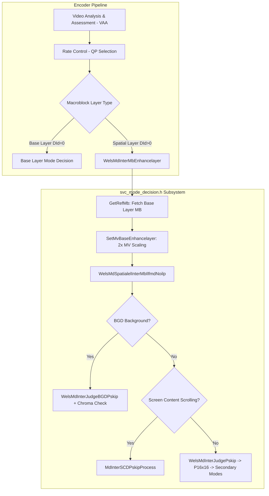
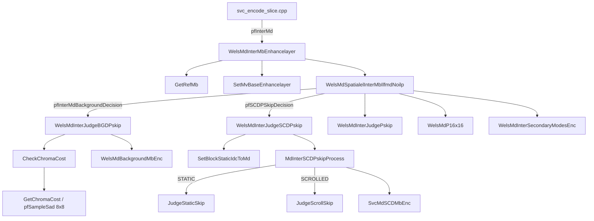

# `svc_mode_decision.h`: SVC Spatial Enhancement Layer Mode Decision & Screen Content Coding

This document provides a comprehensive, literate-programming-style deep dive into the data structures, macros, enumerations, function pointer types, and algorithmic routines declared in [`codec/encoder/core/inc/svc_mode_decision.h`](openh264/codec/encoder/core/inc/svc_mode_decision.h) and implemented in [`codec/encoder/core/src/svc_mode_decision.cpp`](openh264/codec/encoder/core/src/svc_mode_decision.cpp).

---

## Table of Contents
1. [Module Overview & Architectural Role](#1-module-overview--architectural-role)
2. [Macro Constants & Enumerations](#2-macro-constants--enumerations)
3. [Type Definitions & Function Pointers](#3-type-definitions--function-pointers)
4. [Detailed Function Breakdown](#4-detailed-function-breakdown)
   - [4.1 Spatial Enhancement Layer Mode Decision (ILFMD / NoILP)](#41-spatial-enhancement-layer-mode-decision-ilfmd--noilp)
   - [4.2 Background Detection (BGD) P-Skip Mode Decision](#42-background-detection-bgd-p-skip-mode-decision)
   - [4.3 Screen Content Coding (SCC) & Scene Change Detection (SCD) P-Skip](#43-screen-content-coding-scc--scene-change-detection-scd-p-skip)
   - [4.4 Screen Content Fine Partition & Sub-16x16 Mode Merging](#44-screen-content-fine-partition--sub-16x16-mode-merging)
   - [4.5 Global Scrolling Motion Vector Dispatch](#45-global-scrolling-motion-vector-dispatch)
5. [Data Flow & Call Graph Architecture](#5-data-flow--call-graph-architecture)

---

## 1. Module Overview & Architectural Role

In the OpenH264 encoder pipeline, **Mode Decision (MD)** is the core decision-making subsystem responsible for selecting the optimal macroblock coding mode (e.g., `P_SKIP`, `P_16x16`, `P_16x8`, `P_8x16`, `P_8x8`, `I_16x16`, or `I_4x4`) by minimizing rate-distortion cost:

$$\text{Cost} = D + \lambda \cdot R$$

where $D$ represents the distortion (evaluated via Sum of Absolute Differences [SAD] or Sum of Absolute Transformed Differences [SATD]), $R$ represents the rate (bit cost of motion vector differences and coding syntax), and $\lambda$ is the Lagrangian multiplier derived from the quantization parameter ($QP$).

[`svc_mode_decision.h`](openh264/codec/encoder/core/inc/svc_mode_decision.h) defines specialized Mode Decision routines for three critical encoder operational modes:

1. **Scalable Video Coding (SVC) Spatial Enhancement Layers**:
   - Manages Inter-Layer Fast Mode Decision without Inter-Layer Residual Prediction (**ILFMD / NoILP**).
   - Projects and scales base-layer motion vectors ($MV_{\text{base}}$) across dyadic spatial resolution boundaries ($2:1$ downsampling) to initialize enhancement-layer motion searches.
2. **Background Detection (BGD) Accelerated P-Skip**:
   - Utilizes frame-level Video Analysis and Assessment ([`VAA`](openh264/codec/encoder/core/inc/wels_preprocess.h)) background flags to fast-terminate static camera background macroblocks into `P_SKIP`.
   - Incorporates Chroma Color Distortion Verification ([`CheckChromaCost`](openh264/codec/encoder/core/src/svc_mode_decision.cpp#L173-L213)) to prevent color-bleeding artifacts in flat chroma regions.
3. **Screen Content Coding (SCC) & Scene Change Detection (SCD)**:
   - Evaluates static collocated screen blocks and detected global document/window scrolling motion vectors (`sScrollDetectInfo`).
   - Enables fast `P_SKIP` or `P_16x16` encoding for screen content windows without exhaustive motion search.
   - Implements partition merging (`TryModeMerge`) to combine homogeneous `8x8` sub-partitions into `16x8` or `8x16` macroblocks.



---

## 2. Macro Constants & Enumerations

### 2.1 Constants

```cpp
#define DELTA_QP_SCD_THD 5
```

* **Definition**: [`DELTA_QP_SCD_THD`](openh264/codec/encoder/core/inc/svc_mode_decision.h#L54) defines the maximum allowable Quantization Parameter delta ($\Delta QP$) between the reference frame collocated macroblock and the current frame macroblock for Scene Change Detection (SCD) / Screen Content Coding (SCC) fast P-Skip decisions.
* **Algorithmic Condition**:
  $$\left(QP_{\text{ref\_mb}} - QP_{\text{cur\_mb}} \le \text{DELTA\_QP\_SCD\_THD}\right) \quad \lor \quad \left(QP_{\text{ref\_mb}} \le 26\right)$$
* **Design Rationale**: If the reference macroblock was encoded with a significantly coarser quantization step (higher $QP$) than the current target macroblock ($QP_{\text{cur\_mb}}$), skipping the block would introduce unacceptable visual degradation or blurring. However, if $QP_{\text{ref\_mb}} \le 26$, the reference macroblock is already encoded at high visual fidelity, permitting skip regardless of $\Delta QP$.

---

### 2.2 Enumerations

#### `ESkipModes`

Declared in [`svc_mode_decision.h:L56-L59`](openh264/codec/encoder/core/inc/svc_mode_decision.h#L56-L59):

```cpp
typedef enum {
  STATIC,
  SCROLLED
} ESkipModes;
```

* **Purpose**: Identifies the screen content candidate motion hypothesis evaluated during fast P-Skip processing in [`MdInterSCDPskipProcess`](openh264/codec/encoder/core/src/svc_mode_decision.cpp#L468-L502).

| Enumerator | Integer Value | Description |
| :--- | :--- | :--- |
| `STATIC` | `0` | Evaluates zero-motion collocated static block skip candidate (`MV = (0, 0)`). |
| `SCROLLED` | `1` | Evaluates global translation scrolling skip candidate using scrolling motion vectors extracted by VAA (`sScrollDetectInfo.iScrollMvX`, `sScrollDetectInfo.iScrollMvY`). |

---

## 3. Type Definitions & Function Pointers

### `pJudgeSkipFun`

Declared in [`svc_mode_decision.h:L86`](openh264/codec/encoder/core/inc/svc_mode_decision.h#L86):

```cpp
typedef bool (*pJudgeSkipFun) (sWelsEncCtx* pEncCtx, SMB* pCurMb, SMbCache* pMbCache, SWelsMD* pWelsMd);
```

* **Purpose**: Function pointer typedef defining the interface for screen content skip candidate evaluation functions.
* **Dispatch Table**: Array `pJudeSkip[2] = { JudgeStaticSkip, JudgeScrollSkip }` inside [`MdInterSCDPskipProcess`](openh264/codec/encoder/core/src/svc_mode_decision.cpp#L476).
* **Parameters**:
  * `pEncCtx`: Pointer to the top-level encoder context ([`sWelsEncCtx`](openh264/codec/encoder/core/inc/encoder_context.h)).
  * `pCurMb`: Pointer to current macroblock metadata structure ([`SMB`](openh264/codec/encoder/core/inc/svc_enc_macroblock.h)).
  * `pMbCache`: Pointer to slice macroblock cache ([`SMbCache`](openh264/codec/encoder/core/inc/svc_enc_macroblock.h)).
  * `pWelsMd`: Pointer to mode decision state structure ([`SWelsMD`](openh264/codec/encoder/core/inc/md.h)).
* **Return Value**: `true` if the macroblock passes the static/scrolled screen content skip criteria; `false` otherwise.

---

## 4. Detailed Function Breakdown

### 4.1 Spatial Enhancement Layer Mode Decision (ILFMD / NoILP)

#### `WelsMdInterMbEnhancelayer`

Declared in [`svc_mode_decision.h:L64`](openh264/codec/encoder/core/inc/svc_mode_decision.h#L64), implemented in [`svc_mode_decision.cpp:L108-L118`](openh264/codec/encoder/core/src/svc_mode_decision.cpp#L108-L118).

```cpp
void WelsMdInterMbEnhancelayer (sWelsEncCtx* pEnc, SWelsMD* pMd, SSlice* pSlice, SMB* pCurMb, SMbCache* pMbCache);
```

* **Purpose**: Top-level entry point assigned to `pEncCtx->pFuncList->pfInterMd` for inter macroblocks in spatial enhancement layers ($D_{\text{id}} > 0$).
* **Execution Flow**:
  1. Calls [`GetRefMb`](#getrefmb) to locate the collocated lower-resolution base layer macroblock (`kpInterLayerRefMb`).
  2. Calls [`SetMvBaseEnhancelayer`](#setmvbaseenhancelayer) to map and scale the base layer motion vector by $2\times$ into the enhancement layer search predictors.
  3. Dispatches to [`WelsMdSpatialelInterMbIlfmdNoilp`](#welsmdspatialelintermbilfmdnoilp) to execute the mode decision search.

---

#### `GetRefMb`

Declared in [`svc_mode_decision.h:L65`](openh264/codec/encoder/core/inc/svc_mode_decision.h#L65), implemented in [`svc_mode_decision.cpp:L122-L127`](openh264/codec/encoder/core/src/svc_mode_decision.cpp#L122-L127).

```cpp
SMB* GetRefMb (SDqLayer* pCurLayer, SMB* pCurMb);
```

* **Purpose**: Computes the memory address of the collocated base reference layer macroblock in a dyadic ($2:1$ spatial resolution downsampled) SVC hierarchy.
* **Mathematical Formula**:
  Given enhancement layer macroblock raster coordinates $(X_{\text{cur}}, Y_{\text{cur}})$:
  $$X_{\text{ref}} = X_{\text{cur}} \gg 1, \quad Y_{\text{ref}} = Y_{\text{cur}} \gg 1$$
  $$\text{Index}_{\text{ref}} = Y_{\text{ref}} \cdot W_{\text{ref\_mb}} + X_{\text{ref}}$$
  where $W_{\text{ref\_mb}}$ is the base layer width in macroblocks (`kpRefLayer->iMbWidth`).
* **Return Value**: Pointer to the base layer macroblock structure (`&kpRefLayer->sMbDataP[kiRefMbIdx]`).

---

#### `SetMvBaseEnhancelayer`

Declared in [`svc_mode_decision.h:L66`](openh264/codec/encoder/core/inc/svc_mode_decision.h#L66), implemented in [`svc_mode_decision.cpp:L129-L151`](openh264/codec/encoder/core/src/svc_mode_decision.cpp#L129-L151).

```cpp
void SetMvBaseEnhancelayer (SWelsMD* pMd, SMB* pCurMb, const SMB* kpRefMb);
```

* **Purpose**: Projects base-layer motion vectors onto the enhancement layer motion search structures (`sMe16x16`, `sMe8x8[0..3]`, `sMe16x8[0..1]`, `sMe8x16[0..1]`).
* **Algorithmic Mechanics**:
  1. Checks if base layer macroblock is Inter-coded (`!IS_SVC_INTRA(kpRefMb->uiMbType)`).
  2. Identifies quadrant partition index within the $2\times 2$ downsampled base macroblock:
     $$\text{iRefMbPartIdx} = ((Y_{\text{cur}} \ \& \ 1) \ll 1) + (X_{\text{cur}} \ \& \ 1)$$
  3. Looks up 4x4 block scan index: `iScan4RefPartIdx = g_kuiMbCountScan4Idx[iRefMbPartIdx << 2]`.
  4. Multiplies base motion vector components by $2$ ($1 \ll 1$) to account for the $2\times$ spatial scaling factor:
     $$MV_{\text{base}, x} = MV_{\text{ref}, x} \times 2, \quad MV_{\text{base}, y} = MV_{\text{ref}, y} \times 2$$
  5. Populates `sMvBase` across all partition configurations in `pMd->sMe`.

---

#### `WelsMdSpatialelInterMbIlfmdNoilp`

Declared in [`svc_mode_decision.h:L62-L63`](openh264/codec/encoder/core/inc/svc_mode_decision.h#L62-L63), implemented in [`svc_mode_decision.cpp:L53-L104`](openh264/codec/encoder/core/src/svc_mode_decision.cpp#L53-L104).

```cpp
void WelsMdSpatialelInterMbIlfmdNoilp (sWelsEncCtx* pEncCtx, SWelsMD* pWelsMd, SSlice* pSlice, SMB* pCurMb,
                                       const Mb_Type kuiRefMbType);
```

* **Purpose**: Executes the Inter-Layer Fast Mode Decision (ILFMD) without Inter-Layer Prediction (NoILP) for enhancement layers.
* **Step-by-Step Logic**:
  1. **Neighbor Skip Analysis**: Checks if spatial neighbors (Left, Top, Top-Left, Top-Right) are `P_SKIP`:
     ```cpp
     bTrySkip  = kbMbLeftAvailPskip | kbMbTopAvailPskip | kbMbTopLeftAvailPskip | kbMbTopRightAvailPskip;
     bKeepSkip = kbMbLeftAvailPskip & kbMbTopAvailPskip & kbMbTopRightAvailPskip;
     ```
  2. **Background Decision Bypass**: Calls `pfInterMdBackgroundDecision`. If background `P_SKIP` is confirmed, terminates immediately.
  3. **P-Skip Evaluation**: Calls [`WelsMdInterJudgePskip`](openh264/codec/encoder/core/inc/md.h). If `bSkip && bKeepSkip`, finalizes `P_SKIP` via `WelsMdInterDecidedPskip`.
  4. **Base Macroblock Branching**:
     - **Base is Inter (`!IS_SVC_INTRA(kuiRefMbType)`)**:
       - Evaluates `P_16x16` mode cost via `WelsMdP16x16`.
       - Evaluates secondary partition modes (`16x8`, `8x16`, `8x8`) via `WelsMdInterSecondaryModesEnc`.
     - **Base is Intra (`IS_SVC_INTRA(kuiRefMbType)`)**:
       - Evaluates Intra 16x16 cost via `WelsMdI16x16`.
       - If `bSkip` cost is lower or equal to $I_{16\times 16}$ cost, commits `P_SKIP`; otherwise commits `MB_TYPE_INTRA16x16` and tests secondary intra modes (`WelsMdIntraSecondaryModesEnc`).

---

### 4.2 Background Detection (BGD) P-Skip Mode Decision

#### `WelsMdInterJudgeBGDPskip` & `WelsMdInterJudgeBGDPskipFalse`

Declared in [`svc_mode_decision.h:L71-L74`](openh264/codec/encoder/core/inc/svc_mode_decision.h#L71-L74), implemented in [`svc_mode_decision.cpp:L216-L260`](openh264/codec/encoder/core/src/svc_mode_decision.cpp#L216-L260).

```cpp
bool WelsMdInterJudgeBGDPskip (sWelsEncCtx* pEncCtx, SWelsMD* pWelsMd, SSlice* pSlice, SMB* pCurMb, SMbCache* pMbCache,
                               bool* bKeepSkip);
bool WelsMdInterJudgeBGDPskipFalse (sWelsEncCtx* pEncCtx, SWelsMD* pWelsMd, SSlice* pSlice, SMB* pCurMb, SMbCache* pMbCache,
                                    bool* bKeepSkip);
```

* **Purpose**: Evaluates whether a macroblock can be rapidly coded as background `P_SKIP` using VAA background flags and chroma fidelity verification.
* **Algorithmic Rules**:
  1. Verifies that spatial neighbor background flags are zero (`!pVaaBgMbFlag[-1] && !pVaaBgMbFlag[-kiMbWidth] && !pVaaBgMbFlag[-kiMbWidth + 1]`).
  2. Ensures the current block is flagged as background (`*pVaaBgMbFlag != 0`), the collocated reference macroblock was NOT Intra-coded, and reference QP satisfies:
     $$QP_{\text{ref\_mb}} - QP_{\text{cur\_mb}} \le \text{DELTA\_QP\_BGD\_THD} \quad \lor \quad QP_{\text{ref\_mb}} \le 26$$
  3. Invokes [`CheckChromaCost`](openh264/codec/encoder/core/src/svc_mode_decision.cpp#L173-L213):
     - Calculates 8x8 SAD for Cb and Cr planes using SIMD kernel `pfSampleSad[BLOCK_8x8]`.
     - Ensures chroma SAD does not exceed threshold:
       $$\text{iCbSad} \le 640 \quad \text{and} \quad \text{iCrSad} \le 640$$
  4. If all checks pass, computes predicted skip MV via `PredSkipMv` and encodes the background macroblock via `WelsMdBackgroundMbEnc`, returning `true`.
* **Fallback (`WelsMdInterJudgeBGDPskipFalse`)**: Returns `false` unconditionally when background detection is disabled.

---

#### `WelsMdUpdateBGDInfo` & `WelsMdUpdateBGDInfoNULL`

Declared in [`svc_mode_decision.h:L76-L79`](openh264/codec/encoder/core/inc/svc_mode_decision.h#L76-L79), implemented in [`svc_mode_decision.cpp:L267-L287`](openh264/codec/encoder/core/src/svc_mode_decision.cpp#L267-L287).

```cpp
void WelsMdUpdateBGDInfo (SDqLayer* pCurLayer, SMB* pCurMb, const bool kbCollocatedPredFlag, const int32_t kiRefPictureType);
void WelsMdUpdateBGDInfoNULL (SDqLayer* pCurLayer, SMB* pCurMb, const bool kbCollocatedPredFlag, const int32_t kiRefPictureType);
```

* **Purpose**: Updates reference picture QP buffers (`pRefMbQp`) and normalizes macroblock types post-encoding.
* **Behavior**:
  - Updates target reference picture QP entry `pTargetRefMbQpList[kiMbXY]` with `pCurMb->uiLumaQp`.
  - Normalizes internal macroblock type: if `pCurMb->uiMbType == MB_TYPE_BACKGROUND`, resets it to standard `MB_TYPE_SKIP` for compliant NAL bitstream serialization.

---

### 4.3 Screen Content Coding (SCC) & Scene Change Detection (SCD) P-Skip

#### `MdInterSCDPskipProcess`

Declared in [`svc_mode_decision.h:L84-L85`](openh264/codec/encoder/core/inc/svc_mode_decision.h#L84-L85), implemented in [`svc_mode_decision.cpp:L468-L502`](openh264/codec/encoder/core/src/svc_mode_decision.cpp#L468-L502).

```cpp
bool MdInterSCDPskipProcess (sWelsEncCtx* pEncCtx, SWelsMD* pWelsMd, SSlice* pSlice, SMB* pCurMb, SMbCache* pMbCache,
                             ESkipModes eSkipMode);
```

* **Purpose**: Core processing engine for fast screen content skip mode evaluation (`STATIC` or `SCROLLED`).
* **Algorithmic Logic**:
  1. Invokes the appropriate skip judgment function:
     - `JudgeStaticSkip`: Checks if all four 8x8 sub-blocks are static (`IsMbCollocatedStatic`) and Cb/Cr chroma SAD equals 0.
     - `JudgeScrollSkip`: Verifies scrolling flag (`bScrollDetectFlag`), checks scrolled static status (`IsMbScrolledStatic`), verifies image boundaries (`CheckBorder`), and tests zero chroma SAD.
  2. If skip condition is met:
     - Verifies QP similarity: $QP_{\text{ref\_mb}} - QP_{\text{cur\_mb}} \le 5 \lor QP_{\text{ref\_mb}} \le 26$.
     - Computes predicted skip MV via `PredSkipMv`.
     - For `SCROLLED` mode, scales and clips scrolling motion vectors to encoder MV range:
       $$MV_{\text{scroll}, x} = \text{clip3}(MV_{\text{vaa}, x}, -R_{\text{mv}}, R_{\text{mv}}) \ll 2$$
       $$MV_{\text{scroll}, y} = \text{clip3}(MV_{\text{vaa}, y}, -R_{\text{mv}}, R_{\text{mv}}) \ll 2$$
     - Invokes [`SvcMdSCDMbEnc`](openh264/codec/encoder/core/src/svc_mode_decision.cpp#L392-L466) to perform motion compensation, calculate luma SAD, and commit `MB_TYPE_SKIP` (if predicted MV matches candidate MV) or `MB_TYPE_16x16`.
  3. Returns `true` if skip encoding succeeded; `false` otherwise.

---

#### `SetBlockStaticIdcToMd`

Declared in [`svc_mode_decision.h:L87`](openh264/codec/encoder/core/inc/svc_mode_decision.h#L87), implemented in [`svc_mode_decision.cpp:L504-L521`](openh264/codec/encoder/core/src/svc_mode_decision.cpp#L504-L521).

```cpp
void SetBlockStaticIdcToMd (void* pVaa, void* pMd, SMB* pCurMb, void* pDqLay);
```

* **Purpose**: Extracts 8x8 block static indicators from the extended VAA frame structure (`SVAAFrameInfoExt_t::pVaaBestBlockStaticIdc`) and populates `pWelsMd->iBlock8x8StaticIdc[0..3]`.
* **Coordinate Mapping**:
  Given macroblock coordinates $(X_{\text{mb}}, Y_{\text{mb}})$ and macroblock width $W_{\text{mb}}$:
  $$W_{\text{blk}} = W_{\text{mb}} \times 2$$
  $$\text{Idx}_{\text{up}} = (Y_{\text{mb}} \times 2) \cdot W_{\text{blk}} + (X_{\text{mb}} \times 2)$$
  $$\text{Idx}_{\text{low}} = (Y_{\text{mb}} \times 2 + 1) \cdot W_{\text{blk}} + (X_{\text{mb}} \times 2)$$
  - `iBlock8x8StaticIdc[0] = pVaaBestBlockStaticIdc[Idx_up]` (Top-Left 8x8)
  - `iBlock8x8StaticIdc[1] = pVaaBestBlockStaticIdc[Idx_up + 1]` (Top-Right 8x8)
  - `iBlock8x8StaticIdc[2] = pVaaBestBlockStaticIdc[Idx_low]` (Bottom-Left 8x8)
  - `iBlock8x8StaticIdc[3] = pVaaBestBlockStaticIdc[Idx_low + 1]` (Bottom-Right 8x8)

---

#### `WelsInitSCDPskipFunc`

Declared in [`svc_mode_decision.h:L88`](openh264/codec/encoder/core/inc/svc_mode_decision.h#L88), implemented in [`svc_mode_decision.cpp:L549-L555`](openh264/codec/encoder/core/src/svc_mode_decision.cpp#L549-L555).

```cpp
void WelsInitSCDPskipFunc (SWelsFuncPtrList* pFuncList, const bool bScrollingDetection);
```

* **Purpose**: Initializes the `pfSCDPSkipDecision` function pointer inside the encoder function table `pFuncList`.
* **Dispatch**:
  - If `bScrollingDetection == true`: assigns `pfSCDPSkipDecision = WelsMdInterJudgeSCDPskip`.
  - If `bScrollingDetection == false`: assigns `pfSCDPSkipDecision = WelsMdInterJudgeSCDPskipFalse`.

---

### 4.4 Screen Content Fine Partition & Sub-16x16 Mode Merging

Implemented in [`svc_mode_decision.cpp:L563-L666`](openh264/codec/encoder/core/src/svc_mode_decision.cpp#L563-L666):

#### `TryModeMerge`

```cpp
bool TryModeMerge (SMbCache* pMbCache, SWelsMD* pWelsMd, SMB* pCurMb);
```

* **Purpose**: Evaluates whether four adjacent 8x8 sub-partitions can be merged into larger `16x8` or `8x16` inter partitions to reduce syntax header bitrate.
* **Merging Conditions**:
  - **16x8 Merge**: Top two 8x8 blocks share identical motion vectors (`MV[0] == MV[1]`) AND bottom two 8x8 blocks share identical motion vectors (`MV[2] == MV[3]`). Sets `uiMbType = MB_TYPE_16x8`.
  - **8x16 Merge**: Left two 8x8 blocks share identical motion vectors (`MV[0] == MV[2]`) AND right two 8x8 blocks share identical motion vectors (`MV[1] == MV[3]`). Sets `uiMbType = MB_TYPE_8x16`.

---

### 4.5 Global Scrolling Motion Vector Dispatch

#### `SetScrollingMvToMd` & `SetScrollingMvToMdNull`

Declared in [`svc_mode_decision.h:L90-L91`](openh264/codec/encoder/core/inc/svc_mode_decision.h#L90-L91), implemented in [`svc_mode_decision.cpp:L675-L690`](openh264/codec/encoder/core/src/svc_mode_decision.cpp#L675-L690).

```cpp
void SetScrollingMvToMd (SVAAFrameInfo* pVaa, SWelsMD* pWelsMd);
void SetScrollingMvToMdNull (SVAAFrameInfo* pVaa, SWelsMD* pWelsMd);
```

* **Purpose**: Propagates detected screen scrolling motion vectors from VAA frame analysis into the mode decision motion estimation structures.
* **Behavior**:
  - Copies `(pVaaExt->sScrollDetectInfo.iScrollMvX, pVaaExt->sScrollDetectInfo.iScrollMvY)` into `sDirectionalMv` for `sMe16x16` and all four `sMe8x8[0..3]` partition contexts.
  - `SetScrollingMvToMdNull`: No-op placeholder when scrolling detection is disabled.

---

## 5. Data Flow & Call Graph Architecture

The following diagram illustrates the complete call graph and data dependencies among the functions declared in [`svc_mode_decision.h`](openh264/codec/encoder/core/inc/svc_mode_decision.h):



---

## Summary of Key Source Locations

| Symbol | Type | Header Link | Implementation Link |
| :--- | :--- | :--- | :--- |
| `DELTA_QP_SCD_THD` | Macro Constant | [svc_mode_decision.h:54](openh264/codec/encoder/core/inc/svc_mode_decision.h#L54) | - |
| `ESkipModes` | Enumeration | [svc_mode_decision.h:56-59](openh264/codec/encoder/core/inc/svc_mode_decision.h#L56-L59) | - |
| `pJudgeSkipFun` | Function Pointer Typedef | [svc_mode_decision.h:86](openh264/codec/encoder/core/inc/svc_mode_decision.h#L86) | - |
| `WelsMdSpatialelInterMbIlfmdNoilp` | Function | [svc_mode_decision.h:62-63](openh264/codec/encoder/core/inc/svc_mode_decision.h#L62-L63) | [svc_mode_decision.cpp:53-104](openh264/codec/encoder/core/src/svc_mode_decision.cpp#L53-L104) |
| `WelsMdInterMbEnhancelayer` | Function | [svc_mode_decision.h:64](openh264/codec/encoder/core/inc/svc_mode_decision.h#L64) | [svc_mode_decision.cpp:108-118](openh264/codec/encoder/core/src/svc_mode_decision.cpp#L108-L118) |
| `GetRefMb` | Function | [svc_mode_decision.h:65](openh264/codec/encoder/core/inc/svc_mode_decision.h#L65) | [svc_mode_decision.cpp:122-127](openh264/codec/encoder/core/src/svc_mode_decision.cpp#L122-L127) |
| `SetMvBaseEnhancelayer` | Function | [svc_mode_decision.h:66](openh264/codec/encoder/core/inc/svc_mode_decision.h#L66) | [svc_mode_decision.cpp:129-151](openh264/codec/encoder/core/src/svc_mode_decision.cpp#L129-L151) |
| `WelsMdInterJudgeBGDPskip` | Function | [svc_mode_decision.h:71-72](openh264/codec/encoder/core/inc/svc_mode_decision.h#L71-L72) | [svc_mode_decision.cpp:216-255](openh264/codec/encoder/core/src/svc_mode_decision.cpp#L216-L255) |
| `WelsMdInterJudgeBGDPskipFalse` | Function | [svc_mode_decision.h:73-74](openh264/codec/encoder/core/inc/svc_mode_decision.h#L73-L74) | [svc_mode_decision.cpp:257-260](openh264/codec/encoder/core/src/svc_mode_decision.cpp#L257-L260) |
| `WelsMdUpdateBGDInfo` | Function | [svc_mode_decision.h:76-77](openh264/codec/encoder/core/inc/svc_mode_decision.h#L76-L77) | [svc_mode_decision.cpp:267-282](openh264/codec/encoder/core/src/svc_mode_decision.cpp#L267-L282) |
| `WelsMdUpdateBGDInfoNULL` | Function | [svc_mode_decision.h:78-79](openh264/codec/encoder/core/inc/svc_mode_decision.h#L78-L79) | [svc_mode_decision.cpp:284-287](openh264/codec/encoder/core/src/svc_mode_decision.cpp#L284-L287) |
| `MdInterSCDPskipProcess` | Function | [svc_mode_decision.h:84-85](openh264/codec/encoder/core/inc/svc_mode_decision.h#L84-L85) | [svc_mode_decision.cpp:468-502](openh264/codec/encoder/core/src/svc_mode_decision.cpp#L468-L502) |
| `SetBlockStaticIdcToMd` | Function | [svc_mode_decision.h:87](openh264/codec/encoder/core/inc/svc_mode_decision.h#L87) | [svc_mode_decision.cpp:504-521](openh264/codec/encoder/core/src/svc_mode_decision.cpp#L504-L521) |
| `WelsInitSCDPskipFunc` | Function | [svc_mode_decision.h:88](openh264/codec/encoder/core/inc/svc_mode_decision.h#L88) | [svc_mode_decision.cpp:549-555](openh264/codec/encoder/core/src/svc_mode_decision.cpp#L549-L555) |
| `SetScrollingMvToMd` | Function | [svc_mode_decision.h:90](openh264/codec/encoder/core/inc/svc_mode_decision.h#L90) | [svc_mode_decision.cpp:675-687](openh264/codec/encoder/core/src/svc_mode_decision.cpp#L675-L687) |
| `SetScrollingMvToMdNull` | Function | [svc_mode_decision.h:91](openh264/codec/encoder/core/inc/svc_mode_decision.h#L91) | [svc_mode_decision.cpp:689-690](openh264/codec/encoder/core/src/svc_mode_decision.cpp#L689-L690) |
