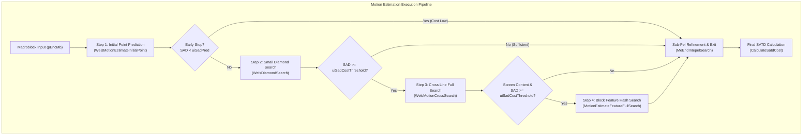
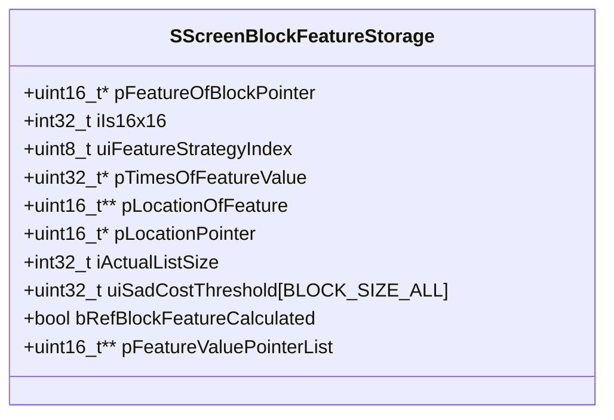
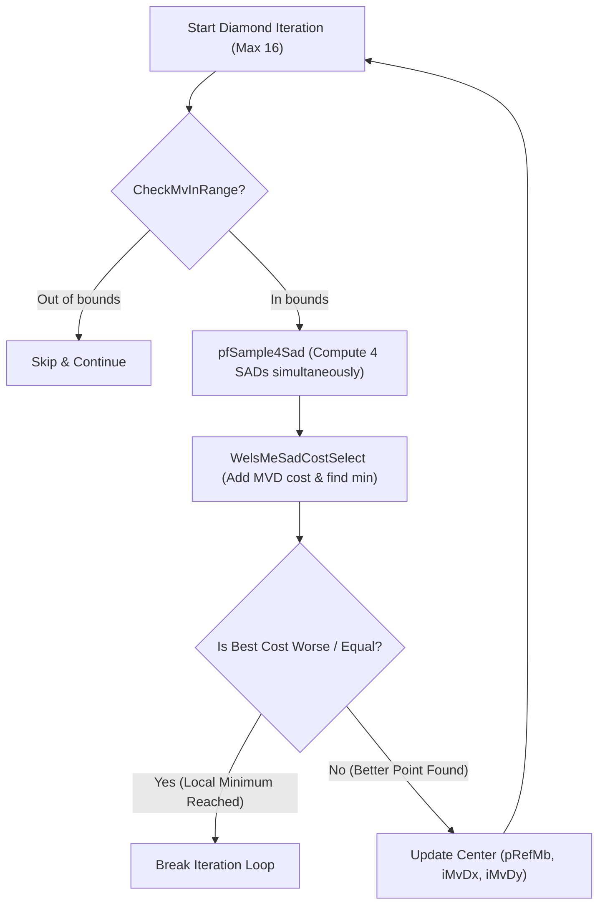
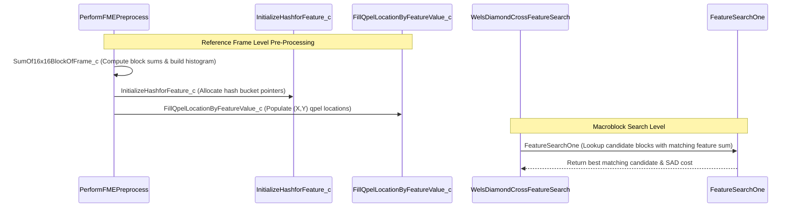
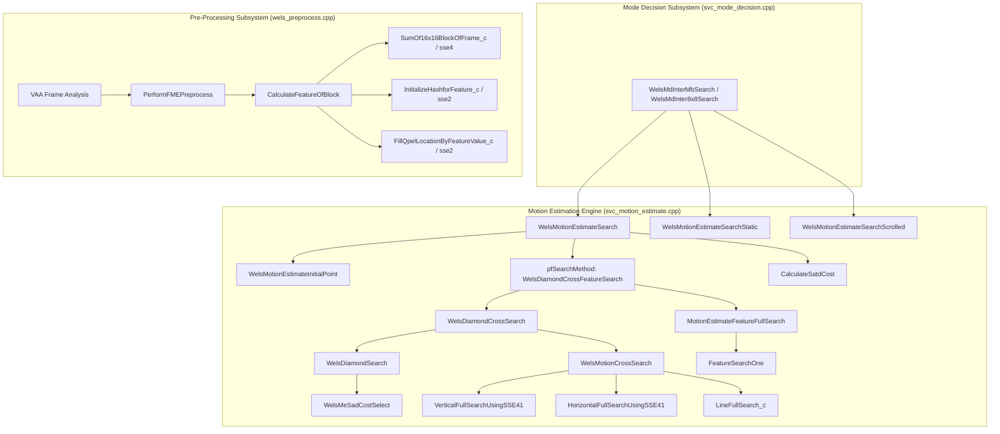

# OpenH264 Encoder Core: Motion Estimation Engine (`svc_motion_estimate.cpp`)

This document provides a comprehensive, literate-programming-style technical breakdown of the Motion Estimation (ME) engine implemented in [svc_motion_estimate.cpp](openh264/codec/encoder/core/src/svc_motion_estimate.cpp) and declared in [svc_motion_estimate.h](openh264/codec/encoder/core/inc/svc_motion_estimate.h).

---

## Table of Contents
1. [Module Overview & Architectural Role](#1-module-overview--architectural-role)
2. [Data Types, Enums, Constants & Lookup Tables](#2-data-types-enums-constants--lookup-tables)
3. [Core Data Structures & Memory Layout](#3-core-data-structures--memory-layout)
4. [Motion Estimation Algorithms & Math Formulations](#4-motion-estimation-algorithms--math-formulations)
5. [Deep Dive: Function & Method Implementations](#5-deep-dive-function--method-implementations)
   - 5.1 [Initialization & Function Pointer Dispatch](#51-initialization--function-pointer-dispatch)
   - 5.2 [Top-Level Motion Estimation Search Drivers](#52-top-level-motion-estimation-search-drivers)
   - 5.3 [Predictor Evaluation & Initial Point Search](#53-predictor-evaluation--initial-point-search)
   - 5.4 [Small Diamond Search (ME_DIA)](#54-small-diamond-search-me_dia)
   - 5.5 [Cross Line Full Search (ME_CROSS) & SSE4.1 Matrix Acceleration](#55-cross-line-full-search-me_cross--sse41-matrix-acceleration)
   - 5.6 [Feature-Based Fast Motion Estimation (ME_FME / SCC Search)](#56-feature-based-fast-motion-estimation-me_fme--scc-search)
   - 5.7 [Dynamic FME Frame-Level Adaptive Switching](#57-dynamic-fme-frame-level-adaptive-switching)
6. [SIMD Vectorization & Multi-Architecture Support](#6-simd-vectorization--multi-architecture-support)
7. [Call Graph & Subsystem Interactions](#7-call-graph--subsystem-interactions)

---

## 1. Module Overview & Architectural Role

In H.264 / AVC video encoding, **Motion Estimation (ME)** is the single most computationally demanding subsystem. It searches reference pictures in the Decoded Picture Buffer (DPB) to find optimal displacement vectors ($\mathbf{mv} = (mv_x, mv_y)$) that minimize prediction residual energy before transformation and quantization.

The OpenH264 motion estimation engine in [svc_motion_estimate.cpp](openh264/codec/encoder/core/src/svc_motion_estimate.cpp) implements a multi-stage, hierarchical search framework designed for real-time video communications and screen content coding (SCC).



### Key Architectural Characteristics
1. **Multi-Candidate Early Termination**: Evaluates the spatial motion vector predictor ($\text{MVP}$), motion vector candidates ($\text{MVC}$ list from temporal/inter-layer co-located blocks), and screen content directional scrolling vectors ($\text{sDirectionalMv}$). If the candidate SAD cost is below the adaptive predictor threshold $\text{uiSadPred}$, search terminates immediately.
2. **Hierarchical Refinement**: Combines iterative 4-point small diamond search (`ME_DIA`), 1D orthogonal cross line full search (`ME_CROSS`), and global hash-based block feature search (`ME_FME`).
3. **Screen Content Fast Motion Estimation (FME)**: Pre-computes block luminance sum features across the reference frame and indexes candidate locations into a direct hash table. Allows instant $O(1)$ lookup of matching patterns during scrolling, window panning, and desktop sharing.
4. **SIMD & Matrix Transposition Optimization**: For vertical line searches in SSE4.1, the engine performs 2D in-register matrix transposition on reference and encoder pixel blocks, converting vertical stride memory access into contiguous horizontal vector loads evaluated via 8-way parallel SAD intrinsics.

---

## 2. Data Types, Enums, Constants & Lookup Tables

### 2.1 Quantization Step Lookup Table (`QStepx16ByQp`)

```cpp
const int32_t QStepx16ByQp[52] = {  /* save QStep<<4 for int32_t */
  10,  11,  13,  14,  16,  18,  /* 0~5   */
  20,  22,  26,  28,  32,  36,  /* 6~11  */
  40,  44,  52,  56,  64,  72,  /* 12~17 */
  80,  88,  104, 112, 128, 144, /* 18~23 */
  160, 176, 208, 224, 256, 288, /* 24~29 */
  320, 352, 416, 448, 512, 576, /* 30~35 */
  640, 704, 832, 896, 1024, 1152, /* 36~41 */
  1280, 1408, 1664, 1792, 2048, 2304, /* 42~47 */
  2560, 2816, 3328, 3584     /* 48~51 */
};
```
* **Definition**: Maps each H.264 Quantization Parameter ($\text{QP} \in [0, 51]$) to its scaled quantization step size $Q_{\text{step}} \times 16 = Q_{\text{step}} \ll 4$.
* **Mathematical Rationale**: In H.264, $Q_{\text{step}}(\text{QP}) = 0.625 \times 2^{\text{QP}/6}$. Multiplying by 16 allows integer arithmetic without floating-point overhead:
  $$Q_{\text{step}\times 16}(\text{QP}) = \text{round}\left(10 \times 2^{\text{QP}/6}\right)$$
* **Usage**: In `PerformFMEPreprocess`, the reference frame average QP (`iFrameAverageQp`) indexes into this table to establish rate-distortion SAD cost thresholds (`uiSadCostThreshold16x16`).

### 2.2 Search Range & Search Strategy Constants

| Constant / Macro | Value | Description |
| :--- | :--- | :--- |
| `CAMERA_STARTMV_RANGE` | `64` | Initial integer-pel search radius for standard camera video. |
| `ITERATIVE_TIMES` | `16` | Maximum iteration count limit for iterative diamond search (`WelsDiamondSearch`). |
| `CAMERA_MV_RANGE` | `80` | Total camera motion vector search radius ($64 + 16$). |
| `CAMERA_MVD_RANGE` | `162` | Maximum MVD index range for table lookup ($(\text{CAMERA\_MV\_RANGE} + 1) \ll 1$). |
| `EXPANDED_MV_RANGE` | `504` | Expanded search radius for wide-motion / screen content ($512 - 8$). |
| `EXPANDED_MVD_RANGE` | `1010` | Maximum expanded MVD index range ($(\text{EXPANDED\_MV\_RANGE} + 1) \ll 1$). |
| `LIST_SIZE` | `0x10000` ($65536$) | Maximum hash bucket list allocation size ($256 \times 256$). |
| `LIST_SIZE_SUM_16x16` | `0x0FF01` ($65281$) | Max possible pixel sum for a $16 \times 16$ 8-bit block: $256 \times 255 + 1$. |
| `LIST_SIZE_SUM_8x8` | `0x03FC1` ($16321$) | Max possible pixel sum for an $8 \times 8$ 8-bit block: $64 \times 255 + 1$. |
| `FMESWITCH_DEFAULT_GOODFRAME_NUM` | `2` | Initial frame hysteresis counter for FME adaptive switching. |
| `FMESWITCH_GOODFRAMECOUNT_MAX` | `5` | Upper saturation bound for `uiFMEGoodFrameCount`. |
| `FMESWITCH_MBAVERCOSTSAVING_THRESHOLD` | `2` | Average per-macroblock SAD cost reduction threshold to maintain FME enabled. |
| `FMESWITCH_MBSAD_THRESHOLD` | `30` | Per-macroblock SAD threshold for FME frame enablement. |

### 2.3 Motion Estimation Mode Bitflags

```cpp
enum {
  ME_DIA           = 0x01,  // Little Diamond Search (4-point cross)
  ME_CROSS         = 0x02,  // 1D Orthogonal Cross Full Search
  ME_FME           = 0x04,  // Feature-based Fast Motion Estimation
  ME_FULL          = 0x10,  // Exhaustive 2D Full Search
  ME_DIA_CROSS     = (ME_DIA | ME_CROSS),          // 0x03
  ME_DIA_CROSS_FME = (ME_DIA_CROSS | ME_FME)       // 0x07
};
```

---

## 3. Core Data Structures & Memory Layout

### 3.1 `SWelsME` ([TagWelsME](openh264/codec/encoder/core/inc/svc_motion_estimate.h#L72-L97))

Central working state structure passed across all motion estimation functions for a specific macroblock or sub-macroblock partition:

```cpp
typedef struct TagWelsME {
  /* Input parameters & Lookup Tables */
  uint16_t*                   pMvdCost;            // Pointer to MVD bit-cost table (rate-distortion lambda weighted)
  union SadPredISatdUnit      uSadPredISatd;       // Reusable union: uiSadPred (early stop threshold) or uiSatd
  uint32_t                    uiSadCost;           // Current best SAD + MVD rate-distortion cost
  uint32_t                    uiSatdCost;          // Final SATD + MVD rate-distortion cost
  uint32_t                    uiSadCostThreshold;  // Adaptive threshold to trigger Cross/Feature searches
  int32_t                     iCurMeBlockPixX;     // Top-left pixel X coordinate in frame
  int32_t                     iCurMeBlockPixY;     // Top-left pixel Y coordinate in frame
  uint8_t                     uiBlockSize;         // Partition size: BLOCK_16x16, BLOCK_8x8, etc.
  uint8_t                     uiReserved;          // Alignment padding byte

  uint8_t*                    pEncMb;              // Current source macroblock luminance buffer
  uint8_t*                    pRefMb;              // Search center reference luminance buffer
  uint8_t*                    pColoRefMb;          // Co-located (0,0) reference luminance buffer

  SMVUnitXY                   sMvp;                // Spatial Predicted Motion Vector (in 1/4-pel units)
  SMVUnitXY                   sMvBase;             // Base layer motion vector (SVC inter-layer prediction)
  SMVUnitXY                   sDirectionalMv;      // Detected screen content scrolling vector

  SScreenBlockFeatureStorage* pRefFeatureStorage;  // Reference frame feature search hash tables

  /* Output results */
  SMVUnitXY                   sMv;                 // Best integer/quarter-pel motion vector found
} SWelsME;
```

#### Field Details & Bit-Depth Lifecycles
* `sMv`: During integer search (`WelsDiamondSearch`, `LineFullSearch_c`, `FeatureSearchOne`), coordinates represent **integer-pel units** ($1 \text{ pixel} = 1 \text{ unit}$). When integer search finishes, [MeEndIntepelSearch](openh264/codec/encoder/core/src/svc_motion_estimate.cpp#L66-L71) scales `sMv` by $4$ ($sMv \ll 2$) to convert into standard H.264 **quarter-pel units**.
* `pMvdCost`: Points to pre-calculated lookup arrays where `table[mvd]` provides $\lambda_{\text{MOTION}} \cdot R(\text{mvd})$. Evaluated via macro:
  $$\text{COST\_MVD}(\text{table}, mvd_x, mvd_y) = \text{table}[mvd_x] + \text{table}[mvd_y]$$

---

### 3.2 `SFeatureSearchIn` & `SFeatureSearchOut`

Parameters used by the hash-based feature search engine ([TagFeatureSearchIn](openh264/codec/encoder/core/inc/svc_motion_estimate.h#L99-L124) and [TagFeatureSearchOut](openh264/codec/encoder/core/inc/svc_motion_estimate.h#L126-L130)):

```cpp
typedef struct TagFeatureSearchIn {
  PSampleSadSatdCostFunc pSad;                    // SAD function pointer for target block size
  uint32_t*              pTimesOfFeature;         // Histogram frequency count per feature value
  uint16_t**             pQpelLocationOfFeature;  // Pointers to (X_qpel, Y_qpel) coordinate arrays
  uint16_t*              pMvdCostX;               // Pre-shifted X MVD cost pointer
  uint16_t*              pMvdCostY;               // Pre-shifted Y MVD cost pointer
  uint8_t*               pEnc;                    // Current encoding macroblock buffer
  uint8_t*               pColoRef;                // Co-located reference buffer
  int32_t                iEncStride;              // Encoding buffer row stride
  int32_t                iRefStride;              // Reference buffer row stride
  uint16_t               uiSadCostThresh;         // Early break SAD threshold
  int32_t                iFeatureOfCurrent;       // Sum feature value of current encoding block
  int32_t                iCurPixX, iCurPixY;      // Pixel origin coordinates (integer-pel)
  int32_t                iCurPixXQpel, iCurPixYQpel; // Pixel origin coordinates in qpel (<< 2)
  int32_t                iMinQpelX, iMinQpelY;    // Search window bounding box minimum (qpel)
  int32_t                iMaxQpelX, iMaxQpelY;    // Search window bounding box maximum (qpel)
} SFeatureSearchIn;

typedef struct TagFeatureSearchOut {
  SMVUnitXY sBestMv;         // Best integer motion vector found by feature search
  uint32_t  uiBestSadCost;   // Best rate-distortion SAD cost
  uint8_t*  pBestRef;        // Pointer to best reference block memory
} SFeatureSearchOut;
```

---

### 3.3 `SScreenBlockFeatureStorage` ([TagScreenBlockFeatureStorage](openh264/codec/encoder/core/inc/picture.h#L43-L58))

Allocated once per reference frame (`SPicture`) to hold pre-calculated block features and spatial hash indexing structures:



* `pFeatureOfBlockPointer`: Array of size $(W - \text{margin}) \times (H - \text{margin})$ storing block pixel sums.
* `pTimesOfFeatureValue`: Frequency count array of length `iActualListSize` recording how many blocks share each feature value.
* `pLocationPointer`: Contiguous flat buffer storing interleaved $(X_{\text{qpel}}, Y_{\text{qpel}})$ coordinate pairs for all reference blocks.
* `pLocationOfFeature`: Hash bucket lookup table where `pLocationOfFeature[v]` points to the list of $(X_{\text{qpel}}, Y_{\text{qpel}})$ coordinates whose block feature equals $v$.

---

## 4. Motion Estimation Algorithms & Math Formulations

### 4.1 Rate-Distortion Motion Estimation Cost

Motion estimation evaluates candidate displacement vectors $\mathbf{mv} = (mv_x, mv_y)$ using a Lagrangian Rate-Distortion cost function:

$$J(\mathbf{mv}) = \text{SAD}(\mathbf{mv}) + \lambda_{\text{MOTION}} \cdot R(\mathbf{mv} - \mathbf{mvp})$$

Where:
* $\text{SAD}(\mathbf{mv}) = \sum_{y=0}^{B_H-1} \sum_{x=0}^{B_W-1} |I_{\text{cur}}(x, y) - I_{\text{ref}}(x + mv_x, y + mv_y)|$
* $\mathbf{mvp} = (mvp_x, mvp_y)$ is the spatial median predicted motion vector.
* $R(\mathbf{mvd}) = R(mv_x - mvp_x) + R(mv_y - mvp_y)$ is the bit-rate cost to encode the motion vector difference ($\text{MVD}$) in the bitstream using Exp-Golomb / CABAC syntax.
* $\lambda_{\text{MOTION}}$ is the Lagrange multiplier derived from QP:
  $$\lambda_{\text{MOTION}} \approx \sqrt{0.85 \cdot 2^{(\text{QP} - 12)/3}}$$

### 4.2 Block Feature Formulation

For Screen Content Coding (SCC), blocks of size $B \times B$ ($8 \times 8$ or $16 \times 16$) are characterized by their luminance sum feature $F(x, y)$:

$$F(x, y) = \sum_{j=0}^{B-1} \sum_{i=0}^{B-1} I_{\text{ref}}(x + i, y + j)$$

When searching for matching blocks for an encoding block with feature $F_{\text{cur}}$, the engine queries hash bucket $v = F_{\text{cur}} + \Delta F$. If two blocks are identical or near-identical, their feature difference $|\Delta F| \approx 0$.

---

## 5. Deep Dive: Function & Method Implementations

### 5.1 Initialization & Function Pointer Dispatch

#### [WelsInitMeFunc](openh264/codec/encoder/core/src/svc_motion_estimate.cpp#L73-L159)
```cpp
void WelsInitMeFunc (SWelsFuncPtrList* pFuncList, uint32_t uiCpuFlag, bool bScreenContent);
```
* **Purpose**: Populates the motion estimation function pointer table `pFuncList` dynamically based on detected CPU instruction set flags (`uiCpuFlag`) and encoding content type (`bScreenContent`).
* **Logic**:
  1. Default: Initializes `pfUpdateFMESwitch` to [UpdateFMESwitchNull](openh264/codec/encoder/core/src/svc_motion_estimate.cpp#L1059-L1060).
  2. Camera Mode (`!bScreenContent`): Disables directional scrolling checks (`pfCheckDirectionalMv = CheckDirectionalMvFalse`) and zeros feature calculation function pointers.
  3. Screen Content Mode (`bScreenContent == true`):
     - Enables `pfCheckDirectionalMv = CheckDirectionalMv`.
     - Assigns C reference search functions: `LineFullSearch_c`, `InitializeHashforFeature_c`, `FillQpelLocationByFeatureValue_c`, `SumOf8x8BlockOfFrame_c`, `SumOf16x16BlockOfFrame_c`, `SumOf8x8SingleBlock_c`, `SumOf16x16SingleBlock_c`.
     - **x86/x64 SIMD Overrides**:
       - `SSE2`: Replaces hash initialization and block sum functions with `_sse2` assembly routines.
       - `SSE4.1`: Enables `SampleSad8x8Hor8_sse41`, `SampleSad16x16Hor8_sse41`, `VerticalFullSearchUsingSSE41`, `HorizontalFullSearchUsingSSE41`, and `SumOf*BlockOfFrame_sse4`.
     - **ARM NEON Overrides**: Assigns `_neon` or `_AArch64_neon` implementations.
     - **Loongson LSX Overrides**: Assigns `_lsx` implementations.

---

### 5.2 Top-Level Motion Estimation Search Drivers

#### [WelsMotionEstimateSearch](openh264/codec/encoder/core/src/svc_motion_estimate.cpp#L170-L182)
```cpp
void WelsMotionEstimateSearch (SWelsFuncPtrList* pFuncList, SDqLayer* pCurDqLayer, SWelsME* pMe, SSlice* pSlice);
```
* **Parameters**:
  * `pFuncList`: Function pointer dispatch table.
  * `pCurDqLayer`: Current spatial dependency layer representation.
  * `pMe`: Motion estimation working state structure.
  * `pSlice`: Current slice context.
* **Workflow**:
  1. Retrieves encoding stride $kiStrideEnc = \text{pCurDqLayer}->\text{iEncStride}[0]$ and reference picture stride $kiStrideRef = \text{pCurDqLayer}->\text{pRefPic}->\text{iLineSize}[0]$.
  2. Executes [WelsMotionEstimateInitialPoint](openh264/codec/encoder/core/src/svc_motion_estimate.cpp#L222-L284).
  3. If initial point prediction returns `false` (cost not low enough for early exit), executes the configured search method for the partition block size:
     ```cpp
     pFuncList->pfSearchMethod[pMe->uiBlockSize] (pFuncList, pMe, pSlice, kiStrideEnc, kiStrideRef);
     MeEndIntepelSearch (pMe);
     ```
  4. Finalizes SATD cost by executing `pFuncList->pfCalculateSatd`.

#### [WelsMotionEstimateSearchStatic](openh264/codec/encoder/core/src/svc_motion_estimate.cpp#L184-L196)
```cpp
void WelsMotionEstimateSearchStatic (SWelsFuncPtrList* pFuncList, SDqLayer* pCurDqLayer, SWelsME* pMe, SSlice* pLpslice);
```
* **Purpose**: Fast shortcut motion estimation for static background macroblocks where motion is forced to $(0,0)$.
* **Algorithm**:
  1. Sets `pMe->sMv.iMvX = 0`, `pMe->sMv.iMvY = 0`.
  2. Calculates SAD at $(0,0)$ displacement via `pfSampleSad[pMe->uiBlockSize]`.
  3. Adds MVD cost against predictor `sMvp`:
     ```cpp
     pMe->uiSadCost += COST_MVD (pMe->pMvdCost, -pMe->sMvp.iMvX, -pMe->sMvp.iMvY);
     ```
  4. Calls `MeEndIntepelSearch(pMe)` and calculates SATD.

#### [WelsMotionEstimateSearchScrolled](openh264/codec/encoder/core/src/svc_motion_estimate.cpp#L198-L211)
```cpp
void WelsMotionEstimateSearchScrolled (SWelsFuncPtrList* pFuncList, SDqLayer* pCurDqLayer, SWelsME* pMe, SSlice* pSlice);
```
* **Purpose**: Specialized shortcut search when frame-level VAA analysis detects global window scrolling.
* **Algorithm**:
  1. Directs motion vector to `pMe->sDirectionalMv`.
  2. Calculates SAD cost at `pColoRefMb + sMv.iMvY * kiStrideRef + sMv.iMvX`.
  3. Adds MVD bit-cost:
     $$\text{COST\_MVD}\left(pMvdCost, (mv_x \ll 2) - mvp_x, (mv_y \ll 2) - mvp_y\right)$$
  4. Scales MV to quarter-pel and calculates SATD.

---

### 5.3 Predictor Evaluation & Initial Point Search

#### [WelsMotionEstimateInitialPoint](openh264/codec/encoder/core/src/svc_motion_estimate.cpp#L222-L284)
```cpp
bool WelsMotionEstimateInitialPoint (SWelsFuncPtrList* pFuncList, SWelsME* pMe, SSlice* pSlice,
                                     int32_t iStrideEnc, int32_t iStrideRef);
```
* **Return Value**: `true` if early termination is triggered (search completed); `false` if further iterative search is required.
* **Detailed Execution Steps**:
  1. **Spatial Predictor ($\mathbf{mvp}$)**:
     - Clips $(2 + \mathbf{mvp}) \gg 2$ into $[ \text{sMvStartMin}, \text{sMvStartMax} ]$ using `WELS_CLIP3`.
     - Calculates initial SAD and MVD rate-distortion cost:
       ```cpp
       iBestSadCost = pSad (kpEncMb, iStrideEnc, pRefMb, iStrideRef) +
                      COST_MVD (kpMvdCost, (sMv.iMvX << 2) - ksMvp.iMvX, (sMv.iMvY << 2) - ksMvp.iMvY);
       ```
  2. **Motion Vector Candidate ($\mathbf{mvc}$) List**:
     - Iterates through $i \in [0, \text{pSlice}->\text{uiMvcNum} - 1]$.
     - Clips candidate $\mathbf{mvc}_i$ to search range bounds.
     - If candidate $\mathbf{mvc}_i \neq \mathbf{mv}$, computes SAD + MVD cost. If cost is smaller than `iBestSadCost`, updates `sMv`, `pRefMb`, and `iBestSadCost`.
  3. **Directional Screen Content Candidate**:
     - Calls `pFuncList->pfCheckDirectionalMv`. If it yields a lower cost, replaces candidate with `sDirectionalMv`.
  4. **Early Termination Check**:
     - Updates results via `UpdateMeResults(sMv, iBestSadCost, pRefMb, pMe)`.
     - If $iBestSadCost < \text{pMe}->\text{uSadPredISatd}.\text{uiSadPred}$, executes `MeEndIntepelSearch(pMe)` and returns `true`.

---

### 5.4 Small Diamond Search (ME_DIA)

#### [WelsDiamondSearch](openh264/codec/encoder/core/src/svc_motion_estimate.cpp#L335-L380) & [WelsMeSadCostSelect](openh264/codec/encoder/core/src/svc_motion_estimate.cpp#L300-L333)

Iterative 4-point small diamond pattern centered at the current best integer motion vector:

```
            (0, -1) [Top]
               |
(-1, 0) [Left] - (0, 0) [Center] - (1, 0) [Right]
               |
            (0, 1) [Bottom]
```



* **`WelsMeSadCostSelect`**:
  Adds MVD rate-distortion cost to the 4 evaluated neighbor positions:
  - Top $(0, -1)$: offset $iMvDy - 4$ in quarter-pel MVD table.
  - Bottom $(0, 1)$: offset $iMvDy + 4$ in quarter-pel MVD table.
  - Left $(-1, 0)$: offset $iMvDx - 4$ in quarter-pel MVD table.
  - Right $(1, 0)$: offset $iMvDx + 4$ in quarter-pel MVD table.
  Returns `true` if none of the 4 neighbors improves on the center cost.

---

### 5.5 Cross Line Full Search (ME_CROSS) & SSE4.1 Matrix Acceleration

When diamond search terminates with $\text{uiSadCost} \ge \text{uiSadCostThreshold}$, [WelsMotionCrossSearch](openh264/codec/encoder/core/src/svc_motion_estimate.cpp#L620-L641) executes 1D full searches along the vertical and horizontal axes passing through the search center.

#### [VerticalFullSearchUsingSSE41](openh264/codec/encoder/core/src/svc_motion_estimate.cpp#L425-L506)

Vertical searches suffer from cache inefficiency because vertical displacements require strided memory accesses ($y \cdot \text{stride}$). `VerticalFullSearchUsingSSE41` solves this using **SIMD 2D Matrix Transposition**:

1. **Transposition**:
   - `TransposeMatrixBlock(&uiMatrixEnc[0][0], 16, kpEncMb, kiEncStride)` transposes the current encoding block $16 \times 16$ or $8 \times 8$.
   - `TransposeMatrixBlocks(&uiMatrixRef[0][0], kiMatrixStride, pRef, kiRefStride, kiBlocksNum)` transposes the vertical reference column into contiguous horizontal memory.
2. **Horizontal Vector SAD Calculation**:
   - Loops over chunks of 8 positions using `SampleSad8x8Hor8_sse41` / `SampleSad16x16Hor8_sse41`.
   - Evaluates 8 vertical displacement candidates simultaneously with vector SIMD instructions.
3. **Remainder Handling**: Evaluates remaining $(< 8)$ vertical positions with standard C scalar SAD.

#### [LineFullSearch_c](openh264/codec/encoder/core/src/svc_motion_estimate.cpp#L568-L618)
Standard C reference implementation for vertical/horizontal 1D line searches across $[iMinMv, iMaxMv]$.

---

### 5.6 Feature-Based Fast Motion Estimation (ME_FME / SCC Search)

Specially optimized for screen content coding (SCC), desktop sharing, and high-motion graphics.



#### Preprocessing & Hash Construction Functions
1. **[SumOf8x8SingleBlock_c](openh264/codec/encoder/core/src/svc_motion_estimate.cpp#L756-L764)** / **[SumOf16x16SingleBlock_c](openh264/codec/encoder/core/src/svc_motion_estimate.cpp#L765-L775)**:
   Computes the scalar sum of all luminance samples in an $8 \times 8$ ($64$ pixels) or $16 \times 16$ ($256$ pixels) block.
2. **[SumOf8x8BlockOfFrame_c](openh264/codec/encoder/core/src/svc_motion_estimate.cpp#L777-L794)** / **[SumOf16x16BlockOfFrame_c](openh264/codec/encoder/core/src/svc_motion_estimate.cpp#L796-L814)**:
   Slides across every pixel position $(x, y)$ in the reference frame, computes its block sum, stores it into `pFeatureOfBlock[y * width + x]`, and increments histogram frequency `pTimesOfFeatureValue[sum]++`.
3. **[InitializeHashforFeature_c](openh264/codec/encoder/core/src/svc_motion_estimate.cpp#L816-L825)**:
   Partitions the flat coordinate buffer `pBuf` into variable-length bucket segments based on `pTimesOfFeatureValue[i] * 2`.
4. **[FillQpelLocationByFeatureValue_c](openh264/codec/encoder/core/src/svc_motion_estimate.cpp#L826-L841)**:
   Writes $(x \ll 2, y \ll 2)$ quarter-pel coordinates into the bucket corresponding to `uiFeature = pFeatureOfBlock[y * width + x]`.

#### Search Kernel: [FeatureSearchOne](openh264/codec/encoder/core/src/svc_motion_estimate.cpp#L937-L1006)
```cpp
bool FeatureSearchOne (SFeatureSearchIn& sFeatureSearchIn, const int32_t iFeatureDifference,
                       const uint32_t kuiExpectedSearchTimes, SFeatureSearchOut* pFeatureSearchOut);
```
* **Algorithm**:
  1. Computes target reference feature bucket: $iFeatureOfRef = iFeatureOfCurrent + iFeatureDifference$.
  2. Bounds check $0 \le iFeatureOfRef < \text{LIST\_SIZE}$.
  3. Retrieves coordinate array `pQpelPosition` from bucket `pQpelLocationOfFeature[iFeatureOfRef]`.
  4. Iterates through candidates up to $iSearchTimes = \min(\text{histogram}[iFeatureOfRef], kuiExpectedSearchTimes)$:
     - Reads $(iQpelX, iQpelY)$.
     - Validates within $[ \text{iMinQpelX}, \text{iMaxQpelX} ] \times [ \text{iMinQpelY}, \text{iMaxQpelY} ]$.
     - Computes MVD bit-rate cost: $uiTmpCost = pMvdCostX[iQpelX] + pMvdCostY[iQpelY]$.
     - **Pruning**: If $uiTmpCost + iFeatureDifference \ge uiBestCost$, skips candidate without computing SAD.
     - Computes SAD via `pSad(pEnc, iEncStride, pCurRef, iRefStride)`.
     - Updates `sBestMv` and `uiBestCost`. Breaks early if $uiBestCost < uiSadCostThresh$.

---

### 5.7 Dynamic FME Frame-Level Adaptive Switching

Feature-based search provides massive gains for screen content but introduces unnecessary overhead for natural camera motion. The engine dynamically enables or disables FME using feedback statistics:

#### [UpdateFMESwitch](openh264/codec/encoder/core/src/svc_motion_estimate.cpp#L1054-L1058) & [UpdateFMEGoodFrameCount](openh264/codec/encoder/core/src/svc_motion_estimate.cpp#L1043-L1053)

1. **Slice Cost Accumulation**: Each slice tracks total SAD cost reduction achieved by FME:
   ```cpp
   pSlice->uiSliceFMECostDown += (cost_before_fme - cost_after_fme);
   ```
2. **Normalized Frame Cost Reduction**:
   $$\overline{\Delta J}_{\text{MB}} = \frac{\sum_{\text{slices}} \text{uiSliceFMECostDown}}{N_{\text{MB\_Width}} \times N_{\text{MB\_Height}}}$$
3. **Hysteresis Counter Adaptation**:
   - If $\overline{\Delta J}_{\text{MB}} > \text{FMESWITCH\_MBAVERCOSTSAVING\_THRESHOLD}$ ($2$): increments `uiFMEGoodFrameCount` up to max limit $5$.
   - Otherwise: decrements `uiFMEGoodFrameCount` down to $0$.
4. **Master Decision Flag ([CalcFMESwitchFlag](openh264/codec/encoder/core/inc/svc_motion_estimate.h#L360-L367))**:
   $$\text{bFMESwitchFlag} = bScrollingDetected \lor \left( uiFMEGoodFrameCount > 0 \land \overline{\text{SAD}}_{\text{MB}} > 30 \right)$$

---

## 6. SIMD Vectorization & Multi-Architecture Support

The motion estimation engine utilizes architecture-specific assembly routines for performance-critical inner loops:

| Routine Category | C Fallback | x86 / x64 SIMD (SSE2 / SSE4.1) | ARM NEON (32-bit / AArch64) | Loongson (LSX) |
| :--- | :--- | :--- | :--- | :--- |
| **8-Point Horiz SAD** | N/A | `SampleSad8x8Hor8_sse41`<br/>`SampleSad16x16Hor8_sse41` | N/A | N/A |
| **Vertical Full Search** | `LineFullSearch_c` | `VerticalFullSearchUsingSSE41` | N/A | N/A |
| **Horizontal Full Search**| `LineFullSearch_c` | `HorizontalFullSearchUsingSSE41` | N/A | N/A |
| **Single Block Sum** | `SumOf8x8SingleBlock_c`<br/>`SumOf16x16SingleBlock_c` | `SumOf8x8SingleBlock_sse2`<br/>`SumOf16x16SingleBlock_sse2` | `SumOf8x8SingleBlock_neon`<br/>`SumOf8x8SingleBlock_AArch64_neon` | `SumOf8x8SingleBlock_lsx` |
| **Frame Block Feature** | `SumOf8x8BlockOfFrame_c`<br/>`SumOf16x16BlockOfFrame_c` | `SumOf8x8BlockOfFrame_sse2`<br/>`SumOf8x8BlockOfFrame_sse4` | `SumOf8x8BlockOfFrame_neon`<br/>`SumOf8x8BlockOfFrame_AArch64_neon` | `SumOf8x8BlockOfFrame_lsx` |
| **Hash Initialization** | `InitializeHashforFeature_c` | `InitializeHashforFeature_sse2` | `InitializeHashforFeature_neon`<br/>`InitializeHashforFeature_AArch64_neon` | N/A |
| **Qpel Location Fill** | `FillQpelLocationByFeatureValue_c` | `FillQpelLocationByFeatureValue_sse2` | `FillQpelLocationByFeatureValue_neon`<br/>`FillQpelLocationByFeatureValue_AArch64_neon` | N/A |

---

## 7. Call Graph & Subsystem Interactions



### Upstream & Downstream Integration Points
* **Caller**: Invoked by Inter-frame Mode Decision routines in [svc_mode_decision.cpp](openh264/codec/encoder/core/src/svc_mode_decision.cpp) (`WelsMdInterMbSearch`, `WelsMdInter8x8Search`) to determine optimal motion vectors and minimal residual distortion costs for $16 \times 16$, $16 \times 8$, $8 \times 16$, and $8 \times 8$ Inter partitions.
* **Pre-processing**: Relies on [wels_preprocess.cpp](openh264/codec/encoder/core/src/wels_preprocess.cpp) and [PerformFMEPreprocess](openh264/codec/encoder/core/src/svc_motion_estimate.cpp#L877-L893) to construct reference picture feature hash structures prior to slice encoding.
* **Rate Control**: Shares macroblock SAD metrics (`uiSadCost`) with the Rate Control engine in [ratectl.cpp](openh264/codec/encoder/core/src/ratectl.cpp) for Group of Macroblocks (GOM) adaptive quantization allocation.
