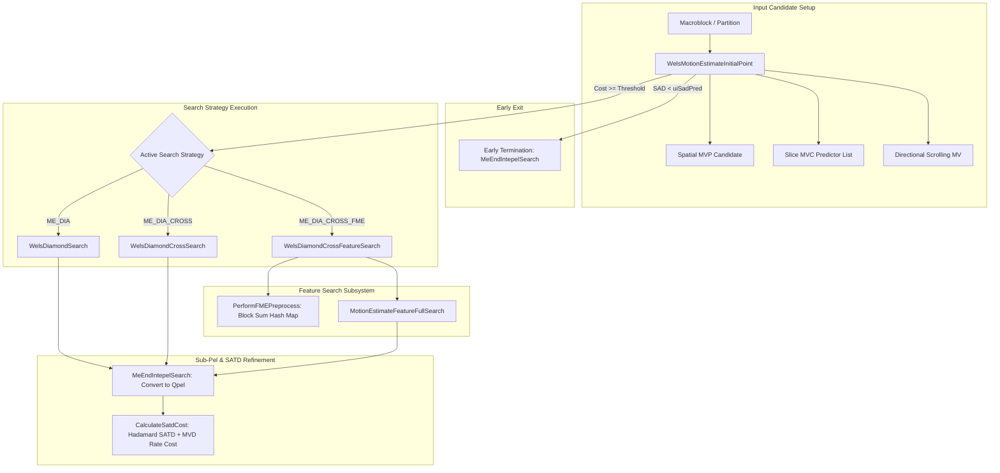
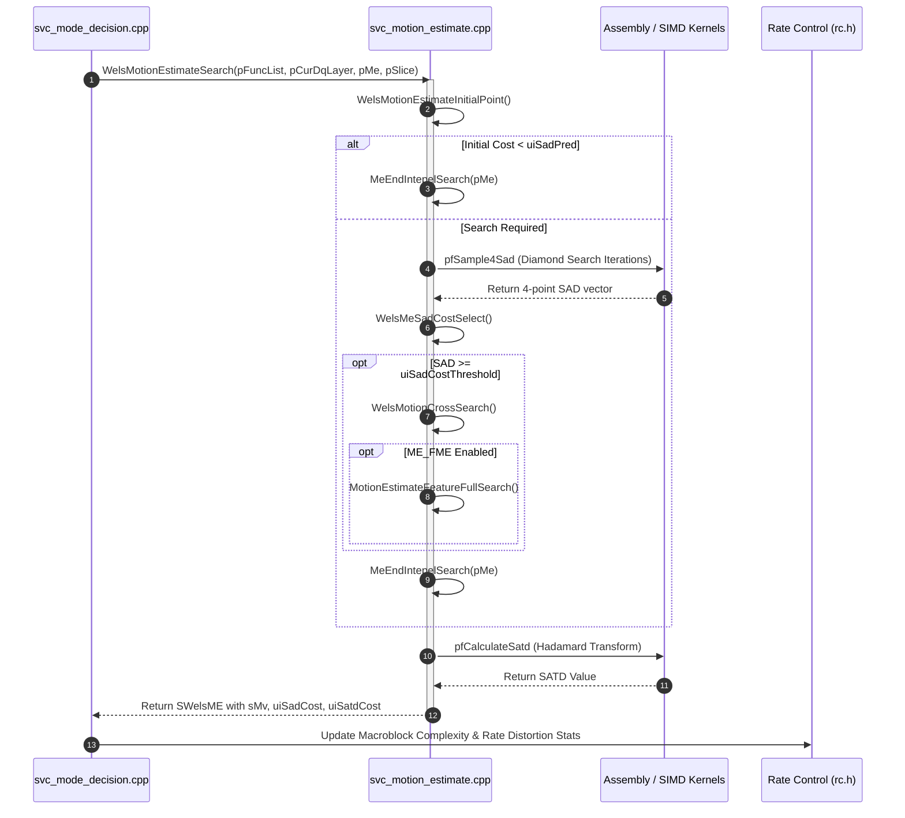

# OpenH264: Motion Estimation Architecture & `svc_motion_estimate.h` Implementation

This document provides a comprehensive, literate-programming-style technical specification for the Motion Estimation (ME) subsystem declared in [`codec/encoder/core/inc/svc_motion_estimate.h`](openh264/codec/encoder/core/inc/svc_motion_estimate.h) and implemented in [`codec/encoder/core/src/svc_motion_estimate.cpp`](openh264/codec/encoder/core/src/svc_motion_estimate.cpp).

---

## 1. High-Level Module & Architectural Purpose

Motion Estimation (ME) is the most computationally demanding pipeline stage of the H.264 / AVC video encoder. It searches reference picture buffer surfaces to find optimal displacement vectors—**Motion Vectors ($MV$)**—that minimize a combined Rate-Distortion (RD) cost metric for each macroblock or macroblock partition.

In OpenH264, the motion estimation subsystem serves standard natural video content (camera capture) as well as synthetic screen content (desktop sharing, scrolling text, sliding UI windows). It balances compression efficiency and real-time encoding throughput through a multi-tier search strategy:



### Key Architectural Tenets
1. **Multi-Candidate Initial Point Prediction**: Tests the standard H.264 median Motion Vector Predictor ($\text{MVP}$), motion vector candidates ($\text{MVC}$) from neighboring blocks/layers, and screen-content directional scrolling vectors before initiating iterative search patterns.
2. **Hierarchical Search Techniques**:
   - **Diamond Search (`ME_DIA`)**: Fast, iterative 4-point diamond pattern for localized natural camera motion.
   - **Cross Search (`ME_CROSS`)**: Orthogonal 1D horizontal and vertical line full searches, heavily accelerated with SSE4.1 matrix transposition for line-oriented motion.
   - **Feature-Based Fast Motion Estimation (`ME_FME`)**: Hash-indexed block-matching algorithm designed specifically for Screen Content Coding (SCC) to locate exact or near-exact matching blocks across massive frame displacement areas in $O(1)$ lookup time.
3. **Dual Metric Evaluation**:
   - **Integer-Pel Search Phase**: Guided by the **Sum of Absolute Differences (SAD)** plus Motion Vector Difference (MVD) bit cost.
   - **Refinement Phase**: Refines the final integer or fractional candidate using the **Sum of Absolute Transformed Differences (SATD)** via $4 \times 4$ Hadamard transforms to correlate with frequency-domain DCT residual coding cost.
4. **Hardware SIMD Specialization**: Vectorized kernels are dynamically bound at runtime for x86 (SSE2, SSE4.1), ARM (NEON 32-bit and AArch64 NEON), and Loongson (LSX).

---

## 2. Constants, Algorithmic Macros, and Limits

The motion estimation engine relies on compile-time limits and empirical rate-distortion parameters defined in [`svc_motion_estimate.h`](openh264/codec/encoder/core/inc/svc_motion_estimate.h#L48-L67):

```cpp
#define CAMERA_STARTMV_RANGE (64)
#define ITERATIVE_TIMES      (16)
#define CAMERA_MV_RANGE      (CAMERA_STARTMV_RANGE + ITERATIVE_TIMES)
#define CAMERA_MVD_RANGE     ((CAMERA_MV_RANGE + 1) << 1) // mvd = mv_range * 2
#define BASE_MV_MB_NMB       ((2 * CAMERA_MV_RANGE / MB_WIDTH_LUMA) - 1)
#define CAMERA_HIGHLAYER_MVD_RANGE (243)
#define EXPANDED_MV_RANGE    (504) // 512 - 8 to preserve edge SIMD alignment
#define EXPANDED_MVD_RANGE   ((504 + 1) << 1)
```

### Breakdown of Constant Parameters

| Constant Name | Value | Algorithmic Definition & Purpose |
| :--- | :--- | :--- |
| `CAMERA_STARTMV_RANGE` | `64` | The baseline integer pixel search radius for natural camera motion estimation ($[-64, +64]$ pixels). |
| `ITERATIVE_TIMES` | `16` | Maximum iterations permitted in the iterative diamond search loop ([`WelsDiamondSearch`](openh264/codec/encoder/core/src/svc_motion_estimate.cpp#L335-L380)). |
| `CAMERA_MV_RANGE` | `80` | Total motion vector search radius ($64 + 16 = 80$ pixels) combining initial range and maximum diamond iterations. |
| `CAMERA_MVD_RANGE` | `162` | Maximum MVD indexing span $((80 + 1) \times 2 = 162)$ for motion vector difference bit-cost tables. |
| `BASE_MV_MB_NMB` | `9` | Maximum macroblock span covered by the camera motion vector range: $\left(\frac{2 \times 80}{16}\right) - 1 = 9$ macroblocks. |
| `CAMERA_HIGHLAYER_MVD_RANGE`| `243`| Extended MVD range for higher spatial/temporal SVC enhancement layers. |
| `EXPANDED_MV_RANGE` | `504` | Extended full-frame search radius for screen content coding ($512 - 8 = 504$ pixels), clamped below 511 to preserve 8-pixel/16-pixel SIMD memory alignment. |
| `EXPANDED_MVD_RANGE` | `1010` | Total MVD table indexing limit for expanded screen content search $((504 + 1) \times 2 = 1010)$. |

### Feature Search Memory and Threshold Constants

```cpp
#define LIST_SIZE_SUM_16x16 0x0FF01  // (256 * 255 + 1) = 65281
#define LIST_SIZE_SUM_8x8   0x03FC1  // (64 * 255 + 1)  = 16321
#define LIST_SIZE_MSE_16x16 0x00878  // (avg + mse) / 2 = 2168

#define FME_DEFAULT_FEATURE_INDEX        (0)
#define FMESWITCH_DEFAULT_GOODFRAME_NUM  (2)
#define FMESWITCH_MBSAD_THRESHOLD        (30)
#define FMESWITCH_MBAVERCOSTSAVING_THRESHOLD (2)
#define FMESWITCH_GOODFRAMECOUNT_MAX     (5)
```

- **`LIST_SIZE_SUM_16x16` ($65281$)**: Maximum possible sum of pixel values in a $16 \times 16$ luma block ($16 \times 16 \times 255 = 65025$). Padded to `0x0FF01` to safely index block feature hash tables.
- **`LIST_SIZE_SUM_8x8` ($16321$)**: Maximum possible sum of pixel values in an $8 \times 8$ luma block ($8 \times 8 \times 255 = 16320$). Padded to `0x03FC1`.
- **`FMESWITCH_MBSAD_THRESHOLD` ($30$)**: Macroblock average SAD threshold above which Feature Search (FME) is enabled for complex or high-motion scenes.

### MVD Bit-Cost Computation Macro

```cpp
#define COST_MVD(table, mx, my) (table[mx] + table[my])
```

Computes the total Lagrangian rate penalty for a candidate motion vector displacement $(mvd_x, mvd_y)$ using the pre-computed lambda-weighted lookup table `pMvdCost`:
$$\text{Cost}_{\text{MVD}}(mvd_x, mvd_y) = \text{table}[mvd_x] + \text{table}[mvd_y]$$

---

## 3. Enumerations and Core Data Structures

### 3.1 Motion Search Method Flags (`enum`)

Bitmask enumeration specifying the active motion estimation algorithm assigned to [`pFuncList->pfSearchMethod`](openh264/codec/encoder/core/inc/wels_func_ptr_def.h):

```cpp
enum {
  ME_DIA           = 0x01,  // Little Diamond Search (4-point cross pattern)
  ME_CROSS         = 0x02,  // 1D Cross Line Search (vertical + horizontal)
  ME_FME           = 0x04,  // Feature-based Fast Motion Estimation (Hash Search)
  ME_FULL          = 0x10,  // Exhaustive 2D Full Search

  // Composite Derived ME Modes
  ME_DIA_CROSS     = (ME_DIA | ME_CROSS),          // 0x03: Diamond followed by Cross Search
  ME_DIA_CROSS_FME = (ME_DIA_CROSS | ME_FME)       // 0x07: Diamond + Cross + Feature Search
};
```

---

### 3.2 `union SadPredISatdUnit`

A 32-bit dual-use memory union that shares storage between the initial predicted SAD cost threshold and the temporary computed SATD cost:

```cpp
union SadPredISatdUnit {
  uint32_t uiSadPred;  // Input: predicted SAD cost threshold for early search termination
  uint32_t uiSatd;     // Output/Temp: intermediate SATD distortion value
};
```

- **Lifecycle**: Before motion search begins, `uiSadPred` is populated with the minimum SAD cost of spatial neighbor macroblocks. If any initial candidate achieves $\text{SAD} < \text{uiSadPred}$, search terminates immediately. Once search completes, the same 4-byte slot holds `uiSatd` to pass transform distortion to mode decision.

---

### 3.3 `struct TagWelsME` (`SWelsME`)

The central per-block motion estimation context passed across all ME search routines.

```cpp
typedef struct TagWelsME {
  /* input */
  uint16_t*              pMvdCost;            // Pointer to lambda-scaled MVD rate-cost lookup table
  union SadPredISatdUnit uSadPredISatd;       // Reusable SAD predictor threshold / SATD storage
  uint32_t               uiSadCost;           // Current minimum integer SAD + MVD rate cost
  uint32_t               uiSatdCost;          // Final SATD + lambda * MVD bit cost
  uint32_t               uiSadCostThreshold;  // Block-adaptive threshold triggering secondary search
  int32_t                iCurMeBlockPixX;     // Horizontal pixel coordinate of block in frame
  int32_t                iCurMeBlockPixY;     // Vertical pixel coordinate of block in frame
  uint8_t                uiBlockSize;         // Sub-partition size (BLOCK_16x16, BLOCK_16x8, etc.)
  uint8_t                uiReserved;          // Padding for 32-bit alignment

  uint8_t*               pEncMb;              // Pointer to source luma samples of target block
  uint8_t*               pRefMb;              // Pointer to reference picture luma samples at best MV
  uint8_t*               pColoRefMb;          // Pointer to collocated (0,0) reference luma samples

  SMVUnitXY              sMvp;                // Predicted Motion Vector (MVP) in 1/4-pel units
  SMVUnitXY              sMvBase;             // Base layer motion vector (for SVC inter-layer ME)
  SMVUnitXY              sDirectionalMv;      // Detected global screen scrolling motion vector

  SScreenBlockFeatureStorage* pRefFeatureStorage; // Reference frame feature hash table

  /* output */
  SMVUnitXY              sMv;                 // Best motion vector result in 1/4-pel units
} SWelsME;
```

#### Detailed Member Breakdown

| Field | Type | Unit / Range | Description & Architectural Purpose |
| :--- | :--- | :--- | :--- |
| `pMvdCost` | `uint16_t*` | Memory Address | Offset-centered pointer into the MVD bit cost table for the current slice QP. |
| `uSadPredISatd` | `SadPredISatdUnit` | 32-bit unsigned | Holds `uiSadPred` during early exit checks, then `uiSatd` after Hadamard calculation. |
| `uiSadCost` | `uint32_t` | $[0, 2^{32}-1]$ | Total ME integer cost: $\text{SAD} + \text{Cost}_{\text{MVD}}(MV - MVP)$. Max theoretical SAD: $255 \times 256 + 91 \times 33 \times 2 = 71286$. |
| `uiSatdCost` | `uint32_t` | $[0, 2^{32}-1]$ | Total fractional/refined cost: $\text{SATD} + \text{Cost}_{\text{MVD}}(MV - MVP)$. Used by Mode Decision ([`svc_mode_decision.cpp`](openh264/codec/encoder/core/src/svc_mode_decision.cpp)). |
| `uiSadCostThreshold` | `uint32_t` | $[0, 2^{32}-1]$ | Adaptive threshold derived from frame QP. If `uiSadCost >= uiSadCostThreshold`, secondary Cross or Feature searches execute. |
| `iCurMeBlockPixX`, `Y` | `int32_t` | Pixels | Top-left sample coordinate $(x, y)$ of the current block relative to the frame origin. |
| `uiBlockSize` | `uint8_t` | `0..4` | Enumerated block size identifier (`BLOCK_16x16`, `BLOCK_16x8`, `BLOCK_8x16`, `BLOCK_8x8`, `BLOCK_4x4`). |
| `pEncMb` | `uint8_t*` | 16-byte aligned | Memory pointer to current uncompressed target macroblock luma samples. |
| `pRefMb` | `uint8_t*` | Byte address | Memory pointer to reference frame luma samples displaced by the current best motion vector `sMv`. |
| `pColoRefMb` | `uint8_t*` | 16-byte aligned | Memory pointer to reference frame luma samples at the collocated spatial position $(0, 0)$. |
| `sMvp` | `SMVUnitXY` | 1/4-pel units | Median motion vector predictor derived from spatial neighbors $A$ (left), $B$ (top), and $C$ (top-right). |
| `sMvBase` | `SMVUnitXY` | 1/4-pel units | Motion vector from lower spatial layer in SVC inter-layer prediction. |
| `sDirectionalMv` | `SMVUnitXY` | Integer pixels | Directional displacement detected by frame scrolling pre-analysis. |
| `pRefFeatureStorage` | `SScreenBlockFeatureStorage*` | Pointer | Pointer to reference picture block sum hash table used during `ME_FME`. |
| `sMv` | `SMVUnitXY` | 1/4-pel units | Output best motion vector. Integer search operates in integer steps; converted to quarter-pel before function return. |

---

### 3.4 `struct TagFeatureSearchIn` (`SFeatureSearchIn`)

Input parameter block initialized by [`SetFeatureSearchIn()`](openh264/codec/encoder/core/src/svc_motion_estimate.cpp#L895-L929) to configure the Hash-Based Feature Search engine:

```cpp
typedef struct TagFeatureSearchIn {
  PSampleSadSatdCostFunc pSad;                  // Block SAD calculation function pointer
  uint32_t*              pTimesOfFeature;       // Frequency histogram of each block feature value
  uint16_t**             pQpelLocationOfFeature;// Hash table mapping feature value -> array of (x,y) Qpel locations
  uint16_t*              pMvdCostX;             // Pre-shifted X-component MVD bit-cost pointer
  uint16_t*              pMvdCostY;             // Pre-shifted Y-component MVD bit-cost pointer

  uint8_t*               pEnc;                  // Current macroblock luma buffer
  uint8_t*               pColoRef;              // Reference frame collocated luma buffer
  int32_t                iEncStride;            // Stride (bytes per line) of encoder buffer
  int32_t                iRefStride;            // Stride (bytes per line) of reference buffer
  uint16_t               uiSadCostThresh;       // Early termination SAD threshold

  int32_t                iFeatureOfCurrent;     // Sum-of-pixels feature value of current target block

  int32_t                iCurPixX;              // Current block X coordinate in integer pixels
  int32_t                iCurPixY;              // Current block Y coordinate in integer pixels
  int32_t                iCurPixXQpel;          // Current block X coordinate in quarter-pel (X << 2)
  int32_t                iCurPixYQpel;          // Current block Y coordinate in quarter-pel (Y << 2)

  int32_t                iMinQpelX;             // Search window lower X boundary in quarter-pel
  int32_t                iMinQpelY;             // Search window lower Y boundary in quarter-pel
  int32_t                iMaxQpelX;             // Search window upper X boundary in quarter-pel
  int32_t                iMaxQpelY;             // Search window upper Y boundary in quarter-pel
} SFeatureSearchIn;
```

---

### 3.5 `struct TagFeatureSearchOut` (`SFeatureSearchOut`)

Output container populated during Feature Search passes:

```cpp
typedef struct TagFeatureSearchOut {
  SMVUnitXY sBestMv;         // Best motion vector found by feature search (integer-pel resolution)
  uint32_t  uiBestSadCost;   // Best SAD + MVD rate cost achieved
  uint8_t*  pBestRef;        // Memory pointer to reference buffer location corresponding to sBestMv
} SFeatureSearchOut;
```

---

### 3.6 Quantization Step Lookup Table (`QStepx16ByQp`)

```cpp
extern const int32_t QStepx16ByQp[52];
```

An external lookup table providing $16 \times Q_{\text{step}}$ for all 52 H.264 Quantization Parameters ($QP \in [0, 51]$). Defined in [`svc_motion_estimate.cpp`](openh264/codec/encoder/core/src/svc_motion_estimate.cpp#L48-L58):

$$\text{QStepx16ByQp}[QP] = \text{round}\left(16 \cdot 0.625 \cdot 2^{QP / 6}\right)$$

Used by [`PerformFMEPreprocess()`](openh264/codec/encoder/core/src/svc_motion_estimate.cpp#L877-L892) to scale the adaptive SAD cost threshold as a function of picture quantization step.

---

## 4. Motion Estimation Search Pipeline & Algorithmic Methods

### 4.1 `WelsInitMeFunc`

Initializes function pointer tables in [`SWelsFuncPtrList`](openh264/codec/encoder/core/inc/wels_func_ptr_def.h) based on available CPU SIMD capability flags and content type (camera vs. screen content).

```cpp
void WelsInitMeFunc(SWelsFuncPtrList* pFuncList, uint32_t uiCpuFlag, bool bScreenContent);
```

#### Dispatch Logic
- **Natural Video (`bScreenContent == false`)**:
  - Sets `pfCheckDirectionalMv = CheckDirectionalMvFalse`.
  - Disables feature search calculation function pointers (`NULL`).
- **Screen Content (`bScreenContent == true`)**:
  - Sets `pfCheckDirectionalMv = CheckDirectionalMv`.
  - Configures line full search (`pfVerticalFullSearch`, `pfHorizontalFullSearch`) to `LineFullSearch_c`.
  - Configures feature search hash generators to C baseline implementations.
  - **SIMD Overrides**:
    - **x86 SSE2 (`WELS_CPU_SSE2`)**: Binds `InitializeHashforFeature_sse2`, `FillQpelLocationByFeatureValue_sse2`, `SumOf8x8BlockOfFrame_sse2`, `SumOf16x16BlockOfFrame_sse2`, and single-block variants.
    - **x86 SSE4.1 (`WELS_CPU_SSE41`)**: Binds `SampleSad8x8Hor8_sse41`, `SampleSad16x16Hor8_sse41`, `VerticalFullSearchUsingSSE41`, `HorizontalFullSearchUsingSSE41`, and `SumOf*BlockOfFrame_sse4`.
    - **ARM NEON (`WELS_CPU_NEON`)**: Binds 32-bit or AArch64 NEON vectorized block feature routines (`SumOf8x8BlockOfFrame_neon`, etc.).
    - **Loongson LSX (`WELS_CPU_LSX`)**: Binds LSX vector routines (`SumOf8x8BlockOfFrame_lsx`).

---

### 4.2 `WelsMotionEstimateSearch`

Top-level motion estimation entry point for a single macroblock or sub-partition.

```cpp
void WelsMotionEstimateSearch(SWelsFuncPtrList* pFuncList, SDqLayer* pCurDqLayer, 
                              SWelsME* pMe, SSlice* pSlice);
```

#### Algorithmic Workflow
1. **Stride Acquisition**: Extracts source encoder stride $S_{\text{enc}} = \text{pCurDqLayer->iEncStride}[0]$ and reference line size $S_{\text{ref}} = \text{pCurDqLayer->pRefPic->iLineSize}[0]$.
2. **Initial Point Evaluation**: Calls [`WelsMotionEstimateInitialPoint()`](openh264/codec/encoder/core/src/svc_motion_estimate.cpp#L222-L284).
3. **Iterative Search Invocation**: If early termination condition is not met:
   - Invokes the active search strategy via function pointer `pFuncList->pfSearchMethod[pMe->uiBlockSize](pFuncList, pMe, pSlice, kiStrideEnc, kiStrideRef)`.
   - Calls `MeEndIntepelSearch(pMe)` to convert integer motion vector coordinates to quarter-pel units ($MV_{\text{qpel}} = MV_{\text{int}} \ll 2$).
4. **SATD Distortion Calculation**: Computes Hadamard transform cost via `pFuncList->pfCalculateSatd`.

---

### 4.3 Fast Search Shortcuts

#### `WelsMotionEstimateSearchStatic`
```cpp
void WelsMotionEstimateSearchStatic(SWelsFuncPtrList* pFuncList, SDqLayer* pCurDqLayer, 
                                    SWelsME* pMe, SSlice* pSlice);
```
Fast-path evaluation forcing $MV = (0, 0)$. Computes $\text{SAD}$ at zero displacement, adds MVD bit penalty for $-MVP$, scales to quarter-pel, and computes SATD.

#### `WelsMotionEstimateSearchScrolled`
```cpp
void WelsMotionEstimateSearchScrolled(SWelsFuncPtrList* pFuncList, SDqLayer* pCurDqLayer, 
                                      SWelsME* pMe, SSlice* pSlice);
```
Fast-path evaluation forcing $MV = \text{sDirectionalMv}$. Used when global screen scrolling has been detected by the VAA pre-processing engine.

---

### 4.4 `WelsMotionEstimateInitialPoint`

Evaluates initial candidate motion vectors to establish a tight upper bound on SAD cost and attempt early exit before executing iterative search loops.

```cpp
bool WelsMotionEstimateInitialPoint(SWelsFuncPtrList* pFuncList, SWelsME* pMe, SSlice* pSlice, 
                                    int32_t iStrideEnc, int32_t iStrideRef);
```

#### Mathematical Candidate Evaluation
The function sequentially evaluates:
1. **Spatial Median Predictor ($\text{MVP}$)**:
   $$MV_{\text{init}} = \text{clip3}\left(\left\lfloor\frac{MVP + 2}{4}\right\rfloor, MV_{\text{min}}, MV_{\text{max}}\right)$$
   $$\text{Cost}_{\text{best}} = \text{SAD}(MV_{\text{init}}) + \text{Cost}_{\text{MVD}}(4 \cdot MV_{\text{init}} - MVP)$$

2. **Motion Vector Candidates ($\text{MVC}$)**:
   Iterates through all $N = \text{pSlice->uiMvcNum}$ candidates in `pSlice->sMvc[i]`:
   $$MV_c = \text{clip3}\left(\left\lfloor\frac{MVC_i + 2}{4}\right\rfloor, MV_{\text{min}}, MV_{\text{max}}\right)$$
   If $MV_c \neq MV_{\text{init}}$, calculates $\text{Cost}(MV_c)$. If $\text{Cost}(MV_c) < \text{Cost}_{\text{best}}$, updates best candidate.

3. **Directional Scrolling Vector**:
   If enabled (`pfCheckDirectionalMv`), tests `pMe->sDirectionalMv`.

4. **Early Termination Check**:
   $$\text{If } \text{Cost}_{\text{best}} < \text{pMe->uSadPredISatd.uiSadPred} \implies \text{Return true (Bypass Search)}$$

---

### 4.5 `WelsDiamondSearch` & `WelsMeSadCostSelect`

Implements the 4-point Small Diamond Search (Little Diamond Pattern) centered on the best initial integer motion vector.

```cpp
void WelsDiamondSearch(SWelsFuncPtrList* pFuncList, SWelsME* pMe, SSlice* pSlice, 
                       const int32_t kiStrideEnc, const int32_t kiStrideRef);
```

```
               (0, -1) [North]
                  |
 (-1, 0) [West] --+-- (+1, 0) [East]
                  |
               (0, +1) [South]
```

#### Iterative Step
At each iteration $t \in [0, \text{ITERATIVE\_TIMES}-1]$:
1. Calls SIMD kernel `pfSample4Sad` to evaluate SAD at all 4 diamond neighbor offsets simultaneously:
   - North: $(x, y - 1)$
   - South: $(x, y + 1)$
   - West:  $(x - 1, y)$
   - East:  $(x + 1, y)$
2. Calls `WelsMeSadCostSelect()` to add MVD bit costs:
   $$\text{Cost}_i = \text{SAD}_i + \text{Cost}_{\text{MVD}}(mvd_x + \Delta x_i, mvd_y + \Delta y_i)$$
3. If no neighbor improves upon the central point cost (`kbIsBestCostWorse == true`), the diamond pattern has converged to a local minimum; the loop terminates early.

---

### 4.6 SATD Distortion Refinement Functions

```cpp
void CalculateSatdCost(PSampleSadSatdCostFunc pSatd, SWelsME* pMe, 
                       const int32_t kiEncStride, const int32_t kiRefStride);
void NotCalculateSatdCost(PSampleSadSatdCostFunc pSatd, SWelsME* pMe, 
                          const int32_t kiEncStride, const int32_t kiRefStride);
```

- **`CalculateSatdCost`**: Computes the Sum of Absolute Transformed Differences using $4 \times 4$ Hadamard transform kernels and accumulates the final MVD bit cost:
  $$\text{uiSatdCost} = \text{SATD}(pEnc, pRef) + \text{Cost}_{\text{MVD}}(MV_x - MVP_x, MV_y - MVP_y)$$
- **`NotCalculateSatdCost`**: No-op stub function used when SATD calculation is disabled for ultra-low-complexity encoding presets.

---

## 5. 1D Cross Search Subsystem & SIMD Acceleration

For content exhibiting strong linear motion (scrolling text, camera panning), OpenH264 supplements the diamond search with a 1D orthogonal Cross Full Search.

### 5.1 `LineFullSearch_c`

```cpp
void LineFullSearch_c(SWelsFuncPtrList* pFuncList, SWelsME* pMe, uint16_t* pMvdTable,
                      const int32_t kiEncStride, const int32_t kiRefStride,
                      const int16_t iMinMv, const int16_t iMaxMv, const bool bVerticalSearch);
```

Iterates over every integer pixel along a 1D line between `iMinMv` and `iMaxMv`. If `bVerticalSearch` is true, scans vertically with step $S_{\text{ref}}$; otherwise scans horizontally with step $1$.

### 5.2 SSE4.1 Accelerated Matrix Transposition Batch Search

Under x86 SSE4.1, line searches are accelerated by transposing blocks into contiguous vector registers:

```cpp
void VerticalFullSearchUsingSSE41(SWelsFuncPtrList* pFuncList, SWelsME* pMe, uint16_t* pMvdTable,
                                  const int32_t kiEncStride, const int32_t kiRefStride,
                                  const int16_t kiMinMv, const int16_t kiMaxMv, const bool bVerticalSearch);
void HorizontalFullSearchUsingSSE41(SWelsFuncPtrList* pFuncList, SWelsME* pMe, uint16_t* pMvdTable,
                                    const int32_t kiEncStride, const int32_t kiRefStride,
                                    const int16_t kiMinMv, const int16_t kiMaxMv, const bool bVerticalSearch);
```

1. **Matrix Transposition**: Uses `TransposeMatrixBlock16x16_sse2` or `TransposeMatrixBlocksx16_sse2` to rotate pixel blocks by $90^\circ$.
2. **8-Vector Parallel SAD**: Calls `SampleSad16x16Hor8_sse41` to evaluate 8 consecutive motion vector offsets simultaneously in 128-bit XMM registers.

---

## 6. Hash-Based Feature Search Subsystem (FME)

Feature-Based Fast Motion Estimation (FME) is OpenH264's specialized motion estimation algorithm for Screen Content Coding. It indexes reference frame blocks by their spatial pixel sum features into a hash lookup table, enabling $O(1)$ block candidate retrieval across large displacement ranges.

### 6.1 Mathematical Feature Definition

For each pixel location $(x, y)$ in the reference picture $I_{\text{ref}}$, the block sum feature $F(x, y)$ is defined as:

$$F_{8\times 8}(x, y) = \sum_{j=0}^{7} \sum_{i=0}^{7} I_{\text{ref}}(x + i, y + j)$$

$$F_{16\times 16}(x, y) = \sum_{j=0}^{15} \sum_{i=0}^{15} I_{\text{ref}}(x + i, y + j)$$

Since identical visual patterns (e.g. text characters, UI buttons) produce identical sum features ($F_{\text{enc}} = F_{\text{ref}}$), candidate matching positions can be looked up directly by indexing the hash list at key $K = F_{\text{enc}}$.


---

### 6.2 Feature Storage Management

```cpp
int32_t RequestScreenBlockFeatureStorage(CMemoryAlign* pMa, const int32_t kiFrameWidth, 
    const int32_t kiFrameHeight, const int32_t iNeedFeatureStorage, 
    SScreenBlockFeatureStorage* pScreenBlockFeatureStorage);

int32_t ReleaseScreenBlockFeatureStorage(CMemoryAlign* pMa, 
    SScreenBlockFeatureStorage* pScreenBlockFeatureStorage);

int32_t RequestFeatureSearchPreparation(CMemoryAlign* pMa, const int32_t kiFrameWidth, 
    const int32_t kiFrameHeight, const int32_t iNeedFeatureStorage, 
    SFeatureSearchPreparation* pFeatureSearchPreparation);

int32_t ReleaseFeatureSearchPreparation(CMemoryAlign* pMa, uint16_t*& pFeatureOfBlock);
```

- **`RequestScreenBlockFeatureStorage`**: Allocates memory for:
  1. `pTimesOfFeatureValue`: Histogram bin counts for each feature sum value ($K \in [0, \text{kiListSize}-1]$).
  2. `pLocationOfFeature`: Array of pointer headers into the coordinate list.
  3. `pLocationPointer`: Contiguous buffer storing $(x, y)$ coordinate pairs in quarter-pel resolution.
  4. `pFeatureValuePointerList`: Temporary pointer array for hash bucket filling.

---

### 6.3 Frame Feature Extraction & Hash Construction

| Function Name | Architecture Variants | Purpose & Algorithmic Operation |
| :--- | :--- | :--- |
| `SumOf8x8SingleBlock` | `_c`, `_sse2`, `_neon`, `_AArch64_neon`, `_lsx` | Calculates scalar pixel sum for a single $8 \times 8$ block. |
| `SumOf16x16SingleBlock` | `_c`, `_sse2`, `_neon`, `_AArch64_neon` | Calculates scalar pixel sum for a single $16 \times 16$ block. |
| `SumOf8x8BlockOfFrame` | `_c`, `_sse2`, `_sse4`, `_neon`, `_AArch64_neon`, `_lsx` | Computes $8 \times 8$ sliding window sums across the entire reference frame and builds the frequency histogram `pTimesOfFeatureValue`. |
| `SumOf16x16BlockOfFrame`| `_c`, `_sse2`, `_sse4`, `_neon`, `_AArch64_neon` | Computes $16 \times 16$ sliding window sums across the entire reference frame and builds the frequency histogram. |
| `InitializeHashforFeature`| `_c`, `_sse2`, `_neon`, `_AArch64_neon` | Computes bucket offsets by prefix-summing `pTimesOfFeatureValue` and assigns pointers in `pLocationOfFeature`. |
| `FillQpelLocationByFeatureValue`| `_c`, `_sse2`, `_neon`, `_AArch64_neon` | Scans `pFeatureOfBlock` and populates the inverted index hash table with $(x \ll 2, y \ll 2)$ quarter-pel coordinates. |

---

### 6.4 `PerformFMEPreprocess` & Adaptive Thresholding

```cpp
void PerformFMEPreprocess(SWelsFuncPtrList* pFunc, SPicture* pRef, uint16_t* pFeatureOfBlock,
                          SScreenBlockFeatureStorage* pScreenBlockFeatureStorage);
```

Executes before encoding an Inter frame:
1. Calls `CalculateFeatureOfBlock()` to build the reference picture feature hash map.
2. Derives the QP-adaptive SAD cost activation threshold:
   $$\bar{Q}_{\text{step16}} = \text{QStepx16ByQp}\left[\text{clip3}(0, \text{pRef->iFrameAverageQp}, 51)\right]$$
   $$\text{Threshold}_{16\times 16} = \frac{30 \cdot (\bar{Q}_{\text{step16}} + 160)}{8}$$
   $$\text{Threshold}_{8\times 8} = \frac{\text{Threshold}_{16\times 16}}{4}$$

---

### 6.5 Dynamic FME Frame-Level Switching

To avoid wasting CPU cycles when screen content is static or feature search yields diminishing returns, OpenH264 monitors the rate-distortion cost savings achieved by FME across frames:

```cpp
void UpdateFMESwitch(SDqLayer* pCurLayer);
void UpdateFMESwitchNull(SDqLayer* pCurLayer);
```

1. **`CountFMECostDown()`**: Sums `pSlice->uiSliceFMECostDown` across all slices in the layer.
2. **`UpdateFMEGoodFrameCount()`**:
   $$\Delta \bar{C}_{\text{MB}} = \frac{\sum \text{uiSliceFMECostDown}}{\text{iMbWidth} \cdot \text{iMbHeight}}$$
   - If $\Delta \bar{C}_{\text{MB}} > \text{FMESWITCH\_MBAVERCOSTSAVING\_THRESHOLD}\ (2)$: Increments `uiFMEGoodFrameCount` (up to max $5$).
   - Otherwise: Decrements `uiFMEGoodFrameCount`.

---

## 7. Inline Helper Functions

[`svc_motion_estimate.h`](openh264/codec/encoder/core/inc/svc_motion_estimate.h#L345-L367) defines critical inline helper functions:

### 7.1 `SetMvWithinIntegerMvRange`

Clamps allowable integer motion vector search limits to ensure reference block memory fetches stay within valid allocated frame boundaries:

```cpp
inline void SetMvWithinIntegerMvRange(const int32_t kiMbWidth, const int32_t kiMbHeight, 
                                      const int32_t kiMbX, const int32_t kiMbY,
                                      const int32_t kiMaxMvRange,
                                      SMVUnitXY* pMvMin, SMVUnitXY* pMvMax) {
  pMvMin->iMvX = WELS_MAX(-1 * ((kiMbX + 1) * (1 << 4)) + INTPEL_NEEDED_MARGIN, -1 * kiMaxMvRange);
  pMvMin->iMvY = WELS_MAX(-1 * ((kiMbY + 1) * (1 << 4)) + INTPEL_NEEDED_MARGIN, -1 * kiMaxMvRange);
  pMvMax->iMvX = WELS_MIN(((kiMbWidth - kiMbX) * (1 << 4)) - INTPEL_NEEDED_MARGIN, kiMaxMvRange);
  pMvMax->iMvY = WELS_MIN(((kiMbHeight - kiMbY) * (1 << 4)) - INTPEL_NEEDED_MARGIN, kiMaxMvRange);
}
```

### 7.2 `CheckMvInRange`

Validates that a candidate motion vector $(MV_x, MV_y)$ lies strictly within $[MV_{\text{min}}, MV_{\text{max}})$:

```cpp
inline bool CheckMvInRange(const SMVUnitXY ksCurrentMv, const SMVUnitXY ksMinMv, const SMVUnitXY ksMaxMv) {
  return (CheckInRangeCloseOpen(ksCurrentMv.iMvX, ksMinMv.iMvX, ksMaxMv.iMvX)
       && CheckInRangeCloseOpen(ksCurrentMv.iMvY, ksMinMv.iMvY, ksMaxMv.iMvY));
}
```

### 7.3 `CalcFMESwitchFlag`

Evaluates whether Feature Search should be active for the current frame:

```cpp
inline bool CalcFMESwitchFlag(const uint8_t uiFMEGoodFrameCount, const int32_t iHighFreMbPrecentage,
                              const int32_t iAvgMbSAD, const bool bScrollingDetected) {
  return (bScrollingDetected || (uiFMEGoodFrameCount > 0 && iAvgMbSAD > FMESWITCH_MBSAD_THRESHOLD));
}
```

---

## 8. Call Graph & Encoder Subsystem Interactions



---

## Summary File Reference Map

| Component / Symbol | Declaration Header | Primary Implementation File |
| :--- | :--- | :--- |
| `SWelsME`, `SadPredISatdUnit` | [`svc_motion_estimate.h`](openh264/codec/encoder/core/inc/svc_motion_estimate.h#L68-L97) | [`svc_motion_estimate.cpp`](openh264/codec/encoder/core/src/svc_motion_estimate.cpp) |
| `SFeatureSearchIn`, `SFeatureSearchOut` | [`svc_motion_estimate.h`](openh264/codec/encoder/core/inc/svc_motion_estimate.h#L99-L130) | [`svc_motion_estimate.cpp`](openh264/codec/encoder/core/src/svc_motion_estimate.cpp#L895-L1024) |
| `WelsMotionEstimateSearch` | [`svc_motion_estimate.h`](openh264/codec/encoder/core/inc/svc_motion_estimate.h#L147) | [`svc_motion_estimate.cpp`](openh264/codec/encoder/core/src/svc_motion_estimate.cpp#L170-L182) |
| `WelsDiamondSearch` | [`svc_motion_estimate.h`](openh264/codec/encoder/core/inc/svc_motion_estimate.h#L185-L186) | [`svc_motion_estimate.cpp`](openh264/codec/encoder/core/src/svc_motion_estimate.cpp#L335-L380) |
| `SScreenBlockFeatureStorage` | [`picture.h`](openh264/codec/encoder/core/inc/picture.h#L43-L58) | [`svc_motion_estimate.cpp`](openh264/codec/encoder/core/src/svc_motion_estimate.cpp#L683-L753) |
| `SFeatureSearchPreparation` | [`svc_enc_frame.h`](openh264/codec/encoder/core/inc/svc_enc_frame.h#L59-L69) | [`svc_motion_estimate.cpp`](openh264/codec/encoder/core/src/svc_motion_estimate.cpp#L648-L681) |
