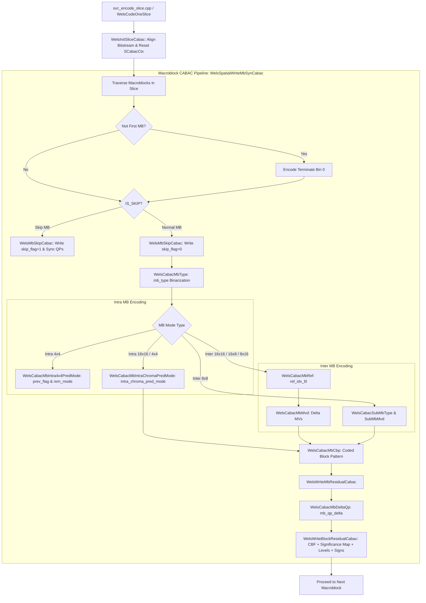

# OpenH264 Encoder: CABAC Macroblock Syntax Writer (`svc_set_mb_syn_cabac.cpp`)

This document provides a comprehensive, literate-programming-style technical deep dive into [svc_set_mb_syn_cabac.cpp](openh264/codec/encoder/core/src/svc_set_mb_syn_cabac.cpp) and its associated header interfaces ([svc_set_mb_syn.h](openh264/codec/encoder/core/inc/svc_set_mb_syn.h), [set_mb_syn_cabac.h](openh264/codec/encoder/core/inc/set_mb_syn_cabac.h), and [set_mb_syn_cavlc.h](openh264/codec/encoder/core/inc/set_mb_syn_cavlc.h)).

---

## Table of Contents
1. [Module Overview & Architectural Role](#1-module-overview--architectural-role)
2. [Data Structures, State Enums, & Type Definitions](#2-data-structures-state-enums--type-definitions)
   - [2.1 SCabacCtx & SStateCtx](#21-scabactx--sstatectx)
   - [2.2 SMB (Encoder Macroblock Representation)](#22-smb-encoder-macroblock-representation)
   - [2.3 SMbCache & SDCTCoeff](#23-smbcache--sdctcoeff)
   - [2.4 SSlice & SSliceHeaderExt](#24-sslice--ssliceheaderext)
   - [2.5 Block Category Enumeration (ECtxBlockCat)](#25-block-category-enumeration-ectxblockcat)
3. [CABAC Context Index Offsets & Binarization Models](#3-cabac-context-index-offsets--binarization-models)
   - [3.1 Context Offset Tables](#31-context-offset-tables)
   - [3.2 CABAC State Engine & Bitstream Registers](#32-cabac-state-engine--bitstream-registers)
4. [Macroblock Header & Mode Entropy Encoding](#4-macroblock-header--mode-entropy-encoding)
   - [4.1 WelsMbSkipCabac (Macroblock Skip Flag)](#41-welsmbskipcabac-macroblock-skip-flag)
   - [4.2 WelsCabacMbType (Macroblock Partitioning Type)](#42-welscabacmbtype-macroblock-partitioning-type)
   - [4.3 WelsCabacMbIntra4x4PredMode (Intra 4x4 Prediction Modes)](#43-welscabacmbintra4x4predmode-intra-4x4-prediction-modes)
   - [4.4 WelsCabacMbIntraChromaPredMode (Intra Chroma Prediction Mode)](#44-welscabacmbintrachromapredmode-intra-chroma-prediction-mode)
5. [Inter Motion Information & Partition Encoding](#5-inter-motion-information--partition-encoding)
   - [5.1 WelsCabacMbRef (Reference Picture Index)](#51-welscabacmbref-reference-picture-index)
   - [5.2 WelsCabacMbMvdLx & WelsCabacMbMvd (Motion Vector Differences)](#52-welscabacmbmvdlx--welscabacmbmvd-motion-vector-differences)
   - [5.3 WelsCabacSubMbType & WelsCabacSubMbMvd (8x8 Sub-Macroblock Partitions)](#53-welscabacsubmbtype--welscabacsubmbmvd-8x8-sub-macroblock-partitions)
6. [CBP, Quantization Adaptation, & Residual Block Encoding](#6-cbp-quantization-adaptation--residual-block-encoding)
   - [6.1 WelsCabacMbCbp (Coded Block Pattern)](#61-welscabacmbcbp-coded-block-pattern)
   - [6.2 WelsCabacMbDeltaQp (Macroblock Delta QP)](#62-welscabacmbdeltaqp-macroblock-delta-qp)
   - [6.3 WelsGetMbCtxCabac (Coded Block Flag Context Derivation)](#63-welsgetmbctxcabac-coded-block-flag-context-derivation)
   - [6.4 WelsWriteBlockResidualCabac (Residual Transform Coefficients)](#64-welswriteblockresidualcabac-residual-transform-coefficients)
   - [6.5 WelsCalNonZeroCount2x2Block & WelsWriteMbResidualCabac](#65-welscalnonzerocount2x2block--welswritembresidualcabac)
7. [Slice Initialization & Top-Level Macroblock Entry Point](#7-slice-initialization--top-level-macroblock-entry-point)
   - [7.1 WelsInitSliceCabac](#71-welsinitslicecabac)
   - [7.2 WelsSpatialWriteMbSynCabac](#72-welsspatialwritembsyncabac)
8. [Call Graph & Subsystem Interactions](#8-call-graph--subsystem-interactions)

---

## 1. Module Overview & Architectural Role

The source file [svc_set_mb_syn_cabac.cpp](openh264/codec/encoder/core/src/svc_set_mb_syn_cabac.cpp) implements the complete **Context-based Adaptive Binary Arithmetic Coding (CABAC)** macroblock syntax serialization layer for the OpenH264 video encoder.

In the H.264 / MPEG-4 AVC standard (ITU-T Rec. H.264 / ISO/IEC 14496-10, Section 9.3), CABAC provides superior compression efficiency over CAVLC (typically saving 10% to 15% bit-rate at identical visual quality) by combining adaptive probability modeling, conditional context selection from neighboring spatial macroblocks, and high-efficiency binary arithmetic coding.



### Key Responsibilities
1. **Context-Adaptive Binarization**: Transforms macroblock syntax elements (`mb_skip_flag`, `mb_type`, `sub_mb_type`, `mvd`, `ref_idx_l0`, `intra_chroma_pred_mode`, `prev_intra4x4_pred_mode_flag`, `coded_block_pattern`, `mb_qp_delta`, and residual transform coefficients) into binary sequences (bins).
2. **Spatial Neighborhood Context Modeling**: Dynamically calculates context indices ($ctxIdx$) by querying spatial boundary conditions and flags of Left ($A$) and Top ($B$) macroblocks/sub-blocks.
3. **Multi-Scale Transform Residual Serialization**: Encodes 4x4 Luma DC (Hadamard), 4x4 Luma AC, 4x4 Luma full residual blocks, 2x2 Chroma DC, and 4x4 Chroma AC residual blocks with precise significance maps and Exp-Golomb suffix binarizations.

---

## 2. Data Structures, State Enums, & Type Definitions

### 2.1 SCabacCtx & SStateCtx

Declared in [set_mb_syn_cabac.h](openh264/codec/encoder/core/inc/set_mb_syn_cabac.h#L56-L73):

```cpp
typedef struct TagStateCtx {
  uint8_t m_uiStateMps; // Packed representation: (uiState << 1) | uiMps

  uint8_t Mps()   const { return m_uiStateMps & 1; }
  uint8_t State() const { return m_uiStateMps >> 1; }
  void Set (uint8_t uiState, uint8_t uiMps) { m_uiStateMps = (uiState << 1) | uiMps; }
} SStateCtx;

typedef struct TagCabacCtx {
  cabac_low_t m_uiLow;                        // 64-bit low range register (L)
  int32_t     m_iLowBitCnt;                    // Uncommitted bit counter in low register
  int32_t     m_iRenormCnt;                    // Outstanding renormalization shifts
  uint32_t    m_uiRange;                       // Current interval range register (R)
  SStateCtx   m_sStateCtx[WELS_CONTEXT_COUNT]; // 460 probability model states
  uint8_t*    m_pBufStart;                     // Slice bitstream buffer start pointer
  uint8_t*    m_pBufEnd;                       // Slice bitstream buffer end boundary
  uint8_t*    m_pBufCur;                       // Current byte output writing pointer
} SCabacCtx;
```

| Field | Type | Bit-Depth / Range | Purpose & Architectural Invariants |
| :--- | :--- | :--- | :--- |
| `m_uiStateMps` | `uint8_t` | 8 bits | Packed probability state (bits 7..1: 6-bit state index $[0..63]$) and Most Probable Symbol (bit 0: `uiMps` $\in \{0, 1\}$). |
| `m_uiLow` | `cabac_low_t` (`uint64_t`) | 64 bits | Lower bound $L$ of the current arithmetic coding interval. |
| `m_iLowBitCnt` | `int32_t` | $[0..64]$ | Bit position counter tracking active unwritten bits within `m_uiLow`. Initialized to 9 upon slice start. |
| `m_iRenormCnt` | `int32_t` | $[0..16]$ | Accumulated shift count for arithmetic interval renormalization. |
| `m_uiRange` | `uint32_t` | $[256..510]$ | Arithmetic interval range $R$. Initialized to $510$ ($0x01\text{FE}$). |
| `m_sStateCtx` | `SStateCtx[460]` | 460 bytes | Array of 460 adaptive context models matching H.264 standard context tables. |
| `m_pBufCur` | `uint8_t*` | Pointer | Byte pointer into active output RBSP bitstream buffer. |

---

### 2.2 SMB (Encoder Macroblock Representation)

Declared in [svc_enc_macroblock.h](openh264/codec/encoder/core/inc/svc_enc_macroblock.h#L49-L78):

```cpp
typedef struct TagMB {
  Mb_Type    uiMbType;                  // Macroblock partitioning type
  uint8_t    uiSubMbType[4];            // 8x8 sub-macroblock types (for MB_TYPE_8x8)
  int32_t    iMbXY;                     // Macroblock raster index (iMbX + iMbY * iMbWidth)
  int16_t    iMbX;                      // Macroblock horizontal index [0..width-1]
  int16_t    iMbY;                      // Macroblock vertical index [0..height-1]
  uint8_t    uiNeighborAvail;           // Boundary bitmask (LEFT:0x01, TOP:0x02, TOPRIGHT:0x04, TOPLEFT:0x08)
  uint8_t    uiCbp;                     // Coded Block Pattern (bits 3..0: Luma, bits 5..4: Chroma)
  SMVUnitXY* sMv;                       // Active motion vector array
  int8_t*    pRefIndex;                 // Reference index array
  int32_t*   pSadCost;                  // SAD cost per partition
  int8_t*    pIntra4x4PredMode;         // Intra 4x4 prediction mode array [16]
  int8_t*    pNonZeroCount;             // Non-zero coefficient counts [24]
  SMVUnitXY  sP16x16Mv;                 // 16x16 partition motion vector
  uint8_t    uiLumaQp;                  // Macroblock Luma Quantization Parameter [0..51]
  uint8_t    uiChromaQp;                // Macroblock Chroma Quantization Parameter [0..51]
  uint16_t   uiSliceIdc;                // Slice identifier to verify spatial boundary validity
  uint32_t   uiChromPredMode;           // Intra chroma prediction mode [0..3]
  int32_t    iLumaDQp;                  // Delta QP relative to preceding coded MB
  SMVUnitXY  sMvd[MB_BLOCK4x4_NUM];     // Cached MVD vector array (16 4x4 sub-blocks)
  int32_t    iCbpDc;                    // Bitmask indicating DC transform presence (bit 0: Luma DC, bit 1: Cb DC, bit 2: Cr DC)
} SMB, *PMb;
```

---

### 2.3 SMbCache & SDCTCoeff

Declared in [mb_cache.h](openh264/codec/encoder/core/inc/mb_cache.h#L62-L137):

```cpp
typedef struct TagDCTCoeff {
  int16_t iLumaBlock[16][16]; // 16 4x4 Luma residual blocks (each 16 coefficients)
  int16_t iLumaI16x16Dc[16];  // 4x4 Luma DC transform block for Intra 16x16
  int16_t iChromaBlock[8][16];// 8 4x4 Chroma AC residual blocks (4 Cb + 4 Cr)
  int16_t iChromaDc[2][4];    // 2 2x2 Chroma DC transform blocks (Cb DC & Cr DC)
} SDCTCoeff;

typedef struct TagMbCache {
  SMVComponentUnit sMvComponents;          // Cached motion vector and reference index neighborhood
  int8_t           iNonZeroCoeffCount[48]; // 48-byte local cache for block non-zero counts
  int8_t           iIntraPredMode[48];     // 48-byte local cache for Intra spatial prediction modes
  SMVUnitXY        sMbMvp[16];             // Predicted motion vectors for CABAC writing
  bool*            pPrevIntra4x4PredModeFlag; // Flags for Intra 4x4 MPM matching
  int8_t*          pRemIntra4x4PredModeFlag;  // Remainder mode values for Intra 4x4
  bool             bMbTypeSkip[4];         // Skip flags for neighbor MB partitions
  SDCTCoeff*       pDct;                   // Pointer to quantized transform coefficient matrix
  uint8_t          uiLumaI16x16Mode;       // Intra 16x16 prediction mode
  uint8_t          uiChmaI8x8Mode;         // Intra Chroma 8x8 prediction mode
} SMbCache;
```

---

### 2.4 SSlice & SSliceHeaderExt

Declared in [slice.h](openh264/codec/encoder/core/inc/slice.h#L172-L208):

```cpp
typedef struct TagSlice {
  SMbCache        sMbCacheInfo;        // Thread-local macroblock caching context
  SBitStringAux*  pSliceBsa;           // Bitstream writer auxiliary buffer
  SSliceHeaderExt sSliceHeaderExt;     // Extended slice header information
  uint8_t         uiLastMbQp;          // Quantization parameter of previously coded MB
  SCabacCtx       sCabacCtx;           // Slice-level CABAC arithmetic encoder state
  int32_t         iCabacInitIdc;       // CABAC initialization table index [0..2]
} SSlice, *PSlice;
```

---

### 2.5 Block Category Enumeration (ECtxBlockCat)

Declared in [set_mb_syn_cavlc.h](openh264/codec/encoder/core/inc/set_mb_syn_cavlc.h#L50-L56):

```cpp
enum ECtxBlockCat {
  LUMA_DC     = 0, // Intra 16x16 Luma DC 4x4 Hadamard transform block
  LUMA_AC     = 1, // Intra 16x16 Luma AC 4x4 transform blocks (15 coefficients)
  LUMA_4x4    = 2, // Standard Luma 4x4 transform blocks (16 coefficients)
  CHROMA_DC   = 3, // Chroma Cb/Cr 2x2 Hadamard DC transform blocks (4 coefficients)
  CHROMA_AC   = 4  // Chroma Cb/Cr 4x4 AC transform blocks (15 coefficients)
};
```

---

## 3. CABAC Context Index Offsets & Binarization Models

### 3.1 Context Offset Tables

File-local static tables defined in [svc_set_mb_syn_cabac.cpp](openh264/codec/encoder/core/src/svc_set_mb_syn_cabac.cpp#L48-L51):

```cpp
static const uint16_t uiSignificantCoeffFlagOffset[5] = {0, 15, 29, 44, 47};
static const uint16_t uiLastCoeffFlagOffset[5]        = {0, 15, 29, 44, 47};
static const uint16_t uiCoeffAbsLevelMinus1Offset[5]  = {0, 10, 20, 30, 39};
static const uint16_t uiCodecBlockFlagOffset[5]       = {0, 4,  8,  12, 16};
```

These tables map each residual transform block category (`ECtxBlockCat`) to its base context model index in accordance with H.264 CABAC specifications:

| Syntax Element | Base Ctx Index | Category 0: LUMA_DC | Category 1: LUMA_AC | Category 2: LUMA_4x4 | Category 3: CHROMA_DC | Category 4: CHROMA_AC |
| :--- | :--- | :--- | :--- | :--- | :--- | :--- |
| `coded_block_flag` | **85** | $85 + 0 = 85$ | $85 + 4 = 89$ | $85 + 8 = 93$ | $85 + 12 = 97$ | $85 + 16 = 101$ |
| `significant_coeff_flag` | **105** | $105 + 0 = 105$ | $105 + 15 = 120$ | $105 + 29 = 134$ | $105 + 44 = 149$ | $105 + 47 = 152$ |
| `last_significant_coeff_flag` | **166** | $166 + 0 = 166$ | $166 + 15 = 181$ | $166 + 29 = 195$ | $166 + 44 = 210$ | $166 + 47 = 213$ |
| `coeff_abs_level_minus1` | **227** | $227 + 0 = 227$ | $227 + 10 = 237$ | $227 + 20 = 247$ | $227 + 30 = 257$ | $227 + 39 = 266$ |

---

### 3.2 CABAC State Engine & Bitstream Registers

The CABAC engine maintains two primary registers:
1. **Range Register ($R$)** (`m_uiRange`): Represents the current width of the arithmetic coding sub-interval. $R \in [256, 510]$.
2. **Low Register ($L$)** (`m_uiLow`): 64-bit unsigned integer representing the bottom of the coding interval.

#### Binary Arithmetic Encoding Equations
When encoding a binary decision $b \in \{0, 1\}$ with context index $iCtx$:

1. Retrieve the 6-bit probability state $\sigma = \text{State}(iCtx)$ and Most Probable Symbol $\text{MPS} = \text{Mps}(iCtx)$.
2. Calculate the Least Probable Symbol sub-interval $R_{\text{LPS}}$ from the lookup table:
   $$R_{\text{LPS}} = \text{g\_kuiCabacRangeLps}[\sigma][(R \gg 6) \ \& \ 3]$$
3. Update interval range $R$:
   $$R_{\text{MPS}} = R - R_{\text{LPS}}$$
4. If $b == \text{MPS}$:
   $$R \leftarrow R_{\text{MPS}}$$
   Update state: $\sigma \leftarrow \text{g\_kuiStateTransTable}[\sigma][1]$
5. If $b \ne \text{MPS}$ (LPS path):
   $$L \leftarrow L + R_{\text{MPS}}, \quad R \leftarrow R_{\text{LPS}}$$
   If $\sigma == 0$, invert MPS: $\text{MPS} \leftarrow 1 - \text{MPS}$
   Update state: $\sigma \leftarrow \text{g\_kuiStateTransTable}[\sigma][0]$
6. **Renormalization**: Left-shift $R$ and $L$ until $R \ge 256$, flushing completed bits into the byte output buffer `m_pBufCur`.

---

## 4. Macroblock Header & Mode Entropy Encoding

### 4.1 WelsMbSkipCabac (Macroblock Skip Flag)

Located at [svc_set_mb_syn_cabac.cpp:L261-L282](openh264/codec/encoder/core/src/svc_set_mb_syn_cabac.cpp#L261-L282):

```cpp
void WelsMbSkipCabac (SCabacCtx* pCabacCtx, SMB* pCurMb, int32_t iMbWidth, EWelsSliceType eSliceType,
                      int16_t bSkipFlag);
```

#### Context Derivation Formula
The context index for `mb_skip_flag` depends on whether the Left ($A$) and Top ($B$) neighbor macroblocks are skipped:
$$iCtx = \text{BaseCtx} + (\text{Left Available} \land \neg\text{IS\_SKIP}(A)) + (\text{Top Available} \land \neg\text{IS\_SKIP}(B))$$
where:
- $\text{BaseCtx} = 11$ for **P-Slice** ($iCtx \in [11, 13]$)
- $\text{BaseCtx} = 24$ for **B-Slice** ($iCtx \in [24, 26]$)

#### Behavioral Invariants
If `bSkipFlag == 1`:
- Encodes bin `1` with context $iCtx$.
- Resets all 16 motion vector difference structures:
  $$\forall i \in [0..15]: \quad \text{sMvd}[i].iMvX = 0, \quad \text{sMvd}[i].iMvY = 0$$
- Clears coded block patterns: `uiCbp = 0`, `iCbpDc = 0`.

---

### 4.2 WelsCabacMbType (Macroblock Partitioning Type)

Located at [svc_set_mb_syn_cabac.cpp:L54-L136](openh264/codec/encoder/core/src/svc_set_mb_syn_cabac.cpp#L54-L136):

```cpp
static void WelsCabacMbType (SCabacCtx* pCabacCtx, SMB* pCurMb, SMbCache* pMbCache, int32_t iMbWidth,
                             EWelsSliceType eSliceType);
```

#### A. I-Slice Binarization Tree
In I-slices, macroblocks are either `MB_TYPE_INTRA4x4` or `MB_TYPE_INTRA16x16`.

```
                        mb_type (I-Slice)
                           /        \
                     [bin 0]        [bin 1]
                       /                \
               MB_TYPE_INTRA4x4    MB_TYPE_INTRA16x16
                                          |
                                   Terminate Bin 0
                                          |
                                    CBP Luma Flag
                                       /     \
                                  [bin 0]   [bin 1]
                                 CBP_L=0    CBP_L!=0
                                          |
                                    CBP Chroma Bins
                                    /      |      \
                               Chroma=0 Chroma=1 Chroma=2
                                          |
                                  Intra 16x16 Mode Bins (2 bits)
```

1. **Context Index Calculation**:
   $$iCtx = 3 + (\text{Left Avail} \land \neg\text{IS\_INTRA4x4}(A)) + (\text{Top Avail} \land \neg\text{IS\_INTRA4x4}(B)) \quad \implies iCtx \in [3, 5]$$
2. **Intra 4x4**: Encodes bin `0` with context $iCtx$.
3. **Intra 16x16**:
   - Encodes bin `1` with context $iCtx$.
   - Encodes terminate bin `0` via `WelsCabacEncodeTerminate(pCabacCtx, 0)`.
   - Encodes Luma CBP presence (`iCbpLuma != 0`) using context 6.
   - Encodes Chroma CBP (`iCbpChroma`):
     - `iCbpChroma == 0`: bin `0` with context 7.
     - `iCbpChroma > 0`: bin `1` with context 7, followed by `(iCbpChroma >> 1)` with context 8.
   - Encodes Intra 16x16 prediction mode `iPredMode` (mapped via `g_kiMapModeI16x16`):
     - Bin 1: `(iPredMode >> 1)` with context 9.
     - Bin 0: `(iPredMode & 1)` with context 10.

#### B. P-Slice Binarization Tree

| Macroblock Mode | Bin Sequence | Context Indices Used |
| :--- | :--- | :--- |
| `MB_TYPE_16x16` | `0, 0, 0` | Ctx 14, Ctx 15, Ctx 16 |
| `MB_TYPE_16x8` | `0, 1, 1` | Ctx 14, Ctx 15, Ctx 17 |
| `MB_TYPE_8x16` | `0, 1, 0` | Ctx 14, Ctx 15, Ctx 17 |
| `MB_TYPE_8x8` / `8x8_REF0` | `0, 0, 1` | Ctx 14, Ctx 15, Ctx 16 |
| `MB_TYPE_INTRA4x4` | `1, 0` | Ctx 14, Ctx 17 |
| `MB_TYPE_INTRA16x16` | `1, 1` + Term(0) + CBP/Mode bins | Ctx 14, Ctx 17, Ctx 18, Ctx 19, Ctx 20 |

---

### 4.3 WelsCabacMbIntra4x4PredMode (Intra 4x4 Prediction Modes)

Located at [svc_set_mb_syn_cabac.cpp:L137-L154](openh264/codec/encoder/core/src/svc_set_mb_syn_cabac.cpp#L137-L154):

```cpp
void WelsCabacMbIntra4x4PredMode (SCabacCtx* pCabacCtx, SMbCache* pMbCache);
```

For each 4x4 sub-block index $iMode \in [0..15]$:
1. Queries `bPredFlag = pMbCache->pPrevIntra4x4PredModeFlag[iMode]`.
2. If `bPredFlag == true` (Most Probable Mode match):
   - Encodes bin `1` with context **68**.
3. If `bPredFlag == false`:
   - Encodes bin `0` with context **68**.
   - Encodes 3-bit remainder mode `iRemMode = pMbCache->pRemIntra4x4PredModeFlag[iMode]` $\in [0..7]$ using context **69**:
     - Bit 0: `iRemMode & 0x01` (Ctx 69)
     - Bit 1: `(iRemMode >> 1) & 0x01` (Ctx 69)
     - Bit 2: `(iRemMode >> 2)` (Ctx 69)

---

### 4.4 WelsCabacMbIntraChromaPredMode (Intra Chroma Prediction Mode)

Located at [svc_set_mb_syn_cabac.cpp:L156-L182](openh264/codec/encoder/core/src/svc_set_mb_syn_cabac.cpp#L156-L182):

```cpp
void WelsCabacMbIntraChromaPredMode (SCabacCtx* pCabacCtx, SMB* pCurMb, SMbCache* pMbCache, int32_t iMbWidth);
```

Encodes the chroma spatial intra prediction mode (0: DC, 1: Horizontal, 2: Vertical, 3: Plane).

#### Context Model Selection ($iCtx$)
$$iCtx = 64 + (\text{Left Avail} \land \text{ChromaMode}(A) \ne 0) + (\text{Top Avail} \land \text{ChromaMode}(B) \ne 0) \quad \implies iCtx \in [64, 66]$$

#### Truncated Binarization Table

| Chroma Mode | Name | Bin Sequence | Contexts |
| :--- | :--- | :--- | :--- |
| **0** | DC | `0` | $iCtx$ |
| **1** | Horizontal | `1, 0` | $iCtx$, Ctx 67 |
| **2** | Vertical | `1, 1, 0` | $iCtx$, Ctx 67, Ctx 67 |
| **3** | Plane | `1, 1, 1` | $iCtx$, Ctx 67, Ctx 67 |

---

## 5. Inter Motion Information & Partition Encoding

### 5.1 WelsCabacMbRef (Reference Picture Index)

Located at [svc_set_mb_syn_cabac.cpp:L284-L302](openh264/codec/encoder/core/src/svc_set_mb_syn_cabac.cpp#L284-L302):

```cpp
void WelsCabacMbRef (SCabacCtx* pCabacCtx, SMB* pCurMb, SMbCache* pMbCache, int16_t iIdx);
```

Encodes reference frame list index `ref_idx_l0` using unary binarization.

#### Context Model Derivation
The initial context for the first bin is derived from neighbor reference indices $iRefIdxA$ (Left) and $iRefIdxB$ (Top):
$$iCtx = 0 + (iRefIdxA > 0 \land \neg\text{Skip}(A)) + 2 \cdot (iRefIdxB > 0 \land \neg\text{Skip}(B)) \quad \implies iCtx \in [0, 3]$$
- First bin encodes $(iRefIdx > 0)$ with context $54 + iCtx$ ($[54..57]$).
- Subsequent unary bins update context to $54 + ((iCtx \gg 2) + 4) = 58$.
- Terminating bin `0` is emitted with context $54 + iCtx$ when $iRefIdx == 0$.

---

### 5.2 WelsCabacMbMvdLx & WelsCabacMbMvd (Motion Vector Differences)

Located at [svc_set_mb_syn_cabac.cpp:L304-L368](openh264/codec/encoder/core/src/svc_set_mb_syn_cabac.cpp#L304-L368):

```cpp
inline void WelsCabacMbMvdLx (SCabacCtx* pCabacCtx, int32_t sMvd, int32_t iCtx, int32_t iPredMvd);
SMVUnitXY WelsCabacMbMvd (SCabacCtx* pCabacCtx, SMB* pCurMb, uint32_t iMbWidth,
                          SMVUnitXY sCurMv, SMVUnitXY sPredMv, int16_t i4x4ScanIdx);
```

#### A. Motion Vector Difference Computation
For horizontal ($x$) and vertical ($y$) components:
$$\Delta MV_x = MV_x - MVP_x, \quad \Delta MV_y = MV_y - MVP_y$$

Spatial neighbor MVD sums are evaluated:
$$e_k(A, B) = |MVD_{k, \text{Left}}| + |MVD_{k, \text{Top}}|$$

Context increment $iCtxInc$ is selected based on $e_k$:
$$iCtxInc = \begin{cases} 0 & e_k \le 2 \\ 1 & 2 < e_k \le 32 \\ 2 & e_k > 32 \end{cases}$$
where base context $iCtx = 40$ for horizontal $MVD_x$ and $iCtx = 47$ for vertical $MVD_y$.

#### B. MVD Binarization Scheme
1. If $|\Delta MV| == 0$: encodes bin `0` with context $iCtx + iCtxInc$.
2. If $|\Delta MV| > 0$:
   - Prefix length $P = \min(|\Delta MV|, 9)$.
   - Encodes bin `1` with context $iCtx + iCtxInc$.
   - Encodes $(P - 1)$ bins `1` using incremental context indices ($iCtx + 3$, $iCtx + 4$, $iCtx + 5$).
   - If $P < 9$: emits terminating bin `0` with context $iCtx + iCtxInc$.
   - If $P == 9$ ($|\Delta MV| \ge 9$): encodes remaining magnitude $(|\Delta MV| - 9)$ using **3rd-order Exp-Golomb binarization** (`WelsCabacEncodeUeBypass(pCabacCtx, 3, iAbsMvd - 9)`).
   - Encodes sign bit ($\Delta MV < 0$) using bypass mode (`WelsCabacEncodeBypassOne`).

---

### 5.3 WelsCabacSubMbType & WelsCabacSubMbMvd (8x8 Sub-Macroblock Partitions)

Located at [svc_set_mb_syn_cabac.cpp:L369-L424](openh264/codec/encoder/core/src/svc_set_mb_syn_cabac.cpp#L369-L424):

```cpp
static void WelsCabacSubMbType (SCabacCtx* pCabacCtx, SMB* pCurMb);
static void WelsCabacSubMbMvd (SCabacCtx* pCabacCtx, SMB* pCurMb, SMbCache* pMbCache, const int kiMbWidth);
```

#### Sub-Macroblock Type Binarization Tree

| Sub-MB Type | Geometry | Bin Sequence | Contexts |
| :--- | :--- | :--- | :--- |
| `SUB_MB_TYPE_8x8` | 1 8x8 block | `1` | Ctx 21 |
| `SUB_MB_TYPE_8x4` | 2 8x4 blocks | `0, 0` | Ctx 21, Ctx 22 |
| `SUB_MB_TYPE_4x8` | 2 4x8 blocks | `0, 1, 1` | Ctx 21, Ctx 22, Ctx 23 |
| `SUB_MB_TYPE_4x4` | 4 4x4 blocks | `0, 1, 0` | Ctx 21, Ctx 22, Ctx 23 |

`WelsCabacSubMbMvd` iterates across the 4 8x8 partitions and serializes the appropriate number of MVD vectors according to sub-partition geometry, assigning identical MVDs across sub-block caches.

---

## 6. CBP, Quantization Adaptation, & Residual Block Encoding

### 6.1 WelsCabacMbCbp (Coded Block Pattern)

Located at [svc_set_mb_syn_cabac.cpp:L184-L227](openh264/codec/encoder/core/src/svc_set_mb_syn_cabac.cpp#L184-L227):

```cpp
void WelsCabacMbCbp (SMB* pCurMb, int32_t iMbWidth, SCabacCtx* pCabacCtx);
```

Encodes the 6-bit Coded Block Pattern (`CBP`): 4 bits for Luma 8x8 blocks, 2 bits for Chroma.

#### Luma CBP Context Derivation (Base Ctx 73)
For each 8x8 luma block $k \in [0..3]$:
$$iCtx_k = 73 + \text{LeftCond}_k + 2 \cdot \text{TopCond}_k$$

```
   Block 0: Ctx = 73 + Left_MB_Blk1 + Top_MB_Blk2 * 2
   Block 1: Ctx = 73 + (!CBP_Luma[0]) + Top_MB_Blk3 * 2
   Block 2: Ctx = 73 + Left_MB_Blk3 + (!CBP_Luma[0]) * 2
   Block 3: Ctx = 73 + (!CBP_Luma[2]) + (!CBP_Luma[1]) * 2
```

#### Chroma CBP Context Derivation
- **Chroma DC Bit** ($CBP_{\text{Chroma}} > 0$): Encoded with context $77 + iCtx$, where $iCtx = (CBP_{\text{Chroma, Left}} > 0 ? 1 : 0) + (CBP_{\text{Chroma, Top}} > 0 ? 2 : 0) \in [77..80]$.
- **Chroma AC Bit** ($CBP_{\text{Chroma}} > 1$): Encoded with context $81 + (CBP_{\text{Chroma, Left}} \gg 1) + 2 \cdot (CBP_{\text{Chroma, Top}} \gg 1) \in [81..84]$.

---

### 6.2 WelsCabacMbDeltaQp (Macroblock Delta QP)

Located at [svc_set_mb_syn_cabac.cpp:L229-L259](openh264/codec/encoder/core/src/svc_set_mb_syn_cabac.cpp#L229-L259):

```cpp
void WelsCabacMbDeltaQp (SMB* pCurMb, SCabacCtx* pCabacCtx, bool bFirstMbInSlice);
```

Serializes $\Delta QP = QP_{\text{Luma}} - QP_{\text{Prev}}$.

1. **Context Derivation**:
   $$iCtx = \begin{cases} 0 & \text{First MB in Slice} \lor \text{Prev MB Skipped} \lor (CBP_{\text{Prev}} == 0 \land \neg\text{Intra16x16}) \lor \Delta QP_{\text{Prev}} == 0 \\ 1 & \text{Otherwise} \end{cases}$$
2. If $\Delta QP == 0$: encodes bin `0` with context $60 + iCtx$.
3. If $\Delta QP \ne 0$: encodes bin `1` with context $60 + iCtx$.
   Maps signed difference $\Delta QP$ to unsigned value $V$:
   $$V = \begin{cases} -2 \cdot \Delta QP & \Delta QP < 0 \\ 2 \cdot \Delta QP - 1 & \Delta QP > 0 \end{cases}$$
   - If $V == 1$: encodes bin `0` with context 62 ($60 + 2$).
   - If $V > 1$: encodes bin `1` with context 62, followed by $(V - 1)$ unary bins `1` with context 63 ($60 + 3$), terminated by bin `0` with context 63.

---

### 6.3 WelsGetMbCtxCabac (Coded Block Flag Context Derivation)

Located at [svc_set_mb_syn_cabac.cpp:L426-L454](openh264/codec/encoder/core/src/svc_set_mb_syn_cabac.cpp#L426-L454):

```cpp
int16_t WelsGetMbCtxCabac (SMbCache* pMbCache, SMB* pCurMb, uint32_t iMbWidth, ECtxBlockCat eCtxBlockCat,
                           int16_t iIdx);
```

Derives context index for `coded_block_flag` (CBF) indicating whether a transform block contains any non-zero coefficients.

#### Mathematical Context Increment Formulation
Retrieves non-zero coefficient counts $n_A$ (Left block) and $n_B$ (Top block):
$$iCtxInc = (n_A > 0 \lor (n_A == -1 \land \text{Intra})) + 2 \cdot (n_B > 0 \lor (n_B == -1 \land \text{Intra}))$$
$$\text{Final Ctx} = 85 + \text{uiCodecBlockFlagOffset}[eCtxBlockCat] + iCtxInc$$

---

### 6.4 WelsWriteBlockResidualCabac (Residual Transform Coefficients)

Located at [svc_set_mb_syn_cabac.cpp:L456-L523](openh264/codec/encoder/core/src/svc_set_mb_syn_cabac.cpp#L456-L523):

```cpp
void WelsWriteBlockResidualCabac (SMbCache* pMbCache, SMB* pCurMb, uint32_t iMbWidth, SCabacCtx* pCabacCtx,
                                  ECtxBlockCat eCtxBlockCat, int16_t iIdx, int16_t iNonZeroCount,
                                  int16_t* pBlock, int16_t iEndIdx);
```

This is the core engine for encoding quantized transform residual blocks.

```mermaid
flowchart TD
    Start[WelsWriteBlockResidualCabac] --> CheckNZ{iNonZeroCount > 0?}
    CheckNZ -->|No| EncodeCBF0[Encode CBF = 0 with iCtx]
    CheckNZ -->|Yes| EncodeCBF1[Encode CBF = 1 with iCtx]

    EncodeCBF1 --> SigMap[Forward Scan: Significance Map]
    subgraph Significance Map Loop
        SigMap --> CoeffCheck{pBlock[i] != 0?}
        CoeffCheck -->|No| Sig0[Encode significant_coeff_flag = 0]
        CoeffCheck -->|Yes| Sig1[Encode significant_coeff_flag = 1]
        Sig1 --> LastCheck{iNonZeroIdx == iNonZeroCount?}
        LastCheck -->|No| Last0[Encode last_significant_coeff_flag = 0]
        LastCheck -->|Yes| Last1[Encode last_significant_coeff_flag = 1 & Break]
    end

    Last1 --> LevelLoop[Reverse Scan: Coefficient Levels & Signs]
    subgraph Level & Sign Loop
        LevelLoop --> PrefixCheck{|Level| > 1?}
        PrefixCheck -->|No: |Level|=1| LevelBin0[Encode Level_Gt1 = 0]
        PrefixCheck -->|Yes: |Level|>1| LevelBin1[Encode Level_Gt1 = 1 & Unary Prefix]
        LevelBin1 --> ExpGolomb{|Level| >= 15?}
        ExpGolomb -->|Yes| UEBypass[WelsCabacEncodeUeBypass: 0th-order Exp-Golomb]
        ExpGolomb -->|No| SignBypass[WelsCabacEncodeBypassOne: Sign Bit]
        LevelBin0 --> SignBypass
    end
```

#### 1. Significance Map Encoding
- `iCtxSig = 105 + uiSignificantCoeffFlagOffset[eCtxBlockCat]`
- `iCtxLast = 166 + uiLastCoeffFlagOffset[eCtxBlockCat]`
- For each coefficient position $i \in [0..iEndIdx]$:
  - If $pBlock[i] \ne 0$: emits bin `1` for `significant_coeff_flag` at context `iCtxSig + i`. If this is the final non-zero coefficient (`iNonZeroIdx == iNonZeroCount`), emits bin `1` for `last_significant_coeff_flag` at context `iCtxLast + i` and terminates the significance scan. Otherwise emits bin `0`.
  - If $pBlock[i] == 0$: emits bin `0` for `significant_coeff_flag` at context `iCtxSig + i`.

#### 2. Reverse Level & Sign Encoding
Iterates backwards from the last non-zero coefficient to the first:
- Evaluates magnitude prefix $P = |level| - 1$.
- If $P > 0$ ($|level| > 1$): emits bin `1` with context $iCtxLevel$. Emits unary prefix bins. If $|level| \ge 15$, serializes remainder $(|level| - 15)$ via **0-th order Exp-Golomb bypass** (`WelsCabacEncodeUeBypass(pCabacCtx, 0, |level| - 15)`).
- If $P == 0$ ($|level| == 1$): emits bin `0` with context $iCtxLevel$.
- Emits coefficient sign bit (`level < 0`) via single bypass bit `WelsCabacEncodeBypassOne(pCabacCtx, level < 0)`.

---

### 6.5 WelsCalNonZeroCount2x2Block & WelsWriteMbResidualCabac

Located at [svc_set_mb_syn_cabac.cpp:L524-L620](openh264/codec/encoder/core/src/svc_set_mb_syn_cabac.cpp#L524-L620):

```cpp
int32_t WelsCalNonZeroCount2x2Block (int16_t* pBlock);
int32_t WelsWriteMbResidualCabac (SWelsFuncPtrList* pFuncList, SSlice* pSlice, SMbCache* sMbCacheInfo, SMB* pCurMb,
                                  SCabacCtx* pCabacCtx, int16_t iMbWidth, uint32_t uiChromaQpIndexOffset);
```

- `WelsCalNonZeroCount2x2Block`: Fast branchless non-zero counter for 2x2 Chroma DC blocks:
  $$\text{Count} = (pBlock[0] \ne 0) + (pBlock[1] \ne 0) + (pBlock[2] \ne 0) + (pBlock[3] \ne 0)$$
- `WelsWriteMbResidualCabac`: Coordinates the full transform residual serialization hierarchy for the current macroblock:
  1. Computes $\Delta QP = QP_{\text{Luma}} - QP_{\text{Prev}}$ and calls `WelsCabacMbDeltaQp`.
  2. Updates `pSlice->uiLastMbQp = pCurMb->uiLumaQp`.
  3. **Intra 16x16**: Encodes 1 Luma DC block (category `LUMA_DC`), followed by 16 Luma AC blocks (category `LUMA_AC`) if $CBP_{\text{Luma}} \ne 0$.
  4. **Other MB Types**: Encodes 16 Luma 4x4 residual blocks (category `LUMA_4x4`) for all partitions where $CBP_{\text{Luma}}$ bits are set.
  5. **Chroma Blocks**: If $CBP_{\text{Chroma}} \ne 0$, encodes Cb DC and Cr DC blocks (category `CHROMA_DC`). If $CBP_{\text{Chroma}} \& 0x02$, encodes 4 Cb AC and 4 Cr AC blocks (category `CHROMA_AC`).

---

## 7. Slice Initialization & Top-Level Macroblock Entry Point

### 7.1 WelsInitSliceCabac

Located at [svc_set_mb_syn_cabac.cpp:L626-L634](openh264/codec/encoder/core/src/svc_set_mb_syn_cabac.cpp#L626-L634):

```cpp
void WelsInitSliceCabac (sWelsEncCtx* pEncCtx, SSlice* pSlice);
```

Prepares the CABAC entropy encoder at the start of a slice NAL unit:
1. **Bitstream Alignment**: Calls `BsAlign(pSlice->pSliceBsa)` to ensure the bitstream output writer is aligned to the nearest byte boundary.
2. **Context Model Initialization**: Calls `WelsCabacContextInit(pEncCtx, &pSlice->sCabacCtx, pSlice->iCabacInitIdc)` to populate all 460 context models' probability states (`SStateCtx`) based on slice type (`eSliceType`), slice initialization index (`iCabacInitIdc`), and slice quantization parameter (`iGlobalQp`).
3. **Arithmetic Engine Reset**: Calls `WelsCabacEncodeInit(&pSlice->sCabacCtx, pBs->pCurBuf, pBs->pEndBuf)`, setting initial registers:
   $$L = 0, \quad \text{LowBitCnt} = 9, \quad \text{RenormCnt} = 0, \quad R = 510$$

---

### 7.2 WelsSpatialWriteMbSynCabac

Located at [svc_set_mb_syn_cabac.cpp:L636-L736](openh264/codec/encoder/core/src/svc_set_mb_syn_cabac.cpp#L636-L736):

```cpp
int32_t WelsSpatialWriteMbSynCabac (sWelsEncCtx* pEncCtx, SSlice* pSlice, SMB* pCurMb);
```

Master entry point invoked per-macroblock during slice encoding:

```cpp
int32_t WelsSpatialWriteMbSynCabac (sWelsEncCtx* pEncCtx, SSlice* pSlice, SMB* pCurMb) {
  // 1. Slice termination flag for non-first macroblocks
  if (pCurMb->iMbXY > iSliceFirstMbXY)
    WelsCabacEncodeTerminate (&pSlice->sCabacCtx, 0);

  // 2. Skipped macroblock path
  if (IS_SKIP (pCurMb->uiMbType)) {
    pCurMb->uiLumaQp = pSlice->uiLastMbQp;
    pCurMb->uiChromaQp = g_kuiChromaQpTable[CLIP3_QP_0_51 (pCurMb->uiLumaQp + uiChromaQpIndexOffset)];
    WelsMbSkipCabac (&pSlice->sCabacCtx, pCurMb, iMbWidth, pEncCtx->eSliceType, 1);
  } else {
    // 3. Normal macroblock path
    if (pEncCtx->eSliceType != I_SLICE)
      WelsMbSkipCabac (&pSlice->sCabacCtx, pCurMb, iMbWidth, pEncCtx->eSliceType, 0);

    WelsCabacMbType (pCabacCtx, pCurMb, pMbCache, iMbWidth, pEncCtx->eSliceType);

    // Intra vs Inter partitioning serialization
    if (IS_INTRA (uiMbType)) {
      if (uiMbType == MB_TYPE_INTRA4x4)
        WelsCabacMbIntra4x4PredMode (pCabacCtx, pMbCache);
      WelsCabacMbIntraChromaPredMode (pCabacCtx, pCurMb, pMbCache, iMbWidth);
    } else if (uiMbType == MB_TYPE_16x16) {
      if (uiNumRefIdxL0Active > 0)
        WelsCabacMbRef (pCabacCtx, pCurMb, pMbCache, 0);
      sMvd = WelsCabacMbMvd (pCabacCtx, pCurMb, iMbWidth, pCurMb->sMv[0], pMbCache->sMbMvp[0], 0);
      // Replicate sMvd to all 16 sub-blocks...
    }
    // (Handles 16x8, 8x16, and 8x8 sub-partitions similarly)

    if (uiMbType != MB_TYPE_INTRA16x16)
      WelsCabacMbCbp (pCurMb, iMbWidth, pCabacCtx);

    iRet = WelsWriteMbResidualCabac (pEncCtx->pFuncList, pSlice, pMbCache, pCurMb, pCabacCtx, iMbWidth,
                                     uiChromaQpIndexOffset);
  }
  return iRet;
}
```

---

## 8. Call Graph & Subsystem Interactions

```mermaid
graph TD
    subgraph Slice Layer
        WelsCodeOneSlice[svc_encode_slice.cpp: WelsCodeOneSlice]
        WelsInitSliceCabac[WelsInitSliceCabac]
    end

    subgraph Macroblock Syntax Writing Entry Point
        WelsSpatialWriteMbSynCabac[WelsSpatialWriteMbSynCabac]
    end

    subgraph Header & Prediction Syntax
        WelsMbSkipCabac[WelsMbSkipCabac]
        WelsCabacMbType[WelsCabacMbType]
        WelsCabacMbIntra4x4PredMode[WelsCabacMbIntra4x4PredMode]
        WelsCabacMbIntraChromaPredMode[WelsCabacMbIntraChromaPredMode]
        WelsCabacMbRef[WelsCabacMbRef]
        WelsCabacMbMvd[WelsCabacMbMvd]
        WelsCabacMbMvdLx[WelsCabacMbMvdLx]
        WelsCabacSubMbType[WelsCabacSubMbType]
        WelsCabacSubMbMvd[WelsCabacSubMbMvd]
        WelsCabacMbCbp[WelsCabacMbCbp]
    end

    subgraph Residual & Delta QP Syntax
        WelsWriteMbResidualCabac[WelsWriteMbResidualCabac]
        WelsCabacMbDeltaQp[WelsCabacMbDeltaQp]
        WelsGetMbCtxCabac[WelsGetMbCtxCabac]
        WelsWriteBlockResidualCabac[WelsWriteBlockResidualCabac]
        WelsCalNonZeroCount2x2Block[WelsCalNonZeroCount2x2Block]
    end

    subgraph Low-Level Arithmetic Primitives set_mb_syn_cabac.h
        WelsCabacEncodeDecision[WelsCabacEncodeDecision]
        WelsCabacEncodeTerminate[WelsCabacEncodeTerminate]
        WelsCabacEncodeBypassOne[WelsCabacEncodeBypassOne]
        WelsCabacEncodeUeBypass[WelsCabacEncodeUeBypass]
    end

    WelsCodeOneSlice --> WelsInitSliceCabac
    WelsCodeOneSlice --> WelsSpatialWriteMbSynCabac

    WelsSpatialWriteMbSynCabac --> WelsMbSkipCabac
    WelsSpatialWriteMbSynCabac --> WelsCabacMbType
    WelsSpatialWriteMbSynCabac --> WelsCabacMbIntra4x4PredMode
    WelsSpatialWriteMbSynCabac --> WelsCabacMbIntraChromaPredMode
    WelsSpatialWriteMbSynCabac --> WelsCabacMbRef
    WelsSpatialWriteMbSynCabac --> WelsCabacMbMvd
    WelsSpatialWriteMbSynCabac --> WelsCabacSubMbType
    WelsSpatialWriteMbSynCabac --> WelsCabacSubMbMvd
    WelsSpatialWriteMbSynCabac --> WelsCabacMbCbp
    WelsSpatialWriteMbSynCabac --> WelsWriteMbResidualCabac

    WelsCabacMbMvd --> WelsCabacMbMvdLx
    WelsCabacSubMbMvd --> WelsCabacMbMvd

    WelsWriteMbResidualCabac --> WelsCabacMbDeltaQp
    WelsWriteMbResidualCabac --> WelsCalNonZeroCount2x2Block
    WelsWriteMbResidualCabac --> WelsWriteBlockResidualCabac

    WelsWriteBlockResidualCabac --> WelsGetMbCtxCabac

    WelsMbSkipCabac --> WelsCabacEncodeDecision
    WelsCabacMbType --> WelsCabacEncodeDecision
    WelsCabacMbType --> WelsCabacEncodeTerminate
    WelsCabacMbIntra4x4PredMode --> WelsCabacEncodeDecision
    WelsCabacMbIntraChromaPredMode --> WelsCabacEncodeDecision
    WelsCabacMbRef --> WelsCabacEncodeDecision
    WelsCabacMbMvdLx --> WelsCabacEncodeDecision
    WelsCabacMbMvdLx --> WelsCabacEncodeBypassOne
    WelsCabacMbMvdLx --> WelsCabacEncodeUeBypass
    WelsCabacMbCbp --> WelsCabacEncodeDecision
    WelsCabacMbDeltaQp --> WelsCabacEncodeDecision
    WelsWriteBlockResidualCabac --> WelsCabacEncodeDecision
    WelsWriteBlockResidualCabac --> WelsCabacEncodeBypassOne
    WelsWriteBlockResidualCabac --> WelsCabacEncodeUeBypass
```


