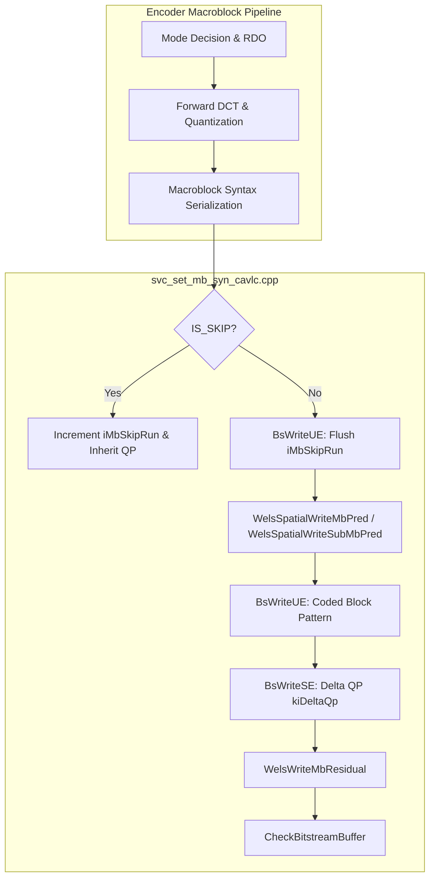
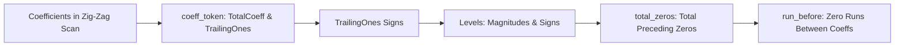
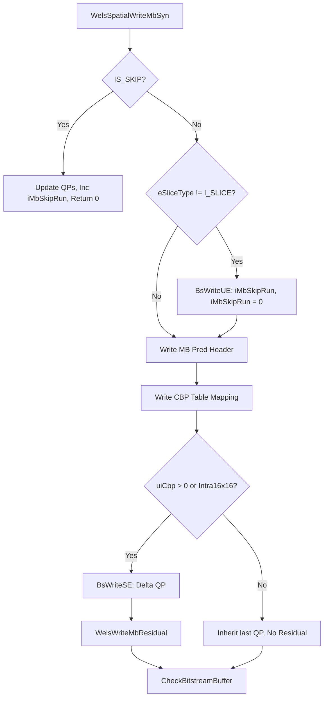
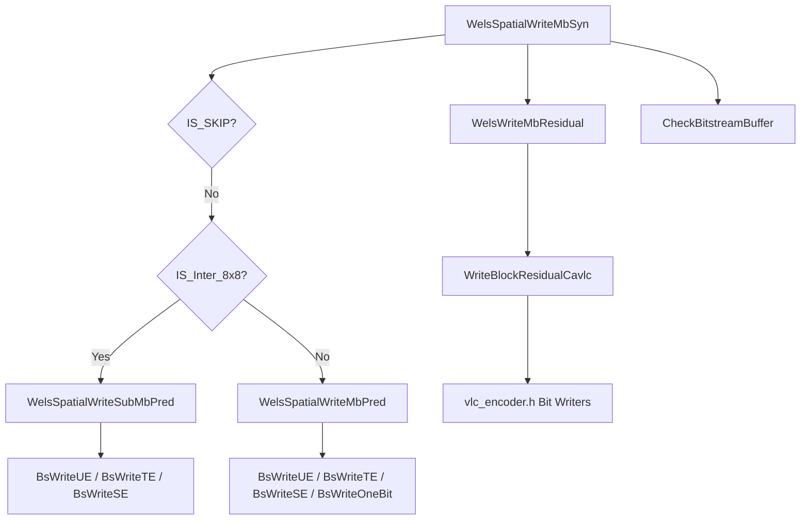

# OpenH264 Core Encoder: CAVLC Macroblock Syntax Serialization (`svc_set_mb_syn_cavlc.cpp`)

This document provides an exhaustive, literate-programming-style technical breakdown of [`codec/encoder/core/src/svc_set_mb_syn_cavlc.cpp`](openh264/codec/encoder/core/src/svc_set_mb_syn_cavlc.cpp). This file is the primary Context-Adaptive Variable-Length Coding (CAVLC) bitstream serializer for macroblock syntax elements and quantized transform coefficient residuals in the OpenH264 encoder core.

---

## Table of Contents
1. [Module Overview & Architectural Role](#1-module-overview--architectural-role)
2. [Data Structures, Lookup Tables & Constants](#2-data-structures-lookup-tables--constants)
   - [2.1 Lookup Tables: Coded Block Pattern Mapping](#21-lookup-tables-coded-block-pattern-mapping)
   - [2.2 Related Macroblock & Slice Structures](#22-related-macroblock--slice-structures)
3. [Mathematical & Algorithmic Foundations](#3-mathematical--algorithmic-foundations)
   - [3.1 CAVLC Residual Coefficient Encoding Flow](#31-cavlc-residual-coefficient-encoding-flow)
   - [3.2 Neighboring Non-Zero Coefficient Prediction ($nC$)](#32-neighboring-non-zero-coefficient-prediction-nc)
4. [Deep-Dive Function Implementations](#4-deep-dive-function-implementations)
   - [4.1 `WelsSpatialWriteMbPred`](#41-welsspatialwritembpred)
   - [4.2 `WelsSpatialWriteSubMbPred`](#42-welsspatialwritesubmbpred)
   - [4.3 `CheckBitstreamBuffer`](#43-checkbitstreambuffer)
   - [4.4 `WelsSpatialWriteMbSyn`](#44-welsspatialwritembsyn)
   - [4.5 `WelsWriteMbResidual`](#45-welswritembresidual)
5. [Call Graph & Execution Flow](#5-call-graph--execution-flow)

---

## 1. Module Overview & Architectural Role

Within the OpenH264 encoding pipeline, [`svc_set_mb_syn_cavlc.cpp`](openh264/codec/encoder/core/src/svc_set_mb_syn_cavlc.cpp) fulfills the entropy encoding stage for macroblocks when CAVLC entropy mode is enabled (`bEntropyCodingModeFlag == false`).



### Key Responsibilities:
1. **Macroblock Header Serialization**: Encodes macroblock types (`mb_type`), sub-macroblock types (`sub_mb_type`), intra prediction modes (luma 4x4 flags/modes, luma 16x16, chroma 8x8), reference picture indices (`ref_idx_l0`), and motion vector differences (`mvd_l0`).
2. **Coded Block Pattern (CBP) Translation**: Maps internal 6-bit CBP bitmasks (`uiCbp`) to H.264 standard CAVLC code numbers using dedicated lookup tables.
3. **Quantization Parameter Delta Encoding**: Calculates and writes the signed slice QP delta ($\Delta QP = QP_{\text{cur}} - QP_{\text{prev}}$).
4. **Transform Residual Serialization**: Orchestrates coefficient serialization for all block categories (Luma DC, Luma AC, Luma 4x4, Chroma DC, and Chroma AC) using context-dependent non-zero coefficient prediction ($nC$).
5. **Bitstream Overflow Protection**: Proactively checks the destination bitstream buffer (`SBitStringAux`) against maximum macroblock expansion thresholds to avoid buffer overruns.

---

## 2. Data Structures, Lookup Tables & Constants

### 2.1 Lookup Tables: Coded Block Pattern Mapping

The H.264 / AVC standard (Table 9-4 in ITU-T H.264) defines different mappings between the macroblock coded block pattern ($CBP$) and the transmitted Exp-Golomb code number depending on whether the macroblock is Intra 4x4 or Inter/Intra 16x16.

The 6-bit internal CBP integer is formatted as:
$$\text{uiCbp} = (\text{CBP}_{\text{chroma}} \ll 4) \mid \text{CBP}_{\text{luma}}$$
where $\text{CBP}_{\text{chroma}} \in \{0, 1, 2\}$ and $\text{CBP}_{\text{luma}} \in [0, 15]$, giving 48 valid indices ($0 \dots 47$).

#### [g_kuiIntra4x4CbpMap](openh264/codec/encoder/core/src/svc_set_mb_syn_cavlc.cpp#L46-L50)
Mapping table for `MB_TYPE_INTRA4x4` macroblocks:
```cpp
const uint32_t g_kuiIntra4x4CbpMap[48] = {
  3, 29, 30, 17, 31, 18, 37,  8, 32, 38, 19,  9, 20, 10, 11, 2, // 0..15  (Chroma CBP = 0)
  16, 33, 34, 21, 35, 22, 39,  4, 36, 40, 23,  5, 24,  6,  7, 1, // 16..31 (Chroma CBP = 1)
  41, 42, 43, 25, 44, 26, 46, 12, 45, 47, 27, 13, 28, 14, 15, 0  // 32..47 (Chroma CBP = 2)
};
```

#### [g_kuiInterCbpMap](openh264/codec/encoder/core/src/svc_set_mb_syn_cavlc.cpp#L52-L56)
Mapping table for Inter (`MB_TYPE_16x16`, `MB_TYPE_16x8`, `MB_TYPE_8x16`, `MB_TYPE_8x8`) macroblocks:
```cpp
const uint32_t g_kuiInterCbpMap[48] = {
  0,  2,  3,  7,  4,  8, 17, 13,  5, 18,  9, 14, 10, 15, 16, 11, // 0..15  (Chroma CBP = 0)
  1, 32, 33, 36, 34, 37, 44, 40, 35, 45, 38, 41, 39, 42, 43, 19, // 16..31 (Chroma CBP = 1)
  6, 24, 25, 20, 26, 21, 46, 28, 27, 47, 22, 29, 23, 30, 31, 12  // 32..47 (Chroma CBP = 2)
};
```

---

### 2.2 Related Macroblock & Slice Structures

The functions in this module interact directly with core OpenH264 data structures:

| Structure | Location | Key Fields Used | Description |
| :--- | :--- | :--- | :--- |
| [`sWelsEncCtx`](openh264/codec/encoder/core/inc/encoder_context.h#L116-L238) | [`encoder_context.h`](openh264/codec/encoder/core/inc/encoder_context.h) | `pFuncList`, `pCurDqLayer`, `eSliceType` | Master encoder context. |
| [`SSlice`](openh264/codec/encoder/core/inc/slice.h#L162-L210) | [`slice.h`](openh264/codec/encoder/core/inc/slice.h) | `pSliceBsa`, `sMbCacheInfo`, `sSliceHeaderExt`, `iMbSkipRun`, `uiLastMbQp` | Slice encoding instance state. |
| [`SMB`](openh264/codec/encoder/core/inc/mb_cache.h) | [`mb_cache.h`](openh264/codec/encoder/core/inc/mb_cache.h) | `uiMbType`, `uiCbp`, `uiLumaQp`, `uiChromaQp`, `sMv`, `pRefIndex`, `uiSubMbType` | Current macroblock metadata and decisions. |
| [`SMbCache`](openh264/codec/encoder/core/inc/mb_cache.h#L72-L137) | [`mb_cache.h`](openh264/codec/encoder/core/inc/mb_cache.h) | `iNonZeroCoeffCount`, `sMbMvp`, `pPrevIntra4x4PredModeFlag`, `pRemIntra4x4PredModeFlag`, `pDct` | Working cache for neighbor statistics, predictors, and transform coefficients. |
| [`SBitStringAux`](openh264/codec/encoder/core/inc/bit_stream.h) | [`bit_stream.h`](openh264/codec/encoder/core/inc/bit_stream.h) | `pCurBuf`, `pEndBuf`, `uiCurBits`, `iLeftBits` | Bitstream output accumulator. |

---

## 3. Mathematical & Algorithmic Foundations

### 3.1 CAVLC Residual Coefficient Encoding Flow

For each residual block (4x4 luma, AC/DC, or chroma), CAVLC serializes transform coefficients into 5 successive syntax elements:
1. `coeff_token`: Encodes the pair `(TotalCoeff, TrailingOnes)` using a VLC table selected by the predicted non-zero count $nC$.
2. `trailing_ones_sign_flag`: 1 bit per trailing $\pm 1$ coefficient ($0 = +1, 1 = -1$).
3. `level`: Encodes the magnitude and sign of the remaining non-zero coefficients.
4. `total_zeros`: Total number of zeros preceding the highest-frequency non-zero coefficient.
5. `run_before`: Run of zeros preceding each non-zero coefficient.



### 3.2 Neighboring Non-Zero Coefficient Prediction ($nC$)

The choice of CAVLC table for `coeff_token` is indexed by $nC$, the predicted number of non-zero coefficients derived from left neighbor block $A$ and upper neighbor block $B$:

$$nC = \begin{cases} 
\lfloor \frac{nA + nB + 1}{2} \rfloor & \text{if } nA \ge 0 \text{ and } nB \ge 0 \\
nA & \text{if } nA \ge 0 \text{ and } nB < 0 \\
nB & \text{if } nA < 0 \text{ and } nB \ge 0 \\
0 & \text{if } nA < 0 \text{ and } nB < 0 
\end{cases}$$

In OpenH264, unavailable neighbor blocks are flagged with $-1$. The macro [`WELS_NON_ZERO_COUNT_AVERAGE`](openh264/codec/common/inc/macros.h#L135-L139) computes $nC$ branchlessly:

```cpp
#define WELS_NON_ZERO_COUNT_AVERAGE(nC, nA, nB) {         \
  nC = nA + nB + 1;                                     \
  nC >>= (uint8_t)( nA != -1 && nB != -1);              \
  nC += (uint8_t)(nA == -1 && nB == -1);                \
}
```

---

## 4. Deep-Dive Function Implementations

### 4.1 `WelsSpatialWriteMbPred`

```cpp
void WelsSpatialWriteMbPred (sWelsEncCtx* pEncCtx, SSlice* pSlice, SMB* pCurMb);
```
[File Location: `svc_set_mb_syn_cavlc.cpp:L59-L169`](openh264/codec/encoder/core/src/svc_set_mb_syn_cavlc.cpp#L59-L169)

#### Purpose
Encodes the macroblock prediction header syntax elements (macroblock type, intra prediction mode flags, reference indices, and motion vector differences) for non-8x8 partitioned macroblocks.

#### Parameters
* `sWelsEncCtx* pEncCtx`: Pointer to top-level encoder context.
* `SSlice* pSlice`: Pointer to current slice containing bitstream writer `pBs = pSlice->pSliceBsa`.
* `SMB* pCurMb`: Pointer to current macroblock.

#### Implementation Breakdown by `uiMbType`

1. **Slice Offset Determination**:
   ```cpp
   switch (pSliceHeadExt->sSliceHeader.eSliceType) {
   case I_SLICE: iMbOffset = 0; break;
   case P_SLICE: iMbOffset = 5; break;
   default: return;
   }
   ```
   In P-slices, Intra macroblock type code numbers are offset by +5 (H.264 standard Table 7-11).

2. **`MB_TYPE_INTRA4x4`**:
   * Writes MB type code: `BsWriteUE(pBs, iMbOffset + 0)`.
   * For each of the 16 4x4 luma blocks:
     * Reads `pPredFlag = pMbCache->pPrevIntra4x4PredModeFlag[i]`.
     * Writes 1 bit: `BsWriteOneBit(pBs, *pPredFlag)`.
     * If `*pPredFlag == 0`: writes the 3-bit mode remainder `BsWriteBits(pBs, 3, *pRemMode)`.
   * Writes Chroma Intra mode: `BsWriteUE(pBs, g_kiMapModeIntraChroma[pMbCache->uiChmaI8x8Mode])`.

3. **`MB_TYPE_INTRA16x16`**:
   * Encodes combined MB type + Chroma CBP + Luma CBP flag into a single Exp-Golomb symbol:
     $$\text{code} = 1 + iMbOffset + \text{g\_kiMapModeI16x16}[\text{uiLumaI16x16Mode}] + (iCbpChroma \ll 2) + (iCbpLuma == 0 ? 0 : 12)$$
   * Writes Chroma Intra mode: `BsWriteUE(pBs, g_kiMapModeIntraChroma[pMbCache->uiChmaI8x8Mode])`.

4. **`MB_TYPE_16x16` (P_L0_16x16)**:
   * Writes MB type: `BsWriteUE(pBs, 0)`.
   * Computes MVD: $\text{MVD}_0 = \text{MV}_0 - \text{MVP}_0$ via `sMvd[0].sDeltaMv(pCurMb->sMv[0], pMbCache->sMbMvp[0])`.
   * If `iNumRefIdxl0ActiveMinus1 > 0`: writes reference index with Truncated Exp-Golomb (`BsWriteTE`).
   * Writes signed $\text{MVD}_x$ and $\text{MVD}_y$ with Signed Exp-Golomb (`BsWriteSE`).

5. **`MB_TYPE_16x8` & `MB_TYPE_8x16`**:
   * Writes MB type code (`1` for 16x8, `2` for 8x16).
   * Computes MVDs for both partition halves.
   * If `iNumRefIdxl0ActiveMinus1 > 0`: writes reference indices for partition 0 and partition 1.
   * Writes signed $(\text{MVD}_x, \text{MVD}_y)$ for both partitions.

---

### 4.2 `WelsSpatialWriteSubMbPred`

```cpp
void WelsSpatialWriteSubMbPred (sWelsEncCtx* pEncCtx, SSlice* pSlice, SMB* pCurMb);
```
[File Location: `svc_set_mb_syn_cavlc.cpp:L171-L246`](openh264/codec/encoder/core/src/svc_set_mb_syn_cavlc.cpp#L171-L246)

#### Purpose
Encodes sub-macroblock prediction syntax for 8x8 partitioned macroblocks (`MB_TYPE_8x8` / `P_8x8`).

#### Key Algorithmic Steps

1. **Fast Reference Index Detection**:
   ```cpp
   if (LD32(pCurMb->pRefIndex) == 0) {
     BsWriteUE(pBs, 4); // P_8x8ref0: all 4 sub-MBs use ref_idx 0
     bSubRef0 = false;
   } else {
     BsWriteUE(pBs, 3); // P_8x8: explicit reference indices transmitted
     bSubRef0 = true;
   }
   ```
   Uses a 32-bit integer load `LD32` to test all 4 8-bit reference index bytes simultaneously in a single instruction.

2. **Sub-MB Types**:
   Iterates over each 8x8 partition ($i = 0 \dots 3$) and serializes `sub_mb_type`:
   * `SUB_MB_TYPE_8x8` $\to 0$
   * `SUB_MB_TYPE_8x4` $\to 1$
   * `SUB_MB_TYPE_4x8` $\to 2$
   * `SUB_MB_TYPE_4x4` $\to 3$

3. **Sub-MB Reference Indices**:
   If `bSubRef0 == true` and `iNumRefIdxl0ActiveMinus1 > 0`, writes `ref_idx_l0` for all 4 8x8 sub-macroblocks via `BsWriteTE`.

4. **Sub-MB Motion Vector Differences (MVD)**:
   Scans each sub-partition using the scan index table `g_kuiMbCountScan4Idx`:
   * `SUB_MB_TYPE_8x8`: 1 motion vector difference.
   * `SUB_MB_TYPE_8x4`: 2 motion vector differences (top 8x4, bottom 8x4).
   * `SUB_MB_TYPE_4x8`: 2 motion vector differences (left 4x8, right 4x8).
   * `SUB_MB_TYPE_4x4`: 4 motion vector differences (four 4x4 sub-blocks).

---

### 4.3 `CheckBitstreamBuffer`

```cpp
int32_t CheckBitstreamBuffer (const uint32_t kuiSliceIdx, sWelsEncCtx* pEncCtx, SBitStringAux* pBs);
```
[File Location: `svc_set_mb_syn_cavlc.cpp:L248-L257`](openh264/codec/encoder/core/src/svc_set_mb_syn_cavlc.cpp#L248-L257)

#### Purpose
Ensures that the output bitstream buffer has sufficient space remaining to accommodate the worst-case size expansion of the next macroblock.

```cpp
const intX_t iLeftLength = pBs->pEndBuf - pBs->pCurBuf - 1;
assert (iLeftLength > 0);

if (iLeftLength < MAX_MACROBLOCK_SIZE_IN_BYTE_x2) {
  return ENC_RETURN_VLCOVERFLOWFOUND;
}
return ENC_RETURN_SUCCESS;
```

* **Return Values**:
  * `ENC_RETURN_SUCCESS` (`0`): Buffer capacity is safe.
  * `ENC_RETURN_VLCOVERFLOWFOUND`: Buffer overflow imminent; triggers bitstream slice buffer reallocation or slice finalization.

---

### 4.4 `WelsSpatialWriteMbSyn`

```cpp
int32_t WelsSpatialWriteMbSyn (sWelsEncCtx* pEncCtx, SSlice* pSlice, SMB* pCurMb);
```
[File Location: `svc_set_mb_syn_cavlc.cpp:L260-L307`](openh264/codec/encoder/core/src/svc_set_mb_syn_cavlc.cpp#L260-L307)

#### Purpose
Top-level entry point for encoding a macroblock's CAVLC syntax elements into the slice bitstream.



#### Detailed Execution Sequence:
1. **SKIP Macroblock Handling**:
   * If `IS_SKIP(pCurMb->uiMbType)`:
     * Sets `pCurMb->uiLumaQp = pSlice->uiLastMbQp`.
     * Calculates chroma QP: `pCurMb->uiChromaQp = g_kuiChromaQpTable[CLIP3_QP_0_51(pCurMb->uiLumaQp + kuiChromaQpIndexOffset)]`.
     * Increments `pSlice->iMbSkipRun++`.
     * Returns `ENC_RETURN_SUCCESS`.
2. **Skip-Run Flush**:
   * In non-I slices (`pEncCtx->eSliceType != I_SLICE`), flushes accumulated skip runs via `BsWriteUE(pBs, pSlice->iMbSkipRun)` and resets `pSlice->iMbSkipRun = 0`.
3. **Prediction Header**:
   * Invokes `WelsSpatialWriteSubMbPred` for `IS_Inter_8x8`, or `WelsSpatialWriteMbPred` otherwise.
4. **Coded Block Pattern (CBP)**:
   * Writes `g_kuiIntra4x4CbpMap[pCurMb->uiCbp]` for Intra 4x4.
   * Writes `g_kuiInterCbpMap[pCurMb->uiCbp]` for Inter modes.
   * (For Intra 16x16, CBP is already embedded in the MB type code).
5. **Delta QP & Residual**:
   * If `uiCbp > 0` or Intra 16x16:
     * Computes $\Delta QP = QP_{\text{luma}} - QP_{\text{last\_mb}}$.
     * Writes `BsWriteSE(pBs, kiDeltaQp)`.
     * Calls [`WelsWriteMbResidual`](#45-welswritembresidual).
   * Else: updates chroma QP and skips residual writing.
6. **Buffer Safety Check**:
   * Returns result of `CheckBitstreamBuffer`.

---

### 4.5 `WelsWriteMbResidual`

```cpp
int32_t WelsWriteMbResidual (SWelsFuncPtrList* pFuncList, SMbCache* sMbCacheInfo, SMB* pCurMb, SBitStringAux* pBs);
```
[File Location: `svc_set_mb_syn_cavlc.cpp:L309-L420`](openh264/codec/encoder/core/src/svc_set_mb_syn_cavlc.cpp#L309-L420)

#### Purpose
Iterates through all transformed and quantized coefficient blocks of the macroblock and serializes them to the CAVLC bitstream via `WriteBlockResidualCavlc`.

#### Detailed Processing Steps

#### A. Intra 16x16 Mode (`IS_INTRA16x16`)
1. **Luma DC Block (4x4 Hadamard Transform Coefficients)**:
   * Derives neighbor counts: left $iA = \text{iNonZeroCoeffCount}[8]$, top $iB = \text{iNonZeroCoeffCount}[1]$.
   * Computes average $iC = \text{WELS\_NON\_ZERO\_COUNT\_AVERAGE}(iC, iA, iB)$.
   * Serializes the 16 DC coefficients:
     ```cpp
     WriteBlockResidualCavlc(pFuncList, sMbCacheInfo->pDct->iLumaI16x16Dc, 15, 1, LUMA_4x4, iC, pBs);
     ```
2. **Luma AC Blocks (15 AC Coefficients per 4x4 Block)**:
   * If `kiCbpLuma != 0`:
     * For each of the 16 4x4 blocks ($i = 0 \dots 15$):
       * `iIdx = g_kuiCache48CountScan4Idx[i]`.
       * $iA = \text{iNonZeroCoeffCount}[iIdx - 1]$, $iB = \text{iNonZeroCoeffCount}[iIdx - 8]$.
       * Calculates $iC = \text{WELS\_NON\_ZERO\_COUNT\_AVERAGE}(iC, iA, iB)$.
       * Writes 15 AC coefficients (`iEndIdx = 14`, category `LUMA_AC`).

#### B. Other Modes (Intra 4x4, Inter 16x16, Inter 8x8)
If `kiCbpLuma != 0`, loops over the four 8x8 luma blocks ($i = 0, 4, 8, 12$):
* If the 8x8 partition bit is set (`kiCbpLuma & (1 << (i >> 2))`):
  * Sequentially encodes 4 constituent 4x4 blocks with intra-macroblock spatial context propagation:
    * **Block 0**: Left $iA = \text{iNonZeroCoeffCount}[iIdx - 1]$, Top $iB = \text{iNonZeroCoeffCount}[iIdx - 8]$.
    * **Block 1**: Left $iA = \text{Block 0 Non-Zero Count}$, Top $iB = \text{iNonZeroCoeffCount}[iIdx - 7]$.
    * **Block 2**: Left $iA = \text{iNonZeroCoeffCount}[iIdx + 7]$, Top $iB = \text{Block 0 Non-Zero Count}$.
    * **Block 3**: Left $iA = \text{Block 2 Non-Zero Count}$, Top $iB = \text{Block 1 Non-Zero Count}$.

#### C. Chroma Residual (`kiCbpChroma != 0`)
1. **Chroma DC Blocks (2x2 Hadamard Transform Coefficients)**:
   * Encodes Cb DC ($2 \times 2$, 4 coefficients):
     ```cpp
     WriteBlockResidualCavlc(pFuncList, sMbCacheInfo->pDct->iChromaDc[0], 3, 1, CHROMA_DC, CHROMA_DC_NC_OFFSET, pBs);
     ```
   * Encodes Cr DC ($2 \times 2$, 4 coefficients):
     ```cpp
     WriteBlockResidualCavlc(pFuncList, sMbCacheInfo->pDct->iChromaDc[1], 3, 1, CHROMA_DC, CHROMA_DC_NC_OFFSET, pBs);
     ```
   * Uses constant `CHROMA_DC_NC_OFFSET = 17` to select the specialized Chroma DC VLC table.

2. **Chroma AC Blocks (15 AC Coefficients per 4x4 Block)**:
   * If `kiCbpChroma & 0x02`:
     * Serializes 4 Cb AC blocks using 48-count cache indices: `kCache48CountScan4Idx16base[i]`.
     * Serializes 4 Cr AC blocks using 48-count cache indices: `24 + kCache48CountScan4Idx16base[i]`.

---

## 5. Call Graph & Execution Flow


