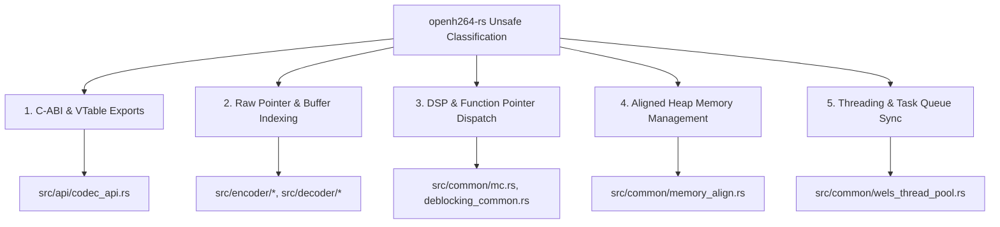

# Unsafe Code Analysis & Classification in openh264-rs

This document details the audit and classification of all `unsafe` functions and `unsafe` blocks within `openh264-rs`.

---

## Quantitative Summary

| Scope | Category | Count | Primary Purpose |
| :--- | :--- | :--- | :--- |
| **`src/`** | `unsafe fn` | **1,178** | Core codec processing, C-ABI exports, DSP kernels, raw memory indexing |
| **`src/`** | `unsafe` blocks | **512** | Raw pointer dereferences, SIMD dispatch, unaligned reads/writes |
| **`tests/`** | `unsafe fn` | **0** | Integration tests are standard safe Rust entry points |
| **`tests/`** | `unsafe` blocks | **22** | Invoking C-ABI vtable methods (`DecodeFrame2`, `WelsCreateDecoder`) |

---

## Classification of Unsafe Usage

### 1. C-ABI & VTable Export Boundary (`src/api/codec_api.rs`)
* **Count**: 43 `unsafe fn`, 29 `unsafe` blocks
* **Description**: Exports C-compatible vtables (`ISVCEncoderVtbl`, `ISVCDecoderVtbl`) and functions (`WelsCreateSVCEncoder`, `WelsCreateDecoder`, `WelsDestroyDecoder`, `WelsGetDecoderCapability`).
* **Why Unsafe**: Direct interaction with raw C caller pointers, uninitialized memory, and function pointer vtable dereferences (`((*self.lpVtbl).DecodeFrame2)(...)`).

### 2. Raw Pointer Arithmetic & Macroblock Pixel Buffers (`src/encoder/`, `src/decoder/`)
* **Count**: ~850 `unsafe fn`, ~380 `unsafe` blocks
* **Top Files**:
  * `encoder/encode_mb_aux.rs` (102 `unsafe fn`)
  * `decoder/decoder_core.rs` (85 `unsafe fn`)
  * `encoder/svc_encode_slice.rs` (67 `unsafe fn`)
  * `encoder/ref_list_mgr_svc.rs` (56 `unsafe fn`)
  * `encoder/wels_preprocess.rs` (52 `unsafe fn`)
  * `encoder/rc.rs` (51 `unsafe fn`)
  * `decoder/get_intra_predictor.rs` (42 `unsafe fn`)
  * `decoder/parse_mb_syn_cabac.rs` (42 `unsafe fn`)
  * `encoder/deblocking.rs` (41 `unsafe fn`)
* **Description**: Performs high-performance, stride-aware pixel buffer manipulation across $4 \times 4$, $8 \times 8$, and $16 \times 16$ macroblock boundaries.
* **Why Unsafe**: Uses raw pointer offsets (`ptr.add()`, `ptr.offset()`), unaligned 32-bit reads/writes (`LD32`, `ST32`), and slice construction from raw pointers (`std::slice::from_raw_parts`) to eliminate bounds-checking overhead in hot video processing loops.

### 3. Micro-Optimized DSP & Function Pointer Dispatch (`src/common/`)
* **Count**: ~220 `unsafe fn`, ~80 `unsafe` blocks
* **Modules**: `common/mc.rs`, `common/deblocking_common.rs`, `common/intra_pred_common.rs`, `common/sad_common.rs`
* **Description**: Dispatches intra-prediction, motion compensation, deblocking filter, and SAD/SATD calculation kernels stored as function pointers inside context structs (`SMcFunc`, `SDeblockingFunc`).
* **Why Unsafe**: Function pointers in Rust context structs (`Option<PExpandPictureFunc>`) require `unsafe` when called through raw pointers.

### 4. Aligned Heap Memory Management (`src/common/memory_align.rs`)
* **Count**: 6 `unsafe fn`, 12 `unsafe` blocks
* **Description**: `CMemoryAlign::WelsMalloc` and `CMemoryAlign::WelsFree`.
* **Why Unsafe**: Manages custom 16-byte and 32-byte SIMD alignment constraints, raw OS heap allocations, and pointer offset arithmetic.

### 5. Multithreading & Concurrent Task Execution (`src/common/wels_thread_pool.rs`, `src/encoder/wels_task_management.rs`)
* **Count**: 28 `unsafe fn`, 11 `unsafe` blocks
* **Description**: Concurrent slice processing and thread pool task management.
* **Why Unsafe**: Passes raw slice context pointers (`*mut sWelsEncCtx`, `*mut SSlice`) across thread boundaries and uses atomic pointer synchronizations.

---

## Detailed File-by-File Unsafe Function Counts

| File Path | Unsafe Functions |
| :--- | :--- |
| `src/encoder/encode_mb_aux.rs` | 102 |
| `src/decoder/decoder_core.rs` | 85 |
| `src/encoder/svc_encode_slice.rs` | 67 |
| `src/encoder/ref_list_mgr_svc.rs` | 56 |
| `src/encoder/wels_preprocess.rs` | 52 |
| `src/encoder/rc.rs` | 51 |
| `src/api/codec_api.rs` | 43 |
| `src/decoder/get_intra_predictor.rs` | 42 |
| `src/decoder/parse_mb_syn_cabac.rs` | 42 |
| `src/encoder/deblocking.rs` | 41 |
| `src/encoder/svc_motion_estimate.rs` | 39 |
| `src/decoder/decode_slice.rs` | 34 |
| `src/decoder/deblocking.rs` | 33 |
| `src/encoder/svc_mode_decision.rs` | 28 |
| `src/encoder/wels_encoder_ext.rs` | 28 |
| `src/decoder/mv_pred.rs` | 28 |
| `src/common/mc.rs` | 27 |
| `src/encoder/svc_set_mb_syn_cabac.rs` | 27 |
| `src/encoder/wels_task_management.rs` | 26 |
| `src/decoder/nalu.rs` | 25 |
| `src/decoder/manage_dec_ref.rs` | 24 |
| `src/decoder/error_concealment.rs` | 22 |
| `src/common/deblocking_common.rs` | 20 |
| `src/decoder/parse_mb_syn_cavlc.rs` | 20 |
| `src/encoder/vlc_encoder.rs` | 19 |
| `src/common/intra_pred_common.rs` | 18 |
| `src/encoder/md.rs` | 17 |
| `src/encoder/encoder_context.rs` | 15 |
| `src/encoder/set_mb_syn_cabac.rs` | 14 |
| `src/common/sad_common.rs` | 14 |
| `src/encoder/slice_multi_threading.rs` | 13 |
| `src/decoder/decode_mb_aux.rs` | 13 |
| `src/encoder/svc_set_mb_syn_cavlc.rs` | 12 |
| `src/decoder/pic_queue.rs` | 12 |
| `src/decoder/cabac_decoder.rs` | 12 |
| `src/encoder/svc_encode_mb.rs` | 11 |
| `src/encoder/nal_encap.rs` | 11 |
| `src/decoder/fmo.rs` | 11 |
| `src/decoder/dec_golomb.rs` | 8 |
| `src/common/memory_align.rs` | 6 |
| `src/decoder/bit_stream.rs` | 4 |
| `src/encoder/param_svc.rs` | 2 |
| `src/common/wels_thread_pool.rs` | 2 |
| `src/decoder/picture.rs` | 2 |
