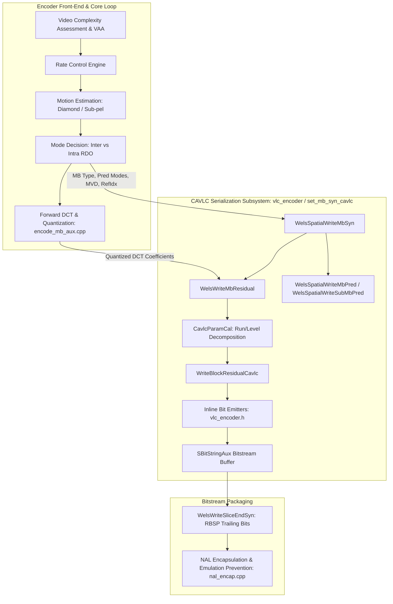
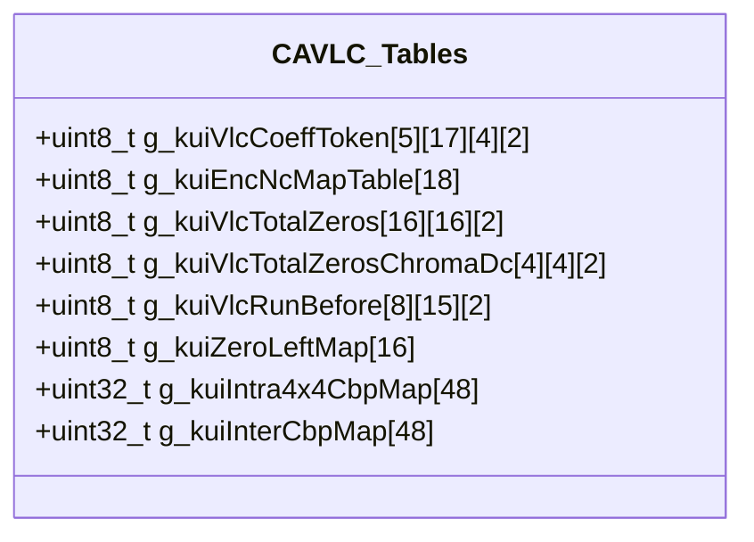
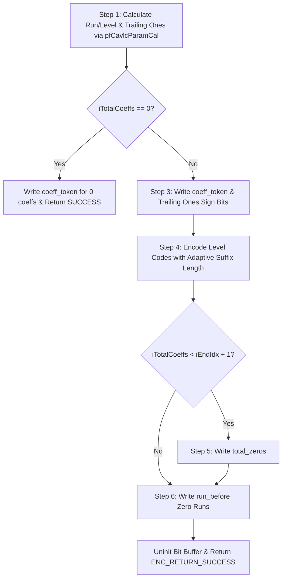
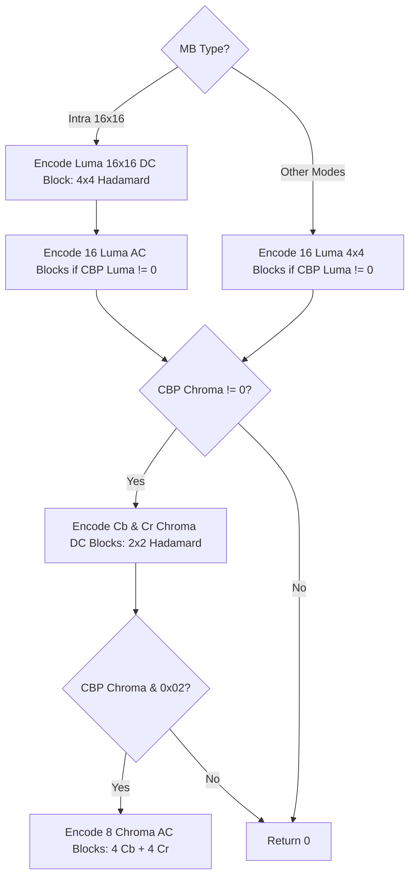
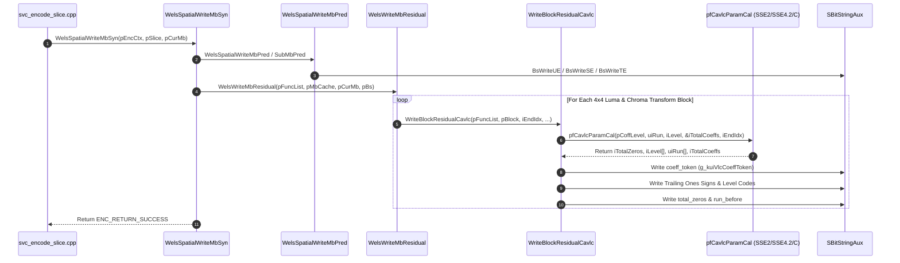

# OpenH264 Encoder: CAVLC Entropy Encoding Engine (`vlc_encoder.cpp`)

This document provides a comprehensive, literate-programming-style technical analysis of the **CAVLC (Context-Adaptive Variable-Length Coding)** bitstream entropy encoding subsystem in OpenH264. It covers the core implementation files [codec/encoder/core/src/set_mb_syn_cavlc.cpp](openh264/codec/encoder/core/src/set_mb_syn_cavlc.cpp), [codec/encoder/core/src/svc_set_mb_syn_cavlc.cpp](openh264/codec/encoder/core/src/svc_set_mb_syn_cavlc.cpp), their header interfaces [codec/encoder/core/inc/vlc_encoder.h](openh264/codec/encoder/core/inc/vlc_encoder.h), [codec/encoder/core/inc/set_mb_syn_cavlc.h](openh264/codec/encoder/core/inc/set_mb_syn_cavlc.h), [codec/encoder/core/inc/svc_set_mb_syn_cavlc.h](openh264/codec/encoder/core/inc/svc_set_mb_syn_cavlc.h), and the VLC codebook tables defined in [codec/encoder/core/src/encoder_data_tables.cpp](openh264/codec/encoder/core/src/encoder_data_tables.cpp).

---

## Table of Contents
1. [Module Architecture & Pipeline Role](#1-module-architecture--pipeline-role)
2. [Data Structures, Enums, Macros, and Codebook Tables](#2-data-structures-enums-macros-and-codebook-tables)
   - [2.1 Enumerations & Data Structures](#21-enumerations--data-structures)
   - [2.2 Bitstream Buffer Control Macros](#22-bitstream-buffer-control-macros)
   - [2.3 Codebook Tables & Lookups](#23-codebook-tables--lookups)
3. [Deep-Dive Function Analysis](#3-deep-dive-function-analysis)
   - [3.1 Inline CAVLC Bit Emitters (`vlc_encoder.h`)](#31-inline-cavlc-bit-emitters-vlc_encoderh)
     - [`WriteTotalCoeffTrailingones`](#writetotalcoefftrailingones)
     - [`WriteTotalcoeffTrailingonesChroma`](#writetotalcoefftrailingoneschroma)
     - [`WriteLevelPrefix`](#writelevelprefix)
     - [`WriteTotalZeros` & `WriteTotalZerosChromaDc`](#writetotalzeros--writetotalzeroschromadc)
     - [`WriteRunBefore`](#writerunbefore)
   - [3.2 Transform Coefficient Parameter Extraction & Assembly Kernels](#32-transform-coefficient-parameter-extraction--assembly-kernels)
     - [`CavlcParamCal_c`](#cavlcparamcal_c)
     - [SIMD Vectorization (`CavlcParamCal_sse2` & `CavlcParamCal_sse42`)](#simd-vectorization-cavlcparamcal_sse2--cavlcparamcal_sse42)
   - [3.3 4x4 Block Residual CAVLC Serialization](#33-4x4-block-residual-cavlc-serialization)
     - [`WriteBlockResidualCavlc`](#writeblockresidualcavlc)
   - [3.4 Macroblock Syntax & Residual Serialization Pipeline](#34-macroblock-syntax--residual-serialization-pipeline)
     - [`WelsSpatialWriteMbSyn`](#welsspatialwritembsyn)
     - [`WelsSpatialWriteMbPred`](#welsspatialwritembpred)
     - [`WelsSpatialWriteSubMbPred`](#welsspatialwritesubmbpred)
     - [`WelsWriteMbResidual`](#welswritembresidual)
     - [`CheckBitstreamBuffer`](#checkbitstreambuffer)
   - [3.5 Slice State Stashing & Function Pointer Dispatch](#35-slice-state-stashing--function-pointer-dispatch)
     - [`StashMBStatusCavlc` / `StashPopMBStatusCavlc`](#stashmbstatuscavlc--stashpopmbstatuscavlc)
     - [`StashMBStatusCabac` / `StashPopMBStatusCabac`](#stashmbstatuscabac--stashpopmbstatuscabac)
     - [`GetBsPosCavlc` / `GetBsPosCabac`](#getbsposcavlc--getbsposcabac)
     - [`WelsWriteSliceEndSyn`](#welswritesliceendsyn)
     - [`InitCoeffFunc`](#initcoefffunc)
4. [Call Graph & Data Flow](#4-call-graph--data-flow)

---

## 1. Module Architecture & Pipeline Role

In the H.264 / AVC video encoding pipeline, entropy coding is the final lossless compression stage that converts macroblock headers, prediction modes, motion vector differences ($MVD$), and quantized DCT transform coefficients into a compliant Annex-B bitstream.

OpenH264 implements both H.264 entropy coding modes:
- **CAVLC (Context-Adaptive Variable-Length Coding)**: The primary entropy coder for Baseline and Constrained Baseline Profiles (ITU-T H.264 Section 9.2). It leverages the spatial correlation of transform coefficients across neighboring blocks to dynamically switch variable-length codebooks.
- **CABAC (Context-Based Adaptive Binary Arithmetic Coding)**: Used for Main/High Profiles.



### Key Responsibilities
1. **Syntax Serialization**: Encodes slice-level skip runs, macroblock types, intra prediction modes, chroma prediction modes, motion vector differences ($MVD = MV - MVP$), reference picture indices, and Coded Block Patterns ($CBP$).
2. **Coefficient Token Decomposition**: Parses 4x4 block quantized residuals in reverse zigzag order, isolating non-zero levels, zero runs, total non-zero coefficients ($TotalCoeff$), and trailing $\pm 1$ coefficients ($TrailingOnes$).
3. **Adaptive Codebook Switching**: Selects variable-length codebooks for `coeff_token` based on the predicted non-zero coefficient count ($nC$) of spatially adjacent blocks (Left $A$ and Top $B$):
   $$nC = \begin{cases} \lfloor \frac{nA + nB + 1}{2} \rfloor & \text{if both } A \text{ and } B \text{ are available} \\ nA \text{ or } nB & \text{if only one neighbor is available} \\ 0 & \text{if neither neighbor is available} \end{cases}$$
4. **Dynamic Slicing Support**: Supports checkpointing (`StashMBStatusCavlc`) and rollback (`StashPopMBStatusCavlc`) of the bitstream write pointer to enforce MTU packet size limits (`SM_SIZELIMITED_SLICE`).

---

## 2. Data Structures, Enums, Macros, and Codebook Tables

### 2.1 Enumerations & Data Structures

#### `ECtxBlockCat`
Defined in [codec/encoder/core/inc/set_mb_syn_cavlc.h](openh264/codec/encoder/core/inc/set_mb_syn_cavlc.h#L50-L56), this enumeration categorizes the residual transform block types to govern the scanning range, maximum coefficient counts, and codebook selection:

```cpp
enum ECtxBlockCat {
  LUMA_DC     = 0,  // 4x4 Hadamard transform DC coefficients of Intra-16x16 luma (16 coeffs)
  LUMA_AC     = 1,  // 4x4 AC coefficients of Intra-16x16 luma without DC (15 coeffs)
  LUMA_4x4    = 2,  // Standard 4x4 luma residual block (16 coeffs)
  CHROMA_DC   = 3,  // 2x2 Hadamard transform DC coefficients of chroma Cb/Cr (4 coeffs)
  CHROMA_AC   = 4   // 4x4 AC coefficients of chroma Cb/Cr without DC (15 coeffs)
};
```

| Enum Member | Value | Block Dimensions | Max Coefficients (`iEndIdx + 1`) | Description |
| :--- | :--- | :--- | :--- | :--- |
| `LUMA_DC` | `0` | $4 \times 4$ | 16 | DC coefficients from 16x16 Intra luma blocks transformed via 4x4 Hadamard. |
| `LUMA_AC` | `1` | $4 \times 4$ | 15 | High-frequency AC residual coefficients for Intra-16x16 blocks (indices 1..15). |
| `LUMA_4x4` | `2` | $4 \times 4$ | 16 | Normal luma residual blocks for Inter or Intra-4x4 macroblocks. |
| `CHROMA_DC` | `3` | $2 \times 2$ | 4 | DC coefficients of Chroma Cb and Cr planes transformed via 2x2 Hadamard. |
| `CHROMA_AC` | `4` | $4 \times 4$ | 15 | High-frequency AC residual coefficients for Chroma blocks (indices 1..15). |

#### `SCavlcTableItem` (`TagCavlcTableItem`)
Defined in [codec/encoder/core/inc/set_mb_syn_cavlc.h](openh264/codec/encoder/core/inc/set_mb_syn_cavlc.h#L61-L65):

```cpp
typedef struct TagCavlcTableItem {
  uint16_t uiBits;          // Variable-length codeword bit pattern
  uint8_t  uiLen;           // Bit length of the codeword (1..16 bits)
  uint8_t  uiSuffixLength;  // Suffix length state for level coding adaptation
} SCavlcTableItem;
```

---

### 2.2 Bitstream Buffer Control Macros

Defined in [codec/encoder/core/src/set_mb_syn_cavlc.cpp](openh264/codec/encoder/core/src/set_mb_syn_cavlc.cpp#L57-L81), these macros provide high-performance, register-cached bit packing for CAVLC encoding into [SBitStringAux](openh264/codec/encoder/core/inc/svc_enc_golomb.h):

```cpp
#define CAVLC_BS_INIT( pBs ) \
  uint8_t  * pBufPtr   = pBs->pCurBuf; \
  uint32_t   uiCurBits = pBs->uiCurBits; \
  int32_t    iLeftBits = pBs->iLeftBits;

#define CAVLC_BS_UNINIT( pBs ) \
  pBs->pCurBuf   = pBufPtr; \
  pBs->uiCurBits = uiCurBits; \
  pBs->iLeftBits = iLeftBits;

#define CAVLC_BS_WRITE( n, v ) \
  { \
    if ( (n) < iLeftBits ) { \
      uiCurBits = (uiCurBits << (n)) | (v); \
      iLeftBits -= (n); \
    } else { \
      (n) -= iLeftBits; \
      uiCurBits = (uiCurBits << iLeftBits) | ((v) >> (n)); \
      WRITE_BE_32(pBufPtr, uiCurBits); \
      pBufPtr += 4; \
      uiCurBits = (v) & ((1 << (n)) - 1); \
      iLeftBits = 32 - (n); \
    } \
  }
```

#### Mechanism & Bit Packing Invariants
- `pBufPtr`: Points to the current 32-bit aligned byte in the slice bitstream buffer.
- `uiCurBits`: A 32-bit CPU register accumulating written bits from MSB to LSB.
- `iLeftBits`: Number of unoccupied bits remaining in `uiCurBits` before a 32-bit big-endian flush (`WRITE_BE_32`) is required.
- When $n < iLeftBits$, the new $n$-bit value $v$ is shifted into `uiCurBits` and `iLeftBits` is decremented.
- When $n \ge iLeftBits$, the remaining bit slots in `uiCurBits` are filled, the full 32-bit word is written out to memory in big-endian order via `WRITE_BE_32`, the buffer pointer advances by 4 bytes, and the overflow bits $(n - iLeftBits)$ are retained in `uiCurBits`.

---

### 2.3 Codebook Tables & Lookups

The static lookup tables are declared in [vlc_encoder.h](openh264/codec/encoder/core/inc/vlc_encoder.h) and defined in [encoder_data_tables.cpp](openh264/codec/encoder/core/src/encoder_data_tables.cpp):



#### 1. `g_kuiVlcCoeffToken[5][17][4][2]`
Implements H.264 Table 9-5 (`coeff_token` mapping).
- **Dimensions**: `[5][17][4][2]`
  - Dimension 0 ($5$ entries): $nC$ context category index (`kuiNcIdx` $\in 0..4$).
  - Dimension 1 ($17$ entries): Total non-zero coefficients (`TotalCoeff` $\in 0..16$).
  - Dimension 2 ($4$ entries): Trailing $\pm 1$ non-zero coefficients (`TrailingOnes` $\in 0..3$).
  - Dimension 3 ($2$ entries): Entry `[0]` is the integer codeword value; entry `[1]` is the bit-length.

#### 2. `g_kuiEncNcMapTable[18]`
Maps the computed neighbor average non-zero coefficient count $nC \in [0..17]$ to the table index:
```cpp
const ALIGNED_DECLARE(uint8_t, g_kuiEncNcMapTable[18], 16) = {
  0, 0, 1, 1, 2, 2, 2, 2, 3, 3, 3, 3, 3, 3, 3, 3, 3, 4
};
```
- $0 \le nC < 2 \implies \text{Index } 0$
- $2 \le nC < 4 \implies \text{Index } 1$
- $4 \le nC < 8 \implies \text{Index } 2$
- $8 \le nC < 17 \implies \text{Index } 3$
- $nC = -1 \text{ (Chroma DC)} \implies \text{Index } 4$ (`CHROMA_DC_NC_OFFSET = 17`)

#### 3. `g_kuiVlcTotalZeros[16][16][2]` & `g_kuiVlcTotalZerosChromaDc[4][4][2]`
Implements H.264 Tables 9-7 and 9-8 for encoding `total_zeros` (the total number of zero-valued coefficients preceding the highest-frequency non-zero coefficient).
- Indexed by `[uiTotalCoeff][uiTotalZeros]`. Yields `{codeword_value, bit_length}`.

#### 4. `g_kuiVlcRunBefore[8][15][2]` & `g_kuiZeroLeftMap[16]`
Implements H.264 Table 9-10 for encoding `run_before` (consecutive zeros preceding a non-zero coefficient).
- `g_kuiZeroLeftMap[16]` clamps the remaining zero count (`zeros_left`) to $0..7$:
  $$\text{g\_kuiZeroLeftMap} = \{ 0, 1, 2, 3, 4, 5, 6, 7, 7, 7, 7, 7, 7, 7, 7, 7 \}$$

#### 5. `g_kuiIntra4x4CbpMap[48]` & `g_kuiInterCbpMap[48]`
Maps the 6-bit Coded Block Pattern (`uiCbp`, representing luma $4\times 4$ sub-blocks and chroma DC/AC presence) to the unsigned Exp-Golomb code number (`ue(v)`):
- Bits 0..3: Luma $8\times 8$ block non-zero presence ($CBP_{\text{Luma}} \in 0..15$).
- Bits 4..5: Chroma DC/AC presence ($CBP_{\text{Chroma}} \in 0..2$).
- Total CBP integer value: $CBP = CBP_{\text{Luma}} + (CBP_{\text{Chroma}} \ll 4)$.

---

## 3. Deep-Dive Function Analysis

### 3.1 Inline CAVLC Bit Emitters (`vlc_encoder.h`)

Declared in [codec/encoder/core/inc/vlc_encoder.h](openh264/codec/encoder/core/inc/vlc_encoder.h#L58-L91), these inline functions encapsulate bitstream serialization for individual CAVLC syntax elements:

#### `WriteTotalCoeffTrailingones`
```cpp
static inline int32_t WriteTotalCoeffTrailingones (
    SBitStringAux* pBs, 
    uint8_t uiNc, 
    uint8_t uiTotalCoeff,
    uint8_t uiTrailingOnes);
```
- **Purpose**: Encodes the `coeff_token` syntax element for Luma and Chroma AC blocks.
- **Algorithm**:
  1. Maps `uiNc` to table index `kuiNcIdx = g_kuiEncNcMapTable[uiNc]`.
  2. Resolves pointer: `kpCoeffToken = &g_kuiVlcCoeffToken[kuiNcIdx][uiTotalCoeff][uiTrailingOnes][0]`.
  3. Emits `kpCoeffToken[1]` bits with codeword `kpCoeffToken[0]` via `BsWriteBits`.

#### `WriteTotalcoeffTrailingonesChroma`
```cpp
static inline int32_t WriteTotalcoeffTrailingonesChroma (
    SBitStringAux* pBs, 
    uint8_t uiTotalCoeff,
    uint8_t uiTrailingOnes);
```
- **Purpose**: Encodes `coeff_token` specifically for $2\times 2$ Chroma DC blocks using table index `4` (`g_kuiVlcCoeffToken[4]`).

#### `WriteLevelPrefix`
```cpp
static inline int32_t WriteLevelPrefix (SBitStringAux* pBs, const uint32_t kuiZeroCount);
```
- **Purpose**: Serializes `level_prefix` as a unary codeword consisting of `kuiZeroCount` leading zero bits followed by a stop bit `1`.
- **Implementation**: Calls `BsWriteBits (pBs, kuiZeroCount + 1, 1)`.

#### `WriteTotalZeros` & `WriteTotalZerosChromaDc`
```cpp
static inline int32_t WriteTotalZeros (SBitStringAux* pBs, uint32_t uiTotalCoeff, uint32_t uiTotalZeros);
static inline int32_t WriteTotalZerosChromaDc (SBitStringAux* pBs, uint32_t uiTotalCoeff, uint32_t uiTotalZeros);
```
- **Purpose**: Emits `total_zeros` for $4\times 4$ blocks and $2\times 2$ Chroma DC blocks using `g_kuiVlcTotalZeros` and `g_kuiVlcTotalZerosChromaDc`.

#### `WriteRunBefore`
```cpp
static inline int32_t WriteRunBefore (SBitStringAux* pBs, uint8_t uiZeroLeft, uint8_t uiRunBefore);
```
- **Purpose**: Emits the zero run length preceding a non-zero coefficient from `g_kuiVlcRunBefore[uiZeroLeft][uiRunBefore]`.

---

### 3.2 Transform Coefficient Parameter Extraction & Assembly Kernels

#### `CavlcParamCal_c`
[set_mb_syn_cavlc.cpp:L84-L106](openh264/codec/encoder/core/src/set_mb_syn_cavlc.cpp#L84-L106)

```cpp
int32_t CavlcParamCal_c (
    int16_t* pCoffLevel, 
    uint8_t* pRun, 
    int16_t* pLevel, 
    int32_t* pTotalCoeff,
    int32_t iLastIndex);
```

#### Purpose
Scans a 1D quantized DCT coefficient array (`pCoffLevel`) in reverse zigzag order (starting from `iLastIndex` down to index 0), decomposing the non-zero coefficients into level amplitudes (`pLevel[]`) and intervening zero runs (`pRun[]`).

#### Parameters
| Parameter | Type | Direction | Description |
| :--- | :--- | :--- | :--- |
| `pCoffLevel` | `int16_t*` | In | 16-element array of quantized transform coefficients in zigzag scan order. |
| `pRun` | `uint8_t*` | Out | Array storing consecutive zero counts preceding each non-zero coefficient. |
| `pLevel` | `int16_t*` | Out | Array storing non-zero coefficient magnitudes and signs in reverse scan order. |
| `pTotalCoeff` | `int32_t*` | Out | Pointer populated with the total count of non-zero coefficients ($TotalCoeff$). |
| `iLastIndex` | `int32_t` | In | Scan termination index (15 for $4\times 4$ blocks, 14 for AC blocks, 3 for Chroma DC). |

#### Mathematical / Algorithmic Execution
1. **Trailing Zero Skip**: Decrements `iLastIndex` while `pCoffLevel[iLastIndex] == 0`.
2. **Reverse Extraction Loop**:
   ```cpp
   while (iLastIndex >= 0) {
     int32_t iCountZero = 0;
     pLevel[iTotalCoeffs] = pCoffLevel[iLastIndex--];

     while (iLastIndex >= 0 && pCoffLevel[iLastIndex] == 0) {
       ++ iCountZero;
       -- iLastIndex;
     }
     iTotalZeros += iCountZero;
     pRun[iTotalCoeffs++] = iCountZero;
   }
   *pTotalCoeff = iTotalCoeffs;
   return iTotalZeros;
   ```
3. **Return Value**: Total count of all zero coefficients occurring prior to the highest-frequency non-zero coefficient ($TotalZeros$).

#### SIMD Vectorization (`CavlcParamCal_sse2` & `CavlcParamCal_sse42`)
In x86 builds (`X86_ASM`), `CavlcParamCal_c` is replaced by hand-optimized SSE2 / SSE4.2 assembly kernels. Vector instructions load 16-bit quantized coefficients into 128-bit XMM registers, evaluate non-zero masks via `pcmpeqw` and `pmovmskb`, compute leading/trailing zero counts with bit-scan intrinsics (`bsr` / `popcnt`), and unpack levels and zero runs in parallel.

---

### 3.3 4x4 Block Residual CAVLC Serialization

#### `WriteBlockResidualCavlc`
[set_mb_syn_cavlc.cpp:L108-L232](openh264/codec/encoder/core/src/set_mb_syn_cavlc.cpp#L108-L232)

```cpp
int32_t WriteBlockResidualCavlc (
    SWelsFuncPtrList* pFuncList, 
    int16_t* pCoffLevel, 
    int32_t iEndIdx,
    int32_t iCalRunLevelFlag,
    int32_t iResidualProperty, 
    int8_t iNC, 
    SBitStringAux* pBs);
```

#### Detailed Execution Breakdown



#### Step 1: Parameter Extraction & Trailing Ones Identification
- Calls `pFuncList->pfCavlcParamCal` to populate `iLevel[]`, `uiRun[]`, `iTotalCoeffs`, and `iTotalZeros`.
- Scans the first up to 3 non-zero coefficients in `iLevel[]`. If $|iLevel[i]| == 1$, increments `iTrailingOnes` ($T1 \le 3$) and packs the sign bit into `uiSign` ($0 = \text{positive}, 1 = \text{negative}$).

#### Step 2 & 3: `coeff_token` & Trailing Signs
- Looks up `upCoeffToken = &g_kuiVlcCoeffToken[g_kuiEncNcMapTable[iNC]][iTotalCoeffs][iTrailingOnes][0]`.
- If `iTotalCoeffs == 0`, writes the token codeword and returns immediately.
- Otherwise, merges `iTrailingOnes` sign bits into the token codeword value and writes them via `CAVLC_BS_WRITE`.

#### Step 4: Adaptive Non-Zero Level Serialization
For each remaining coefficient $i \in [iTrailingOnes, iTotalCoeffs - 1]$:
1. **Signed Level to Code Mapping**:
   Computes unsigned code index `iLevelCode`:
   $$\text{iLevelCode} = \begin{cases} 2 \cdot (|iVal| - 1) & \text{if } iVal > 0 \\ 2 \cdot (|iVal| - 1) + 1 & \text{if } iVal < 0 \end{cases}$$
   If $i == iTrailingOnes$ and $iTrailingOnes < 3$, subtracts 2 from `iLevelCode` because the magnitude must be $\ge 2$.
2. **Prefix / Suffix Decomposition**:
   $$\text{iLevelPrefix} = \text{iLevelCode} \gg \text{uiSuffixLength}$$
   $$\text{iLevelSuffix} = \text{iLevelCode} \pmod{2^{\text{uiSuffixLength}}}$$
3. **Escape / Overflow Handling**:
   - If $\text{iLevelPrefix} \ge 14$ and $\text{uiSuffixLength} == 0$, resets $\text{iLevelPrefix} = 14$ and switches to a 4-bit suffix.
   - If $\text{iLevelPrefix} \ge 15$, sets $\text{iLevelPrefix} = 15$ and switches to a 12-bit suffix. If the suffix exceeds 11 bits, returns `ENC_RETURN_VLCOVERFLOWFOUND`.
4. **Codeword Emission**:
   Emits $(\text{iLevelPrefix} + 1 + \text{iLevelSuffixSize})$ bits.
5. **Adaptive Suffix Length Update**:
   Updates `uiSuffixLength` dynamically based on coefficient magnitude:
   - If `uiSuffixLength == 0`, increments to 1.
   - If $|iVal| > 3 \cdot 2^{\text{uiSuffixLength}-1}$ and `uiSuffixLength < 6`, increments `uiSuffixLength`.

#### Step 5: `total_zeros`
If `iTotalCoeffs < iEndIdx + 1`, looks up and writes `g_kuiVlcTotalZeros[iTotalCoeffs][iTotalZeros]` (or `g_kuiVlcTotalZerosChromaDc` for `CHROMA_DC`).

#### Step 6: `run_before`
Iterates through non-zero coefficients while `iZerosLeft > 0`. Clamps `iZeroLeft = g_kuiZeroLeftMap[iZerosLeft]` and writes `g_kuiVlcRunBefore[iZeroLeft][uirun]` via `CAVLC_BS_WRITE`.

---

### 3.4 Macroblock Syntax & Residual Serialization Pipeline

#### `WelsSpatialWriteMbSyn`
[svc_set_mb_syn_cavlc.cpp:L260-L307](openh264/codec/encoder/core/src/svc_set_mb_syn_cavlc.cpp#L260-L307)

```cpp
int32_t WelsSpatialWriteMbSyn (sWelsEncCtx* pEncCtx, SSlice* pSlice, SMB* pCurMb);
```
Top-level entry point for encoding a macroblock in CAVLC mode:
1. **Skip Macroblock Handling**:
   If `IS_SKIP(pCurMb->uiMbType)`:
   - Updates `uiLumaQp` and `uiChromaQp` from previous macroblock QP (`uiLastMbQp`).
   - Increments `pSlice->iMbSkipRun` and returns `ENC_RETURN_SUCCESS`.
2. **Skip Run Flush**:
   If not skipped in a non-Intra slice, emits `iMbSkipRun` via unsigned Exp-Golomb (`BsWriteUE`) and resets `iMbSkipRun = 0`.
3. **Macroblock Header & Prediction Serialization**:
   - For `IS_Inter_8x8`, calls `WelsSpatialWriteSubMbPred`.
   - Otherwise, calls `WelsSpatialWriteMbPred`.
4. **Coded Block Pattern (CBP) Serialization**:
   - For Intra 4x4: writes `BsWriteUE(pBs, g_kuiIntra4x4CbpMap[pCurMb->uiCbp])`.
   - For Inter / non-Intra 16x16: writes `BsWriteUE(pBs, g_kuiInterCbpMap[pCurMb->uiCbp])`.
5. **Delta QP & Transform Residual Emission**:
   If `pCurMb->uiCbp > 0` or `IS_INTRA16x16`:
   - Computes delta QP: `kiDeltaQp = pCurMb->uiLumaQp - pSlice->uiLastMbQp`.
   - Updates `pSlice->uiLastMbQp = pCurMb->uiLumaQp`.
   - Emits signed Exp-Golomb: `BsWriteSE(pBs, kiDeltaQp)`.
   - Invokes `WelsWriteMbResidual` to serialize all 4x4 transform blocks.
6. **Bitstream Buffer Overflow Guard**:
   Invokes `CheckBitstreamBuffer` to guarantee sufficient remaining buffer space.

---

#### `WelsSpatialWriteMbPred`
[svc_set_mb_syn_cavlc.cpp:L59-L169](openh264/codec/encoder/core/src/svc_set_mb_syn_cavlc.cpp#L59-L169)

Serializes macroblock prediction mode information:
- **`MB_TYPE_INTRA4x4`**:
  - Emits `mb_type` (`ue(v)`).
  - Loops over 16 sub-blocks: emits 1-bit `pPrevIntra4x4PredModeFlag`. If 0, emits 3-bit `rem_intra4x4_pred_mode`.
  - Emits chroma intra mode `uiChmaI8x8Mode` mapped through `g_kiMapModeIntraChroma`.
- **`MB_TYPE_INTRA16x16`**:
  - Emits composite `mb_type` encoding luma 16x16 mode, chroma CBP, and luma AC presence:
    $$\text{mb\_type} = 1 + \text{iMbOffset} + \text{g\_kiMapModeI16x16}[\text{uiLumaI16x16Mode}] + (CBP_{\text{Chroma}} \ll 2) + (CBP_{\text{Luma}} == 0 ? 0 : 12)$$
  - Emits chroma intra mode.
- **Inter Partition Modes (`MB_TYPE_16x16`, `MB_TYPE_16x8`, `MB_TYPE_8x16`)**:
  - Computes motion vector differences: $MVD = MV - MVP$ via `sDeltaMv`.
  - Emits reference picture indices via truncated Exp-Golomb (`BsWriteTE`) if `uiNumRefIdxL0Active > 1`.
  - Emits $MVD_x$ and $MVD_y$ via signed Exp-Golomb (`BsWriteSE`).

---

#### `WelsSpatialWriteSubMbPred`
[svc_set_mb_syn_cavlc.cpp:L171-L246](openh264/codec/encoder/core/src/svc_set_mb_syn_cavlc.cpp#L171-L246)

Serializes Inter 8x8 sub-macroblock partitions:
1. Emits `mb_type` (3 or 4 based on reference index).
2. Emits `sub_mb_type` for each of the four 8x8 partitions (`SUB_MB_TYPE_8x8`, `SUB_MB_TYPE_8x4`, `SUB_MB_TYPE_4x8`, `SUB_MB_TYPE_4x4`).
3. Emits reference index lists for partitions.
4. Computes and writes $MVD_x$ and $MVD_y$ for all active sub-partitions.

---

#### `WelsWriteMbResidual`
[svc_set_mb_syn_cavlc.cpp:L309-L420](openh264/codec/encoder/core/src/svc_set_mb_syn_cavlc.cpp#L309-L420)

Serializes all residual transform coefficient blocks within a macroblock:



#### Neighbor Coefficient Average Calculation
For each 4x4 block, neighbor non-zero coefficient counts $iA$ (Left) and $iB$ (Top) are read from `sMbCacheInfo->iNonZeroCoeffCount[]`, and the predicted context $iC$ is derived via:
```cpp
#define WELS_NON_ZERO_COUNT_AVERAGE(iC, iA, iB) \
  iC = (iA + iB + 1) >> 1;
```

---

#### `CheckBitstreamBuffer`
[svc_set_mb_syn_cavlc.cpp:L248-L257](openh264/codec/encoder/core/src/set_mb_syn_cavlc.cpp#L248-L257)

```cpp
int32_t CheckBitstreamBuffer (const uint32_t kuiSliceIdx, sWelsEncCtx* pEncCtx, SBitStringAux* pBs);
```
Validates that the remaining unwritten buffer length (`pBs->pEndBuf - pBs->pCurBuf - 1`) is at least `MAX_MACROBLOCK_SIZE_IN_BYTE_x2`. Returns `ENC_RETURN_VLCOVERFLOWFOUND` if the buffer is nearly exhausted.

---

### 3.5 Slice State Stashing & Function Pointer Dispatch

#### `StashMBStatusCavlc` / `StashPopMBStatusCavlc`
[set_mb_syn_cavlc.cpp:L234-L249](openh264/codec/encoder/core/src/set_mb_syn_cavlc.cpp#L234-L249)

```cpp
void    StashMBStatusCavlc (SDynamicSlicingStack* pDss, SSlice* pSlice, int32_t iMbSkipRun);
int32_t StashPopMBStatusCavlc (SDynamicSlicingStack* pDss, SSlice* pSlice);
```
- **`StashMBStatusCavlc`**: Saves current bitstream buffer pointer (`pCurBuf`), bit buffer register (`uiCurBits`), remaining bit count (`iLeftBits`), macroblock QP (`uiLastMbQp`), and `iMbSkipRun` into [SDynamicSlicingStack](openh264/codec/encoder/core/inc/slice.h).
- **`StashPopMBStatusCavlc`**: Reverts the slice bitstream state to the saved checkpoint when a macroblock exceeds MTU size constraints.

#### `StashMBStatusCabac` / `StashPopMBStatusCabac`
[set_mb_syn_cavlc.cpp:L250-L271](openh264/codec/encoder/core/src/set_mb_syn_cavlc.cpp#L250-L271)

Equivalent checkpoint/rollback functions for CABAC entropy encoding, copying `SCabacCtx` state and bitstream restore buffers.

#### `GetBsPosCavlc` / `GetBsPosCabac`
[set_mb_syn_cavlc.cpp:L272-L278](openh264/codec/encoder/core/src/set_mb_syn_cavlc.cpp#L272-L278)

Computes the total number of bits written into the slice bitstream so far:
$$\text{GetBsPosCavlc} = ((pCurBuf - pStartBuf) \ll 3) + 32 - iLeftBits$$

#### `WelsWriteSliceEndSyn`
[set_mb_syn_cavlc.cpp:L279-L289](openh264/codec/encoder/core/src/set_mb_syn_cavlc.cpp#L279-L289)

```cpp
void WelsWriteSliceEndSyn (SSlice* pSlice, bool bEntropyCodingModeFlag);
```
Finalizes the slice bitstream:
- For CABAC (`bEntropyCodingModeFlag == true`): Invokes `WelsCabacEncodeFlush` and updates `pCurBuf`.
- For CAVLC (`bEntropyCodingModeFlag == false`): Invokes `BsRbspTrailingBits` (writing the `rbsp_stop_one_bit` `1` followed by zero-padding bits to align to a byte boundary) and flushes the buffer via `BsFlush`.

#### `InitCoeffFunc`
[set_mb_syn_cavlc.cpp:L290-L315](openh264/codec/encoder/core/src/set_mb_syn_cavlc.cpp#L290-L315)

```cpp
void InitCoeffFunc (
    SWelsFuncPtrList* pFuncList, 
    const uint32_t uiCpuFlag, 
    int32_t iEntropyCodingModeFlag);
```
Dynamically initializes function pointers inside `SWelsFuncPtrList`:
1. Sets C reference fallback: `pFuncList->pfCavlcParamCal = CavlcParamCal_c`.
2. Hardware Acceleration:
   - If `uiCpuFlag & WELS_CPU_SSE2`: overrides with `CavlcParamCal_sse2`.
   - If `uiCpuFlag & WELS_CPU_SSE42`: overrides with `CavlcParamCal_sse42`.
3. Entropy Coding Dispatch:
   - If `iEntropyCodingModeFlag == 1` (CABAC): binds `StashMBStatusCabac`, `StashPopMBStatusCabac`, `WelsSpatialWriteMbSynCabac`, and `GetBsPosCabac`.
   - If `iEntropyCodingModeFlag == 0` (CAVLC): binds `StashMBStatusCavlc`, `StashPopMBStatusCavlc`, `WelsSpatialWriteMbSyn`, and `GetBsPosCavlc`.

---

## 4. Call Graph & Data Flow


