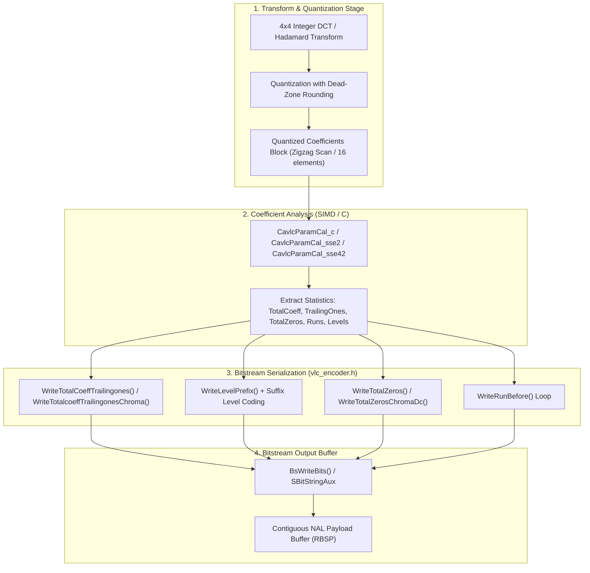
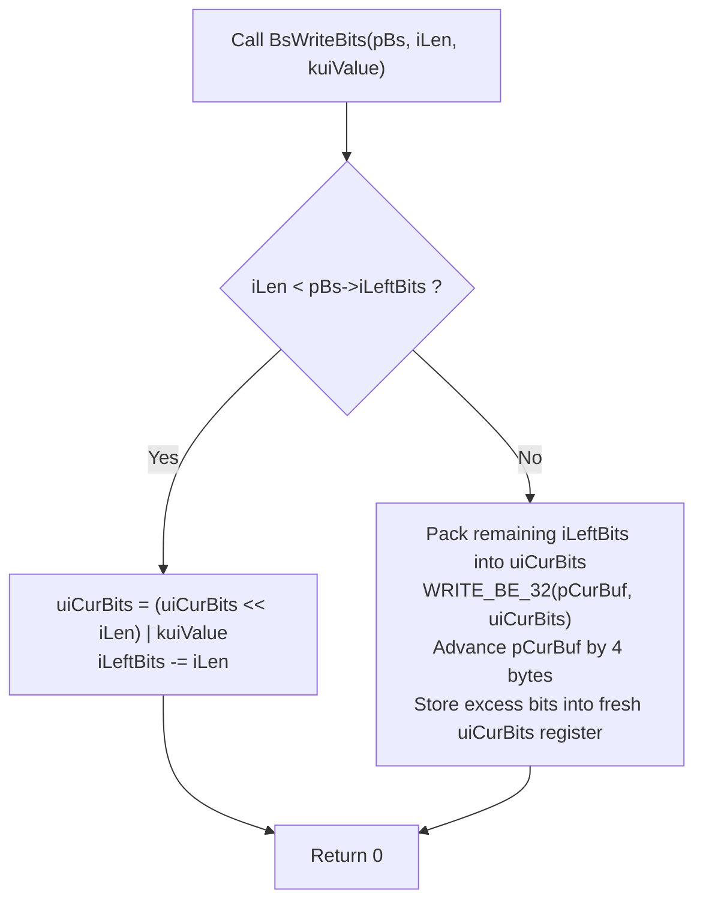
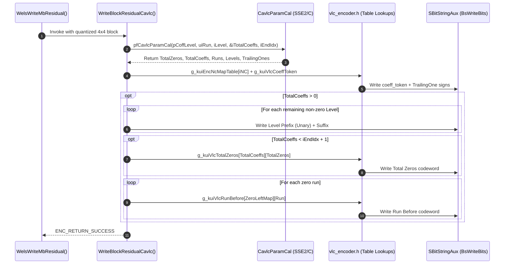

# OpenH264 Core Architecture: CAVLC Entropy Encoding (`vlc_encoder.h`)

This document provides a comprehensive, literate-programming-style technical specification of the Context-Adaptive Variable-Length Coding (CAVLC) bitstream serialization routines and lookup tables declared in [`codec/encoder/core/inc/vlc_encoder.h`](openh264/codec/encoder/core/inc/vlc_encoder.h).

---

## Table of Contents
1. [Module & Architectural Purpose](#1-module--architectural-purpose)
2. [H.264 CAVLC Theoretical Foundations](#2-h264-cavlc-theoretical-foundations)
3. [Global Constants, Macros, and Lookup Tables](#3-global-constants-macros-and-lookup-tables)
   - [3.1 Macro Definitions](#31-macro-definitions)
   - [3.2 Context Mapping Table: `g_kuiEncNcMapTable`](#32-context-mapping-table-g_kuiencncmaptable)
   - [3.3 Coeff Token Lookup Table: `g_kuiVlcCoeffToken`](#33-coeff-token-lookup-table-g_kuivlccoefftoken)
   - [3.4 Level Prefix Table: `g_kuiVlcLevelPrefix`](#34-level-prefix-table-g_kuivlclevelprefix)
   - [3.5 Total Zeros Tables: `g_kuiVlcTotalZeros` & Variants](#35-total-zeros-tables-g_kuivlctotalzeros--variants)
   - [3.6 Run-Before Table: `g_kuiVlcRunBefore`](#36-run-before-table-g_kuivlcrunbefore)
4. [Bitstream Auxiliary State Interaction (`SBitStringAux`)](#4-bitstream-auxiliary-state-interaction-sbitstringaux)
5. [Inlined Bitstream Serializer Functions](#5-inlined-bitstream-serializer-functions)
   - [5.1 `WriteTotalCoeffTrailingones`](#51-writetotalcoefftrailingones)
   - [5.2 `WriteTotalcoeffTrailingonesChroma`](#52-writetotalcoefftrailingoneschroma)
   - [5.3 `WriteLevelPrefix`](#53-writelevelprefix)
   - [5.4 `WriteTotalZeros`](#54-writetotalzeros)
   - [5.5 `WriteTotalZerosChromaDc`](#55-writetotalzeroschromadc)
   - [5.6 `WriteRunBefore`](#56-writerunbefore)
6. [Complete Macroblock Residual Encoding Pipeline](#6-complete-macroblock-residual-encoding-pipeline)
7. [Memory Alignment & Performance Optimization](#7-memory-alignment--performance-optimization)

---

## 1. Module & Architectural Purpose

The header file [`vlc_encoder.h`](openh264/codec/encoder/core/inc/vlc_encoder.h) defines the low-level bitstream serialization interface and constant lookup tables for **Context-Adaptive Variable-Length Coding (CAVLC)** entropy encoding within the OpenH264 video encoder core.

In the H.264 / MPEG-4 AVC standard (ITU-T H.264 / ISO/IEC 14496-10, Section 9.2), CAVLC is the mandatory baseline entropy coding scheme. It converts quantized transform coefficients (from 4x4 Luma/Chroma integer DCT and 2x2/4x4 Hadamard DC transforms) into compact variable-length bit sequences.



### Key Architectural Characteristics
- **Zero-Branch Inlined Serialization**: The inline functions in [`vlc_encoder.h`](openh264/codec/encoder/core/inc/vlc_encoder.h) bypass heavy runtime condition trees by directly calculating multidimensional array indices into pre-computed constant lookup tables.
- **Cacheline Aligned Lookups**: Mapping arrays such as `g_kuiEncNcMapTable` are aligned to 16-byte boundaries (`ALIGNED_DECLARE`) to optimize SIMD vector loads and L1 data cacheline access.
- **Tight Bitstream Integration**: Functions operate directly upon the bitstream auxiliary state pointer [`SBitStringAux*`](openh264/codec/common/inc/golomb_common.h#L67-L77), writing bit codes via [`BsWriteBits`](openh264/codec/common/inc/golomb_common.h#L79-L92) without dynamic memory allocations or intermediate buffer copies.

---

## 2. H.264 CAVLC Theoretical Foundations

H.264 CAVLC exploits the spectral energy compaction of integer DCT transforms, where high-frequency coefficients tend to decay rapidly to zero or $\pm 1$. A 4x4 transform block is serialized through five structured syntax elements:

1. **`coeff_token`**: Jointly encodes the total number of non-zero coefficients ($TotalCoeff \in [0, 16]$) and the number of trailing coefficients with magnitude $\pm 1$ ($TrailingOnes \in [0, 3]$).
   - The choice of VLC table is determined adaptively by the context variable $nC$, derived from the average number of non-zero coefficients in the left neighbor block ($nA$) and top neighbor block ($nB$):
     $$nC = \begin{cases} nA & \text{if only } A \text{ is available} \\ nB & \text{if only } B \text{ is available} \\ (nA + nB + 1) \gg 1 & \text{if both } A \text{ and } B \text{ are available} \\ 0 & \text{if neither is available} \end{cases}$$
2. **Trailing One Signs**: 1 bit per trailing one ($0 = +1$, $1 = -1$), serialized in reverse zigzag scan order.
3. **Levels (Magnitudes & Signs of remaining non-zero coefficients)**:
   - Encoded as a prefix (`level_prefix`, unary coded) and a suffix (`level_suffix`, fixed-length bits).
   - Suffix length $\text{SuffixLength} \in [0, 6]$ adapts dynamically based on coefficient magnitude thresholds.
4. **`total_zeros`**: The sum of all zero-valued coefficients preceding the highest-frequency non-zero coefficient in zigzag scan order.
   - Conditioned on $TotalCoeff$, since $\text{MaxZeros} = 16 - TotalCoeff$.
5. **`run_before`**: For each non-zero coefficient (traversed from highest frequency to lowest frequency), encodes the number of consecutive zeros immediately preceding it.
   - Conditioned on `zerosLeft` (the remaining unallocated zero count).

---

## 3. Global Constants, Macros, and Lookup Tables

All global lookup tables declared in [`vlc_encoder.h`](openh264/codec/encoder/core/inc/vlc_encoder.h#L45-L55) are instantiated in [`codec/encoder/core/src/encoder_data_tables.cpp`](openh264/codec/encoder/core/src/encoder_data_tables.cpp#L84-L320).

### 3.1 Macro Definitions

```cpp
#define CHROMA_DC_NC_OFFSET 17
```

- **Purpose**: Sentinel index offset used when encoding 2x2 Chroma DC blocks.
- **Mechanism**: In H.264 Table 9-5, Chroma DC blocks ($2 \times 2$) use a special context category ($nC = -1$). Passing `CHROMA_DC_NC_OFFSET` (17) into `g_kuiEncNcMapTable[17]` yields table index `4`, selecting the dedicated Chroma DC `coeff_token` VLC table.

---

### 3.2 Context Mapping Table: `g_kuiEncNcMapTable`

```cpp
extern const ALIGNED_DECLARE (uint8_t, g_kuiEncNcMapTable[18], 16);
```

- **Type**: `uint8_t[18]` (16-byte cache aligned).
- **Function**: Maps the computed neighbor non-zero count $nC \in [0, 17]$ to the table index $kuiNcIdx \in [0, 4]$ for `g_kuiVlcCoeffToken`.

| Input $nC$ Index | Resulting $kuiNcIdx$ | H.264 Standard Context Category (Table 9-5) | Codeword Scheme |
| :---: | :---: | :---: | :---: |
| `0, 1` | **0** | $0 \le nC < 2$ | VLC Table 0 (Chroma/Luma Low Frequency) |
| `2, 3` | **1** | $2 \le nC < 4$ | VLC Table 1 |
| `4, 5, 6, 7` | **2** | $4 \le nC < 8$ | VLC Table 2 |
| `8 .. 16` | **3** | $nC \ge 8$ | Fixed 6-bit FLC Table |
| `17` (`CHROMA_DC_NC_OFFSET`) | **4** | $nC = -1$ (Chroma DC 2x2 blocks) | Dedicated Chroma DC VLC Table |

**Data Table Values**:
```cpp
const ALIGNED_DECLARE (uint8_t, g_kuiEncNcMapTable[18], 16) = {
  0, 0, 1, 1, 2, 2, 2, 2, 3, 3, 3, 3, 3, 3, 3, 3, 3, 4
};
```

---

### 3.3 Coeff Token Lookup Table: `g_kuiVlcCoeffToken`

```cpp
extern const uint8_t g_kuiVlcCoeffToken[5][17][4][2];
```

- **Type**: 4-Dimensional Array `uint8_t[5][17][4][2]` (total 680 bytes).
- **Indexing Structure**:
  - `Dim 0` ($[0..4]$): Context category index $kuiNcIdx$ (from `g_kuiEncNcMapTable`).
  - `Dim 1` ($[0..16]$): $TotalCoeff$ (number of non-zero coefficients in block).
  - `Dim 2` ($[0..3]$): $TrailingOnes$ (number of trailing $\pm 1$ coefficients, clamped to $0..3$).
  - `Dim 3` ($[0..1]$): Pair representing `[0] = Codeword Value`, `[1] = Bit Length`.

**Codeword Retrieval Formula**:
$$\text{Codeword Value} = \text{g\_kuiVlcCoeffToken}[kuiNcIdx][TotalCoeff][TrailingOnes][0]$$
$$\text{Bit Length} = \text{g\_kuiVlcCoeffToken}[kuiNcIdx][TotalCoeff][TrailingOnes][1]$$

---

### 3.4 Level Prefix Table: `g_kuiVlcLevelPrefix`

```cpp
extern const uint8_t g_kuiVlcLevelPrefix[15][2];
```

- **Type**: `uint8_t[15][2]`.
- **Purpose**: Defines prefix codewords and bit lengths for multi-level coefficient prefix coding.

---

### 3.5 Total Zeros Tables: `g_kuiVlcTotalZeros` & Variants

#### A. 4x4 Blocks: `g_kuiVlcTotalZeros`
```cpp
extern const uint8_t g_kuiVlcTotalZeros[16][16][2];
```
- **Type**: `uint8_t[16][16][2]` (512 bytes).
- **Indexing**: `[TotalCoeff][TotalZeros][0: value, 1: bit count]`.
- **Domain**: $1 \le TotalCoeff \le 15$, $0 \le TotalZeros \le (16 - TotalCoeff)$. Row `0` is unused ($TotalCoeff = 0$ requires no zero coding).

#### B. 2x2 Chroma DC Blocks: `g_kuiVlcTotalZerosChromaDc`
```cpp
extern const uint8_t g_kuiVlcTotalZerosChromaDc[4][4][2];
```
- **Type**: `uint8_t[4][4][2]` (32 bytes).
- **Domain**: $1 \le TotalCoeff \le 3$, $0 \le TotalZeros \le (4 - TotalCoeff)$. Encodes H.264 Table 9-9a.

#### C. 4:2:2 Chroma DC Blocks: `g_kuiVlcTotalZerosChromaDc422`
```cpp
extern const uint8_t g_kuiVlcTotalZerosChromaDc422[8][8][2];
```
- **Type**: `uint8_t[8][8][2]` (128 bytes).
- **Domain**: Supports 2x4 Chroma DC blocks (8 coefficients total) used in Medium Grain Scalability (MGS) and 4:2:2 chroma formats.

---

### 3.6 Run-Before Table: `g_kuiVlcRunBefore`

```cpp
extern const uint8_t g_kuiVlcRunBefore[8][15][2];
```

- **Type**: `uint8_t[8][15][2]` (240 bytes).
- **Indexing**: `[uiZeroLeftIndex][uiRunBefore][0: value, 1: bit count]`.
- **Context Derivation**: `zerosLeft` values $\ge 7$ map to index `7` via [`g_kuiZeroLeftMap`](openh264/codec/encoder/core/src/set_mb_syn_cavlc.cpp#L48-L50):
  $$\text{uiZeroLeftIndex} = \text{g\_kuiZeroLeftMap}[zerosLeft] = \min(zerosLeft, 7)$$

---

## 4. Bitstream Auxiliary State Interaction (`SBitStringAux`)

All bit serialization functions in [`vlc_encoder.h`](openh264/codec/encoder/core/inc/vlc_encoder.h) write directly into the encoder's bitstream context [`SBitStringAux`](openh264/codec/common/inc/golomb_common.h#L67-L77):

```cpp
typedef struct TagBitStringAux {
  uint8_t* pStartBuf;  // Start pointer of output bitstream buffer
  uint8_t* pCurBuf;    // Current write cursor (byte pointer)
  uint8_t* pEndBuf;    // End boundary pointer for overflow checks
  int32_t  iLeftBits;  // Remaining bits available in 32-bit register (32 down to 1)
  uint32_t uiCurBits;  // 32-bit bit-accumulator register
} SBitStringAux, *PBitStringAux;
```

### Bit Writing Engine: `BsWriteBits`
Implemented in [`golomb_common.h`](openh264/codec/common/inc/golomb_common.h#L79-L92):

```cpp
static inline int32_t BsWriteBits (PBitStringAux pBitString, int32_t iLen, const uint32_t kuiValue) {
  if (iLen < pBitString->iLeftBits) {
    pBitString->uiCurBits = (pBitString->uiCurBits << iLen) | kuiValue;
    pBitString->iLeftBits -= iLen;
  } else {
    iLen -= pBitString->iLeftBits;
    pBitString->uiCurBits = (pBitString->uiCurBits << pBitString->iLeftBits) | (kuiValue >> iLen);
    WRITE_BE_32 (pBitString->pCurBuf, pBitString->uiCurBits);
    pBitString->pCurBuf += 4;
    pBitString->uiCurBits = kuiValue & ((1 << iLen) - 1);
    pBitString->iLeftBits = 32 - iLen;
  }
  return 0;
}
```



---

## 5. Inlined Bitstream Serializer Functions

### 5.1 `WriteTotalCoeffTrailingones`

#### Signature
```cpp
static inline int32_t WriteTotalCoeffTrailingones (
    SBitStringAux* pBs,
    uint8_t        uiNc,
    uint8_t        uiTotalCoeff,
    uint8_t        uiTrailingOnes
);
```

#### Parameters
- `pBs`: Pointer to the active bitstream state [`SBitStringAux`](openh264/codec/common/inc/golomb_common.h#L67-L77).
- `uiNc`: Context parameter $nC \in [0, 16]$ derived from neighboring macroblock residual statistics.
- `uiTotalCoeff`: Total non-zero transform coefficients ($0 \le TotalCoeff \le 16$).
- `uiTrailingOnes`: Number of trailing $\pm 1$ coefficients ($0 \le TrailingOnes \le 3$).

#### Return Value
- `int32_t`: Returns `0` on successful serialization.

#### Implementation Details
```cpp
static inline int32_t WriteTotalCoeffTrailingones (SBitStringAux* pBs, uint8_t uiNc, uint8_t uiTotalCoeff,
    uint8_t uiTrailingOnes) {
  const uint8_t kuiNcIdx      = g_kuiEncNcMapTable[uiNc];
  const uint8_t* kpCoeffToken = &g_kuiVlcCoeffToken[kuiNcIdx][uiTotalCoeff][uiTrailingOnes][0];
  return BsWriteBits (pBs, kpCoeffToken[1], kpCoeffToken[0]);
}
```
1. Maps neighbor count `uiNc` to table index `kuiNcIdx` via `g_kuiEncNcMapTable[uiNc]`.
2. Indexes `g_kuiVlcCoeffToken[kuiNcIdx][uiTotalCoeff][uiTrailingOnes]` to fetch pointer `kpCoeffToken`.
3. Writes `kpCoeffToken[1]` bits with integer value `kpCoeffToken[0]` into bitstream `pBs`.

---

### 5.2 `WriteTotalcoeffTrailingonesChroma`

#### Signature
```cpp
static inline int32_t WriteTotalcoeffTrailingonesChroma (
    SBitStringAux* pBs,
    uint8_t        uiTotalCoeff,
    uint8_t        uiTrailingOnes
);
```

#### Parameters
- `pBs`: Bitstream writer pointer.
- `uiTotalCoeff`: Non-zero coefficient count in 2x2 Chroma DC block ($0 \le TotalCoeff \le 4$).
- `uiTrailingOnes`: Trailing ones count ($0 \le TrailingOnes \le 3$).

#### Implementation Details
```cpp
static inline int32_t WriteTotalcoeffTrailingonesChroma (SBitStringAux* pBs, uint8_t uiTotalCoeff,
    uint8_t uiTrailingOnes) {
  const uint8_t* kpCoeffToken = &g_kuiVlcCoeffToken[4][uiTotalCoeff][uiTrailingOnes][0];
  return BsWriteBits (pBs, kpCoeffToken[1], kpCoeffToken[0]);
}
```
Directly specifies context index `4` (Chroma DC $nC = -1$), bypassing neighbor count evaluation.

---

### 5.3 `WriteLevelPrefix`

#### Signature
```cpp
static inline int32_t WriteLevelPrefix (
    SBitStringAux* pBs,
    const uint32_t kuiZeroCount
);
```

#### Parameters
- `pBs`: Bitstream writer pointer.
- `kuiZeroCount`: Unary zero prefix length (`level_prefix` syntax element).

#### Mathematical Specification
In H.264 CAVLC, `level_prefix` is represented as a unary string of `kuiZeroCount` consecutive `'0'` bits terminated by a single `'1'` bit:
$$\text{Prefix Codeword} = \underbrace{00\dots 0}_{\text{kuiZeroCount zeros}} 1_2$$
Total bit length = $\text{kuiZeroCount} + 1$. Value written = `1`.

#### Implementation Details
```cpp
static inline int32_t WriteLevelPrefix (SBitStringAux* pBs, const uint32_t kuiZeroCount) {
  BsWriteBits (pBs, kuiZeroCount + 1, 1);
  return 0;
}
```
Directly writes `kuiZeroCount + 1` bits of value `1`. The leading bits in a binary representation of `1` across a field of width $N = \text{kuiZeroCount} + 1$ are all zeros, achieving perfect unary encoding in a single CPU instruction without looping.

---

### 5.4 `WriteTotalZeros`

#### Signature
```cpp
static inline int32_t WriteTotalZeros (
    SBitStringAux* pBs,
    uint32_t       uiTotalCoeff,
    uint32_t       uiTotalZeros
);
```

#### Parameters
- `pBs`: Bitstream writer pointer.
- `uiTotalCoeff`: Total non-zero coefficients ($1 \le uiTotalCoeff \le 15$).
- `uiTotalZeros`: Sum of all zeros preceding the last non-zero coefficient ($0 \le uiTotalZeros \le 16 - uiTotalCoeff$).

#### Implementation Details
```cpp
static inline int32_t WriteTotalZeros (SBitStringAux* pBs, uint32_t uiTotalCoeff, uint32_t uiTotalZeros) {
  const uint8_t* kpTotalZeros = &g_kuiVlcTotalZeros[uiTotalCoeff][uiTotalZeros][0];
  return BsWriteBits (pBs, kpTotalZeros[1], kpTotalZeros[0]);
}
```

---

### 5.5 `WriteTotalZerosChromaDc`

#### Signature
```cpp
static inline int32_t WriteTotalZerosChromaDc (
    SBitStringAux* pBs,
    uint32_t       uiTotalCoeff,
    uint32_t       uiTotalZeros
);
```

#### Parameters
- `pBs`: Bitstream writer pointer.
- `uiTotalCoeff`: Chroma DC non-zero coefficient count ($1 \le uiTotalCoeff \le 3$).
- `uiTotalZeros`: Chroma DC total zeros ($0 \le uiTotalZeros \le 4 - uiTotalCoeff$).

#### Implementation Details
```cpp
static inline int32_t WriteTotalZerosChromaDc (SBitStringAux* pBs, uint32_t uiTotalCoeff, uint32_t uiTotalZeros) {
  const uint8_t* kpTotalZerosChromaDc = &g_kuiVlcTotalZerosChromaDc[uiTotalCoeff][uiTotalZeros][0];
  return BsWriteBits (pBs, kpTotalZerosChromaDc[1], kpTotalZerosChromaDc[0]);
}
```

---

### 5.6 `WriteRunBefore`

#### Signature
```cpp
static inline int32_t WriteRunBefore (
    SBitStringAux* pBs,
    uint8_t        uiZeroLeft,
    uint8_t        uiRunBefore
);
```

#### Parameters
- `pBs`: Bitstream writer pointer.
- `uiZeroLeft`: Mapped index of remaining zeros ($\text{uiZeroLeft} = \text{g\_kuiZeroLeftMap}[zerosLeft] \in [0, 7]$).
- `uiRunBefore`: Number of zeros immediately preceding the current non-zero coefficient.

#### Implementation Details
```cpp
static inline int32_t WriteRunBefore (SBitStringAux* pBs, uint8_t uiZeroLeft, uint8_t uiRunBefore) {
  const uint8_t* kpRunBefore = &g_kuiVlcRunBefore[uiZeroLeft][uiRunBefore][0];
  return BsWriteBits (pBs, kpRunBefore[1], kpRunBefore[0]);
}
```

---

## 6. Complete Macroblock Residual Encoding Pipeline

The inline routines declared in [`vlc_encoder.h`](openh264/codec/encoder/core/inc/vlc_encoder.h) are orchestrated by [`WriteBlockResidualCavlc`](openh264/codec/encoder/core/src/set_mb_syn_cavlc.cpp#L108-L232) in [`codec/encoder/core/src/set_mb_syn_cavlc.cpp`](openh264/codec/encoder/core/src/set_mb_syn_cavlc.cpp):

```cpp
int32_t WriteBlockResidualCavlc (
    SWelsFuncPtrList* pFuncList,
    int16_t*          pCoffLevel,
    int32_t           iEndIdx,
    int32_t           iCalRunLevelFlag,
    int32_t           iResidualProperty,
    int8_t            iNC,
    SBitStringAux*    pBs
);
```

### Residual Serialization Step-by-Step



1. **Step 1: Fast Parameter Extraction**:
   - `pFuncList->pfCavlcParamCal` executes C or assembly SIMD routines ([`CavlcParamCal_sse2`](openh264/codec/encoder/core/src/set_mb_syn_cavlc.cpp#L295) / [`CavlcParamCal_sse42`](openh264/codec/encoder/core/src/set_mb_syn_cavlc.cpp#L301)) to compute `TotalCoeffs`, `TrailingOnes`, `TotalZeros`, runs, and levels in a single pass.
2. **Step 2: `coeff_token` & Trailing Signs**:
   - `g_kuiVlcCoeffToken` provides the base token codeword.
   - Trailing one sign bits (`uiSign`) are appended directly to the codeword:
     $$\text{iValue} = (\text{iValue} \ll \text{iTrailingOnes}) + \text{uiSign}$$
3. **Step 3: Adaptive Level Coding**:
   - Evaluates prefix thresholds and suffix lengths (`uiSuffixLength` dynamically adjusts between $0$ and $6$).
4. **Step 4: `total_zeros` & `run_before` Writing**:
   - Lookups into `g_kuiVlcTotalZeros` and `g_kuiVlcRunBefore` serialize remaining zero distributions.

---

## 7. Memory Alignment & Performance Optimization

1. **16-Byte Table Alignment**:
   - `g_kuiEncNcMapTable` uses `ALIGNED_DECLARE(uint8_t, ..., 16)` ensuring aligned L1 cache line residency and preventing unaligned SIMD penalty.
2. **Bitstream Register Caching**:
   - In [`WriteBlockResidualCavlc`](openh264/codec/encoder/core/src/set_mb_syn_cavlc.cpp#L124-L230), macro `CAVLC_BS_INIT(pBs)` unpacks `pBs->pCurBuf`, `pBs->uiCurBits`, and `pBs->iLeftBits` into local CPU registers for the duration of block serialization.
   - `CAVLC_BS_UNINIT(pBs)` writes updated register state back to the `SBitStringAux` struct only once upon block completion, eliminating memory store-forwarding stalls.
