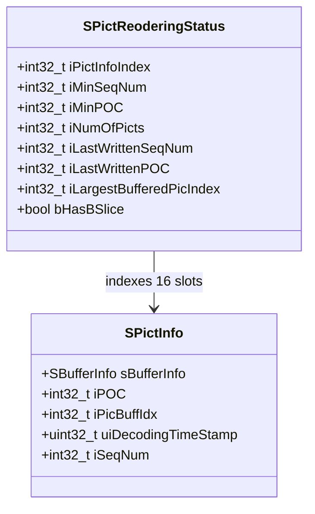
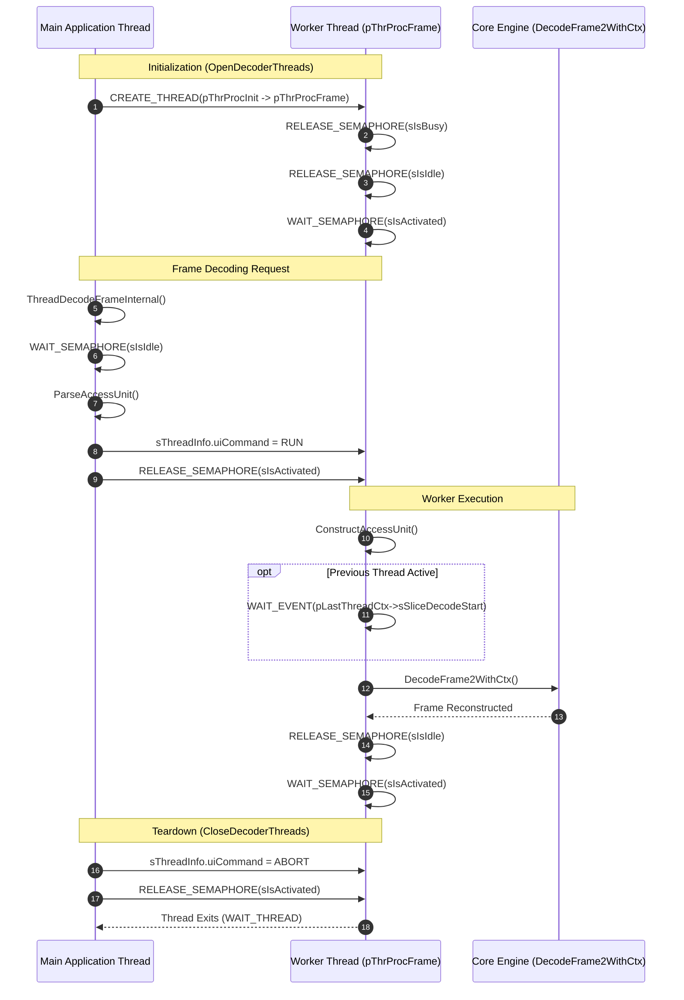
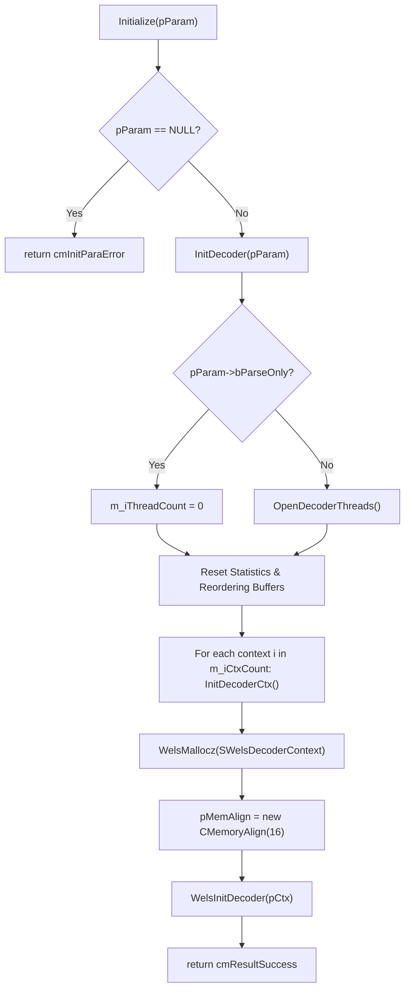
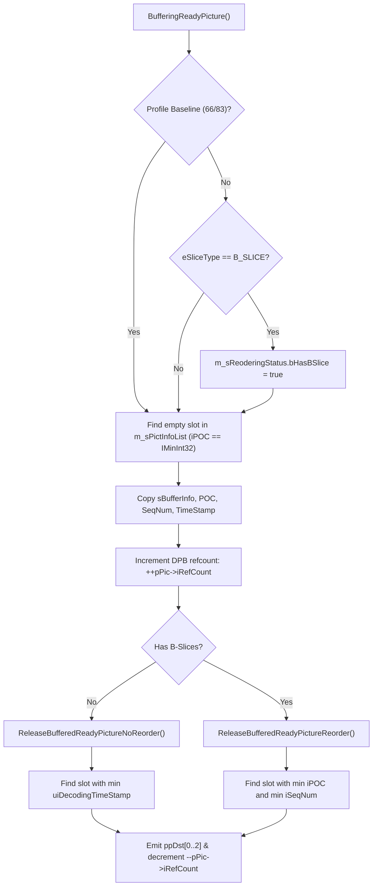

# Literate Programming Documentation: `welsDecoderExt.cpp`

**Source File:** [`codec/decoder/plus/src/welsDecoderExt.cpp`](openh264/codec/decoder/plus/src/welsDecoderExt.cpp)  
**Header File:** [`codec/decoder/plus/inc/welsDecoderExt.h`](openh264/codec/decoder/plus/inc/welsDecoderExt.h)  
**Subsystem:** OpenH264 Video Decoder — Public C++ Facade & Multithreaded Orchestrator

---

## Table of Contents
1. [Architectural Overview & System Role](#1-architectural-overview--system-role)
2. [Data Structures, Types, and Synchronization Primitives](#2-data-structures-types-and-synchronization-primitives)
   - [2.1 CWelsDecoder Class Breakdown](#21-cwelsdecoder-class-breakdown)
   - [2.2 Multithreading Context Structures](#22-multithreading-context-structures)
   - [2.3 Picture Reordering Structures](#23-picture-reordering-structures)
   - [2.4 Telemetry & Statistics](#24-telemetry--statistics)
   - [2.5 Enums, Commands, and Constants](#25-enums-commands-and-constants)
3. [Thread Lifecycle & Concurrency Model](#3-thread-lifecycle--concurrency-model)
4. [Method-by-Method Deep Dive](#4-method-by-method-deep-dive)
   - [4.1 Thread Worker Entry Points](#41-thread-worker-entry-points)
   - [4.2 Construction & Destruction](#42-construction--destruction)
   - [4.3 Initialization & Configuration Lifecycle](#43-initialization--configuration-lifecycle)
   - [4.4 Decoder Reset & Error Recovery](#44-decoder-reset--error-recovery)
   - [4.5 Option Management (GetOption / SetOption)](#45-option-management-getoption--setoption)
   - [4.6 Frame Decoding Pipelines](#46-frame-decoding-pipelines)
   - [4.7 Parse-Only Mode Pipeline](#47-parse-only-mode-pipeline)
   - [4.8 Picture Buffering, POC Reordering, and DPB Output](#48-picture-buffering-poc-reordering-and-dpb-output)
   - [4.9 Multi-Threaded Task Dispatching](#49-multi-threaded-task-dispatching)
5. [C-Style Export Functions](#5-c-style-export-functions)
6. [Call Graph & Interaction Matrix](#6-call-graph--interaction-matrix)

---

## 1. Architectural Overview & System Role

The file [`codec/decoder/plus/src/welsDecoderExt.cpp`](openh264/codec/decoder/plus/src/welsDecoderExt.cpp) implements the top-level C++ facade class [CWelsDecoder](openh264/codec/decoder/plus/inc/welsDecoderExt.h#L57-L166), which inherits from the public abstract interface [ISVCDecoder](openh264/codec/api/wels/codec_api.h#L320-L400). It serves as the bridge between the external client application (such as WebRTC, media players, or transcoders) and the high-performance C decoding engine implemented in [`codec/decoder/core/`](openh264/codec/decoder/core/).

```mermaid
flowchart TB
    subgraph Client Application Layer
        App[Application / WebRTC Engine]
        CAPI[C API Factory: WelsCreateDecoder / WelsDestroyDecoder]
    end

    subgraph C++ Facade Layer (welsDecoderExt.cpp)
        ISVCDec[ISVCDecoder Interface]
        CWelsDec[CWelsDecoder Instance]
        ThrPool[Worker Thread Pool / Semaphores / Events]
        ReorderBuf[Picture Reordering Buffer: SPictInfoList]
    end

    subgraph Core C Decoder Layer (codec/decoder/core)
        DecCtx0[Primary SWelsDecoderContext]
        DecCtxN[Worker SWelsDecoderContext N]
        DecBS[WelsDecodeBs / au_parser.cpp]
        RecLoop[Macroblock Reconstruction / rec_mb.cpp]
        DPB[Decoded Picture Buffer / pic_queue.cpp]
    end

    App --> CAPI
    CAPI --> CWelsDec
    CWelsDec -. implements .-> ISVCDec
    CWelsDec --> ThrPool
    CWelsDec --> ReorderBuf
    CWelsDec --> DecCtx0
    ThrPool --> DecCtxN
    DecCtx0 --> DecBS
    DecCtxN --> DecBS
    DecBS --> RecLoop
    RecLoop --> DPB
    DPB --> ReorderBuf
```

### Key Responsibilities of `welsDecoderExt.cpp`
1. **Public API Contract**: Implements all virtual methods declared in [ISVCDecoder](openh264/codec/api/wels/codec_api.h#L320-L400) (`Initialize`, `Uninitialize`, `DecodeFrame`, `DecodeFrame2`, `DecodeFrameNoDelay`, `DecodeParser`, `FlushFrame`, `SetOption`, `GetOption`).
2. **Multithreaded Frame Decoding**: Manages a pool of OS worker threads (`pThrProcFrame`), allocating separate [SWelsDecoderContext](openh264/codec/decoder/core/inc/decoder_context.h#L306-L520) instances per thread to achieve frame-level parallel decoding while maintaining SPS/PPS parameter synchronization.
3. **Picture Order Count (POC) Display Reordering**: Implements standard H.264 display picture reordering buffers (`m_sPictInfoList`) for streams containing B-slices or temporal layers, ensuring decoded frames are emitted in presentation order rather than bitstream decoding order.
4. **Decoded Picture Buffer (DPB) Lifecycle Integration**: Tracks frame reference counts (`pPic->iRefCount`) and coordinates picture release callbacks (`pPic->pSetUnRef`) between display output and reference picture lists.
5. **Dynamic Option Management & Telemetry**: Handles runtime configuration changes (thread counts, trace levels, error concealment strategies) and gathers real-time decoding statistics (`SDecoderStatistics`).

---

## 2. Data Structures, Types, and Synchronization Primitives

### 2.1 `CWelsDecoder` Class Breakdown

The class [CWelsDecoder](openh264/codec/decoder/plus/inc/welsDecoderExt.h#L57-L166) is the stateful container for the decoder instance.

| Field Name | Type | Description & Lifecycle |
| :--- | :--- | :--- |
| `m_pWelsTrace` | [welsCodecTrace*](openh264/codec/common/inc/welsCodecTrace.h) | Logging and diagnostic trace controller; allocated on heap in constructor, deleted in destructor. |
| `m_uiDecodeTimeStamp` | `uint32_t` | Monotonically increasing frame sequence counter assigned to incoming access units. |
| `m_bIsBaseline` | `bool` | Flag indicating whether the active SPS profile is Baseline (Profile IDC 66) or Scalable Baseline (83). |
| `m_iCpuCount` | `int32_t` | Hardware CPU core count detected at runtime via [GetCPUCount()](openh264/codec/common/inc/cpu.h), clamped to `WELS_DEC_MAX_NUM_CPU` (capped at 4). |
| `m_iThreadCount` | `int32_t` | Number of active worker threads configured for decoding ($0 \le \text{threadCount} \le \min(\text{m\_iCpuCount}, 3)$). |
| `m_iCtxCount` | `int32_t` | Total number of decoder context structures allocated (`m_iThreadCount == 0 ? 1 : m_iThreadCount`). |
| `m_pPicBuff` | [PPicBuff](openh264/codec/decoder/core/inc/pic_queue.h) | Shared decoded picture buffer pool pointer propagated across thread contexts during sequence transitions. |
| `m_bParamSetsLostFlag` | `bool` | Latched flag signaling that parameter sets (SPS/PPS) or IDR slices were corrupted or missing. |
| `m_bFreezeOutput` | `bool` | Error concealment flag requesting video frame freezing during severe packet loss. |
| `m_DecCtxActiveCount` | `int32_t` | Number of worker thread contexts currently engaged in parallel frame decoding. |
| `m_pDecThrCtx` | [PWelsDecoderThreadCTX](openh264/codec/decoder/core/inc/decoder_context.h#L547) | Heap-allocated array of worker thread context wrappers (`SWelsDecoderThreadCTX[m_iCtxCount]`). |
| `m_pLastDecThrCtx` | [PWelsDecoderThreadCTX](openh264/codec/decoder/core/inc/decoder_context.h#L547) | Pointer to the thread context that processed the immediately preceding access unit. |
| `m_iLastBufferedIdx` | `int32_t` | Array index in `m_sPictInfoList` where the most recent decoded picture was buffered. |
| `m_csDecoder` | `WELS_MUTEX` | Critical section mutex synchronizing decoder state access across threads. |
| `m_sBufferingEvent` | `SWelsDecEvent` | Event signaled when a decoded picture has been placed into the display reordering buffer. |
| `m_sReleaseBufferEvent` | `SWelsDecEvent` | Event signaled to release threads waiting on buffer drain operations. |
| `m_sIsBusy` | `SWelsDecSemphore` | Counting semaphore tracking active thread workloads. |
| `m_sPictInfoList[16]` | [SPictInfo](openh264/codec/decoder/core/inc/decoder_context.h#L283-L289)`[16]` | Fixed circular array of 16 display picture slots for POC reordering. |
| `m_sReoderingStatus` | [SPictReoderingStatus](openh264/codec/decoder/core/inc/decoder_context.h#L291-L300) | State machine tracking POC reordering, minimum sequence numbers, and buffer fullness. |
| `m_pDecThrCtxActive[]` | `PWelsDecoderThreadCTX[WELS_DEC_MAX_NUM_CPU]` | Active worker thread context queue. |
| `m_sVlcTable` | `SVlcTable` | Shared CAVLC decoding lookup tables. |
| `m_sLastDecPicInfo` | [SWelsLastDecPicInfo](openh264/codec/decoder/core/inc/decoder_context.h#L271-L281) | Cached metadata of the last decoded picture (POC MSB/LSB, slice headers, DPB pointers). |
| `m_sDecoderStatistics` | [SDecoderStatistics](openh264/codec/api/wels/codec_app_def.h) | Performance, resolution, and error concealment metrics accumulator. |
| `m_iStreamSeqNum` | `int32_t` | Sequence identifier incremented upon bitstream resolution/parameter changes. |

---

### 2.2 Multithreading Context Structures

The decoder coordinates concurrency using two nested structs defined in [`codec/decoder/core/inc/decoder_context.h`](openh264/codec/decoder/core/inc/decoder_context.h#L522-L547):

#### A. `SWelsDecThreadInfo`
Low-level operating system thread abstraction:
```cpp
typedef struct tagSWelsDecThread {
  SWelsDecSemphore* sIsBusy;          // Pointer to parent m_sIsBusy semaphore
  SWelsDecSemphore  sIsActivated;     // Signaled by main thread to wake worker
  SWelsDecSemphore  sIsIdle;          // Signaled by worker thread upon job completion
  SWelsDecThread   sThrHandle;       // OS thread handle (pthread_t or HANDLE)
  uint32_t         uiCommand;        // WELS_DEC_THREAD_COMMAND_RUN or _ABORT
  uint32_t         uiThrNum;         // 0-based worker thread index
  uint32_t         uiThrMaxNum;      // Total thread count configured
  uint32_t         uiThrStackSize;   // Stack size (WELS_DEC_MAX_THREAD_STACK_SIZE)
  DECLARE_PROCTHREAD_PTR (pThrProcMain); // Worker main function pointer
} SWelsDecThreadInfo, *PWelsDecThreadInfo;
```

#### B. `SWelsDecoderThreadCTX`
High-level decoding job descriptor:
```cpp
typedef struct tagSWelsDecThreadCtx {
  SWelsDecThreadInfo    sThreadInfo;         // Thread OS primitives
  PWelsDecoderContext   pCtx;                // Core C decoder context
  void*                 threadCtxOwner;      // Pointer to CWelsDecoder instance
  uint8_t*              kpSrc;               // Input NAL bitstream pointer
  int32_t               kiSrcLen;            // Input bitstream byte length
  uint8_t**             ppDst;               // Output YUV plane buffer pointers
  SBufferInfo           sDstInfo;            // Output buffer metadata
  PPicture              pDec;                // Picture currently being decoded
  SWelsDecEvent         sImageReady;         // Frame ready event
  SWelsDecEvent         sSliceDecodeStart;   // Inter-thread dependency sync start event
  SWelsDecEvent         sSliceDecodeFinish;  // Inter-thread dependency sync finish event
  int32_t               iPicBuffIdx;         // Index in DPB picture buffer pool
} SWelsDecoderThreadCTX, *PWelsDecoderThreadCTX;
```

---

### 2.3 Picture Reordering Structures

Picture reordering handles B-slice reordering and non-consecutive presentation orders using [SPictInfo](openh264/codec/decoder/core/inc/decoder_context.h#L283-L289) and [SPictReoderingStatus](openh264/codec/decoder/core/inc/decoder_context.h#L291-L300):



- **`iPOC`**: Picture Order Count LSB extracted from the slice header. An unallocated slot is marked by `iPOC == IMinInt32` (`-2147483648`).
- **`iPicBuffIdx`**: Index of the reconstructed picture in the DPB pool [PPicBuff](openh264/codec/decoder/core/inc/pic_queue.h). The picture's reference counter `pPic->iRefCount` is incremented upon buffering to prevent the DPB from overwriting the frame before it is presented to the user.

---

### 2.4 Telemetry & Statistics

The [SDecoderStatistics](openh264/codec/api/wels/codec_app_def.h) structure aggregates runtime telemetry:

$$fAverageFrameSpeedInMs = \frac{dDecTime}{\text{uiDecodedFrameCount}}$$

$$fActualAverageFrameSpeedInMs = \frac{dDecTime}{\text{uiDecodedFrameCount} + \text{uiFreezingIDRNum} + \text{uiFreezingNonIDRNum}}$$

The error concealment ratio is calculated across concealed macroblocks ($iMbConcealedNum = iMbEcedNum + iMbEcedPropNum$):

$$\text{uiAvgEcRatio}_{\text{new}} = \frac{\text{uiAvgEcRatio}_{\text{prev}} \cdot \text{uiEcFrameNum} + \frac{iMbConcealedNum \cdot 100}{iMbNum}}{\text{uiEcFrameNum} + 1}$$

---

### 2.5 Enums, Commands, and Constants

- `WELS_DEC_THREAD_COMMAND_RUN` (`1`): Instructs the worker thread to execute `ConstructAccessUnit`.
- `WELS_DEC_THREAD_COMMAND_ABORT` (`2`): Instructs the worker thread to exit its execution loop.
- `WELS_DEC_MAX_NUM_CPU` (`4`): Upper bound on parallel decoder threads.
- `WELS_DEC_MAX_THREAD_STACK_SIZE` (`1048576` = 1MB): Thread stack size allocation.

---

## 3. Thread Lifecycle & Concurrency Model

When multithreading is enabled (`m_iThreadCount >= 1`), the decoder spawns $N$ background threads that run concurrently.



---

## 4. Method-by-Method Deep Dive

### 4.1 Thread Worker Entry Points

#### `DECLARE_PROCTHREAD (pThrProcInit, p)`
- **Signature**: `DECLARE_PROCTHREAD (pThrProcInit, void* p)`
- **Location**: [welsDecoderExt.cpp:L91-L97](openh264/codec/decoder/plus/src/welsDecoderExt.cpp#L91-L97)
- **Parameters**: `p` — Pointer to [SWelsDecThreadInfo](openh264/codec/decoder/core/inc/decoder_context.h#L522-L532).
- **Operation**:
  1. Casts input pointer to `SWelsDecThreadInfo*`.
  2. On Windows (`WIN32`), invokes `_alloca` to guarantee stack memory pre-allocation based on `WELS_DEC_MAX_THREAD_STACK_SIZE * (uiThrNum + 1)`.
  3. Tail-calls `sThreadInfo->pThrProcMain(p)`, which points to `pThrProcFrame`.

#### `DECLARE_PROCTHREAD (pThrProcFrame, p)`
- **Signature**: `DECLARE_PROCTHREAD (pThrProcFrame, void* p)`
- **Location**: [welsDecoderExt.cpp:L117-L131](openh264/codec/decoder/plus/src/welsDecoderExt.cpp#L117-L131)
- **Parameters**: `p` — Pointer to [SWelsDecoderThreadCTX](openh264/codec/decoder/core/inc/decoder_context.h#L534-L547).
- **Operation**:
  Runs an infinite execution loop:
  1. Releases `sThreadInfo.sIsBusy` and `sThreadInfo.sIsIdle` semaphores.
  2. Blocks on `WAIT_SEMAPHORE(&pThrCtx->sThreadInfo.sIsActivated, WELS_DEC_THREAD_WAIT_INFINITE)`.
  3. Inspects `pThrCtx->sThreadInfo.uiCommand`:
     - `WELS_DEC_THREAD_COMMAND_RUN`: Invokes `ConstructAccessUnit(pWelsDecoder, pThrCtx)`.
     - `WELS_DEC_THREAD_COMMAND_ABORT`: Breaks from loop and terminates the thread.

#### `static DECODING_STATE ConstructAccessUnit (CWelsDecoder* pWelsDecoder, PWelsDecoderThreadCTX pThrCtx)`
- **Location**: [welsDecoderExt.cpp:L99-L115](openh264/codec/decoder/plus/src/welsDecoderExt.cpp#L99-L115)
- **Parameters**:
  - `pWelsDecoder`: Pointer to the parent [CWelsDecoder](openh264/codec/decoder/plus/inc/welsDecoderExt.h#L57-L166) instance.
  - `pThrCtx`: Pointer to the current thread's [SWelsDecoderThreadCTX](openh264/codec/decoder/core/inc/decoder_context.h#L534-L547).
- **Returns**: [DECODING_STATE](openh264/codec/api/wels/codec_def.h) cast from internal integer error flags.
- **Synchronization Logic**:
  If `pThrCtx->pCtx->pLastThreadCtx` is non-null, the thread waits for the previous thread's slice start event:
  ```cpp
  WAIT_EVENT(&pLastThreadCtx->sSliceDecodeStart, WELS_DEC_THREAD_WAIT_INFINITE);
  RESET_EVENT(&pLastThreadCtx->sSliceDecodeStart);
  ```
  It then calls [DecodeFrame2WithCtx](openh264/codec/decoder/plus/src/welsDecoderExt.cpp#L735-L916) with `kpSrc = NULL` and `kiSrcLen = 0` to decode the parsed access unit.

---

### 4.2 Construction & Destruction

#### `CWelsDecoder::CWelsDecoder (void)`
- **Location**: [welsDecoderExt.cpp:L133-L222](openh264/codec/decoder/plus/src/welsDecoderExt.cpp#L133-L222)
- **Initialization Steps**:
  1. Initializes scalar members (`m_uiDecodeTimeStamp = 0`, `m_iCtxCount = 1`, `m_bParamSetsLostFlag = false`).
  2. Allocates [welsCodecTrace](openh264/codec/common/inc/welsCodecTrace.h) instance and sets log level to `WELS_LOG_ERROR`.
  3. Calls `ResetReorderingPictureBuffers(&m_sReoderingStatus, m_sPictInfoList, true)`.
  4. Detects CPU hardware cores via `GetCPUCount()`, clamping `m_iCpuCount` to `WELS_DEC_MAX_NUM_CPU` (4).
  5. Allocates the thread context array:
     ```cpp
     m_pDecThrCtx = new SWelsDecoderThreadCTX[m_iCtxCount];
     memset(m_pDecThrCtx, 0, sizeof(SWelsDecoderThreadCTX) * m_iCtxCount);
     ```

#### `CWelsDecoder::~CWelsDecoder()`
- **Location**: [welsDecoderExt.cpp:L232-L258](openh264/codec/decoder/plus/src/welsDecoderExt.cpp#L232-L258)
- **Cleanup Sequence**:
  1. Invokes `CloseDecoderThreads()` to terminate all background worker threads.
  2. Invokes `UninitDecoder()` to release all core decoder contexts and memory allocators.
  3. Deletes `m_pWelsTrace` and frees `m_pDecThrCtx`.

---

### 4.3 Initialization & Configuration Lifecycle



#### `long CWelsDecoder::Initialize (const SDecodingParam* pParam)`
- **Location**: [welsDecoderExt.cpp:L260-L277](openh264/codec/decoder/plus/src/welsDecoderExt.cpp#L260-L277)
- Validates pointers and invokes `InitDecoder(pParam)`. Returns `cmResultSuccess` (`0`) on success.

#### `int32_t CWelsDecoder::InitDecoder (const SDecodingParam* pParam)`
- **Location**: [welsDecoderExt.cpp:L373-L397](openh264/codec/decoder/plus/src/welsDecoderExt.cpp#L373-L397)
- If `pParam->bParseOnly` is `true`, forces `m_iThreadCount = 0` (parse-only mode cannot run multithreaded).
- Calls `OpenDecoderThreads()`, clears statistics/picture lists, and iterates across `m_iCtxCount` calling `InitDecoderCtx`.

#### `int32_t CWelsDecoder::InitDecoderCtx (PWelsDecoderContext& pCtx, const SDecodingParam* pParam)`
- **Location**: [welsDecoderExt.cpp:L400-L437](openh264/codec/decoder/plus/src/welsDecoderExt.cpp#L400-L437)
- **Memory Allocation & Binding**:
  1. Allocates zero-initialized context via `WelsMallocz(sizeof(SWelsDecoderContext), "m_pDecContext")`.
  2. Allocates cache-line memory manager `pCtx->pMemAlign = new CMemoryAlign(16)`.
  3. Binds shared pointers:
     - `pCtx->pLastDecPicInfo = &m_sLastDecPicInfo;`
     - `pCtx->pDecoderStatistics = &m_sDecoderStatistics;`
     - `pCtx->pVlcTable = &m_sVlcTable;`
     - `pCtx->pPictInfoList = m_sPictInfoList;`
     - `pCtx->pPictReoderingStatus = &m_sReoderingStatus;`
     - `pCtx->pCsDecoder = &m_csDecoder;`
     - `pCtx->pStreamSeqNum = &m_iStreamSeqNum;`
  4. Calls [WelsDecoderDefaults](openh264/codec/decoder/core/src/decoder_core.cpp) and [WelsDecoderSpsPpsDefaults](openh264/codec/decoder/core/src/decoder_core.cpp).
  5. Copies `SDecodingParam` using `pCtx->pMemAlign->WelsMallocz` and parses config via [DecoderConfigParam](openh264/codec/decoder/core/src/decoder_core.cpp).
  6. Finalizes core C initialization via [WelsInitDecoder](openh264/codec/decoder/core/src/decoder_core.cpp).

---

### 4.4 Decoder Reset & Error Recovery

#### `int32_t CWelsDecoder::ResetDecoder (PWelsDecoderContext& pCtx)`
- **Location**: [welsDecoderExt.cpp:L439-L458](openh264/codec/decoder/plus/src/welsDecoderExt.cpp#L439-L458)
- Invoked when unrecoverable decoding errors occur (e.g. `dsOutOfMemory` or `dsRefListNullPtrs`).
- In multithreaded mode, delegates to `ThreadResetDecoder(pCtx)`.
- In single-threaded mode, logs context error code `pCtx->iErrorCode`, copies previous `SDecodingParam`, calls `InitDecoderCtx(pCtx, &sPrevParam)`, and resets reordering buffers via `ResetReorderingPictureBuffers(&m_sReoderingStatus, m_sPictInfoList, false)`.

#### `int32_t CWelsDecoder::ThreadResetDecoder (PWelsDecoderContext& pCtx)`
- **Location**: [welsDecoderExt.cpp:L460-L474](openh264/codec/decoder/plus/src/welsDecoderExt.cpp#L460-L474)
- Safely terminates worker threads via `CloseDecoderThreads()`, destroys all contexts via `UninitDecoder()`, and re-invokes `InitDecoder(&sPrevParam)`.

---

### 4.5 Option Management (`GetOption` / `SetOption`)

#### `long CWelsDecoder::SetOption (DECODER_OPTION eOptID, void* pOption)`
- **Location**: [welsDecoderExt.cpp:L479-L579](openh264/codec/decoder/plus/src/welsDecoderExt.cpp#L479-L579)
- Handles dynamic configuration:

| Option ID | Expected Data Type | Logic & Side Effects |
| :--- | :--- | :--- |
| `DECODER_OPTION_NUM_OF_THREADS` | `int32_t*` | Clamps requested count to $[0, \min(\text{m\_iCpuCount}, 3)]$. Reallocates `m_pDecThrCtx` array if count changes. |
| `DECODER_OPTION_END_OF_STREAM` | `int*` (bool) | Sets `pDecContext->bEndOfStreamFlag`. If threaded and enabled, signals `m_sReleaseBufferEvent`. |
| `DECODER_OPTION_ERROR_CON_IDC` | `int*` | Clamps value to $[0, 3]$ (`ERROR_CON_DISABLE` to `ERROR_CON_SLICE_MV_COPY_CROSS_IDR_FREEZE_RES_CHANGE`). Disallowed in parse-only mode. Invokes [InitErrorCon](openh264/codec/decoder/core/src/error_concealment.cpp). |
| `DECODER_OPTION_TRACE_LEVEL` | `uint32_t*` | Updates trace verbosity via `m_pWelsTrace->SetTraceLevel(level)`. |
| `DECODER_OPTION_TRACE_CALLBACK` | `WelsTraceCallback*` | Configures external logging callback. |
| `DECODER_OPTION_TRACE_CALLBACK_CONTEXT` | `void**` | Sets custom user context pointer for trace callback. |
| `DECODER_OPTION_STATISTICS_LOG_INTERVAL` | `uint32_t*` | Sets frame frequency for printing `SDecoderStatistics`. |

#### `long CWelsDecoder::GetOption (DECODER_OPTION eOptID, void* pOption)`
- **Location**: [welsDecoderExt.cpp:L584-L693](openh264/codec/decoder/plus/src/welsDecoderExt.cpp#L584-L693)
- Extracts runtime properties from primary context `m_pDecThrCtx[0].pCtx`:
  - `DECODER_OPTION_VCL_NAL`, `DECODER_OPTION_TEMPORAL_ID`, `DECODER_OPTION_IS_REF_PIC`: AU NAL properties.
  - `DECODER_OPTION_GET_STATISTICS`: Computes average decoding speeds and copies [SDecoderStatistics](openh264/codec/api/wels/codec_app_def.h).
  - `DECODER_OPTION_GET_SAR_INFO`: Retrieves aspect ratio (`uiSarWidth`, `uiSarHeight`, `bOverscanAppropriateFlag`) from active SPS VUI header.
  - `DECODER_OPTION_PROFILE`, `DECODER_OPTION_LEVEL`: SPS profile and level IDC.
  - `DECODER_OPTION_NUM_OF_FRAMES_REMAINING_IN_BUFFER`: Waits for all active worker threads to become idle and returns `m_sReoderingStatus.iNumOfPicts`.

---

### 4.6 Frame Decoding Pipelines

#### `DECODING_STATE CWelsDecoder::DecodeFrame2WithCtx (...)`
- **Location**: [welsDecoderExt.cpp:L735-L916](openh264/codec/decoder/plus/src/welsDecoderExt.cpp#L735-L916)
- **Signature**:
  ```cpp
  DECODING_STATE DecodeFrame2WithCtx (
      PWelsDecoderContext pDecContext,
      const unsigned char* kpSrc,
      const int kiSrcLen,
      unsigned char** ppDst,
      SBufferInfo* pDstInfo);
  ```
- **Execution Flow**:
  1. Validates context and ensures `bParseOnly == false`.
  2. Calls `CheckBsBuffer(pDecContext, kiSrcLen)` to verify bitstream buffer capacity.
  3. Measures start timestamp with `WelsTime()`.
  4. Core Bitstream Parsing & Reconstruction:
     Calls [WelsDecodeBs](openh264/codec/decoder/core/src/decoder.cpp):
     ```cpp
     WelsDecodeBs(pDecContext, kpSrc, kiSrcLen, ppDst, pDstInfo, NULL);
     ```
  5. Error Evaluation:
     - If `iErrorCode & dsOutOfMemory` or `dsRefListNullPtrs`, triggers `ResetDecoder(pDecContext)`.
     - If parameter sets or IDR slices fail, sets `bParamSetsLostFlag` or `bReferenceLostAtT0Flag`.
     - If error concealment is enabled (`eEcActiveIdc != ERROR_CON_DISABLE`) and a concealed picture is available (`pDstInfo->iBufferStatus == 1`), sets `dsDataErrorConcealed` and updates `uiAvgEcRatio` / `uiAvgEcPropRatio`.
  6. Accumulates execution time: $dDecTime \mathrel{+}= (iEnd - iStart) / 1000.0$.
  7. Output Dispatching:
     - Threaded mode (`GetThreadCount >= 1`): Invokes `BufferingReadyPicture` and sets `m_sBufferingEvent`.
     - Single-threaded mode: Invokes `ReorderPicturesInDisplay`.

#### `DECODING_STATE CWelsDecoder::DecodeFrameNoDelay (...)`
- **Location**: [welsDecoderExt.cpp:L695-L733](openh264/codec/decoder/plus/src/welsDecoderExt.cpp#L695-L733)
- Provides zero-latency frame emission. In multithreaded mode, calls `ThreadDecodeFrameInternal` and immediately drains the reordering buffer (`ReleaseBufferedReadyPictureNoReorder` / `ReleaseBufferedReadyPictureReorder`).

#### `DECODING_STATE CWelsDecoder::FlushFrame (unsigned char** ppDst, SBufferInfo* pDstInfo)`
- **Location**: [welsDecoderExt.cpp:L926-L945](openh264/codec/decoder/plus/src/welsDecoderExt.cpp#L926-L945)
- Drains any residual buffered pictures from `m_sPictInfoList` when the bitstream ends or a seek operation is initiated.

---

### 4.7 Parse-Only Mode Pipeline

#### `DECODING_STATE CWelsDecoder::DecodeParser (const unsigned char* kpSrc, const int kiSrcLen, SParserBsInfo* pDstInfo)`
- **Location**: [welsDecoderExt.cpp:L1180-L1260](openh264/codec/decoder/plus/src/welsDecoderExt.cpp#L1180-L1260)
- **Requirements**: `pDecContext->pParam->bParseOnly == true`.
- Bypasses pixel reconstruction and motion compensation.
- Calls [WelsDecodeBs](openh264/codec/decoder/core/src/decoder.cpp) with destination pixel buffers set to `NULL` and populates [SParserBsInfo](openh264/codec/api/wels/codec_app_def.h) with NAL unit lengths (`pNalLenInByte`) and counts (`iNalNum`).

---

### 4.8 Picture Buffering, POC Reordering, and DPB Output



#### `void CWelsDecoder::BufferingReadyPicture (PWelsDecoderContext pCtx, unsigned char** ppDst, SBufferInfo* pDstInfo)`
- **Location**: [welsDecoderExt.cpp:L992-L1022](openh264/codec/decoder/plus/src/welsDecoderExt.cpp#L992-L1022)
- Inspects `pDstInfo->iBufferStatus`. If `1` (picture ready):
  1. Checks if stream is baseline (`pCtx->pSps->uiProfileIdc == 66 || 83`).
  2. If non-baseline and `eSliceType == B_SLICE`, sets `m_sReoderingStatus.bHasBSlice = true`.
  3. Scans `m_sPictInfoList[0..15]` for an empty slot (`iPOC == IMinInt32`).
  4. Stores `sBufferInfo`, `iPOC = pCtx->pSliceHeader->iPicOrderCntLsb`, `iSeqNum`, and `uiDecodingTimeStamp`.
  5. Increments picture buffer refcount in DPB:
     ```cpp
     ++pCtx->pLastDecPicInfo->pPreviousDecodedPictureInDpb->iRefCount;
     ```

#### `void CWelsDecoder::ReleaseBufferedReadyPictureReorder (PWelsDecoderContext pCtx, unsigned char** ppDst, SBufferInfo* pDstInfo, bool isFlush)`
- **Location**: [welsDecoderExt.cpp:L1024-L1090](openh264/codec/decoder/plus/src/welsDecoderExt.cpp#L1024-L1090)
- Identifies the slot in `m_sPictInfoList` with the smallest `iPOC` and `iSeqNum`.
- Evaluates output readiness condition:
  $$\text{isReady} = \text{isFlush} \lor \left( \text{iLastWrittenPOC} > \text{IMinInt32} \land (\text{iMinPOC} - \text{iLastWrittenPOC} \le 1) \right) \lor (\text{iMinPOC} < \text{iLastPOC}) \lor (\Delta \text{iSeqNum} < 0)$$
- If ready, copies picture buffers to `ppDst[0..2]`, clears slot (`iPOC = IMinInt32`), and decrements DPB refcount:
  ```cpp
  --pPic->iRefCount;
  if (pPic->iRefCount <= 0 && pPic->pSetUnRef)
      pPic->pSetUnRef(pPic);
  ```

#### `void CWelsDecoder::ReleaseBufferedReadyPictureNoReorder (PWelsDecoderContext pCtx, unsigned char** ppDst, SBufferInfo* pDstInfo)`
- **Location**: [welsDecoderExt.cpp:L1094-L1140](openh264/codec/decoder/plus/src/welsDecoderExt.cpp#L1094-L1140)
- For Baseline streams without B-slices, skips POC calculation and outputs frames ordered by minimum `uiDecodingTimeStamp`.

---

### 4.9 Multi-Threaded Task Dispatching

#### `int CWelsDecoder::ThreadDecodeFrameInternal (const unsigned char* kpSrc, const int kiSrcLen, unsigned char** ppDst, SBufferInfo* pDstInfo)`
- **Location**: [welsDecoderExt.cpp:L1348-L1397](openh264/codec/decoder/plus/src/welsDecoderExt.cpp#L1348-L1397)
- **Dispatching Sequence**:
  1. Selects target thread signal index `signal`.
  2. Waits on `WAIT_SEMAPHORE(&m_pDecThrCtx[signal].sThreadInfo.sIsIdle, WELS_DEC_THREAD_WAIT_INFINITE)`.
  3. Inserts context into active queue `m_pDecThrCtxActive`.
  4. Copies bitstream pointers and destination buffer info.
  5. Invokes `ParseAccessUnit(m_pDecThrCtx[signal])`.
  6. Sets `uiCommand = WELS_DEC_THREAD_COMMAND_RUN` and signals `RELEASE_SEMAPHORE(&m_pDecThrCtx[signal].sThreadInfo.sIsActivated)`.
  7. If active threads reach capacity (`m_DecCtxActiveCount >= m_iThreadCount`), waits for the earliest active thread to finish to regulate decoding pipeline latency.

#### `DECODING_STATE CWelsDecoder::ParseAccessUnit (SWelsDecoderThreadCTX& sThreadCtx)`
- **Location**: [welsDecoderExt.cpp:L1301-L1343](openh264/codec/decoder/plus/src/welsDecoderExt.cpp#L1301-L1343)
- Synchronizes SPS/PPS parameter sets from previous thread context (`CopySpsPps`) if sequence ID changed.
- Calls `DecodeFrame2WithCtx` to parse bitstream and slice headers.
- Invokes `InitConstructAccessUnit(sThreadCtx.pCtx, &sThreadCtx.sDstInfo)` to prepare spatial dependency layers.

---

## 5. C-Style Export Functions

OpenH264 exposes C-linkage dynamic exports defined at the bottom of [`codec/decoder/plus/src/welsDecoderExt.cpp`](openh264/codec/decoder/plus/src/welsDecoderExt.cpp#L1407-L1449):

### `int WelsGetDecoderCapability (SDecoderCapability* pDecCapability)`
- **Location**: [welsDecoderExt.cpp:L1407-L1420](openh264/codec/decoder/plus/src/welsDecoderExt.cpp#L1407-L1420)
- Populates static decoder capability profile:
  - `iProfileIdc = 66` (Constrained Baseline Profile)
  - `iProfileIop = 0xE0`
  - `iLevelIdc = 32` (Level 3.2)
  - `iMaxMbps = 216000`, `iMaxFs = 5120`, `iMaxCpb = 20000`, `iMaxDpb = 20480`, `iMaxBr = 20000`

### `long WelsCreateDecoder (ISVCDecoder** ppDecoder)`
- **Location**: [welsDecoderExt.cpp:L1427-L1440](openh264/codec/decoder/plus/src/welsDecoderExt.cpp#L1427-L1440)
- Instantiates a new [CWelsDecoder](openh264/codec/decoder/plus/inc/welsDecoderExt.h#L57-L166) instance and returns `ISVCDecoder*`. Returns `ERR_NONE` (`0`) on success or `ERR_MALLOC_FAILED` (`1`).

### `void WelsDestroyDecoder (ISVCDecoder* pDecoder)`
- **Location**: [welsDecoderExt.cpp:L1445-L1449](openh264/codec/decoder/plus/src/welsDecoderExt.cpp#L1445-L1449)
- Safely casts `ISVCDecoder*` to `CWelsDecoder*` and executes `delete`.

---

## 6. Call Graph & Interaction Matrix

| Calling Function | Callee Function / Method | Callee Source File | Purpose |
| :--- | :--- | :--- | :--- |
| `CWelsDecoder::Initialize` | `InitDecoder` | [welsDecoderExt.cpp](openh264/codec/decoder/plus/src/welsDecoderExt.cpp#L373) | Allocate threads and initialize contexts |
| `CWelsDecoder::InitDecoderCtx` | `WelsInitDecoder` | [decoder_core.cpp](openh264/codec/decoder/core/src/decoder_core.cpp) | Core C decoder context initialization |
| `CWelsDecoder::UninitDecoderCtx` | `WelsEndDecoder` | [decoder_core.cpp](openh264/codec/decoder/core/src/decoder_core.cpp) | Free slice headers, NAL buffers, and DPB |
| `CWelsDecoder::DecodeFrame2WithCtx` | `WelsDecodeBs` | [decoder.cpp](openh264/codec/decoder/core/src/decoder.cpp) | Core NAL parsing and macroblock reconstruction |
| `CWelsDecoder::DecodeFrame2WithCtx` | `BufferingReadyPicture` | [welsDecoderExt.cpp](openh264/codec/decoder/plus/src/welsDecoderExt.cpp#L992) | Store frame in display reordering queue |
| `CWelsDecoder::SetOption` | `InitErrorCon` | [error_concealment.cpp](openh264/codec/decoder/core/src/error_concealment.cpp) | Configure active error concealment method |
| `ConstructAccessUnit` | `DecodeFrame2WithCtx` | [welsDecoderExt.cpp](openh264/codec/decoder/plus/src/welsDecoderExt.cpp#L735) | Execute frame decoding within worker thread |
| `WelsCreateDecoder` | `CWelsDecoder::CWelsDecoder` | [welsDecoderExt.cpp](openh264/codec/decoder/plus/src/welsDecoderExt.cpp#L133) | Factory instantiation |
