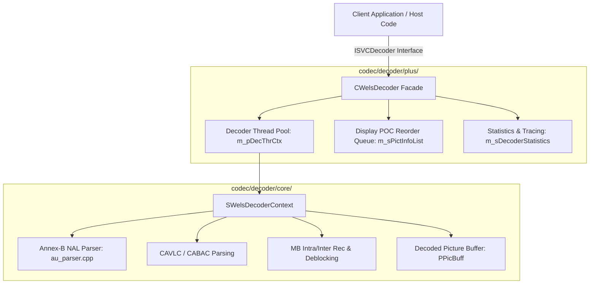
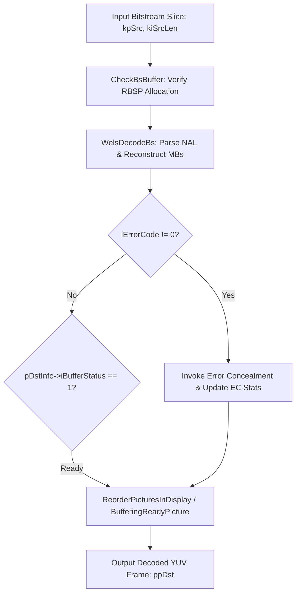
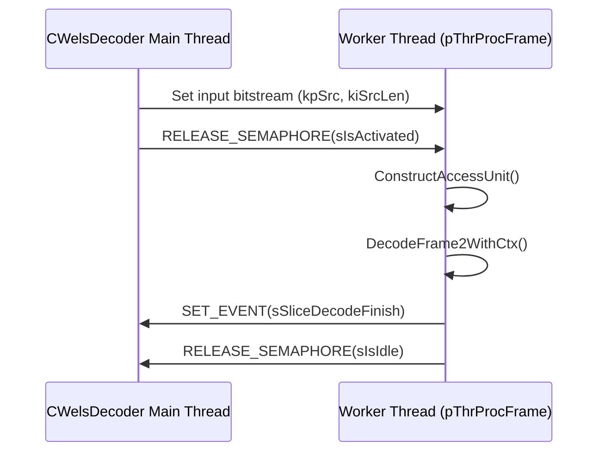

# OpenH264 C++ Decoder Facade Architecture & Implementation: `welsDecoderExt.h`

This document provides a comprehensive, literate-programming-style technical specification for the C++ decoder facade header [`codec/decoder/plus/inc/welsDecoderExt.h`](openh264/codec/decoder/plus/inc/welsDecoderExt.h) and its companion implementation [`codec/decoder/plus/src/welsDecoderExt.cpp`](openh264/codec/decoder/plus/src/welsDecoderExt.cpp).

---

## Table of Contents
1. [Module Overview & Architectural Purpose](#1-module-overview--architectural-purpose)
2. [Class Architecture: CWelsDecoder](#2-class-architecture-cwelsdecoder)
   - [2.1 Class Definition & Inheritance](#21-class-definition--inheritance)
   - [2.2 Member Fields Breakdown](#22-member-fields-breakdown)
3. [Associated Structures & Thread Contexts](#3-associated-structures--thread-contexts)
   - [3.1 SPictInfo & SPictReoderingStatus](#31-spictinfo--spictreoderingstatus)
   - [3.2 SWelsDecoderThreadCTX & SWelsDecThreadInfo](#32-swelsdecoderthreadctx--swelsdecthreadinfo)
   - [3.3 SWelsLastDecPicInfo & SDecoderStatistics](#33-swelslastdecpicinfo--sdecoderstatistics)
4. [Public Method Deep Dive](#4-public-method-deep-dive)
   - [4.1 Lifecycle Management](#41-lifecycle-management)
   - [4.2 Frame Decoding Entry Points](#42-frame-decoding-entry-points)
   - [4.3 Bitstream Parsing API](#43-bitstream-parsing-api)
   - [4.4 Option Management (GetOption / SetOption)](#44-option-management-getoption--setoption)
5. [Internal Core & Multi-Threading Engine](#5-internal-core--multi-threading-engine)
   - [5.1 DecodeFrame2WithCtx & ParseAccessUnit](#51-decodeframe2withctx--parseaccessunit)
   - [5.2 Display Picture Reordering Engine](#52-display-picture-reordering-engine)
   - [5.3 Multi-Threading Worker Thread Model](#53-multi-threading-worker-thread-model)
6. [C-Linkage Public API Factory Functions](#6-c-linkage-public-api-factory-functions)

---

## 1. Module Overview & Architectural Purpose

The header [`welsDecoderExt.h`](openh264/codec/decoder/plus/inc/welsDecoderExt.h) declares the primary C++ decoder implementation class [CWelsDecoder](openh264/codec/decoder/plus/inc/welsDecoderExt.h#L57-L166) within namespace `WelsDec`. It fulfills the pure virtual interface [ISVCDecoder](openh264/codec/api/wels/codec_api.h#L51) declared in the public API [`codec_api.h`](openh264/codec/api/wels/codec_api.h).



### Key Responsibilities
1. **API Facade & Polymorphism**: Implements the virtual method table of [ISVCDecoder](openh264/codec/api/wels/codec_api.h#L51) (`Initialize`, `DecodeFrame2`, `DecodeFrameNoDelay`, `DecodeParser`, `FlushFrame`, `SetOption`, `GetOption`), decoupling host applications from internal C data structures.
2. **Context Lifecycle Orchestration**: Allocates, initializes, resets, and frees the underlying core C context [SWelsDecoderContext](openh264/codec/decoder/core/inc/decoder_context.h#L306-L520) via `WelsInitDecoder()` and `WelsEndDecoder()`.
3. **Multi-Threaded Frame-Level Parallelism**: Coordinates multithreaded frame decoding across multiple worker threads using synchronization semaphores and event primitives.
4. **Display Picture POC Reordering**: Implements a 16-slot picture reordering queue to buffer decoded pictures and emit them in Picture Order Count (POC) display order for streams containing B-slices.
5. **Real-time Diagnostic Metrics**: Collects runtime decoding telemetry (decoding speeds, average QP, error concealment ratios, SPS/PPS loss counts) via [SDecoderStatistics](openh264/codec/api/wels/codec_app_def.h#L249-L278).

---

## 2. Class Architecture: `CWelsDecoder`

### 2.1 Class Definition & Inheritance

```cpp
namespace WelsDec {
  class CWelsDecoder : public ISVCDecoder {
    // ...
  };
}
```

[CWelsDecoder](openh264/codec/decoder/plus/inc/welsDecoderExt.h#L57-L166) inherits publicly from [ISVCDecoder](openh264/codec/api/wels/codec_api.h#L51). It is compiled with export linkage macro `EXTAPI` (`__cdecl` on Win32, default on POSIX/Linux).

---

### 2.2 Member Fields Breakdown

The private member variables of [CWelsDecoder](openh264/codec/decoder/plus/inc/welsDecoderExt.h#L118-L165) maintain the complete execution state, multi-threading synchronization primitives, picture reordering list, and diagnostic loggers:

| Member Variable | Data Type | Description & Lifecycle |
| :--- | :--- | :--- |
| `m_pWelsTrace` | [welsCodecTrace*](openh264/codec/common/inc/welsCodecTrace.h) | Pointer to trace logging utility. Allocated in constructor; destroyed in destructor. |
| `m_uiDecodeTimeStamp` | `uint32_t` | Monotonically increasing relative decoding timestamp counter incremented per access unit. |
| `m_bIsBaseline` | `bool` | True if the active stream profile is Baseline (`profile_idc == 66`) or Constrained Baseline (`83`), bypassing POC reordering. |
| `m_iCpuCount` | `int32_t` | Total logical CPU cores detected on host system via `GetCPUCount()`, clamped to `WELS_DEC_MAX_NUM_CPU` (16). |
| `m_iThreadCount` | `int32_t` | Configured worker thread count (0 = serial single-thread; $\ge 1$ = multithreaded frame decoding). |
| `m_iCtxCount` | `int32_t` | Number of decoder context structures allocated in `m_pDecThrCtx` (equal to $\max(1, \text{m\_iThreadCount})$). |
| `m_pPicBuff` | [PPicBuff](openh264/codec/decoder/core/inc/pic_queue.h) | Pointer to the global decoded picture buffer pool shared among decoder contexts. |
| `m_bParamSetsLostFlag` | `bool` | Flag set when SPS or PPS parameter sets are missing or corrupted in the stream. |
| `m_bFreezeOutput` | `bool` | Flag indicating that output picture rendering is frozen due to unrecoverable bitstream errors. |
| `m_DecCtxActiveCount` | `int32_t` | Count of worker thread contexts currently dispatched and actively processing frames. |
| `m_pDecThrCtx` | [PWelsDecoderThreadCTX](openh264/codec/decoder/core/inc/decoder_context.h#L534-L547) | Dynamically allocated array of thread contexts (`SWelsDecoderThreadCTX[]`). |
| `m_pLastDecThrCtx` | [PWelsDecoderThreadCTX](openh264/codec/decoder/core/inc/decoder_context.h#L534-L547) | Pointer to the thread context that processed the immediately prior frame. |
| `m_iLastBufferedIdx` | `int32_t` | Index of the most recently inserted picture in `m_sPictInfoList`. |
| `m_csDecoder` | `WELS_MUTEX` | Mutex synchronization object protecting cross-thread decoder shared state. |
| `m_sBufferingEvent` | `SWelsDecEvent` | Event signaled when a decoded picture is buffered into the reordering queue. |
| `m_sReleaseBufferEvent` | `SWelsDecEvent` | Event signaled when a buffered picture is ready for release to the caller. |
| `m_sIsBusy` | `SWelsDecSemphore` | Counting semaphore tracking active/busy worker threads. |
| `m_sPictInfoList[16]` | [SPictInfo[16]](openh264/codec/decoder/core/inc/decoder_context.h#L283-L289) | Fixed 16-element array buffering decoded pictures and POC metadata for display reordering. |
| `m_sReoderingStatus` | [SPictReoderingStatus](openh264/codec/decoder/core/inc/decoder_context.h#L291-L300) | State tracking structure managing display-order POC extraction from `m_sPictInfoList`. |
| `m_pDecThrCtxActive[16]` | [PWelsDecoderThreadCTX[16]](openh264/codec/decoder/core/inc/decoder_context.h#L534-L547) | Pointers to active worker thread contexts currently dispatched. |
| `m_sVlcTable` | [SVlcTable](openh264/codec/decoder/core/inc/dec_golomb.h) | Shared CAVLC variable-length coding lookup tables. |
| `m_sLastDecPicInfo` | [SWelsLastDecPicInfo](openh264/codec/decoder/core/inc/decoder_context.h#L271-L281) | Cached parameters of the last decoded picture (NAL header, POC LSB/MSB, DPB pointer). |
| `m_sDecoderStatistics` | [SDecoderStatistics](openh264/codec/api/wels/codec_app_def.h#L249-L278) | Aggregated runtime performance and error telemetry structure. |
| `m_iStreamSeqNum` | `int32_t` | Monotonically incremented sequence ID identifying bitstream resets and parameter set changes. |

---

## 3. Associated Structures & Thread Contexts

### 3.1 `SPictInfo` & `SPictReoderingStatus`

Defined in [`decoder_context.h`](openh264/codec/decoder/core/inc/decoder_context.h#L283-L300), these structures coordinate display picture reordering:

```cpp
typedef struct tagPictInfo {
  SBufferInfo sBufferInfo;          // Decoded YUV planes, strides, and buffer status
  int32_t     iPOC;                 // Picture Order Count (set to IMinInt32 when empty)
  int32_t     iPicBuffIdx;          // Index in PPicBuff reconstructed picture queue
  uint32_t    uiDecodingTimeStamp;  // Sequential AU decode timestamp
  int32_t     iSeqNum;              // Stream sequence number identifier
} SPictInfo, *PPictInfo;

typedef struct tagPictReoderingStatus {
  int32_t iPictInfoIndex;           // Index in m_sPictInfoList selected for output
  int32_t iMinSeqNum;               // Minimum sequence number among buffered pictures
  int32_t iMinPOC;                  // Minimum POC value currently buffered
  int32_t iNumOfPicts;              // Total count of buffered pictures pending output
  int32_t iLastWrittenSeqNum;       // Sequence number of the last emitted frame
  int32_t iLastWrittenPOC;          // POC of the last emitted frame
  int32_t iLargestBufferedPicIndex; // Max populated index in m_sPictInfoList
  bool    bHasBSlice;               // Set to true when B-slices are encountered
} SPictReoderingStatus, *PPictReoderingStatus;
```

---

### 3.2 `SWelsDecoderThreadCTX` & `SWelsDecThreadInfo`

Defined in [`decoder_context.h`](openh264/codec/decoder/core/inc/decoder_context.h#L522-L547), these structures encapsulate worker thread handles and per-thread decoding state:

```cpp
typedef struct tagSWelsDecThread {
  SWelsDecSemphore* sIsBusy;        // Pointer to CWelsDecoder::m_sIsBusy semaphore
  SWelsDecSemphore  sIsActivated;   // Semaphore signaling thread activation
  SWelsDecSemphore  sIsIdle;        // Semaphore signaling thread idle / completion
  SWelsDecThread    sThrHandle;     // OS thread handle (pthread_t / HANDLE)
  uint32_t          uiCommand;      // Command flag: RUN (0) or ABORT (1)
  uint32_t          uiThrNum;       // Thread index (0 .. m_iThreadCount - 1)
  uint32_t          uiThrMaxNum;    // Total worker thread count
  uint32_t          uiThrStackSize; // Stack allocation size (WELS_DEC_MAX_THREAD_STACK_SIZE)
  DECLARE_PROCTHREAD_PTR(pThrProcMain); // Worker thread entry function pointer (pThrProcFrame)
} SWelsDecThreadInfo, *PWelsDecThreadInfo;

typedef struct tagSWelsDecThreadCtx {
  SWelsDecThreadInfo  sThreadInfo;         // Thread synchronization block
  PWelsDecoderContext pCtx;                // Pointer to core SWelsDecoderContext
  void*               threadCtxOwner;      // Pointer to owning CWelsDecoder instance
  uint8_t*            kpSrc;               // Input bitstream slice buffer
  int32_t             kiSrcLen;            // Length of input bitstream in bytes
  uint8_t**           ppDst;               // Output decoded plane buffer pointers
  SBufferInfo         sDstInfo;            // Destination buffer descriptors
  PPicture            pDec;                // Reconstructed target picture pointer
  SWelsDecEvent       sImageReady;         // Event signaling reconstructed image is ready
  SWelsDecEvent       sSliceDecodeStart;   // Event signaling slice decode initiation
  SWelsDecEvent       sSliceDecodeFinish;  // Event signaling slice decode completion
  int32_t             iPicBuffIdx;         // Picture buffer index in DPB
} SWelsDecoderThreadCTX, *PWelsDecoderThreadCTX;
```

---

### 3.3 `SWelsLastDecPicInfo` & `SDecoderStatistics`

- **[SWelsLastDecPicInfo](openh264/codec/decoder/core/inc/decoder_context.h#L271-L281)**: Caches NAL header (`sLastNalHdrExt`), slice header (`sLastSliceHeader`), POC MSB/LSB (`iPrevPicOrderCntMsb`, `iPrevPicOrderCntLsb`), previously decoded DPB picture pointer (`pPreviousDecodedPictureInDpb`), and MMCO 5 flags for error concealment.
- **[SDecoderStatistics](openh264/codec/api/wels/codec_app_def.h#L249-L278)**: Tracks real-time statistics:
  - `uiDecodedFrameCount`: Total decoded frame count.
  - `fAverageFrameSpeedInMs`: Pure decoding time per frame ($\text{ms}$).
  - `fActualAverageFrameSpeedInMs`: Decoding time including frozen/concealed frames.
  - `uiAvgEcRatio`: Cumulative percentage of concealed macroblocks per frame:
    $$\text{uiAvgEcRatio} = \frac{1}{N_{\text{EC}}} \sum_{i=1}^{N_{\text{EC}}} \left( \frac{MB_{\text{concealed}}^{(i)} \cdot 100}{MB_{\text{total}}} \right)$$

---

## 4. Public Method Deep Dive

### 4.1 Lifecycle Management

#### `CWelsDecoder::CWelsDecoder (void)`
- **Purpose**: Constructor.
- **Actions**:
  1. Instantiates [welsCodecTrace](openh264/codec/common/inc/welsCodecTrace.h) and configures trace callback.
  2. Resets reordering buffers via `ResetReorderingPictureBuffers(&m_sReoderingStatus, m_sPictInfoList, true)`.
  3. Queries system CPU core count via `GetCPUCount()`, clamping to `WELS_DEC_MAX_NUM_CPU`.
  4. Allocates thread context array `m_pDecThrCtx = new SWelsDecoderThreadCTX[m_iCtxCount]`.

#### `virtual CWelsDecoder::~CWelsDecoder ()`
- **Purpose**: Destructor.
- **Actions**: Calls `CloseDecoderThreads()`, `UninitDecoder()`, and deletes `m_pWelsTrace` and `m_pDecThrCtx`.

#### `virtual long EXTAPI Initialize (const SDecodingParam* pParam)`
- **Signature**:
  ```cpp
  virtual long EXTAPI Initialize (const SDecodingParam* pParam);
  ```
- **Returns**: `cmResultSuccess` (0) on success; `cmInitParaError` if `pParam == NULL`; `cmMallocMemeError` on allocation failure.
- **Internal Call**: Delegates to [InitDecoder()](openh264/codec/decoder/plus/src/welsDecoderExt.cpp#L373-L397).

#### `virtual long EXTAPI Uninitialize ()`
- **Purpose**: Releases core context resources and tears down memory allocations via [UninitDecoder()](openh264/codec/decoder/plus/src/welsDecoderExt.cpp#L285-L294).

---

### 4.2 Frame Decoding Entry Points

#### `virtual DECODING_STATE EXTAPI DecodeFrame2`
- **Signature**:
  ```cpp
  virtual DECODING_STATE EXTAPI DecodeFrame2 (
      const unsigned char* kpSrc,
      const int            kiSrcLen,
      unsigned char**      ppDst,
      SBufferInfo*         pDstInfo
  );
  ```
- **Description**: Standard synchronous frame decode entry point. Delegates to [DecodeFrame2WithCtx()](openh264/codec/decoder/plus/src/welsDecoderExt.cpp#L735-L916) using context `m_pDecThrCtx[0].pCtx`.

#### `virtual DECODING_STATE EXTAPI DecodeFrameNoDelay`
- **Signature**:
  ```cpp
  virtual DECODING_STATE EXTAPI DecodeFrameNoDelay (
      const unsigned char* kpSrc,
      const int            kiSrcLen,
      unsigned char**      ppDst,
      SBufferInfo*         pDstInfo
  );
  ```
- **Description**: Low-latency decoding without buffering lag.
  - **Multi-threaded mode** (`m_iThreadCount >= 1`): Invokes `ThreadDecodeFrameInternal()` and immediately flushes the ready picture via `ReleaseBufferedReadyPictureReorder()` / `ReleaseBufferedReadyPictureNoReorder()`.
  - **Single-threaded mode**: Invocates `DecodeFrame2(kpSrc, kiSrcLen, ...)` followed immediately by `DecodeFrame2(NULL, 0, ...)` to flush reconstructed frames instantly.

#### `virtual DECODING_STATE EXTAPI DecodeFrame`
- **Signature**:
  ```cpp
  virtual DECODING_STATE EXTAPI DecodeFrame (
      const unsigned char* kpSrc,
      const int            kiSrcLen,
      unsigned char**      ppDst,
      int*                 pStride,
      int&                 iWidth,
      int&                 iHeight
  );
  ```
- **Description**: Legacy wrapper around `DecodeFrame2`. Translates output plane buffer metadata into stride integers and dimensions references (`iWidth`, `iHeight`).

#### `virtual DECODING_STATE EXTAPI FlushFrame`
- **Signature**:
  ```cpp
  virtual DECODING_STATE EXTAPI FlushFrame (
      unsigned char** ppDst,
      SBufferInfo*    pDstInfo
  );
  ```
- **Description**: Flushes remaining buffered pictures when the stream reaches End-Of-Stream (`bEndOfStreamFlag == true`). Emits remaining pictures from `m_sPictInfoList` in POC display order.

---

### 4.3 Bitstream Parsing API

#### `virtual DECODING_STATE EXTAPI DecodeParser`
- **Signature**:
  ```cpp
  virtual DECODING_STATE EXTAPI DecodeParser (
      const unsigned char* kpSrc,
      const int            kiSrcLen,
      SParserBsInfo*       pDstInfo
  );
  ```
- **Description**: Bitstream parse-only mode (`bParseOnly = true`). Parses NAL unit boundaries, SPS/PPS headers, and slice headers without executing motion compensation, IDCT, or pixel reconstruction. Populates [SParserBsInfo](openh264/codec/api/wels/codec_app_def.h#L226-L237) with NAL lengths and slice types.

---

### 4.4 Option Management (`GetOption` / `SetOption`)

#### `SetOption(DECODER_OPTION eOptID, void* pOption)`
Configures decoder runtime options:
- `DECODER_OPTION_NUM_OF_THREADS`: Configures worker thread count (0 to $\min(\text{m\_iCpuCount}, 3)$). Reallocates `m_pDecThrCtx` array.
- `DECODER_OPTION_END_OF_STREAM`: Signals end of input bitstream (`bEndOfStreamFlag = true`).
- `DECODER_OPTION_ERROR_CON_IDC`: Configures active error concealment mode (`ERROR_CON_DISABLE`, `ERROR_CON_FRAME_COPY`, `ERROR_CON_SLICE_MV_COPY_CROSS_IDR_FREEZE_RES_CHANGE`).
- `DECODER_OPTION_TRACE_LEVEL`: Configures trace logging level (`WELS_LOG_ERROR`, `WELS_LOG_WARNING`, `WELS_LOG_INFO`, `WELS_LOG_DEBUG`).
- `DECODER_OPTION_TRACE_CALLBACK`: Sets custom logging callback function pointer.

#### `GetOption(DECODER_OPTION eOptID, void* pOption)`
Queries decoder state:
- `DECODER_OPTION_NUM_OF_FRAMES_REMAINING_IN_BUFFER`: Returns `m_sReoderingStatus.iNumOfPicts`.
- `DECODER_OPTION_GET_STATISTICS`: Copies [SDecoderStatistics](openh264/codec/api/wels/codec_app_def.h#L249-L278) struct.
- `DECODER_OPTION_GET_SAR_INFO`: Retrieves Sample Aspect Ratio (SAR width/height) from active SPS VUI parameters.
- `DECODER_OPTION_PROFILE` / `DECODER_OPTION_LEVEL`: Returns active `uiProfileIdc` and `uiLevelIdc`.

---

## 5. Internal Core & Multi-Threading Engine

### 5.1 `DecodeFrame2WithCtx` & `ParseAccessUnit`



1. **Bitstream Buffer Check**: Invokes `CheckBsBuffer()` to guarantee the internal RBSP buffer can accommodate `kiSrcLen`.
2. **Core NAL Decode**: Executes [WelsDecodeBs()](openh264/codec/decoder/core/src/decoder.cpp) to parse NAL headers, decode slice syntax, perform intra/inter prediction, IDCT, and deblocking.
3. **Error Concealment Fallback**: If `iErrorCode != 0` and error concealment is enabled (`eEcActiveIdc != ERROR_CON_DISABLE`), applies spatial/temporal macroblock concealment and updates error concealment statistics (`uiAvgEcRatio`, `uiAvgEcPropRatio`).

---

### 5.2 Display Picture Reordering Engine

When decoding streams containing B-slices (`m_sReoderingStatus.bHasBSlice == true`), decoding order differs from display order. [CWelsDecoder](openh264/codec/decoder/plus/inc/welsDecoderExt.h#L57) uses three private routines:

1. **`BufferingReadyPicture(pCtx, ppDst, pDstInfo)`**:
   - Inserts newly decoded frame into the vacant slot in `m_sPictInfoList[16]` where `iPOC == IMinInt32`.
   - Records `iPOC = pSliceHeader->iPicOrderCntLsb`, `iSeqNum`, `uiDecodingTimeStamp`, and `iPicBuffIdx`.
2. **`ReleaseBufferedReadyPictureReorder(pCtx, ppDst, pDstInfo, isFlush)`**:
   - Searches `m_sPictInfoList` for the picture with minimum POC:
     $$\text{TargetIdx} = \arg\min_{i} \{ \text{m\_sPictInfoList}[i].\text{iPOC} \mid \text{iPOC} > -2^{31} \}$$
   - Evaluates display readiness condition:
     $$\text{isReady} = (\text{iMinPOC} - \text{iLastWrittenPOC} \le 1) \lor (\text{iMinPOC} < \text{iLastPOC}) \lor \text{isFlush}$$
   - Copies ready frame data to `pDstInfo` / `ppDst`, decrements picture reference count `pPic->iRefCount`, and resets the slot to `IMinInt32`.
3. **`ReleaseBufferedReadyPictureNoReorder(pCtx, ppDst, pDstInfo)`**:
   - Emits pictures strictly ordered by `uiDecodingTimeStamp` when POC reordering is disabled.

---

### 5.3 Multi-Threading Worker Thread Model

Multi-threaded frame decoding operates via a master-worker model using [SWelsDecoderThreadCTX](openh264/codec/decoder/core/inc/decoder_context.h#L534-L547):



- **Thread Initialization (`OpenDecoderThreads`)**: Creates `m_iThreadCount` OS threads running `pThrProcInit` $\to$ `pThrProcFrame`.
- **Worker Loop (`pThrProcFrame`)**:
  ```cpp
  DECLARE_PROCTHREAD (pThrProcFrame, p) {
    SWelsDecoderThreadCTX* pThrCtx = (SWelsDecoderThreadCTX*)p;
    while (1) {
      RELEASE_SEMAPHORE (pThrCtx->sThreadInfo.sIsBusy);
      RELEASE_SEMAPHORE (&pThrCtx->sThreadInfo.sIsIdle);
      WAIT_SEMAPHORE (&pThrCtx->sThreadInfo.sIsActivated, WELS_DEC_THREAD_WAIT_INFINITE);
      if (pThrCtx->sThreadInfo.uiCommand == WELS_DEC_THREAD_COMMAND_RUN) {
        CWelsDecoder* pWelsDecoder = (CWelsDecoder*)pThrCtx->threadCtxOwner;
        ConstructAccessUnit (pWelsDecoder, pThrCtx);
      } else if (pThrCtx->sThreadInfo.uiCommand == WELS_DEC_THREAD_COMMAND_ABORT) {
        break;
      }
    }
    return 0;
  }
  ```

---

## 6. C-Linkage Public API Factory Functions

The following C-linkage factory functions defined in [`welsDecoderExt.cpp`](openh264/codec/decoder/plus/src/welsDecoderExt.cpp#L1404-L1450) instantiate and manage `CWelsDecoder`:

```cpp
extern "C" {
  int  WelsGetDecoderCapability (SDecoderCapability* pDecCapability);
  long WelsCreateDecoder (ISVCDecoder** ppDecoder);
  void WelsDestroyDecoder (ISVCDecoder* pDecoder);
}
```

- **`WelsGetDecoderCapability(SDecoderCapability* pDecCapability)`**:
  - Sets `iProfileIdc = 66` (Baseline Profile).
  - Sets `iProfileIop = 0xE0`.
  - Sets `iLevelIdc = 32` (Level 3.2).
  - Sets `iMaxMbps = 216000`, `iMaxFs = 5120`, `iMaxCpb = 20000`, `iMaxDpb = 20480`, `iMaxBr = 20000`.
- **`WelsCreateDecoder(ISVCDecoder** ppDecoder)`**:
  - Dynamically allocates a new instance: `*ppDecoder = new CWelsDecoder()`. Returns `0` (`ERR_NONE`) on success.
- **`WelsDestroyDecoder(ISVCDecoder* pDecoder)`**:
  - Safely deletes the instance: `delete (CWelsDecoder*)pDecoder`.
