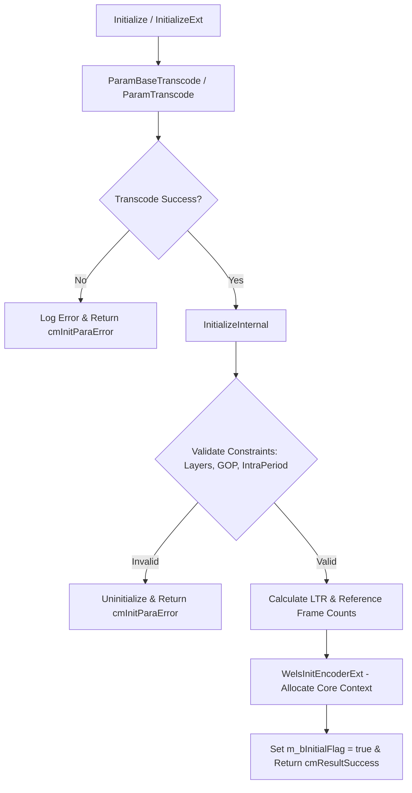
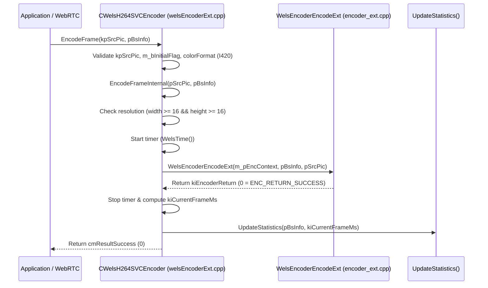
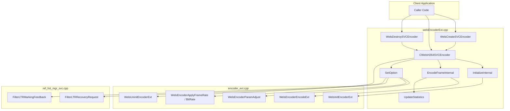

# Literate Programming: `codec/encoder/plus/src/welsEncoderExt.cpp`

## 1. Architectural Role & Module Overview

The source file [`codec/encoder/plus/src/welsEncoderExt.cpp`](openh264/codec/encoder/plus/src/welsEncoderExt.cpp) implements the public C++ facade and lifecycle controller for the OpenH264 video encoder subsystem.

It defines the class [`WelsEnc::CWelsH264SVCEncoder`](openh264/codec/encoder/plus/src/welsEncoderExt.cpp#L62-L1372), which inherits from the pure virtual interface [`ISVCEncoder`](openh264/codec/api/wels/codec_api.h#L243-L280). It serves as the primary abstraction boundary between client applications (such as WebRTC media engines, video conferencing servers, and command-line test harnesses) and the low-level, high-performance C-based video encoding core ([`sWelsEncCtx`](openh264/codec/encoder/core/inc/encoder_context.h#L116-L238)).

```mermaid
flowchart TB
    subgraph Client Application Layer
        App[WebRTC / Media Application]
    end

    subgraph Public C / C++ Facade: codec/encoder/plus/
        Factory[WelsCreateSVCEncoder / WelsDestroySVCEncoder]
        ISVCEncoder["ISVCEncoder (Abstract Interface)"]
        CWelsEnc["CWelsH264SVCEncoder (welsEncoderExt.cpp)"]
        Trace["welsCodecTrace (Logging & Callbacks)"]
    end

    subgraph Internal Encoder Core: codec/encoder/core/
        EncCtx["sWelsEncCtx (Encoder Core Context)"]
        Init["WelsInitEncoderExt()"]
        Encode["WelsEncoderEncodeExt()"]
        Adjust["WelsEncoderParamAdjust()"]
        Uninit["WelsUninitEncoderExt()"]
    end

    App -->|Create Instance| Factory
    Factory -->|Instantiate| CWelsEnc
    App -->|Invoke API Methods| ISVCEncoder
    ISVCEncoder <|-- CWelsEnc
    CWelsEnc -->|Log & Telemetry| Trace
    CWelsEnc -->|Initialize| Init
    CWelsEnc -->|Encode Frame| Encode
    CWelsEnc -->|Dynamic Reconfig| Adjust
    CWelsEnc -->|Teardown| Uninit
    Init --> EncCtx
    Encode --> EncCtx
```

### Key Responsibilities of `welsEncoderExt.cpp`
1. **Public Interface Implementation**: Implements the virtual method contract defined in [`ISVCEncoder`](openh264/codec/api/wels/codec_api.h#L243-L280), including initialization, frame encoding, parameter set generation, instantaneous decoder refresh (IDR) keyframe triggering, runtime option configuration, and clean teardown.
2. **Configuration Validation & Normalization**: Translates user-facing configuration structures ([`SEncParamBase`](openh264/codec/api/wels/codec_app_def.h#L404-L417) and [`SEncParamExt`](openh264/codec/api/wels/codec_app_def.h#L419-L498)) into internal configuration representations ([`SWelsSvcCodingParam`](openh264/codec/encoder/core/inc/param_svc.h#L110-L245)), rigorously validating constraints on spatial layers, temporal layers, GOP hierarchy, LTR references, and loop filter offsets.
3. **Dynamic Reconfiguration Dispatching**: Houses the large runtime option dispatcher [`SetOption()`](openh264/codec/encoder/plus/src/welsEncoderExt.cpp#L692-L1198) and getter [`GetOption()`](openh264/codec/encoder/plus/src/welsEncoderExt.cpp#L1200-L1313) to adjust bitrates, frame rates, rate control modes, slice threading parameters, profile/level IDC, and Long-Term Reference (LTR) recovery signaling on the fly without interrupting real-time encoding sessions.
4. **Encoding Telemetry & Performance Statistics**: Collects per-frame microsecond latency, computes exponential moving averages of encoding speed, verifies timestamp monotonicity, and monitors bitrate / framerate deviations across each spatial layer ([`SEncoderStatistics`](openh264/codec/api/wels/codec_app_def.h#L605-L627)).
5. **C-Linkage Factory Exports**: Exposes global C functions ([`WelsCreateSVCEncoder`](openh264/codec/encoder/plus/src/welsEncoderExt.cpp#L1376-L1382), [`WelsDestroySVCEncoder`](openh264/codec/encoder/plus/src/welsEncoderExt.cpp#L1384-L1391), [`WelsGetCodecVersion`](openh264/codec/encoder/plus/src/welsEncoderExt.cpp#L1393-L1395), [`WelsGetCodecVersionEx`](openh264/codec/encoder/plus/src/welsEncoderExt.cpp#L1397-L1399)) for dynamic library symbol loading across shared object / DLL boundaries.

---

## 2. Data Structures & Class Member Breakdown

### 2.1 Class Definition: `CWelsH264SVCEncoder`

The primary class defined in this compilation unit is [`WelsEnc::CWelsH264SVCEncoder`](openh264/codec/encoder/plus/inc/welsEncoderExt.h#L59-L127).

```cpp
namespace WelsEnc {
class CWelsH264SVCEncoder : public ISVCEncoder {
 private:
  sWelsEncCtx*      m_pEncContext;
  welsCodecTrace*   m_pWelsTrace;
  int32_t           m_iMaxPicWidth;
  int32_t           m_iMaxPicHeight;
  int32_t           m_iCspInternal;
  bool              m_bInitialFlag;

#ifdef OUTPUT_BIT_STREAM
  FILE*             m_pFileBs;
  FILE*             m_pFileBsSize;
  bool              m_bSwitch;
  int32_t           m_iSwitchTimes;
#endif

#ifdef REC_FRAME_COUNT
  int32_t           m_uiCountFrameNum;
#endif
  ...
};
}
```

#### Member Variables Table

| Member Variable | Data Type | Default / Range | Purpose & Lifecycle |
| :--- | :--- | :--- | :--- |
| [`m_pEncContext`](openh264/codec/encoder/plus/inc/welsEncoderExt.h#L105) | [`sWelsEncCtx*`](openh264/codec/encoder/core/inc/encoder_context.h#L116) | `NULL` | Pointer to the internal C encoder core context structure. Allocated and initialized via [`WelsInitEncoderExt()`](openh264/codec/encoder/core/src/encoder_ext.cpp); freed via [`WelsUninitEncoderExt()`](openh264/codec/encoder/core/src/encoder_ext.cpp). |
| [`m_pWelsTrace`](openh264/codec/encoder/plus/inc/welsEncoderExt.h#L107) | [`welsCodecTrace*`](openh264/codec/common/inc/welsCodecTrace.h#L43) | `NULL` | Codec trace object managing logger level filtering, custom trace callbacks, callback context pointers, and structured log message formatting. |
| [`m_iMaxPicWidth`](openh264/codec/encoder/plus/inc/welsEncoderExt.h#L108) | `int32_t` | `0` ($\ge 16$) | Maximum active video frame width in luma samples across all configured spatial dependency layers. |
| [`m_iMaxPicHeight`](openh264/codec/encoder/plus/inc/welsEncoderExt.h#L109) | `int32_t` | `0` ($\ge 16$) | Maximum active video frame height in luma samples across all configured spatial dependency layers. |
| [`m_iCspInternal`](openh264/codec/encoder/plus/inc/welsEncoderExt.h#L111) | `int32_t` | `0` | Internal color space representation setting, configured via `ENCODER_OPTION_DATAFORMAT`. |
| [`m_bInitialFlag`](openh264/codec/encoder/plus/inc/welsEncoderExt.h#L112) | `bool` | `false` | Boolean state latch indicating whether the encoder instance has been successfully initialized and is ready to process input frames. |
| `m_pFileBs` | `FILE*` | `NULL` | Debug bitstream output file handle (compiled only under `OUTPUT_BIT_STREAM`). |
| `m_pFileBsSize` | `FILE*` | `NULL` | Debug frame size output file handle (compiled only under `OUTPUT_BIT_STREAM`). |
| `m_bSwitch` | `bool` | `false` | Debug flag indicating a dynamic resolution switch event. |
| `m_iSwitchTimes` | `int32_t` | `0` | Debug counter tracking the number of dynamic resolution switches. |
| `m_uiCountFrameNum` | `int32_t` | `0` | Debug cumulative frame counter (compiled only under `REC_FRAME_COUNT`). |

---

## 3. Detailed Method & Function Deep Dive

### 3.1 Constructor, Destructor & Core Helper

#### `CWelsH264SVCEncoder::CWelsH264SVCEncoder()`
* **Source Location**: [welsEncoderExt.cpp:L62-L132](openh264/codec/encoder/plus/src/welsEncoderExt.cpp#L62-L132)
* **Signature**: `CWelsH264SVCEncoder::CWelsH264SVCEncoder()`
* **Purpose**: Instantiates the encoder wrapper, zero-initializes member variables, optionally generates timestamped debug output file names if `OUTPUT_BIT_STREAM` is active, and invokes `InitEncoder()`.

#### `CWelsH264SVCEncoder::~CWelsH264SVCEncoder()`
* **Source Location**: [welsEncoderExt.cpp:L134-L162](openh264/codec/encoder/plus/src/welsEncoderExt.cpp#L134-L162)
* **Signature**: `virtual CWelsH264SVCEncoder::~CWelsH264SVCEncoder()`
* **Purpose**: Safe teardown. Logs destruction via `WelsLog`, closes debug file handles, calls [`Uninitialize()`](openh264/codec/encoder/plus/src/welsEncoderExt.cpp#L353-L369) to deallocate the core context `m_pEncContext`, and frees the trace logger `m_pWelsTrace`.

#### `void CWelsH264SVCEncoder::InitEncoder(void)`
* **Source Location**: [welsEncoderExt.cpp:L164-L171](openh264/codec/encoder/plus/src/welsEncoderExt.cpp#L164-L171)
* **Signature**: `void CWelsH264SVCEncoder::InitEncoder(void)`
* **Purpose**: Allocates a new instance of [`welsCodecTrace`](openh264/codec/common/inc/welsCodecTrace.h#L43) and binds `this` encoder instance pointer to the tracer via `m_pWelsTrace->SetCodecInstance(this)`.

---

### 3.2 Encoder Initialization & Parameter Translation



#### `int CWelsH264SVCEncoder::GetDefaultParams(SEncParamExt* argv)`
* **Source Location**: [welsEncoderExt.cpp:L175-L178](openh264/codec/encoder/plus/src/welsEncoderExt.cpp#L175-L178)
* **Signature**: `int CWelsH264SVCEncoder::GetDefaultParams(SEncParamExt* argv)`
* **Parameters**: `argv` — Pointer to target [`SEncParamExt`](openh264/codec/api/wels/codec_app_def.h#L419-L498) structure.
* **Returns**: `cmResultSuccess` (`0`).
* **Behavior**: Invokes [`SWelsSvcCodingParam::FillDefault(*argv)`](openh264/codec/encoder/core/inc/param_svc.h#L274) to populate the struct with sensible default encoder parameters (e.g. single spatial layer, camera usage type, RC enabled, default QP=26).

#### `int CWelsH264SVCEncoder::Initialize(const SEncParamBase* argv)`
* **Source Location**: [welsEncoderExt.cpp:L183-L208](openh264/codec/encoder/plus/src/welsEncoderExt.cpp#L183-L208)
* **Signature**: `int CWelsH264SVCEncoder::Initialize(const SEncParamBase* argv)`
* **Parameters**: `argv` — Pointer to basic configuration struct [`SEncParamBase`](openh264/codec/api/wels/codec_app_def.h#L404-L417).
* **Behavior**: Transcodes the base parameters into an internal [`SWelsSvcCodingParam`](openh264/codec/encoder/core/inc/param_svc.h#L110) instance via `sConfig.ParamBaseTranscode(*argv)` and passes it to `InitializeInternal(&sConfig)`.

#### `int CWelsH264SVCEncoder::InitializeExt(const SEncParamExt* argv)`
* **Source Location**: [welsEncoderExt.cpp:L210-L235](openh264/codec/encoder/plus/src/welsEncoderExt.cpp#L210-L235)
* **Signature**: `int CWelsH264SVCEncoder::InitializeExt(const SEncParamExt* argv)`
* **Parameters**: `argv` — Pointer to extended configuration struct [`SEncParamExt`](openh264/codec/api/wels/codec_app_def.h#L419-L498).
* **Behavior**: Transcodes the full extended parameters via `sConfig.ParamTranscode(*argv)` and delegates to `InitializeInternal(&sConfig)`.

#### `int CWelsH264SVCEncoder::InitializeInternal(SWelsSvcCodingParam* pCfg)`
* **Source Location**: [welsEncoderExt.cpp:L237-L348](openh264/codec/encoder/plus/src/welsEncoderExt.cpp#L237-L348)
* **Signature**: `int CWelsH264SVCEncoder::InitializeInternal(SWelsSvcCodingParam* pCfg)`
* **Parameters**: `pCfg` — Pointer to fully populated internal SVC configuration parameters.
* **Algorithmic Breakdown & Validation Constraints**:

1. **Re-initialization Guard**:
   If `m_bInitialFlag` is already `true`, warns and calls `Uninitialize()` first to flush existing allocations.
2. **Layer Count Constraints**:
   - Spatial layers: $1 \le \text{iSpatialLayerNum} \le \text{MAX\_DEPENDENCY\_LAYER} = 4$.
   - Temporal layers: Clamped to $[1, \text{MAX\_TEMPORAL\_LEVEL} = 5]$.
3. **GOP Size & Intra Period Constraints**:
   - GOP size range: $1 \le \text{uiGopSize} \le \text{MAX\_GOP\_SIZE} = 64$.
   - Power-of-two requirement:
     $$\text{WELS\_POWER2\_IF}(\text{uiGopSize}) \implies (\text{uiGopSize} \& (\text{uiGopSize} - 1)) == 0$$
   - Intra period relationship: $\text{uiIntraPeriod} == 0$ (unlimited) OR $\text{uiIntraPeriod} \ge \text{uiGopSize}$ AND $\text{uiIntraPeriod}$ must be an exact multiple of $\text{uiGopSize}$:
     $$\text{uiIntraPeriod} \& (\text{uiGopSize} - 1) == 0$$
4. **Reference Frame & LTR Configuration**:
   - For Screen Content Sharing (`iUsageType == SCREEN_CONTENT_REAL_TIME`):
     - If LTR enabled:
       $$\text{iLTRRefNum} = \text{LONG\_TERM\_REF\_NUM\_SCREEN} = 2$$
       $$\text{iNumRefFrame} = \max(1, \lfloor\log_2(\text{uiGopSize})\rfloor) + \text{iLTRRefNum}$$
     - If LTR disabled: $\text{iLTRRefNum} = 0$, $\text{iNumRefFrame} = \max(1, \text{uiGopSize} \gg 1)$.
   - For Camera Video Content:
     - $\text{iLTRRefNum} = \text{bEnableLongTermReference} \,?\, \text{LONG\_TERM\_REF\_NUM} (1) : 0$.
     - When auto-reference count is requested (`iNumRefFrame == AUTO_REF_PIC_COUNT`):
       $$\text{iNumRefFrame} = \text{clip3}\left(\left(\frac{\text{uiGopSize}}{2} > 1 \,?\, \frac{\text{uiGopSize}}{2} + \text{iLTRRefNum} : \text{MIN\_REF\_PIC\_COUNT} + \text{iLTRRefNum}\right), 1, 16\right)$$
5. **Temporal Scalability Stages & Loop Filter Offsets**:
   $$\text{kiDecStages} = \lfloor\log_2(\text{uiGopSize})\rfloor \implies \text{iTemporalLayerNum} = 1 + \text{kiDecStages}$$
   $$\text{iLoopFilterAlphaC0Offset} = \text{clip3}(\text{iLoopFilterAlphaC0Offset}, -6, 6)$$
   $$\text{iLoopFilterBetaOffset} = \text{clip3}(\text{iLoopFilterBetaOffset}, -6, 6)$$
6. **Core Context Allocation**:
   Invokes [`WelsInitEncoderExt(&m_pEncContext, pCfg, &m_pWelsTrace->m_sLogCtx, NULL)`](openh264/codec/encoder/core/src/encoder_ext.cpp). If initialization succeeds, sets `m_bInitialFlag = true` and returns `cmResultSuccess` (`0`).

#### `int32_t CWelsH264SVCEncoder::Uninitialize()`
* **Source Location**: [welsEncoderExt.cpp:L353-L369](openh264/codec/encoder/plus/src/welsEncoderExt.cpp#L353-L369)
* **Signature**: `virtual int32_t CWelsH264SVCEncoder::Uninitialize()`
* **Purpose**: Releases core encoder memory by calling [`WelsUninitEncoderExt(&m_pEncContext)`](openh264/codec/encoder/core/src/encoder_ext.cpp), sets `m_pEncContext = NULL`, and clears `m_bInitialFlag = false`.

---

### 3.3 Frame Encoding Pipeline



#### `int CWelsH264SVCEncoder::EncodeFrame(const SSourcePicture* kpSrcPic, SFrameBSInfo* pBsInfo)`
* **Source Location**: [welsEncoderExt.cpp:L375-L401](openh264/codec/encoder/plus/src/welsEncoderExt.cpp#L375-L401)
* **Signature**: `virtual int CWelsH264SVCEncoder::EncodeFrame(const SSourcePicture* kpSrcPic, SFrameBSInfo* pBsInfo)`
* **Input Validation**:
  - Checks non-null pointers `kpSrcPic`, `pBsInfo`, and ensures `m_bInitialFlag == true`.
  - Verifies input color format: `kpSrcPic->iColorFormat == videoFormatI420`. Returns `cmInitParaError` if format is unsupported.
* **Delegation**: Calls `EncodeFrameInternal(kpSrcPic, pBsInfo)`.

#### `int CWelsH264SVCEncoder::EncodeFrameInternal(const SSourcePicture* pSrcPic, SFrameBSInfo* pBsInfo)`
* **Source Location**: [welsEncoderExt.cpp:L404-L482](openh264/codec/encoder/plus/src/welsEncoderExt.cpp#L404-L482)
* **Signature**: `virtual int CWelsH264SVCEncoder::EncodeFrameInternal(const SSourcePicture* pSrcPic, SFrameBSInfo* pBsInfo)`
* **Execution Steps**:
  1. Validates minimum dimensions: `pSrcPic->iPicWidth >= 16` and `pSrcPic->iPicHeight >= 16`.
  2. Records entry timestamp: `kiBeforeFrameUs = WelsTime()`.
  3. Executes internal encoding engine:
     ```cpp
     const int32_t kiEncoderReturn = WelsEncoderEncodeExt(m_pEncContext, pBsInfo, pSrcPic);
     ```
  4. Calculates execution duration in milliseconds:
     $$\text{kiCurrentFrameMs} = \frac{\text{WelsTime}() - \text{kiBeforeFrameUs}}{1000}$$
  5. **Return Code Error Mapping**:
     - `ENC_RETURN_MEMALLOCERR`, `ENC_RETURN_MEMOVERFLOWFOUND`, `ENC_RETURN_VLCOVERFLOWFOUND`: Tears down context via `WelsUninitEncoderExt(&m_pEncContext)` and returns `cmMallocMemeError`.
     - `ENC_RETURN_INVALIDINPUT`: Returns `cmUnsupportedData`.
     - `ENC_RETURN_CORRECTED` / unknown error: Returns `cmUnknownReason`.
  6. Calls `UpdateStatistics(pBsInfo, kiCurrentFrameMs)` to record telemetry.

#### `int CWelsH264SVCEncoder::EncodeParameterSets(SFrameBSInfo* pBsInfo)`
* **Source Location**: [welsEncoderExt.cpp:L484-L486](openh264/codec/encoder/plus/src/welsEncoderExt.cpp#L484-L486)
* **Signature**: `virtual int CWelsH264SVCEncoder::EncodeParameterSets(SFrameBSInfo* pBsInfo)`
* **Purpose**: Encodes standalone SPS / PPS (Sequence / Picture Parameter Sets) and subset SPS NAL units into `pBsInfo` without encoding picture pixel data by calling [`WelsEncoderEncodeParameterSets(m_pEncContext, pBsInfo)`](openh264/codec/encoder/core/src/encoder_ext.cpp).

#### `int CWelsH264SVCEncoder::ForceIntraFrame(bool bIDR, int iLayerId)`
* **Source Location**: [welsEncoderExt.cpp:L491-L504](openh264/codec/encoder/plus/src/welsEncoderExt.cpp#L491-L504)
* **Signature**: `virtual int CWelsH264SVCEncoder::ForceIntraFrame(bool bIDR, int iLayerId)`
* **Parameters**:
  - `bIDR`: Flag requesting an Instantaneous Decoder Refresh (IDR) keyframe.
  - `iLayerId`: Specific spatial layer index (`-1` for all spatial layers).
* **Behavior**: When `bIDR == true`, calls [`ForceCodingIDR(m_pEncContext, iLayerId)`](openh264/codec/encoder/core/src/encoder_ext.cpp).

---

### 3.4 Telemetry, Profiling & Statistics Collection

#### `void CWelsH264SVCEncoder::TraceParamInfo(SEncParamExt* pParam)`
* **Source Location**: [welsEncoderExt.cpp:L505-L567](openh264/codec/encoder/plus/src/welsEncoderExt.cpp#L505-L567)
* **Signature**: `void CWelsH264SVCEncoder::TraceParamInfo(SEncParamExt* pParam)`
* **Purpose**: Dumps comprehensive debug log information via `WelsLog` detailing all global encoder configuration settings (usage type, target/max bitrates, rate control mode, temporal/spatial layer counts, frame rate, intra period, SPS/PPS ID strategy, denoise, background detection, scene change detection, adaptive quantization, LTR period, threading mode, loop filter offsets, and QP boundaries) along with per-spatial-layer configurations (`sSpatialLayers[i]`).

#### `void CWelsH264SVCEncoder::LogStatistics(const int64_t kiCurrentFrameTs, int32_t iMaxDid)`
* **Source Location**: [welsEncoderExt.cpp:L569-L583](openh264/codec/encoder/plus/src/welsEncoderExt.cpp#L569-L583)
* **Signature**: `void CWelsH264SVCEncoder::LogStatistics(const int64_t kiCurrentFrameTs, int32_t iMaxDid)`
* **Purpose**: Iterates over all active spatial dependency layers ($0 \le \text{iDid} \le \text{iMaxDid}$) and logs current statistics stored in [`m_pEncContext->sEncoderStatistics[iDid]`](openh264/codec/api/wels/codec_app_def.h#L605-L627).

#### `void CWelsH264SVCEncoder::UpdateStatistics(SFrameBSInfo* pBsInfo, const int64_t kiCurrentFrameMs)`
* **Source Location**: [welsEncoderExt.cpp:L585-L687](openh264/codec/encoder/plus/src/welsEncoderExt.cpp#L585-L687)
* **Signature**: `void CWelsH264SVCEncoder::UpdateStatistics(SFrameBSInfo* pBsInfo, const int64_t kiCurrentFrameMs)`
* **Mathematical Formulations for Telemetry**:

1. **Cumulative Average Encoding Speed ($S_{\text{avg}}$)**:
   For non-skipped frames, updates the moving average frame encoding duration:
   $$S_{\text{avg}}^{(N)} = S_{\text{avg}}^{(N-1)} + \frac{\text{kiCurrentFrameMs} - S_{\text{avg}}^{(N-1)}}{N_{\text{processed}}}$$
   where $N_{\text{processed}} = \text{uiInputFrameCount} - \text{uiSkippedFrameCount}$.

2. **Long-Term Average Frame Rate ($F_{\text{avg}}$)**:
   Calculated after an initial warm-up period ($\text{kiCurrentFrameTs} - \text{uiStartTimestamp} > 800\text{ ms}$):
   $$F_{\text{avg}} = \frac{\text{uiInputFrameCount} \times 1000}{\text{kiCurrentFrameTs} - \text{uiStartTimestamp}}$$

3. **Windowed Latest Frame Rate ($F_{\text{latest}}$) and Bitrate ($R_{\text{bitrate}}$)**:
   When the frame delta since the last log interval exceeds $2 \times f_{\text{MaxFrameRate}}$ and the time delta $\Delta T_{\text{sec}} = \frac{\text{kiTimeDiff}}{1000.0} \ge \frac{\text{iStatisticsLogInterval}}{1000.0}$:
   $$F_{\text{latest}} = \frac{\text{uiInputFrameCount} - \text{iLastStatisticsFrameCount}}{\Delta T_{\text{sec}}}$$
   $$R_{\text{bitrate}} = \frac{\text{iTotalEncodedBytes} \times 8}{\Delta T_{\text{sec}}} \quad \text{[bps]}$$

4. **Frame Rate Deviation Warning**:
   If $|F_{\text{latest}} - f_{\text{MaxFrameRate}}| > 30\text{ fps}$, logs a `WELS_LOG_WARNING` alerting the caller that input timestamps or capture frame rates deviate significantly from configured values.

---

### 3.5 Dynamic Option Configuration (`SetOption` & `GetOption`)

#### `int CWelsH264SVCEncoder::SetOption(ENCODER_OPTION eOptionId, void* pOption)`
* **Source Location**: [welsEncoderExt.cpp:L692-L1198](openh264/codec/encoder/plus/src/welsEncoderExt.cpp#L692-L1198)
* **Signature**: `virtual int CWelsH264SVCEncoder::SetOption(ENCODER_OPTION eOptionId, void* pOption)`
* **Dispatched Option IDs Table**:

| Option ID (`ENCODER_OPTION`) | Input Data Type | Core Action & Invoked Subroutines |
| :--- | :--- | :--- |
| `ENCODER_OPTION_DATAFORMAT` | `int32_t*` | Updates internal color space format `m_iCspInternal`. |
| `ENCODER_OPTION_IDR_INTERVAL` | `int32_t*` | Updates IDR / Intra refresh period `m_pEncContext->pSvcParam->uiIntraPeriod`. |
| `ENCODER_OPTION_SVC_ENCODE_PARAM_BASE` | `SEncParamBase*` | Transcodes base configuration, determines temporal settings, and executes live memory/layer adaptation via [`WelsEncoderParamAdjust()`](openh264/codec/encoder/core/src/encoder_ext.cpp). |
| `ENCODER_OPTION_SVC_ENCODE_PARAM_EXT` | `SEncParamExt*` | Live reconfiguration of full multi-layer SVC parameters via [`WelsEncoderParamAdjust()`](openh264/codec/encoder/core/src/encoder_ext.cpp). |
| `ENCODER_OPTION_FRAME_RATE` | `float*` | Clips frame rate to $[\text{MIN\_FRAME\_RATE}, \text{MAX\_FRAME\_RATE}]$ and updates rate control via [`WelsEncoderApplyFrameRate()`](openh264/codec/encoder/core/src/encoder_ext.cpp). |
| `ENCODER_OPTION_BITRATE` | `SBitrateInfo*` | Updates target bitrate for all layers (`SPATIAL_LAYER_ALL`) or a specific layer (`SPATIAL_LAYER_0..3`) via [`WelsEncoderApplyBitRate()`](openh264/codec/encoder/core/src/encoder_ext.cpp). |
| `ENCODER_OPTION_MAX_BITRATE` | `SBitrateInfo*` | Updates upper bitrate ceiling for all layers or a specific spatial layer. |
| `ENCODER_OPTION_RC_MODE` | `int32_t*` | Modifies rate control mode (`RC_QUALITY_MODE`, `RC_BITRATE_MODE`, `RC_BUFFERBASED_MODE`, `RC_TIMESTAMP_MODE`, `RC_OFF_MODE`) and re-initializes RC function pointer tables via [`WelsRcInitFuncPointers()`](openh264/codec/encoder/core/src/ratectl.cpp). |
| `ENCODER_OPTION_RC_FRAME_SKIP` | `bool*` | Enables or disables rate-control-driven frame dropping (`bEnableFrameSkip`). |
| `ENCODER_PADDING_PADDING` | `int32_t*` | Sets picture padding flag `iPaddingFlag`. |
| `ENCODER_LTR_RECOVERY_REQUEST` | `SLTRRecoverRequest*` | Signals LTR recovery request to the reference list manager via [`FilterLTRRecoveryRequest()`](openh264/codec/encoder/core/src/ref_list_mgr_svc.cpp). |
| `ENCODER_LTR_MARKING_FEEDBACK` | `SLTRMarkingFeedback*` | Signals LTR marking acknowledgment feedback from the receiver via [`FilterLTRMarkingFeedback()`](openh264/codec/encoder/core/src/ref_list_mgr_svc.cpp). |
| `ENCODER_LTR_MARKING_PERIOD` | `uint32_t*` | Sets periodic LTR marking interval `iLtrMarkPeriod`. |
| `ENCODER_OPTION_LTR` | `SLTRConfig*` | Configures LTR support and reference frame count via [`WelsEncoderApplyLTR()`](openh264/codec/encoder/core/src/encoder_ext.cpp). |
| `ENCODER_OPTION_ENABLE_PREFIX_NAL_ADDING` | `bool*` | Controls insertion of SVC Prefix NAL units before base layer slices (`bPrefixNalAddingCtrl`). |
| `ENCODER_OPTION_SPS_PPS_ID_STRATEGY` | `int32_t*` | Controls SPS/PPS ID assignment strategy (`CONSTANT_ID`, `INCREASING_ID`, `SPS_LISTING`, `SPS_LISTING_AND_PPS_INCREASING`, `SPS_PPS_LISTING`). |
| `ENCODER_OPTION_TRACE_LEVEL` | `uint32_t*` | Configures logging verbosity level in `m_pWelsTrace`. |
| `ENCODER_OPTION_TRACE_CALLBACK` | `WelsTraceCallback*` | Installs custom log callback function in `m_pWelsTrace`. |
| `ENCODER_OPTION_TRACE_CALLBACK_CONTEXT`| `void**` | Sets custom context pointer passed to the trace callback. |
| `ENCODER_OPTION_PROFILE` | `SProfileInfo*` | Configures H.264 profile IDC for a spatial layer via [`CheckProfileSetting()`](openh264/codec/encoder/core/src/encoder_ext.cpp). |
| `ENCODER_OPTION_LEVEL` | `SLevelInfo*` | Configures H.264 level IDC for a spatial layer via [`CheckLevelSetting()`](openh264/codec/encoder/core/src/encoder_ext.cpp). |
| `ENCODER_OPTION_NUMBER_REF` | `int32_t*` | Adjusts reference frame count via [`CheckReferenceNumSetting()`](openh264/codec/encoder/core/src/encoder_ext.cpp). |
| `ENCODER_OPTION_DELIVERY_STATUS` | `SDeliveryStatus*` | Sets packet delivery acknowledgment flag `bDeliveryFlag`. |
| `ENCODER_OPTION_COMPLEXITY` | `int32_t*` | Sets encoder complexity preset `iComplexityMode` (`LOW_COMPLEXITY`, `MEDIUM_COMPLEXITY`, `HIGH_COMPLEXITY`). |
| `ENCODER_OPTION_STATISTICS_LOG_INTERVAL`| `int32_t*`| Configures statistics logging interval in milliseconds `iStatisticsLogInterval`. |
| `ENCODER_OPTION_IS_LOSSLESS_LINK` | `bool*` | Sets lossless network link flag `bIsLosslessLink`. |
| `ENCODER_OPTION_BITS_VARY_PERCENTAGE` | `int32_t*` | Configures bitrate variation tolerance range $[0, 100]\%$ via [`WelsEncoderApplyBitVaryRang()`](openh264/codec/encoder/core/src/encoder_ext.cpp). |

#### `int CWelsH264SVCEncoder::GetOption(ENCODER_OPTION eOptionId, void* pOption)`
* **Source Location**: [welsEncoderExt.cpp:L1200-L1313](openh264/codec/encoder/plus/src/welsEncoderExt.cpp#L1200-L1313)
* **Signature**: `virtual int CWelsH264SVCEncoder::GetOption(ENCODER_OPTION eOptionId, void* pOption)`
* **Purpose**: Retrieves current encoder state variables (data format, IDR interval, full `SEncParamExt` or `SEncParamBase` configurations, frame rate, target/max bitrates, telemetry statistics `SEncoderStatistics`, logging intervals, and complexity mode).

---

### 3.6 C-Linkage Factory Exports & Versioning

The bottom section of [`welsEncoderExt.cpp`](openh264/codec/encoder/plus/src/welsEncoderExt.cpp#L1374-L1399) exports global C-compatible functions:

#### `int32_t WelsCreateSVCEncoder(ISVCEncoder** ppEncoder)`
* **Source Location**: [welsEncoderExt.cpp:L1376-L1382](openh264/codec/encoder/plus/src/welsEncoderExt.cpp#L1376-L1382)
* **Signature**: `int32_t WelsCreateSVCEncoder(ISVCEncoder** ppEncoder)`
* **Behavior**: Dynamically allocates a new `CWelsH264SVCEncoder` instance. Stores the pointer in `*ppEncoder` and returns `0` on success, or `1` if memory allocation fails.

#### `void WelsDestroySVCEncoder(ISVCEncoder* pEncoder)`
* **Source Location**: [welsEncoderExt.cpp:L1384-L1391](openh264/codec/encoder/plus/src/welsEncoderExt.cpp#L1384-L1391)
* **Signature**: `void WelsDestroySVCEncoder(ISVCEncoder* pEncoder)`
* **Behavior**: Casts `pEncoder` to `CWelsH264SVCEncoder*` and calls `delete pSVCEncoder`, which invokes the virtual destructor and safely tears down all internal memory structures.

#### `OpenH264Version WelsGetCodecVersion()` & `WelsGetCodecVersionEx(OpenH264Version* pVersion)`
* **Source Location**: [welsEncoderExt.cpp:L1393-L1399](openh264/codec/encoder/plus/src/welsEncoderExt.cpp#L1393-L1399)
* **Signature**:
  - `OpenH264Version WelsGetCodecVersion()`
  - `void WelsGetCodecVersionEx(OpenH264Version* pVersion)`
* **Behavior**: Returns or populates the global constant structure `g_stCodecVersion` containing the major version, minor version, revision, and reserved fields.

---

## 4. Subsystem Call Graph & Interactions



---

## 5. Related Files & Cross References

* [codec/encoder/plus/inc/welsEncoderExt.h](openh264/codec/encoder/plus/inc/welsEncoderExt.h) — Header declaring `CWelsH264SVCEncoder`.
* [codec/api/wels/codec_api.h](openh264/codec/api/wels/codec_api.h) — Public C++ interfaces `ISVCEncoder` and `ISVCDecoder`.
* [codec/api/wels/codec_app_def.h](openh264/codec/api/wels/codec_app_def.h) — Public configuration structs (`SEncParamBase`, `SEncParamExt`, `SSourcePicture`, `SFrameBSInfo`, `SEncoderStatistics`).
* [codec/encoder/core/inc/encoder_context.h](openh264/codec/encoder/core/inc/encoder_context.h) — Internal C encoder context structure `sWelsEncCtx`.
* [codec/encoder/core/src/encoder_ext.cpp](openh264/codec/encoder/core/src/encoder_ext.cpp) — Implementation of `WelsInitEncoderExt`, `WelsEncoderEncodeExt`, `WelsEncoderParamAdjust`, and `WelsUninitEncoderExt`.
* [codec/encoder/core/inc/param_svc.h](openh264/codec/encoder/core/inc/param_svc.h) — Internal SVC coding parameter structure `SWelsSvcCodingParam`.
* [codec/common/inc/welsCodecTrace.h](openh264/codec/common/inc/welsCodecTrace.h) — Codec logging trace class `welsCodecTrace`.
