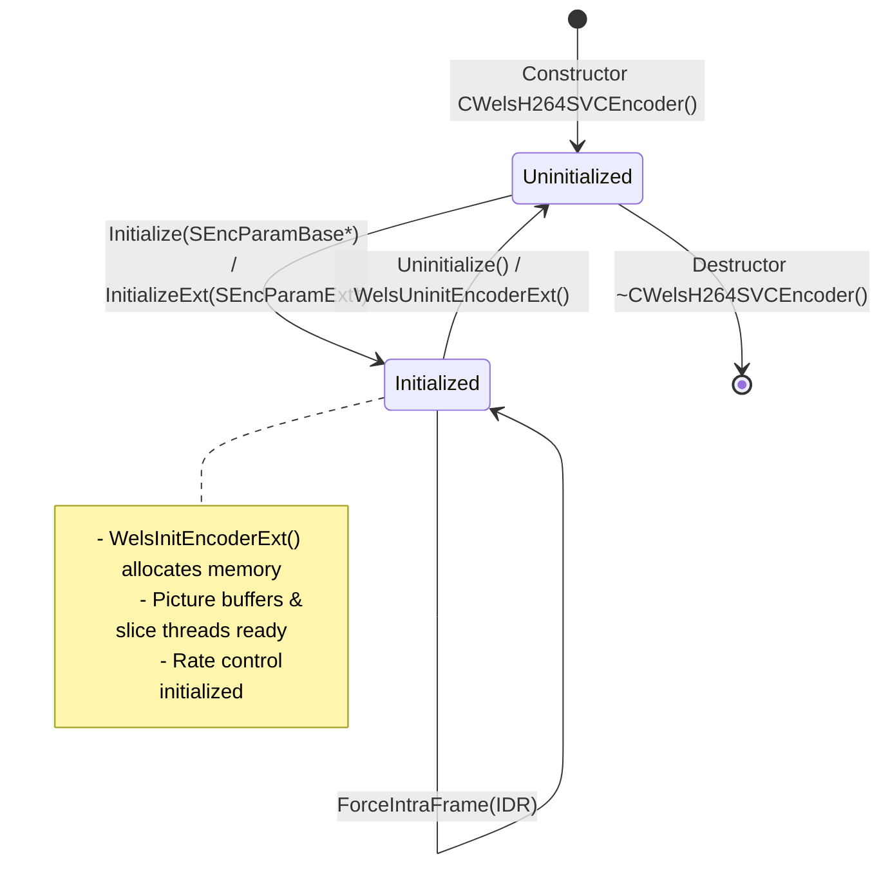
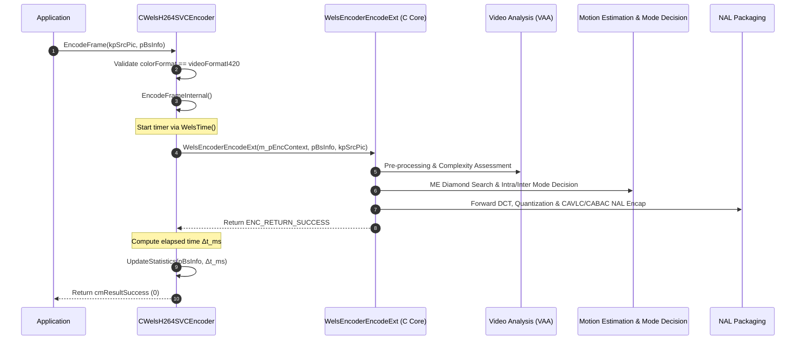

# OpenH264: C++ SVC Encoder Facade (`welsEncoderExt.h`)

This document provides a comprehensive, literate-programming-style breakdown of [`codec/encoder/plus/inc/welsEncoderExt.h`](openh264/codec/encoder/plus/inc/welsEncoderExt.h) and its concrete implementation in [`codec/encoder/plus/src/welsEncoderExt.cpp`](openh264/codec/encoder/plus/src/welsEncoderExt.cpp).

---

## 1. High-Level Architectural Role & Design Pattern

The header [`welsEncoderExt.h`](openh264/codec/encoder/plus/inc/welsEncoderExt.h) defines the primary C++ concrete class [CWelsH264SVCEncoder](openh264/codec/encoder/plus/inc/welsEncoderExt.h#L59), which implements the public pure-virtual interface [ISVCEncoder](openh264/codec/api/wels/codec_api.h#L272). 

Architecturally, [CWelsH264SVCEncoder](openh264/codec/encoder/plus/inc/welsEncoderExt.h#L59) acts as the **Facade and Lifecycle Orchestrator** for the OpenH264 video compression subsystem. It encapsulates the complex, high-performance C-based core encoding engine ([sWelsEncCtx](openh264/codec/encoder/core/inc/encoder_context.h#L116)), translating object-oriented user requests into low-level video encoding pipelines, dynamic parameter updates, and telemetry monitoring.

```mermaid
flowchart TB
    subgraph Client Application Layer
        App[Video Client / WebRTC Engine]
    end

    subgraph C++ Public Facade Layer ["codec/encoder/plus/"]
        ISVCEncoder["ISVCEncoder (Pure Virtual Interface)"]
        CWelsEnc["CWelsH264SVCEncoder (Facade Object)"]
        Trace["welsCodecTrace (Logging & Telemetry)"]
    end

    subgraph C Core Compression Engine ["codec/encoder/core/"]
        sWelsEncCtx["sWelsEncCtx (Core Context Structure)"]
        VAA["Video Analysis & Preprocessing (VAA)"]
        RC["Rate Control Engine (WelsRcInitFuncPointers)"]
        ME["Motion Estimation (Diamond / Sub-pel)"]
        MD["Mode Decision (RDO / Intra / Inter)"]
        DCTQ["Forward DCT & Quantization"]
        RecLoop["Local Reconstruction & Deblocking"]
        Entropy["CAVLC / CABAC Bitstream Serialization"]
        LTR["Long-Term Reference Manager (SLTRState)"]
    end

    App -->|WelsCreateSVCEncoder| ISVCEncoder
    ISVCEncoder <|-- CWelsEnc
    CWelsEnc -->|Manages| Trace
    CWelsEnc -->|Owns & Drives| sWelsEncCtx

    sWelsEncCtx --> VAA
    sWelsEncCtx --> RC
    sWelsEncCtx --> ME
    sWelsEncCtx --> MD
    sWelsEncCtx --> DCTQ
    sWelsEncCtx --> RecLoop
    sWelsEncCtx --> Entropy
    sWelsEncCtx --> LTR
```

### Key Responsibilities
1. **Public Interface Conformance**: Implements all virtual functions of [ISVCEncoder](openh264/codec/api/wels/codec_api.h#L272) with binary backward compatibility via the `EXTAPI` calling convention.
2. **Parameter Validation & Transcoding**: Converts basic configurations ([SEncParamBase](openh264/codec/api/wels/codec_app_def.h)) or advanced scalable configurations ([SEncParamExt](openh264/codec/api/wels/codec_app_def.h)) into internal core structures ([SWelsSvcCodingParam](openh264/codec/encoder/core/inc/param_svc.h)).
3. **Dynamic Option Management**: Dispatches runtime configuration changes (`SetOption` / `GetOption`) such as dynamic bitrate adjustment, frame rate adjustments, intra frame forcing (IDR requests), and Long-Term Reference (LTR) recovery signaling.
4. **Performance Telemetry & Statistical Tracking**: Accumulates per-frame encoding latencies, rolling bitrates, frame skipping statistics, and average Quantization Parameters (QP) across all spatial dependency layers.

---

## 2. Preprocessor Macros & Conditional Build Flags

The header and implementation files use several preprocessor directives to control compilation and debug telemetry:

| Macro Directive | Default State | Purpose & Architectural Effect |
| :--- | :--- | :--- |
| `WELS_PLUS_WELSENCODEREXT_H` | Defined | Include guard preventing multiple header inclusions. |
| `OUTPUT_BIT_STREAM` | *Commented out* | Enables automatic bitstream dumping. When defined, opens timestamped output files (`enc_bs_0x<ptr>_<timestamp>.264` and `enc_size_0x<ptr>_<timestamp>.len`) to dump raw Annex-B NAL bytes and frame lengths. |
| `DUMP_SRC_PICTURE` | *Commented out* | Enables raw input picture dumping prior to compression into `.yuv`, `.rgb`, `.bgr`, or `.yuy2` disk files for visual debugging. |
| `REC_FRAME_COUNT` | *Commented out* | Enables frame-counter instrumentation (`m_uiCountFrameNum`) incremented on each successfully encoded frame. |

---

## 3. Data Structures & Class Architecture

### 3.1 Class Overview: `CWelsH264SVCEncoder`

```cpp
namespace WelsEnc {
class CWelsH264SVCEncoder : public ISVCEncoder { ... };
}
```

[CWelsH264SVCEncoder](openh264/codec/encoder/plus/inc/welsEncoderExt.h#L59) encapsulates both the runtime state of the C++ wrapper and the pointer to the underlying C core encoder context.

#### Member Variable Specifications

| Member Field | Type | Alignment / Scope | Description & Role |
| :--- | :--- | :--- | :--- |
| `m_pEncContext` | [sWelsEncCtx*](openh264/codec/encoder/core/inc/encoder_context.h#L116) | Pointer (8 bytes) | Pointer to the core C encoder context containing memory pools, slice threads, VAA modules, DPB, and rate control state. |
| `m_pWelsTrace` | [welsCodecTrace*](openh264/codec/common/inc/welsCodecTrace.h) | Pointer (8 bytes) | Logging and diagnostic trace manager used for thread-safe logging and callback forwarding. |
| `m_iMaxPicWidth` | `int32_t` | 4 bytes | Maximum input image width (in pixels) across all configured spatial layers. |
| `m_iMaxPicHeight` | `int32_t` | 4 bytes | Maximum input image height (in pixels) across all configured spatial layers. |
| `m_iCspInternal` | `int32_t` | 4 bytes | Internal color space format identifier (e.g., `videoFormatI420 = 23`). |
| `m_bInitialFlag` | `bool` | 1 byte | State flag indicating whether the encoder context has been successfully initialized (`true`) or uninitialized (`false`). |
| `m_pFileBs` | `FILE*` | Optional (`OUTPUT_BIT_STREAM`) | File descriptor for debug bitstream recording. |
| `m_pFileBsSize` | `FILE*` | Optional (`OUTPUT_BIT_STREAM`) | File descriptor for debug frame byte size recording. |
| `m_bSwitch` | `bool` | Optional (`OUTPUT_BIT_STREAM`) | State flag triggering file rotation when spatial resolution changes dynamically. |
| `m_iSwitchTimes` | `int32_t` | Optional (`OUTPUT_BIT_STREAM`) | Counter tracking the number of dynamic resolution switches. |
| `m_uiCountFrameNum` | `int32_t` | Optional (`REC_FRAME_COUNT`) | Monotonically increasing frame index counter. |

---

## 4. Lifecycle & State Machine



---

## 5. Method Deep-Dive & Algorithmic Analysis

### 5.1 Constructor & Destructor

#### `CWelsH264SVCEncoder::CWelsH264SVCEncoder()`
* **Signature**: [CWelsH264SVCEncoder::CWelsH264SVCEncoder()](openh264/codec/encoder/plus/src/welsEncoderExt.cpp#L62-L132)
* **Description**: Zero-initializes all member pointers and state flags. Calls `InitEncoder()` to instantiate the logging and diagnostic trace context [welsCodecTrace](openh264/codec/common/inc/welsCodecTrace.h). If debug dumping macros are enabled, opens timestamped disk files.

#### `CWelsH264SVCEncoder::~CWelsH264SVCEncoder()`
* **Signature**: [CWelsH264SVCEncoder::~CWelsH264SVCEncoder()](openh264/codec/encoder/plus/src/welsEncoderExt.cpp#L134-L162)
* **Description**: Safe teardown routine. Calls `Uninitialize()` to free all C core encoder resources, closes open debug file handles, and frees `m_pWelsTrace`.

---

### 5.2 Initialization Methods

#### `Initialize(const SEncParamBase* argv)`
* **Signature**: `virtual int EXTAPI Initialize (const SEncParamBase* argv)`
* **Parameters**:
  * `argv`: Pointer to [SEncParamBase](openh264/codec/api/wels/codec_app_def.h) containing basic configuration (`iUsageType`, `iPicWidth`, `iPicHeight`, `iTargetBitrate`, `iRCMode`, `fMaxFrameRate`).
* **Return Value**: `cmResultSuccess` (0) on success; `cmInitParaError` or `cmMallocMemeError` on failure.
* **Process**:
  1. Validates logging context and `argv != NULL`.
  2. Constructs a local [SWelsSvcCodingParam](openh264/codec/encoder/core/inc/param_svc.h) configuration object.
  3. Executes `sConfig.ParamBaseTranscode(*argv)` to map base parameters into scalable parameters (single spatial layer default).
  4. Delegates to `InitializeInternal(&sConfig)`.

#### `InitializeExt(const SEncParamExt* argv)`
* **Signature**: `virtual int EXTAPI InitializeExt (const SEncParamExt* argv)`
* **Parameters**:
  * `argv`: Pointer to [SEncParamExt](openh264/codec/api/wels/codec_app_def.h) containing multi-layer scalable parameters, slice mode arguments, denoising, deblocking offsets, LTR parameters, and threading controls.
* **Process**:
  1. Executes `sConfig.ParamTranscode(*argv)`.
  2. Delegates to `InitializeInternal(&sConfig)`.

#### `InitializeInternal(SWelsSvcCodingParam* pCfg)`
* **Signature**: `int InitializeInternal (SWelsSvcCodingParam* pCfg)`
* **Mathematical & Algorithmic Validations**:
  1. **Spatial Layer Range**: Ensures $1 \le \text{iSpatialLayerNum} \le \text{MAX\_DEPENDENCY\_LAYER} \, (4)$.
  2. **Temporal Layer Range**: Ensures $1 \le \text{iTemporalLayerNum} \le \text{MAX\_TEMPORAL\_LEVEL} \, (4)$.
  3. **GOP Size Constraint**: Must be a non-zero power of 2:
     $$\text{uiGopSize} \in [1, \text{MAX\_GOP\_SIZE}] \quad \text{and} \quad (\text{uiGopSize} \& (\text{uiGopSize} - 1)) = 0$$
  4. **Intra Period Constraint**: If non-zero, must be an exact multiple of the GOP size:
     $$\text{uiIntraPeriod} \ge \text{uiGopSize} \quad \text{and} \quad (\text{uiIntraPeriod} \pmod{\text{uiGopSize}} = 0)$$
  5. **Temporal Layer Hierarchy**: Computes temporal decomposition stages:
     $$N_{\text{temporal\_layers}} = 1 + \log_2(\text{uiGopSize})$$
  6. **Reference Picture Count Assignment**:
     * For camera video (`CAMERA_VIDEO_REAL_TIME`):
       $$N_{\text{ref}} = \max\left(1, \left\lfloor \frac{\text{uiGopSize}}{2} \right\rfloor\right) + N_{\text{LTR}}$$
       clamped to $[\text{MIN\_REF\_PIC\_COUNT}, \text{MAX\_REFERENCE\_PICTURE\_COUNT\_NUM\_CAMERA}]$.
     * For screen content (`SCREEN_CONTENT_REAL_TIME`): Configures $N_{\text{LTR}} = 2$ long-term reference frames.
  7. **Core Allocation**: Invokes `WelsInitEncoderExt(&m_pEncContext, pCfg, &m_pWelsTrace->m_sLogCtx, NULL)`.

---

### 5.3 Frame & Bitstream Encoding Pipeline



#### `EncodeFrame(const SSourcePicture* kpSrcPic, SFrameBSInfo* pBsInfo)`
* **Signature**: `virtual int EXTAPI EncodeFrame (const SSourcePicture* kpSrcPic, SFrameBSInfo* pBsInfo)`
* **Input Parameters**:
  * `kpSrcPic`: Pointer to [SSourcePicture](openh264/codec/api/wels/codec_app_def.h) containing input plane pointers (`pData[0]` for Y, `pData[1]` for U, `pData[2]` for V), plane strides (`iStride[0..2]`), image width, and height.
  * `pBsInfo`: Output bitstream container [SFrameBSInfo](openh264/codec/api/wels/codec_app_def.h) populated with encoded NAL units, layer descriptions, and timestamp info.
* **Validation**: Checks initialization state and verifies `kpSrcPic->iColorFormat == videoFormatI420`.

#### `EncodeFrameInternal(const SSourcePicture* pSrcPic, SFrameBSInfo* pBsInfo)`
* **Signature**: `virtual int EncodeFrameInternal (const SSourcePicture* pSrcPic, SFrameBSInfo* pBsInfo)`
* **Execution Flow**:
  1. Validates minimum resolution: `iPicWidth >= 16` and `iPicHeight >= 16`.
  2. Samples start timestamp via `WelsTime()`.
  3. Invokes core encoder routine:
     ```cpp
     const int32_t kiEncoderReturn = WelsEncoderEncodeExt(m_pEncContext, pBsInfo, pSrcPic);
     ```
  4. Calculates frame encoding latency:
     $$\Delta t_{\text{frame\_ms}} = \frac{\text{WelsTime}() - t_{\text{before}}}{1000}$$
  5. Maps C core return codes to public C++ API status codes:
     * `ENC_RETURN_MEMALLOCERR` / `ENC_RETURN_MEMOVERFLOWFOUND` / `ENC_RETURN_VLCOVERFLOWFOUND` $\to$ `cmMallocMemeError` (automatically triggers `WelsUninitEncoderExt`).
     * `ENC_RETURN_INVALIDINPUT` $\to$ `cmUnsupportedData`.
     * `ENC_RETURN_SUCCESS` $\to$ Dispatches `UpdateStatistics(pBsInfo, kiCurrentFrameMs)` and returns `cmResultSuccess`.

---

### 5.4 Telemetry & Statistical Tracking

#### `UpdateStatistics(SFrameBSInfo* pBsInfo, const int64_t kiCurrentFrameMs)`
Accumulates frame-level metrics into [SEncoderStatistics](openh264/codec/api/wels/codec_app_def.h) across each spatial layer $D \in [0, \text{iSpatialLayerNum}-1]$:

1. **Resolution Change Tracking**: Checks if `uiWidth` or `uiHeight` changed and increments `uiResolutionChangeTimes`.
2. **Moving Average Frame Encoding Latency**:
   For non-skipped processed frames ($k = N_{\text{input}} - N_{\text{skipped}}$):
   $$S_{\text{avg}}^{(k)} = S_{\text{avg}}^{(k-1)} + \frac{\Delta t_{\text{frame\_ms}} - S_{\text{avg}}^{(k-1)}}{k}$$
3. **Cumulative Frame Rate Calculation**:
   $$f_{\text{avg}} = \frac{N_{\text{input\_frames}} \times 1000}{t_{\text{current\_ts}} - t_{\text{start\_ts}}}$$
4. **Windowed Interval Rate & Bitrate Telemetry**:
   When the elapsed time $\Delta t_{\text{stat}} \ge \text{iStatisticsLogInterval}$ (default 1000 ms):
   $$f_{\text{latest}} = \frac{N_{\text{frames\_in\_window}}}{\Delta t_{\text{sec}}}$$
   $$R_{\text{bitrate}} = \frac{B_{\text{window\_bytes}} \times 8}{\Delta t_{\text{sec}}} \quad [\text{bps}]$$

---

### 5.5 Parameter Sets & Keyframe Control

#### `EncodeParameterSets(SFrameBSInfo* pBsInfo)`
* **Signature**: `virtual int EXTAPI EncodeParameterSets (SFrameBSInfo* pBsInfo)`
* **Description**: Forces generation and serialization of out-of-band Sequence Parameter Sets (SPS), Picture Parameter Sets (PPS), and SVC Subset SPS NAL units into `pBsInfo`. Invokes `WelsEncoderEncodeParameterSets(m_pEncContext, pBsInfo)`.

#### `ForceIntraFrame(bool bIDR, int32_t iLayerId = -1)`
* **Signature**: `virtual int EXTAPI ForceIntraFrame (bool bIDR, int32_t iLayerId = -1)`
* **Description**: When `bIDR == true`, calls `ForceCodingIDR(m_pEncContext, iLayerId)`. This marks the current GOP as terminated and instructs the slice encoder to emit an IDR NAL unit (NAL unit type 5) on the next `EncodeFrame()` call.

---

### 5.6 Runtime Options Management (`SetOption` / `GetOption`)

The methods [SetOption](openh264/codec/encoder/plus/src/welsEncoderExt.cpp#L692-L1198) and [GetOption](openh264/codec/encoder/plus/src/welsEncoderExt.cpp#L1200-L1313) handle dynamic property modification and inspection via the [ENCODER_OPTION](openh264/codec/api/wels/codec_app_def.h) enumeration:

| Option ID (`ENCODER_OPTION`) | Data Type Passed | Description & Core Action |
| :--- | :--- | :--- |
| `ENCODER_OPTION_DATAFORMAT` | `int32_t*` | Sets/gets input video color space format (`m_iCspInternal`). |
| `ENCODER_OPTION_IDR_INTERVAL` | `int32_t*` | Dynamically updates intra period (`uiIntraPeriod`). |
| `ENCODER_OPTION_SVC_ENCODE_PARAM_BASE` | `SEncParamBase*` | Reconfigures basic parameters; executes `WelsEncoderParamAdjust()`. |
| `ENCODER_OPTION_SVC_ENCODE_PARAM_EXT` | `SEncParamExt*` | Reconfigures scalable parameters; dynamically adapts dependency layers. |
| `ENCODER_OPTION_FRAME_RATE` | `float*` | Dynamically updates target frame rate (`WelsEncoderApplyFrameRate`). |
| `ENCODER_OPTION_BITRATE` | `SBitrateInfo*` | Dynamically updates target bitrates per spatial layer (`WelsEncoderApplyBitRate`). |
| `ENCODER_OPTION_MAX_BITRATE` | `SBitrateInfo*` | Dynamically updates maximum bitrate caps per spatial layer. |
| `ENCODER_OPTION_RC_MODE` | `int32_t*` | Updates rate control mode (`RC_QUALITY_MODE`, `RC_BITRATE_MODE`, `RC_BUFFERBASED_MODE`, `RC_TIMESTAMP_MODE`, or `RC_OFF_MODE`) and resets function pointers via `WelsRcInitFuncPointers()`. |
| `ENCODER_OPTION_RC_FRAME_SKIP` | `bool*` | Enables or disables dynamic frame skipping under buffer pressure. |
| `ENCODER_LTR_RECOVERY_REQUEST` | `SLTRRecoverRequest*` | Dispatches Long-Term Reference frame loss recovery request (`FilterLTRRecoveryRequest`). |
| `ENCODER_LTR_MARKING_FEEDBACK` | `SLTRMarkingFeedback*` | Acknowledges receiver LTR frame validation (`FilterLTRMarkingFeedback`). |
| `ENCODER_LTR_MARKING_PERIOD` | `uint32_t*` | Sets LTR marking interval period (`iLtrMarkPeriod`). |
| `ENCODER_OPTION_LTR` | `SLTRConfig*` | Enables/disables LTR and sets LTR reference count (`WelsEncoderApplyLTR`). |
| `ENCODER_OPTION_SPS_PPS_ID_STRATEGY` | `int32_t*` | Configures SPS/PPS ID generation strategy (`CONSTANT_ID`, `INCREASING_ID`, `SPS_LISTING`, `SPS_PPS_LISTING`). |
| `ENCODER_OPTION_TRACE_LEVEL` | `uint32_t*` | Sets logging trace verbosity filter level. |
| `ENCODER_OPTION_TRACE_CALLBACK` | `WelsTraceCallback*` | Configures custom external logging callback function. |
| `ENCODER_OPTION_TRACE_CALLBACK_CONTEXT` | `void**` | Sets user context pointer passed to the logging callback. |
| `ENCODER_OPTION_PROFILE` | `SProfileInfo*` | Configures profile IDC per spatial layer (`PRO_BASELINE`, `PRO_MAIN`, `PRO_HIGH`). |
| `ENCODER_OPTION_LEVEL` | `SLevelInfo*` | Configures level IDC per spatial layer. |
| `ENCODER_OPTION_NUMBER_REF` | `int32_t*` | Updates number of active reference frames in DPB (`iNumRefFrame`). |
| `ENCODER_OPTION_COMPLEXITY` | `int32_t*` | Sets encoder computational complexity preset mode (`ECOMPLEXITY_MODE`). |
| `ENCODER_OPTION_GET_STATISTICS` | `SEncoderStatistics*` | *Get-only*. Retrieves telemetry metrics for the highest active spatial layer. |

---

## 6. C Factory & Export Functions

The implementation file [`welsEncoderExt.cpp`](openh264/codec/encoder/plus/src/welsEncoderExt.cpp) also exports the standard C linkage API functions used by shared libraries and external language bindings (such as Rust FFI):

```cpp
int32_t WelsCreateSVCEncoder (ISVCEncoder** ppEncoder);
void    WelsDestroySVCEncoder (ISVCEncoder* pEncoder);
OpenH264Version WelsGetCodecVersion();
void    WelsGetCodecVersionEx (OpenH264Version* pVersion);
```

* **`WelsCreateSVCEncoder(ISVCEncoder** ppEncoder)`**:
  Allocates a new instance of [CWelsH264SVCEncoder](openh264/codec/encoder/plus/inc/welsEncoderExt.h#L59) on the heap and assigns it to `*ppEncoder`. Returns `0` on success or `1` on memory failure.
* **`WelsDestroySVCEncoder(ISVCEncoder* pEncoder)`**:
  Safely casts `pEncoder` to `CWelsH264SVCEncoder*` and invokes `delete`, executing `~CWelsH264SVCEncoder()` and releasing all allocated memory pools.
* **`WelsGetCodecVersion()` / `WelsGetCodecVersionEx()`**:
  Returns the static global structure `g_stCodecVersion` containing the major, minor, revision, and reserved version integers.
