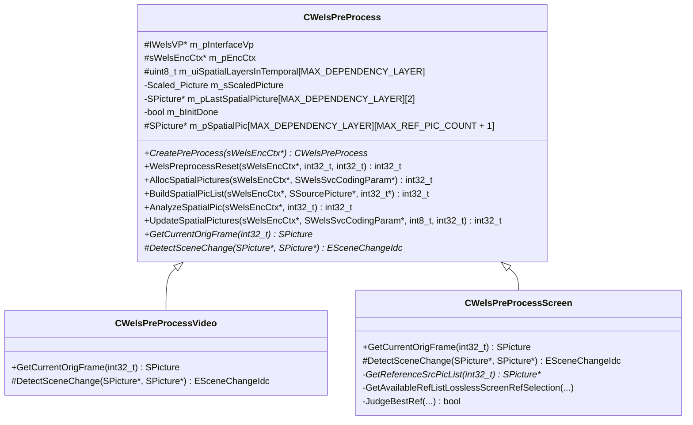
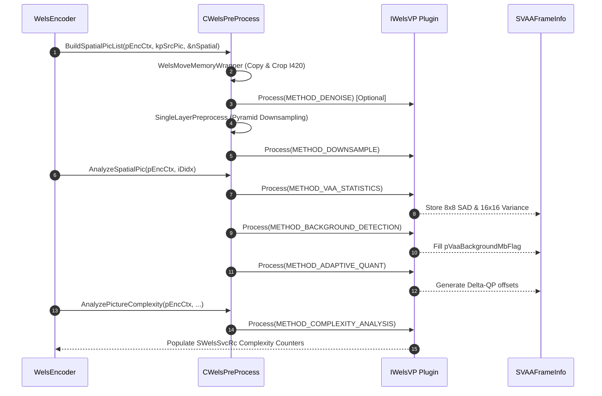

# OpenH264: Video Pre-Processing Subsystem & VAA Documentation

This document provides a comprehensive, literate-programming-style breakdown of the video pre-processing and video analysis/assessment (VAA) engine in OpenH264, centered on [`wels_preprocess.cpp`](openh264/codec/encoder/core/src/wels_preprocess.cpp) and its associated header [`wels_preprocess.h`](openh264/codec/encoder/core/inc/wels_preprocess.h).

---

## Table of Contents
1. [Module & Architectural Purpose](#1-module--architectural-purpose)
2. [Data Structures, Types, Enums & Constants](#2-data-structures-types-enums--constants)
   - [2.1 Scaled_Picture](#21-scaled_picture)
   - [2.2 SRefJudgement](#22-srefjudgement)
   - [2.3 SRefInfoParam](#23-srefinfoparam)
   - [2.4 SVAAFrameInfo and SVAAFrameInfoExt](#24-svaaframeinfo-and-svaaframeinfoext)
   - [2.5 Enums and Operational Constants](#25-enums-and-operational-constants)
   - [2.6 Temporal Layer Lookup Matrix (`g_kuiRefTemporalIdx`)](#26-temporal-layer-lookup-matrix-g_kuireftemporalidx)
3. [Class Architecture & Object Model](#3-class-architecture--object-model)
   - [3.1 Class Hierarchy Overview](#31-class-hierarchy-overview)
   - [3.2 Factory & Lifecycle Management](#32-factory--lifecycle-management)
4. [Detailed Function & Method Walkthrough](#4-detailed-function--method-walkthrough)
   - [4.1 Factory, Construction & Memory Lifecycle](#41-factory-construction--memory-lifecycle)
   - [4.2 Input Ingestion, Color Space & Memory Movement](#42-input-ingestion-color-space--memory-movement)
   - [4.3 Aspect Ratio Scaling & Spatial Downsampling](#43-aspect-ratio-scaling--spatial-downsampling)
   - [4.4 Video Analytics & Assessment (VAA) Pipeline](#44-video-analytics--assessment-vaa-pipeline)
   - [4.5 Scene Change Detection & Scroll Detection](#45-scene-change-detection--scroll-detection)
   - [4.6 Screen Content Reference Selection & Ranking](#46-screen-content-reference-selection--ranking)
   - [4.7 Spatial Picture Management & Reference List Swapping](#47-spatial-picture-management--reference-list-swapping)
5. [Mathematical Formulations & Algorithmic Models](#5-mathematical-formulations--algorithmic-models)
6. [Pipeline Dataflow & Execution Call Graph](#6-pipeline-dataflow--execution-call-graph)

---

## 1. Module & Architectural Purpose

The pre-processing subsystem implemented in [`wels_preprocess.cpp`](openh264/codec/encoder/core/src/wels_preprocess.cpp) and [`wels_preprocess.h`](openh264/codec/encoder/core/inc/wels_preprocess.h) is the entry gateway for raw video frames entering the OpenH264 SVC encoding engine. It sits between the public API wrapper (`ISVCEncoder` / [`CWelsH264SVCEncoder`](openh264/codec/encoder/plus/src/welsEncoderExt.cpp)) and the macroblock encoding pipeline ([`svc_encode_slice.cpp`](openh264/codec/encoder/core/src/svc_encode_slice.cpp)).

```mermaid
flowchart TD
    RawIn[Raw SSourcePicture] --> Ingest[WelsMoveMemoryWrapper & Stride Alignment]
    Ingest --> Denoise[Bilateral Denoising Filter]
    Denoise --> Scale[JudgeNeedOfScaling & DownsamplePadding]
    Scale --> SpatialPic[Spatial Layer Pyramid Generation: D0, D1, ... Dk]
    SpatialPic --> VAA[Video Analytics & Assessment - VAA]
    
    subgraph VAA Subsystem
        VAA --> VAACalc[8x8 SAD & 16x16 Variance Calculation]
        VAA --> BGD[Background Macroblock Detection]
        VAA --> AQ[Adaptive Quantization Delta-QP Estimation]
        VAA --> SCD[Scene Change & Scroll Detection]
        VAA --> LTRSel[Screen Content Multi-Reference Candidate Ranking]
    end

    VAA Subsystem --> RC[Hierarchical Rate Control: SWelsSvcRc]
    VAA Subsystem --> MD[Mode Decision & Motion Estimation]
```

### Primary Architectural Roles:
1. **Source Geometry & Memory Normalization**: Copies raw I420 planar buffers, clips odd dimension boundaries to even macroblock coordinates, and manages stride zero-padding via [`ClearEndOfLinePadding`](openh264/codec/encoder/core/src/wels_preprocess.cpp#L41-L46) to eliminate SIMD out-of-bounds reads and Valgrind uninitialized-memory false positives.
2. **Spatial Scalability Downsampling**: Constructs multi-layer spatial pyramids (e.g., $1080p \to 720p \to 360p$) for Scalable Video Coding (SVC) and simulcast hierarchies using polyphase/bilinear downsamplers.
3. **Pre-Encode Video Filtering**: Applies adaptive bilateral filtering ([`BilateralDenoising`](openh264/codec/encoder/core/src/wels_preprocess.cpp#L582-L598)) to attenuate high-frequency sensor noise without blurring structural edges.
4. **Video Analytics and Assessment (VAA)**: Computes frame-level and macroblock-level statistics (8x8 Sum of Absolute Differences, 16x16 Sum of Squares Differences, Block Variances), identifies static background macroblocks, calculates adaptive quantization ($\Delta QP$) offsets, and estimates Group of Macroblocks (GOM) complexity for Rate Control.
5. **Scene Change & Scroll Detection**: Detects abrupt scene cuts (`LARGE_CHANGED_SCENE`), gradual shifts (`MEDIUM_CHANGED_SCENE`), and synthetic window scrolls in screen content (`METHOD_SCROLL_DETECTION`), guiding IDR intra-refresh insertion and reference picture re-selection.
6. **Screen Content Reference Picture Selection**: In `SCREEN_CONTENT_REAL_TIME` mode, analyzes multiple short-term and long-term reference candidates, evaluating distortion and bit costs to identify optimal temporal prediction baselines.

---

## 2. Data Structures, Types, Enums & Constants

### 2.1 `Scaled_Picture`
Defined in [`wels_preprocess.h`](openh264/codec/encoder/core/inc/wels_preprocess.h#L57-L61):

```cpp
typedef struct {
  SPicture*     pScaledInputPicture;
  int32_t       iScaledWidth[MAX_DEPENDENCY_LAYER];
  int32_t       iScaledHeight[MAX_DEPENDENCY_LAYER];
} Scaled_Picture;
```

* **Purpose**: Holds an intermediate full-resolution or scaled source picture buffer and tracks the aspect-ratio-adjusted target dimensions for each spatial dependency layer.
* **Fields**:
  * `pScaledInputPicture`: Pointer to an allocated [`SPicture`](openh264/codec/encoder/core/inc/picture.h) instance used when the input picture dimensions require aspect-ratio scaling before downsampling.
  * `iScaledWidth[MAX_DEPENDENCY_LAYER]`: Effective width (in pixels) for layer $i$ after aspect-ratio preserving calculations.
  * `iScaledHeight[MAX_DEPENDENCY_LAYER]`: Effective height (in pixels) for layer $i$ after aspect-ratio preserving calculations.
* **Lifecycle**: Allocated and configured by [`WelsInitScaledPic()`](openh264/codec/encoder/core/src/wels_preprocess.cpp#L522-L545) and destroyed by [`FreeScaledPic()`](openh264/codec/encoder/core/src/wels_preprocess.cpp#L547-L552).

---

### 2.2 `SRefJudgement`
Defined in [`wels_preprocess.h`](openh264/codec/encoder/core/inc/wels_preprocess.h#L64-L71):

```cpp
typedef struct {
  int64_t iMinFrameComplexity;
  int64_t iMinFrameComplexity08;
  int64_t iMinFrameComplexity11;

  int32_t iMinFrameNumGap;
  int32_t iMinFrameQp;
} SRefJudgement;
```

* **Purpose**: Decision-making metric container used during screen content reference frame evaluation ([`JudgeBestRef`](openh264/codec/encoder/core/src/wels_preprocess.cpp#L1067-L1072)) to select the optimal reference picture from short-term (STR) and long-term (LTR) candidate lists.
* **Fields**:
  * `iMinFrameComplexity`: Current lowest observed frame-level complexity score ($SAD$).
  * `iMinFrameComplexity08`: $0.8 \times \text{iMinFrameComplexity}$ (20% reduction threshold for aggressive replacement).
  * `iMinFrameComplexity11`: $1.1 \times \text{iMinFrameComplexity}$ (10% tolerance margin for QP-based tiebreaking).
  * `iMinFrameNumGap`: Minimal frame number distance between reference and current picture.
  * `iMinFrameQp`: Average QP of the reference frame associated with the lowest complexity score.

---

### 2.3 `SRefInfoParam`
Defined in [`wels_preprocess.h`](openh264/codec/encoder/core/inc/wels_preprocess.h#L73-L78):

```cpp
typedef struct {
  SPicture*       pRefPicture;
  int32_t         iSrcListIdx;
  bool            bSceneLtrFlag;
  unsigned char*  pBestBlockStaticIdc;
} SRefInfoParam;
```

* **Purpose**: Encapsulates metadata for a specific candidate reference frame evaluated during VAA analysis.
* **Fields**:
  * `pRefPicture`: Pointer to the reconstructed candidate reference picture buffer.
  * `iSrcListIdx`: 1-based index of this reference frame inside the encoder's internal spatial picture list `m_pSpatialPic[base_did]`. Index 0 is reserved for the current input frame.
  * `bSceneLtrFlag`: Boolean flag indicating whether this reference frame was marked as a Long-Term Reference (LTR) for scene recovery.
  * `pBestBlockStaticIdc`: Pointer to an array of static macroblock indicator flags (`EStaticBlockIdc`) derived by scene change analysis.

---

### 2.4 `SVAAFrameInfo` and `SVAAFrameInfoExt`
Defined in [`wels_preprocess.h`](openh264/codec/encoder/core/inc/wels_preprocess.h#L80-L116):

```cpp
typedef struct TagVAAFrameInfo {
  SVAACalcResult              sVaaCalcInfo;
  SAdaptiveQuantizationParam  sAdaptiveQuantParam;
  SComplexityAnalysisParam    sComplexityAnalysisParam;

  int32_t       iPicWidth;
  int32_t       iPicHeight;
  int32_t       iPicStride;
  int32_t       iPicStrideUV;

  uint8_t*      pRefY;
  uint8_t*      pCurY;
  uint8_t*      pRefU;
  uint8_t*      pCurU;
  uint8_t*      pRefV;
  uint8_t*      pCurV;

  int8_t*       pVaaBackgroundMbFlag;
  uint8_t       uiValidLongTermPicIdx;
  uint8_t       uiMarkLongTermPicIdx;

  ESceneChangeIdc eSceneChangeIdc;
  bool          bSceneChangeFlag;
  bool          bIdrPeriodFlag;
} SVAAFrameInfo;
```

```cpp
typedef struct SVAAFrameInfoExt_t: public SVAAFrameInfo {
  SComplexityAnalysisScreenParam  sComplexityScreenParam;
  SScrollDetectionParam           sScrollDetectInfo;
  SRefInfoParam                   sVaaStrBestRefCandidate[MAX_REF_PIC_COUNT];
  SRefInfoParam                   sVaaLtrBestRefCandidate[MAX_REF_PIC_COUNT];
  int32_t                         iNumOfAvailableRef;

  int32_t     iVaaBestRefFrameNum;
  uint8_t*    pVaaBestBlockStaticIdc;
  uint8_t*    pVaaBlockStaticIdc[16];
} SVAAFrameInfoExt;
```

* **Purpose**: Central state structures holding all computed VAA metrics for the current frame. Standard camera video uses [`SVAAFrameInfo`](openh264/codec/encoder/core/inc/wels_preprocess.h#L80), while screen content encoding utilizes [`SVAAFrameInfoExt`](openh264/codec/encoder/core/inc/wels_preprocess.h#L106).
* **Key Fields**:
  * `sVaaCalcInfo`: Structure containing 8x8 SAD arrays, 16x16 sum of squares, and pixel sums computed by the VAA processing kernel.
  * `sAdaptiveQuantParam`: Parameters and $\Delta QP$ arrays for macroblock-level adaptive quantization.
  * `sComplexityAnalysisParam`: Complexity accumulators used by the Rate Control module.
  * `pVaaBackgroundMbFlag`: Per-macroblock array of flags (`1` = static background MB, `0` = foreground motion MB).
  * `eSceneChangeIdc`: Classification of scene stability (`SIMILAR_SCENE`, `MEDIUM_CHANGED_SCENE`, `LARGE_CHANGED_SCENE`).
  * `sScrollDetectInfo`: Horizontal (`iScrollMvX`) and vertical (`iScrollMvY`) pixel displacement parameters detected when a window scroll occurs.
  * `sVaaStrBestRefCandidate` / `sVaaLtrBestRefCandidate`: Ranked short-term and long-term reference picture candidate arrays.

---

### 2.5 Enums and Operational Constants

| Identifier | Type | Value / Definition | Purpose |
| :--- | :--- | :--- | :--- |
| [`ESceneChangeIdc`](openh264/codec/processing/interface/IWelsVP.h#L142-L146) | `enum` | `SIMILAR_SCENE` (0)<br>`MEDIUM_CHANGED_SCENE` (1)<br>`LARGE_CHANGED_SCENE` (2) | Quantifies the degree of frame-to-frame visual disparity. `LARGE_CHANGED_SCENE` forces IDR or intra refresh. |
| [`EStaticBlockIdc`](openh264/codec/processing/interface/IWelsVP.h#L148-L153) | `enum` | `NO_STATIC` (0)<br>`COLLOCATED_STATIC` (1)<br>`SCROLLED_STATIC` (2) | Classifies macroblocks during screen content analysis. |
| `g_kiPixMapSizeInBits` | `const int32_t` | `sizeof(uint8_t) * 8` = 8 | Pixel bit-depth specifier passed to `IWelsVP` pixel maps. |
| `STATIC_SCENE_MOTION_RATIO` | `#define` | `0.01f` (1%) | Percentage threshold of active motion blocks below which scene search loop terminates early. |

---

### 2.6 Temporal Layer Lookup Matrix (`g_kuiRefTemporalIdx`)
Defined in [`wels_preprocess.cpp`](openh264/codec/encoder/core/src/wels_preprocess.cpp#L66-L71):

```cpp
const uint8_t g_kuiRefTemporalIdx[MAX_TEMPORAL_LEVEL][MAX_GOP_SIZE] = {
  {  0, },                               // Level 0: GOP size 1 (IPPP...)
  {  0,  0, },                           // Level 1: GOP size 2
  {  0,  0,  0,  1, },                   // Level 2: GOP size 4
  {  0,  0,  0,  2,  0,  1,  1,  2, },   // Level 3: GOP size 8
};
```

* **Purpose**: Look-up table mapping the frame coding index within a Group of Pictures ($i_{\text{coding}} \pmod{N_{\text{GOP}}}$) to its reference picture temporal index within hierarchical temporal prediction structures.

---

## 3. Class Architecture & Object Model

### 3.1 Class Hierarchy Overview

The pre-processing subsystem adopts an object-oriented design rooted at the abstract base class [`CWelsPreProcess`](openh264/codec/encoder/core/inc/wels_preprocess.h#L118-L208), with polymorphic specializations for natural camera video and real-time screen content.



---

### 3.2 Factory & Lifecycle Management

* **Factory Method** ([`CWelsPreProcess::CreatePreProcess`](openh264/codec/encoder/core/src/wels_preprocess.cpp#L91-L107)):
  Evaluates `pEncCtx->pSvcParam->iUsageType`:
  * `SCREEN_CONTENT_REAL_TIME`: Instantiates [`CWelsPreProcessScreen`](openh264/codec/encoder/core/inc/wels_preprocess.h#L221).
  * `CAMERA_VIDEO_REAL_TIME` (Default): Instantiates [`CWelsPreProcessVideo`](openh264/codec/encoder/core/inc/wels_preprocess.h#L210).

---

## 4. Detailed Function & Method Walkthrough

### 4.1 Factory, Construction & Memory Lifecycle

#### [`CWelsPreProcess::CWelsPreProcess`](openh264/codec/encoder/core/src/wels_preprocess.cpp#L110-L118)
* **Signature**: `CWelsPreProcess::CWelsPreProcess (sWelsEncCtx* pEncCtx)`
* **Description**: Initializes member pointers and zero-initializes the spatial picture arrays and scaled picture metadata.
* **Internal State**: Sets `m_pInterfaceVp = NULL`, `m_bInitDone = false`, and links the encoder context pointer `m_pEncCtx = pEncCtx`.

#### [`CWelsPreProcess::~CWelsPreProcess`](openh264/codec/encoder/core/src/wels_preprocess.cpp#L120-L123)
* **Signature**: `virtual CWelsPreProcess::~CWelsPreProcess()`
* **Description**: Releases the intermediate scaled picture buffer via [`FreeScaledPic()`](openh264/codec/encoder/core/src/wels_preprocess.cpp#L547-L552) and destroys the video processing plugin instance via [`WelsPreprocessDestroy()`](openh264/codec/encoder/core/src/wels_preprocess.cpp#L140-L145).

#### [`CWelsPreProcess::WelsPreprocessCreate`](openh264/codec/encoder/core/src/wels_preprocess.cpp#L125-L138)
* **Signature**: `int32_t CWelsPreProcess::WelsPreprocessCreate()`
* **Description**: Dynamically creates the underlying C++ video processor plugin interface ([`IWelsVP`](openh264/codec/processing/interface/IWelsVP.h#L256)) by calling `WelsCreateVpInterface((void**)&m_pInterfaceVp, WELSVP_INTERFACE_VERION)`.
* **Return Value**: `0` on success; `1` on memory allocation failure.

#### [`CWelsPreProcess::AllocSpatialPictures`](openh264/codec/encoder/core/src/wels_preprocess.cpp#L169-L200)
* **Signature**: `int32_t CWelsPreProcess::AllocSpatialPictures (sWelsEncCtx* pCtx, SWelsSvcCodingParam* pParam)`
* **Description**: Pre-allocates the picture buffer pool for all configured spatial dependency layers ($0 \dots \text{iSpatialLayerNum}-1$).
* **Allocation Calculation**:
  For dependency layer $d$:
  $$N_{\text{temporal}} = 2 + \max(\text{iHighestTemporalId}_d, 1)$$
  $$N_{\text{total\_ref}} = N_{\text{temporal}} + N_{\text{LTR}}$$
  Allocates $N_{\text{total\_ref}}$ picture buffers of dimension $\text{iVideoWidth}_d \times \text{iVideoHeight}_d$ using [`AllocPicture`](openh264/codec/encoder/core/inc/picture.h).
* **Return Value**: `0` on success; `1` if memory allocation fails.

#### [`CWelsPreProcess::FreeSpatialPictures`](openh264/codec/encoder/core/src/wels_preprocess.cpp#L202-L218)
* **Signature**: `void CWelsPreProcess::FreeSpatialPictures (sWelsEncCtx* pCtx)`
* **Description**: Iterates through the spatial picture grid `m_pSpatialPic[j][i]` and frees all allocated [`SPicture`](openh264/codec/encoder/core/inc/picture.h) instances using [`FreePicture`](openh264/codec/encoder/core/inc/picture.h).

---

### 4.2 Input Ingestion, Color Space & Memory Movement

#### [`ClearEndOfLinePadding`](openh264/codec/encoder/core/src/wels_preprocess.cpp#L41-L46)
* **Signature**: `void ClearEndOfLinePadding (uint8_t* pData, int32_t iStride, int32_t iWidth, int32_t iHeight)`
* **Description**: Zeroes out the stride padding area $(W \dots \text{Stride}-1)$ on every horizontal row of a picture plane. This prevents x86 SIMD vector downsamplers (which load 128-bit or 256-bit registers across line boundaries) from reading uninitialized data.

#### [`WelsMoveMemory_c`](openh264/codec/encoder/core/src/wels_preprocess.cpp#L1384-L1407)
* **Signature**:
  ```cpp
  void WelsMoveMemory_c (uint8_t* pDstY, uint8_t* pDstU, uint8_t* pDstV,
                         int32_t iDstStrideY, int32_t iDstStrideU, int32_t iDstStrideV,
                         uint8_t* pSrcY, uint8_t* pSrcU, uint8_t* pSrcV,
                         int32_t iSrcStrideY, int32_t iSrcStrideU, int32_t iSrcStrideV,
                         int32_t iWidth, int32_t iHeight)
  ```
* **Description**: Row-by-row planar memory copy for I420 YUV buffers ($Y$ plane at full resolution, $U$ and $V$ chroma planes at half resolution $\frac{W}{2} \times \frac{H}{2}$).

#### [`CWelsPreProcess::WelsMoveMemoryWrapper`](openh264/codec/encoder/core/src/wels_preprocess.cpp#L1409-L1479)
* **Signature**:
  ```cpp
  int32_t CWelsPreProcess::WelsMoveMemoryWrapper (SWelsSvcCodingParam* pSvcParam,
                                                  SPicture* pDstPic,
                                                  const SSourcePicture* kpSrc,
                                                  const int32_t kiTargetWidth,
                                                  const int32_t kiTargetHeight)
  ```
* **Description**: High-level memory ingestion wrapper. Validates input formats (`VIDEO_FORMAT_I420`), calculates top/left cropping offsets (`SUsedPicRect`), enforces even dimension constraints, performs the planar copy via [`WelsMoveMemory_c`](openh264/codec/encoder/core/src/wels_preprocess.cpp#L1384-L1407), and applies chroma padding if target dimensions exceed source dimensions.

#### [`CWelsPreProcess::Padding`](openh264/codec/encoder/core/src/wels_preprocess.cpp#L1270-L1294)
* **Signature**:
  ```cpp
  void CWelsPreProcess::Padding (uint8_t* pSrcY, uint8_t* pSrcU, uint8_t* pSrcV,
                                 int32_t iStrideY, int32_t iStrideUV,
                                 int32_t iActualWidth, int32_t iPaddingWidth,
                                 int32_t iActualHeight, int32_t iPaddingHeight)
  ```
* **Description**: Expands smaller frame buffers up to macroblock-aligned encoding dimensions. Fills padded luma ($Y$) regions with `0` and padded chroma ($U, V$) regions with `0x80` (neutral gray chroma in YUV space).

---

### 4.3 Aspect Ratio Scaling & Spatial Downsampling

#### [`JudgeNeedOfScaling`](openh264/codec/encoder/core/src/wels_preprocess.cpp#L490-L520)
* **Signature**: `bool JudgeNeedOfScaling (SWelsSvcCodingParam* pParam, Scaled_Picture* pScaledPicture)`
* **Description**: Evaluates whether the incoming picture aspect ratio matches the target spatial layer resolution. For each spatial layer $i$, it computes cross-multiplied aspect ratios:
  $$\text{Ratio}_1 = W_{\text{in}} \cdot H_{\text{target}, i}, \quad \text{Ratio}_2 = H_{\text{in}} \cdot W_{\text{target}, i}$$
  If $\text{Ratio}_1 > \text{Ratio}_2$, the horizontal dimension dominates and the scaled height is adjusted:
  $$W_{\text{scaled}, i} = \max(W_{\text{target}, i}, 4), \quad H_{\text{scaled}, i} = \max\left(\frac{H_{\text{in}} \cdot W_{\text{target}, i}}{W_{\text{in}}}, 4\right)$$
  Otherwise:
  $$W_{\text{scaled}, i} = \max\left(\frac{W_{\text{in}} \cdot H_{\text{target}, i}}{H_{\text{in}}}, 4\right), \quad H_{\text{scaled}, i} = \max(H_{\text{target}, i}, 4)$$
* **Return Value**: `true` if downsampling/scaling is required; `false` otherwise.

#### [`CWelsPreProcess::DownsamplePadding`](openh264/codec/encoder/core/src/wels_preprocess.cpp#L633-L685)
* **Signature**:
  ```cpp
  int32_t CWelsPreProcess::DownsamplePadding (SPicture* pSrc, SPicture* pDstPic,
                                              int32_t iSrcWidth, int32_t iSrcHeight,
                                              int32_t iShrinkWidth, int32_t iShrinkHeight,
                                              int32_t iTargetWidth, int32_t iTargetHeight,
                                              bool bForceCopy)
  ```
* **Description**: Dispatches frame downsampling to `m_pInterfaceVp->Process(METHOD_DOWNSAMPLE, &sSrcPixMap, &sDstPicMap)` when input and output dimensions differ. If dimensions match and no downsampling is needed, it falls back to [`WelsMoveMemory_c`](openh264/codec/encoder/core/src/wels_preprocess.cpp#L1384-L1407), followed by [`Padding()`](openh264/codec/encoder/core/src/wels_preprocess.cpp#L1270-L1294).

#### [`CWelsPreProcess::SingleLayerPreprocess`](openh264/codec/encoder/core/src/wels_preprocess.cpp#L351-L484)
* **Signature**:
  ```cpp
  int32_t CWelsPreProcess::SingleLayerPreprocess (sWelsEncCtx* pCtx,
                                                  const SSourcePicture* kpSrc,
                                                  Scaled_Picture* pScaledPicture,
                                                  int32_t* pSpatialNum)
  ```
* **Description**: Coordinates the top-level spatial pyramid generation for a single incoming frame:
  1. Checks IDR period expiration (`uiIntraPeriod`) and sets `bIdrPeriodFlag`.
  2. Copies input pixels into the highest spatial dependency layer via [`WelsMoveMemoryWrapper`](openh264/codec/encoder/core/src/wels_preprocess.cpp#L1409-L1479).
  3. Executes bilateral denoising if `bEnableDenoise` is active.
  4. Triggers scene change detection if `bEnableSceneChangeDetect` is enabled.
  5. Traverses spatial layers in descending order ($D_{\text{max}} \to D_0$), iteratively downsampling each higher layer to generate lower-resolution representations.
* **Return Value**: `ENC_RETURN_SUCCESS` (0) on success.

---

### 4.4 Video Analytics & Assessment (VAA) Pipeline

#### [`CWelsPreProcess::VaaCalculation`](openh264/codec/encoder/core/src/wels_preprocess.cpp#L687-L721)
* **Signature**:
  ```cpp
  void CWelsPreProcess::VaaCalculation (SVAAFrameInfo* pVaaInfo,
                                        SPicture* pCurPicture,
                                        SPicture* pRefPicture,
                                        bool bCalculateSQDiff,
                                        bool bCalculateVar,
                                        bool bCalculateBGD)
  ```
* **Description**: Configures and executes `METHOD_VAA_STATISTICS` on the video processing plugin. Computes macroblock-level sums, 8x8 block SADs, 16x16 variances, and Sum of Squared Differences ($SSD$) between the current picture and the reference picture.

#### [`CWelsPreProcess::BackgroundDetection`](openh264/codec/encoder/core/src/wels_preprocess.cpp#L723-L776)
* **Signature**:
  ```cpp
  void CWelsPreProcess::BackgroundDetection (SVAAFrameInfo* pVaaInfo,
                                             SPicture* pCurPicture,
                                             SPicture* pRefPicture,
                                             bool bDetectFlag)
  ```
* **Description**: Invokes `METHOD_BACKGROUND_DETECTION` to classify every macroblock as either static background or moving foreground. If `bDetectFlag` is false, it zeroes `pVaaBackgroundMbFlag`.

#### [`CWelsPreProcess::AdaptiveQuantCalculation`](openh264/codec/encoder/core/src/wels_preprocess.cpp#L778-L809)
* **Signature**:
  ```cpp
  void CWelsPreProcess::AdaptiveQuantCalculation (SVAAFrameInfo* pVaaInfo,
                                                  SPicture* pCurPicture,
                                                  SPicture* pRefPicture)
  ```
* **Description**: Dispatches `METHOD_ADAPTIVE_QUANT` to compute perceptual texture and motion activity indices for every macroblock, generating delta-QP values ($\Delta QP$) to optimize visual quality in high-detail or high-motion regions.

#### [`CWelsPreProcess::AnalyzePictureComplexity`](openh264/codec/encoder/core/src/wels_preprocess.cpp#L838-L958)
* **Signature**:
  ```cpp
  void CWelsPreProcess::AnalyzePictureComplexity (sWelsEncCtx* pCtx,
                                                  SPicture* pCurPicture,
                                                  SPicture* pRefPicture,
                                                  const int32_t kiDependencyId,
                                                  const bool bCalculateBGD)
  ```
* **Description**: Computes frame-level and Group of Macroblocks (GOM) complexity metrics for Rate Control:
  * In `SCREEN_CONTENT_REAL_TIME` mode: Dispatches `METHOD_COMPLEXITY_ANALYSIS_SCREEN`. Sets `iComplexityAnalysisMode` to `GOM_SAD` (P-slices) or `GOM_VAR` (I-slices).
  * In standard video mode: Dispatches `METHOD_COMPLEXITY_ANALYSIS`. Maps complexity modes to `FRAME_SAD`, `GOM_SAD`, or `GOM_VAR` based on rate control settings (`iRCMode`).

---

### 4.5 Scene Change Detection & Scroll Detection

#### [`CWelsPreProcessVideo::DetectSceneChange`](openh264/codec/encoder/core/src/wels_preprocess.cpp#L600-L627)
* **Signature**:
  ```cpp
  virtual ESceneChangeIdc CWelsPreProcessVideo::DetectSceneChange (SPicture* pCurPicture,
                                                                   SPicture* pRefPicture)
  ```
* **Description**: Natural video scene change detector. Dispatches `METHOD_SCENE_CHANGE_DETECTION_VIDEO` via `IWelsVP` to compute pixel disparity between `pCurPicture` and `pRefPicture`. Returns `LARGE_CHANGED_SCENE` or `SIMILAR_SCENE`.

#### [`CWelsPreProcessScreen::DetectSceneChange`](openh264/codec/encoder/core/src/wels_preprocess.cpp#L1096-L1260)
* **Signature**:
  ```cpp
  virtual ESceneChangeIdc CWelsPreProcessScreen::DetectSceneChange (SPicture* pCurPicture,
                                                                    SPicture* pRef)
  ```
* **Description**: Advanced screen content scene analysis and reference ranking engine:
  1. Constructs candidate reference list via [`GetAvailableRefListLosslessScreenRefSelection()`](openh264/codec/encoder/core/src/wels_preprocess.cpp#L978-L1024) or [`GetAvailableRefList()`](openh264/codec/encoder/core/src/wels_preprocess.cpp#L1027-L1056).
  2. For the primary reference candidate, executes `METHOD_SCROLL_DETECTION` to identify synthetic window scrolling offsets ($(MV_x, MV_y)$), clipping motion vectors to the encoder's allowed search window range `[-iMvRange, iMvRange]`.
  3. Iterates over all available reference pictures, invoking `METHOD_SCENE_CHANGE_DETECTION_SCREEN`.
  4. Evaluates frame complexity scores using [`JudgeBestRef()`](openh264/codec/encoder/core/src/wels_preprocess.cpp#L1067-L1072) to select the optimal Short-Term and Long-Term reference frames.
  5. If the number of moving macroblocks drops below `iNegligibleMotionBlocks` ($0.01 \times \text{Total MBs}$), terminates candidate evaluation early for maximum throughput.

---

### 4.6 Screen Content Reference Selection & Ranking

#### [`CWelsPreProcessScreen::JudgeBestRef`](openh264/codec/encoder/core/src/wels_preprocess.cpp#L1067-L1072)
* **Signature**:
  ```cpp
  bool CWelsPreProcessScreen::JudgeBestRef (SPicture* pRefPic,
                                           const SRefJudgement& sRefJudgement,
                                           const int64_t iFrameComplexity,
                                           const bool bIsClosestLtrFrame)
  ```
* **Description**: Decision rule determining whether candidate `pRefPic` with complexity $C_{\text{cand}}$ is superior to the current best reference:
  $$\text{IsBest} = \begin{cases} C_{\text{cand}} < 1.1 \cdot C_{\text{min}}, & \text{if candidate is closest LTR} \\ (C_{\text{cand}} < 0.8 \cdot C_{\text{min}}) \lor (C_{\text{cand}} \le 1.1 \cdot C_{\text{min}} \land QP_{\text{cand}} < QP_{\text{min}}), & \text{otherwise} \end{cases}$$

#### [`CWelsPreProcessScreen::SaveBestRefToJudgement`](openh264/codec/encoder/core/src/wels_preprocess.cpp#L1074-L1080)
* **Signature**:
  ```cpp
  void CWelsPreProcessScreen::SaveBestRefToJudgement (const int32_t iRefPictureAvQP,
                                                     const int64_t iComplexity,
                                                     SRefJudgement* pRefJudgement)
  ```
* **Description**: Updates `pRefJudgement` thresholds:
  * `iMinFrameComplexity` $= C$
  * `iMinFrameComplexity08` $= \lfloor 0.8 \cdot C \rfloor$
  * `iMinFrameComplexity11` $= \lfloor 1.1 \cdot C \rfloor$
  * `iMinFrameQp` $= QP_{\text{cand}}$

---

### 4.7 Spatial Picture Management & Reference List Swapping

#### [`CWelsPreProcess::WelsExchangeSpatialPictures`](openh264/codec/encoder/core/src/wels_preprocess.cpp#L1324-L1331)
* **Signature**: `void CWelsPreProcess::WelsExchangeSpatialPictures (SPicture** ppPic1, SPicture** ppPic2)`
* **Description**: Swaps two [`SPicture*`](openh264/codec/encoder/core/inc/picture.h) pointers in $O(1)$ time, avoiding expensive deep copies of pixel buffers.

#### [`CWelsPreProcess::UpdateSpatialPictures`](openh264/codec/encoder/core/src/wels_preprocess.cpp#L319-L345)
* **Signature**:
  ```cpp
  int32_t CWelsPreProcess::UpdateSpatialPictures (sWelsEncCtx* pCtx,
                                                  SWelsSvcCodingParam* pParam,
                                                  const int8_t iCurTid,
                                                  const int32_t kiDidx)
  ```
* **Description**: Updates the temporal picture ring buffer after encoding a frame. Swaps the reconstructed frame into the appropriate temporal slot in `m_pSpatialPic[kiDidx]` and manages LTR buffer position promotion.

#### [`CWelsPreProcess::UpdateSrcList`](openh264/codec/encoder/core/src/wels_preprocess.cpp#L1349-L1372)
* **Signature**:
  ```cpp
  void CWelsPreProcess::UpdateSrcList (SPicture* pCurPicture,
                                       const int32_t kiCurDid,
                                       SPicture** pShortRefList,
                                       const uint32_t kuiShortRefCount)
  ```
* **Description**: Reorders the short-term reference picture list in screen content mode. Shifts older reference pictures rightward and marks unreferenced pictures via `SetUnref()`.

---

## 5. Mathematical Formulations & Algorithmic Models

### 5.1 Aspect-Ratio Preserving Downsampling
To prevent geometric distortion when scaling input frames of dimension $W_{\text{in}} \times H_{\text{in}}$ to a spatial layer target of $W_{\text{target}} \times H_{\text{target}}$, the preprocessor evaluates cross-products:

$$\Delta_{\text{aspect}} = (W_{\text{in}} \cdot H_{\text{target}}) - (H_{\text{in}} \cdot W_{\text{target}})$$

* **Case 1: Pillarboxing / Horizontal Shrink ($\Delta_{\text{aspect}} > 0$)**:
  $$W_{\text{scaled}} = \max(W_{\text{target}}, 4), \quad H_{\text{scaled}} = \max\left(\left\lfloor \frac{H_{\text{in}} \cdot W_{\text{target}}}{W_{\text{in}}} \right\rfloor, 4\right)$$

* **Case 2: Letterboxing / Vertical Shrink ($\Delta_{\text{aspect}} \le 0$)**:
  $$W_{\text{scaled}} = \max\left(\left\lfloor \frac{W_{\text{in}} \cdot H_{\text{target}}}{H_{\text{in}}} \right\rfloor, 4\right), \quad H_{\text{scaled}} = \max(H_{\text{target}}, 4)$$

---

### 5.2 Macroblock Variance & SAD Formulation in VAA
For a macroblock at coordinate $(x, y)$ of dimension $16 \times 16$:

$$\mu_{MB} = \frac{1}{256} \sum_{i=0}^{15} \sum_{j=0}^{15} I(x+i, y+j)$$

$$\text{Var}_{MB} = \sum_{i=0}^{15} \sum_{j=0}^{15} \left( I(x+i, y+j) - \mu_{MB} \right)^2 = \sum_{i=0}^{15} \sum_{j=0}^{15} I(x+i, y+j)^2 - \frac{1}{256} \left( \sum_{i=0}^{15} \sum_{j=0}^{15} I(x+i, y+j) \right)^2$$

The Sum of Absolute Differences against reference frame $R$:

$$\text{SAD}_{MB} = \sum_{i=0}^{15} \sum_{j=0}^{15} |I(x+i, y+j) - R(x+i, y+j)|$$

---

## 6. Pipeline Dataflow & Execution Call Graph



---

## Source References

* **Implementation**: [`codec/encoder/core/src/wels_preprocess.cpp`](openh264/codec/encoder/core/src/wels_preprocess.cpp)
* **Header Definition**: [`codec/encoder/core/inc/wels_preprocess.h`](openh264/codec/encoder/core/inc/wels_preprocess.h)
* **Plugin Interface**: [`codec/processing/interface/IWelsVP.h`](openh264/codec/processing/interface/IWelsVP.h)
* **Encoder Context**: [`codec/encoder/core/inc/encoder_context.h`](openh264/codec/encoder/core/inc/encoder_context.h)
* **Picture Structure**: [`codec/encoder/core/inc/picture.h`](openh264/codec/encoder/core/inc/picture.h)
