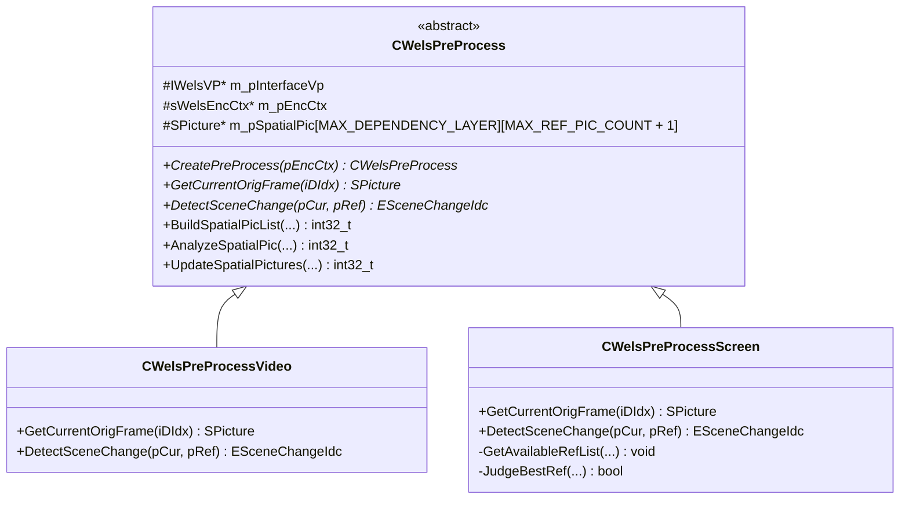

# OpenH264 Video Pre-Processing Subsystem: `wels_preprocess.h`

This document provides a comprehensive, literate-programming-style analysis of the OpenH264 video pre-processing subsystem defined in [wels_preprocess.h](openh264/codec/encoder/core/inc/wels_preprocess.h) and implemented in [wels_preprocess.cpp](openh264/codec/encoder/core/src/wels_preprocess.cpp).

---

## Table of Contents
1. [Architectural Role & Pipeline Overview](#1-architectural-role--pipeline-overview)
2. [Data Structures & Type Definitions](#2-data-structures--type-definitions)
   - [2.1 Scaled_Picture](#21-scaled_picture)
   - [2.2 SRefJudgement](#22-srefjudgement)
   - [2.3 SRefInfoParam](#23-srefinfoparam)
   - [2.4 SVAAFrameInfo (TagVAAFrameInfo)](#24-svaaframeinfo-tagvaaframeinfo)
   - [2.5 SVAAFrameInfoExt (SVAAFrameInfoExt_t)](#25-svaaframeinfoext-svaaframeinfoext_t)
   - [2.6 Related Processing Interface Types (`IWelsVP.h`)](#26-related-processing-interface-types-iwelsvph)
3. [Global Constants & Helper Routines](#3-global-constants--helper-routines)
4. [Class Hierarchy & Polymorphism](#4-class-hierarchy--polymorphism)
5. [Deep-Dive: CWelsPreProcess (Base Class)](#5-deep-dive-cwelspreprocess-base-class)
   - [5.1 Member Variables & State Storage](#51-member-variables--state-storage)
   - [5.2 Lifecycle Management & Factory Construction](#52-lifecycle-management--factory-construction)
   - [5.3 Frame Ingestion & Downsampling Pipeline](#53-frame-ingestion--downsampling-pipeline)
   - [5.4 Video Analysis & Assessment (VAA) Pipeline](#54-video-analysis--assessment-vaa-pipeline)
   - [5.5 Picture Buffer Indexing & Memory Management](#55-picture-buffer-indexing--memory-management)
6. [Deep-Dive: CWelsPreProcessVideo (Natural Video Preprocessing)](#6-deep-dive-cwelspreprocessvideo-natural-video-preprocessing)
7. [Deep-Dive: CWelsPreProcessScreen (Screen Content Preprocessing)](#7-deep-dive-cwelspreprocessscreen-screen-content-preprocessing)
   - [7.1 Screen Reference Picture Candidate Search](#71-screen-reference-picture-candidate-search)
   - [7.2 Reference Judgement Heuristics](#72-reference-judgement-heuristics)
   - [7.3 Screen Scene Change & Scroll Detection](#73-screen-scene-change--scroll-detection)
8. [Mathematical Formulations & Algorithmic Invariants](#8-mathematical-formulations--algorithmic-invariants)
9. [SIMD Optimization & Memory Alignment Constraints](#9-simd-optimization--memory-alignment-constraints)

---

## 1. Architectural Role & Pipeline Overview

The video pre-processing subsystem in OpenH264 serves as the critical bridge between raw incoming video frames (supplied via the public API in various color formats or crop windows) and the downstream encoding core (Rate Control, Motion Estimation, and Mode Decision).

```mermaid
flowchart TD
    RawInput[Raw Video Source Frame<br/>SSourcePicture: I420] --> MoveMem[Memory Ingestion & Cropping<br/>WelsMoveMemoryWrapper]
    MoveMem --> Denoise[Bilateral Denoising<br/>METHOD_DENOISE]
    Denoise --> Downsample[Polyphase / Bilinear Downsampling<br/>Scaled_Picture Pyramid]
    Downsample --> PaddingOp[Chroma & Luma Edge Padding<br/>Padding]
    
    subgraph VAA Pipeline [Video Analysis & Assessment (VAA)]
        PaddingOp --> VAAStats[VAA Statistics Calculation<br/>SAD, SSD, Variance]
        VAAStats --> SCD[Scene Change Detection<br/>DetectSceneChange]
        VAAStats --> BGD[Background MB Detection<br/>BackgroundDetection]
        VAAStats --> AQ[Adaptive Quantization<br/>AdaptiveQuantCalculation]
        VAAStats --> ScreenOpt[SCC Scroll & LTR Reference Selection<br/>CWelsPreProcessScreen]
    end
    
    SCD --> RC[Rate Control Engine<br/>SWelsSvcRc]
    AQ --> MD[Mode Decision & RDO<br/>WelsModeDecision]
    ScreenOpt --> ME[Motion Estimation<br/>SWelsME]
```

### Key Responsibilities
1. **Source Buffer Ingestion & Cropping**: Ingests raw planar `I420` image buffers ([SSourcePicture](openh264/codec/encoder/core/inc/picture.h)), handles user-specified crop rectangles (`SUsedPicRect`), and verifies stride/dimension boundaries.
2. **Spatial Scalability Pyramid Generation**: Generates multi-resolution spatial dependency layers ($D_0, D_1, \dots, D_{N-1}$) via high-performance SIMD-accelerated downsamplers.
3. **Bilateral Denoising**: Removes sensor noise while preserving sharp object edges.
4. **Video Analysis & Assessment (VAA)**:
   - Computes $8 \times 8$ and $16 \times 16$ block-level Sum of Absolute Differences (SAD), Sum of Squared Differences (SSD), and variances.
   - Evaluates frame complexity metrics passed directly into the Rate Control ([SWelsSvcRc](openh264/codec/encoder/core/inc/rc.h)) module.
   - Detects static background macroblocks (BGD) to avoid redundant encoding.
   - Derives macroblock-level Adaptive Quantization (AQ) delta-QP maps based on local motion and spatial texture complexity.
5. **Screen Content Coding (SCC) Optimization**:
   - Detects full-frame and windowed screen scrolling motion vectors.
   - Evaluates multi-reference candidates across Long-Term Reference (LTR) and Short-Term Reference (STR) pictures to select the optimal prediction base frame for desktop sharing and screen capture scenarios.

---

## 2. Data Structures & Type Definitions

All pre-processing data structures reside within the `WelsEnc` namespace in [wels_preprocess.h](openh264/codec/encoder/core/inc/wels_preprocess.h).

### 2.1 Scaled_Picture

[Scaled_Picture](openh264/codec/encoder/core/inc/wels_preprocess.h#L57-L61) manages temporary intermediate pictures when the input resolution does not directly match the target spatial layer resolution or requires aspect-ratio-preserving intermediate scaling.

```cpp
typedef struct {
  SPicture*     pScaledInputPicture;
  int32_t       iScaledWidth[MAX_DEPENDENCY_LAYER];
  int32_t       iScaledHeight[MAX_DEPENDENCY_LAYER];
} Scaled_Picture;
```

| Field Name | Type | Description |
| :--- | :--- | :--- |
| `pScaledInputPicture` | [SPicture*](openh264/codec/encoder/core/inc/picture.h) | Pointer to the allocated intermediate picture buffer used when scaling from input resolution to the highest spatial dependency layer. |
| `iScaledWidth` | `int32_t[MAX_DEPENDENCY_LAYER]` | Array of scaled intermediate widths for each spatial dependency layer index ($0 \dots \text{MAX\_DEPENDENCY\_LAYER}-1$). |
| `iScaledHeight` | `int32_t[MAX_DEPENDENCY_LAYER]` | Array of scaled intermediate heights for each spatial dependency layer index. |

- **Memory Lifecycle**: Allocated in `WelsInitScaledPic()` using [CMemoryAlign](openh264/codec/common/inc/memory_align.h) and freed in `FreeScaledPic()`.

---

### 2.2 SRefJudgement

[SRefJudgement](openh264/codec/encoder/core/inc/wels_preprocess.h#L64-L71) stores comparative complexity and quantization thresholds used during screen content reference frame candidate evaluation.

```cpp
typedef struct {
  int64_t iMinFrameComplexity;
  int64_t iMinFrameComplexity08;
  int64_t iMinFrameComplexity11;

  int32_t iMinFrameNumGap;
  int32_t iMinFrameQp;
} SRefJudgement;
```

| Field Name | Type | Purpose / Mathematical Role |
| :--- | :--- | :--- |
| `iMinFrameComplexity` | `int64_t` | Minimum frame residual complexity metric ($C_{\min}$) observed among evaluated reference candidates. |
| `iMinFrameComplexity08` | `int64_t` | Precomputed $0.8 \times C_{\min}$ threshold: static cast of `(int32_t)(iComplexity * 0.8)`. |
| `iMinFrameComplexity11` | `int64_t` | Precomputed $1.1 \times C_{\min}$ threshold: static cast of `(int32_t)(iComplexity * 1.1)`. |
| `iMinFrameNumGap` | `int32_t` | Frame number distance gap (initialized to `INT_MAX`). |
| `iMinFrameQp` | `int32_t` | Average frame quantization parameter ($QP_{\min}$) of the best candidate frame. |

---

### 2.3 SRefInfoParam

[SRefInfoParam](openh264/codec/encoder/core/inc/wels_preprocess.h#L73-L78) encapsulates candidate reference picture metadata evaluated by the screen content reference selection algorithm.

```cpp
typedef struct {
  SPicture*       pRefPicture;
  int32_t         iSrcListIdx;   // idx in h->spatial_pic[base_did];
  bool            bSceneLtrFlag;
  unsigned char*  pBestBlockStaticIdc;
} SRefInfoParam;
```

| Field Name | Type | Description |
| :--- | :--- | :--- |
| `pRefPicture` | [SPicture*](openh264/codec/encoder/core/inc/picture.h) | Pointer to the candidate reference picture in the spatial picture list. |
| `iSrcListIdx` | `int32_t` | Index of the picture within the spatial picture array `m_pSpatialPic[base_did]`. |
| `bSceneLtrFlag` | `bool` | Flag indicating whether this candidate picture is marked as a Long-Term Scene Reference (`bIsSceneLTR`). |
| `pBestBlockStaticIdc` | `unsigned char*` | Pointer to the static macroblock classification map for this reference picture. |

---

### 2.4 SVAAFrameInfo (TagVAAFrameInfo)

[SVAAFrameInfo](openh264/codec/encoder/core/inc/wels_preprocess.h#L80-L104) is the core container for video analysis and assessment metrics across the current frame.

```cpp
typedef struct TagVAAFrameInfo {
  SVAACalcResult             sVaaCalcInfo;
  SAdaptiveQuantizationParam sAdaptiveQuantParam;
  SComplexityAnalysisParam   sComplexityAnalysisParam;

  int32_t       iPicWidth;          // maximal iWidth of picture in samples for svc coding
  int32_t       iPicHeight;         // maximal iHeight of picture in samples for svc coding
  int32_t       iPicStride;         // luma stride
  int32_t       iPicStrideUV;       // chroma stride

  uint8_t*      pRefY;              // Reference luma plane pointer
  uint8_t*      pCurY;              // Current luma plane pointer
  uint8_t*      pRefU;              // Reference U chroma plane pointer
  uint8_t*      pCurU;              // Current U chroma plane pointer
  uint8_t*      pRefV;              // Reference V chroma plane pointer
  uint8_t*      pCurV;              // Current V chroma plane pointer

  int8_t*       pVaaBackgroundMbFlag;
  uint8_t       uiValidLongTermPicIdx;
  uint8_t       uiMarkLongTermPicIdx;

  ESceneChangeIdc eSceneChangeIdc;
  bool          bSceneChangeFlag;
  bool          bIdrPeriodFlag;
} SVAAFrameInfo;
```

| Member | Type | Detailed Description |
| :--- | :--- | :--- |
| `sVaaCalcInfo` | `SVAACalcResult` | Block-level VAA statistics: $8 \times 8$ SADs (`pSad8x8`), $16 \times 16$ SSDs (`pSsd16x16`), sums (`pSum16x16`), sums of squares (`pSumOfSquare16x16`), mean absolute differences (`pMad8x8`), and total frame SAD (`iFrameSad`). |
| `sAdaptiveQuantParam` | `SAdaptiveQuantizationParam` | Configuration and output buffers for macroblock-level Adaptive Quantization delta-QP calculation. |
| `sComplexityAnalysisParam` | `SComplexityAnalysisParam` | Frame and Group-of-MB (GOM) complexity analysis parameters used by Rate Control. |
| `iPicWidth`, `iPicHeight` | `int32_t` | Luma dimensions of the picture in pixel samples. |
| `iPicStride`, `iPicStrideUV` | `int32_t` | Line strides (in bytes) for luma ($Y$) and chroma ($U/V$) planes. |
| `pRefY`, `pCurY`, `pRefU`, ... | `uint8_t*` | Direct plane pointers to current and reference image sample buffers. |
| `pVaaBackgroundMbFlag` | `int8_t*` | Array of macroblock flags ($1 = \text{static background}$, $0 = \text{motion block}$). |
| `uiValidLongTermPicIdx` | `uint8_t` | Index offset for accessing active LTR reference pictures. |
| `uiMarkLongTermPicIdx` | `uint8_t` | Index offset for marking newly acknowledged LTR pictures. |
| `eSceneChangeIdc` | `ESceneChangeIdc` | Scene classification enum: `SIMILAR_SCENE`, `MEDIUM_CHANGED_SCENE`, or `LARGE_CHANGED_SCENE`. |
| `bSceneChangeFlag` | `bool` | Boolean flag set to `true` when `eSceneChangeIdc == LARGE_CHANGED_SCENE`. |
| `bIdrPeriodFlag` | `bool` | Flag indicating whether the current frame falls on an IDR keyframe intra period boundary. |

---

### 2.5 SVAAFrameInfoExt (SVAAFrameInfoExt_t)

[SVAAFrameInfoExt](openh264/codec/encoder/core/inc/wels_preprocess.h#L106-L116) extends `SVAAFrameInfo` with dedicated state structures required for Screen Content Coding (SCC).

```cpp
typedef struct SVAAFrameInfoExt_t: public SVAAFrameInfo {
  SComplexityAnalysisScreenParam sComplexityScreenParam;
  SScrollDetectionParam          sScrollDetectInfo;
  SRefInfoParam                  sVaaStrBestRefCandidate[MAX_REF_PIC_COUNT];
  SRefInfoParam                  sVaaLtrBestRefCandidate[MAX_REF_PIC_COUNT];
  int32_t                        iNumOfAvailableRef;

  int32_t                        iVaaBestRefFrameNum;
  uint8_t*                       pVaaBestBlockStaticIdc; // pointer
  uint8_t*                       pVaaBlockStaticIdc[16];  // real memory
} SVAAFrameInfoExt;
```

- **Inheritance**: Derived directly from `SVAAFrameInfo`.
- **Screen Complexity Analysis**: Contains `sComplexityScreenParam` for GOM-level screen complexity assessment.
- **Scroll Detection**: Contains `sScrollDetectInfo` ([SScrollDetectionParam](openh264/codec/processing/interface/IWelsVP.h#L155-L161)) providing detected scroll motion vectors (`iScrollMvX`, `iScrollMvY`) and scroll detection flags.
- **Multi-Reference Candidates**: Tracks best Short-Term Reference candidates (`sVaaStrBestRefCandidate`) and Long-Term Reference candidates (`sVaaLtrBestRefCandidate`).

---

### 2.6 Related Processing Interface Types (`IWelsVP.h`)

The preprocessing module interfaces with the external video processor plugin library via [IWelsVP.h](openh264/codec/processing/interface/IWelsVP.h):

| Type / Enum | Values / Definition | Purpose |
| :--- | :--- | :--- |
| `EMethods` | `METHOD_DENOISE`, `METHOD_DOWNSAMPLE`, `METHOD_VAA_STATISTICS`, `METHOD_BACKGROUND_DETECTION`, `METHOD_ADAPTIVE_QUANT`, `METHOD_COMPLEXITY_ANALYSIS`, `METHOD_COMPLEXITY_ANALYSIS_SCREEN`, `METHOD_SCROLL_DETECTION`, `METHOD_SCENE_CHANGE_DETECTION_VIDEO`, `METHOD_SCENE_CHANGE_DETECTION_SCREEN` | Method identifiers dispatched to `IWelsVP::Process()`, `IWelsVP::Set()`, and `IWelsVP::Get()`. |
| `ESceneChangeIdc` | `SIMILAR_SCENE = 0`, `MEDIUM_CHANGED_SCENE = 1`, `LARGE_CHANGED_SCENE = 2` | Frame-level scene change classification result. |
| `EStaticBlockIdc` | `NO_STATIC = 0`, `COLLOCATED_STATIC = 1`, `SCROLLED_STATIC = 2` | Per-macroblock static motion classification. |
| `SPixMap` | Pixel plane pointers `pPixel[3]`, strides `iStride[3]`, rectangle `sRect`, format `eFormat` (`VIDEO_FORMAT_I420`). | Standard image plane descriptor passed to `IWelsVP` processing routines. |

---

## 3. Global Constants & Helper Routines

In [wels_preprocess.cpp](openh264/codec/encoder/core/src/wels_preprocess.cpp#L41-L81):

### A. Temporal Reference Index Table
```cpp
const uint8_t g_kuiRefTemporalIdx[MAX_TEMPORAL_LEVEL][MAX_GOP_SIZE] = {
  {  0, },                               // Temporal Level 0
  {  0,  0, },                           // Temporal Level 1
  {  0,  0,  0,  1, },                   // Temporal Level 2
  {  0,  0,  0,  2,  0,  1,  1,  2, },   // Temporal Level 3
};
```
- **Purpose**: Maps the current hierarchical GOP coding index (`iCodingIndex & (uiGopSize - 1)`) to the relative temporal reference index within the spatial picture queue.

### B. End-of-Line Padding Zero Initialization
```cpp
void ClearEndOfLinePadding (uint8_t* pData, int32_t iStride, int32_t iWidth, int32_t iHeight);
```
- **Rationale**: x86 SIMD downsampling routines (SSE2/AVX2) load vector registers (128-bit or 256-bit) that read slightly past `iWidth` into the line padding area up to `iStride`. `ClearEndOfLinePadding` explicitly zeroes out bytes in $[iWidth, iStride)$ across all rows to prevent uninitialized memory reads under Valgrind / MemorySanitizer.

### C. Fast Planar Memory Copy
```cpp
void WelsMoveMemory_c (
    uint8_t* pDstY, uint8_t* pDstU, uint8_t* pDstV,
    int32_t iDstStrideY, int32_t iDstStrideU, int32_t iDstStrideV,
    uint8_t* pSrcY, uint8_t* pSrcU, uint8_t* pSrcV,
    int32_t iSrcStrideY, int32_t iSrcStrideU, int32_t iSrcStrideV,
    int32_t iWidth, int32_t iHeight
);
```
- Copies planar YUV 4:2:0 samples line-by-line from source to destination planes. Luma plane is copied at full resolution ($W \times H$), while $U$ and $V$ chroma planes are copied at half resolution ($\frac{W}{2} \times \frac{H}{2}$).

---

## 4. Class Hierarchy & Polymorphism

OpenH264 implements a polymorphic pre-processing architecture to distinguish standard camera video from screen content:



- **Factory Instantiation**:
  ```cpp
  CWelsPreProcess* CWelsPreProcess::CreatePreProcess (sWelsEncCtx* pEncCtx) {
    if (pEncCtx->pSvcParam->iUsageType == SCREEN_CONTENT_REAL_TIME)
      return WELS_NEW_OP (CWelsPreProcessScreen (pEncCtx), CWelsPreProcessScreen);
    else
      return WELS_NEW_OP (CWelsPreProcessVideo (pEncCtx), CWelsPreProcessVideo);
  }
  ```

---

## 5. Deep-Dive: CWelsPreProcess (Base Class)

### 5.1 Member Variables & State Storage

Defined in [wels_preprocess.h](openh264/codec/encoder/core/inc/wels_preprocess.h#L193-L208):

| Member Variable | Type | Visibility | Description |
| :--- | :--- | :--- | :--- |
| `m_pInterfaceVp` | `IWelsVP*` | `protected` | Pointer to the video processing plugin interface (`IWelsVP`). |
| `m_pEncCtx` | `sWelsEncCtx*` | `protected` | Pointer to the top-level encoder context ([sWelsEncCtx](openh264/codec/encoder/core/inc/encoder_context.h)). |
| `m_uiSpatialLayersInTemporal` | `uint8_t[MAX_DEPENDENCY_LAYER]` | `protected` | Number of temporal picture buffer slots allocated per spatial layer. |
| `m_pSpatialPic` | `SPicture*[MAX_DEPENDENCY_LAYER][MAX_REF_PIC_COUNT + 1]` | `protected` | 2D array of spatial pictures for downsampling and VAA analysis. Index `[d][0]` is reserved for the current frame; subsequent slots hold reference frames. |
| `m_iAvaliableRefInSpatialPicList` | `int32_t` | `protected` | Number of available reference pictures currently in the spatial picture list. |
| `m_sScaledPicture` | `Scaled_Picture` | `private` | Intermediate downscaling picture descriptor. |
| `m_pLastSpatialPicture` | `SPicture*[MAX_DEPENDENCY_LAYER][2]` | `private` | Double-buffered pointers (`[d][0]` = previous frame, `[d][1]` = current frame) per spatial layer. |
| `m_bInitDone` | `bool` | `private` | Flag indicating whether preprocessing buffers have been initialized. |
| `m_uiSpatialPicNum` | `uint8_t[MAX_DEPENDENCY_LAYER]` | `private` | Number of allocated picture buffers per spatial layer. |

---

### 5.2 Lifecycle Management & Factory Construction

1. **`WelsPreprocessCreate()`**:
   - Calls `WelsCreateVpInterface((void**)&m_pInterfaceVp, WELSVP_INTERFACE_VERION)` to initialize the underlying C/C++ or SIMD accelerated video processing engine.
2. **`WelsPreprocessDestroy()`**:
   - Calls `WelsDestroyVpInterface(m_pInterfaceVp, WELSVP_INTERFACE_VERION)` and resets `m_pInterfaceVp = NULL`.
3. **`AllocSpatialPictures(sWelsEncCtx* pCtx, SWelsSvcCodingParam* pParam)`**:
   - Iterates through all spatial layers ($0 \dots \text{iSpatialLayerNum}-1$).
   - Calculates the required temporal buffer count:
     $$N_{\text{temporal}} = 2 + \max(\text{iHighestTemporalId}, 1) + \text{iLTRRefNum}$$
   - Allocates [SPicture](openh264/codec/encoder/core/inc/picture.h) instances via `AllocPicture()` with 16/32-byte alignment.
4. **`FreeSpatialPictures(sWelsEncCtx* pCtx)`**:
   - Iterates through all spatial picture slots and releases picture buffers via `FreePicture()`.

---

### 5.3 Frame Ingestion & Downsampling Pipeline

#### `BuildSpatialPicList(sWelsEncCtx* pCtx, const SSourcePicture* kpSrcPic, int32_t* pSpatialNum)`
Top-level entry point called per input frame before encoding:
1. Aligns input dimensions to even pixel boundaries ($W_{\text{even}} = (W \gg 1) \ll 1$).
2. Validates or initializes preprocessing state via `WelsPreprocessReset()`.
3. Resets scene change and IDR flags (`bSceneChangeFlag = bIdrPeriodFlag = false`).
4. Invokes `SingleLayerPreprocess()` to perform color ingestion, denoising, downsampling, and spatial index mapping.

#### `SingleLayerPreprocess(...)`
1. **Memory Ingestion**: Calls `WelsMoveMemoryWrapper()` to copy and crop the source `SSourcePicture` into the highest spatial layer's picture buffer.
2. **Denoising**: If `bEnableDenoise` is active, invokes `BilateralDenoising()` via `IWelsVP::Process(METHOD_DENOISE)`.
3. **Top Layer Downsampling**: Calls `DownsamplePadding()` to generate the target highest spatial layer picture.
4. **Scene Change Detection**: If `bEnableSceneChangeDetect` is active and the frame is not an IDR period frame, invokes `DetectSceneChange()`.
5. **Multi-Layer Downsampling Loop**: For multi-layer SVC configurations ($D > 1$), iterates downwards from layer $D-2$ down to $0$, calling `DownsamplePadding()` progressively to populate lower-resolution spatial layers.

#### `DownsamplePadding(...)`
Performs polyphase or bilinear downsampling from source `SPicture* pSrc` to destination `SPicture* pDstPic`:
- If dimensions match, copies data via `WelsMoveMemory_c()`.
- If dimensions differ, invokes `IWelsVP::Process(METHOD_DOWNSAMPLE, &sSrcPixMap, &sDstPicMap)`.
- Replicates boundary pixels or injects neutral chroma ($0x80$) via `Padding()`.

---

### 5.4 Video Analysis & Assessment (VAA) Pipeline

#### `AnalyzeSpatialPic(sWelsEncCtx* pCtx, const int32_t kiDidx)`
Orchestrates frame-level analysis for spatial layer `kiDidx`:
1. **Reference Frame Lookup**: Calls `GetBestRefPic()` to retrieve the appropriate reference picture based on temporal layer index or LTR status.
2. **VAA Statistics Calculation (`VaaCalculation`)**:
   - Dispatches `METHOD_VAA_STATISTICS` to `IWelsVP`.
   - Computes $8 \times 8$ SAD matrix, $16 \times 16$ SSD matrix, and $16 \times 16$ variance metrics.
3. **Background Detection (`BackgroundDetection`)**:
   - If `bEnableBackgroundDetection` is enabled, dispatches `METHOD_BACKGROUND_DETECTION`.
   - Populates `pVaaBackgroundMbFlag` to mark static macroblocks.
4. **Adaptive Quantization (`AdaptiveQuantCalculation`)**:
   - If `bEnableAdaptiveQuant` is active on $P$-slices, dispatches `METHOD_ADAPTIVE_QUANT`.
   - Computes delta-QP adjustments based on macroblock motion and spatial texture complexity.

#### `AnalyzePictureComplexity(sWelsEncCtx* pCtx, SPicture* pCurPicture, SPicture* pRefPicture, ...)`
Connects the VAA metrics to the Rate Control engine ([SWelsSvcRc](openh264/codec/encoder/core/inc/rc.h)):
- Modes: `FRAME_SAD` ($0$), `GOM_SAD` ($-1$), `GOM_VAR` ($-2$).
- Zeroes out and populates GOM foreground macroblock counts (`pGomForegroundBlockNum`) and GOM SAD arrays (`pCurrentFrameGomSad`).

---

### 5.5 Picture Buffer Indexing & Memory Management

- **`WelsExchangeSpatialPictures(SPicture** ppPic1, SPicture** ppPic2)`**: Atomic pointer swap helper for rotating reference picture buffers.
- **`UpdateSpatialPictures(sWelsEncCtx* pCtx, SWelsSvcCodingParam* pParam, const int8_t iCurTid, const int32_t kiDidx)`**: Updates spatial picture lists across temporal levels, swapping old reference buffers with current reconstructed frames.
- **`Padding(uint8_t* pSrcY, uint8_t* pSrcU, uint8_t* pSrcV, ...)`**: Fills extra padding lines when picture dimensions are not exact multiples of 16. Luma padding lines are zero-filled ($0$), while chroma padding planes are filled with neutral mid-gray ($0x80$).

---

## 6. Deep-Dive: CWelsPreProcessVideo (Natural Video Preprocessing)

[CWelsPreProcessVideo](openh264/codec/encoder/core/inc/wels_preprocess.h#L210-L218) specializes `CWelsPreProcess` for camera and natural video streams.

### `GetCurrentOrigFrame(int32_t iDIdx)`
Returns the current active original picture for spatial layer `iDIdx`:
```cpp
SPicture* CWelsPreProcessVideo::GetCurrentOrigFrame (int32_t iDIdx) {
  return m_pSpatialPic[iDIdx][GetCurPicPosition (iDIdx)];
}
```

### `DetectSceneChange(SPicture* pCurPicture, SPicture* pRefPicture)`
Detects scene transitions in natural video sequences:
1. Wraps `pCurPicture` and `pRefPicture` into [SPixMap](openh264/codec/processing/interface/IWelsVP.h#L112-L119) descriptors.
2. Invokes `m_pInterfaceVp->Process(METHOD_SCENE_CHANGE_DETECTION_VIDEO, &sSrcPixMap, &sRefPixMap)`.
3. Retrieves the resulting `SSceneChangeResult` structure.
4. Returns `LARGE_CHANGED_SCENE` if frame difference exceeds the adaptive threshold, prompting an immediate I-frame or scene reset.

---

## 7. Deep-Dive: CWelsPreProcessScreen (Screen Content Preprocessing)

[CWelsPreProcessScreen](openh264/codec/encoder/core/inc/wels_preprocess.h#L221-L246) specializes `CWelsPreProcess` for Screen Content Coding (SCC), real-time desktop sharing, and computer-generated graphics.

### 7.1 Screen Reference Picture Candidate Search

Screen content often contains static windows, repeated UI redraws, or scrolling documents. Rather than relying solely on the immediately preceding frame, `CWelsPreProcessScreen` searches across all available reference frames in `m_pSpatialPic`:

- **`GetAvailableRefListLosslessScreenRefSelection(...)`**: Searches reference pictures when Long-Term Reference (LTR) is enabled.
- **`GetAvailableRefList(...)`**: Searches standard Short-Term Reference pictures.

### 7.2 Reference Judgement Heuristics

The candidate reference frame evaluation is governed by [JudgeBestRef](openh264/codec/encoder/core/src/wels_preprocess.cpp#L1067-L1072):

$$\text{JudgeBestRef}(Ref) = \begin{cases} C_{\text{frame}} < 1.1 \cdot C_{\min} & \text{if closest LTR frame} \\ (C_{\text{frame}} < 0.8 \cdot C_{\min}) \lor (C_{\text{frame}} \le 1.1 \cdot C_{\min} \land QP_{\text{avg}} < QP_{\min}) & \text{otherwise} \end{cases}$$

```cpp
bool CWelsPreProcessScreen::JudgeBestRef (
    SPicture* pRefPic, const SRefJudgement& sRefJudgement,
    const int64_t iFrameComplexity, const bool bIsClosestLtrFrame) {
  return (bIsClosestLtrFrame ? (iFrameComplexity < sRefJudgement.iMinFrameComplexity11) :
          ((iFrameComplexity < sRefJudgement.iMinFrameComplexity08) ||
           ((iFrameComplexity <= sRefJudgement.iMinFrameComplexity11) &&
            (pRefPic->iFrameAverageQp < sRefJudgement.iMinFrameQp))));
}
```

- **Update Rule (`SaveBestRefToJudgement`)**:
  When a candidate passes `JudgeBestRef`, its complexity thresholds are recorded:
  $$C_{\min} = C_{\text{frame}}, \quad C_{0.8} = \lfloor 0.8 \cdot C_{\text{frame}} \rfloor, \quad C_{1.1} = \lfloor 1.1 \cdot C_{\text{frame}} \rfloor, \quad QP_{\min} = QP_{\text{avg}}$$

### 7.3 Screen Scene Change & Scroll Detection

In [DetectSceneChange](openh264/codec/encoder/core/src/wels_preprocess.cpp#L1096-L1260):
1. **Scroll Detection (`METHOD_SCROLL_DETECTION`)**:
   - Evaluates whether the screen content has scrolled linearly.
   - Computes horizontal and vertical scroll motion vectors (`iScrollMvX`, `iScrollMvY`) and clamps them to $[-iMvRange, iMvRange]$.
2. **Negligible Motion Early Termination**:
   - Computes the negligible motion block threshold:
     $$N_{\text{negligible}} = \left\lfloor \frac{W}{8} \right\rfloor \times \left\lfloor \frac{H}{8} \right\rfloor \times 0.01$$
   - If the number of motion blocks $N_{\text{motion}} \le N_{\text{negligible}}$, candidate search terminates early.
3. **Scene Change Classification**:
   - If all available references exhibit large changes ($N_{\text{large}} = N_{\text{avail}}$), classifies as `LARGE_CHANGED_SCENE`.
   - If medium changes match available scene LTR count, classifies as `MEDIUM_CHANGED_SCENE`.
   - Otherwise, classifies as `SIMILAR_SCENE`.

---

## 8. Mathematical Formulations & Algorithmic Invariants

### 8.1 Aspect Ratio Preserving Intermediate Scaling

In [JudgeNeedOfScaling](openh264/codec/encoder/core/src/wels_preprocess.cpp#L490-L520), intermediate dimensions are computed to preserve source aspect ratio:

Given input dimensions $(W_{in}, H_{in})$ and target layer dimensions $(W_{dst}, H_{dst})$:
$$\text{Cross Product Test:} \quad \Delta = (W_{in} \cdot H_{dst}) - (H_{in} \cdot W_{dst})$$

- If $\Delta > 0$ (Input is wider than target aspect ratio):
  $$W_{scaled} = \max(W_{dst}, 4), \quad H_{scaled} = \max\left(\left\lfloor \frac{H_{in} \cdot W_{dst}}{W_{in}} \right\rfloor, 4\right)$$
- If $\Delta \le 0$ (Input is taller than or equal to target aspect ratio):
  $$W_{scaled} = \max\left(\left\lfloor \frac{W_{in} \cdot H_{dst}}{H_{in}} \right\rfloor, 4\right), \quad H_{scaled} = \max(H_{dst}, 4)$$

### 8.2 Chroma Subsampling & Border Padding

For YUV 4:2:0 planar buffers padded from $(W_{act}, H_{act})$ to $(W_{pad}, H_{pad})$:
- **Luma Plane ($Y$)**:
  $$Y(x, y) = 0 \quad \text{for } x \in [W_{act}, W_{pad}) \lor y \in [H_{act}, H_{pad})$$
- **Chroma Planes ($U, V$)**:
  $$U\left(\frac{x}{2}, \frac{y}{2}\right) = 0x80, \quad V\left(\frac{x}{2}, \frac{y}{2}\right) = 0x80 \quad \text{for } x \in [W_{act}, W_{pad}) \lor y \in [H_{act}, H_{pad})$$

---

## 9. SIMD Optimization & Memory Alignment Constraints

1. **Buffer Alignment**: All picture buffers managed by `CWelsPreProcess` are allocated using [CMemoryAlign](openh264/codec/common/inc/memory_align.h) with 16-byte (SSE) or 32-byte (AVX2) alignment.
2. **SIMD Vector Overrun Protection**:
   - `ClearEndOfLinePadding()` zeroes out the trailing buffer stride $[W, \text{Stride})$ to prevent Valgrind/ASan false positives when vector loads (e.g., `_mm_loadu_si128` or `vmovdqu`) read past the active line width.
3. **Hardware-Accelerated Kernels in `IWelsVP`**:
   - **Downsamplers**: Bilinear and polyphase filtering using 8-bit/16-bit SIMD multiply-accumulate instructions.
   - **VAA Calculation**: Fast $8 \times 8$ SAD and SSD accumulation using `psadbw` / NEON vector intrinsics.
   - **Bilateral Filtering**: Spatial domain smoothing and range weighting kernels vectorized across x86 and ARM ISAs.

---

## 10. Summary Verification Table

| Symbol / Method | Scope | File Links |
| :--- | :--- | :--- |
| `Scaled_Picture` | Struct | [wels_preprocess.h:L57](openh264/codec/encoder/core/inc/wels_preprocess.h#L57-L61) |
| `SRefJudgement` | Struct | [wels_preprocess.h:L64](openh264/codec/encoder/core/inc/wels_preprocess.h#L64-L71) |
| `SRefInfoParam` | Struct | [wels_preprocess.h:L73](openh264/codec/encoder/core/inc/wels_preprocess.h#L73-L78) |
| `SVAAFrameInfo` | Struct | [wels_preprocess.h:L80](openh264/codec/encoder/core/inc/wels_preprocess.h#L80-L104) |
| `SVAAFrameInfoExt` | Struct | [wels_preprocess.h:L106](openh264/codec/encoder/core/inc/wels_preprocess.h#L106-L116) |
| `CWelsPreProcess` | Class (Abstract Base) | [wels_preprocess.h:L118](openh264/codec/encoder/core/inc/wels_preprocess.h#L118-L208), [wels_preprocess.cpp](openh264/codec/encoder/core/src/wels_preprocess.cpp) |
| `CWelsPreProcessVideo` | Class (Concrete Derived) | [wels_preprocess.h:L210](openh264/codec/encoder/core/inc/wels_preprocess.h#L210-L218), [wels_preprocess.cpp:L600](openh264/codec/encoder/core/src/wels_preprocess.cpp#L600-L631) |
| `CWelsPreProcessScreen` | Class (Concrete Derived) | [wels_preprocess.h:L221](openh264/codec/encoder/core/inc/wels_preprocess.h#L221-L246), [wels_preprocess.cpp:L974](openh264/codec/encoder/core/src/wels_preprocess.cpp#L974-L1260) |
