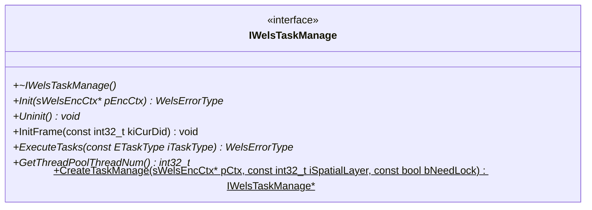
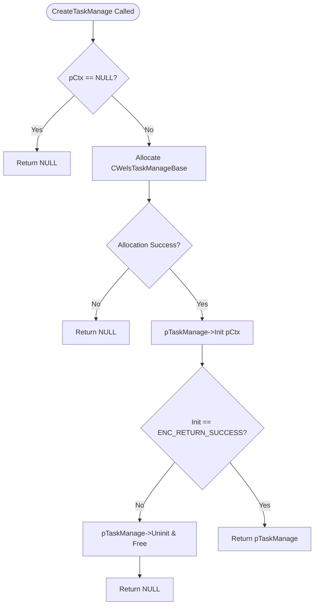
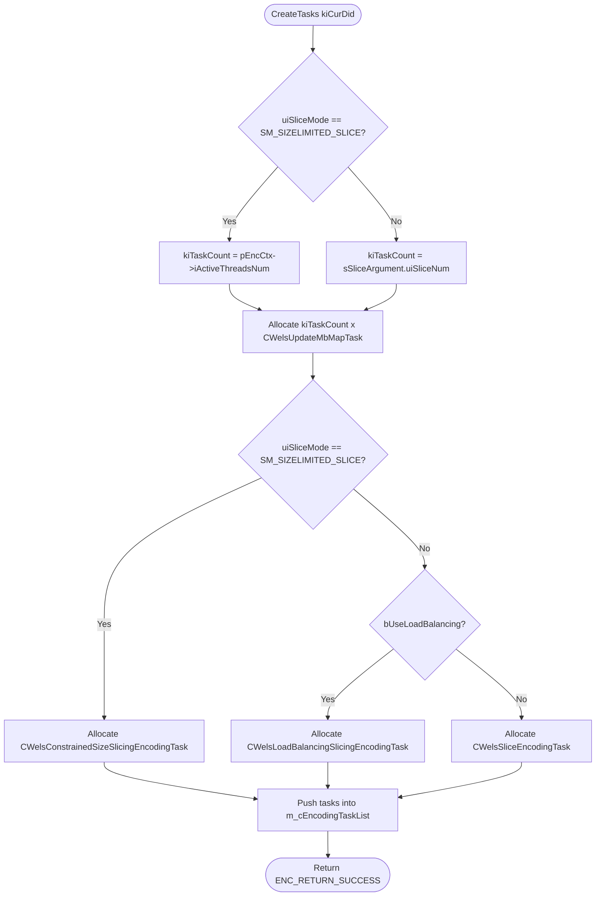
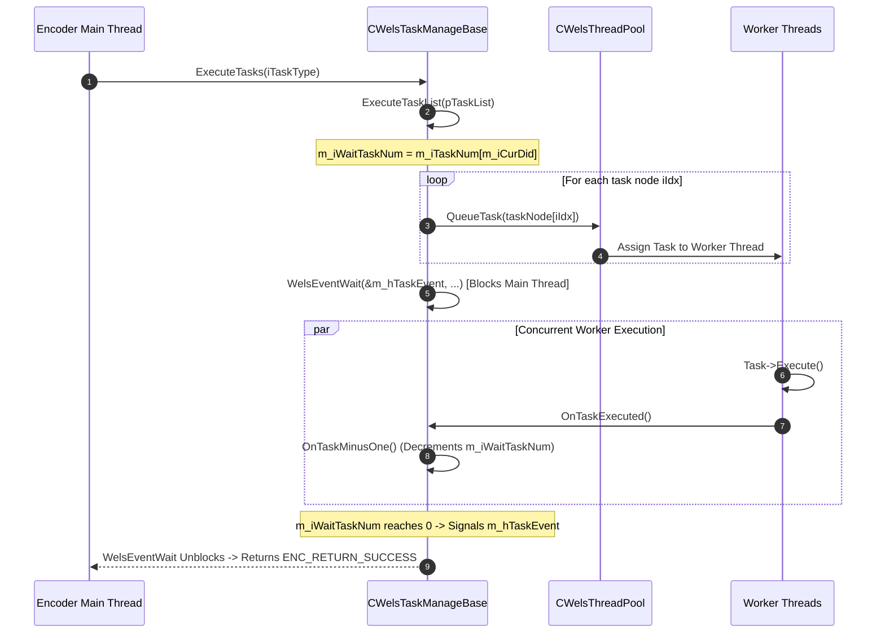

# Literate Documentation: `wels_task_management.cpp`

## 1. Module Overview & Architectural Role

The source file [wels_task_management.cpp](openh264/codec/encoder/core/src/wels_task_management.cpp) implements the task management subsystem for the OpenH264 video encoder core. It acts as the central coordinator between the video encoder's spatial/slice encoding pipeline and the underlying thread pool ([CWelsThreadPool](openh264/codec/common/inc/WelsThreadPool.h#L53-L116)).

In multi-threaded H.264 encoding, pictures or spatial dependency layers are partitioned into multiple independent slices or macroblock processing batches. The task management module abstracts the instantiation, dispatching, and barrier synchronization of these concurrent encoding operations across CPU cores.

```mermaid
flowchart TB
    subgraph Encoder Core Pipeline
        EncExt[encoder_ext.cpp / slice_multi_threading.cpp]
        EncCtx[sWelsEncCtx]
    end

    subgraph Task Management Subsystem [wels_task_management.cpp]
        ITaskManage[IWelsTaskManage Interface]
        TaskManageBase[CWelsTaskManageBase]
        TaskSink[IWelsTaskSink Callback Interface]
        
        TaskLists[Task Lists per Layer: m_pcAllTaskList]
        TaskEvent[Barrier Sync: WELS_EVENT m_hTaskEvent]
    end

    subgraph Concrete Encoder Tasks [wels_task_encoder.h]
        UpdateMbMapTask[CWelsUpdateMbMapTask]
        SliceEncTask[CWelsSliceEncodingTask]
        LoadBalTask[CWelsLoadBalancingSlicingEncodingTask]
        ConstrainedTask[CWelsConstrainedSizeSlicingEncodingTask]
    end

    subgraph Threading Infrastructure [codec/common]
        ThreadPool[CWelsThreadPool Singleton]
        WorkerThreads[CWelsTaskThread Workers]
    end

    EncExt -->|Creates & Drives| ITaskManage
    ITaskManage <|.. TaskManageBase
    TaskManageBase ..|> TaskSink
    TaskManageBase -->|Maintains| TaskLists
    TaskLists -->|Contains| UpdateMbMapTask
    TaskLists -->|Contains| SliceEncTask
    TaskLists -->|Contains| LoadBalTask
    TaskLists -->|Contains| ConstrainedTask
    
    TaskManageBase -->|QueueTask| ThreadPool
    ThreadPool -->|Dispatches to| WorkerThreads
    WorkerThreads -->|Executes Tasks & Notifies| TaskSink
    TaskSink -->|OnTaskExecuted / OnTaskCancelled| TaskEvent
```

### Key Architectural Responsibilities

1. **Task Instantiation & Polymorphism**: Allocates concrete task objects tailored to the active spatial layer's slicing configuration (`SM_SIZELIMITED_SLICE`, `SM_FIXEDSLCNUM_SLICE`, `SM_RASTER_SLICE`, or load-balanced slicing).
2. **Thread Pool Lifecycle Integration**: Manages reference counting (`AddReference()` / `RemoveInstance()`) and worker thread sizing (`SetThreadNum()`) on the shared thread pool singleton [CWelsThreadPool](openh264/codec/common/inc/WelsThreadPool.h#L53-L116).
3. **Multi-Layer Task Partitioning**: Organizes tasks in a two-dimensional matrix indexed by task category ([ETaskType](openh264/codec/encoder/core/inc/wels_task_base.h#L53-L61)) and spatial dependency layer ID ($iDid \in [0, \text{MAX\_DEPENDENCY\_LAYER}-1]$).
4. **Barrier Synchronization**: Implements thread-safe rendezvous semantics using OS synchronization primitives ([WELS_EVENT](openh264/codec/common/inc/WelsThreadLib.h) and [WELS_MUTEX](openh264/codec/common/inc/WelsThreadLib.h)) to block the main encoder thread until all slice worker threads complete their sub-tasks.

---

## 2. Classes, Interfaces, Typedefs, and Data Structures

### 2.1 Type Definitions and Constants

#### `TASKLIST_TYPE`
Defined in [wels_task_management.h](openh264/codec/encoder/core/inc/wels_task_management.h#L70):
```cpp
typedef CWelsNonDuplicatedList<CWelsBaseTask> TASKLIST_TYPE;
```
* **Description**: A non-duplicated singly linked list template class specialized for [CWelsBaseTask](openh264/codec/encoder/core/inc/wels_task_base.h#L51-L70) pointers. It prevents identical task pointers from being queued multiple times and provides O(1) front/back manipulation (`push_back`, `pop_front`, `begin`, `getNode`).

#### `CWelsBaseTask::ETaskType`
Defined in [wels_task_base.h](openh264/codec/encoder/core/inc/wels_task_base.h#L53-L61):
```cpp
enum ETaskType {
  WELS_ENC_TASK_ENCODING                    = 0,
  WELS_ENC_TASK_ENCODE_FIXED_SLICE          = WELS_ENC_TASK_ENCODING,
  WELS_ENC_TASK_ENCODE_SLICE_LOADBALANCING  = WELS_ENC_TASK_ENCODING,
  WELS_ENC_TASK_ENCODE_SLICE_SIZECONSTRAINED= WELS_ENC_TASK_ENCODING,
  WELS_ENC_TASK_UPDATEMBMAP                 = 1,
  WELS_ENC_TASK_PREPROCESS                  = 2,
  WELS_ENC_TASK_ALL                         = 3,
};
```
* **`WELS_ENC_TASK_ENCODING` (0)**: Primary macroblock and slice parallel encoding tasks.
* **`WELS_ENC_TASK_UPDATEMBMAP` (1)**: Macroblock map adjustment tasks when slice boundaries are dynamically recalculated.
* **`WELS_ENC_TASK_PREPROCESS` (2)**: Reserved for pre-processing / frame analysis tasks.
* **`WELS_ENC_TASK_ALL` (3)**: Dimension boundary for the task lookup matrix `m_pcAllTaskList`.

---

### 2.2 Class `IWelsTaskManage`

Declared in [wels_task_management.h](openh264/codec/encoder/core/inc/wels_task_management.h#L51-L65).

`IWelsTaskManage` is the abstract interface defining the operations required for encoder task management.



#### Member Functions

| Function Signature | Return Type | Description |
| :--- | :--- | :--- |
| `virtual ~IWelsTaskManage()` | `void` | Virtual destructor ensuring polymorphic cleanup of derived task manager instances. |
| `virtual WelsErrorType Init (sWelsEncCtx* pEncCtx) = 0` | `WelsErrorType` | Pure virtual method to initialize the task manager, thread pool, and task lists. |
| `virtual void Uninit() = 0` | `void` | Pure virtual method to release tasks and tear down thread pool references. |
| `virtual void InitFrame (const int32_t kiCurDid)` | `void` | Virtual hook invoked before encoding a frame/spatial layer (default no-op). |
| `virtual WelsErrorType ExecuteTasks (const CWelsBaseTask::ETaskType iTaskType)` | `WelsErrorType` | Pure virtual method to enqueue and execute tasks of the specified type. |
| `virtual int32_t GetThreadPoolThreadNum() = 0` | `int32_t` | Returns the number of worker threads active in the thread pool. |
| `static IWelsTaskManage* CreateTaskManage (sWelsEncCtx* pCtx, const int32_t iSpatialLayer, const bool bNeedLock)` | `IWelsTaskManage*` | Static factory method instantiating and initializing the default concrete task manager. |

---

### 2.3 Class `CWelsTaskManageBase`

Declared in [wels_task_management.h](openh264/codec/encoder/core/inc/wels_task_management.h#L68-L120) and implemented in [wels_task_management.cpp](openh264/codec/encoder/core/src/wels_task_management.cpp#L76-L259).

`CWelsTaskManageBase` inherits from `IWelsTaskManage` and `WelsCommon::IWelsTaskSink`. It is the primary production implementation of the task manager in OpenH264.

#### Member Variables

| Variable Name | Type | Description & Lifecycle Invariants |
| :--- | :--- | :--- |
| `m_pEncCtx` | `sWelsEncCtx*` | Pointer to the top-level encoder context ([sWelsEncCtx](openh264/codec/encoder/core/inc/encoder_context.h#L116-L238)). Non-owning reference passed in `Init()`. |
| `m_pThreadPool` | `WelsCommon::CWelsThreadPool*` | Pointer to the shared thread pool singleton instance obtained via `CWelsThreadPool::AddReference()`. |
| `m_pcAllTaskList` | `TASKLIST_TYPE* [3][4]` | 2D matrix indexed by `[ETaskType][iDid]` providing fast lookup for task list pointers. Dimension: `WELS_ENC_TASK_ALL` (3) $\times$ `MAX_DEPENDENCY_LAYER` (4). |
| `m_cEncodingTaskList` | `TASKLIST_TYPE* [4]` | Array of pointers to heap-allocated `TASKLIST_TYPE` lists holding slice encoding tasks for each dependency layer. |
| `m_cPreEncodingTaskList` | `TASKLIST_TYPE* [4]` | Array of pointers to heap-allocated `TASKLIST_TYPE` lists holding pre-encoding tasks (e.g. MB map update) for each dependency layer. |
| `m_iTaskNum` | `int32_t [4]` | Number of tasks created and registered for each spatial dependency layer. |
| `m_iThreadNum` | `int32_t` | Target number of threads configured for parallel encoding (from `pSvcParam->iMultipleThreadIdc`). |
| `m_iWaitTaskNum` | `int32_t` | Atomic/synchronized counter tracking the number of tasks currently in-flight during a batch execution. |
| `m_hTaskEvent` | `WELS_EVENT` | Platform-abstracted event handle used to signal completion of all queued tasks to the waiting main thread. |
| `m_hEventMutex` | `WELS_MUTEX` | Platform-abstracted mutex protecting the condition variable / event wait operations. |
| `m_cWaitTaskNumLock` | `WelsCommon::CWelsLock` | Critical section / mutex lock protecting modifications to `m_iWaitTaskNum` in completion callbacks. |
| `m_iCurDid` | `int32_t` | Current spatial dependency layer index ($0 \le iDid < \text{MAX\_DEPENDENCY\_LAYER}$) active during frame encoding. |

---

### 2.4 Class `CWelsTaskManageOne`

Declared in [wels_task_management.h](openh264/codec/encoder/core/inc/wels_task_management.h#L122-L131) and implemented in [wels_task_management.cpp](openh264/codec/encoder/core/src/wels_task_management.cpp#L262-L275).

A specialized subclass of `CWelsTaskManageBase` designed for single-threaded testing and synchronous validation.

* Bypasses the asynchronous thread pool.
* Executes slice tasks sequentially on the calling thread.
* Returns `1` from `GetThreadPoolThreadNum()`.

---

## 3. Deep Dive: Methods and Functions

### 3.1 Factory Function: `IWelsTaskManage::CreateTaskManage`

```cpp
IWelsTaskManage* IWelsTaskManage::CreateTaskManage (sWelsEncCtx* pCtx, const int32_t iSpatialLayer,
    const bool bNeedLock)
```
Implemented in [wels_task_management.cpp:L58-L73](openh264/codec/encoder/core/src/wels_task_management.cpp#L58-L73).

#### Signature & Parameters
* **`pCtx`** (`sWelsEncCtx*`): Pointer to the main encoder context structure. Must not be `NULL`.
* **`iSpatialLayer`** (`const int32_t`): Number of configured spatial dependency layers (unused in the base factory, available for future layer filtering).
* **`bNeedLock`** (`const bool`): Lock flag parameter.
* **Return Value**: Pointer to an initialized `IWelsTaskManage` object, or `NULL` if allocation or initialization fails.

#### Execution Flow & Logic
1. **Validation**: Checks if `pCtx == NULL`. If so, returns `NULL` immediately.
2. **Allocation**: Dynamically allocates a new `CWelsTaskManageBase` instance using the memory macro `WELS_NEW_OP(CWelsTaskManageBase(), CWelsTaskManageBase)`.
3. **Initialization**: Calls `pTaskManage->Init(pCtx)`.
4. **Error Recovery**: If `Init()` returns any error code other than `ENC_RETURN_SUCCESS`:
   - Invokes `pTaskManage->Uninit()`.
   - Frees allocated memory with `WELS_DELETE_OP(pTaskManage)`.
   - Returns `NULL`.
5. **Success**: Returns the initialized `IWelsTaskManage*` pointer.



---

### 3.2 Constructor: `CWelsTaskManageBase::CWelsTaskManageBase`

```cpp
CWelsTaskManageBase::CWelsTaskManageBase()
```
Implemented in [wels_task_management.cpp:L76-L89](openh264/codec/encoder/core/src/wels_task_management.cpp#L76-L89).

#### Execution Details
1. **Member Initializer List**:
   - `m_pEncCtx = NULL`
   - `m_pThreadPool = NULL`
   - `m_iWaitTaskNum = 0`
2. **Task List Allocation**:
   - Iterates through all spatial dependency layers $iDid \in [0, \text{MAX\_DEPENDENCY\_LAYER}-1]$ (where $\text{MAX\_DEPENDENCY\_LAYER} = 4$).
   - Sets `m_iTaskNum[iDid] = 0`.
   - Instantiates a new heap-allocated `TASKLIST_TYPE` for `m_cEncodingTaskList[iDid]`.
   - Instantiates a new heap-allocated `TASKLIST_TYPE` for `m_cPreEncodingTaskList[iDid]`.
3. **Synchronization Initialization**:
   - Calls `WelsEventOpen(&m_hTaskEvent)` to create the OS synchronization event primitive.
   - Calls `WelsMutexInit(&m_hEventMutex)` to initialize the event mutex.

---

### 3.3 Destructor: `CWelsTaskManageBase::~CWelsTaskManageBase`

```cpp
CWelsTaskManageBase::~CWelsTaskManageBase()
```
Implemented in [wels_task_management.cpp:L91-L94](openh264/codec/encoder/core/src/wels_task_management.cpp#L91-L94).

* **Logic**: Explicitly delegates cleanup to `Uninit()`.

---

### 3.4 Method: `CWelsTaskManageBase::Init`

```cpp
WelsErrorType CWelsTaskManageBase::Init (sWelsEncCtx* pEncCtx)
```
Implemented in [wels_task_management.cpp:L96-L124](openh264/codec/encoder/core/src/wels_task_management.cpp#L96-L124).

#### Parameters & Return Value
* **`pEncCtx`** (`sWelsEncCtx*`): Pointer to the encoder context.
* **Return Value**: `WelsErrorType` (`ENC_RETURN_SUCCESS` (0) or `ENC_RETURN_MEMALLOCERR`).

#### Step-by-Step Implementation Analysis
1. **Context Binding & Thread Configuration**:
   - Stores `m_pEncCtx = pEncCtx`.
   - Extracts requested thread count: `m_iThreadNum = m_pEncCtx->pSvcParam->iMultipleThreadIdc`.
2. **Thread Pool Reference & Initialization**:
   - Calls `CWelsThreadPool::SetThreadNum(m_iThreadNum)` to configure the global pool capacity.
   - Calls `CWelsThreadPool::AddReference()` to increment the singleton reference count and retrieve the `m_pThreadPool` pointer.
   - If setting thread count does not return `ENC_RETURN_SUCCESS`, checks whether the actual thread count `m_pThreadPool->GetThreadNum()` matches `m_iThreadNum`. If not, logs a warning via `WelsLog(&pEncCtx->sLogCtx, WELS_LOG_WARNING, ...)`.
   - Verifies `m_pThreadPool != NULL`; returns `ENC_RETURN_MEMALLOCERR` if pool binding failed.
3. **Task List Mapping and Construction**:
   - Iterates through each spatial layer $iDid \in [0, \text{MAX\_DEPENDENCY\_LAYER}-1]$:
     ```cpp
     m_pcAllTaskList[CWelsBaseTask::WELS_ENC_TASK_ENCODING][iDid] = m_cEncodingTaskList[iDid];
     m_pcAllTaskList[CWelsBaseTask::WELS_ENC_TASK_UPDATEMBMAP][iDid] = m_cPreEncodingTaskList[iDid];
     iReturn |= CreateTasks (pEncCtx, iDid);
     ```
   - Invokes `CreateTasks(pEncCtx, iDid)` to allocate and populate concrete tasks for each dependency layer.
4. **Return**: Returns accumulated status code `iReturn`.

---

### 3.5 Method: `CWelsTaskManageBase::Uninit`

```cpp
void CWelsTaskManageBase::Uninit()
```
Implemented in [wels_task_management.cpp:L126-L141](openh264/codec/encoder/core/src/wels_task_management.cpp#L126-L141).

#### Destruction Pipeline
1. **Task Teardown**: Calls `DestroyTasks()` to deallocate all queued task objects across all spatial layers.
2. **Thread Pool Dereferencing**: If `m_pThreadPool != NULL`, invokes `m_pThreadPool->RemoveInstance()` to decrement the singleton reference count (and terminate worker threads if reference count reaches 0).
3. **Task List Deallocation**: Iterates through each layer $iDid$ and deletes `m_cEncodingTaskList[iDid]` and `m_cPreEncodingTaskList[iDid]`.
4. **Synchronization Teardown**:
   - Calls `WelsEventClose(&m_hTaskEvent)` to release the OS event primitive.
   - Calls `WelsMutexDestroy(&m_hEventMutex)` to destroy the event mutex.

---

### 3.6 Method: `CWelsTaskManageBase::CreateTasks`

```cpp
WelsErrorType CWelsTaskManageBase::CreateTasks (sWelsEncCtx* pEncCtx, const int32_t kiCurDid)
```
Implemented in [wels_task_management.cpp:L143-L177](openh264/codec/encoder/core/src/wels_task_management.cpp#L143-L177).

#### Parameters & Return Value
* **`pEncCtx`** (`sWelsEncCtx*`): Pointer to the encoder context.
* **`kiCurDid`** (`const int32_t`): Target spatial dependency layer index.
* **Return Value**: `ENC_RETURN_SUCCESS` or `ENC_RETURN_MEMALLOCERR`.

#### Slicing Mode & Task Count Equations

The number of concurrent tasks $K_{did}$ allocated for layer $kiCurDid$ depends on the slice mode `uiSliceMode`:

$$K_{did} = \begin{cases} N_{\text{active\_threads}}, & \text{if } \text{uiSliceMode} = \text{SM\_SIZELIMITED\_SLICE} \\ N_{\text{slices}}, & \text{otherwise} \end{cases}$$

Where:
* $N_{\text{active\_threads}} = \text{pEncCtx->iActiveThreadsNum}$
* $N_{\text{slices}} = \text{pEncCtx->pSvcParam->sSpatialLayers}[kiCurDid].\text{sSliceArgument}.\text{uiSliceNum}$

#### Task Construction Logic

1. **Pre-Encoding Tasks (`CWelsUpdateMbMapTask`)**:
   - Loops $idx \in [0, K_{did}-1]$:
     - Instantiates `CWelsUpdateMbMapTask(this, pEncCtx, idx)`.
     - Appends task to `m_cPreEncodingTaskList[kiCurDid]->push_back(pTask)`.

2. **Slice Encoding Tasks**:
   - Loops $idx \in [0, K_{did}-1]$:
     - **Size-Constrained Mode** (`uiSliceMode == SM_SIZELIMITED_SLICE`):
       - Instantiates [CWelsConstrainedSizeSlicingEncodingTask](openh264/codec/encoder/core/inc/wels_task_encoder.h#L110-L122)`(this, pEncCtx, idx)`.
     - **Other Slice Modes**:
       - If `pEncCtx->pSvcParam->bUseLoadBalancing == true`:
         - Instantiates [CWelsLoadBalancingSlicingEncodingTask](openh264/codec/encoder/core/inc/wels_task_encoder.h#L93-L108)`(this, pEncCtx, idx)`.
       - If `bUseLoadBalancing == false`:
         - Instantiates [CWelsSliceEncodingTask](openh264/codec/encoder/core/inc/wels_task_encoder.h#L54-L91)`(this, pEncCtx, idx)`.
     - Appends task to `m_cEncodingTaskList[kiCurDid]->push_back(pTask)`.



---

### 3.7 Method: `CWelsTaskManageBase::DestroyTaskList`

```cpp
void CWelsTaskManageBase::DestroyTaskList (TASKLIST_TYPE* pTargetTaskList)
```
Implemented in [wels_task_management.cpp:L179-L187](openh264/codec/encoder/core/src/wels_task_management.cpp#L179-L187).

#### Logic
* Traverses the `TASKLIST_TYPE` singly linked list.
* While `pTargetTaskList->begin() != NULL`:
  - Retrieves the head task pointer: `CWelsBaseTask* pTask = pTargetTaskList->begin()`.
  - Deletes the task: `WELS_DELETE_OP(pTask)`.
  - Removes head node: `pTargetTaskList->pop_front()`.

---

### 3.8 Method: `CWelsTaskManageBase::DestroyTasks`

```cpp
void CWelsTaskManageBase::DestroyTasks()
```
Implemented in [wels_task_management.cpp:L189-L199](openh264/codec/encoder/core/src/wels_task_management.cpp#L189-L199).

#### Logic
* Iterates through $iDid \in [0, \text{MAX\_DEPENDENCY\_LAYER}-1]$:
  - If `m_iTaskNum[iDid] > 0`:
    - Calls `DestroyTaskList(m_cEncodingTaskList[iDid])`.
    - Calls `DestroyTaskList(m_cPreEncodingTaskList[iDid])`.
    - Resets `m_iTaskNum[iDid] = 0`.
    - Clears `m_pcAllTaskList[CWelsBaseTask::WELS_ENC_TASK_ENCODING][iDid] = NULL`.

---

### 3.9 Completion Notification & Callbacks

#### Method: `CWelsTaskManageBase::OnTaskMinusOne`
Implemented in [wels_task_management.cpp:L201-L214](openh264/codec/encoder/core/src/wels_task_management.cpp#L201-L214).

```cpp
void CWelsTaskManageBase::OnTaskMinusOne() {
  WelsCommon::CWelsAutoLock cAutoLock (m_cWaitTaskNumLock);
  WelsEventSignal (&m_hTaskEvent, &m_hEventMutex, &m_iWaitTaskNum);
}
```

* **Thread Synchronization Semantics**:
  1. Acquires the scoped mutex lock `CWelsAutoLock cAutoLock(m_cWaitTaskNumLock)`.
  2. Calls `WelsEventSignal(&m_hTaskEvent, &m_hEventMutex, &m_iWaitTaskNum)`.
  3. `WelsEventSignal` decrements `m_iWaitTaskNum` by 1. When `m_iWaitTaskNum` drops to $\le 0$, the event `m_hTaskEvent` is signaled, waking the main thread waiting in `WelsEventWait`.

#### Methods: `OnTaskExecuted` and `OnTaskCancelled`
Implemented in [wels_task_management.cpp:L216-L224](openh264/codec/encoder/core/src/wels_task_management.cpp#L216-L224).

```cpp
WelsErrorType CWelsTaskManageBase::OnTaskCancelled() {
  OnTaskMinusOne();
  return ENC_RETURN_SUCCESS;
}

WelsErrorType CWelsTaskManageBase::OnTaskExecuted() {
  OnTaskMinusOne();
  return ENC_RETURN_SUCCESS;
}
```
* Both callback methods satisfy the `IWelsTaskSink` interface and funnel completion/cancellation into `OnTaskMinusOne()`.

---

### 3.10 Method: `CWelsTaskManageBase::ExecuteTaskList`

```cpp
WelsErrorType CWelsTaskManageBase::ExecuteTaskList (TASKLIST_TYPE** pTaskList)
```
Implemented in [wels_task_management.cpp:L226-L244](openh264/codec/encoder/core/src/wels_task_management.cpp#L226-L244).

#### Parameters & Return Value
* **`pTaskList`** (`TASKLIST_TYPE**`): Array of task list pointers indexed by spatial dependency layer.
* **Return Value**: `ENC_RETURN_SUCCESS`.

#### Step-by-Step Execution Sequence

1. **Task Count Initialization**:
   - Sets `m_iWaitTaskNum = m_iTaskNum[m_iCurDid]`.
   - Obtains target task list: `TASKLIST_TYPE* pTargetTaskList = pTaskList[m_iCurDid]`.
   - If `m_iWaitTaskNum == 0`, immediately returns `ENC_RETURN_SUCCESS`.
2. **Queueing Tasks to Thread Pool**:
   - Caches `iCurrentTaskCount = m_iWaitTaskNum` to prevent race conditions during loop dispatch.
   - Iterates $iIdx \in [0, iCurrentTaskCount-1]$:
     - Dispatches task node: `m_pThreadPool->QueueTask(pTargetTaskList->getNode(iIdx))`.
3. **Barrier Rendezvous**:
   - Calls `WelsEventWait(&m_hTaskEvent, &m_hEventMutex, m_iWaitTaskNum)`.
   - The calling thread blocks until all $iCurrentTaskCount$ worker threads finish execution and signal the event.



---

### 3.11 Frame Initialization and Task Dispatchers

#### Method: `CWelsTaskManageBase::InitFrame`
```cpp
void CWelsTaskManageBase::InitFrame (const int32_t kiCurDid)
```
Implemented in [wels_task_management.cpp:L246-L251](openh264/codec/encoder/core/src/wels_task_management.cpp#L246-L251).

* Sets `m_iCurDid = kiCurDid`.
* Evaluates dynamic slicing flag: If `m_pEncCtx->pCurDqLayer->bNeedAdjustingSlicing` is true, executes the pre-encoding macroblock map update tasks synchronously:
  ```cpp
  ExecuteTaskList(m_pcAllTaskList[CWelsBaseTask::WELS_ENC_TASK_UPDATEMBMAP]);
  ```

#### Method: `CWelsTaskManageBase::ExecuteTasks`
```cpp
WelsErrorType CWelsTaskManageBase::ExecuteTasks (const CWelsBaseTask::ETaskType iTaskType)
```
Implemented in [wels_task_management.cpp:L253-L255](openh264/codec/encoder/core/src/wels_task_management.cpp#L253-L255).

* Dispatches the task list corresponding to `iTaskType`:
  ```cpp
  return ExecuteTaskList(m_pcAllTaskList[iTaskType]);
  ```

#### Method: `CWelsTaskManageBase::GetThreadPoolThreadNum`
```cpp
int32_t CWelsTaskManageBase::GetThreadPoolThreadNum()
```
Implemented in [wels_task_management.cpp:L257-L259](openh264/codec/encoder/core/src/wels_task_management.cpp#L257-L259).

* Returns `m_pThreadPool->GetThreadNum()`.

---

### 3.12 Class `CWelsTaskManageOne` Implementation

Implemented in [wels_task_management.cpp:L261-L275](openh264/codec/encoder/core/src/wels_task_management.cpp#L261-L275).

```cpp
WelsErrorType CWelsTaskManageOne::Init (sWelsEncCtx* pEncCtx) {
  m_pEncCtx = pEncCtx;
  return CreateTasks (pEncCtx, pEncCtx->iMaxSliceCount);
}

WelsErrorType CWelsTaskManageOne::ExecuteTasks (const CWelsBaseTask::ETaskType iTaskType) {
  while (NULL != m_cEncodingTaskList[0]->begin()) {
    (m_cEncodingTaskList[0]->begin())->Execute();
    m_cEncodingTaskList[0]->pop_front();
  }
  return ENC_RETURN_SUCCESS;
}
```

* **Purpose**: Synchronous single-threaded fallback execution.
* **`Init`**: Directly invokes `CreateTasks(pEncCtx, pEncCtx->iMaxSliceCount)` for layer 0.
* **`ExecuteTasks`**: Sequentially pops each task from `m_cEncodingTaskList[0]`, invokes `Execute()` immediately on the caller thread, and returns `ENC_RETURN_SUCCESS`.

---

## 4. Call Graphs and Inter-Module Interactions

### 4.1 Upstream Callers

1. **Initialization**:
   - [slice_multi_threading.cpp:L354](openh264/codec/encoder/core/src/slice_multi_threading.cpp#L354) (`InitSlicePEncCtx`):
     ```cpp
     (*ppCtx)->pTaskManage = IWelsTaskManage::CreateTaskManage (*ppCtx, iNumSpatialLayers, bDynamicSlice);
     ```
2. **Frame Pre-Encoding & MB Map Adjustment**:
   - [encoder_ext.cpp:L2619](openh264/codec/encoder/core/src/encoder_ext.cpp#L2619):
     ```cpp
     pCtx->pTaskManage->InitFrame(kiCurDid);
     ```
3. **Frame Parallel Slice Encoding**:
   - [encoder_ext.cpp:L3739](openh264/codec/encoder/core/src/encoder_ext.cpp#L3739) and [L3779](openh264/codec/encoder/core/src/encoder_ext.cpp#L3779):
     ```cpp
     pCtx->pTaskManage->ExecuteTasks();
     ```
4. **Teardown**:
   - [slice_multi_threading.cpp:L433](openh264/codec/encoder/core/src/slice_multi_threading.cpp#L433):
     ```cpp
     WELS_DELETE_OP((*ppCtx)->pTaskManage);
     ```

### 4.2 Downstream Dependencies

* [CWelsThreadPool](openh264/codec/common/inc/WelsThreadPool.h#L53-L116): Thread pool management singleton ([WelsThreadPool.cpp](openh264/codec/common/src/WelsThreadPool.cpp)).
* [CWelsSliceEncodingTask](openh264/codec/encoder/core/inc/wels_task_encoder.h#L54-L91): Standard slice encoding task implementation.
* [CWelsLoadBalancingSlicingEncodingTask](openh264/codec/encoder/core/inc/wels_task_encoder.h#L93-L108): Slice encoding task with dynamic workload balancing.
* [CWelsConstrainedSizeSlicingEncodingTask](openh264/codec/encoder/core/inc/wels_task_encoder.h#L110-L122): MTU size-constrained slice encoding task.
* [CWelsUpdateMbMapTask](openh264/codec/encoder/core/inc/wels_task_encoder.h#L125-L138): Macroblock mapping adjustment task.
