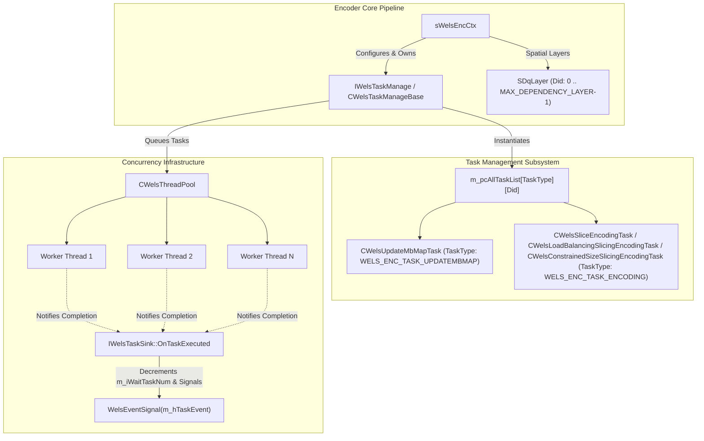
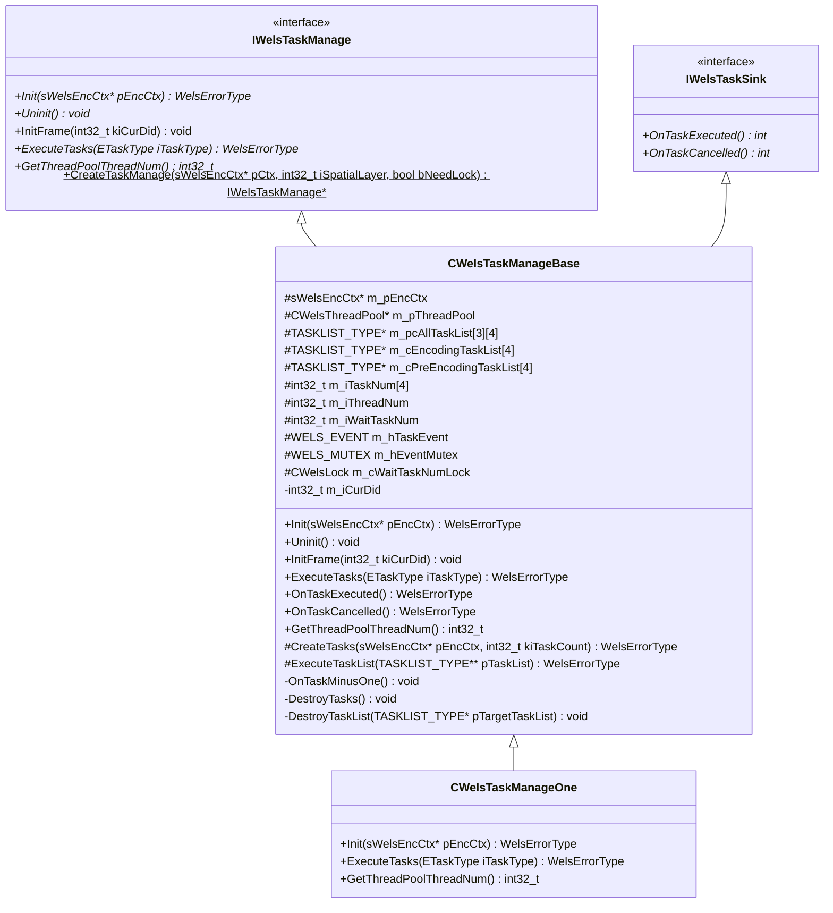
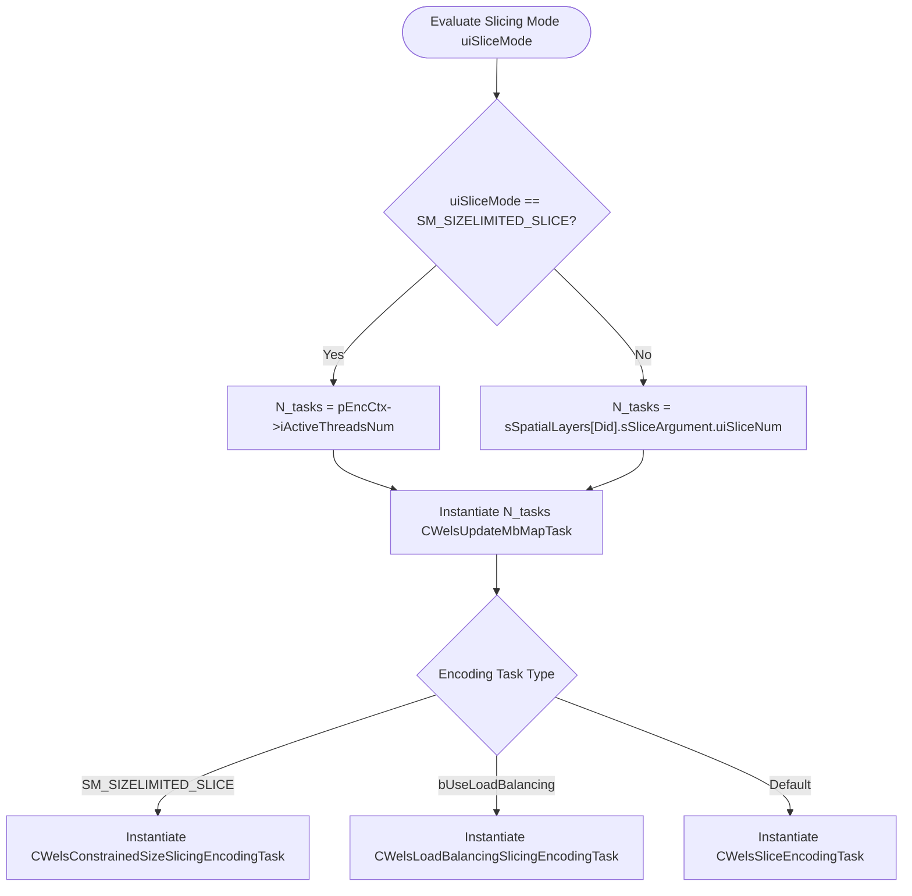
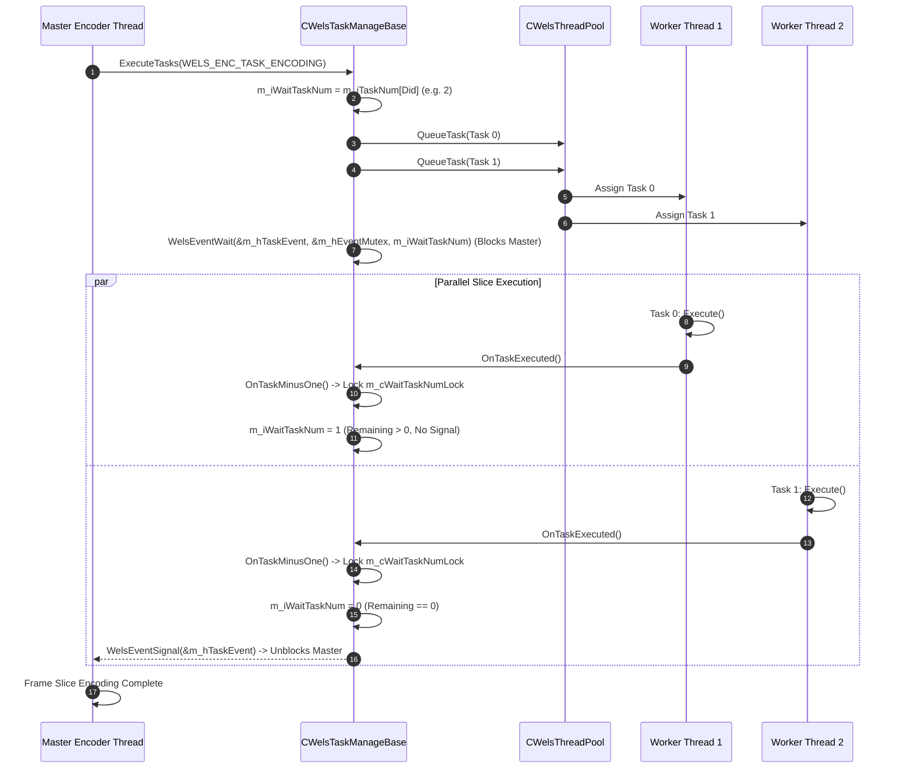

# OpenH264 Encoder Task Management: `wels_task_management.h`

This document provides a comprehensive, literate-programming-style technical specification of the multi-threading task dispatching and synchronization subsystem in the OpenH264 video encoder, declared in [wels_task_management.h](openh264/codec/encoder/core/inc/wels_task_management.h) and implemented in [wels_task_management.cpp](openh264/codec/encoder/core/src/wels_task_management.cpp).

---

## Table of Contents
1. [Architectural Overview & Module Purpose](#1-architectural-overview--module-purpose)
2. [Class & Interface Hierarchy](#2-class--interface-hierarchy)
3. [Interface Specification: `IWelsTaskManage`](#3-interface-specification-iwelstaskmanage)
4. [Class Specification: `CWelsTaskManageBase`](#4-class-specification-cwelstaskmanagebase)
5. [Class Specification: `CWelsTaskManageOne`](#5-class-specification-cwelstaskmanageone)
6. [Mathematical & Algorithmic Foundations](#6-mathematical--algorithmic-foundations)
7. [Thread Synchronization & Concurrency Model](#7-thread-synchronization--concurrency-model)
8. [Memory Management & Lifecycle Invariants](#8-memory-management--lifecycle-invariants)
9. [Related Source Files & Code Map](#9-related-source-files--code-map)

---

## 1. Architectural Overview & Module Purpose

In modern H.264/AVC and SVC encoding pipelines, real-time performance and low encoding latency require parallel execution across multiple CPU cores. OpenH264 achieves frame-level and slice-level multi-threading by decomposing frame encoding workloads into discrete tasks executed concurrently by worker threads in a shared thread pool ([CWelsThreadPool](openh264/codec/common/inc/WelsThreadPool.h#L53-L116)).

The header [wels_task_management.h](openh264/codec/encoder/core/inc/wels_task_management.h) defines the abstract interface [IWelsTaskManage](openh264/codec/encoder/core/inc/wels_task_management.h#L51-L65) and its concrete implementations [CWelsTaskManageBase](openh264/codec/encoder/core/inc/wels_task_management.h#L68-L120) and [CWelsTaskManageOne](openh264/codec/encoder/core/inc/wels_task_management.h#L122-L131).



### Key Responsibilities:
1. **Task Graph Topology Management**: Creates, categorizes, and indexes encoding tasks per spatial dependency layer ($0 \le \text{Did} < \text{MAX\_DEPENDENCY\_LAYER}$) and task classification type (`ETaskType`).
2. **Dynamic Task Instantiation**: Constructs appropriate slice encoding task objects depending on the active slicing mode:
   - `SM_SIZELIMITED_SLICE`: [CWelsConstrainedSizeSlicingEncodingTask](openh264/codec/encoder/core/inc/wels_task_encoder.h#L110-L122)
   - Load-balanced slicing (`bUseLoadBalancing == true`): [CWelsLoadBalancingSlicingEncodingTask](openh264/codec/encoder/core/inc/wels_task_encoder.h#L93-L108)
   - Fixed slice count / raster slicing: [CWelsSliceEncodingTask](openh264/codec/encoder/core/inc/wels_task_encoder.h#L54-L91)
   - Dynamic MB map adjustment: [CWelsUpdateMbMapTask](openh264/codec/encoder/core/inc/wels_task_encoder.h#L125-L138)
3. **Thread Pool Integration & Task Dispatching**: Interacts with the shared [CWelsThreadPool](openh264/codec/common/inc/WelsThreadPool.h#L53-L116) singleton to queue tasks to idle worker threads.
4. **Barrier Synchronization & Event Signaling**: Implements an atomic countdown barrier using [WELS_EVENT](openh264/codec/common/inc/WelsThreadLib.h#L125-L132) and [CWelsLock](openh264/codec/common/inc/WelsLock.h#L50-L71) to block the master thread until all queued slice tasks for the current frame layer have completed execution.

---

## 2. Class & Interface Hierarchy



### Type Definitions & Enumerations

| Identifier | Definition | Purpose |
| :--- | :--- | :--- |
| [`TASKLIST_TYPE`](openh264/codec/encoder/core/inc/wels_task_management.h#L70) | `CWelsNonDuplicatedList<CWelsBaseTask>` | Thread-safe, non-duplicated doubly-linked container list for task pointers. |
| [`CWelsBaseTask::ETaskType`](openh264/codec/encoder/core/inc/wels_task_base.h#L53-L61) | `enum` | Task categories: `WELS_ENC_TASK_ENCODING = 0`, `WELS_ENC_TASK_UPDATEMBMAP = 1`, `WELS_ENC_TASK_PREPROCESS = 2`, `WELS_ENC_TASK_ALL = 3`. |
| [`MAX_DEPENDENCY_LAYER`](openh264/codec/common/inc/wels_common_basis.h) | Constant (`4`) | Maximum number of spatial dependency layers supported simultaneously in SVC encoding. |

---

## 3. Interface Specification: `IWelsTaskManage`

[IWelsTaskManage](openh264/codec/encoder/core/inc/wels_task_management.h#L51-L65) defines the pure virtual API exposed to the top-level encoder context ([sWelsEncCtx](openh264/codec/encoder/core/inc/encoder_context.h#L116-L238)).

### Method Signatures & Behavioral Contracts

#### 1. `virtual ~IWelsTaskManage()`
* **Declaration**: [wels_task_management.h:L53](openh264/codec/encoder/core/inc/wels_task_management.h#L53)
* **Description**: Virtual destructor ensuring correct polymorphic cleanup of derived task manager instances.

#### 2. `virtual WelsErrorType Init (sWelsEncCtx* pEncCtx) = 0`
* **Declaration**: [wels_task_management.h:L55](openh264/codec/encoder/core/inc/wels_task_management.h#L55)
* **Parameters**: `pEncCtx` - Pointer to the master encoder context state machine.
* **Return Value**: `ENC_RETURN_SUCCESS` (0) on success, or an error code (e.g. `ENC_RETURN_MEMALLOCERR`).
* **Contract**: Allocates internal task lists, initializes synchronization primitives, acquires reference to [CWelsThreadPool](openh264/codec/common/inc/WelsThreadPool.h#L53-L116), and pre-allocates tasks for all active spatial layers.

#### 3. `virtual void Uninit() = 0`
* **Declaration**: [wels_task_management.h:L56](openh264/codec/encoder/core/inc/wels_task_management.h#L56)
* **Contract**: Destroys all pre-allocated tasks, drains and releases thread pool references, and closes operating system synchronization events/mutexes.

#### 4. `virtual void InitFrame (const int32_t kiCurDid)`
* **Declaration**: [wels_task_management.h:L58](openh264/codec/encoder/core/inc/wels_task_management.h#L58)
* **Parameters**: `kiCurDid` - Spatial dependency layer index ($0 \le \text{kiCurDid} < \text{MAX\_DEPENDENCY\_LAYER}$) of the current frame being encoded.
* **Default Implementation**: Empty stub. Overridden in `CWelsTaskManageBase` to record current layer and conditionally execute MB map update tasks if dynamic slicing re-adjustment is flagged.

#### 5. `virtual WelsErrorType ExecuteTasks (const CWelsBaseTask::ETaskType iTaskType = CWelsBaseTask::WELS_ENC_TASK_ENCODING) = 0`
* **Declaration**: [wels_task_management.h:L59-L60](openh264/codec/encoder/core/inc/wels_task_management.h#L59-L60)
* **Parameters**: `iTaskType` - Type of tasks to execute (`WELS_ENC_TASK_ENCODING` by default).
* **Return Value**: `ENC_RETURN_SUCCESS` (0) on successful completion of all batch tasks.
* **Contract**: Dispatches all tasks of the specified type for the active dependency layer into the thread pool and blocks until all worker threads complete their respective tasks.

#### 6. `static IWelsTaskManage* CreateTaskManage (sWelsEncCtx* pCtx, const int32_t iSpatialLayer, const bool bNeedLock)`
* **Declaration**: [wels_task_management.h:L62](openh264/codec/encoder/core/inc/wels_task_management.h#L62)
* **Implementation**: [wels_task_management.cpp:L58-L73](openh264/codec/encoder/core/src/wels_task_management.cpp#L58-L73)
* **Factory Logic**:
  ```cpp
  IWelsTaskManage* pTaskManage = WELS_NEW_OP (CWelsTaskManageBase(), CWelsTaskManageBase);
  if (ENC_RETURN_SUCCESS != pTaskManage->Init (pCtx)) {
    pTaskManage->Uninit();
    WELS_DELETE_OP (pTaskManage);
  }
  return pTaskManage;
  ```

#### 7. `virtual int32_t GetThreadPoolThreadNum() = 0`
* **Declaration**: [wels_task_management.h:L64](openh264/codec/encoder/core/inc/wels_task_management.h#L64)
* **Return Value**: Active number of worker threads configured in the underlying thread pool.

---

## 4. Class Specification: `CWelsTaskManageBase`

[CWelsTaskManageBase](openh264/codec/encoder/core/inc/wels_task_management.h#L68-L120) is the standard multi-threaded task management implementation. It implements both [IWelsTaskManage](openh264/codec/encoder/core/inc/wels_task_management.h#L51-L65) and [IWelsTaskSink](openh264/codec/common/inc/WelsTask.h#L48-L52).

### Member Variables & Memory Layout

```
+-----------------------------------------------------------------------------------------------+
| CWelsTaskManageBase Memory Layout                                                             |
+-----------------------------------------------------------------------------------------------+
| vptr (IWelsTaskManage, IWelsTaskSink)                                                         |
| m_pEncCtx                      : sWelsEncCtx*                  (Master Encoder Context)       |
| m_pThreadPool                  : CWelsThreadPool*              (Shared Thread Pool Instance)  |
| m_pcAllTaskList[3][4]          : TASKLIST_TYPE* [3][4]         (Task Matrix: [Type][Did])     |
| m_cEncodingTaskList[4]         : TASKLIST_TYPE* [4]            (Slice Encoding Task Lists)    |
| m_cPreEncodingTaskList[4]      : TASKLIST_TYPE* [4]            (Pre-Encoding Task Lists)      |
| m_iTaskNum[4]                  : int32_t [4]                   (Task count per Did)           |
| m_iThreadNum                   : int32_t                       (Configured thread count)      |
| m_iWaitTaskNum                 : int32_t                       (Remaining tasks in flight)    |
| m_hTaskEvent                   : WELS_EVENT                    (OS Event / Condition Var)     |
| m_hEventMutex                  : WELS_MUTEX                    (Mutex protecting OS Event)    |
| m_cWaitTaskNumLock             : CWelsLock                     (Mutex protecting countdown)   |
| m_iCurDid                      : int32_t                       (Current active Did)           |
+-----------------------------------------------------------------------------------------------+
```

| Member Variable | Type | Protection | Description & Thread-Safety Role |
| :--- | :--- | :--- | :--- |
| `m_pEncCtx` | `sWelsEncCtx*` | `protected` | Pointer to the top-level encoder context state machine. |
| `m_pThreadPool` | `CWelsThreadPool*` | `protected` | Reference-counted singleton instance of the worker thread pool. |
| `m_pcAllTaskList` | `TASKLIST_TYPE* [3][4]` | `protected` | Task matrix mapping `[TaskType][Did]` to the corresponding task linked list. |
| `m_cEncodingTaskList` | `TASKLIST_TYPE* [4]` | `protected` | Per-layer task lists for slice encoding tasks (`WELS_ENC_TASK_ENCODING`). |
| `m_cPreEncodingTaskList`| `TASKLIST_TYPE* [4]` | `protected` | Per-layer task lists for MB map adjustment tasks (`WELS_ENC_TASK_UPDATEMBMAP`). |
| `m_iTaskNum` | `int32_t [4]` | `protected` | Number of allocated tasks for each spatial layer index ($0 \le \text{Did} < 4$). |
| `m_iThreadNum` | `int32_t` | `protected` | Requested worker thread count, obtained from `pEncCtx->pSvcParam->iMultipleThreadIdc`. |
| `m_iWaitTaskNum` | `int32_t` | `protected` | In-flight task countdown variable. Initialized to `m_iTaskNum[m_iCurDid]` at batch launch. |
| `m_hTaskEvent` | `WELS_EVENT` | `protected` | OS synchronization event handle signaled when `m_iWaitTaskNum` reaches zero. |
| `m_hEventMutex` | `WELS_MUTEX` | `protected` | Mutex associated with `m_hTaskEvent` for condition variable waiting. |
| `m_cWaitTaskNumLock` | `CWelsLock` | `protected` | Mutex wrapper providing critical section protection for `m_iWaitTaskNum` updates. |
| `m_iCurDid` | `int32_t` | `private` | Active spatial layer index for the current encoding operation. |

---

### Detailed Method Breakdown

#### 1. Constructor & Destructor
* **Constructor** [wels_task_management.cpp:L76-L89](openh264/codec/encoder/core/src/wels_task_management.cpp#L76-L89):
  - Initializes `m_pEncCtx`, `m_pThreadPool` to `NULL`, and `m_iWaitTaskNum` to 0.
  - Allocates empty `TASKLIST_TYPE` objects for each spatial layer:
    ```cpp
    for (int32_t iDid = 0; iDid < MAX_DEPENDENCY_LAYER; iDid++) {
      m_iTaskNum[iDid] = 0;
      m_cEncodingTaskList[iDid] = new TASKLIST_TYPE();
      m_cPreEncodingTaskList[iDid] = new TASKLIST_TYPE();
    }
    ```
  - Calls `WelsEventOpen (&m_hTaskEvent)` and `WelsMutexInit (&m_hEventMutex)`.
* **Destructor** [wels_task_management.cpp:L91-L94](openh264/codec/encoder/core/src/wels_task_management.cpp#L91-L94):
  - Invokes `Uninit()` to release all dynamically allocated task objects, list headers, and OS synchronization primitives.

#### 2. `Init (sWelsEncCtx* pEncCtx)`
* **Source**: [wels_task_management.cpp:L96-L124](openh264/codec/encoder/core/src/wels_task_management.cpp#L96-L124)
* **Execution Flow**:
  1. Records `m_pEncCtx = pEncCtx` and extracts `m_iThreadNum = pEncCtx->pSvcParam->iMultipleThreadIdc`.
  2. Sets thread pool size via `CWelsThreadPool::SetThreadNum (m_iThreadNum)` and increments reference count via `CWelsThreadPool::AddReference()`.
  3. Verifies thread allocation against thread pool capacity.
  4. Populates `m_pcAllTaskList` pointers and creates tasks for each spatial layer:
     ```cpp
     for (int32_t iDid = 0; iDid < MAX_DEPENDENCY_LAYER; iDid++) {
       m_pcAllTaskList[CWelsBaseTask::WELS_ENC_TASK_ENCODING][iDid] = m_cEncodingTaskList[iDid];
       m_pcAllTaskList[CWelsBaseTask::WELS_ENC_TASK_UPDATEMBMAP][iDid] = m_cPreEncodingTaskList[iDid];
       iReturn |= CreateTasks (pEncCtx, iDid);
     }
     ```

#### 3. `CreateTasks (sWelsEncCtx* pEncCtx, const int32_t kiCurDid)`
* **Source**: [wels_task_management.cpp:L143-L177](openh264/codec/encoder/core/src/wels_task_management.cpp#L143-L177)
* **Task Count Derivation**:
  - Examines slice mode `uiSliceMode = pEncCtx->pSvcParam->sSpatialLayers[kiCurDid].sSliceArgument.uiSliceMode`:
    $$\text{TaskCount} = \begin{cases} pEncCtx\to iActiveThreadsNum & \text{if } uiSliceMode == \text{SM\_SIZELIMITED\_SLICE} \\ uiSliceNum & \text{otherwise} \end{cases}$$
* **Task Allocation**:
  1. Instantiates `kiTaskCount` instances of [CWelsUpdateMbMapTask](openh264/codec/encoder/core/inc/wels_task_encoder.h#L125-L138) and pushes them onto `m_cPreEncodingTaskList[kiCurDid]`.
  2. Instantiates `kiTaskCount` instances of slice encoding tasks depending on configuration:
     - `SM_SIZELIMITED_SLICE` $\to$ `CWelsConstrainedSizeSlicingEncodingTask`
     - `bUseLoadBalancing == true` $\to$ `CWelsLoadBalancingSlicingEncodingTask`
     - Standard fixed slicing $\to$ `CWelsSliceEncodingTask`
  3. Pushes encoding tasks onto `m_cEncodingTaskList[kiCurDid]`.

#### 4. `InitFrame (const int32_t kiCurDid)`
* **Source**: [wels_task_management.cpp:L246-L251](openh264/codec/encoder/core/src/wels_task_management.cpp#L246-L251)
* **Logic**:
  - Updates active layer index `m_iCurDid = kiCurDid`.
  - Checks if slice boundary adjustment is required (`bNeedAdjustingSlicing`):
    ```cpp
    if (m_pEncCtx->pCurDqLayer->bNeedAdjustingSlicing) {
      ExecuteTaskList (m_pcAllTaskList[CWelsBaseTask::WELS_ENC_TASK_UPDATEMBMAP]);
    }
    ```

#### 5. `ExecuteTasks (const CWelsBaseTask::ETaskType iTaskType)`
* **Source**: [wels_task_management.cpp:L253-L255](openh264/codec/encoder/core/src/wels_task_management.cpp#L253-L255)
* **Logic**: Delegates directly to `ExecuteTaskList (m_pcAllTaskList[iTaskType])`.

#### 6. `ExecuteTaskList (TASKLIST_TYPE** pTaskList)`
* **Source**: [wels_task_management.cpp:L226-L244](openh264/codec/encoder/core/src/wels_task_management.cpp#L226-L244)
* **Algorithmic Flow**:
  1. Sets in-flight wait count `m_iWaitTaskNum = m_iTaskNum[m_iCurDid]`.
  2. If `m_iWaitTaskNum == 0`, returns immediately with `ENC_RETURN_SUCCESS`.
  3. Captures target task list pointer `pTargetTaskList = pTaskList[m_iCurDid]`.
  4. Iterates through all tasks in the list and enqueues each to the thread pool:
     ```cpp
     int32_t iCurrentTaskCount = m_iWaitTaskNum;
     for (int32_t iIdx = 0; iIdx < iCurrentTaskCount; iIdx++) {
       m_pThreadPool->QueueTask (pTargetTaskList->getNode (iIdx));
     }
     ```
  5. Enters barrier wait:
     ```cpp
     WelsEventWait (&m_hTaskEvent, &m_hEventMutex, m_iWaitTaskNum);
     ```
  6. Returns `ENC_RETURN_SUCCESS` once all tasks have executed and unblocked the barrier.

#### 7. `OnTaskExecuted()` and `OnTaskCancelled()`
* **Source**: [wels_task_management.cpp:L216-L224](openh264/codec/encoder/core/src/wels_task_management.cpp#L216-L224)
* **Logic**: Both callbacks invoke `OnTaskMinusOne()` to update countdown state.

#### 8. `OnTaskMinusOne()`
* **Source**: [wels_task_management.cpp:L201-L214](openh264/codec/encoder/core/src/wels_task_management.cpp#L201-L214)
* **Thread-Safe Countdown**:
  ```cpp
  WelsCommon::CWelsAutoLock cAutoLock (m_cWaitTaskNumLock);
  WelsEventSignal (&m_hTaskEvent, &m_hEventMutex, &m_iWaitTaskNum);
  ```
  `WelsEventSignal` atomically decrements `*iCondition` (`m_iWaitTaskNum`) and signals `m_hTaskEvent` when `m_iWaitTaskNum <= 0`.

---

## 5. Class Specification: `CWelsTaskManageOne`

[CWelsTaskManageOne](openh264/codec/encoder/core/inc/wels_task_management.h#L122-L131) is a specialized, lightweight single-threaded subclass used for testing, sequential debugging, and environments where multi-threading is disabled.

### Architectural Difference vs `CWelsTaskManageBase`

Unlike `CWelsTaskManageBase`, which queues tasks to `CWelsThreadPool` and waits on an OS event barrier, `CWelsTaskManageOne`:
1. Executes tasks synchronously on the calling thread.
2. Reports a constant thread pool size of 1 (`GetThreadPoolThreadNum() { return 1; }`).
3. Drains and executes tasks directly in a `while` loop:
   ```cpp
   WelsErrorType CWelsTaskManageOne::ExecuteTasks (const CWelsBaseTask::ETaskType iTaskType) {
     while (NULL != m_cEncodingTaskList[0]->begin()) {
       (m_cEncodingTaskList[0]->begin())->Execute();
       m_cEncodingTaskList[0]->pop_front();
     }
     return ENC_RETURN_SUCCESS;
   }
   ```

---

## 6. Mathematical & Algorithmic Foundations

### Slice Task Partitioning Formulation

Let $D$ denote the spatial dependency layer index ($0 \le D < \text{MAX\_DEPENDENCY\_LAYER}$). Let $M(D)$ be the slicing mode configured for layer $D$:

$$M(D) \in \{ \text{SM\_SINGLE\_SLICE}, \text{SM\_FIXEDSLCNUM\_SLICE}, \text{SM\_RASTER\_SLICE}, \text{SM\_SIZELIMITED\_SLICE} \}$$

The allocated task count $N_{\text{tasks}}(D)$ is determined by:

$$N_{\text{tasks}}(D) = \begin{cases} 
N_{\text{threads}} & \text{if } M(D) = \text{SM\_SIZELIMITED\_SLICE} \\ 
N_{\text{slices}}(D) & \text{otherwise} 
\end{cases}$$

where $N_{\text{threads}} = \text{pEncCtx}\to\text{iActiveThreadsNum}$ and $N_{\text{slices}}(D) = \text{sSpatialLayers}[D].\text{sSliceArgument}.\text{uiSliceNum}$.



---

## 7. Thread Synchronization & Concurrency Model

### Synchronization Barrier Protocol

The barrier synchronization mechanism coordinates execution between the main encoder thread and the worker threads in `CWelsThreadPool`.



### Invariant Equations for Thread Barrier:

1. **Initial Condition**:
   $$m\_iWaitTaskNum_0 = N_{\text{tasks}}(D)$$
2. **Step Transition (on each worker completion)**:
   $$m\_iWaitTaskNum_{k+1} = m\_iWaitTaskNum_k - 1$$
3. **Barrier Release Predicate**:
   $$\text{Signal}(m\_hTaskEvent) \iff m\_iWaitTaskNum_{k+1} \le 0$$

---

## 8. Memory Management & Lifecycle Invariants

1. **RAII & Object Ownership**:
   - `CWelsTaskManageBase` owns all task lists (`m_cEncodingTaskList`, `m_cPreEncodingTaskList`) and individual task instances (`CWelsBaseTask*`).
   - Task destruction is centralized in `DestroyTasks()` and `DestroyTaskList()`, ensuring zero memory leaks upon context reset or destruction.
2. **Thread Pool Reference Counting**:
   - `CWelsThreadPool` is a process-wide shared singleton.
   - `CWelsTaskManageBase::Init()` increments the reference counter via `CWelsThreadPool::AddReference()`.
   - `CWelsTaskManageBase::Uninit()` decrements the counter via `m_pThreadPool->RemoveInstance()`.
3. **Copy Prohibition**:
   - Copy construction and assignment are explicitly disallowed via `DISALLOW_COPY_AND_ASSIGN (CWelsTaskManageBase)` to prevent shallow-copy aliasing of mutexes, OS event handles, and task pointers.

---

## 9. Related Source Files & Code Map

| File Path | Description |
| :--- | :--- |
| [wels_task_management.h](openh264/codec/encoder/core/inc/wels_task_management.h) | Primary header declaring `IWelsTaskManage`, `CWelsTaskManageBase`, and `CWelsTaskManageOne`. |
| [wels_task_management.cpp](openh264/codec/encoder/core/src/wels_task_management.cpp) | Implementation of task allocation, execution dispatching, and event barrier synchronization. |
| [wels_task_base.h](openh264/codec/encoder/core/inc/wels_task_base.h) | Declares base task class `CWelsBaseTask` and enumeration `ETaskType`. |
| [wels_task_encoder.h](openh264/codec/encoder/core/inc/wels_task_encoder.h) | Declares concrete slice encoding and MB map update task classes. |
| [slice_multi_threading.h](openh264/codec/encoder/core/inc/slice_multi_threading.h) | Slice-based multi-threading helper interfaces and dynamic slicing logic. |
| [WelsThreadPool.h](openh264/codec/common/inc/WelsThreadPool.h) | Shared worker thread pool singleton managing OS worker threads. |
| [WelsTask.h](openh264/codec/common/inc/WelsTask.h) | Declares abstract base interfaces `IWelsTask` and `IWelsTaskSink`. |
| [WelsLock.h](openh264/codec/common/inc/WelsLock.h) | RAII mutex and scoped auto-lock wrappers (`CWelsLock`, `CWelsAutoLock`). |
| [encoder_context.h](openh264/codec/encoder/core/inc/encoder_context.h) | Master encoder context `sWelsEncCtx` holding `pTaskManage`. |
